# day74 gitlab_jenkins

官方文档

[<font style="color:blue;">https://git-scm.com/book/zh/v2</font>](https://git-scm.com/book/zh/v2)


gitlab 10.0.0.200

jenkins 10.0.0.201

#  git 安装与配置
```bash
git准备环境
getenforce  #关闭 SELinux
yum install git
git version

[root@hostname200 ~]# git config
用法：git config [选项]
配置文件位置
    --global              使用全局配置文件
    --system              使用系统级配置文件
    --local               使用版本库级配置文件
    -f, --file <文件>     使用指定的配置文件
    --blob <blob-id>      read config from given blob object 
操作
    --get                 获取值：name [value-regex]
    --get-all             获得所有的值：key [value-regex]
    --get-regexp          根据正则表达式获得值：name-regex [value-regex]
    --replace-all         替换所有匹配的变量：name value [value_regex]
    --add                 添加一个新的变量：name value
    --unset               删除一个变量：name [value-regex]
    --unset-all           删除所有匹配项：name [value-regex]
    --rename-section      重命名小节：old-name new-name
    --remove-section      删除一个小节：name
    -l, --list            列出所有
    -e, --edit            打开一个编辑器
    --get-color <slot>    找到配置的颜色：[默认]
    --get-colorbool <slot>
                          找到颜色设置：[stdout-is-tty]
类型
    --bool                值是 "true" 或 "false"
    --int                 值是十进制数
    --bool-or-int         值是 --bool or --int
    --path                值是一个路径（文件或目录名）
其它
    -z, --null            终止值是NUL字节
    --includes            查询时参照 include 指令递归查找
 

# 配置
git config --global user.name "ckh"
git config --global user.email 343264992@qq.com
git config --global color.ui true
# git config --list
user.name=ckh
user.email=343264992@qq.com
color.ui=true
# cat ~/.gitconfig
[user]
  name = ckh
  email = 343264992@qq.com
[color]
  ui = true
 
```

 

# GIT常规使用
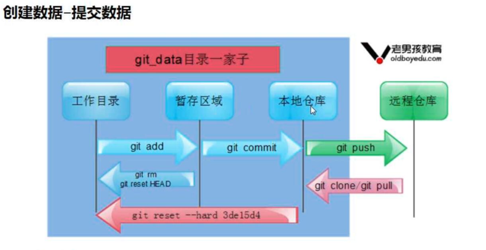

git四种状态

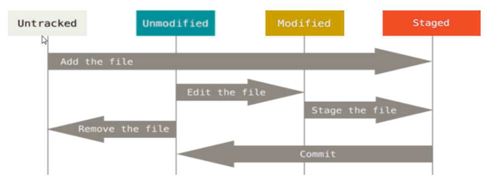

 

```bash
# 初始化目录
mkdir git_data
cd git_data/
git init

# ls -l .git
total 12
drwxr-xr-x 2 root root   6 Sep  7 00:55 branches  # 分支目录
-rw-r--r-- 1 root root  92 Sep  7 00:55 config    # 定义项目特有的配置选项
-rw-r--r-- 1 root root  73 Sep  7 00:55 description # 仅供git web程序使用
-rw-r--r-- 1 root root  23 Sep  7 00:55 HEAD      # 指示当前的分支
drwxr-xr-x 2 root root 242 Sep  7 00:55 hooks     # 包含git钩子文件
drwxr-xr-x 2 root root  21 Sep  7 00:55 info      # 包含一个全局排除文件(exclude文件)
drwxr-xr-x 4 root root  30 Sep  7 00:55 objects   # 存放所有数据内容，有info和pack两个子文件夹
drwxr-xr-x 4 root root  31 Sep  7 00:55 refs      # 存放指向数据(分支)的提交对象的指针
index # 保存暂存区信息，在执行git init的时候，这个文件还没有 


git status
touch a b c
git status
git add a
git status
git rm -f a
git status
ls
git add b
git commit -m "add file b"
git status
git log
# MV改名 git认为是删除了文件 然后回滚
touch test
git add test
git status
mv test test.txt
git status
git add test.txt
git status
git checkout test  #将上面删除的test 从新放入暂存区
ll

# 取消 暂存区文件
git reset test test.txt
git status

 
 
git mv  工作区和暂存区同时改
ls
rm test.txt
git add test
git status
git mv test test.txt
git status
echo aaa> test.txt
ll
cat test.txt
git status

#比对 工作目录 和暂存区的文件不同
git diff test.txt

# 提交暂存区
git add test.txt
git diff test.txt  # 没有修改状态信息
git status   #新文件

#提交仓库
git commit -m "add test.txt file aaa"
git status
#查看已经被暂存（staged）但尚未提交（committed）的文件 test.txt 的差异
# 查看暂存区中 test.txt 文件与上一次提交之间的差异。
git diff --cached test.txt
 
# 修改 在提交在比较
echo bbb>>test.txt
git add test.txt
git diff --cached test.txt
 
#这是 工作目录 和暂存区对比
git diff test.txt
git diff  #所有对比
 
# 已经在仓库的文件  修改后快速提交  -am
echo ccc>>test.txt
cat test.txt
git commit -am "add test file ccc"
git status   #显示工作区状态


git基础命令
git add file  或  git add .  将工作目录文件添加到暂存区
git rm --cached 只删暂存区
git rm -f file  删除暂存区和工作目录源文件，不会删除仓库里面的文件。
git status
git commit -m "修改了很多bug"
git checkout -- file 放弃工作区的改动，修改的部份会被回滚
git mv        这种改名操作会被跟踪
git diff file 比对的工作目录和暂存区域
git diff --cached file 比对暂存区和仓库里的区别，前提是在工作区修改后要先将文件添加到暂存区才能比对git add file
git commit -am "日志" 适用于已要提交到仓库的文件，如果在工作目录修改了，可以直接这样提交到仓库，不需要再添加一次再提交。
git log      查看日志
git log --oneline  以单行显示日志
 
# 提交日志记录   oneline 一行简单显示信息
git log --oneline

# 多了 HEAD指向 最新一次提交信息   当前指针指向哪里
git log --oneline --decorate

#显示每次版本修改的详细信息
git log -p

# -2 显示2条版本提交信息
git log -2

#仓库 如何恢复 之前的版本
echo dddd >test.txt
ls
cat test.txt
git commit -am "add dddd"
git status
git log --oneline
#回滚到 add a c 的内容
git reset --hard caa84b8

#假如回滚错了 要回滚上一次的93bb2f6 add test file ccc
git reflog   #查看所有记录包括回滚记录
git reset --hard 93bb2f6
ls  #看test.txt 文件又回来咯
cat  test.txt

查看分支
git branch

# 创建分支 testing
git branch tesing
git branch
git checkout tesing  #切换到分支 'tesing'
git branch

 
echo aaa>a
git commit -am "add aaa"
echo bbb>>a
git commit -am "add bbb"
echo ccc>>a
git commit -am "add ccc"
git log --oneline --decorate

分支操作
git branch test
git checkout test  #切换到分支 'test'
ll
git branch
git log --oneline --decorate
touch test
git add .
git commit -m "add branch test file"
git log --oneline --decorate
git checkout master
git log --oneline --decorate
touch master
git add .
git commit  -m "add branch master"
git log --oneline --decorate
git branch
#在 master主分支上合并test分支, 弹出vim直接:wq保存就可以
git merge test
ll
git log --oneline --decorate
git checkout master
git branch -D tesing   #已删除分支 tesing（曾为 1d4dcca）。
git checkout testing

git status
git checkout master
#合并时候 提示 oldboy.txt有冲突内容
git merge testing
vim oldboy
vim oldboy.txt
git merge testing

 
 
# git管理标签
#标签是打的commit 提交的内容  可以用标签名进行回滚
git tag -a v1.0 -m "aaa bbb master tesing version v1.0" 
git tag -a v2.0 -m "tag 2.0"
git tag -a v2.0 dbead4c -m "add bbb version v2.0"
git show v1.0
git reset --hard v2.0
git reset --hard v1.0
git tag -d v2.0 
 
```

 

## github
```bash
git remote add origin https://github.com/chengkanghua178/test.git
ssh-keygen -t rsa

# cat ~/.ssh/id_rsa.pub
ssh-rsa AAAAB3NzaC1yc2EAAAADAQABAAABAQC6AdESjpuMKYuAsigzFGLYtmxPOTOM8hV74lx0n2+idAfwmr2XPncjJB7SrRFDzCyEsTCJfjWm2hArVaM6p9CgUubItnwwbmv11ZXfPvHJVqfcThi50nJklab8WcxRHTmcv6m2/RRqsnX2hsx4Zb8VG9Zzta/MGje0SHO4T1PXU9zNJOK+TKHhs4P8gjHbqJ96cyFsZxlnCUbhK/8IUmNLqELGzRithd1qVrgjtsYvBSWyL0ZGn9Dpp4I6EOPNXlxmrymhhHsrLXQvEmIk/CFtGIUBRN9FfJVQdG1+jK4Ap2zJWDDMMvUVov82f7gWV9lf98HwJAK6U180X2nDTFqx root@m01
```

 

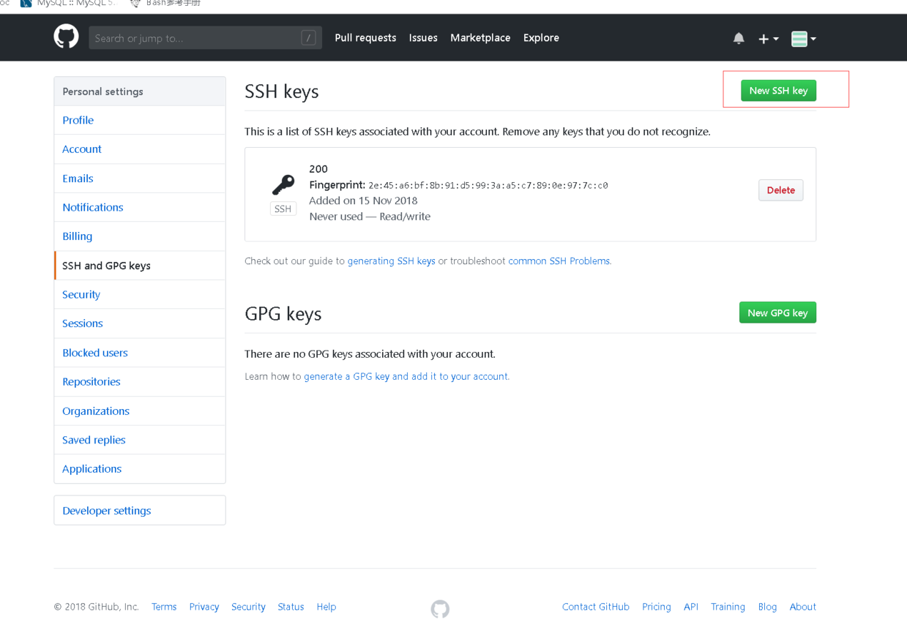

 

```bash
# git push -u origin master

 
 
```


git clone 克隆

 

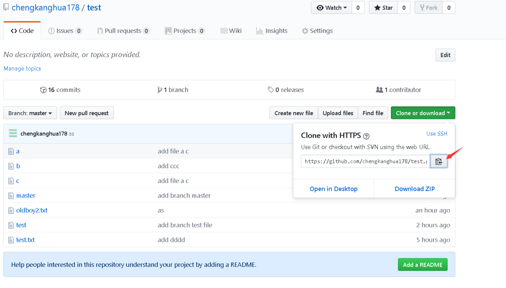

```bash
# git clone https://github.com/chengkanghua178/test.git

```

 

 

# gitlab
[<font style="color:blue;">https://docs.gitlab.com.cn/</font>](https://docs.gitlab.com.cn/)

```bash
yum install -y curl policycoreutils-python openssh-server patch
rpm -ivh gitlab-ce-10.2.2-ce.0.el7.x86_64.rpm
rpm -ql gitlab-ce

#  gitlab 配置文件 更改url地址为本机IP地址
# vim /etc/gitlab/gitlab.rb
external_url 'http://192.168.137.200'
# gitlab-ctl reconfigure   #生效配置
# 浏览器访问  http://192.168.137.200
 
/opt/gitlab/                    # gitlab的程序安装目录
/var/opt/gitlab                 # gitlab目录数据目录
/var/opt/gitlab/git-dfata       # 存放仓库数据
 
gitlab-ctl status               # 查看目前gitlab所有服务运维状态
gitlab-ctl stop                 # 停止gitlab服务
gitlab-ctl stop nginx           # 单独停止某个服务
gitlab-ctl tail                 # 查看所有服务的日志
 
 gitlab汉化： 
1、下载汉化补丁
git clone https://gitlab.com/xhang/gitlab.git
2、查看全部分支版本
git branch -a
3、对比版本、生成补丁包
git diff remotes/origin/10-2-stable remotes/origin/10-2-stable-zh > ../10.2.2-zh.diff
4、停止服务器
gitlab-ctl stop
5、打补丁
patch -d /opt/gitlab/embedded/service/gitlab-rails -p1 < /tmp/10.2.2-zh.diff 
6、启动和重新配置
gitlab-ctl start
gitlab-ctl reconfigure
 
#浏览器打开设置一个默认密码  Ckh123.com
#账号默认是 root
 
git remote
git remote remove origin  #删除github远程库
git add .
git commit -m "Initial commit"
git push -u origin master

```

 


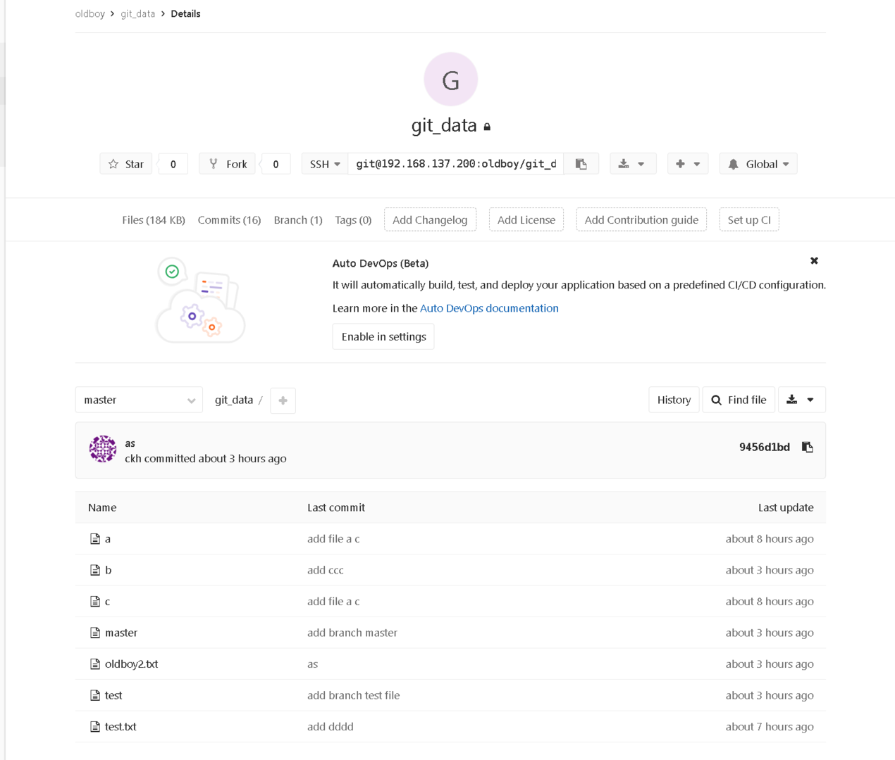

 

退出 用dev 账号登陆  默认重新设置下密码12345678

查看项目 能看到文件

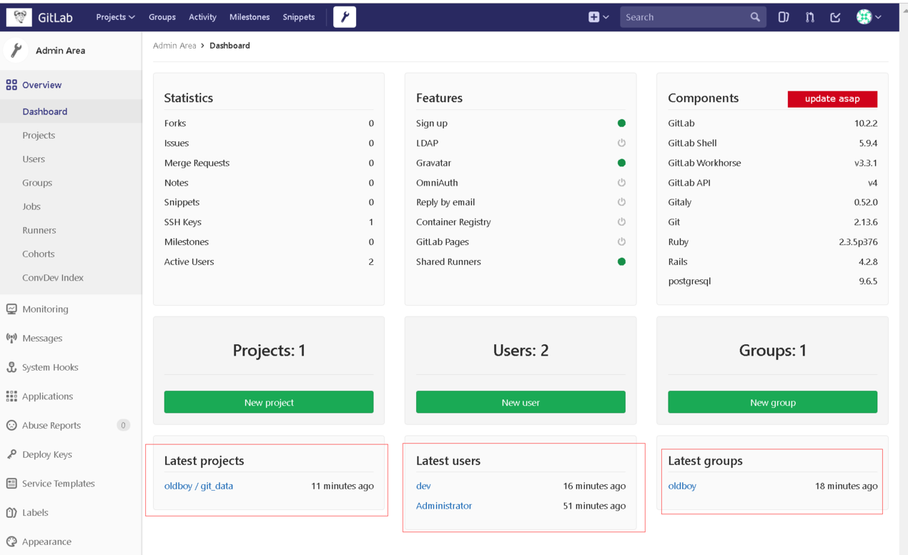

 

```bash
# dev 用户使用  (开发者所使用账号)
3 分发公钥
ssh-keygen -t rsa
 
# cat .ssh/id_rsa.pub
ssh-rsa AAAAB3NzaC1yc2EAAAADAQABAAABAQDHONq31HXSqd3A/ooHiWraDdFv45TvtJlMwSQTTMHuyb8o9NEdmyhyrbtTciGA1aUqggc+ojtKWlRFkPpTKYfhm/baFI9G2zSK+p+aUxYCrZ30CzlZ5Bus35CFt6JRchBWV0dnoqPqnmTKwTNRLANtxPqASeyrwyPziyoywqplhR7U2DquCqUGwnTdhwtu0VlFTzsw8Gkma2Or97nvkMSKUFWJwcov/YAxArVRPU7VmcOy9ozvxBC9pJg7jQBuCnj4u9Srx2UfKMVZiSmavGAAtFsXH4aChcw8owNs1R9ckv/Uv7BJjE35vN+5pFE84EEWHhz4a5TyscH3MdOJjQVN root@jenkins

```

 

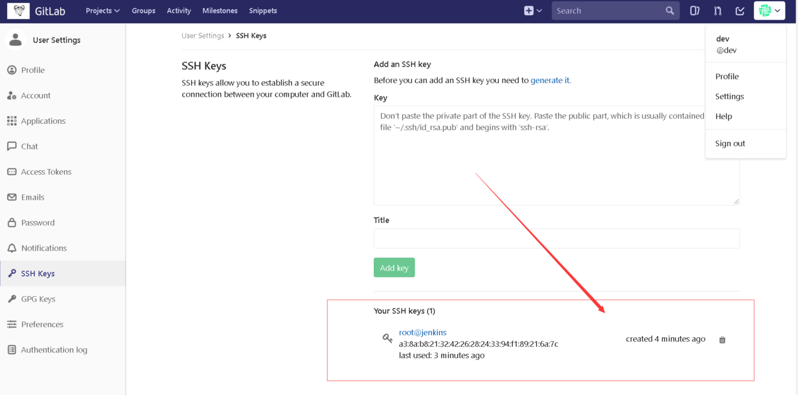

 

```bash
git clone git@192.168.137.200:oldboy/git_data.git
ls
cd git_data/
ls

创建分支
git branch dev
git branch
git checkout dev
touch dev
git add .
git commit -m "add dev"
git config --global user.email "dev@example.com"
git config --global user.name "dev"
git commit -m "add dev"
# 推送远程仓库
git push -u origin dev

```

 

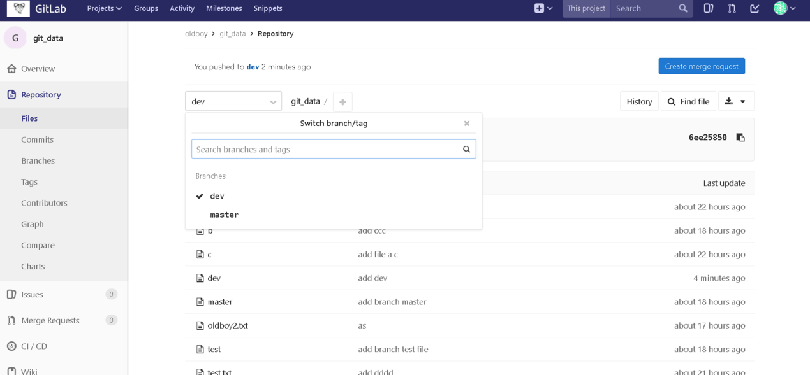

 


 

```bash
dev 用户默认可以推送 master主干代码
git branch

touch oldgirl
git add .
git commit -m "add oldgirl"
git commit -m "add oldgirl"
git push -u origin master
#返回master端测试推送，由于其他分支进行推送，和master端内容不一致，所以无法进行推送，使用git pull把代码拉取到本地，或者git fetch 把代码拉取到本地仓库后进行合并（注意：git pull = git tetch+git merge）
git pull
git push -u origin master
#每次操作前  git  pull(下载远程代码)   操作后  git push(推送代码远端)
```

 

保护master 分支不可以被合并  dev用户不可以

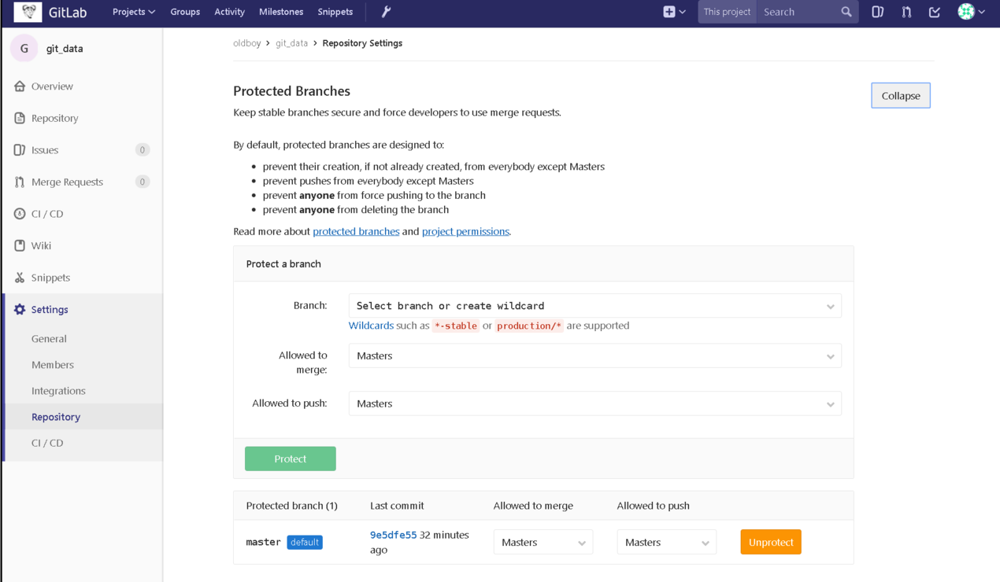

 

```bash
git branch
touch 1.txt
git add .
git commit -m "add 1.txt"
git push -u origin master

# dev账号 只能推送dev分支的
git branch
git branch -D dev   #删除分支 dev
git branch dev
git status
git branch dev
git checkout dev  #切换到分支 'dev'
git push -u origin dev #下载远端dev分支代码
git status
git branch

touch dev2.txt
git add .
git commit -m "add dev2.txt"
git push -u origin dev #推送远端服务器

```

 

网页刷新查看dev分支有dev2.txt

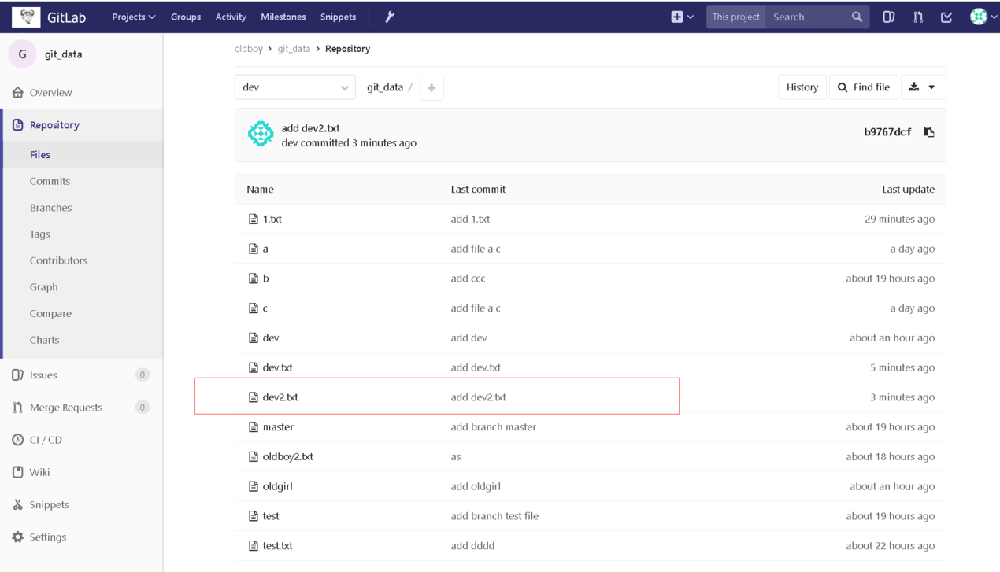

 

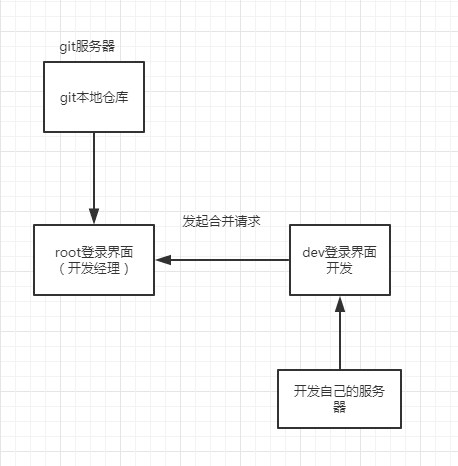

 

# jenkins
官网 jenkins.io

Jenkins是一个开源软件项目，是基于Java开发的一种持续集成工具，用于监控持续重复的工作，旨在提供一个开放易用的软件平台，使软件的持续集成变成可能。

 

1.安装准备

装备两台服务器 关闭selinux和防火墙

内存2G 50G+硬盘

jenkins  10.0.0.201

nexus    10.0.0.202

 

```bash
2.安装JDK运行环境和jenkins服务
上传JDK和jenkins rpm安装包，使用rpm -ivh进行安装,安装完JDK运维java测试是否安装成功
rpm -ivh jdk-8u181-linux-x64.rpm
rpm -ivh jenkins-2.99-1.1.noarch.rpm
 
3.配置jenkins
[root@jenkins git_data]# rpm -ql jenkins
/etc/init.d/jenkins
/etc/logrotate.d/jenkins
/etc/sysconfig/jenkins   #配置文件
/usr/lib/jenkins
/usr/lib/jenkins/jenkins.war  jenkins安装目录，WAR包会放在这里
/usr/sbin/rcjenkins
/var/cache/jenkins
/var/lib/jenkins
/var/log/jenkins
 
# 启动用户修改为root
# JENKINS_USER="root"
sed -i '/JENKINS_USER=/c JENKINS_USER="root"' /etc/sysconfig/jenkins
systemctl start jenkins
systemctl enable jenkins
访问页面进行配置
http://192.168.137.201:8080
 
# cat /var/lib/jenkins/secrets/initialAdminPassword
8d1f0c036b304eb9a9f5c2464817d405
```

 

登陆 输入密码 解锁

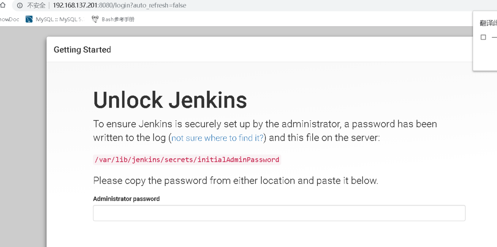

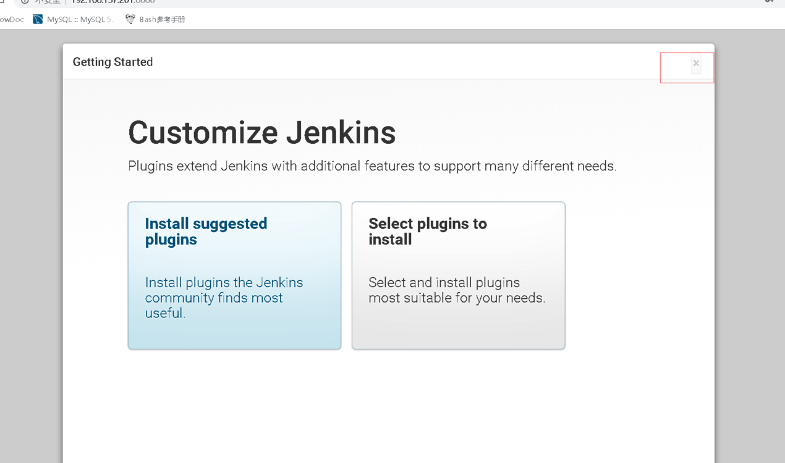

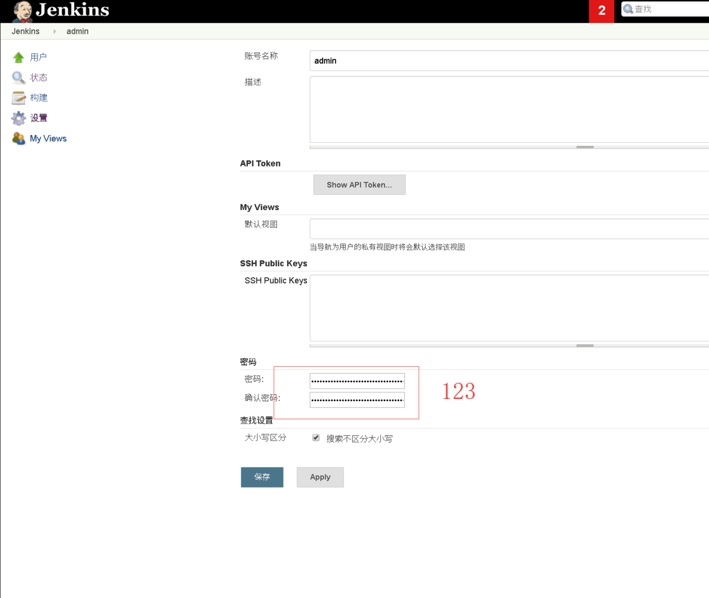

 

4.插件安装（跳过安装插件，直接上传插件到目录）和修改登录密码

 

  1.自动安装可选插件

  2.手动下载插件上传安装

  3.插件放入插件目录

```bash
[root@CentOS7 ~]# cd /var/lib/jenkins/
[root@CentOS7 jenkins]# ll     #  jobs为每次构建后构建的结果目录，plugins为插件目录
总用量 36
-rw------- 1 root root 1822 8月  26 00:35 config.xml
-rw------- 1 root root  156 8月  26 00:31 hudson.model.UpdateCenter.xml
-rw------- 1 root root 1712 8月  26 00:32 identity.key.enc
-rw------- 1 root root   94 8月  26 00:32 jenkins.CLI.xml
-rw-r--r-- 1 root root    4 8月  26 00:35 jenkins.install.InstallUtil.lastExecVersion
-rw-r--r-- 1 root root    4 8月  26 00:35 jenkins.install.UpgradeWizard.state
drwxr-xr-x 2 root root    6 8月  26 00:31 jobs
drwxr-xr-x 3 root root   18 8月  26 00:32 logs
-rw------- 1 root root  907 8月  26 00:32 nodeMonitors.xml
drwxr-xr-x 2 root root    6 8月  26 00:32 nodes
drwxr-xr-x 2 root root    6 8月  26 00:31 plugins  #插件目录
-rw------- 1 root root   64 8月  26 00:31 secret.key
-rw-r--r-- 1 root root    0 8月  26 00:31 secret.key.not-so-secret
drwx------ 4 root root 4096 8月  26 00:32 secrets
drwxr-xr-x 2 root root   23 8月  26 00:32 userContent
drwxr-xr-x 3 root root   18 8月  26 00:34 users
上传插件包解压到plugins下执行重启  systemctl restart jenkins
 
[root@jenkins jenkins]# tree users
users
└── admin
    └── config.xml    #用户配置文件
 
#上传插件文件
[root@jenkins plugins]# rz -E
rz waiting to receive.
[root@jenkins plugins]# ls
plugins.tar.gz
[root@jenkins plugins]# tar xf plugins.tar.gz
[root@jenkins plugins]# mv plugins.tar.gz /tmp/
[root@jenkins plugins]# mv plugins/* ./
[root@jenkins plugins]# systemctl restart jenkins
刷新网页 从新登陆  默认账号admin  密码是刚刚设置的123

```

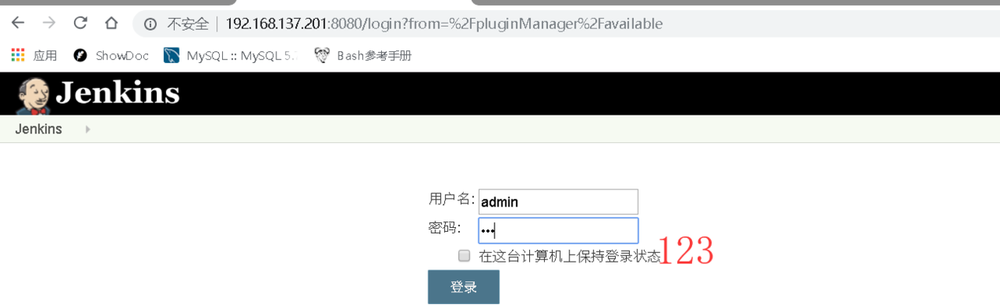

 

 

4.jenkins主要的目录

```bash
/usr/lib/jenkins/： jenkins安装目录，WAR包会放在这里
/etc/sysconfig/jenkins：jenkins配置文件，“端口”，“JENKINS_HOME”等都可以在这里配置
/var/lib/jenkins/：  默认的JENKINS_HOME
/var/log/jenkins/jenkins.log：Jenkins日志文件

```

 

5.创建一个自由风格的项目freestyle-job

创建第一个项目

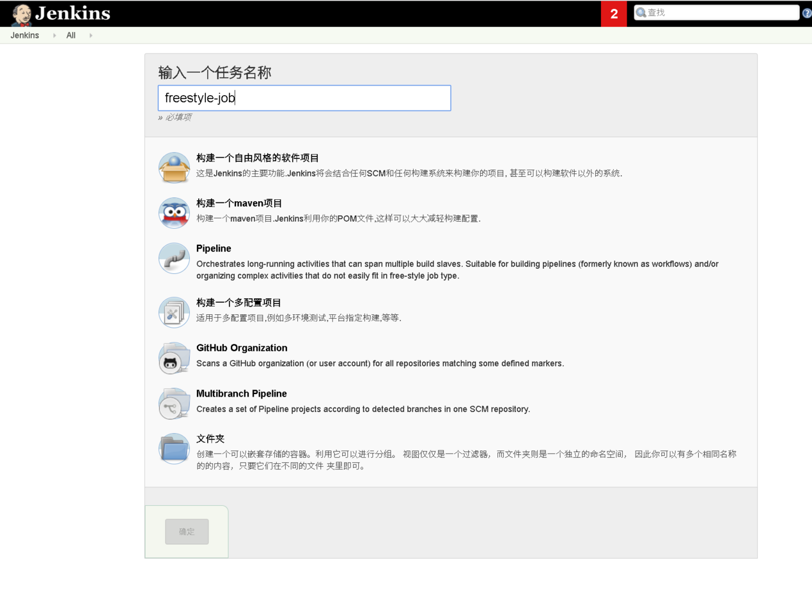


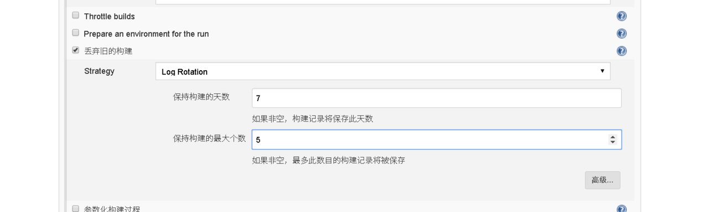


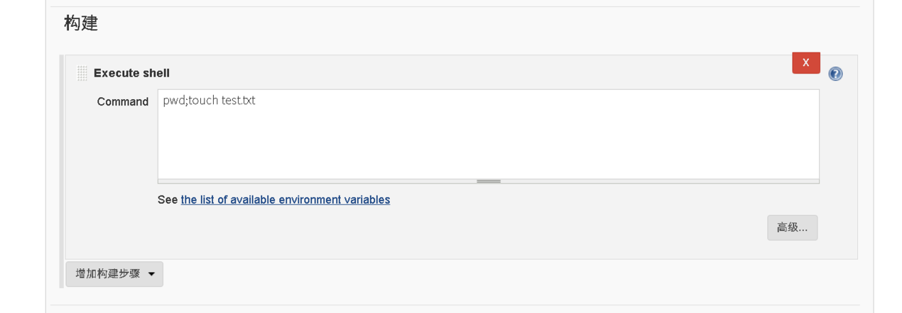


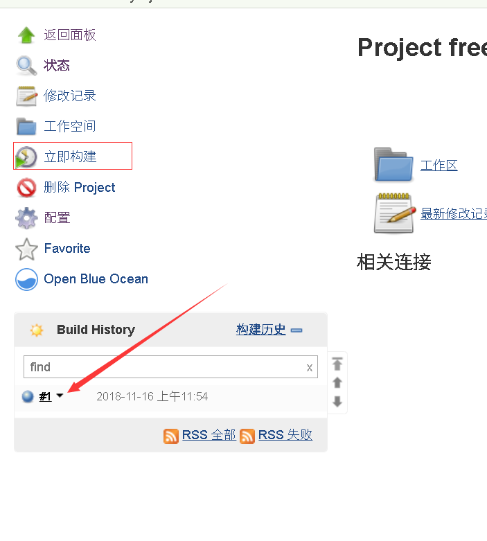

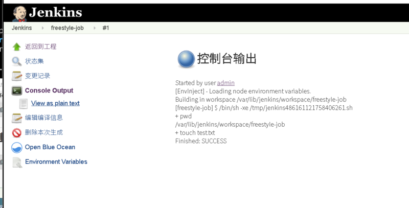

```bash
[root@jenkins workspace]# pwd
/var/lib/jenkins/workspace
[root@jenkins workspace]# tree
.
└── freestyle-job
    └── test.txt
 
1 directory, 1 file

# 再启动一台ip 202 安装nginx
yum install -y nginx  #这里用的是阿里云仓库默认仓库yum源
systemctl start nginx
netstat -lntup |grep 80
cd /usr/share/nginx/html/

[root@web01 html]# ls
404.html  50x.html  index.html  nginx-logo.png  poweredby.png


```

 

 

再码云上找一个开源的项目

[<font style="color:blue;">https://gitee.com/kangjie1209/monitor</font>](https://gitee.com/kangjie1209/monitor)


 

gitlab 导入,码云的开源项目代码

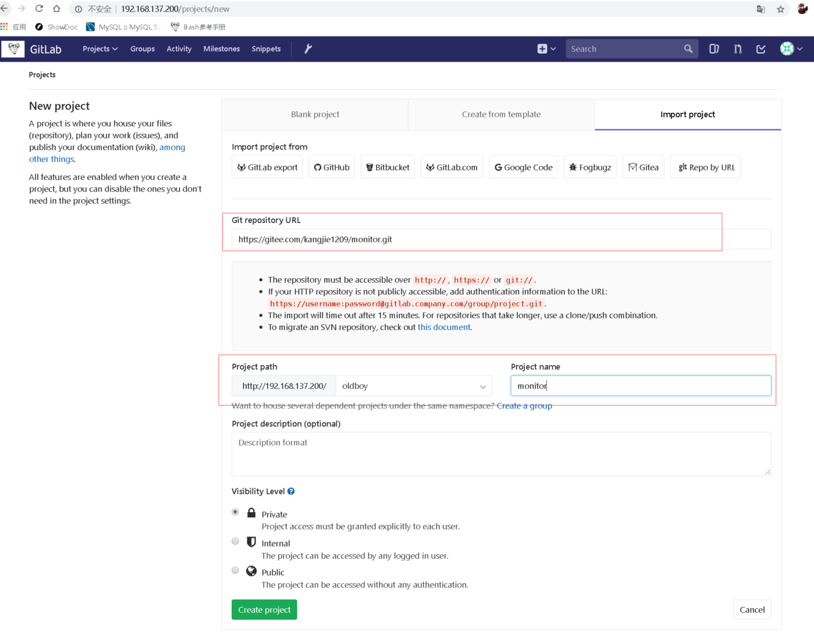

 

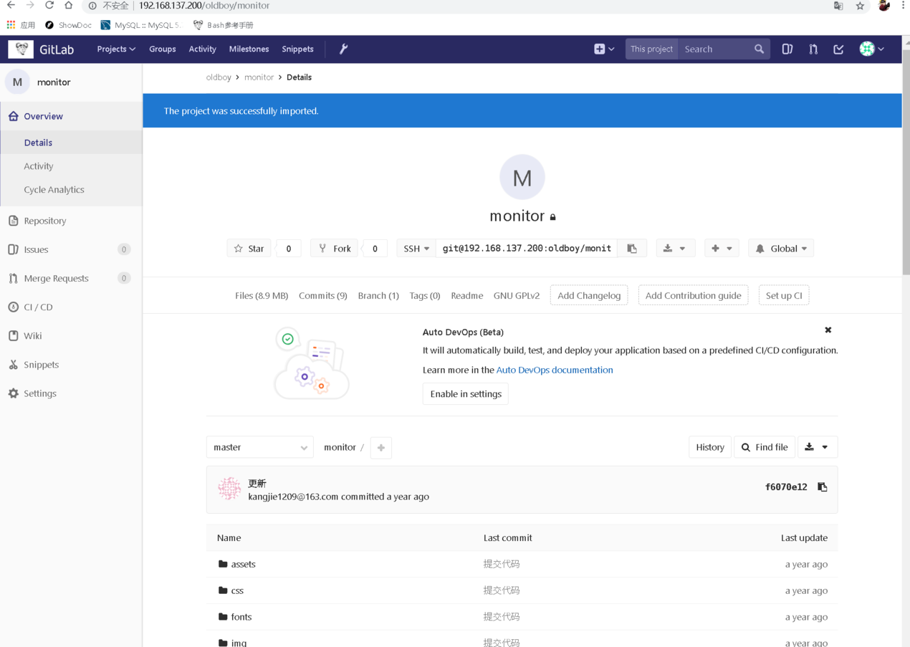

 

```bash
# 202ip web主机手动上线代码
cd /usr/share/nginx/html/
git clone https://gitee.com/kangjie1209/monitor.git

[root@web01 html]# ls
404.html  50x.html  index.html  monitor  nginx-logo.png  poweredby.png

 
```


 

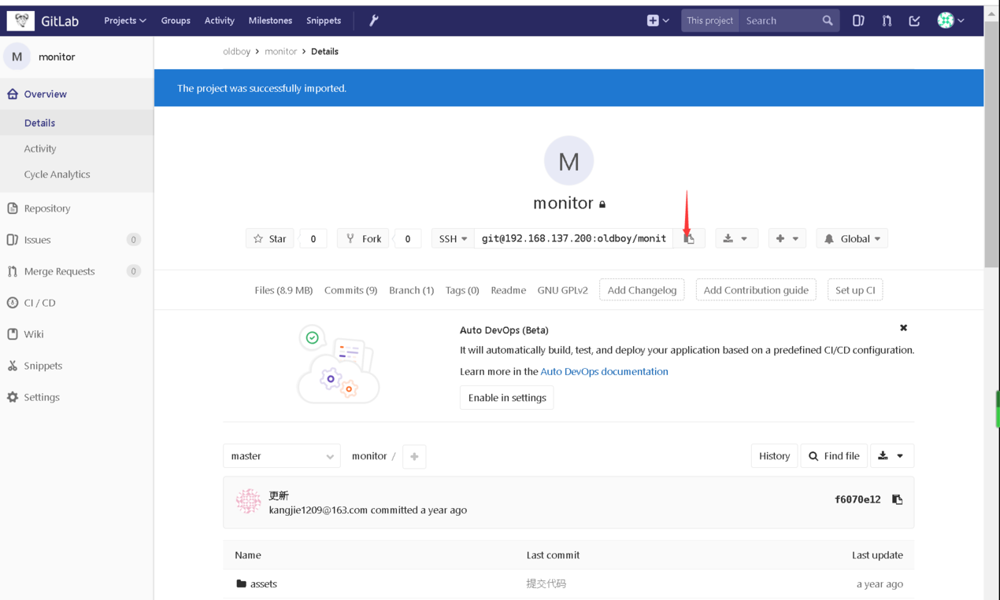

 

 

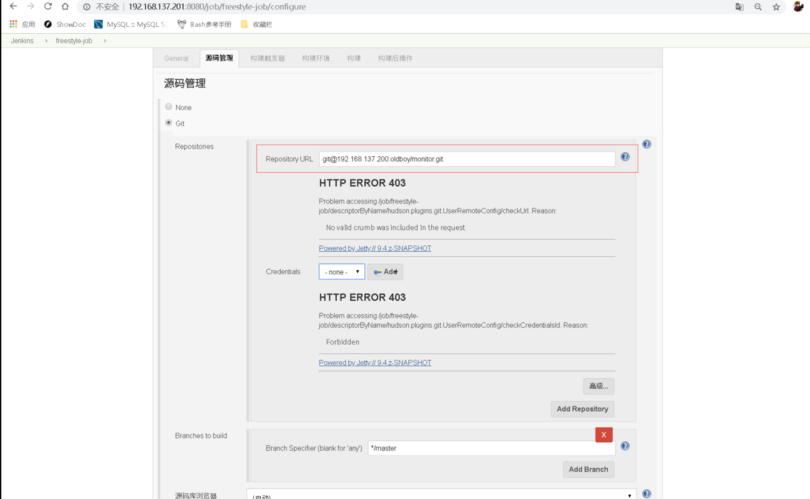

 

 

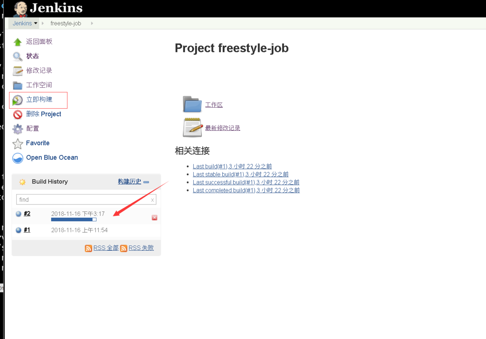

 

```bash
# jenkins 项目目录  Building in workspace /var/lib/jenkins/workspace/freestyle-job/
[root@jenkins jenkins]# cd /var/lib/jenkins/
[root@jenkins jenkins]# ls
 
```

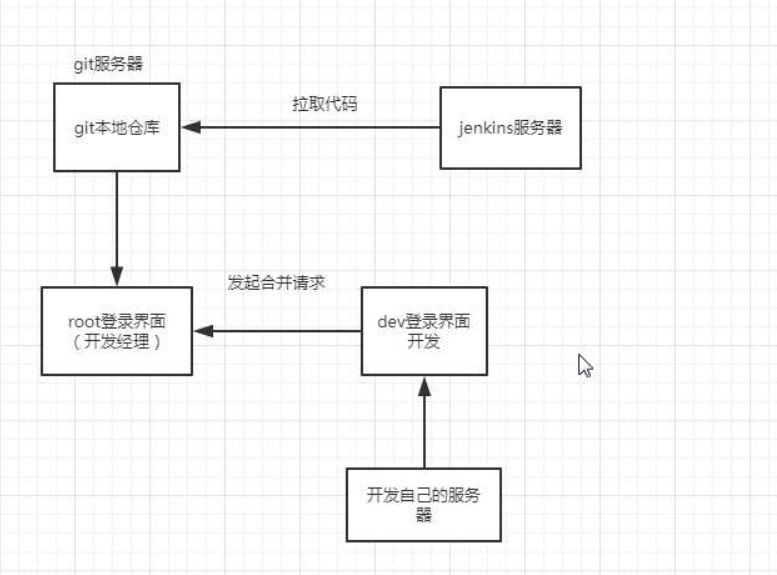

 

<font style="color:#333333;"> </font><font style="color:#333333;">写一个脚本把从</font><font style="color:#333333;">git</font><font style="color:#333333;">仓库里获取的代码上传到</font><font style="color:#333333;">web</font><font style="color:#333333;">服务器站点目录下</font>

```bash
[root@jenkins scripts]# cat /server/scripts/deploy.sh
#!/bin/sh
DATE=$(date +%Y-%m-%d-%H-%M-%S)
CODE_DIR="/var/lib/jenkins/workspace/freestyle-job"
WEB_DIR="/usr/share/nginx/"
 
get_code_tar(){
        cd $CODE_DIR && tar zcf /opt/web-$DATE.tar.gz ./*
}
 
scp_code_web(){
        scp /opt/web-$DATE.tar.gz 192.168.137.202:$WEB_DIR
}
 
code_tarxf(){
        ssh 192.168.137.202 "cd $WEB_DIR &&mkdir web-$DATE && tar xf web-$DATE.tar.gz -C web-$DATE"
 
}
ln_html(){
         ssh 192.168.137.202 "cd $WEB_DIR && rm -rf html && ln -s web-$DATE html"
}
 
main(){
 
        get_code_tar;
        scp_code_web;
        code_tarxf;
        ln_html;
}
main
-------------------------------------------------------------------
# [root@jenkins scripts]#
ssh-keygen  #分发秘钥
ssh-copy-id -i ~/.ssh/id_rsa.pub 192.168.137.202

# 运行推送脚本 201 jenkins主机上
sh deploy.sh

# 202web主机 查看推送的文件
# html软链接到了 web-`日期`  的目录上的
[root@web01 nginx]# ll /usr/share/nginx
总用量 4552
lrwxrwxrwx 1 root root      23 11月 16 16:14 html -> web-2018-11-16-16-14-45
drwxr-xr-x 2 root root     170 11月  5 21:26 modules
drwxr-xr-x 8 root root    4096 11月 16 16:14 web-2018-11-16-16-14-45
-rw-r--r-- 1 root root 4653885 11月 16 16:14 web-2018-11-16-16-14-45.tar.gz

```

浏览器访问192.168.137.202

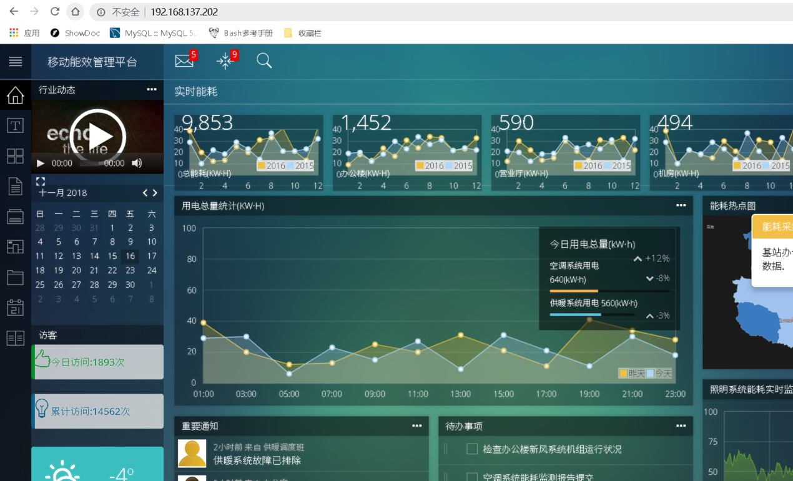

 

jenkins 配置

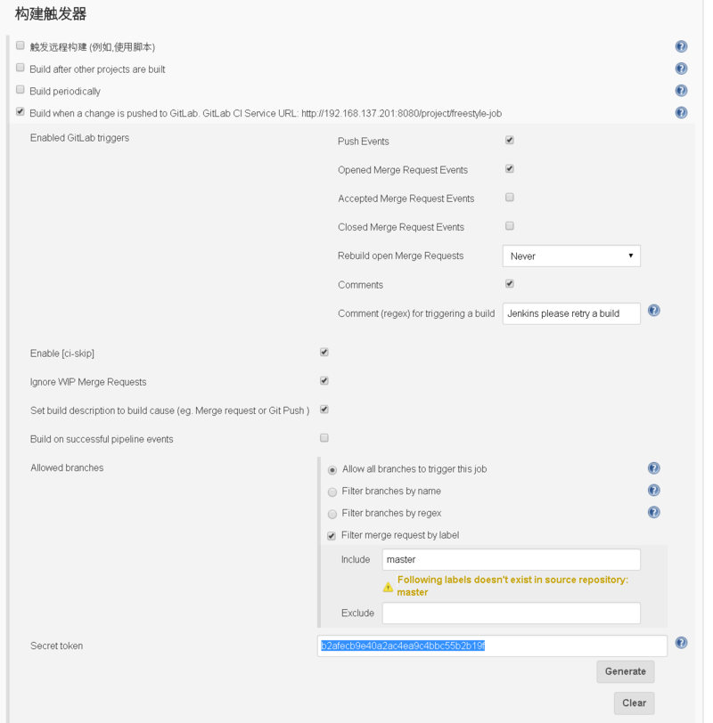

 

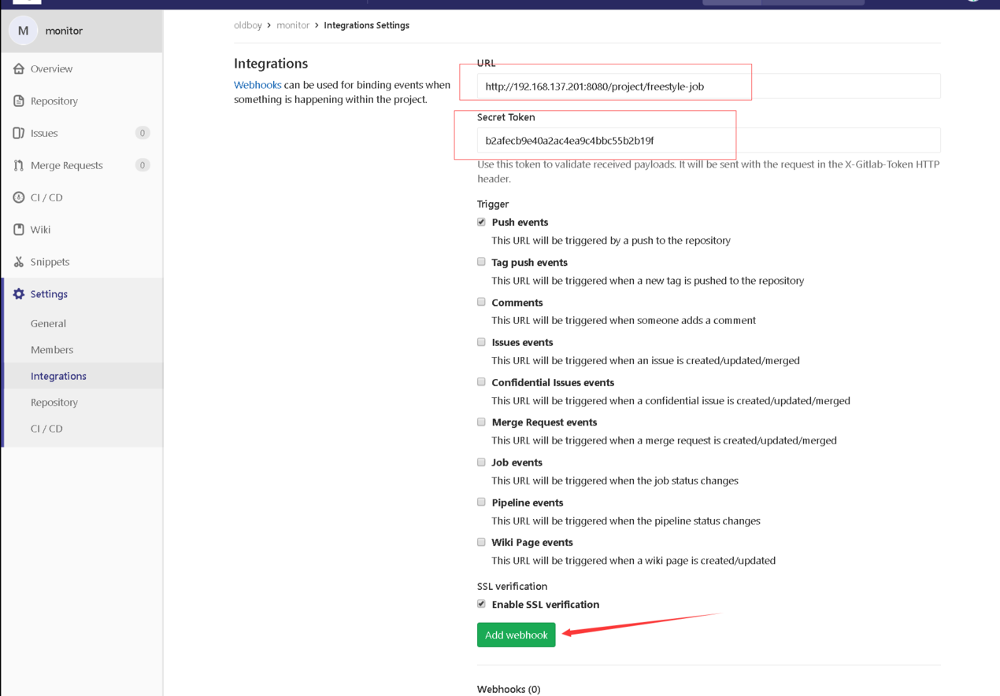

 

#开发主机克隆代码  修改 再推送

```bash
git clone git@192.168.137.200:oldboy/monitor.git
cd monitor/
ls
vim  index.html
git add .
git commit -m "add index.html"
git push -u origin master

#报错检查
#只有一个主分支master  git ip200服务器上创建dev分支
git branch dev
git checkout dev
git branch

# JENKINS主机上的公钥  贴到gitlab 的dev 用户sshkey上
[root@jenkins ~]# cat .ssh/id_rsa.pub
ssh-rsa AAAAB3NzaC1yc2EAAAADAQABAAABAQC+3DOFCwyImeBJrhoPDB8aoGs/4+aNJXWJv4THMPDwWgW1PdF94fCslLRx/jWSWAiRoCPIlhMZ5673vi94iXaCK+AgwnF//eMVe1RDnZfzaKBrL6RuQDrwa64o8yOK3yNtwxP0BE3kEMCV3A8jZixc4CvjyoFg+1+u9bxhx+3untZh2+ZUB9izxdLFEtDJmahC+N2+deKksl+4H2ArDa5YijVkUQdesEVw2ta5ol0XInUzawwydk6JAbAmUWK15bWloN/I+IptIXVgYym2WoCrBvrVOVqaOsh34x9muD+pAT2LhnkRNxpozBjiwfr7pUE7LEF1CEfPHzmMGCjO91Nn root@jenkins

```

 

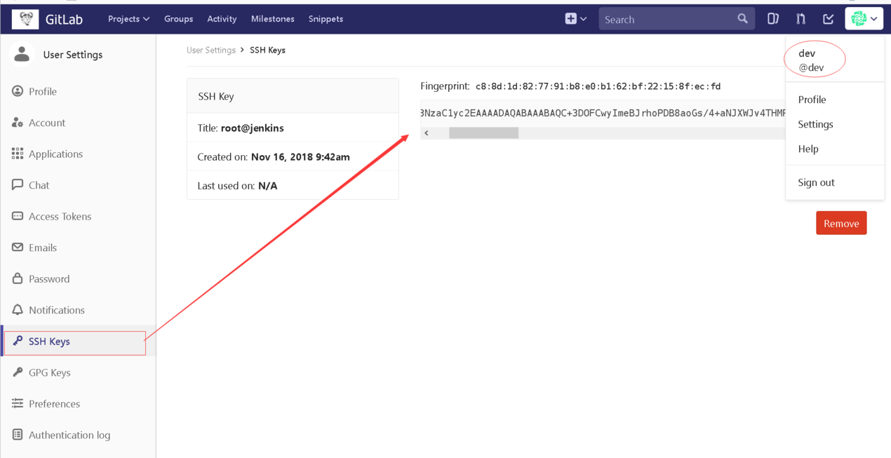

 

jenkins配置

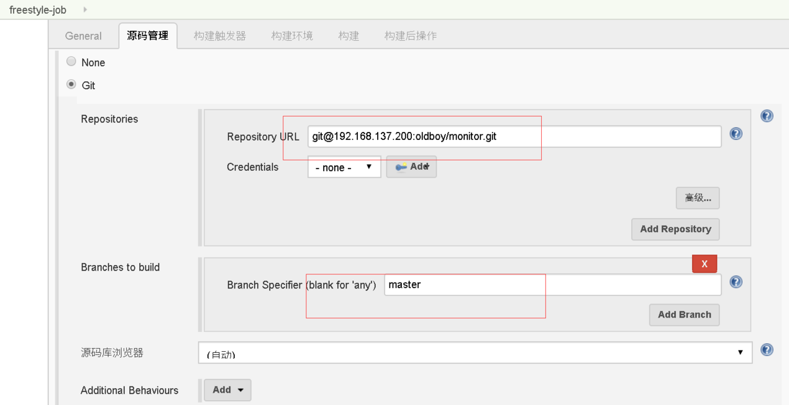

 

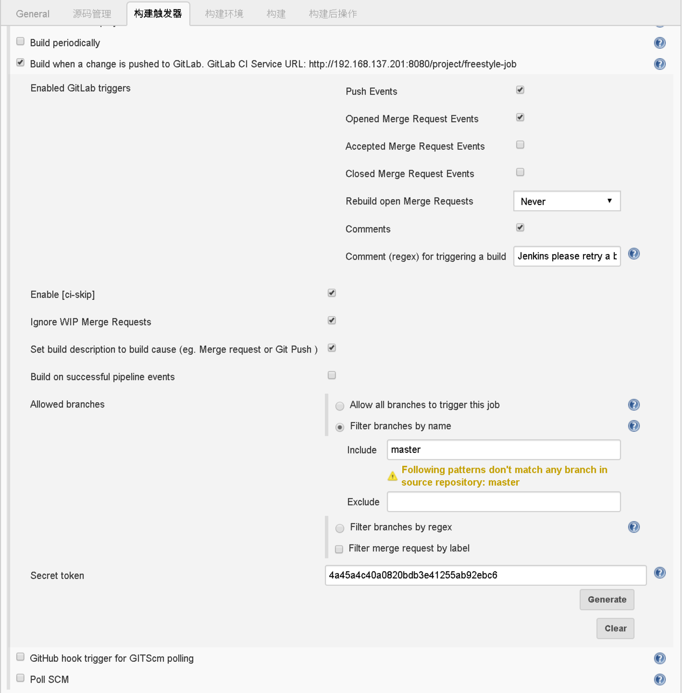


上面的 url:  http的地址  和 Secret token 秘钥复制到 gitlab web钩子 绑定项目事件页面上


 

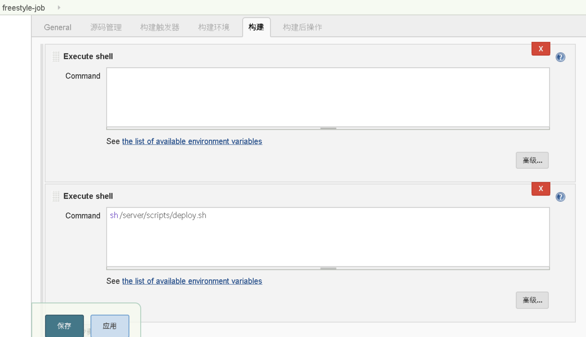

 

git主机上测试修改代码 推送

```bash
  cd /tmp/
  git clone git@192.168.137.200:oldboy/monitor.git
  cd monitor/
  ll
  vim index.html
  git status
  git add .
  git commit -m "add index"
  git push -u origin master
```

 

刷新网页查看 标题修改了


 

 

 


> 更新: 2024-09-07 16:36:24  
> 原文: <https://www.yuque.com/chengkanghua/oldboy50/po3d0e>