# day75 jenkins 01

官方文档

[https://git-scm.com/book/zh/v2](https://git-scm.com/book/zh/v2)


git 10.0.0.200

jenkins 10.0.0.201


### git准备环境


```plain
 getenforce
yum install git

[root@hostname200 ~]# git version
git version 1.8.3.1
[root@hostname200 ~]# git config
用法：git config [选项]

配置文件位置
    --global              使用全局配置文件
    --system              使用系统级配置文件
    --local               使用版本库级配置文件
    -f, --file <文件>     使用指定的配置文件
    --blob <blob-id>      read config from given blob object

操作
    --get                 获取值：name [value-regex]
    --get-all             获得所有的值：key [value-regex]
    --get-regexp          根据正则表达式获得值：name-regex [value-regex]
    --replace-all         替换所有匹配的变量：name value [value_regex]
    --add                 添加一个新的变量：name value
    --unset               删除一个变量：name [value-regex]
    --unset-all           删除所有匹配项：name [value-regex]
    --rename-section      重命名小节：old-name new-name
    --remove-section      删除一个小节：name
    -l, --list            列出所有
    -e, --edit            打开一个编辑器
    --get-color <slot>    找到配置的颜色：[默认]
    --get-colorbool <slot>
                          找到颜色设置：[stdout-is-tty]

类型
    --bool                值是 "true" 或 "false"
    --int                 值是十进制数
    --bool-or-int         值是 --bool or --int
    --path                值是一个路径（文件或目录名）

其它
    -z, --null            终止值是NUL字节
    --includes            查询时参照 include 指令递归查找
```


### 配置


```plain
[root@hostname200 ~]# git config --global user.name "ckh"
[root@hostname200 ~]# git config --global user.email 343264992@qq.com
[root@hostname200 ~]# git config --global color.ui true
[root@hostname200 ~]# git config --list
user.name=ckh
user.email=343264992@qq.com
color.ui=true
[root@hostname200 ~]# cat .gitconfig
[user]
	name = ckh
	email = 343264992@qq.com
[color]
	ui = true
```


## GIT常规使用


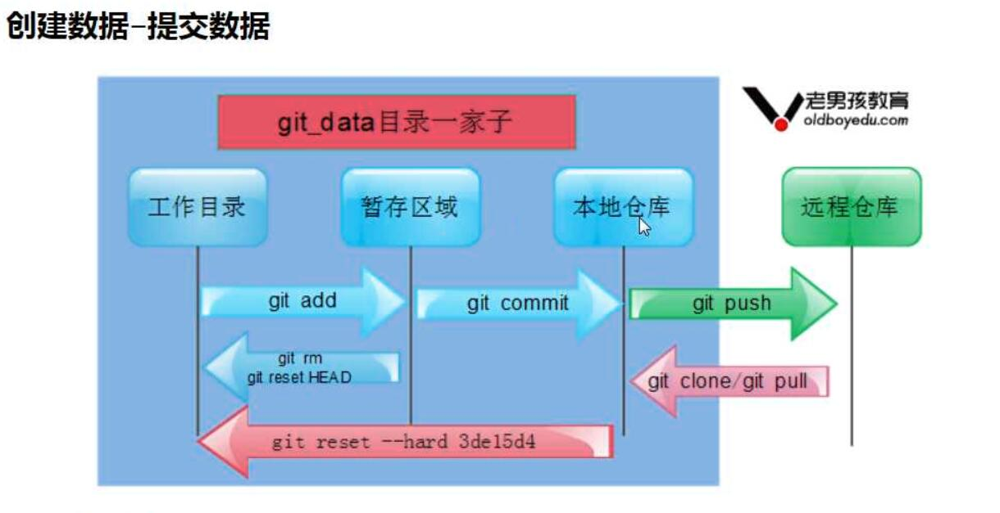


## git四种状态


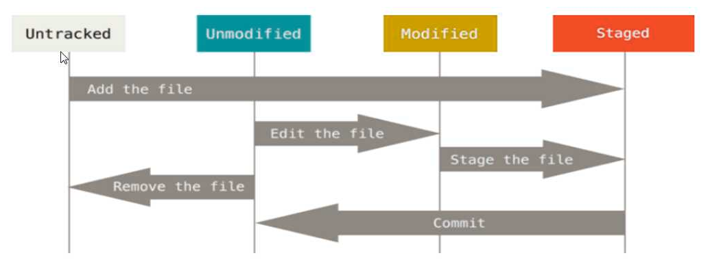


branches # 分支目录

 config   # 定义项目特有的配置选项

 description  # 仅供git web程序使用

 HEAD # 指示当前的分支

 hooks # 包含git钩子文件

 info # 包含一个全局排除文件(exclude文件)

 objects # 存放所有数据内容，有info和pack两个子文件夹

 refs # 存放指向数据(分支)的提交对象的指针

 index # 保存暂存区信息，在执行git init的时候，这个文件还没有


初始化目录


```plain
[root@hostname200 ~]# mkdir git_data
[root@hostname200 ~]# cd git_data/
[root@hostname200 git_data]# git init
初始化空的 Git 版本库于 /root/git_data/.git/

[root@hostname200 git_data]# git status
# 位于分支 master
#
# 初始提交
#
无文件要提交（创建/拷贝文件并使用 "git add" 建立跟踪）

[root@hostname200 git_data]# touch a b c
[root@hostname200 git_data]# git status
# 位于分支 master
#
# 初始提交
#
# 未跟踪的文件:
#   （使用 "git add <file>..." 以包含要提交的内容）
#
#	a
#	b
#	c
提交为空，但是存在尚未跟踪的文件（使用 "git add" 建立跟踪）
[root@hostname200 git_data]# git add a
[root@hostname200 git_data]# git status
# 位于分支 master
#
# 初始提交
#
# 要提交的变更：
#   （使用 "git rm --cached <file>..." 撤出暂存区）
#
#	新文件：    a
#
# 未跟踪的文件:
#   （使用 "git add <file>..." 以包含要提交的内容）
#
#	b
#	c
[root@hostname200 git_data]# git rm -f a
rm 'a'
[root@hostname200 git_data]# git status
# 位于分支 master
#
# 初始提交
#
# 未跟踪的文件:
#   （使用 "git add <file>..." 以包含要提交的内容）
#
#	b
#	c
提交为空，但是存在尚未跟踪的文件（使用 "git add" 建立跟踪）
[root@hostname200 git_data]# ls
b  c
[root@hostname200 git_data]# git add b
[root@hostname200 git_data]# git commit -m "add file b"
[master（根提交） 0d0feec] add file b
 1 file changed, 0 insertions(+), 0 deletions(-)
 create mode 100644 b
[root@hostname200 git_data]# git status
# 位于分支 master
# 未跟踪的文件:
#   （使用 "git add <file>..." 以包含要提交的内容）
#
#	c
提交为空，但是存在尚未跟踪的文件（使用 "git add" 建立跟踪）

#每次提交的日志信息
[root@hostname200 git_data]# git log
commit caa84b88f31b5acdcf627b3359ca0719a5db2846
Author: ckh <343264992@qq.com>
Date:   Thu Nov 15 10:41:05 2018 +0800

    add file a c

commit 0d0feec1d0849c4496ed78631c223fd30876178e
Author: ckh <343264992@qq.com>
```


Date:   Thu Nov 15 10:25:28 2018 +0800


add file b


MV改名 git认为是删除了文件 然后回滚


```plain
[root@hostname200 git_data]# touch test
[root@hostname200 git_data]# git add test
[root@hostname200 git_data]# git status
# 位于分支 master
# 要提交的变更：
#   （使用 "git reset HEAD <file>..." 撤出暂存区）
#
#	新文件：    test
#
[root@hostname200 git_data]# mv test test.txt
[root@hostname200 git_data]# git status
# 位于分支 master
# 要提交的变更：
#   （使用 "git reset HEAD <file>..." 撤出暂存区）
#
#	新文件：    test
#
# 尚未暂存以备提交的变更：
#   （使用 "git add/rm <file>..." 更新要提交的内容）
#   （使用 "git checkout -- <file>..." 丢弃工作区的改动）
#
#	删除：      test
#
# 未跟踪的文件:
#   （使用 "git add <file>..." 以包含要提交的内容）
#
#	test.txt
[root@hostname200 git_data]# git add test.txt
[root@hostname200 git_data]# git status
# 位于分支 master
# 要提交的变更：
#   （使用 "git reset HEAD <file>..." 撤出暂存区）
#
#	新文件：    test
#	新文件：    test.txt
#
# 尚未暂存以备提交的变更：
#   （使用 "git add/rm <file>..." 更新要提交的内容）
#   （使用 "git checkout -- <file>..." 丢弃工作区的改动）
#
#	删除：      test
#
[root@hostname200 git_data]# git checkout  test
[root@hostname200 git_data]# ll
总用量 0
-rw-r--r-- 1 root root 0 11月 15 10:38 a
-rw-r--r-- 1 root root 0 11月 15 10:21 b
-rw-r--r-- 1 root root 0 11月 15 10:21 c
-rw-r--r-- 1 root root 0 11月 15 10:52 test
```


-rw-r--r-- 1 root root 0 11月 15 10:50 test.txt


撤回暂存区


```plain
[root@hostname200 git_data]# git reset HEAD test test.txt
[root@hostname200 git_data]# git status
# 位于分支 master
# 未跟踪的文件:
#   （使用 "git add <file>..." 以包含要提交的内容）
#
#	test
#	test.txt
```


提交为空，但是存在尚未跟踪的文件（使用 "git add" 建立跟踪）


git mv  工作区和暂存区同时改


```plain
[root@hostname200 git_data]# ls
a  b  c  test  test.txt
[root@hostname200 git_data]# rm test.txt
rm：是否删除普通空文件 "test.txt"？y
[root@hostname200 git_data]# git add test
[root@hostname200 git_data]# git status
# 位于分支 master
# 要提交的变更：
#   （使用 "git reset HEAD <file>..." 撤出暂存区）
#
#	新文件：    test
#
[root@hostname200 git_data]# git mv test test.txt
[root@hostname200 git_data]# git status
# 位于分支 master
# 要提交的变更：
#   （使用 "git reset HEAD <file>..." 撤出暂存区）
#
#	新文件：    test.txt
```


```plain
[root@hostname200 git_data]# echo aaa> test.txt
[root@hostname200 git_data]# ll
总用量 4
-rw-r--r-- 1 root root 0 11月 15 10:38 a
-rw-r--r-- 1 root root 0 11月 15 10:21 b
-rw-r--r-- 1 root root 0 11月 15 10:21 c
-rw-r--r-- 1 root root 4 11月 15 10:57 test.txt
[root@hostname200 git_data]# cat test.txt
aaa
[root@hostname200 git_data]# git status
# 位于分支 master
# 要提交的变更：
#   （使用 "git reset HEAD <file>..." 撤出暂存区）
#
#	新文件：    test.txt
#
# 尚未暂存以备提交的变更：
#   （使用 "git add <file>..." 更新要提交的内容）
#   （使用 "git checkout -- <file>..." 丢弃工作区的改动）
#
#	修改：      test.txt
#

#比对 工作目录 和暂存区的文件不同
[root@hostname200 git_data]# git diff test.txt
diff --git a/test.txt b/test.txt
index e69de29..72943a1 100644
--- a/test.txt
+++ b/test.txt
@@ -0,0 +1 @@
+aaa

# 提交暂存区
[root@hostname200 git_data]# git add test.txt
[root@hostname200 git_data]# git diff test.txt  # 没有修改状态信息
[root@hostname200 git_data]# git status   #新文件
# 位于分支 master
# 要提交的变更：
#   （使用 "git reset HEAD <file>..." 撤出暂存区）
#
#	新文件：    test.txt

#提交仓库
[root@hostname200 git_data]# git commit -m "add test.txt file aaa"
[master 4c5ce8b] add test.txt file aaa
 1 file changed, 1 insertion(+)
 create mode 100644 test.txt
[root@hostname200 git_data]# git status
# 位于分支 master
无文件要提交，干净的工作区
# 仓库和暂存区 的区别
[root@hostname200 git_data]# git diff --cached test.txt

# 修改 在提交在比较
[root@hostname200 git_data]# echo bbb>>test.txt
[root@hostname200 git_data]# git add test.txt
[root@hostname200 git_data]# git diff --cached test.txt
diff --git a/test.txt b/test.txt
index 72943a1..dbee026 100644
--- a/test.txt
+++ b/test.txt
@@ -1 +1,2 @@
 aaa
+bbb

#这是 工作目录 和暂存区对比
[root@hostname200 git_data]# git diff test.txt
```


[root[@hostname200 ](/hostname200 ) git_data]# git diff  #所有对比 


已经在仓库的文件  修改后快速提交  -am


```plain
[root@hostname200 git_data]# echo ccc>>test.txt
[root@hostname200 git_data]# cat test.txt
aaa
bbb
ccc
[root@hostname200 git_data]# git commit -am "add test file ccc"
[master 93bb2f6] add test file ccc
 1 file changed, 2 insertions(+)
[root@hostname200 git_data]# git status   #显示工作区状态
# 位于分支 master
无文件要提交，干净的工作区
```


### git基础命令


```plain
git add file或git add . 将工作目录文件添加到暂存区
git rm --cached 只删暂存区
git rm -f file 删除暂存区和工作目录源文件，不会删除仓库里面的文件。
git status
git commit -m "修改了很多bug"
git checkout -- file 放弃工作区的改动，修改的部份会被回滚
git mv 这种改名操作会被跟踪
git diff file 比对的工作目录和暂存区域
git diff --cached file 比对暂存区和仓库里的区别，前提是在工作区修改后要先将文件添加到暂存区才能比对git add file
git commit -am "日志" 适用于已要提交到仓库的文件，如果在工作目录修改了，可以直接这样提交到仓库，不需要再添加一次再提交。
git log查看日志
git log --oneline以单行显示日志
```


```plain
# 提交日志记录   oneline 一行简单显示信息
[root@hostname200 git_data]# git log --oneline
93bb2f6 add test file ccc
4c5ce8b add test.txt file aaa
caa84b8 add file a c
0d0feec add file b

# 多了 HEAD指向 最新一次提交信息   当前指针指向哪里
[root@hostname200 git_data]# git log --oneline --decorate
93bb2f6 (HEAD, master) add test file ccc
4c5ce8b add test.txt file aaa
caa84b8 add file a c
0d0feec add file b

#显示每次版本修改的详细信息
[root@hostname200 git_data]# git log -p
commit 93bb2f6caf31e6f78c80fcc9281a521f69447634
Author: ckh <343264992@qq.com>
Date:   Thu Nov 15 11:06:48 2018 +0800

    add test file ccc

diff --git a/test.txt b/test.txt
index 72943a1..1802a74 100644
--- a/test.txt
+++ b/test.txt
@@ -1 +1,3 @@
 aaa
+bbb
+ccc

# -2 显示2条版本提交信息
[root@hostname200 git_data]# git log -2
commit 93bb2f6caf31e6f78c80fcc9281a521f69447634
Author: ckh <343264992@qq.com>
Date:   Thu Nov 15 11:06:48 2018 +0800

    add test file ccc

commit 4c5ce8b5200c48c6157e3a3f66cbc7780253e770
Author: ckh <343264992@qq.com>
```


Date:   Thu Nov 15 11:00:19 2018 +0800


add test.txt file aaa


#仓库 如何恢复 之前的版本


```plain
[root@hostname200 git_data]# echo dddd >test.txt
[root@hostname200 git_data]# ls
a  b  c  test.txt
[root@hostname200 git_data]# cat test.txt
dddd
[root@hostname200 git_data]# git commit -am "add dddd"
[master f634e8b] add dddd
 1 file changed, 1 insertion(+), 3 deletions(-)
[root@hostname200 git_data]# git status
# 位于分支 master
无文件要提交，干净的工作区
[root@hostname200 git_data]# git log --oneline
f634e8b add dddd
93bb2f6 add test file ccc
4c5ce8b add test.txt file aaa
caa84b8 add file a c
0d0feec add file b
#回滚到 add a c 的内容
[root@hostname200 git_data]# git reset --hard caa84b8
HEAD 现在位于 caa84b8 add file a c  #提示指针回到 a c

[root@hostname200 git_data]# #假如回滚错了 要回滚上一次的93bb2f6 add test file ccc
[root@hostname200 git_data]# git reflog   #查看所有记录包括回滚记录
caa84b8 HEAD@{0}: reset: moving to caa84b8
f634e8b HEAD@{1}: commit: add dddd
93bb2f6 HEAD@{2}: commit: add test file ccc
4c5ce8b HEAD@{3}: commit: add test.txt file aaa
caa84b8 HEAD@{4}: commit: add file a c
0d0feec HEAD@{5}: commit (initial): add file b
[root@hostname200 git_data]# git reset --hard 93bb2f6
HEAD 现在位于 93bb2f6 add test file ccc
[root@hostname200 git_data]# ls  #看test.txt 文件又回来咯
a  b  c  test.txt
[root@hostname200 git_data]# cat  test.txt
aaa
bbb
```


ccc


### 查看分支


```plain
[root@hostname200 git_data]# git branch
* master
# 创建分支 testing
[root@hostname200 git_data]# git branch tesing
[root@hostname200 git_data]# git branch
* master
  tesing
[root@hostname200 git_data]# git checkout tesing
切换到分支 'tesing'
[root@hostname200 git_data]# git branch
  master
* tesing  #当前在tesing分支上 *

[root@hostname200 git_data]# echo aaa>a
[root@hostname200 git_data]# git commit -am "add aaa"
[tesing aec3a92] add aaa
 1 file changed, 1 insertion(+)
[root@hostname200 git_data]# echo bbb>>a
[root@hostname200 git_data]# git commit -am "add bbb"
[tesing f7979d2] add bbb
 1 file changed, 1 insertion(+)
[root@hostname200 git_data]# echo ccc>>a
[root@hostname200 git_data]# git commit -am "add ccc"
[tesing eed1e8c] add ccc
 1 file changed, 1 insertion(+)
[root@hostname200 git_data]# git log --oneline --decorate
eed1e8c (HEAD, tesing) add ccc
f7979d2 add bbb
aec3a92 add aaa
4c5873b (master) add dddd
93bb2f6 add test file ccc
4c5ce8b add test.txt file aaa
caa84b8 add file a c
```


### 0d0feec add file b


分支操作


```plain
[root@hostname200 git_data]# git branch test
[root@hostname200 git_data]# git branch
* master
  tesing
  test
[root@hostname200 git_data]# git checkout test
切换到分支 'test'
[root@hostname200 git_data]# ll
总用量 8
-rw-r--r-- 1 root root  0 11月 15 14:59 a
-rw-r--r-- 1 root root  8 11月 15 14:59 b
-rw-r--r-- 1 root root  0 11月 15 10:21 c
-rw-r--r-- 1 root root 17 11月 15 11:51 test.txt
[root@hostname200 git_data]# git branch
  master
  tesing
* test
[root@hostname200 git_data]# git log --oneline --decorate
9615df2 (HEAD, test, master) add ccc
d286f32 add bbb
4c5873b add dddd
93bb2f6 add test file ccc
4c5ce8b add test.txt file aaa
caa84b8 add file a c
0d0feec add file b
[root@hostname200 git_data]# touch test
[root@hostname200 git_data]# git add .
[root@hostname200 git_data]# git commit -m "add branch test file"
[test 06f2b7e] add branch test file
 1 file changed, 0 insertions(+), 0 deletions(-)
 create mode 100644 test
[root@hostname200 git_data]# git log --oneline --decorate
06f2b7e (HEAD, test) add branch test file
9615df2 (master) add ccc
d286f32 add bbb
4c5873b add dddd
93bb2f6 add test file ccc
4c5ce8b add test.txt file aaa
caa84b8 add file a c
0d0feec add file b
[root@hostname200 git_data]# git checkout master
切换到分支 'master'
[root@hostname200 git_data]# git log --oneline --decorate
9615df2 (HEAD, master) add ccc
d286f32 add bbb
4c5873b add dddd
93bb2f6 add test file ccc
4c5ce8b add test.txt file aaa
caa84b8 add file a c
0d0feec add file b
[root@hostname200 git_data]# touch master
[root@hostname200 git_data]# git add .
[root@hostname200 git_data]# git commit  -m "add branch master"
[master ede5984] add branch master
 1 file changed, 0 insertions(+), 0 deletions(-)
 create mode 100644 master
[root@hostname200 git_data]# git log --oneline --decorate
ede5984 (HEAD, master) add branch master
9615df2 add ccc
d286f32 add bbb
4c5873b add dddd
93bb2f6 add test file ccc
4c5ce8b add test.txt file aaa
caa84b8 add file a c
0d0feec add file b
[root@hostname200 git_data]# git branch
* master
  tesing
  test
#在 master主分支上合并test分支, 弹出vim直接:wq保存就可以
[root@hostname200 git_data]# git merge test
Merge made by the 'recursive' strategy.
 test | 0
 1 file changed, 0 insertions(+), 0 deletions(-)
 create mode 100644 test
[root@hostname200 git_data]# ll
总用量 8
-rw-r--r-- 1 root root  0 11月 15 14:59 a
-rw-r--r-- 1 root root  8 11月 15 14:59 b
-rw-r--r-- 1 root root  0 11月 15 10:21 c
-rw-r--r-- 1 root root  0 11月 15 15:08 master
-rw-r--r-- 1 root root  0 11月 15 15:12 test
-rw-r--r-- 1 root root 17 11月 15 11:51 test.txt  #合并的文件
[root@hostname200 git_data]# git log --oneline --decorate
20d8851 (HEAD, master) Merge branch 'test'   #指针指向合并后的test
ede5984 add branch master
06f2b7e (test) add branch test file
9615df2 add ccc
d286f32 add bbb
4c5873b add dddd
93bb2f6 add test file ccc
4c5ce8b add test.txt file aaa
caa84b8 add file a c
0d0feec add file b

[root@hostname200 git_data]# git checkout master
切换到分支 'master'
[root@hostname200 git_data]# git branch -D tesing
已删除分支 tesing（曾为 1d4dcca）。

[root@hostname200 git_data]# git checkout testing
切换到分支 'testing'

  559  git status
  560  git checkout master
  561  echo lizhenya >>oldboy2.txt
  562  ll
  563  git staaus
  564  git status
  565  git add .
  566  git status
  567  git commit -m "add oldboy2.txt"
  568  git status
  569  git checkout testing
  570  ls
  571  git status
  572  ls
  573  git log --oneline --decorate
  574  echo
  575  ll
  576  git checkout master
  577  ll
  578  cat oldboy2.txt
  579  git checkout testing
  580  vim oldboy2.txt
  581  git add .
  582  git commit -m "add oldboy2.txt"
[root@hostname200 git_data]# git status
# 位于分支 testing
无文件要提交，干净的工作区
[root@hostname200 git_data]# git checkout master
切换到分支 'master'
#合并时候 提示 oldboy.txt有冲突内容
[root@hostname200 git_data]# git merge testing
自动合并 oldboy.txt
冲突（添加/添加）：合并冲突于 oldboy.txt
自动合并失败，修正冲突然后提交修正的结果。
[root@hostname200 git_data]# vim oldboy
[root@hostname200 git_data]#
[root@hostname200 git_data]#
[root@hostname200 git_data]#
[root@hostname200 git_data]# vim oldboy.txt
[root@hostname200 git_data]#
[root@hostname200 git_data]#
[root@hostname200 git_data]# git merge testing
error: 'merge' is not possible because you have unmerged files.
提示：请先在工作区改正文件，然后酌情使用
提示：'git add/rm <file>' 标记解决方案，
提示：或使用 'git commit -a'。
```


fatal: Exiting because of an unresolved conflict.


### git管理标签


```plain
 #标签是打的commit 提交的内容  可以用标签名进行回滚
 git tag -a v1.0 -m "aaa bbb master tesing version v1.0" 
 git tag -a v2.0 -m "tag 2.0"
 git tag -a v2.0 dbead4c -m "add bbb version v2.0"
 git show v1.0
 git reset --hard v2.0
 git reset --hard v1.0
```


git tag -d v2.0


## github


```plain
git remote add origin https://github.com/chengkanghua178/test.git
ssh-keygen
[root@hostname200 git_data]# cat ~/.ssh/id_rsa.pub
```


ssh-rsa AAAAB3NzaC1yc2EAAAADAQABAAABAQC6AdESjpuMKYuAsigzFGLYtmxPOTOM8hV74lx0n2+idAfwmr2XPncjJB7SrRFDzCyEsTCJfjWm2hArVaM6p9CgUubItnwwbmv11ZXfPvHJVqfcThi50nJklab8WcxRHTmcv6m2/RRqsnX2hsx4Zb8VG9Zzta/MGje0SHO4T1PXU9zNJOK+TKHhs4P8gjHbqJ96cyFsZxlnCUbhK/8IUmNLqELGzRithd1qVrgjtsYvBSWyL0ZGn9Dpp4I6EOPNXlxmrymhhHsrLXQvEmIk/CFtGIUBRN9FfJVQdG1+jK4Ap2zJWDDMMvUVov82f7gWV9lf98HwJAK6U180X2nDTFqx root[@m01 ](/m01 )


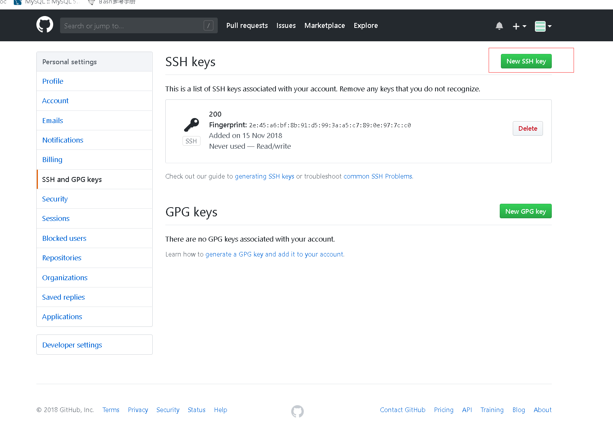


```plain
[root@hostname200 git_data]# git push -u origin master
Username for 'https://github.com': chengkanghua178
Password for 'https://chengkanghua178@github.com':
Counting objects: 41, done.
Compressing objects: 100% (31/31), done.
Writing objects: 100% (41/41), 3.11 KiB | 0 bytes/s, done.
Total 41 (delta 13), reused 0 (delta 0)
remote: Resolving deltas: 100% (13/13), done.
remote:
remote: Create a pull request for 'master' on GitHub by visiting:
remote:      https://github.com/chengkanghua178/test/pull/new/master
remote:
To https://github.com/chengkanghua178/test.git
 * [new branch]      master -> master
```


分支 master 设置为跟踪来自 origin 的远程分支 master。


### git clone 克隆


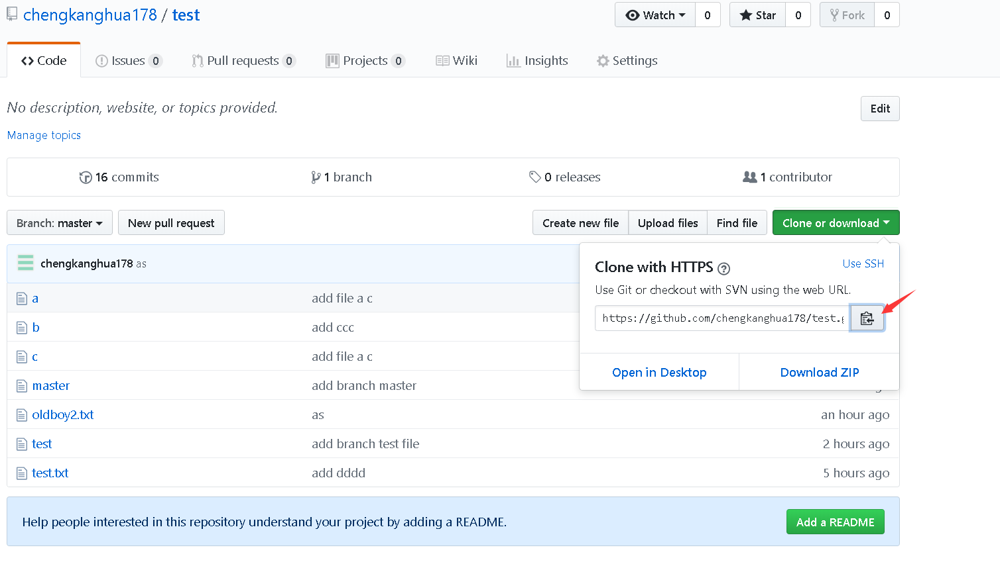


```plain
[root@hostname200 git_data2]# git clone https://github.com/chengkanghua178/test.git
正克隆到 'test'...
remote: Enumerating objects: 41, done.
remote: Counting objects: 100% (41/41), done.
remote: Compressing objects: 100% (18/18), done.
remote: Total 41 (delta 13), reused 41 (delta 13), pack-reused 0
Unpacking objects: 100% (41/41), done.
```


## gitlab


[https://docs.gitlab.com.cn/](https://docs.gitlab.com.cn/)


```plain
yum install -y curl policycoreutils-python openssh-server
[root@hostname200 ~]# rpm -ivh gitlab-ce-10.2.2-ce.0.el7.x86_64.rpm
[root@hostname200 ~]# rpm -ql gitlab-ce
#  gitlab 配置文件 更改url地址为本机IP地址
[root@hostname200 ~]# vim /etc/gitlab/gitlab.rb
external_url 'http://192.168.137.200'
[root@hostname200 ~]# gitlab-ctl reconfigure   #生效配置
Running handlers:
Running handlers complete
Chef Client finished, 382/541 resources updated in 02 minutes 03 seconds
gitlab Reconfigured!
成功~
浏览器访问  http://192.168.137.200

/opt/gitlab/                    # gitlab的程序安装目录
/var/opt/gitlab                 # gitlab目录数据目录
/var/opt/gitlab/git-dfata       # 存放仓库数据

gitlab-ctl status               # 查看目前gitlab所有服务运维状态
gitlab-ctl stop                 # 停止gitlab服务
gitlab-ctl stop nginx           # 单独停止某个服务
```


### gitlab-ctl tail                 # 查看所有服务的日志


gitlab汉化：


```plain
1、下载汉化补丁
git clone https://gitlab.com/xhang/gitlab.git
2、查看全部分支版本
git branch -a
3、对比版本、生成补丁包
git diff remotes/origin/10-2-stable remotes/origin/10-2-stable-zh > ../10.2.2-zh.diff
4、停止服务器
gitlab-ctl stop
5、打补丁
patch -d /opt/gitlab/embedded/service/gitlab-rails -p1 < /tmp/10.2.2-zh.diff 
6、启动和重新配置
gitlab-ctl start
```


gitlab-ctl reconfigure


浏览器打开设置一个默认密码  Ckh123.com

账号默认是 root


```plain
[root@hostname200 git_data]# git remote
origin
[root@hostname200 git_data]# git remote remove origin  #删除github远程库
[root@hostname200 git_data]# git add .
[root@hostname200 git_data]# git commit -m "Initial commit"
# 位于分支 master
无文件要提交，干净的工作区
[root@hostname200 git_data]# git push -u origin master
The authenticity of host '192.168.137.200 (192.168.137.200)' can't be established.
ECDSA key fingerprint is SHA256:rWMnrnl8HcCIxl800ItSZocIvyA67fCVN+jU81bBThc.
ECDSA key fingerprint is MD5:dd:0a:91:99:5c:62:72:bb:de:76:58:4f:84:7b:85:d7.
Are you sure you want to continue connecting (yes/no)? yes
Warning: Permanently added '192.168.137.200' (ECDSA) to the list of known hosts.
Counting objects: 41, done.
Compressing objects: 100% (31/31), done.
Writing objects: 100% (41/41), 3.11 KiB | 0 bytes/s, done.
Total 41 (delta 13), reused 0 (delta 0)
To git@192.168.137.200:oldboy/git_data.git
 * [new branch]      master -> master
分支 master 设置为跟踪来自 origin 的远程分支 master。
```


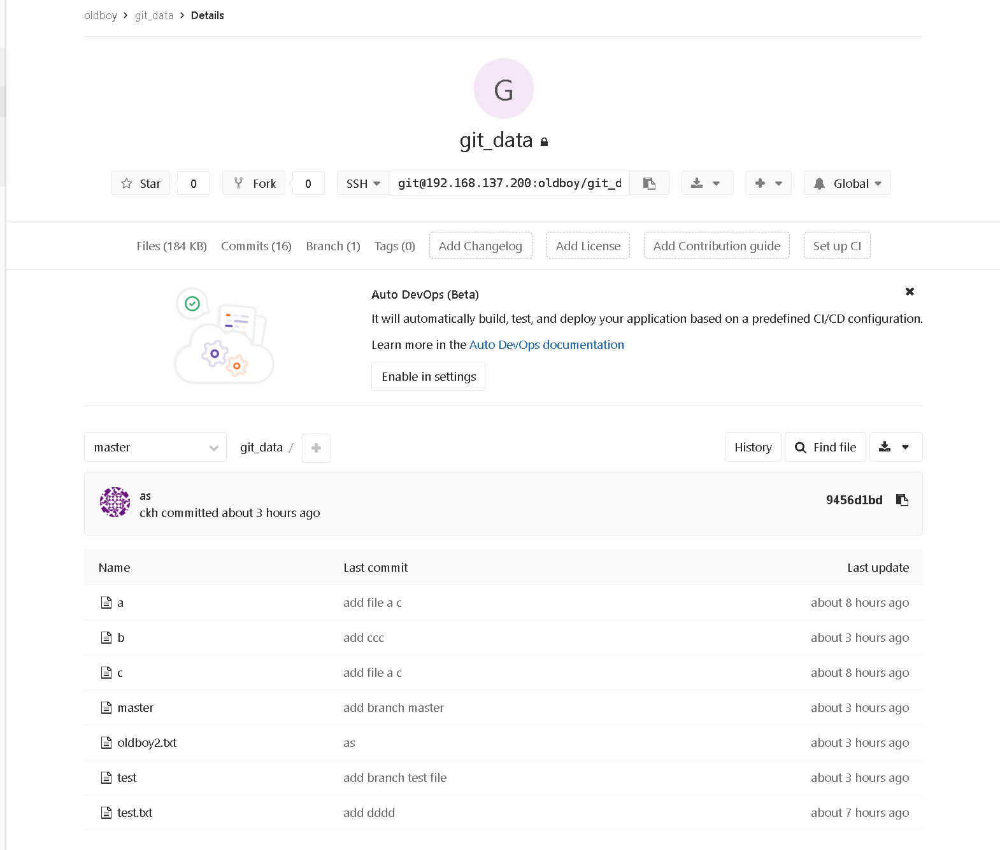


退出 用dev 账号登陆  默认重新设置下密码12345678

查看项目 能看到文件

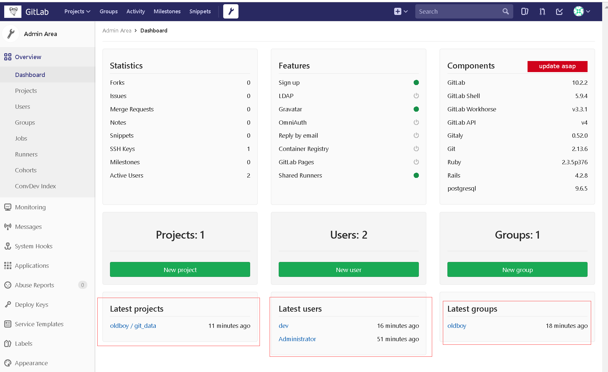


### dev 用户使用  (开发者所使用账号)


```plain
分发公钥
ssh-keygen

[root@jenkins ~]# cat .ssh/id_rsa.pub
```


ssh-rsa AAAAB3NzaC1yc2EAAAADAQABAAABAQDHONq31HXSqd3A/ooHiWraDdFv45TvtJlMwSQTTMHuyb8o9NEdmyhyrbtTciGA1aUqggc+ojtKWlRFkPpTKYfhm/baFI9G2zSK+p+aUxYCrZ30CzlZ5Bus35CFt6JRchBWV0dnoqPqnmTKwTNRLANtxPqASeyrwyPziyoywqplhR7U2DquCqUGwnTdhwtu0VlFTzsw8Gkma2Or97nvkMSKUFWJwcov/YAxArVRPU7VmcOy9ozvxBC9pJg7jQBuCnj4u9Srx2UfKMVZiSmavGAAtFsXH4aChcw8owNs1R9ckv/Uv7BJjE35vN+5pFE84EEWHhz4a5TyscH3MdOJjQVN root[@jenkins ](/jenkins )


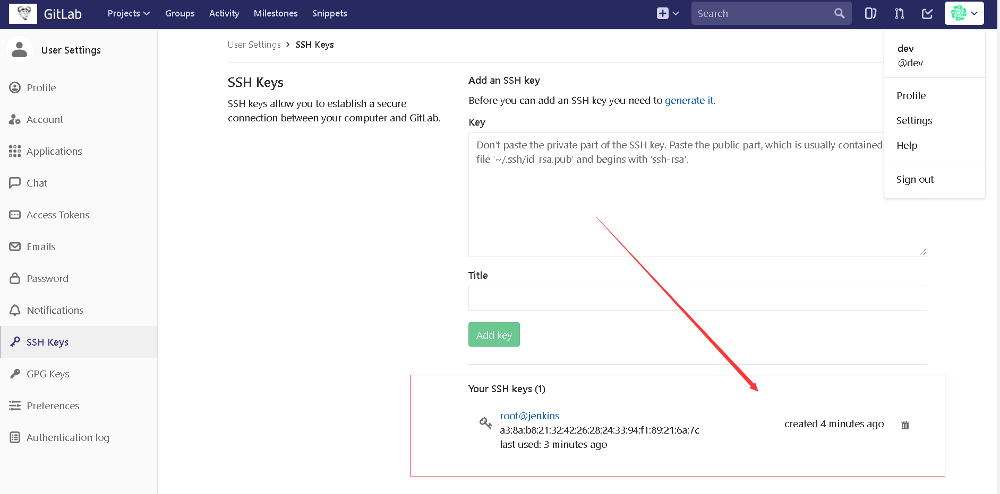


```plain
[root@jenkins ~]# git clone git@192.168.137.200:oldboy/git_data.git
正克隆到 'git_data'...
The authenticity of host '192.168.137.200 (192.168.137.200)' can't be established.
ECDSA key fingerprint is SHA256:rWMnrnl8HcCIxl800ItSZocIvyA67fCVN+jU81bBThc.
ECDSA key fingerprint is MD5:dd:0a:91:99:5c:62:72:bb:de:76:58:4f:84:7b:85:d7.
Are you sure you want to continue connecting (yes/no)? yes
Warning: Permanently added '192.168.137.200' (ECDSA) to the list of known hosts.
remote: Counting objects: 41, done.
remote: Compressing objects: 100% (31/31), done.
remote: Total 41 (delta 13), reused 0 (delta 0)
接收对象中: 100% (41/41), done.
处理 delta 中: 100% (13/13), done.
[root@jenkins ~]# ls
anaconda-ks.cfg  git_data  ssh164.exp  ssh164.sh  y  y.pub
[root@jenkins ~]# cd git_data/
[root@jenkins git_data]# ls
```


a  b  c  master  oldboy2.txt  test  test.txt


创建分支


```plain
[root@jenkins git_data]# git branch dev
[root@jenkins git_data]# git branch
  dev
* master
[root@jenkins git_data]# git checkout dev
切换到分支 'dev'

[root@jenkins git_data]# touch dev
[root@jenkins git_data]# git add .
[root@jenkins git_data]# git commit -m "add dev"

*** Please tell me who you are.

Run

  git config --global user.email "you@example.com"
  git config --global user.name "Your Name"

to set your account's default identity.
Omit --global to set the identity only in this repository.

fatal: unable to auto-detect email address (got 'root@jenkins.(none)')
# 提示配置个人信息
[root@jenkins git_data]# git config --global user.email "dev@example.com"
[root@jenkins git_data]# git config --global user.name "dev"
[root@jenkins git_data]# git commit -m "add dev"
[dev 6ee2585] add dev
 1 file changed, 0 insertions(+), 0 deletions(-)
 create mode 100644 dev
# 推送远程仓库
[root@jenkins git_data]# git push -u origin dev
Counting objects: 3, done.
Compressing objects: 100% (2/2), done.
Writing objects: 100% (2/2), 218 bytes | 0 bytes/s, done.
Total 2 (delta 1), reused 0 (delta 0)
remote:
remote: To create a merge request for dev, visit:
remote:   http://192.168.137.200/oldboy/git_data/merge_requests/new?merge_request%5Bsource_branch%5D=dev
remote:
To git@192.168.137.200:oldboy/git_data.git
 * [new branch]      dev -> dev
```


分支 dev 设置为跟踪来自 origin 的远程分支 dev。


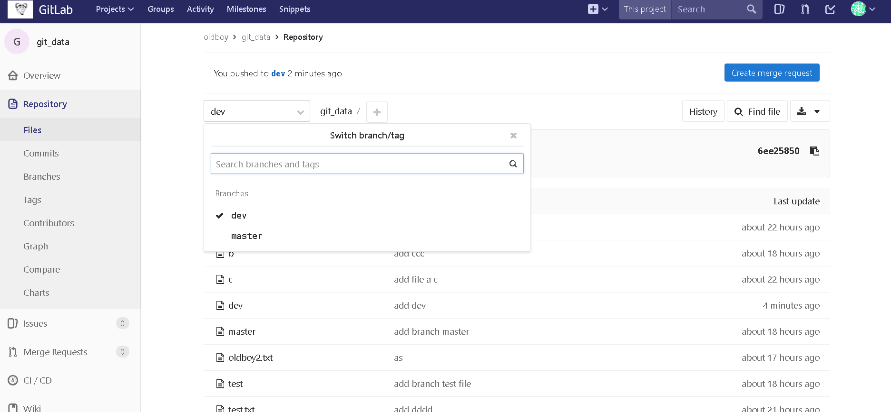


小结 上面dev操作


```plain
git branch dev
git checkout dev
touch dev
git add .
git commit -m "add dev"
git config --global user.email "dev@example.com"
git config --global user.name "dev"
git commit -m "add dev"
```


git push -u origin dev


### dev 用户默认可以推送 master主干代码


```plain
[root@jenkins git_data]# git branch
  dev
* master
[root@jenkins git_data]#
[root@jenkins git_data]#
[root@jenkins git_data]#
[root@jenkins git_data]#
[root@jenkins git_data]#
[root@jenkins git_data]#
[root@jenkins git_data]#
[root@jenkins git_data]# touch oldgirl
[root@jenkins git_data]# git add .
[root@jenkins git_data]# git commit -m "add oldgirl"
[master 7ba29f7] add oldgirl
 1 file changed, 0 insertions(+), 0 deletions(-)
 create mode 100644 oldgirl

[root@jenkins git_data]# git commit -m "add oldgirl"
[master 7ba29f7] add oldgirl
 1 file changed, 0 insertions(+), 0 deletions(-)
 create mode 100644 oldgirl
[root@jenkins git_data]# git push -u origin master
To git@192.168.137.200:oldboy/git_data.git
 ! [rejected]        master -> master (fetch first)
error: 无法推送一些引用到 'git@192.168.137.200:oldboy/git_data.git'
提示：更新被拒绝，因为远程版本库包含您本地尚不存在的提交。这通常是因为另外
提示：一个版本库已推送了相同的引用。再次推送前，您可能需要先合并远程变更
提示：（如 'git pull'）。
提示：详见 'git push --help' 中的 'Note about fast-forwards' 小节。

#返回master端测试推送，由于其他分支进行推送，和master端内容不一致，所以无法进行推送，使用git pull把代码拉取到本地，或者git fetch 把代码拉取到本地仓库后进行合并（注意：git pull = git tetch+git merge）
[root@jenkins git_data]# git pull
remote: Counting objects: 1, done.
remote: Total 1 (delta 0), reused 0 (delta 0)
Unpacking objects: 100% (1/1), done.
来自 192.168.137.200:oldboy/git_data
   9456d1b..73d13d6  master     -> origin/master
Merge made by the 'recursive' strategy.
 dev | 0
 1 file changed, 0 insertions(+), 0 deletions(-)
 create mode 100644 dev
[root@jenkins git_data]# git push -u origin master
Counting objects: 6, done.
Compressing objects: 100% (4/4), done.
Writing objects: 100% (4/4), 464 bytes | 0 bytes/s, done.
Total 4 (delta 2), reused 0 (delta 0)
To git@192.168.137.200:oldboy/git_data.git
   73d13d6..9e5dfe5  master -> master
```


分支 master 设置为跟踪来自 origin 的远程分支 master。


每次操作前  git  pull(下载远程代码)   操作后  git push(推送代码远端)


### 保护master 分支不可以被合并  dev用户不可以


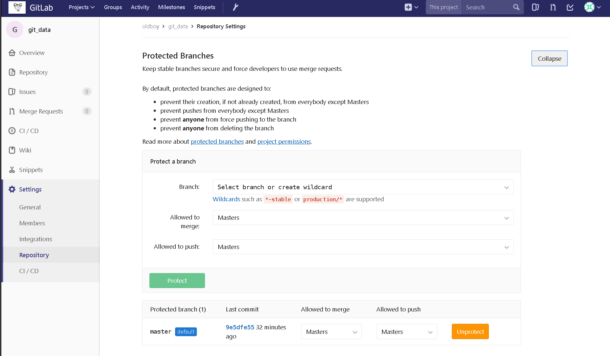


```plain
[root@jenkins git_data]# git branch
  dev
* master
[root@jenkins git_data]# touch 1.txt
[root@jenkins git_data]# git add .
[root@jenkins git_data]# git commit -m "add 1.txt"
[master 1aee1da] add 1.txt
 1 file changed, 0 insertions(+), 0 deletions(-)
 create mode 100644 1.txt
[root@jenkins git_data]# git push -u origin master
Counting objects: 3, done.
Compressing objects: 100% (2/2), done.
Writing objects: 100% (2/2), 228 bytes | 0 bytes/s, done.
Total 2 (delta 1), reused 0 (delta 0)
remote: GitLab: You are not allowed to push code to protected branches on this project.
To git@192.168.137.200:oldboy/git_data.git
 ! [remote rejected] master -> master (pre-receive hook declined)
error: 无法推送一些引用到 'git@192.168.137.200:oldboy/git_data.git'
```


### dev账号 只能推送dev分支的


```plain
[root@jenkins git_data]# git branch
  dev
* master
[root@jenkins git_data]# git branch -D dev
已删除分支 dev（曾为 6ee2585）。
```


```plain
[root@jenkins git_data]# git branch dev
[root@jenkins git_data]# git status
# 位于分支 master
# 您的分支领先 'origin/master' 共 1 个提交。
#   （使用 "git push" 来发布您的本地提交）
#
无文件要提交，干净的工作区
[root@jenkins git_data]# git branch dev
fatal: 一个分支名 'dev' 已经存在。
[root@jenkins git_data]# git checkout dev
切换到分支 'dev'
[root@jenkins git_data]# git push -u origin dev #下载远端dev分支代码
Counting objects: 3, done.
Compressing objects: 100% (2/2), done.
Writing objects: 100% (2/2), 228 bytes | 0 bytes/s, done.
Total 2 (delta 1), reused 0 (delta 0)
remote:
remote: To create a merge request for dev, visit:
remote:   http://192.168.137.200/oldboy/git_data/merge_requests/new?merge_request%5Bsource_branch%5D=dev
remote:
To git@192.168.137.200:oldboy/git_data.git
   6ee2585..1aee1da  dev -> dev
分支 dev 设置为跟踪来自 origin 的远程分支 dev。

[root@jenkins git_data]# git status
# 位于分支 dev
# 您的分支领先 'origin/dev' 共 1 个提交。
#   （使用 "git push" 来发布您的本地提交）
#
无文件要提交，干净的工作区
[root@jenkins git_data]# git branch
* dev
  master
[root@jenkins git_data]# touch dev2.txt
[root@jenkins git_data]# git add .
[root@jenkins git_data]# git commit -m "add dev2.txt"
[dev b9767dc] add dev2.txt
 1 file changed, 0 insertions(+), 0 deletions(-)
 create mode 100644 dev2.txt
[root@jenkins git_data]# git push -u origin dev #推送远端服务器
Counting objects: 5, done.
Compressing objects: 100% (4/4), done.
Writing objects: 100% (4/4), 391 bytes | 0 bytes/s, done.
Total 4 (delta 2), reused 0 (delta 0)
remote:
remote: To create a merge request for dev, visit:
remote:   http://192.168.137.200/oldboy/git_data/merge_requests/new?merge_request%5Bsource_branch%5D=dev
remote:
To git@192.168.137.200:oldboy/git_data.git
   1aee1da..b9767dc  dev -> dev
```


分支 dev 设置为跟踪来自 origin 的远程分支 dev。


网页刷新查看dev分支有dev2.txt

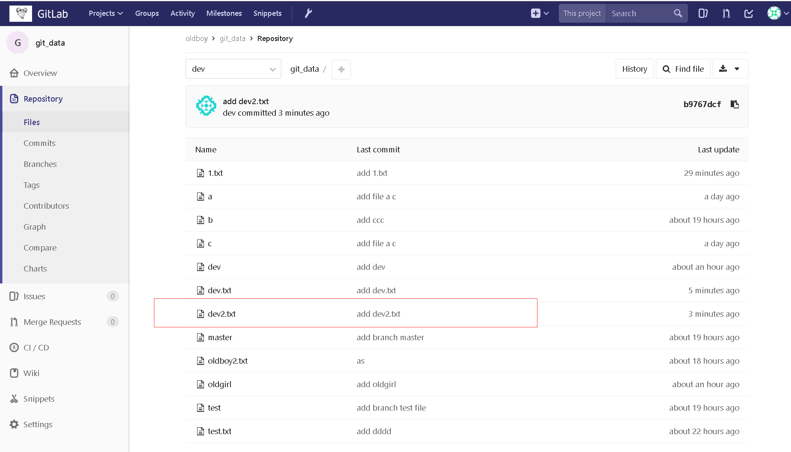


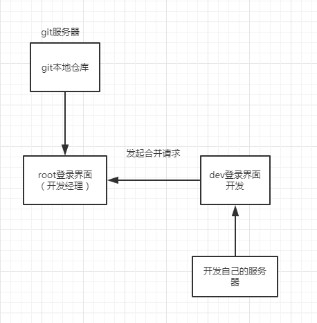


# jenkins


```plain
官网 jenkins.io
Jenkins是一个开源软件项目，是基于Java开发的一种持续集成工具，用于监控持续重复的工作，旨在提供一个开放易用的软件平台，使软件的持续集成变成可能。

1.安装准备
装备两台服务器 关闭selinux和防火墙
内存2G 50G+硬盘
jenkins  10.0.0.201
nexus    10.0.0.202

2.安装JDK运行环境和jenkins服务
上传JDK和jenkins rpm安装包，使用rpm -ivh进行安装,安装完JDK运维java测试是否安装成功
rpm -ivh jdk-8u181-linux-x64.rpm
rpm -ivh jenkins-2.99-1.1.noarch.rpm

3.配置jenkins
[root@jenkins git_data]# rpm -ql jenkins
/etc/init.d/jenkins
/etc/logrotate.d/jenkins
/etc/sysconfig/jenkins   #配置文件
/usr/lib/jenkins
/usr/lib/jenkins/jenkins.war  jenkins安装目录，WAR包会放在这里
/usr/sbin/rcjenkins
/var/cache/jenkins
/var/lib/jenkins
/var/log/jenkins

启动用户修改为root
JENKINS_USER="root"
[root@jenkins git_data]# sed -i '/JENKINS_USER=/c JENKINS_USER="root"' /etc/sysconfig/jenkins
[root@CentOS7 ~]# systemctl start jenkins
[root@CentOS7 ~]# systemctl enable jenkins
访问页面进行配置
http://192.168.137.201:8080

[root@jenkins git_data]# cat /var/lib/jenkins/secrets/initialAdminPassword
8d1f0c036b304eb9a9f5c2464817d405

登陆 输入密码 解锁
```


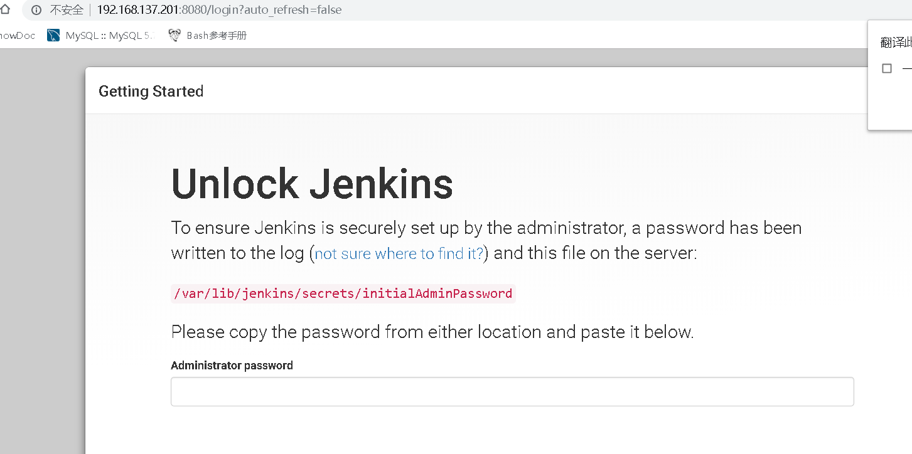

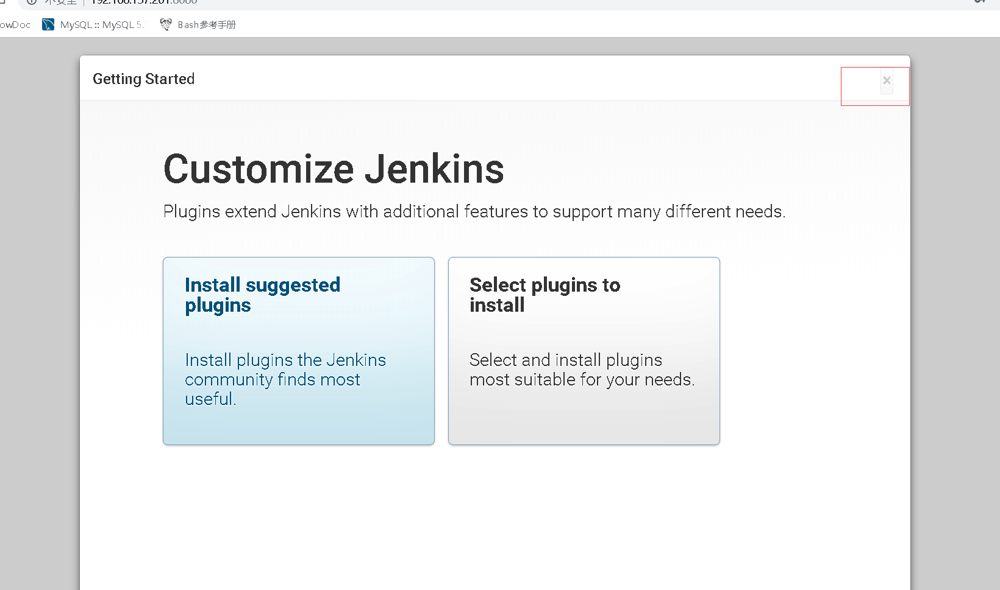

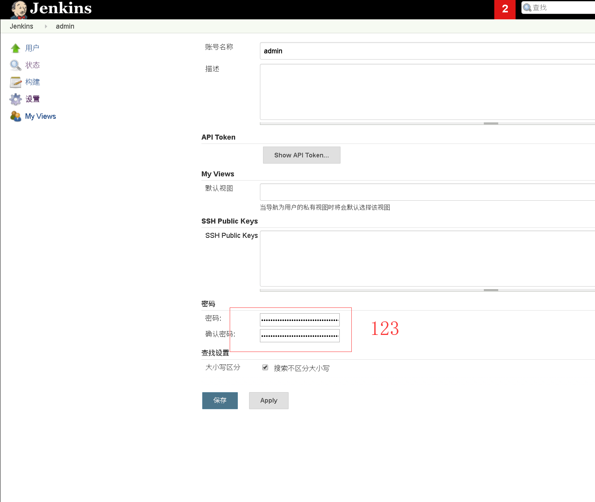


```plain
4.插件安装（跳过安装插件，直接上传插件到目录）和修改登录密码

  1.自动安装可选插件
  2.手动下载插件上传安装
  3.插件放入插件目录
    [root@CentOS7 ~]# cd /var/lib/jenkins/
    [root@CentOS7 jenkins]# ll      jobs为每次构建后构建的结果目录，plugins为插件目录
    总用量 36
    -rw------- 1 root root 1822 8月  26 00:35 config.xml
    -rw------- 1 root root  156 8月  26 00:31 hudson.model.UpdateCenter.xml
    -rw------- 1 root root 1712 8月  26 00:32 identity.key.enc
    -rw------- 1 root root   94 8月  26 00:32 jenkins.CLI.xml
    -rw-r--r-- 1 root root    4 8月  26 00:35 jenkins.install.InstallUtil.lastExecVersion
    -rw-r--r-- 1 root root    4 8月  26 00:35 jenkins.install.UpgradeWizard.state
    drwxr-xr-x 2 root root    6 8月  26 00:31 jobs
    drwxr-xr-x 3 root root   18 8月  26 00:32 logs
    -rw------- 1 root root  907 8月  26 00:32 nodeMonitors.xml
    drwxr-xr-x 2 root root    6 8月  26 00:32 nodes
    drwxr-xr-x 2 root root    6 8月  26 00:31 plugins  #插件目录
    -rw------- 1 root root   64 8月  26 00:31 secret.key
    -rw-r--r-- 1 root root    0 8月  26 00:31 secret.key.not-so-secret
    drwx------ 4 root root 4096 8月  26 00:32 secrets
    drwxr-xr-x 2 root root   23 8月  26 00:32 userContent
    drwxr-xr-x 3 root root   18 8月  26 00:34 users
    上传插件包解压到plugins下执行重启  systemctl restart jenkins

[root@jenkins jenkins]# tree users
users
└── admin
    └── config.xml    #用户配置文件

#上传插件文件
[root@jenkins plugins]# rz -E
rz waiting to receive.
[root@jenkins plugins]# ls
plugins.tar.gz
[root@jenkins plugins]# tar xf plugins.tar.gz
[root@jenkins plugins]# mv plugins.tar.gz /tmp/
[root@jenkins plugins]# mv plugins/* ./
[root@jenkins plugins]# systemctl restart jenkins
刷新网页 从新登陆  默认账号admin  密码是刚刚设置的123
```


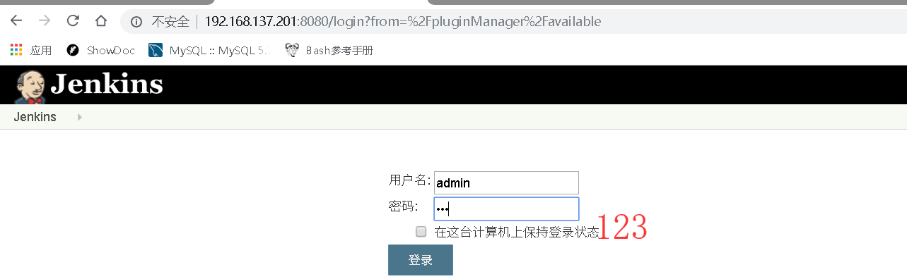


```plain

4.jenkins主要的目录
/usr/lib/jenkins/：jenkins安装目录，WAR包会放在这里
/etc/sysconfig/jenkins：jenkins配置文件，“端口”，“JENKINS_HOME”等都可以在这里配置
/var/lib/jenkins/：默认的JENKINS_HOME
```


/var/log/jenkins/jenkins.log：Jenkins日志文件


5.创建一个自由风格的项目freestyle-job


### 创建第一个项目


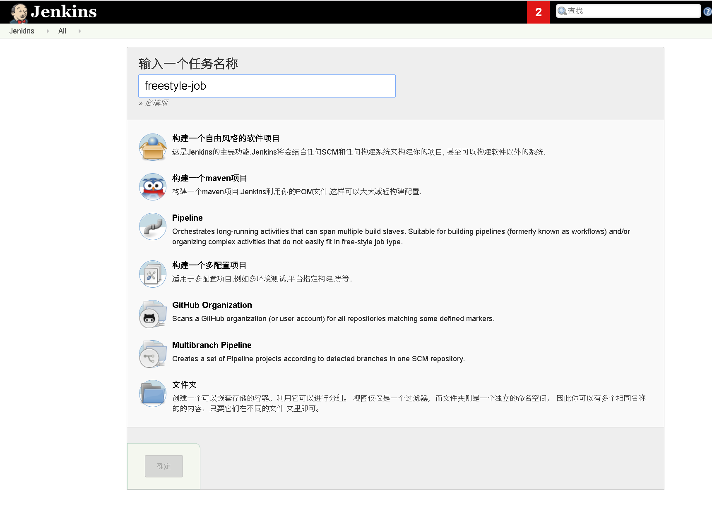

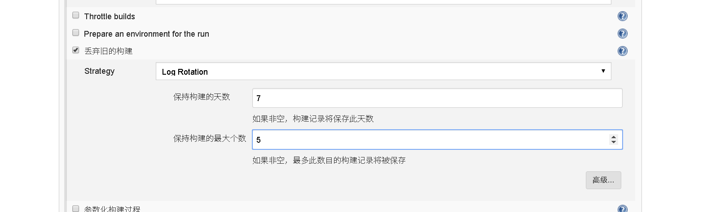

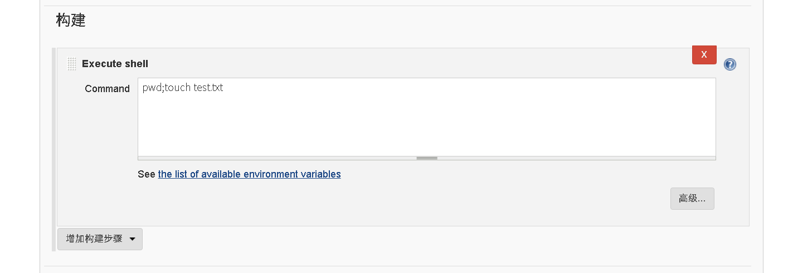

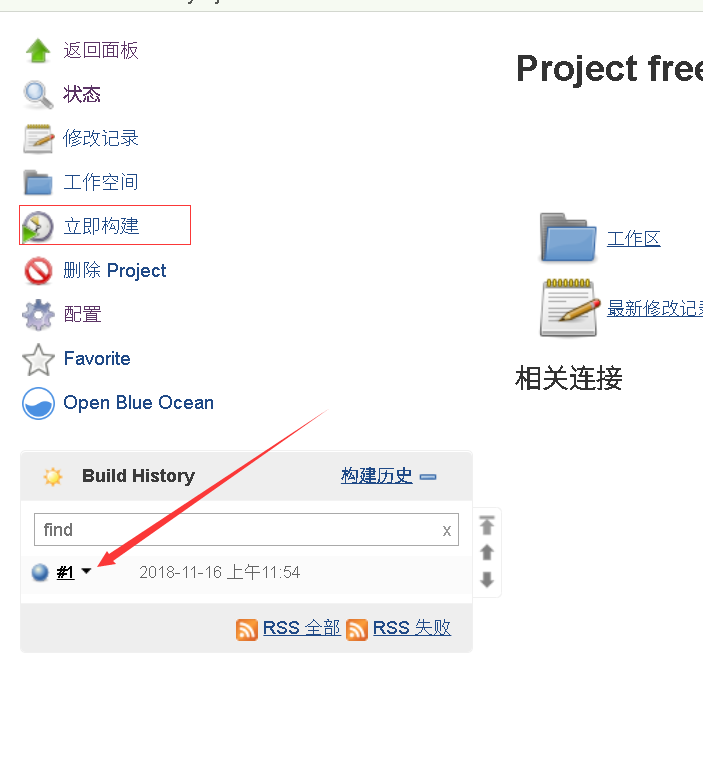

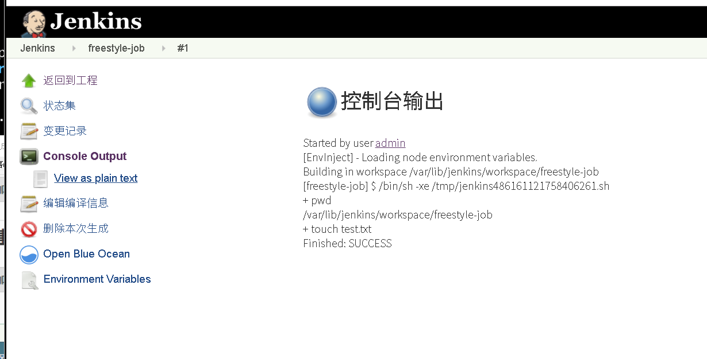


```plain
[root@jenkins workspace]# pwd
/var/lib/jenkins/workspace
[root@jenkins workspace]# tree
.
└── freestyle-job
```


└── test.txt


1 directory, 1 file


### 再启动一台ip 202 安装nginx


```plain
[root@web01 ~]# yum install -y nginx  #这里用的是阿里云仓库默认仓库yum源 
[root@web01 ~]# systemctl start nginx
[root@web01 ~]# netstat -lntup |grep 80
tcp        0      0 0.0.0.0:80              0.0.0.0:*               LISTEN      1068/nginx: master
tcp6       0      0 :::80                   :::*                    LISTEN      1068/nginx: master
[root@web01 ~]# cd /usr/share/nginx/html/
[root@web01 html]# ls
```


404.html  50x.html  index.html  nginx-logo.png  poweredby.png


### 再码云上找一个开源的项目


[https://gitee.com/kangjie1209/monitor](https://gitee.com/kangjie1209/monitor)


### gitlab 导入,码云的开源项目代码


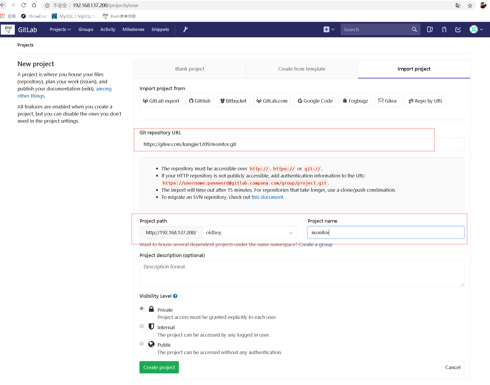


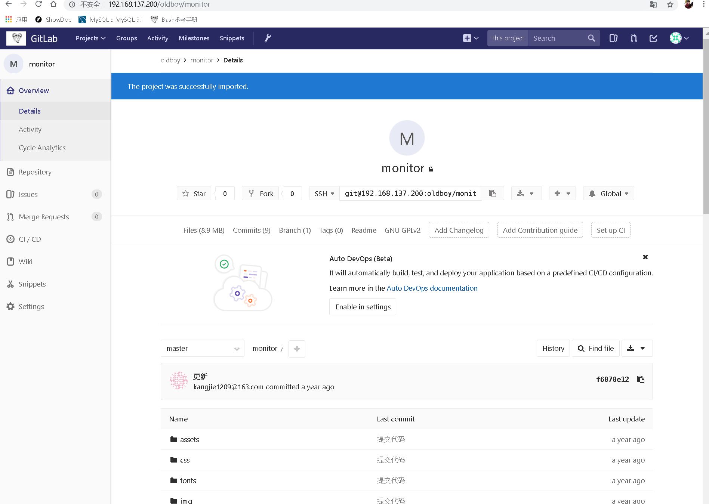


### 202ip web主机手动上线代码


```plain
[root@web01 data]# cd /usr/share/nginx/html/
[root@web01 html]# git clone https://gitee.com/kangjie1209/monitor.git
[root@web01 html]# ls
```


404.html  50x.html  index.html  monitor  nginx-logo.png  poweredby.png


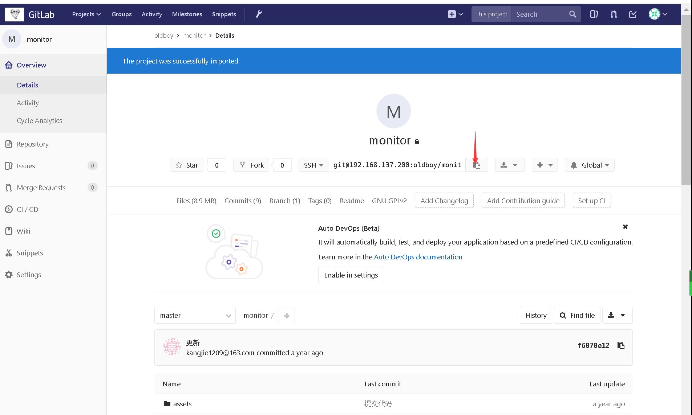


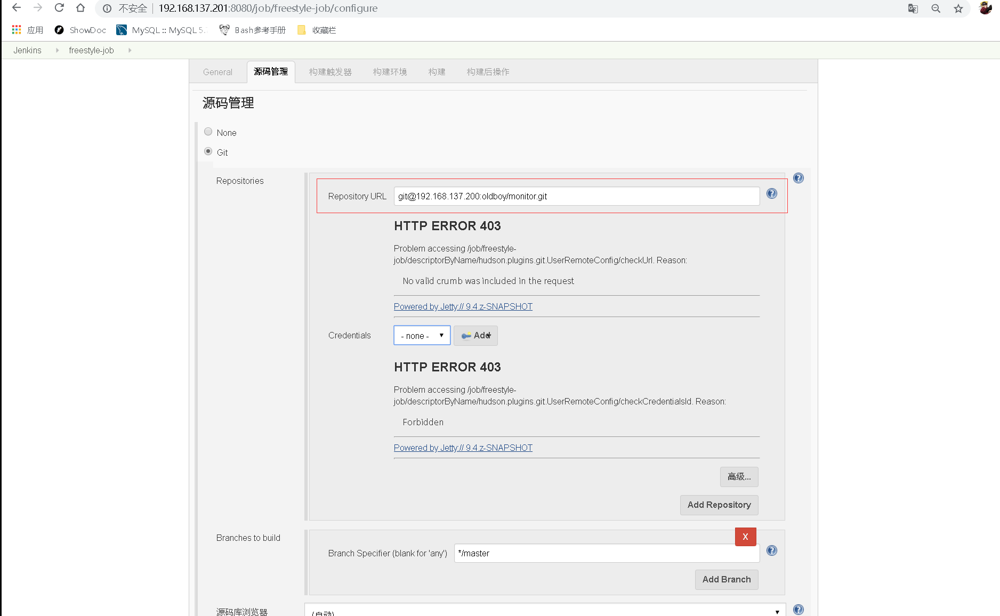


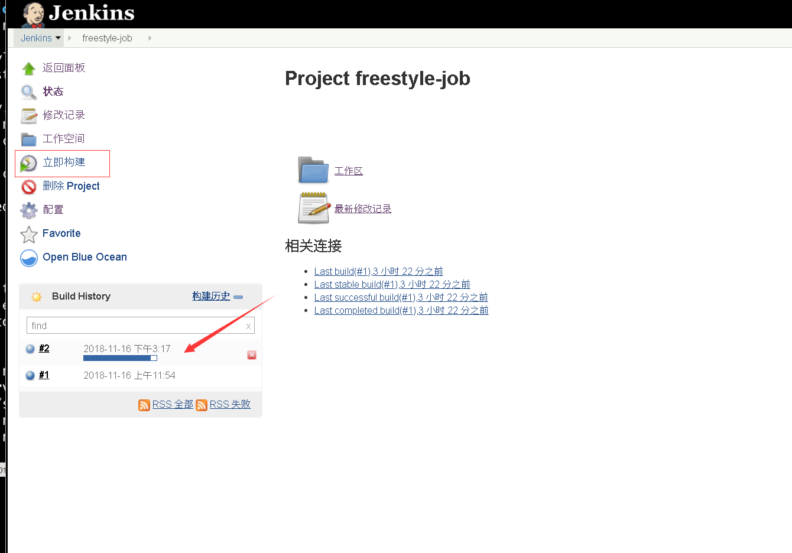


```plain
# jenkins 项目目录  Building in workspace /var/lib/jenkins/workspace/freestyle-job/

[root@jenkins jenkins]# cd /var/lib/jenkins/
[root@jenkins jenkins]# ls
```


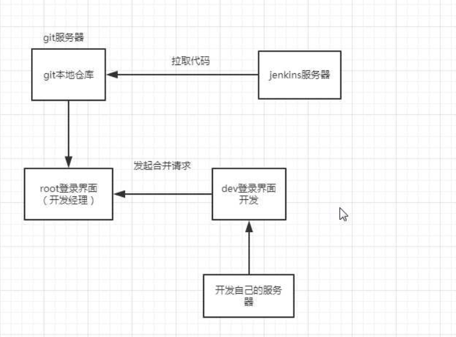


### 写一个脚本把从git仓库里获取的代码上传到web服务器站点目录下


```plain
[root@jenkins scripts]# pwd
/server/scripts
[root@jenkins scripts]# cat deploy.sh
#!/bin/sh
DATE=$(date +%Y-%m-%d-%H-%M-%S)
CODE_DIR="/var/lib/jenkins/workspace/freestyle-job"
WEB_DIR="/usr/share/nginx/"

get_code_tar(){
        cd $CODE_DIR && tar zcf /opt/web-$DATE.tar.gz ./*
}

scp_code_web(){
        scp /opt/web-$DATE.tar.gz 192.168.137.202:$WEB_DIR
}

code_tarxf(){
        ssh 192.168.137.202 "cd $WEB_DIR &&mkdir web-$DATE && tar xf web-$DATE.tar.gz -C web-$DATE"

}
ln_html(){
         ssh 192.168.137.202 "cd $WEB_DIR && rm -rf html && ln -s web-$DATE html"
}

main(){

        get_code_tar;
        scp_code_web;
        code_tarxf;
        ln_html;
}
main
```


```plain
[root@jenkins scripts]# ssh-keygen  #分发秘钥
Generating public/private rsa key pair.
Enter file in which to save the key (/root/.ssh/id_rsa):
/root/.ssh/id_rsa already exists.
Overwrite (y/n)? y
Enter passphrase (empty for no passphrase):
Enter same passphrase again:
Your identification has been saved in /root/.ssh/id_rsa.
Your public key has been saved in /root/.ssh/id_rsa.pub.
The key fingerprint is:
SHA256:n8WMHpGSpz9lokNh98eJmWmSfhdF0+4Ptr2r4trVIVI root@jenkins
The key's randomart image is:
+---[RSA 2048]----+
|               .o|
|         . .   .o|
|        = =  E ..|
|       . * B.* o.|
|        S *.&.=o |
|       . * X..=.o|
|        o B .o.=.|
|         ..+... o|
|         .oo...oo|
+----[SHA256]-----+
[root@jenkins scripts]# ssh-copy-id -i ~/.ssh/id_rsa.pub 192.168.137.202
/usr/bin/ssh-copy-id: INFO: Source of key(s) to be installed: "/root/.ssh/id_rsa.pub"
The authenticity of host '192.168.137.202 (192.168.137.202)' can't be established.
ECDSA key fingerprint is SHA256:rWMnrnl8HcCIxl800ItSZocIvyA67fCVN+jU81bBThc.
ECDSA key fingerprint is MD5:dd:0a:91:99:5c:62:72:bb:de:76:58:4f:84:7b:85:d7.
Are you sure you want to continue connecting (yes/no)? yes
/usr/bin/ssh-copy-id: INFO: attempting to log in with the new key(s), to filter out any that are already installed
/usr/bin/ssh-copy-id: INFO: 1 key(s) remain to be installed -- if you are prompted now it is to install the new keys
root@192.168.137.202's password:

Number of key(s) added: 1

Now try logging into the machine, with:   "ssh '192.168.137.202'"
and check to make sure that only the key(s) you wanted were added.

# 运行推送脚本 201 jenkins主机上
[root@jenkins scripts]# sh deploy.sh
web-2018-11-16-16-14-45.tar.gz                                              100% 4545KB  60.9MB/s   00:00

# 202web主机 查看推送的文件
[root@web01 nginx]# pwd
/usr/share/nginx
# html软链接到了 web-`日期`  的目录上的
[root@web01 nginx]# ll
总用量 4552
lrwxrwxrwx 1 root root      23 11月 16 16:14 html -> web-2018-11-16-16-14-45
drwxr-xr-x 2 root root     170 11月  5 21:26 modules
drwxr-xr-x 8 root root    4096 11月 16 16:14 web-2018-11-16-16-14-45
```


-rw-r--r-- 1 root root 4653885 11月 16 16:14 web-2018-11-16-16-14-45.tar.gz


浏览器访问192.168.137.202

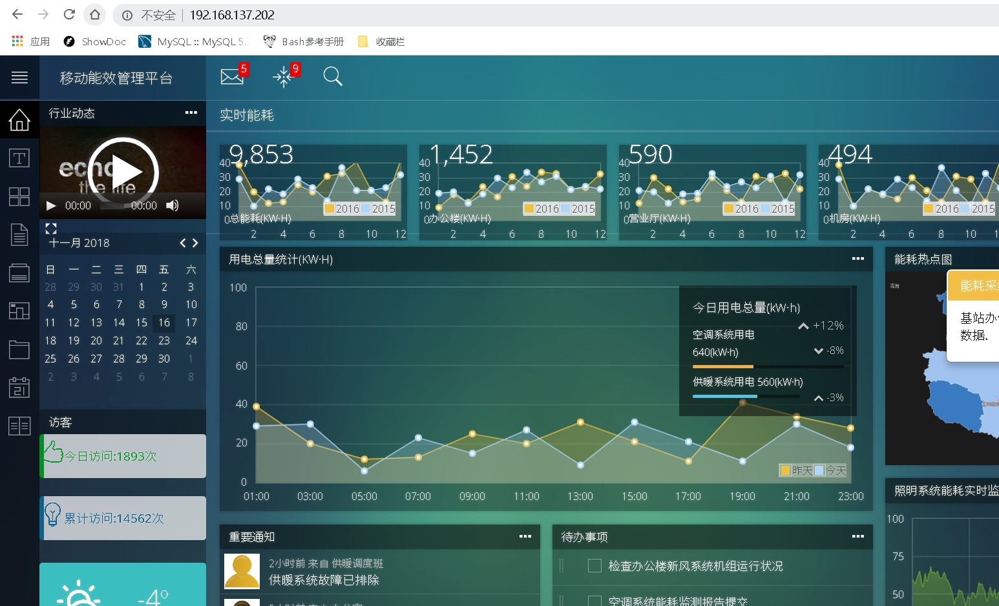


jenkins 配置


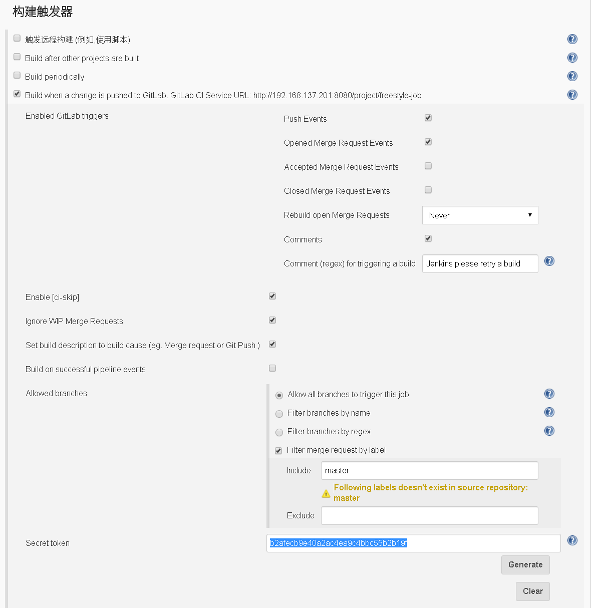


#开发主机克隆代码  修改 再推送


```plain
[root@hostname200 ~]# git clone git@192.168.137.200:oldboy/monitor.git
正克隆到 'monitor'...
remote: Counting objects: 435, done.
remote: Compressing objects: 100% (372/372), done.
remote: Total 435 (delta 53), reused 435 (delta 53)
接收对象中: 100% (435/435), 8.78 MiB | 0 bytes/s, done.
处理 delta 中: 100% (53/53), done.
[root@hostname200 ~]# ls
[root@hostname200 ~]# cd monitor/
[root@hostname200 monitor]# ls
[root@hostname200 monitor]# vim  index.html
[root@hostname200 monitor]# git add .
[root@hostname200 monitor]# git commit -m "add index.html"
[master 12e743e] add index.html
 1 file changed, 1 insertion(+), 1 deletion(-)
[root@hostname200 monitor]# git push -u origin master
Counting objects: 5, done.
Compressing objects: 100% (3/3), done.
Writing objects: 100% (3/3), 297 bytes | 0 bytes/s, done.
Total 3 (delta 2), reused 0 (delta 0)
To git@192.168.137.200:oldboy/monitor.git
   f6070e1..12e743e  master -> master
```


分支 master 设置为跟踪来自 origin 的远程分支 master。


## 报错检查


```plain
只有一个主分支master  git ip200服务器上创建dev分支
git branch dev
git checkout dev
git branch
```


### JENKINS主机上的公钥  贴到gitlab 的dev 用户sshkey上


```plain
[root@jenkins ~]# cat .ssh/id_rsa.pub
ssh-rsa AAAAB3NzaC1yc2EAAAADAQABAAABAQC+3DOFCwyImeBJrhoPDB8aoGs/4+aNJXWJv4THMPDwWgW1PdF94fCslLRx/jWSWAiRoCPIlhMZ5673vi94iXaCK+AgwnF//eMVe1RDnZfzaKBrL6RuQDrwa64o8yOK3yNtwxP0BE3kEMCV3A8jZixc4CvjyoFg+1+u9bxhx+3untZh2+ZUB9izxdLFEtDJmahC+N2+deKksl+4H2ArDa5YijVkUQdesEVw2ta5ol0XInUzawwydk6JAbAmUWK15bWloN/I+IptIXVgYym2WoCrBvrVOVqaOsh34x9muD+pAT2LhnkRNxpozBjiwfr7pUE7LEF1CEfPHzmMGCjO91Nn root@jenkins
```


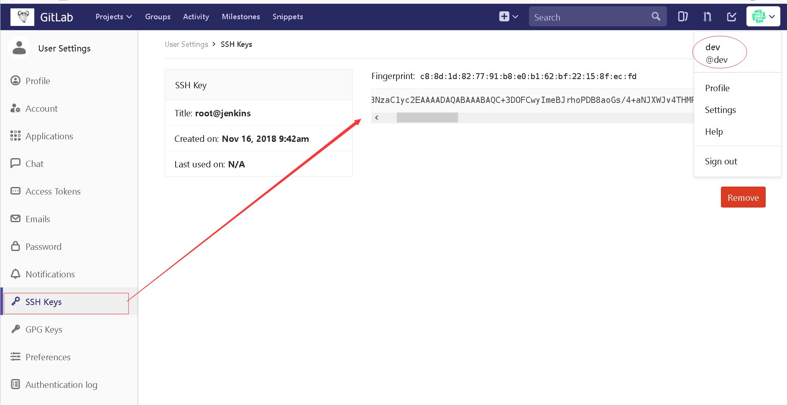


### jenkins配置


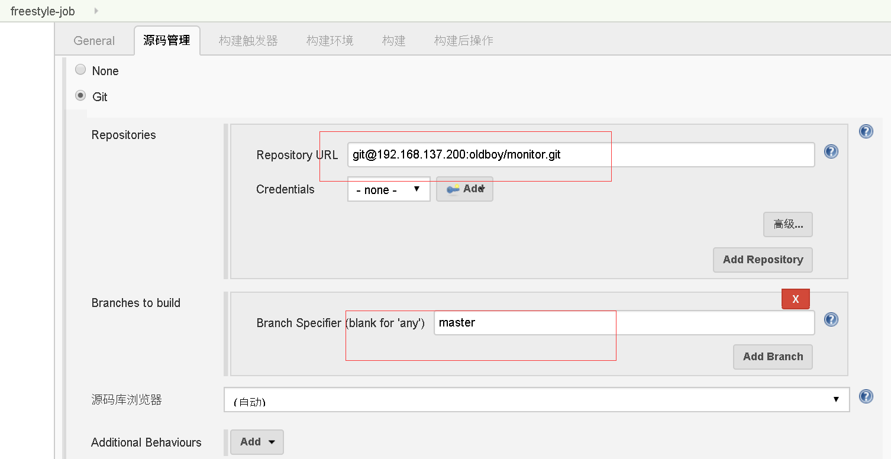


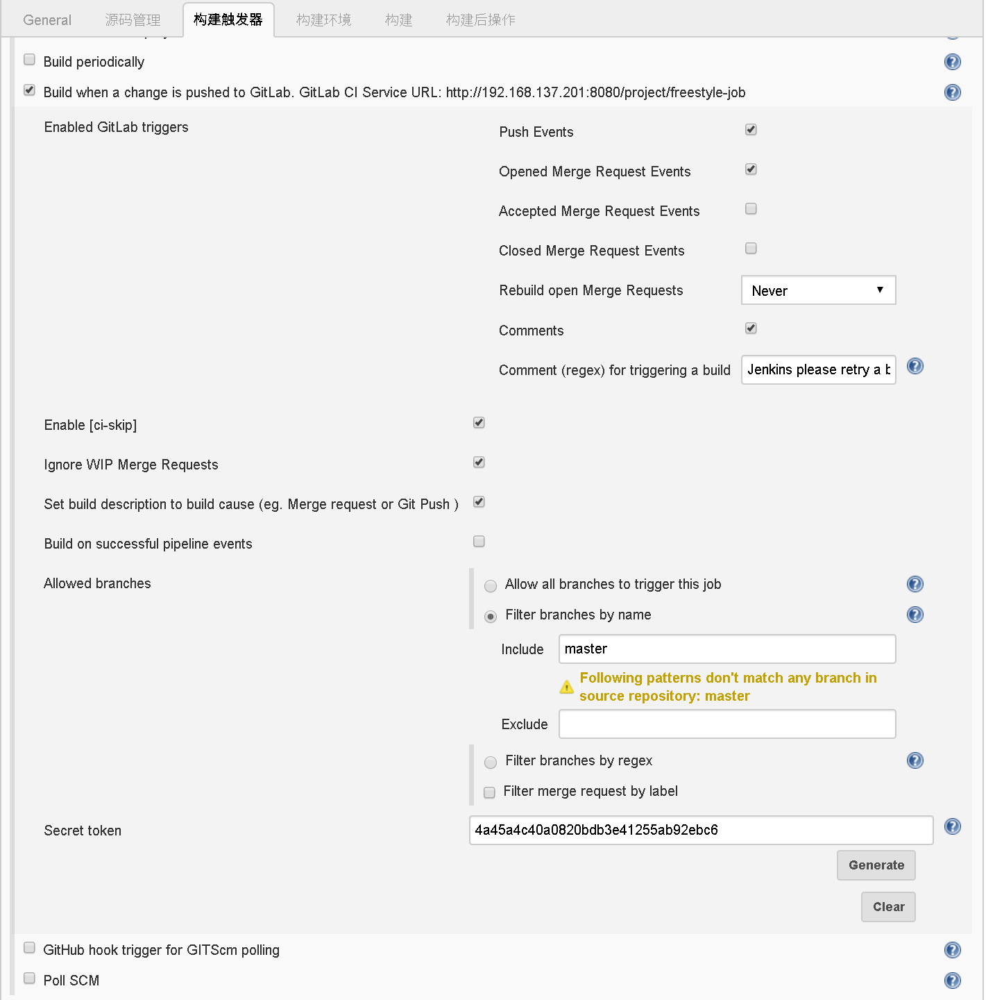

上面的 url:  http的地址  和 Secret token 秘钥复制到 gitlab web钩子 绑定项目事件页面上

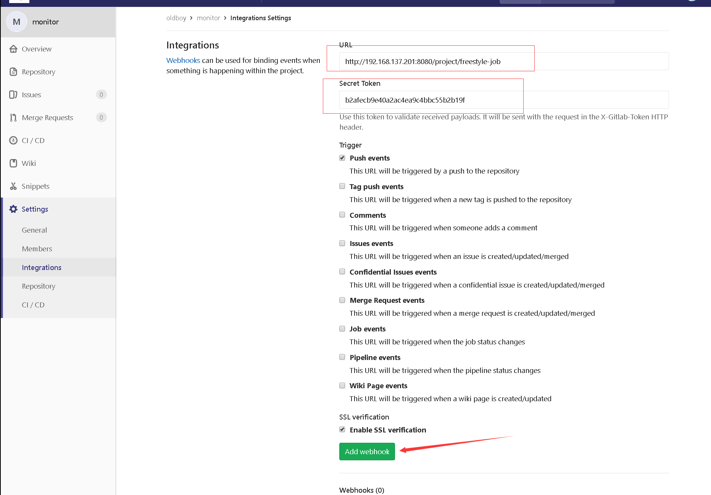


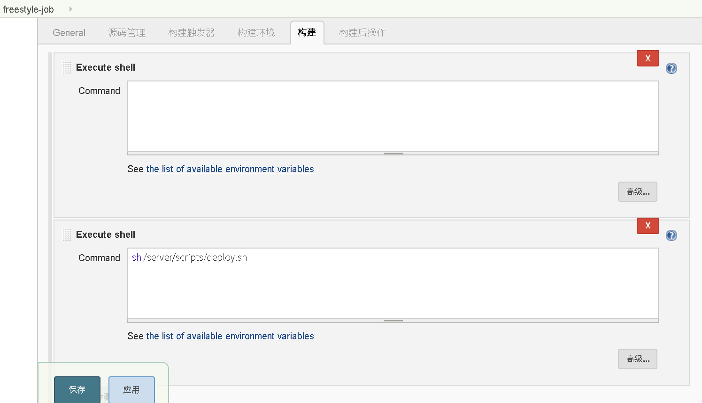


git主机上测试修改代码 推送


```plain
  cd /tmp/
  git clone git@192.168.137.200:oldboy/monitor.git
  cd monitor/
  ll
  vim index.html
  git status
  git add .
  git commit -m "add index"
  git push -u origin master
```


刷新网页查看 标题修改了


> 更新: 2024-09-03 22:38:31  
> 原文: <https://www.yuque.com/chengkanghua/oldboy50/tgqprp>