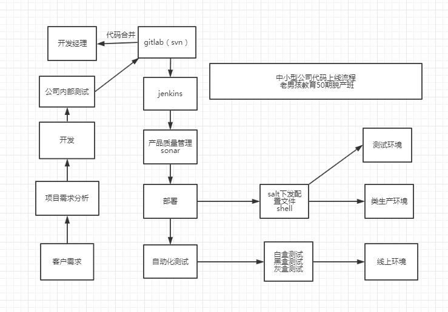

# day76 jenkins02

扩展：下载安装ESXi  并在上面安装虚拟机  使用VMware vSphere Client管理

[https://www.osyunwei.com/archives/6600.html?tdsourcetag=s_pctim_aiomsg](https://www.osyunwei.com/archives/6600.html?tdsourcetag=s_pctim_aiomsg)


[(方纪元)持续集成教程.pdf](https://www.yuque.com/attachments/yuque/0/2020/pdf/194754/1604224520666-f8005ad3-2419-47af-bdcd-99d9d7af358e.pdf)

[李振亚大礼包(绝密).7z](https://www.yuque.com/attachments/yuque/0/2020/7z/194754/1604224656611-33e4d90f-5d17-494d-ad38-982fd56a13c5.7z)

pipeline 示例

```bash
pipeline{
agent any
stages{
    stage("get code"){
       steps{
            echo "get code"
       }
    }
    stage("unit test"){
       steps{
            echo "unit test"
} }
    stage("package"){
        steps{
            sh 'tar zcf /opt/web-${BUILD_ID}.tar.gz ./* --exclude=.git/ --exclude=jenkinsfile'
            

} }
    stage("deploy"){
        steps{
            sh 'ssh 10.0.0.8 "cd /etc/nginx && mkdir web-${BUILD_ID}"'
            sh 'scp /opt/web-${BUILD_ID}.tar.gz 10.0.0.8:/etc/nginx/web-${BUILD_ID}'
            sh 'ssh 10.0.0.8 "cd /etc/nginx/web-${BUILD_ID} && tar xf web-${BUILD_ID}.tar.gz && rm -rf web-${BUILD_ID}.tar.gz"'
            sh 'ssh 10.0.0.8 "cd /etc/nginx && rm -rf html && ln -s web-${BUILD_ID} /etc/nginx/html"'
        }
} }
}

```

## 李振亚代码上线流程图



> 更新: 2024-09-03 22:40:15  
> 原文: <https://www.yuque.com/chengkanghua/oldboy50/vi3780>