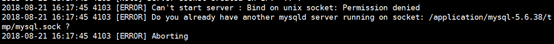
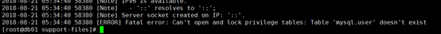
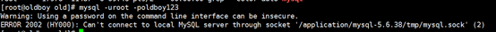
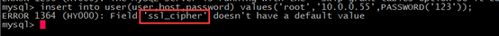
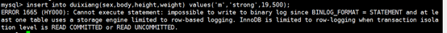
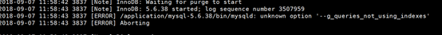
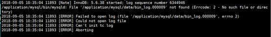
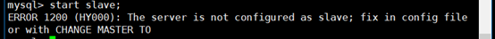

# 最终章·MySQL从入门到高可用架构报错解决

1.

报错原因：MySQL的socket文件目录不存在。

解决方法：创建MySQL的socket文件目录

mkdir /application/mysql-5.6.38/tmp

 

2.

报错原因：socket文件目录没有权限

解决方法：给socket文件目录授权mysql用户的权限

chown -R mysql.mysql /application/mysql-5.6.38/

 

3.

<!-- OCR_START -->
exist
_upgrade to create it.
<!-- OCR_END -->

报错原因：没有做初始化

解决方法：做初始化

./mysql_install_db --user=mysql --basedir=/application/mysql --datadir=/application/mysql/data

 

4.

报错原因：找不到socket文件

解决方法：1. mysql -uroot -poldboy123 -S /tmp/mysql.sock 指定socket文件路径

2.把socket文件放到默认路径下 mv /tmp/mysql.sock /application/mysql/tmp/

 

5.

<!-- OCR_START -->
> -skip-o
> ant-tables
<!-- OCR_END -->

报错原因：跳过授权表安全启动导致无法使用权限的设置

解决方法：使用insert，update语句对表进行修改添加用户权限

 

6.

报错原因：插入数据时，表内有字段含有默认值，必须填写

解决方法：在insert语句中加上对应字段的默认值

 

7.

<!-- OCR_START -->
- mysql>
- insert
- imysu!
- vaiues
- root
- ,PASSWORD(*123')
- '0,0,0,0,'mysql_native_password
- ERR0R1054(42S22):
- "N”）：
- Unknown column
- localhost
- 'field list
<!-- OCR_END -->

报错原因：SQL语句中含有中文字符所以不识别'localhost'

解决方法：将中文的标点符号改成英文的

 

8.

<!-- OCR_START -->
- uld not open
- or create the systen
- table
- space. If you tried
- to
- add
- it
- created in this failed attempt.
- InnoDB only wrote those files full of zeros,
- WOS
- But be
- careful:
- files which contain your precious
- but
- Plugin
- DR
- init function returned
- data
- 12748
- lugin
<!-- OCR_END -->

报错原因：设置的共享表空间小于当前共享表空间的大小

#当前共享表空间大小：76M

[root@oldboy data]# du -sh ibdata1

76M    ibdata1

#配置文件中共享表空间大小：50M

innodb_data_file_path=ibdata1:50M;ibdata2:50M:autoextend

解决方法：将配置文件中的50M修改为76M即可，然后重启MySQL

 

9.

报错原因：修改事务的隔离级别RC、RU的时候需要将binlog格式改成row

解决方法：在配置文件的[mysqld]标签下添加一行 binlog_format=row，重启MySQL

 

10.

报错原因：MySQL配置文件中参数有问题。

解决方法：修改MySQL配置文件中的对应参数。

 

11.

报错原因：使用操作不当的方式删除了binlog日志

解决方法：重新初始化数据库

 

12.

<!-- OCR_START -->
- Relay_Haster_Log_File: mysql-bin.000002
- SOLRunning
- Yos
- Replicate_Ignore_DB:
- Replicate_Do_Table:
- Replicate_Ign
- ore_Table:
- Replicate_wild_Ignore_ Table:
- Last_Errno: 0
- Skip_Counter:0
- Last_Error:
- Exec_Master_Log_Pos:
- Reloy Log_spre:
- 120
- Until condition:
- Until
- _Log_File:
- None
- Master_SSL_Altow
- UntiL Lec
- _Pos:
- No
- Master_SSL_CA_Path:
- Master
- Master_SSL_Cert:
- SSLCipher!
- SSL_Key:
- Seconds_Behind_Master: MULL
- Haster_SSL_Verify_Server_Cert:
- Last1oErrno:1593
- ast1o
<!-- OCR_END -->

报错原因：主从复制过程中master和slave的uuid相同

解决方法：修改uuid文件或者删除uuid文件并重启

vim /application/mysql/data/auto.cnf

[auto]

server-uuid=3ba9b12e-b4e8-11e8-b930-000c29a508b5

或者：

rm -f /application/mysql/data/auto.cnf

重启：

/etc/init.d/mysqld restart

 

13.

报错原因：从库没有执行change master to 语句，直接start slave;

解决方法：执行change master to语句

 

14.

<!-- OCR_START -->
- 2018-09-12 08:41:15 2177
- [ERROR]
- Plugin
- 'InnoDB
- init
- a STORAGE ENGINE failed.
- storage engine:InnoDB
- Aborting
<!-- OCR_END -->

报错原因：不认识innodb

解决方法：初始化

 

15.

报错原因：IO线程连接超时

解决方法：1.网络              ping

2.端口              telnet    tcping

         3.用户名、密码         mysql –urep –poldboy123 –h10.0.0.51 –P3309

 

16.

<!-- OCR_START -->
root@oldboy
backup]#mysg
-h10.0.0.10-P3309
line interface can be insecure.
RR0R1045（28000）:
<!-- OCR_END -->

报错原因：因为做了hosts解析，将ip反向解析成了主机名

解决方法：1.在所有主机上都相互做解析，grant rep@'oldboy'

2.在配置文件中[mysqld]标签下添加一行：skip_name_resolv（跳过反向解析）

> 更新: 2024-09-18 18:47:12  
> 原文: <https://www.yuque.com/chengkanghua/zg4iuy/wmut9w>