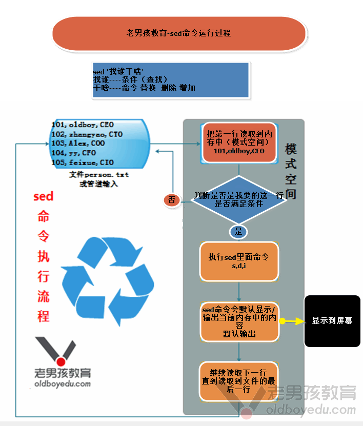

# day30 Shell 编程（下）：三剑客 grep sed

## 一、企业案例：检查 crond 是否在运行

需求：① 运行中显示 `crond is running`；② 未运行显示 `crond is not running`。

```bash
cat > checkcrond.sh <<EOF
#!/bin/bash
PATH=$PATH
count=`ps -ef|grep crond|wc -l`
echo $count
if [ $count -eq 2 ];then
    echo "crond is running"
else
    echo "crond is not running"
fi
EOF

mv checkcrond.sh checkcd.sh   # 改名成功
# 坑：检查进程是否存在时，脚本名里不要含 crond，否则 grep 会把自己也算进去
[root@ckh scripts]# sh checkcd.sh
2
crond is running

[root@ckh scripts]# /etc/init.d/crond stop
Stopping crond:                                            [  OK  ]

[root@ckh scripts]# sh checkcd.sh
1
crond is not running
```

**加颜色版本（调用系统 `action`）**
```bash
cat > checkcd.sh <<EOF
#!/bin/bash
PATH=$PATH
. /etc/init.d/functions
count=`ps -ef|grep crond|wc -l`
echo $count
if [ $count -eq 2 ];then
    action "crond is running"
else
    action "crond is not running" /bin/false
fi
EOF
[root@ckh scripts]# /etc/init.d/crond start
Starting crond:                                            [  OK  ]
```

**排除 grep 自身进程**
```bash
# 方法1：grep -v grep 过滤掉自身
[root@ckh scripts]# ps -ef|grep crond|grep -v grep
root       3387      1  0 10:06 ?        00:00:00 crond

# 方法2：正则技巧 grep '[c]rond'，让 grep 自身命令行不匹配
[root@ckh scripts]# ps -ef|grep '[c]rond'
root       3387      1  0 10:06 ?        00:00:00 crond
```

## 二、for 循环练习

```bash
for p in 1 2 3 4 5
do
    echo $p
done

# 使用 for 循环输出下列效果
# sh loop.sh
tao,01week 01group take you to 大宝剑, find 01woman
tao,02week 02group take you to 大宝剑, find 02woman
tao,03week 03group take you to 大宝剑, find 03woman
tao,04week 04group take you to 大宝剑, find 04woman
tao,05week 05group take you to 大宝剑, find 05woman
tao,06week 06group take you to 大宝剑, find 06woman

cat > loop.sh <<EOF
#!/bin/bash
for sum in {01..6}
do
    echo "tao,${sum}week ${sum}group take you to 大宝剑, find ${sum}woman"
done
EOF

# 写在一行
for p in {01..6};do echo "tao,${p}week ${p}group take you to 大宝剑, find ${p}woman"; done
```

## 三、优化系统开机启动项

只保留 `crond sshd network rsyslog sysstat`，其余全部关闭。

**CentOS 6（chkconfig）**
```bash
chkconfig | awk '!/crond|sshd|network|rsyslog|sysstat/{print $1}'
chkconfig | egrep -v 'crond|sshd|network|rsyslog|sysstat' | awk '{print $1}' | tr "\n" " "

cat > fuwu.sh <<EOF
#!/bin/bash
for name in `chkconfig|egrep -v 'crond|sshd|network|rsyslog|sysstat'|awk '{print $1}'|tr "\n" " " `
do
    chkconfig $name off
done
EOF
```

**CentOS 7（systemctl）**
```bash
systemctl list-unit-files --type=service | grep enabled   # 所有开机启动服务
systemctl list-unit-files --type=service | grep enabled | awk '!/crond|sshd|network|rsyslog|sysstat|autovt@|getty@/{print $1}'

cat > fuwu.sh <<EOF
#!/bin/bash
for name in \$(systemctl list-unit-files --type=service | grep enabled | awk '!/crond|sshd|network|rsyslog|sysstat|autovt@|getty@/{print $1}')
do
    systemctl disable $name
done
EOF
```

## 四、批量添加用户并设置随机密码（for）

```bash
# date +%N 纳秒级，配合 md5sum 生成随机密码
# date +%N |md5sum|cut -c1-8
1619c6aa
# echo $RANDOM                 # 随机数字
26984
# echo $RANDOM+10000000|bc    # bc 用于计算
10026887
# echo $(($RANDOM+10000000))  # $(()) 计算数字
10029414

cat > addstu.sh <<EOF
#!/bin/bash
for name in stu{01..3}
do
    useradd $name
    pass=`date +%N|md5sum|cut -c1-8`
    echo $pass|passwd --stdin $name
    echo $name $pass>>/tmp/user.log
done
EOF
```

## 五、三剑客 find / grep / sed

### find 常用选项
```
-maxdepth 1      目录层级（搜索深度）
-type            按类型（f 文件 / d 目录）
-name           按名字查找
-iname          按名字查找，不区分大小写
-mtime          按时间（天）
!               取反
-perm           按权限 permission
-user           按所属用户
-exec   {} \;   对结果执行命令
```

### grep 常用选项
```
-v          排除匹配行
-n          显示行号
-E          支持扩展正则（等同 egrep）
-o          只显示匹配到的部分
-i          不区分大小写
-l          只显示文件名（如找出含 oldboy 的文件）
--color     高亮匹配
-A 2        After：显示匹配行及其后 2 行
-B          Before：显示匹配行及其前 N 行
-C          Context：显示匹配行上下文
```

### sed 流编辑器（stream editor）
```
-r          支持扩展正则
-n          取消默认输出（常与 p 配合）
-i          直接修改文件
-i.bak      修改前自动备份原文件为 .bak
```
```bash
sed -r 's#[0-9]##g' oldboy.txt     # 选项 命令 替换 全局
sed -n '1p'                         # 只打印第 1 行
```
> 组成结构：选项（option）+ 命令（如 s 替换 / p 打印 / d 删除）+ 作用范围（全局 g）。

**sed 执行过程**
1. 读取文件第 1 行内容
2. 判断是否满足条件
3. 满足则执行对应命令（p / s / d）
4. 不满足则回到第 1 步继续读下一行
5. 直到文件最后一行结束

### 环境准备与行定位练习
```bash
cat>person.txt<<EOF
101,oldboy,CEO
102,zhangyao,CTO
103,Alex,COO
104,yy,CFO
105,feixue,CIO
110,lidao,COCO
EOF

sed -n 5p  person.txt                      # 显示第 5 行
sed -n '2,5p' person.txt                   # 显示第 2~5 行
sed -n '3,$p' person.txt                   # 显示第 3 行到最后一行（$）
sed -n '1p;4p;5p' person.txt               # 显示第 1、4、5 行
sed -n "/oldboy/p" person.txt              # 显示包含 oldboy 的行
sed -n "/101/,/105/p" person.txt           # 从含 101 的行到含 105 的行
sed -n '/oldboy/,/yy/p' person.txt         # 从含 oldboy 到含 yy 的行

# 特殊写法：显示第 1、4、5 行
sed -n '1p ;4p; 5p' person.txt
# 1~2 表示每隔 2 行取 1 行（从 1 开始）
seq 10 | sed -n '1~2p'
sed -n '/Alex/p'  person.txt
# 显示含 Alex 的行及其后两行
sed -n '/Alex/,+2p'  person.txt
grep -A2 "Alex" person.txt
```

### 引号的区别
```
单引号  —— 所见即所得（不解析变量）
双引号  —— 解析特殊符号（如 $变量）
不加引号 —— 支持通配符 {} 等
```




> 更新：2024-08-22 09:46:31
> 原文：<https://www.yuque.com/chengkanghua/oldboy50/mrc1n9>
