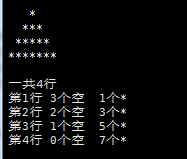
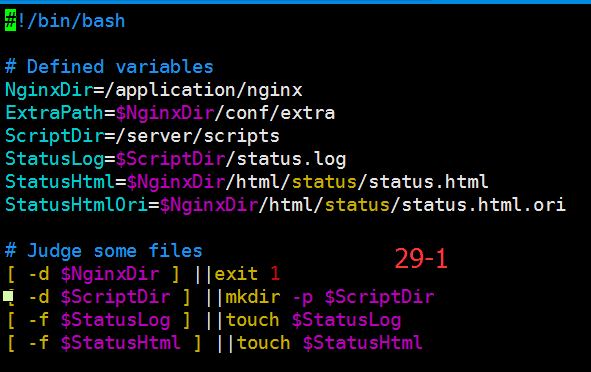
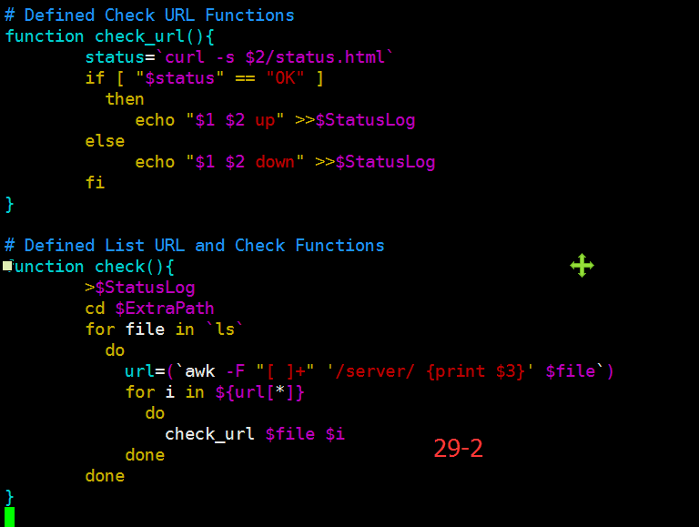
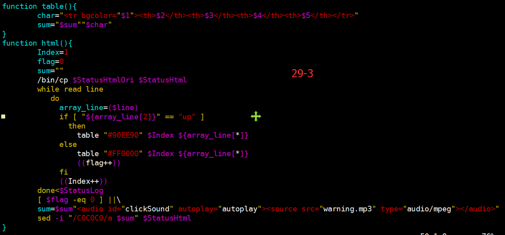

# Shell 编程（五行）综合教程

> 本文档已做排版优化（清除样式标签、统一导航），全部代码示例原样保留。

## 目录
- vim
- git   脚本的本地版本管理
- shell编程基础
  - 什么是shell
  - shell命令分类
  - 登录式shell加载配置文件顺序
  - 什么是shell脚本
  - shell脚本语言的种类
  - 子shell
  - shell脚本执行
  - 脚本注释
  - shell中常用命令
    - echo命令
    - 读其赋给一个变量
    - cat命令
    - tee命令
    - exec命令
    - printf命令
    - trap命令
    - declare
    - eval命令
- shell帮助与资料
- shell变量
  - 自定义环境变量
- **env**
  - 定义本地变量
  - 位置变量
  - 特殊变量
  - 变量子串
  - 变量数值运算
- shell函数
- shell 条件表达式
  - 条件测试与比较
  - 文件测试表达式
- shell中的普通数组
- shell中的关联数组（associative arrays）
- 条件控制语句 if
- 条件控制语句case
- for循环
- while 循环
- 循环条件控制语句 select
- shell脚本实战
  - 企业Shell面试题1：批量生成随机字符文件名案例
  - 企业Shell面试题2：批量改名特殊案例
  - 企业Shell面试题3：批量创建特殊要求用户案例
  - 企业Shell面试题4：扫描网络内存活主机案例
  - 企业Shell面试题5：解决DOS攻击生产案例
  - 企业Shell面试题6：MySQL数据库分库备份
  - 企业Shell面试题7：MySQL数据库分库分表备份
  - 企业Shell面试题8：筛选符合长度的单词案例
  - 企业Shell面试题9：MySQL主从复制异常监控案例
  - 企业Shell面试题10：比较整数大小经典案例
  - 企业Shell面试题11：菜单自动化软件部署经典案例
- sh menu.sh
  - 企业Shell面试题12：Web及MySQL服务异常监测案例
  - 企业Shell面试题13：监控Memcached缓存服务是否正常
  - 企业Shell面试题14：开发脚本入侵检测与报警案例
  - 企业Shell面试题15：开发Rsync服务启动脚本案例
  - 企业Shell面试题16：开发MySQL多实例启动脚本
  - 企业Shell面试题17：天津项目学生实践抓阄案例
  - 企业Shell面试题18：破解RANDOM随机数案例
  - 企业Shell面试题19：批量检查多个网站地址是否正常
  - 企业Shell面试题20：单词及字母去重排序案例
  - 企业Shell面试题21：开发脚本管理服务端LVS案例
  - 企业Shell面试题22：LVS节点健康检查及管理脚本案例
  - 企业Shell面试题23：LVS客户端配置脚本案例
  - 企业Shell面试题24：模拟keepalved软件高可用案例
  - 企业Shell面试题25：编写正（或长）方形图形案例
  - 企业Shell面试题26：编写等腰三角形图形字符案例
  - 企业Shell面试题27：编写直角梯形图形字符案例
  - 企业Shell面试题28：51CTO博文爬虫案例
  - 企业Shell面试题30：企业代码上线发布系统案例
  - 企业shell面试题31：在之前的30道shell编程题目中给每个伙伴随机抽取10道题目

#  vim
官方文档

http://vimdoc.sourceforge.net/htmldoc/usr_toc.html


1. **vim配置**

| 相关配置文件 | 功能描述 |
| :--- | :--- |
| .viminfo  | 用户使用vim的操作历史 |
| .vimrc  | 当前用户vim的配置文件 |
| /etc/vimrc  | 所有用户vim的配置文件 |
| /usr/share/vim/vim74/colors/  | 配色模板文件存放路径 |


1. ** vim配置方案 **

```bash
syntax on 				"语法检查及高亮
set fenc=utf-8 		"设定默认解码
set fencs=utf-8,usc-bom,euc-jp,gb18030,gbk,gb2312,cp936
set number 					"显示行号
set autoindent 		"vim使用自动对齐，也就是把当前行的对齐格式应用到下一行
set smartindent 	"依据上面的对齐格式，智能的选择对齐方式
set tabstop=4 		"设置tab键为4个空格
set shiftwidth=4  "设置当行之间交错时使用4个空格
set ruler         "设置在编辑过程中,于右下角显示光标位置的状态行
set incsearch    "设置增量搜索,这样的查询比较smart
set showmatch    "高亮显示匹配的括号
set matchtime=10 "匹配括号高亮时间(单位为 1/10 s)
set ignorecase   "在搜索的时候忽略大小写
#set nobackup    "禁止生成临时
set cursorline   "当前行高亮
set t_Co=256         “支持256色
colorscheme molokai  "使用molokai颜色模板

```


1. ** .vimrc  vi的配置文件**

```bash
# 用户家目录下创建 .vimrc   即 ~/.vimrc
cat > ~/.vimrc<<EOF
syntax on
set fenc=utf-8
set fencs=utf-8,usc-bom,euc-jp,gb18030,gbk,gb2312,cp936
set number
set autoindent
set smartindent
set tabstop=2
set shiftwidth=2
set ruler
set incsearch
set showmatch
set matchtime=10
set ignorecase
set nobackup
set cursorline
set t_Co=256
colorscheme molokai
EOF


```


1. ** vim配置模板**

```bash
https://github.com/flazz/vim-colorschemes

# 模板安装到用户家目录下
mkdir ~/.vim/colors/ -p

# 模板安装到公共的模板目录下
# cd /usr/share/vim/vim74/colors/


```


1. ** 实用的.vimrc**

```bash
cat > ~/.vimrc <<\EOF
set number
"SET Comment START
autocmd BufNewFile *.php,*.js,*.cpp exec ":call SetComment()" |normal 10Go
func SetComment()
if expand("%:e") == 'php'
  call setline(1, "<?php")
elseif expand("%:e") == 'js'
  call setline(1, '//JavaScript file')
elseif expand("%:e") == 'cpp'
  call setline(1, '//C++ file')
endif
  call append(0, '#!/bin/bash')
  call append(1, '################################################')
  call append(2, '# Filename: '.expand("%"))
  call append(3, '#')
  call append(4, '# Author: xdz - 1226032602@qq.com')
  call append(5, '# Description: ---')
  call append(6, '# Create: '.strftime("%Y-%m-%d %H:%M:%S"))
  call append(7, '# Last Modified: '.strftime("%Y-%m-%d %H:%M:%S"))
  call append(8, '################################################')
  "call append(9, '')
endfunc
map <F2> :call SetComment()<CR>:10<CR>o
"SET Comment END
EOF

```


1. ** 快捷键**

| 快捷键 | 功能 |
| :--- | --- |
| /word | 光标从上向下查找一个名称为word的字符串 |
| ?word | 光标从下向上查找一个名称为word的字符串 |
| n | 为向后执行一个对匹配内容的查找动作 |
| N | 与n相反 |
| :n1,n2s#word1#word2#g | 在n1与n2行之间查找word1并替换为word2 |
| :%s#word1#word2#g | 全文查找word1并替换为word2 |
| :w | 保存 |
| :q | 退出 |
| :wq! | 强制保存退出 |
| :x | 文档发生修改，则保存退出，否则，仅退出 |
| ZZ | 文档发生修改，则保存退出，否则，仅退出 |
| :w filename | 保存当前文档到filename文档中 |
| :r filename | 读入filename文档的内容并加载到当前文档 |
| :n1,n2 w filename | 将n1到n2行的内容保存成filename文件中 |
| :n1,n2 co n3 | 将n1到n2行的内容拷贝到n3行后面 |
| :n1,n2 m n3 | 将n1到n2行的内容移动到n3行后面 |
| :!command | 暂时离开vi到命令行模式下执行command的显示结果 |
| :set nu | 显示行号 |
| :set nonu | 取消行号 |
| :noh | 取消高亮显示 |
| :vsp file | 垂直分屏显示，同时显示当前文件和file文件内容 |
| :sp file | 水平分屏显示，同时显示当前文件和file文件内容 |


1. ** vim同时编辑多个文件**

```bash
切换到下一个文件
:bn
切换到上一个文件
:bp

```


1. ** 可视模式**
2. **  批量插入内容**

```bash
ctrl+v  
选中行
shift+i   可以插入内容（例如#）
esc退出

```


1. **  错乱的文件对齐**

```bash
v  进入可视
选中内容
按=号


```


1. ** 搜索匹配**

```bash
从上到下的顺序，匹配出每个单词bin
/\<bin\>                         #命令模式下执行


1.  光标移动到行末，shift+j，可以把下一行跟本行合并

1.   文件的几行内容复制到文件末尾
:3,5 co $


1.  在非空行结尾添加一个字符串
:%s#\(^[^( *$)].*\)#\1 www.abc.com#g
1.  在非空行开头添加#
:%s@\(^[^( *$)].*\)@#\1@g


1.  删除空行
:g/^ *$/d


1.  删除所有行尾多余的空格
:%s# *$##


1.  vim帮助
搜索帮助例子
:h
:h :wq

1. vim 查看二进制文件
:%!xxd
%表示整个文件
!把前面内容传递给特定的命令/软件
xxd 16进制编辑器

转换回来
:%!xxd -r

1.  其他查看二进制文件的工具
od -x /bin/cp
-x  十六进制
 -d   十进制
 -o   八进制


xxd /bin/ls

hexdump /bin/ls

xxd  -g 1  -i  -u  -l 1000  cp >cp.txt
-g          number of octets per group in normal output. Default 2. 每个goup的字节数，默认为2，可设置。
-i          output in C include file style. ：输出为c包含文件的风格，数组方式存在
-l len      stop after <len> octets.        ：转换到len个字节后停止转换。
-u          use upper case hex letters. ： 字节大写方式
```


#   git   脚本的本地版本管理


 使用git可以对本地脚本进行版本管理，每次修改都可以保存成一个历史版本，从而便于对脚本历史版本的追溯和回溯

| 命令 | 功能 |
| :--- | :--- |
| git init | 初始化git仓库 |
| git add file | 添加新文件到仓库 |
| git commit -m "xxxxxx" | 提交修订版本 |
| git checkout  revision | 检出修订版本 |
| git reset --hard  revision | 回退到某个修订版本 |
| git log -all | 查看历史修订版本 |
| git reset --hard 3628164 | 版本回退 |


1. **  git一些操作**

```bash
rpm -qa git
mkdir class_git;cd class_git/
git init
ls -adl .git
echo 'first git' > file.log
git add .
git commit -m "first commit"
git config --global user.name "ckh"
git config --global user.email chengkanghua@foxmail.com
git log
echo 'second commit' >> file.log
git add .
git commit -m "second commit"
git log

1.  git log输出格式优化
alias  git_log="git log --graph --pretty=format:'%Cred%h%Creset -%C(yellow)%d%Creset %s %Cgree(%cr)%Creset' --abbrev-commit --date=relative"

# git_log
* c399ef4 - (HEAD, master) second commit %Cgree(43 seconds ago)

```


#  shell编程基础
http://www.gnu.org/software/

http://www.gnu.org/software/bash/manual/


合格linux运维人员必会的30道shell编程面试题

http://blog.51cto.com/oldboy/1867160


##   什么是shell
   shell是一个命令解释器，它在操作系统的最外层，负责直接与用户对话，把用户的输入解释给操作系统，并处理各种各样的操作系统的输出结果，输出到屏幕返回给用户，这种对话方式可以是交互式（从键盘输入命令，可以立即得到shell的回应），或非交互（执行脚本程序）的方式

> **文字版（示意）：**

```
┌──────────────────────────────┐
│        外围应用程序          │
│  ┌────────────────────────┐  │
│  │    命令解释器 shell    │  │
│  │  ┌──────────────────┐  │  │
│  │  │     系统核心     │  │  │
│  │  │  ┌────────────┐  │  │  │
│  │  │  │    硬件    │  │  │  │
│  │  │  └────────────┘  │  │  │
│  │  └──────────────────┘  │  │
│  └────────────────────────┘  │
└──────────────────────────────┘

外围应用程序通过 shell 与系统核心、硬件打交道，shell 处于操作系统最外层
```


交互式方式：从键盘输入命令，通过/bin/bash的解析，可以立即得到shell的回应

非交互式的方式：脚本


##   shell命令分类
内置命令  

内嵌在bash中


外部命令

存放在磁盘上，是磁盘上的一个可执行文件

查看命令类型


```bash
# type cd
cd is a shell builtin
# type df
df is /bin/df

# type ls
ls is aliased to `ls --color=auto'
```


1. **  语言的类型**

编译型语言：

C   C++   go  必须把源代码编译（./configure  make  make install）成目标文件

然后执行（不依赖语言环境），看不到源代码   例如：rsync  nfs  nginx  linux 等

优点是执行效率高


解释性语言：

有一个专门的解释器读取代码，然后解释执行，因此依赖环境，而且能够看到源代码。

例如：python  perl  php   bash 等 。虽然性能比不上编译型语言，但是目前CPU性能过剩，缺点越来越不明显


1. ** 为什么要学习shell编程**

 shell脚本语言是实现linux/unix 系统管理机自动化运维所必备的重要工具，linux/unix系统的底层及基础应用软件的核心大部分涉及shell脚本的内容。每一个合格的linux系统管理员或运维工程师，都需要熟练的编写shell脚本语言，并能够阅读系统及各类软件附带的shell脚本内容。只有这样才能提升运维人员的工作效率，适应日益复杂的工作环境，减少不必要的重复工作，从而为个人的职场发展奠定较好的基础


1. ** 学习shell编程到底需要什么样的基础**

shell脚本是实现linux系统及运维自动化管理的重要且必备的工具，几乎每一个合格的linux系统管理员或者系统工程师，都需要熟练shell脚本语言的编写，只有这样才能提升运维工作的效率，解决工作中的重复劳动。


学好shell编程并实现通过shell脚本自动化管理系统的必备基础：

1、vim编辑器的熟练使用，ssh终端及“.vimrc”的设置等等需要熟悉

2、命令基础：linux的150个常用命令的熟练使用

3、linux正则表达式以及三剑客（grep、sed、awk）要熟练

4、常见linux网络服务部署、优化及排错。

 crond,nfs,rsync,inotify,lanmp,sersync,ssh,memcache,mysql等


1. ** 如何学好shell编程**

学好shell编程的核心：练 ---> 思考 ---> 再练 ---> 再思考，坚持如此循环即可！


2017最新企业Shell面试题及企业运维实战共30道案例

http://oldboy.blog.51cto.com/2561410/1867160


##   登录式shell加载配置文件顺序


读取 /etc/profile                  通用的有效环境变量

读取 /etc/profile.d/*.sh        软件包特有的环境变量

读取 ~/.bash_profile            用户特有的环境变量

读取 ~/.bashrc                    用户特有的别名、shell功能和shell选项

读取 /etc/bashrc                  通用别名、shell功能和shell选项


1. **  非登录式shell 加载配置文件顺序**

读取 ~/.bashrc

读取 /etc/bashrc


登录式、非登录式、交互式、非交互式的区别是 获得脚本的不同


1. **  退出shell**

读取~/.bash_logout


> **文字版（示意）：**

```
                          ◆ 登 录 ◆
                         ╱            ╲
                非登录 shell        登录 shell
                    │                  │
                    │        /etc/profile
                    │        /etc/profile.d/*.sh
                    │                  │
                    │        ~/.bash_profile
                    │                  │
                    │   (.bash_profile 会调用 .bashrc)
                    ▼                  ▼
                ~/.bashrc  ◄──────────┘
                    │
                    ▼
                /etc/bashrc
```


##  什么是shell脚本
  当linux命令或语句不在命令行下执行（严格说，命令行执行的语句也是shell脚本），而是通过一个程序文件执行时，该程序就被称为shell脚本或shell程序，shell程序很类似DOS系统下的批处理程序（扩展名*.bat）。用户可以在shell脚本中敲入一系列的命令及命令语句组合。这些命令、变量和流程控制语句等有机的结合起来就形成了一个功能强大的shell脚本。


  用户可以在shell脚本中敲入一系列的命令及命令语句组合。这些命令、变量和流程控制语句等有机的结合起来就形成一个功能强大的shell脚本


1. ** shell脚本在运维工作中的作用地位**

  shell脚本很擅长处理纯文本类型的数据，而linux系统中几乎所有的配置文件、日志文件（如 nfs,rsync,httpd,nginx,lvs等）、多数启动文件都是纯文本类型的文件。因此，如果学好shell脚本语言，就可以利用它在linux系统中发挥巨大的作用


##   shell脚本语言的种类
   shell脚本语言是弱类型语言，较为通用的shell有标准的Bourne shell （sh）和 C shell（csh）。

其中Bourne shell  (sh)已经被bash shell取代，但是我们还是习惯称之为sh


1. ** 查看shell**


```bash
# cat /etc/shells
/bin/sh
/bin/bash
/sbin/nologin
/bin/dash
/bin/tcsh
/bin/csh


# echo $SHELL
/bin/bash
```


1. ** bash漏洞（破壳漏洞）**

```bash
如果是比较老的系统，需要注意shell的版本太低，有漏洞，需要升级shell
验证方法
[root@nfs01 ~]# env x='() {:;}; echo be careful' bash -c "echo this is a test"
this is a test
如果返回两行,则需要升级
be careful

升级bash
yum update -y bash

```


  linux系统中的主流shell是Bash，它是Bourne Again Shell 的缩写，Bash是由Bourne Shell（sh）

发展而来的，但Bash与 sh 稍有不同，它还包含了csh和 ksh的特色，但大多数脚本都可以不加修改地在Bash上运行


1. ** 常见的脚本语言**

php

    php是网页程序，也是脚本语言。是一款更专注于web页面开发（前端展示）的脚本语言，例如:dedecms，discuz  php程序也可以处理系统日志，配置文件等，php也可以调用系统命令


perl

    perl脚本语言。比shell脚本强大很多，2010年以前很火，语法灵活、复杂、实现方式很多，不易读，团队协作困难，但仍不失为很好的脚本语言，存世大量的程序软件，运维人员了解就好了，无需学习这个。MHA高可用perl写的


python

    python是近几年很火的语言，不但可以做脚本程序开发，也可以实现web程序以及软件的开发。近两年越来越多的公司都要求会python


1. ** shell脚本与php/perl/python语言的区别和优势**

   shell脚本的优势在于处理操作系统底层的业务（linux系统内部的应用都是shell脚本完成），

因为有大量的linux系统命令为它做支撑，2000多个命令都是shell脚本编程的有力支撑，特别是

grep,awk,sed等。例如：一键软件安装、优化，监控报警脚本，常规的业务应用，shell开发更简单快捷，符合linux运维的简单、易用、高效原则


1. ** 使用shell脚本的特点**

1）shell的语法和结构比较简单，易于掌握

2）命令易于掌握，可以通过man命令找到相关的说明

3）shell是解释型语言，脚本运行之前不需要编译

4）文本处理方面，有awk、sed、grep三剑客，能够方便快捷地处理相当复杂的问题

5）程序开发的效率非常高，依赖于功能强大的命令可以迅速地完成开发任务


1. ** 工作中使用shell脚本的好处**

1）减少重复劳动，提高工作效率

2）规范我们的工作方式，保证结果的正确性

3）便于提供给他人使用


1. ** 常用操作系统的默认shell**

   linux是Bourne Again shell （bash）

   Solaris和FreeBSD缺省是 Bourne shell（sh）

   AIX下是  Korn shell（ksh）

   HP-UX缺省是 POSIX shell （sh）


1. ** 查看当前shell**

```bash
# echo $SHELL
/bin/bash
# echo $shell
bash

# cat /etc/default/useradd
# useradd defaults file
GROUP=100
HOME=/home
INACTIVE=-1
EXPIRE=
SHELL=/bin/bash
SKEL=/etc/skel
CREATE_MAIL_SPOOL=yes
```


1. **  环境变量加载顺序**

> **文字版（login shell 的读取流程，──► 主流程，┄► 脚本内部调用）：**

```
/etc/profile ────► ~/.bash_profile ────► 开始操作 bash
     ┊                    ┊
     ├─┄► /etc/inputrc    └─┄► ~/.bashrc ──► /etc/bashrc
     ┊                                        ┊
     └─┄► /etc/profile.d/*.sh  ◄──────────────┘
                  │
                  ▼
            /etc/sysconfig/i18n
```


1. **  alias常见几种用法**

| 别名 | 说明 |
| :--- | :--- |
| alias grep="grep --color=auto" | 重新定义旧命令 |
| alias gscript="cd /application/scripts" | 将长命令变为短命令 |


##  子shell
   子shell的本质是shell的子进程,子进程是由父进程的概念引申而来，在linux系统下，我们所运行的应用程序几乎都是从init（pid为1的进程）进程延伸出来的，所以这些应用程序都视为init进程的子进程，而init则为它们的父进程

  而对于shell的shell子进程来说，它是从一个父shell进程调用shell程序而产生的一个全新的shell，我们将这种全新的shell统称为这个父shell的子shell


产生子shell的情况

```bash
1、在父shell中执行一个shell脚本
bash ，执行环境不同,不能直接引用父shell变量，需export,定义的变量不能被父shell引用

2、在父shell中执行一条命令，在命令的末尾加上&
&，执行环境相同,直接引用父shell变量,定义的变量不能被父shell引用
STR0='123'；STR0='abc' &
echo $STR0

3、在父shell中执行一条命令，使用   () 中执行
（），执行环境相同,直接引用父shell变量,定义的变量不能被父shell引用
# STR2='123' && (STR2='abc') && echo $STR2
123


4、在父shell中执行带管道的命令
管道，执行环境相同,直接引用父shell变量,定义的变量不能被父shell引用
# STR1='123';echo 111 |STR1='ABC';echo $STR1
123

```


1. ** shell 脚本**
2. ** 脚本开头（第一行）**

```bash
一个规范的shell脚本在脚本第一行会指出由哪个程序（解释器）来执行脚本中的内容
这一行内容在linux bash编程中一般为
#!/bin/bash
或
#!/bin/sh

 其中开头的#!字符又称为幻数，在执行bash脚本的时候，内核会根据#!后的解释器来确定该用哪个程序解释这个脚本中的内容。
注意：这一行必须在每个脚本顶端的第一行，如果不是第一行则为脚本注释行
不加上述第一行，默认就会使用linux默认的shell

[root@db02 ~]# ll /bin/sh
lrwxrwxrwx. 1 root root 4 Jul 17 08:47 /bin/sh -> bash

1.  常见脚本语言开头的编写方法
#!/bin/sh
#!/bin/bash
#! /usr/bin/awk
#! /bin/sed
#! /usr/bin/tclsh
#! /usr/bin/expect
#! /usr/bin/perl
#! /usr/bin/env python
```


1. ** 脚本注释**

  在shell脚本中，跟在# 后面的内容表示注释，用来对脚本进行注释说明，注释部分不会被当做程序执行，仅仅是给用户看的，系统解释器是看不到的更不会执行，注释可自成一行，也可以跟在脚本命令后面与命令在同一行。开发脚本时，如果没有注释，团队里的其他人就很难理解脚本究竟在做什么，如果时间长了自己也会忘记。因此，我们要尽量养成为所开发的shell脚本书写注释的习惯，书写注释不光是方便别人，也是方便自己。否则，写完一个脚本后也许几天后就记不起脚本的用途了，需要时再重新阅读也会浪费很多时间，特别是影响团队的协作的效率，以及给后来接手维护的人带来维护困难，注释尽量不要中文

```bash
#!/bin/bash

#注释
echo "hello world" #注释  打印hello world
```


##  shell脚本执行
    当shell脚本运行时，它会先查找系统环境变量env，该变量指定了环境文件

（通常是 .bashrc  .bash_profile   /etc/bashrc   /etc/profile 等），然后从该环境变量文件开始执行脚本，当读取了env的文件后，shell会开始执行shell脚本中的内容


特殊技巧：设置crond 任务时，最好把系统环境变量在定时任务脚本中重新定义，否则，一些系统环境变量将不被加载，这个问题要注意！


1. ** shell脚本的执行通常可以采用以下几种方式**

```bash
1、 bash script-name  	或   sh script-name  (推荐使用)
2、 path/script-name   	或  ./script-name  (需要脚本有执行权限)
3、 source script-name  或  .  script-name     #   注意是 “.” 点号
4、 sh < script-name    或  cat script-name |bash


# cat test.sh
echo 'I am oldboy' 
# sh test.sh
I am oldboy
# source test.sh
I am oldboy
# . test.sh
I am oldboy
# cat test.sh |bash
I am oldboy


系统用户登录后获得一个shell  （父shell）
子shell可以直接继承父shell的变量，反之不可以
父shell要使用子shell 的变量时，需要用  source  或  .  执行  子shell

提示： .  和  source 的功能，相当于 php语言的include
```


1. **  shell脚本开发基本规范及习惯**

```bash
# 脚本第一行指定脚本解释器
#!/bin/sh  或  #!/bin/bash
1. 脚本开头加版本版权等信息
#Date:  16:00  2016-10-06
#Author:  Created by xiadongzhi
#Mail:   1226032602@qq.com
#Function:  This scripts function is ...
#Version:  1.1

# cat hello_world.sh

#!/bin/bash
#-------------------------------------
#Filename:hello_world.sh
#Decribtion: output hello world
#Revsion: 0.1
#Date: 2016-10-16
#Auther: 1226032602@qq.com
#--------------------------------------

#--------------Variables-----------------

#-------------function----------------------

#-------------main---------------------------

echo "hello world"


提示：可配置vim编辑文件时自动加上以上信息，方法是修改~/.vimrc配置文件

```


##  脚本注释
   尽量用英文注释，防止本机或切换系统环境后中文乱码的困扰

   在shell脚本中，跟在#后面的内容表示注释。注释部分不会被执行，仅给人看。注释可以自成一行，也可以跟在命令后面，与命令同行。要养成写注释的习惯，方便自己与他人

1. ** 注释的用法**

| 注释用法 | 说明 |
| :--- | :--- |
| # echo "hello world !" | 注释掉不想被执行的内容 |
| echo "hello world !"  #输出内容 | 给执行语句添加说明 |
| # chkconfig: 2345 55 25<br/># description: SSH is a protocol<br/>for secure remote shell access | 程序所能识别的特定标识，<br/>用于chkconfig程序识别其可管理的启动脚本 |


1. **  shell批量注释方法**

```bash
方法1：使用vim视图模式批量注释

方法2：
<<'EOF'
语句1
语句2
...
语句n
EOF

```


1. ** 脚本以.sh为扩展名命名**

    例： script-name.sh


1. **  shell执行过程**

> **文字版（示意）：**

```
 标准输入                ┌──────────────┐              标准输出
 (stdin) ──────────────► │  shell 命令  │ ─────────────► (stdout)
                         └──────────────┘
                                │
                                │ 执行中出现错误时
                                ▼
                         标准错误输出 (stderr)
```


1. ** shell  I/O**

> **文字版（示意）：**

```
 ┌────────────┐
 │  空/null   │
 ├────────────┤
 │ 字符串/数字│
 ├────────────┤        ┌──────┐    ┌──────┐    ┌──────┐
 │    文件    │ ─────► │ 输入 │ ►► │ 脚本 │ ►► │ 输出 │
 ├────────────┤        └──────┘    └──────┘    └──────┘
 │  标准输入  │                         │          │
 └────────────┘                  脚本即处理过程   输出即结果/
                                                    目标展示
                                                       │
                                                       ▼
                                            ┌───────────────┐
                                            │ 空/null       │
                                            │ 字符串/数字   │
                                            │ 文件          │
                                            │ 标准输出      │
                                            │ 标准错误      │
                                            └───────────────┘
```


1. ** shell执行命令的方式**

| 常用的命令 | 说明 |
| :--- | :--- |
| echo | 输出字符串，可以增加颜色 |
| printf | 格式化输出，擅长字符串取值与小数及数字的输出 |
| read | 默认从标准输入读取数据，并输出到标准输出 |
| cat | 从文件读取数据，并输出到标准输出 |
| tee | 从标准输入读取数据，将其输出到标准输出，同时保存到文件 |


##  shell中常用命令
###   echo命令
```bash
可以显示文本、变量或者把字符串写入到文件
格式：
  echo  [options]  string

功能：
\c   不换行
\t    制表符
\n    换行

参数：
-n   禁止echo命令输出后换行
-e   使转译符生效

1. echo 输出颜色
2. 字体加颜色
echo -e "\033[30m 黑色字oldboy trainning \033[0m"
echo -e "\033[31m 红色字oldboy trainning \033[0m"
echo -e "\033[32m 绿色字oldboy trainning \033[0m"
echo -e "\033[33m 黄色字oldboy trainning \033[0m"
echo -e "\033[34m 蓝色字oldboy trainning \033[0m"
echo -e "\033[35m 紫色字oldboy trainning \033[0m"
echo -e "\033[36m 天蓝字oldboy trainning \033[0m"
echo -e "\033[37m 白色字oldboy trainning \033[0m"

1. 背景加颜色
echo -e "\033[40;37m 黑底白字 welcome to old1boy\033[0m"
echo -e "\033[41;37m 红底白字 welcome to old2boy\033[0m"
echo -e "\033[42;37m 绿底白字 welcome to old3boy\033[0m"
echo -e "\033[43;37m 黄底白字 welcome to old4boy\033[0m"
echo -e "\033[44;37m 蓝底白字 welcome to old5boy\033[0m"
echo -e "\033[45;37m 紫底白字 welcome to old6boy\033[0m"
echo -e "\033[46;37m 天蓝白字 welcome to old7boy\033[0m"
echo -e "\033[47;30m 白底黑字 welcome to old8boy\033[0m"


\033[0m 关闭所有属性
\033[1m 设置高亮度
\033[4m 下划线
\033[5m 闪烁
\033[7m 反显
\033[8m 消隐
\033[30m — \033[37m 设置前景色
\033[40m — \033[47m 设置背景色
\033[nA 光标上移 n 行
\033[nB 光标下移 n 行
\033[nC 光标右移 n 行
\033[nD 光标左移 n 行
\033[y;xH 设置光标位置
\033[2J 清屏


```


###  读其赋给一个变量


```bash

格式：
   read  [options]  varible1  varible2  ...

参数：
-p   显示提示信息
-t   超时时间
-s   取消回显
-u   绑定文件描述符作为输入


不指定变量名，默认传给REPLY变量
[root@db01 ~]# read
123
[root@db01 ~]# echo $REPLY
123

read -t 10 -p "Pls input one num:" num
echo $num


# cat tt.sh
#!/bin/sh
read -t 10 -p "Pls input one num:" num
echo $num


# cat test2.sh
#!/bin/bash
#read -p "Pls input NUM1:" a
#read -p "Pls input NUM2:" b
read -p "Pls input two nums:" a b
echo "a-b =$(( $a - $b ))"
echo "a+b =$(( $a + $b ))"
echo "a*b =$(( $a * $b ))"
echo "a/b =$(( $a / $b ))"
echo "a**b =$(( $a ** $b ))"
echo "a%b =$(( $a % $b ))"

# sh test2.sh
Pls input NUM1:8
Pls input NUM2:2
a-b =6
a+b =10
a*b =16
a/b =4
a**b =64
a%b =0


# cat  a.sh
#!/bin/bash
read -p "pls input string:" VAR
ABC=${VAR/world/good girl}
ABC=${ABC:-no input}
echo $ABC

# sh a.sh
pls input string:
no input
# sh a.sh 
pls input string:hello world
hello good girl


输入一个数字，得到一个与数字等值位数的随机密码
# cat b.sh
#!/bin/bash
read -p "pls input num:" NUM
echo $NUM |md5sum |cut -c 1-$NUM

# sh b.sh
pls input num:1
b
# sh b.sh
pls input num:3
6d7
# sh b.sh
pls input num:8
c30f7472


# cat test2.sh    
#!/bin/bash
read -p "Pls input two num:" a b
#no.1
[ -z "$a" ] && {
 echo "first num must be int."
 exit 1
}
[ -z "$b" ] && {
 echo "second num must be int."
 exit 2
}
#no.2
expr $a + $b + 1 &>/dev/null
[ $? -ne 0 ] && {
 echo "the num you input must be int"
 exit 3
}
#no.3
echo "a-b =$(( $a - $b ))"
echo "a+b =$(( $a + $b ))"
echo "a*b =$(( $a * $b ))"
echo "a**b =$(( $a ** $b ))"
if [ $b -eq 0 ];then
 echo "second num can not be 0,so /|% can not yunsuan"
else
 echo "a/b =$(( $a / $b ))"
 echo "a%b =$(( $a % $b ))"
fi

# sh test2.sh  
Pls input two num:6 0
a-b =6
a+b =6
a*b =0
a**b =1
second num can not be 0,so /|% can not yunsuan

# sh test2.sh
Pls input two num:6 2
a-b =4
a+b =8
a*b =12
a**b =36
a/b =3
a%b =0

```


```bash
 将上题printString的输出字体的颜色改为黄色;

function printString()
{
  read -p "pls input string:" VAR
  echo -e "\033[33;1m$VAR\033[0m"
}

printString

      
颜色输出知识点：
灰色)
echo -e "\033[30;1mcolor test\033[0m"

红色)
echo -e "\033[31;1mcolor test\033[0m"

绿色)
echo -e "\033[32;1mcolor test\033[0m"

黄色)
echo -e "\033[33;1mcolor test\033[0m"

蓝色)
echo -e "\033[34;1mcolor test\033[0m"

紫色)
echo -e "\033[35;1mcolor test\033[0m"

青色)
echo -e "\033[36;1mcolor test\033[0m"


# cat print.sh    
#!/bin/bash
function PRINT()
{
 read -p "pls input string:" VAR
 echo -e "\033[33;1m$VAR\n\033[0m"
 return 100

}
PRINT;echo $?

# sh print.sh  
pls input string:asdfg
asdfg

100


# cat print.sh
#!/bin/bash

function PRINT()
{
 #read -p "pls input string:" VAR
 local STR1="$1"
 local STR2="$2"
 printf  "\033[33;1m$STR1 \033[0m"
 printf  "\033[34;1m$STR2\n\033[0m"

 return 100
 
}

PRINT "hello" "world"

# sh print.sh

# cat print2.sh
#!/bin/bash
function commandHandler()
{
  local CMD="$@"
  echo "================$(date +%F_%T)========$FUNCNAME" | tee -a ./command.log
  eval "$CMD" 2>&1 | tee -a ./command.log
  return 0
}
commandHandler "$@"

# sh print2.sh "df -h"
================2016-10-23_12:20:55========commandHandler
Filesystem      Size  Used Avail Use% Mounted on
/dev/sda2        19G  1.8G   16G  10% /
tmpfs           242M     0  242M   0% /dev/shm
/dev/sda1       190M   36M  145M  20% /boot

# cat command.log
================2016-10-23_12:20:55========commandHandler
Filesystem      Size  Used Avail Use% Mounted on
/dev/sda2        19G  1.8G   16G  10% /
tmpfs           242M     0  242M   0% /dev/shm
/dev/sda1       190M   36M  145M  20% /boot


```


###   cat命令
```bash
可以用来显示文件内容，创建文件，还可以用它来显示控制字符

格式：
    cat  [options]  filename1  filename2  ...

参数：
-v   显示控制字符

创建文件：  cat > filename


```


###   tee命令
```bash
它把输出的一个副本输送到标准输出，另一个副本拷贝到相应的文件中
格式：
    tee  [options]  filename

参数：
   -a   将内容追加到文件末尾

   
```


###   exec命令
```bash
替代当前shell，经常用来复制绑定文件描述符
格式：  exec  command

绑定文件描述符
exec 1000>&1        # 把标准输出绑定到文件描述符1000上面
echo "12345" >&1000

echo '12345' >&1000|grep 12345

[root@web01 ~]# exec 1000>&1
[root@web01 ~]# echo 222 >&1000
222
[root@web01 ~]# exec 1000<&-            # 解绑文件描述符1000
[root@web01 ~]# echo 222 >&1000
-bash: 1000: Bad file descriptor

```


###   printf命令
```bash
格式：
   printf  format  string

功能：
\c   不换行
\t    制表符
\n    换行

format：
%ns     字符串格式，n代表右对齐，指定长度为n，不足则以空格填补
%-nd    整数格式，-n代表左对齐，指定长度为n， 不足则以空格填补
%n.mf   浮点数格式，n代表右对齐，指定长度为n，不足则以空格填补，m为小数位个数

# %.2f 2位浮点数格式输出   scale也是几位数
# printf "%.2f" `echo "scale=2;1/3"|bc`
0.33


#-------------main---------------------------
read -p "pls input string:" VAR
echo $VAR

echo "hello world"
printf "%2s\n" "hello world"

cat > abc.txt << EOF
   Adsfasdffd
ddddd
ccccc
EOF

echo 123456 |tee -a abc.txt
echo 123456 >> abc.txt

```


###  trap命令
```bash
[root@db03 scripts]# trap "" 2    #屏蔽一个信号
[root@db03 scripts]# trap 2      #恢复信号

trap ':' INT EXIT TSTP TERM HUP

```


###  declare 


```bash
declare  与set命令功能一样，对shell环境变量进行显示设置

-a 声明数组变量
-f 显示函数
-i 声明整数型变量
-x 设置变量为环境变量,同export命令功能相同
-r 设置变量为只读
+/- 改变属性 “-” 设置，“+”取消
```


###  eval命令
```bash
# ABC="echo abc"
# eval  $ABC                     # eval可以使双引号中的命令执行
abc

#cat test.sh
#!/bin/bash
A_1="A1"
A_2="A2"
A_3="A3"

for i in ${!A_@}
do
 eval "echo \$$i"
done

# sh test.sh  
A1
A2
A3
```


#   shell帮助与资料
```bash
http://www.gnu.org/software/bash/manual/bash.html
man bash
Unix shell 范例精讲（第4版）
shell-abs-3.9.1_cn
http://manual.51yip.com/shell

```


#  shell变量
2. ** 什么是变量**

  在小学初高中时，我们都知道数学方程式，例如：已知x=1，y=x+1，那么y等于多少？


  通过上面的例子我们可以得出一个变量的概念小结论：简单的说，变量就是用一个固定的字符串（也可能是字符数字等的组合），代替更多更复杂的内容，这个内容里可能还会包含变量、路径、字符串等其它的内容


变量来源于数学，是计算机语言中能储存计算结果或能表示值抽象概念。变量可以通过变量名访问。在指令式语言中，变量通常是可变的；但在纯函数式语言（如Haskell）中，变量可能是不可变（immutable）的。在一些语言中，变量可能被明确为是能表示可变状态、具有存储空间的抽象（如在Java和Visual Basic中）；但另外一些语言可能使用其它概念（如C的对象）来指称这种抽象，而不严格地定义“变量”的准确外延。


  变量是暂时存储数据的地方，这个存储的数据存在内存空间中，通过调用变量的名字就可以取出变量对应的数据。使用变量的最大好处就是方便程序开发，当然，除了方便以外，在编程中使用变量也是必须的，否则就很难完成相关的程序开发工作


变量是表示计算机内存中保存一种数据需要占的一个位置或一组的位置的标识


1. ** shell的变量特性**

  在bash shell 中默认情况下是不会区分变量内容类型的，例如：是整数、字符串、小数等，这一点和其他强类型语言是有区别的，例如：JAVA/C语言，当然，如果读者需要指定shell变量内容类型的，可以使用declare显示指定定义变量的类型


1. ** 变量类型**

  变量可分为两类：环境变量和普通变量


  环境变量可以在创建它们的shell及其派生出来的任意子shell中使用，环境变量又可分为,自定义环境变量和bash内置的环境变量

  普通变量也可称为局部变量，只能在创建它们的shell函数或者shell脚本中使用，普通变量一般是由开发shell脚本的用户创建的


1. ** 环境变量**

   环境变量一般用于定义shell的运行环境，保证shell命令的正确执行，shell通过环境变量来确定登录用户名、命令路径、终端类型、登录目录等，可用于所有子进程中，这包括编辑器、shell脚本和各类应用（crond任务比较特殊，要多注意）

   环境变量可以在命令行中设置创建，但用户退出命令行时这些变量值就会丢失，因此，如果希望永久保存环境变量，可在用户家目录下的 .bash_profile 或 .bashrc 文件中或全局配置

/etc/bashrc  或  /etc/profile 文件或者 /etc/profile.d/ 中定义。将环境变量放入上述文件中，每次用户登录时这些变量值都将被初始化一次

    传统上，所有环境变量名字格式均为大写。环境变量应用于用户进程程序前，都应该用

export 命令导出定义，例如：正确的环境变量定义方法为  export OLDGIRL=1

    环境变量可用在创建它们的shell和从该shell派生的任意子shell或进程中。它们通常被称为全局变量以区别局部变量。通常，环境变量应该大写。环境变量是已经用export内置命令导出的变量

    有一些环境变量，比如 HOME  PATH   SHELL  UID   USER  等，在用户登录之前就已经被 /bin/login 程序设置好了。通常环境变量定义并保存在用户家目录下的 .bash_profile 文件或者

全局的配置文件 /etc/profile 中


查看系统环境变量

env


查看所有变量

set


在一个环境中定义的变量，在另一个环境中不能使用

同一个环境中定义的变量，可以相互使用


**export  变量    可以让一个变量在最大的环境中生效**

**一个shell就是一个环境**


1. ** 几种变量的区别**

环境变量：在当前shell及其子shell中可以引用


变量提升为环境变量

export DDD


本地变量：只能在当前shell中可以引用


局部变量：在shell中的一个函数内部可以引用

local DDD


##  自定义环境变量
    设置环境变量

    如果想设置环境变量，就要在给变量赋值之后或设置变量时使用 export 命令。

带 -x选项的 declare 内置命令也可完成同样的功能（注意：输出变量时不要在变量名前面加$）

1. ** 变量名**

  一般是字母、数字、下划线组成，以字母或下划线开头。

如 oldboy  oldboy123   oldboy_training  

1. ** 变量赋值**

变量="string"

变量='string'

declare  [options]  变量="string"


1. ** 变量引用**

$变量

${变量}


1. ** 设置环境变量的方法**

1、  export 变量名=value

2、  变量名=value;export 变量名

3、  declare -x 变量名=value

例：

export NAME=oldboy

declare -x NAME=oldboy

NAME=oldboy;export NAME


1. ** 环境变量设置的常用文件及区别**

```bash
用户的环境变量配置：
# ls /root/.bashrc
/root/.bashrc
# ls /root/.bash_profile
/root/.bash_profile


全局环境变量的配置：
# ls /etc/profile
/etc/profile
# ls /etc/bashrc
/etc/bashrc
# ls -d /etc/profile.d/
/etc/profile.d/
```


需要登录后显示加载内容可以把脚本文件放在 /etc/profile.d/下，设置可执行权限即可


1. ** 自定义环境变量生产环境java环境配置实例：tomcat，resin，csvn，Hadoop**

export JAVA_HOME=/application/jdk

export CLASSPATH=$CLASSPATH:$JAVA_HOME/lib:$JAVA_HOME/jre/lib

export PATH=$JAVA_HOME/bin:$JAVA_HOME/jre/bin:$PATH:$HOME/bin

export RESIN_HOME=/application/resin

以上内容经常放在 /etc/profile 文件中

**如果写一个JAVA脚本，还要把java环境配置放在脚本内，特别是定时任务**


1. ** 显示与取消环境变量**

  通过echo或printf命令打印环境变量

$HOME   用户登录时进入的目录

$UID    当前用户的UID（用户标识）相当于id -u

$PWD     当前工作目录的绝对路径名

$SHELL   当前SHELL

$USER     当前用户

.........省略若干。


1. ** 查看环境变量**

# **env**


1. ** 环境变量小结**

1、变量名通常大写

2、可以在自身的shell以及子shell中使用

3、通过export来定义环境变量

4、输出用$变量名，取消用unset 变量名

5、书写定时任务要注意环境变量，最好在脚本中重新定义

6、如果希望永久生效可以放在用户环境变量文件或者全局环境变量文件里


##  定义本地变量
     本地变量在用户当前的shell生存期的脚本中使用。例如，本地变量OLDBOY取值为ett098

这个值只在用户当前shell生存期中有意义。如果在shell中启动另一个进程，本地变量OLDBOY值无效

1. ** 普通字符串变量定义*******

变量名=value

变量名='value'

变量名="value"


1. ** shell中变量名及变量内容的要求**

  变量名一般是由字母，数字，下划线组成，以字母或者下划线开头，例如：

  oldboy   oldboy123   oldboy_training

  变量的内容，可以使用单引号或者双引号引起来，或不加引号


1. ** 普通变量定义及输出**

```bash
a=192.168.1.2
b='192.168.1.2'
c="192.168.1.2"
echo "a=$a"
echo "b=$b"
echo "c=${c}"
```

**提示：**

**1、$变量名表示输出变量，可以用$c 和 ${c}**

**2、需要在命令行实践以上内容**


1. **  单引号  双引号  反引号  无引号 区别**


**单引号（' '）**：

    - 单引号内的所有字符都会被视为字面量，即使其中包含特殊字符或变量，它们也不会被扩展或解释。
    - 例如：`echo '$HOME'` 会输出 `$HOME` 而不是用户的家目录路径。

**双引号（" "）**：

    - 双引号内的特殊字符（如`$`, ```, `\`等）会被扩展，但大多数命令和控制字符不会被解释。
    - 变量会被扩展到它们的值。
    - 例如：`echo "$HOME"` 会输出当前用户的家目录路径。

**反引号（` `）**：

    - 反引号用于命令替换，它会执行其中的命令，并将输出替换到当前命令行中。
    - 例如：`echo "Today is `date +%A`"` 会输出当前的星期几。
    - 注意：现代Shell脚本推荐使用`$(command)`来替代反引号，因为其可读性更好，且可以嵌套使用。

**无引号（无引号）**：

    - 如果字符串没有引号，Shell会尝试对字符串中的内容进行扩展和解释。
    - 变量会被扩展，命令替换也会发生。
    - 例如：`echo $HOME` 会输出当前用户的家目录路径。
    - 但是，如果字符串中包含空格或特殊字符，可能会导致错误或意外的行为，因为Shell会将空格视为参数分隔符。


1. ** 把一个命令的结果作为变量的定义方法**

  需要获取命令结果的变量内容写法：

变量名=`ls`

变量名=$(ls)


1. ** 生产环境命令结果作为变量内容的常见应用**

```bash
对站点按天打包生成不同的文件名
CMD=$(date +%F)
echo $CMD

echo $(date +%F).tar.gz
echo `date +%F`.tar.gz

tar zcf etc_$(date +%F).tar.gz /etc
```


1. ** 变量定义技巧集锦**

1、 CMD=`ls`  注意命令变量前后的字符 `` (为键盘tab键上面的那个，不是单引号)

2、 在变量名前加 $ 可以取得此变量的值，使用echo 或 printf命令可以显示变量的值，

$A 和 ${A} 的写法不同，但功能是一样的

3、 用echo等命令输出变量的时候，也有单引号、双引号、反引号的形式，用法和前面变量定义的总结是一致的

4、 ${dbname}_tname  若变量后面有其他字符连接的时候，就必须给变量加上大括号{}


1. ** awk调用shell变量**

```bash
方法1：
a=1
awk -v n=$a 'BEGIN{print n}'

方法2：
# ETT=123
# awk 'BEGIN{print "$ETT"}'
$ETT

# awk 'BEGIN{print '$ETT'}'
123

# awk 'BEGIN{print $ETT}'  


```

提示：以上的结果正好与前面的结论相反。这是**awk调用shell变量**的特殊用法


```bash
[root@db02 ~]# ETT='abc'
[root@db02 ~]# awk 'BEGIN{print "$ETT"}'
$ETT
[root@db02 ~]# awk 'BEGIN{print '$ETT'}'

[root@db02 ~]# awk 'BEGIN{print "'$ETT'"}'
abc
[root@db02 ~]# ETT="abc"
[root@db02 ~]# awk 'BEGIN{print "$ETT"}'
$ETT
[root@db02 ~]# awk 'BEGIN{print '$ETT'}'

[root@db02 ~]# awk 'BEGIN{print "'$ETT'"}'
abc

#awk脚本
#cat test.awk
#!/usr/bin/awk
BEGIN{
a=1;
b=2;
print a+b
}

# awk -f test.awk
3
```


某蓄水池有甲，丙两条进水管和乙，丁两条排水管，要灌满一池水，单开甲需要3个小时，单开丙管需要5小时，要排光一池水，单开乙管需要4小时，单开丁管需要6小时，现在池内有1/6池水，如果按照甲乙丙丁的顺序，循环开各水管，每次每管开一小时。问多少时间后水池开始溢出水？


```bash
shell脚本
#!/bin/bash
s=10
t=0
va=$(printf "%.2f" `echo "scale=2;60/180" |bc`)
vb=$(printf "%.2f" `echo "scale=2;60/240" |bc`)
vc=$(printf "%.2f" `echo "scale=2;60/300" |bc`)
vd=$(printf "%.2f" `echo "scale=2;60/360" |bc`)
while (($(echo "$s<60" |bc)==1));do
 if (($(echo "$s<60" |bc)==1));then
   for ((i=1;i<=60;i++));do
     s=$(printf "%.2f" `echo "scale=2;$s+$va" |bc`)
     ((t++))
     if (($(echo "$s<60" |bc)!=1));then
       break
     fi
   done
 fi

 if (($(echo "$s<60" |bc)==1));then
   s=$(printf "%.2f" `echo "scale=2;$s-$vb*60" |bc`)
   ((t+=60))
 fi  

 if (($(echo "$s<60" |bc)==1));then
   for ((i=1;i<=60;i++));do
     s=$(printf "%.2f" `echo "scale=2;$s+$vc" |bc`)
     ((t++))
     if (($(echo "$s<60" |bc)!=1));then
       break
     fi

   done
 fi

 if (($(echo "$s<60" |bc)==1));then
   s=$(printf "%.2f" `echo "scale=2;$s-$vd*60" |bc`)
   ((t+=60))
 fi
 
done
echo $t


#!/bin/bash
s=10
t=0
va=$(printf "%.2f" `echo "scale=2;60/180" |bc`)
vb=$(printf "%.2f" `echo "scale=2;60/240" |bc`)
vc=$(printf "%.2f" `echo "scale=2;60/300" |bc`)
vd=$(printf "%.2f" `echo "scale=2;60/360" |bc`)

function s_add(){
 vx=$1
 if (($(echo "$s<60" |bc)==1));then
   for ((i=1;i<=60;i++));do
     s=$(printf "%.2f" `echo "scale=2;$s+$vx" |bc`)
     ((t++))
     if (($(echo "$s<60" |bc)!=1));then
       break
     fi
   done
 fi

}

function s_dec(){
 vx=$1
 if (($(echo "$s<60" |bc)==1));then
   s=$(printf "%.2f" `echo "scale=2;$s-$vx*60" |bc`)
   ((t+=60))
 fi

}

while (($(echo "$s<60" |bc)==1));do
 s_add $va
 s_dec $vb
 s_add $vc
 s_dec $vd
done
echo $t


awk脚本
#!/usr/bin/awk
BEGIN{
s=10;
va=60/180;
vb=60/240;
vc=60/300;
vd=60/360;
while(s<60)
{
 if(s<60)
 {
   for(i=1;i<=60;i++)
   {
     s+=va;
     t+=1;
     if(s>=60)
     {
       break;
     }
   }
 }

   if(s<60)
   {
     s-=vb*60;
     t+=60;
   }
   
 if (s<60)
 {
   for(i=1;i<=60;i++)
   {
     s+=vc;
     t+=1;
     if(s>=60)
     {
       break;
     }
   }
 }
  if(s<60)
  {  
    s-=vd*60;
    t+=60;
  }
}
print t;
}

执行
awk -f water1.awk


#!/usr/bin/awk
function s_add(vx){
 if(s<60)
 {
   for(i=1;i<=60;i++)
   {
     s+=vx;
     t+=1;
     if(s>=60)
     {
       break;
     }
   }
 }

}

function s_dec(vx){
   if(s<60)
   {
     s-=vx*60;
     t+=60;
   }


}
BEGIN{
s=10;
va=60/180;
vb=60/240;
vc=60/300;
vd=60/360;
t=0;


while(s<60)
{
 s_add(va);
 s_dec(vb);
 s_add(vc);
 s_dec(vd);
}
print t;
}
```


1. ** 变量定义总结**

   多学习模仿操作系统自带的/etc/init.d/functions  函数库脚本的定义思路，多学习linux系统脚本中的定义


1. **  变量名及变量内容定义小结**

一、 变量名只能为字母，数字，下划线，只能字母或下划线开头

二、 规范的变量名写法要见名知意

1、  OldboyAge=1    #每个单词的首字母大写

2、  oldboy_age=1    #单词之间用 _

3、  oldboyAgeSex=1   #驼峰语法：首个单词的首字母小写，其余单词首字母大写

4、  OLDBOYAGE=1


三、 =号的知识

   a=1  中的等号是赋值的意思，比较变量是不是相等，用 ==  字符串比较也可以用 =

四、 打印变量，变量名前接 $  变量名后面紧接着字符的时候，要用大括号将变量单独括起来，

防止金庸新著的问题


五、打印输出或使用变量时，一般用双引号或者不加引号，如果是字符串变量最好双引号，希望原样输出，使用单引号


六、注意变量内容的引用方法，一般用双引号，简单连续字符串可以不加引号，希望原样输出，

使用单引号


七、变量的内容是命令，要用反引号 `` 或者 $() 把变量括起来使用


##  位置变量
$0   获取当前执行的shell脚本的文件名，如果执行脚本带路径那么就包括脚本路径

$n   获取当前执行的shell脚本的第n个参数值，n=1..9   当n为0时表示脚本的文件名，

如果n大于9  用大括号括起来  ${10}  参数以空格隔开

$*   获取当前shell脚本所有传参的参数，将所有的参数视为单个字符串，相当于  "$1$2$3"  注意与$@ 的区别

$#   获取当前执行的shell脚本后面的参数的总个数

$@  这个程序的所有参数  "$1"   "$2"   "$3"   "..."  这是将参数传递给其他程序的最佳方式，因为它会保留所有内嵌在每个参数里的任何空白 。  "$@"  和  "$*"  都要加双引号


```bash
# cat p.sh      
echo $1
# sh p.sh oldboy
oldboy

# cat p.sh
echo $1 $2
# sh p.sh oldboy oldgirl
oldboy oldgirl
# sh p.sh "oldboy oldgirl" abc
oldboy oldgirl abc


# echo echo \${1..15}
echo $1 $2 $3 $4 $5 $6 $7 $8 $9 $10 $11 $12 $13 $14 $15
# echo echo \${1..15} >q.sh
# cat q.sh
echo $1 $2 $3 $4 $5 $6 $7 $8 $9 $10 $11 $12 $13 $14 $15
# sh q.sh {a..z}
a b c d e f g h i a0 a1 a2 a3 a4 a5

# cat q.sh
echo $1 $2 $3 $4 $5 $6 $7 $8 $9 ${10} ${11} ${12} ${13} ${14} ${15}
# sh q.sh {a..z}
a b c d e f g h i j k l m n o


 cat teshu.sh
#!/bin/bash
echo $0
echo $1 $2 $3 $4 $5 $6 $7 $8 $9 ${10} ${11} ${12} ${13} ${14} ${15}
echo $#
# sh teshu.sh {a..z}
teshu.sh
a b c d e f g h i j k l m n o
26


# cat arg.sh
echo $0
echo "第1个变量：$1"
echo "第2个变量：$2"
echo "第3个变量：$3"
echo "第4个变量：$4"
echo "第5个变量：$5"
echo "第10个变量：${10}"
echo "参数个数：$#"


# sh arg.sh  a b c d e f g h i j k
arg.sh
第1个变量：a
第2个变量：b
第3个变量：c
第4个变量：d
第5个变量：e
第10个变量：j
参数个数：11


case "$1" in
 start)
       start
       RETVAL=$?
       ;;
 stop)
       stop
       RETVAL=$?
       ;;
 status)
       status $prog
       RETVAL=$?
       ;;
 restart | reload| force-reload)
       stop
       start
       RETVAL=$?
       ;;
 condrestart | try-restart)
       if [ -f /var/lock/subsys/$prog ]; then
               stop
               start -w
               RETVAL=$?
       fi
       ;;
 *)
       echo $"Usage: $0 {start|stop|status|restart|reload|force-reload|condrestart|try-restart}"
       RETVAL=2
       ;;
esac


1.  取目录名
# dirname /server/scripts/n.sh
/server/scripts
1.  取文件名
# basename /server/scripts/n.sh    
n.sh

```


1. ** 企业案例：控制用户命令行脚本传的参数个数**

```bash
# cat t1.sh
#!/bin/sh
#no.1
if [ $# -ne 2 ]
then
 echo "USAGE $0 arg1 arg2"
 exit 1
fi
#no.2
echo $1 $2

# chmod +x t1.sh
# /server/scripts/t1.sh
USAGE /server/scripts/t1.sh arg1 arg2

# /server/scripts/t1.sh ddd fff ggg
USAGE /server/scripts/t1.sh arg1 arg2

# /server/scripts/t1.sh ddd fff
ddd fff

```


##  特殊变量
$$   获取当前shell脚本的进程号（PID）

$!   执行上一个指令的PID

$?   获取执行上一个指令的返回值（0为成功，非零为失败）

$_   在此之前执行的命令或脚本的最后一个参数


**提示：查找知识方法：man bash  然后搜索关键字  Special  Parameters**


1. ** $? 值的含义 **


| 0 | 表示上一条命令运行成功 |
| :--- | :--- |
| 1、2 | 运行失败，权限拒绝，脚本命令、系统命令错误或参数传递错误<br/>[oldboy@nfs01 ~]$ rm -fr /root/<br/>rm: cannot remove `/root': Permission denied<br/>[oldboy@nfs01 ~]$ echo $?<br/>1<br/>[oldboy@nfs01 ~]$ ls /root/<br/>ls: cannot open directory /root/: Permission denied<br/>[oldboy@nfs01 ~]$ echo $?<br/>2<br/>[oldboy@nfs01 ~]$ ls -oldboy<br/>ls: invalid option -- 'y'<br/>Try `ls --help' for more information.<br/>[oldboy@nfs01 ~]$ echo $?<br/>2 |
| 126 |  |
| 127 | 命令未找到<br/>[oldboy@nfs01 ~]$ oldboy<br/>-bash: oldboy: command not found<br/>[oldboy@nfs01 ~]$ echo $?<br/>127 |
| >128 | 命令被系统强制结束<br/>[oldboy@nfs01 ~]$ sleep 200<br/>^C<br/>[oldboy@nfs01 ~]$ echo $?<br/>130 |


$?取值范围  0-255

提示：

1、查看执行命令的返回值，可以判断命令是否成功执行

2、在脚本中一般用exit  数字，在执行脚本后，返回值给 $?   今儿查看脚本是不是成功执行

3、在脚本中的函数里一般用return  数字， 返回值给 $?  进而查看脚本中的函数是不是成功执行


```bash
cat q1.sh
[ $# -ne 2 ] && {
 echo "USAGE $0 arg1 arg2"
 exit 100
}
exit 111
```

返回值的企业场景案例用法：

1、判断命令或者脚本等程序是否执行成功

2、如果在脚本调用执行  exit  数字   则脚本返回这个数字给 $?

3、如果是函数里  return  数字    则函数返回这个数字给  $?


系统案例

```bash
]# sed -n '50,73p' /etc/init.d/rpcbind
   echo -n $"Starting $prog: "
   daemon $prog $1 "$RPCBIND_ARGS"
   RETVAL=$?
   echo
   if [ $RETVAL -eq 0 ] ; then
           touch /var/lock/subsys/$prog
           [ ! -f /var/run/rpcbind.pid ] &&
                   /sbin/pidof $prog > /var/run/rpcbind.pid
   fi
   return $RETVAL
}


stop() {
       echo -n $"Stopping $prog: "
       killproc $prog
       RETVAL=$?
       echo
       [ $RETVAL -eq 0 ] && {
               rm -f /var/lock/subsys/$prog
               rm -f /var/run/rpcbind*
       }
       return $RETVAL
}


```


1. ** $$ 特殊变量的案例**

```bash
$$  获取脚本执行的进程PID
# cat pid.sh
echo $$ > /tmp/a.pid
sleep 300

# sh pid.sh &
[1] 2448

# cat /tmp/a.pid
2448
# grep 2448 /tmp/a.pid
2448
# kill `cat /tmp/a.pid`

# ps -ef |grep 2448
root      2454  1386  0 18:07 pts/0    00:00:00 grep 2448
[1]+  Terminated              sh pid.sh
```


1. ** _ 变量**

```bash
上一条命令的最后一个参数

[root@VM_68_29_centos ~]# cp test.txt  /tmp/
[root@VM_68_29_centos ~]# echo $_
/tmp/
```


##  变量子串


| ${#string} | 返回$string的长度 |
| :--- | :--- |
| ${string:position} | 在$string中，从位置$position之后开始提取子串 |
| ${string:position:length} | 在$string中，从位置$position之后开始提取长度为$length的子串 |
| ${string#substring} | 从变量$string开头开始删除**最短**匹配$substring子串 |
| ${string##substring} | 从变量$string开头开始删除**最长**匹配$substring子串 |
| ${string%substring} | 从变量$string结尾开始删除最短匹配$substring子串 |
| ${string%%substring} | 从变量$string结尾开始删除最长匹配$substring子串 |
| ${parameter/pattern/string} | 使用string代替第一个匹配的pattern |
| ${parameter//pattern/string} | 使用string代替所有的pattern |
| ${parameter/#pattern/string} | 从开头匹配string变量中的pattern, 用string来替换匹配的pattern |
| ${parameter/%pattern/string} | 从结尾匹配string变量中的pattern, 用string 来替换匹配的pattern |


```bash
[root@db02 scripts]# OLDBOY="I am oldboy"
[root@db02 scripts]# echo $OLDBOY
I am oldboy
[root@db02 scripts]# echo ${OLDBOY}
I am oldboy
[root@db02 scripts]# echo ${#OLDBOY}
11
[root@db02 scripts]# echo ${OLDBOY:2}
am oldboy
[root@db02 scripts]# echo ${OLDBOY:2:2}
am
```


1. ** 统计字符串长度**

```bash
[root@db02 scripts]# OLDBOY="I am oldboy"
[root@db02 scripts]# echo ${#OLDBOY}  
11
[root@db02 scripts]# echo $OLDBOY|wc -L
11
[root@db02 scripts]# expr length "$OLDBOY"
11
```


1. ** 删除变量内容的一部分**

```bash
[root@db02 scripts]# OLDBOY=abcABC123ABCabc
[root@db02 scripts]# echo ${OLDBOY#a*C}
123ABCabc
[root@db02 scripts]# echo ${OLDBOY##a*C}
abc

[root@db02 scripts]# OLDBOY=abcABC123ABCabc
[root@db02 scripts]# echo ${OLDBOY%a*c}
abcABC123ABC
[root@db02 scripts]# echo ${OLDBOY%%a*c}

[root@db02 scripts]#


 变量替换小结
#   开头删除匹配最短
##  开头删除匹配最长
%   结尾删除匹配最短
%%  结尾删除匹配最长
```


一个 /  表示替换匹配的第一个字符串

两个 /  表示替换匹配的所有字符串


1. ** 替换变量内容的一部分**

```bash
第一次出现的oldboy替换为etiantian
# OLDBOY="I am oldboy oldboy"
# echo ${OLDBOY/oldboy/etiantian}
I am etiantian oldboy

所有的oldboy替换为etiantian
# echo ${OLDBOY//oldboy/etiantian}
I am etiantian etiantian

开头的I am替换为etiantian
# echo ${OLDBOY/#I am/etiantian}  
etiantian oldboy oldboy

结尾的oldboy替换为etiantian
# echo ${OLDBOY/%oldboy/etiantian}
I am oldboy etiantian

```


1. ** 变量替换**

| ${value:-word} | 如果变量名存在且非null，则返回变量的值。否则，返回word字符串<br/>**用途：如果变量未定义，则返回备用的值** |
| :--- | :--- |
| ${value:=word} | 如果变量名存在且非null，则返回变量值。否则，设置这个变量值为word<br/>并返回其值<br/>**用途：如果变量未定义，则设置变量为默认值，并返回默认值** |
| ${value:?"not defined"} | 如果变量名存在且非null，则返回变量的值。否则显示变量名：message,<br/>并退出当前的命令或者脚本<br/>**用途：用于捕捉由于变量未定义而导致的错误，并退出程序** |
| ${value:+word} | 如果变量名存在且非null，则返回word。 否则返回null<br/>**用途：测试变量是否存在** |


```bash
# result=${test:-UNSET}
# echo $result
UNSET

# test='oldboy'
# echo $result
UNSET

# result=${test:-UNSET}
# echo $result        
oldboy

# result=${test-UNSET}
# echo $result
UNSET
# echo $test

# test=laowang
# echo $test
laowang


# 使用脚本片段
path=/server/backup
find ${path-/tmp/} -name "*.tar.gz" -type f |xargs rm -f

# result=${test:=UNSET}
# echo $result
UNSET
# echo $test
UNSET


# echo ${abc:+123}

# abc=1
# echo ${abc:+123}
123

```


##  变量数值运算
  变量的数值计算常见的有如下几个命令：

  (())  let   expr   bc  $[]   ,  其它都是整数

| 运算符 | 意义 |
| :--- | :--- |
| ++  -- | 自增  自减 |
| +  -  !  ~ | 正号  负号  逻辑取反  按位取反 |
| *  /  % | 乘  除   取余 |
| +  - | 加  减 |
| <  <=  >  >= | 比较符号 |
| ==   != | 等于   不等于 |
| <<   >> | 左移   右移 |
| &   |   ^ | 按位与   按位或   按位异或 |
| &&   ||   | 逻辑与    逻辑或 |
| ?: | 条件表达式 |
| =  +=   -=  *=  /=  %=  <br/>&=    |=   ^=   <<=   >>=   | 各种赋值运算符 |
| **   | 幂运算 |


1. ** (())运算**

```bash
# ((a=1+2**3-4%3))
# echo $a
8

# echo $((1+2**3-4%3))
8

# echo $[1+2**3-4%3]
8
```


1. ** 整数比较大小**

正确返回1  错误返回0

```bash
[root@oldboy scripts]# echo $((3>2))
1
[root@oldboy scripts]# echo $[3>2]
1
[root@oldboy scripts]# echo $((3<2))
0
[root@oldboy scripts]# echo $[3<2]
0
```

记忆方法：++  --

   变量a在符号前，表达式的值为a，然后a自增或自减

   变量a在符号后，表达式的值为自增或自减，然后a值自增或自减


1. ** 简易计算器**

```bash
# cat calc.sh
#!/bin/bash
echo ${1}${2}${3}=$((${1}${2}${3}))

# cat calc1.sh
#!/bin/bash
echo $1=$(($1))

```


1. ** 位移运算**

```bash
[root@web01 shell_class_03]# echo $((2**8<<1))
512

[root@db02 ~]# myvar=99
[root@db02 ~]# echo $(($myvar+1))
100

[root@db02 ~]# echo $((100+5))  
105
[root@db02 ~]# echo $((100-5))
95
[root@db02 ~]# echo $((100*5))
500
[root@db02 ~]# echo $((100**5))
10000000000
[root@db02 ~]# echo $((100/5))
20
[root@db02 ~]# echo $((100%5))
0
[root@db02 ~]# echo $((100%3))
1


[root@web01 shell_class_02]# echo $((2**3))
8
[root@web01 shell_class_02]# echo 2^3 |bc
8


```


各种(())运算的shell脚本例子

```bash
[root@db02 scripts]# cat test.sh
#!/bin/bash
a=$1
b=$2
echo "a-b =$(( $a - $b ))"
echo "a+b =$(( $a + $b ))"
echo "a*b =$(( $a * $b ))"
echo "a/b =$(( $a / $b ))"
echo "a**b =$(( $a ** $b ))"
echo "a%b =$(( $a % $b ))"

# sh test.sh 6 2
a-b =4
a+b =8
a*b =12
a/b =3
a**b =36
a%b =0

# sh test.sh 6 3
a-b =3
a+b =9
a*b =18
a/b =2
a**b =216
a%b =0

```


1. ** let命令的用法（整数）**

```bash
[root@db02 scripts]# i=8
[root@db02 scripts]# i=i+1
[root@db02 scripts]# echo $i
i+1

[root@db02 scripts]# i=8
[root@db02 scripts]# let i=i+1
[root@db02 scripts]# echo $i
9
```


1. ** expr (evaluate(求值) expressions(表达式))命令的语法**

   expr命令一般用于整数值，但也可用于字符串，用来求表达式变量的值，

同时expr也是一个手工命令行计算器

```bash
function calc()
{
  local NUM="$1"
  expr $NUM % 2
  echo $?

}
calc "$1"


function getPower()
{
  let RET="(3**4+4**3)%9"
  echo $?
}
getPower


```


有余数就是正确的，表示执行成功，返回0，即不能整除，反之亦然

```bash
[root@db02 scripts]# expr 2 + 2
4
[root@db02 scripts]# expr 2+2
2+2
[root@db02 scripts]# expr 2   +   2
4
[root@db02 scripts]# expr 2   +   a
expr: non-numeric argument
[root@db02 scripts]# i=8
[root@db02 scripts]# i=`expr $i + 1`
[root@db02 scripts]# echo $i
9
```


1. ** 数字比较**

```bash
[root@oldboy36 scripts]# expr 3 \> 2
1
[root@oldboy36 scripts]# echo $?
0
[root@oldboy36 scripts]# expr 3 \> 4
0
[root@oldboy36 scripts]# echo $?
1
```

| 条件表达式成立 | 返回1 | $?返回0 |
| :--- | :--- | :--- |
| 条件表达式不成立 | 返回0 | $?返回非0 |


提示：expr 用法

1、注意：运算符及计算的数字左右都有至少一个空格

2、使用乘号时，必须用反斜线屏蔽其特定含义，因为shell可能会误解星号的含义


1. ** expr特殊用法：通过expr判断变量是否为整数**

```bash
[root@db02 scripts]# a=11
[root@db02 scripts]# expr 2 + $a &>/dev/null
[root@db02 scripts]# echo $?
0
[root@db02 scripts]# a=1.2
[root@db02 scripts]# expr 2 + $a &>/dev/null
[root@db02 scripts]# echo $?
2

```


expr 案例

```bash
[root@db02 scripts]# cat test.sh
#!/bin/bash
#no.1
[ $# -ne 2 ] && {
 echo "USAGE $0 NUM1 NUM2"
 exit 1
}
#no.2
a=$1
b=$2
expr $a + $b + 1 &>/dev/null
if [ $? -ne 0 ]
 then
   echo "you must input two nums."
   exit 2
fi
#no.3
echo "a-b =$(( $a - $b ))"
echo "a+b =$(( $a + $b ))"
echo "a*b =$(( $a * $b ))"
echo "a/b =$(( $a / $b ))"
echo "a**b =$(( $a ** $b ))"
echo "a%b =$(( $a % $b ))"

[root@db02 scripts]# sh test.sh
USAGE test.sh NUM1 NUM2
[root@db02 scripts]# sh test.sh dfa er
you must input two nums.
[root@db02 scripts]# sh test.sh 1.3 4
you must input two nums.
[root@db02 scripts]# sh test.sh 8 4
a-b =4
a+b =12
a*b =32
a/b =2
a**b =4096
a%b =0

```


1. ** 取变量内容的长度**

```bash
# oldboy="i am oldboy"
# echo ${#oldboy}
11

# echo $oldboy|wc -L
11

# expr length "$oldboy"
11

# echo  "$oldboy"|awk '{print length($0)}'
11

```

expr做比较

```bash
# cat test1.sh
#!/bin/bash
if expr "$1" : ".*\.pub" &>/dev/null
 then
  echo "you are using $1"
else
  echo "pls use *.pub file"
fi

#匹配到是.pub结尾的
# sh test1.sh oldboy.pub
you are using oldboy.pub

# sh test1.sh oldboy.log
pls use *.pub file

```


压力测试，测试上边三个方法哪个效率高

变量的处理计算变量长度与其它不同方法的耗时对比

```bash
[root@db02 scripts]# time for i in $(seq 11111);do count=${#chars};done;
real    0m0.751s
user    0m0.748s
sys     0m0.000s

[root@db02 scripts]# time for i in $(seq 11111);do count=`echo ${chars}|wc -L`;done;
real    0m25.231s
user    0m1.247s
sys     0m3.145s

[root@db02 scripts]# time for i in $(seq 11111);do count=`echo expr length "${chars}"`;done;      
real    0m7.018s
user    0m0.461s
sys     0m1.515s

[root@db02 scripts]# time for i in $(seq 11111);do count=`echo "$chars"|awk '{print length($0)}'`;done;
real    0m26.464s
user    0m1.774s
sys     0m4.301s
```

我们看到速度相差几十到上百倍，一般情况调用外部命令处理，与内置功能操作性能相差较大

在shell编程中，我们应尽量用内置操作或函数完成


1. ** bc命令（可以整数也可以小数）**

      bc是unix下的计算器

```bash
i=2
i=`echo $i+1|bc`
echo $i


[root@db02 scripts]# echo 3.5+5
3.5+5
[root@db02 scripts]# echo 3.5+5|bc
8.5
[root@db02 scripts]# echo 3.5-5|bc
-1.5
[root@db02 scripts]# echo 3.5*5|bc
17.5
[root@db02 scripts]# echo 3.5*5.1|bc
17.8
[root@db02 scripts]# echo "scale=2;3.5*5.1"|bc
17.85


# echo "5.5 5.6"|awk '{print ($2-$1)}'
0.1

# echo "scale=2;sqrt(1920)/sqrt(1080)"|bc
1.33
```


1. ** 命令行打印输出1+2+3+4+5+6+7+8+9+10=55 **

```bash
# seq -s '+' 10这个命令的作用是生成从 1 到 10 的数字序列，并使用 “+” 作为分隔符连接这些数字。
# echo "`seq -s "+" 10`=`seq -s "+" 10|bc`"
1+2+3+4+5+6+7+8+9+10=55

# echo `seq -s '+' 10`=`expr $(seq -s ' + ' 10)`
1+2+3+4+5+6+7+8+9+10=55

# echo `seq -s '+' 10`=`seq -s ' + ' 10|bc`        
1+2+3+4+5+6+7+8+9+10=55


# 1.0初始值 步长0.1 终止值99.9 
# seq -s "+" 1.0 0.1 99.9|bc
49945.5
# echo {1..99}.{0..9}|tr " " "+"|bc
49945.5


#16进制
# A=4;B=6
# echo "obase=16; $A+$B"|bc
A

# A=2;B=3
# echo "obase=2; $A+$B"|bc
101

man ascii

#typeset（在 Bash 中也可以用declare）命令用于设置变量的属性
1.  typeset 
# typeset -i A=1 B=3
# A=A+B
# echo $A
4


# i=1
# i=$[i+3]
# echo $i
4
```


1. ** awk计算数字**

```bash
# awk 'BEGIN{printf "%.7f\n", 40.6666666+90.4444444}'
131.1111110

# echo "7.7 3.8"|awk '{print ($1-$2)}'
3.9
# echo "358 113"|awk '{print ($1-3)/$2}'
3.14159
# echo "3 9"|awk '{print ($1+3)*$2}'
54
# awk BEGIN'{print 1.2+3.3}'
4.5


]# awk 'BEGIN{printf "%.2f\n", (51/9)}'
5.67


```


#   shell函数
2. **  什么是函数**

   函数也是具有和别名类似的功能，简单的说函数就是把程序中经常被一起调用的一段代码定义为一个类似于别名的名称，这样当每次需要执行这段代码时，只需调用这个名称即可

当需要修改这部分代码时，只需要改变函数体内的代码，即可让修改的结果在每一个调用的地方生效


函数定义相当于变量定义


函数本质就是linux命令

```bash
cat fun.sh
#!/bin/bash
function MyFunction(){
  echo "111"
  echo "222"
}
MyFunction

```


1. ** 函数命名**

匈牙利命名法： F_MyFunction

驼峰命名法：  myFunction

帕斯卡命名法： MyFunction


1. ** 函数调用**

调用格式： 函数名称

例如：  printHelloWorld


提示：

1、执行函数时，函数后面的小括号就不要带了

2、函数及函数体必须定义在函数执行的前面


1. ** 函数的优势**

把相同的程序段定义成函数，可以减少整个程序的代码量

可以让程序代码更清晰

可以接受参数的传递

增加程序的可读性，易读性

实现程序更能模块化，不同的程序使用函数模块化

对于Shell来讲，Linux系统的2000个命令都可以说是Shell函数


1. ** 函数的参数**

1、函数内部也可以使用位置变量和特殊变量，包括 $1  $2  $3  $4  $#  $*  $@  在函数内部使用时，这些变量均针对于函数而不是脚本，父脚本的参数临时被函数参数所掩盖或隐藏

2、一些特殊符号不能直接当作参数，例如  &  |  &&  ||   \ 等

3、**$0  比较特殊，它仍然是父脚本的名称**

4、函数的参数变量是在函数的定义体里定义，如果是普通变量一般会使用 local  xxxx  定义

5、 当函数完成时，原来的命令行脚本参数即恢复


调用格式： 函数名称  参数1  参数2  参数3

  例如：   printString  "hello" "world"


提示： 函数的传参和脚本的传参类似，只是脚本名称换成了函数名


```bash
function gbjd()
{
 local CONF="$1"
echo "aa"
echo "bb"
echo "cc"
echo "dd"
echo "inside CONF=$CONF"
}

gbjd $1
echo "outside CONF=$CONF"


检测url
# cat check_url.sh
#!/bin/bash
[ $# -ne 1 ] && echo "Usage:sh $0 url" && exit 1

function checUrl(){
 code=`curl -s -o /dev/null -I -w "%{http_code}\n" $1`
 [ $code -ne 200 ] && echo "$1 over!"
}
function main(){
 checUrl $1
}

main $1

```


1. **  函数的返回**

```bash
1、返回数字作为函数执行状态  返回给$?  取值范围 0-255
#!/bin/bash
sum(){
 a=1
 b=2
 ((s=a+b))
 return $s
}
sum
echo $?

2、返回数字作为函数执行结果
#!/bin/bash
sum(){
 a=1
 b=2
 ((s=a+b))
 echo $s
}
A=$(sum)
echo $A

3、返回字符串，作为函数执行结果
#!/bin/bash
sum(){
 a=qwrty
 b=fghjk
 s=${a}${b}
 echo $s
}

S=$(sum)
echo $S

```


2、返回输出

    标准输出：  func_name  参数1  参数2  ...

    变量：   变量名称=$(func_name  参数1  参数2 ...)


1. ** 函数返回的特性**

1、在shell函数里return命令功能与shell的exit类似，作用是跳出函数

2、在shell函数体里使用exit会退出整个shell脚本

3、return语句会返回一个退出值（返回值）给调用函数的程序


 （2）将printString函数输出内容赋值给一个变量RET,如果RET变量内容中出现“boy”则赋值替换为“girl”,然后引用输出RET变量

```bash
function printString()
{
  local STR1="$1"
  local STR2="$2"
  
  echo -en "\033[33;1m$STR1 \033[0m"
  echo -e  "\033[34;1m$STR2\033[0m"
}

RET="$(printString "$@")"
RET="${RET/boy/girl}"
echo "$RET"

```


（1）创建一个脚本import.sh，创建一个函数showAction,其中引用/etc/init.d/functions这个文件，并调用该文件当中的action函数，同时输出【OK】和【FAILED】


```bash
. /etc/init.d/functions
function showAction()
{ 
  action "$FUNCNAME" /bin/true
  action "$FUNCNAME" /bin/false
}


#!/bin/bash
. /etc/init.d/functions
function printString()
{
 local STR1="$1"
 local STR2="$2"
 
 printf  "\033[33;1m$STR1\033[0m"
 printf  "\033[34;1m$STR2\033[0m"

 #return "success"
 action "xxxxx" /bin/true
 action "xxxxx" /bin/false
 return 2
}


]# cat import.sh  
#!/bin/bash
function showAction()
{
 . /etc/init.d/functions
 ABC=123
 local DDD=456
 action "xxxxx" /bin/true
 action "xxxxx" /bin/false
}

showAction
echo $ABC
echo $DDD
action "xxxxx" /bin/false

# sh import.sh
```


 （2）在import.sh中, 引用command.sh这个脚本，调用其中commandHandler函数来完成获取第一个screen进程Pid的功能

```bash
. $CUR_PATH/command.sh

function getPid()
{                                                                                                                                        
  local PROC_NAME="$@"
  commandHandler "ps -ef | grep '$PROC_NAME' | grep -Ev '(getPid|grep)' | awk '{print \$2}' | head -1"  
}

getPid "$@"

```


```bash
# 一行命令写函数
function  myFunction() {echo 111;echo 2222;}

# 查看函数
查看函数体
declare -F
 
# 查看函数内容
declare -f 函数名


# 取消函数
unset -f 函数名


#    系统functions函数
# . /etc/init.d/functions  
# action "sdfasfasfa" /bin/true
sdfasfasfa                                                 [  OK  ]
# action "sdfasfasfa" /bin/false
sdfasfasfa                                                 [FAILED]

1.  shell中的大括号
# time { echo 111 && sleep 5; }  
111

real    0m5.004s
user    0m0.000s
sys     0m0.002s
```


1. **功能函数库**

```bash
# cat oldboyedu_fun.sh 
#!/bin/bash
# 脚本初始化
function scripts_init(){
  prog=`basename $0 .sh`
  LockFile=/var/lock/subsys/${prog}.lock  # 使用锁文件
  LogFile=/var/log/${prog}.log  # 脚本记录日志
  PidFile=/var/run/${prog}.pid  # 记录进程号，可以管理脚本

  [ -f $LockFile ] && echo "There $LockFile is exist!!" && exit 1 ||touch $LockFile
  [ ! -f $LogFile ] && touch $LogFile
  [ -f $PidFile ] && echo "There $PidFile is exist!!" && exit 2|| echo $$ > $PidFile
}

# 记录日志
function writelog(){
  Date=$(date "+%F_%T")
  ShellName=`basename $0`
  Info=$1
  echo "$Date : ${ShellName} : ${Info}" >> ${LogFile}
}

# 脚本退出扫尾
function closeout(){
  [ -f $LockFile ] && rm -f $LockFile 
  [ -f $PidFile ]&& rm -f $PidFile
}

# 判断输入是整数
function int_judge(){
  fun_a=$1
  expr $fun_a + 1 &>/dev/null
  RETVAL=$?
  return $RETVAL
}

# 判断输入非空
function input_judge(){
  RETVAL=0
  fun_a=$1
  [ ${#fun_a} -eq 0 ]&& RETVAL=1
  return $RETVAL
}

[root@redis scripts]# cat moban.sh 
#!/bin/bash
. /etc/init.d/functions

function Msg(){
  if [ $? -eq 0 ];then
    action "$1" /bin/true
  else
    action "$1" /bin/false
  fi
}

```

#  shell 条件表达式
##  条件测试与比较
   在bash的各种流程控制结构中通常要进行各种测试，然后根据测试结果执行不同的操作，

有时也会通过与if等条件语句相结合，更方便的完成判断

真   1

假   0

条件测试通常有如下3种语法形式

语法格式1：test <测试表达式>

语法格式2：[ 测试表达式 ]

语法格式3：[[ 测试表达式 ]]

| 使用方法 | 功能描述 |
| :--- | :--- |
| test -f 文件 | 文件存在且为普通文件则真，条件表达式成立 |
| test -d 目录 | 目录存在且为目录文件则真，条件表达式成立 |
| test -s 文件 | 文件存在且文件大小不为0则真，条件表达式成立 |
| test -e 文件 | 文件存在则真，只要有文件就行 |
| test -r 文件 | 文件存在且可读则真，条件表达式成立 |
| test -w 文件 | 文件存在且可写则真，条件表达式成立 |
| test -L 文件 | 文件存在且为链接文件则真，条件表达式成立 |
| test f1 -nt f2 | 文件f1比文件f2新则真，条件表达式成立 |
| test f1 -ot f2 | 文件f1比文件f2旧则真，条件表达式成立 |
| test -n "string" | "string"长度不为0，条件表达式成立 |
| test -z "string" | "string"长度为0，条件表达式成立 |
| test str1 = str2 | "str1"内容和 "str2"内容完全一致，条件表达式成立 |
| test str1 != str2 | "str1"内容和"str2"内容不一致，条件表达式成立 |
| test int1 -eq int2 | "int1"的值和"int2"的值相等，条件表达式成立 |


1. ** test语法**

```bash
# test -f /etc/hosts && echo 1||echo 0
1
# test -x /etc/hosts && echo 1||echo 0
0
# test -x test1.sh && echo 1||echo 0          
0
# chmod +x test1.sh
# test -x test1.sh && echo 1||echo 0
1
# test -d /etc && echo 1||echo 0          
1
# test -d /etc/hosts && echo 1||echo 0
0


# test -z "oldboy" && echo 1||echo 0            
0
# test -z "" && echo 1||echo 0      
1


```


1. ** [ ]语法**

| 使用方法 | 功能描述 |
| :--- | :--- |
| [ -f 文件 ] | 文件存在且为普通文件则真，条件表达式成立 |
| [ -d 目录 ] | 目录存在且为目录文件则真，条件表达式成立 |
| [ -s 文件 ] | 文件存在且文件大小不为0则真，条件表达式成立 |
| [ -e 文件 ] | 文件存在则真，只要有文件就行 |
| [ -r 文件 ] | 文件存在且可读则真，条件表达式成立 |
| [ -w 文件 ] | 文件存在且可写则真，条件表达式成立 |
| [ -L 文件 ] | 文件存在且为链接文件则真，条件表达式成立 |
| [ f1 -nt f2 ] | 文件f1比文件f2新则真，条件表达式成立 |
| [ f1 -ot f2 ] | 文件f1比文件f2旧则真，条件表达式成立 |
| [ -n "string" ] | "string"长度不为0，条件表达式成立 |
| [ -z "string" ] | "string"长度为0，条件表达式成立 |
| [ "str1" = "str2" ] | "str1"内容和 "str2"内容完全一致，条件表达式成立 |
| [ "str1" != "str2" ] | "str1"内容和"str2"内容不一致，条件表达式成立 |
| [ int1 -eq int2 ] | "int1"  等于 "int2" ，条件表达式成立 |
| [ int1 -ne int2 ] | "int1"  不等于 "int2" ，条件表达式成立 |
| [ int1 -gt int2 ] | "int1"  大于 "int2"，条件表达式成立 |
| [ int1 -ge int2 ] | "int1"  大于或等于 "int2"，条件表达式成立 |
| [ int1 -lt int2 ] | "int1"  小于 "int2"，条件表达式成立 |
| [ int1 -le int2 ] | "int1"  小于或等于 "int2"，条件表达式成立 |


```bash
# [ -f /etc/hosts ] && echo 1||echo 0
1
# [ -f /etc/host ] && echo 1||echo 0
0
# [ -d /etc/host ] && echo 1||echo 0
0
# [ -d /etc ] && echo 1||echo 0    
1


1.  [[ ]]语法
# [[ -d /etc/hosts ]] && echo 1||echo 0
0
# [[ -d /etc ]] && echo 1||echo 0      
1
# [[ -d /etc && -f /etc/hosts ]] && echo 1||echo 0
1
# [[ -d /etc && -f /etc/host ]] && echo 1||echo 0
0
# [ -d /etc && -f /etc/host ] && echo 1||echo 0  
#-bash: [: missing `]'
0

# [ -d /etc -a -f /etc/host ] && echo 1||echo 0  
0
# [ -d /etc -o -f /etc/host ] && echo 1||echo 0
1
# [[ -d /etc || -f /etc/host ]] && echo 1||echo 0  
1

# 检查文件目录是否存在
.  /etc/init.d/functions
function checkDirExist()
{
  local ONE_PATH="$1" 
  test -d "$ONE_PATH" && action "check dir" /bin/true || action "check dir" /bin/false
}
checkDirExist $1


1.  [ ]  [[ ]] 对比
# [ 2 -gt 1 -a 1 -eq 1 ];echo $?
0
# [[ 2 -gt 1 && 1 -eq 1 ]];echo $?  
0

1.  (( ))  只能用于整数判断
# ((1>1)) && echo 1 || echo 0
0
# ((1==1)) && echo 1 || echo 0
1
# ((1>=1)) && echo 1 || echo 0
1

# ((1==1)) && ((2<3)) && echo 1 || echo 0
1
# ((1==1)) && ((2==3)) && echo 1 || echo 0
0
# ((1==1)) || ((2==3)) && echo 1 || echo 0
1


# a=1
# b=2
# c=5
# d=5
# ((a<b)) && ((c>d)) && echo 1 || echo 0
0
# ((a<b)) && ((c=d)) && echo 1 || echo 0
1
# ((a<b)) || ((c<d)) && echo 1 || echo 0
1
# ((a>=b)) && echo 1 || echo 0
0
# ((a!=b)) && echo 1 || echo 0
1

[root@oldboy36 scripts]# cat judge.sh
read -p "请输入第1个参数：" num1
read -p "请输入第2个参数：" num2

[ -z "$num1" -o -z "$num2" ] && echo "输入不全是数字" && exit 1

expr $num1 + 1 &> /dev/null
(($?!=0)) && echo "第一个参数不是整数" && exit 2
expr $num2 + 1 &> /dev/null
(($?!=0)) && echo "第二个参数不是整数" && exit 3

((num1>num2)) && echo "$num1>$num2" && exit
((num1==num2)) && echo "$num1=$num2" && exit


```


##  文件测试表达式
  我们在编程时需要处理一个对象时，需要对它进行测试，只有符合要求，采取操作处理，这样做的好处就是避免程序出错以及无谓的消耗系统资源，这个要测试的对象可以是文件，字符串，数字等


常用文件测试操作符，同test表达式

```bash
# touch oldboy
# [ -f oldboy ] && echo 1||echo 0
1
# mkdir oldgirl
# [ -f oldgirl ] && echo 1||echo 0      
0
# [ -d oldgirl ] && echo 1||echo 0
1
# [ -e oldgirl ] && echo 1||echo 0
1


# ls -l oldboy
-rw-r--r-- 1 root root 0 Oct  7 17:06 oldboy
# [ -r oldboy ] && echo 1||echo 0  
1
# [ -w oldboy ] && echo 1||echo 0
1
# [ -x oldboy ] && echo 1||echo 0
0

# chmod +x oldboy
# [ -x oldboy ] && echo 1||echo 0
1
# chmod 000 oldboy
# ls -l oldboy
---------- 1 root root 0 Oct  7 17:06 oldboy
# [ -r oldboy ] && echo 1||echo 0
1


# file1=/etc/services
# file2=/etc/rc.local
# [ -f "$file1" ] && echo 1||echo 0
1
# [ -d "$file1" ] && echo 1||echo 0
0


# cat t11.sh
[ $1 -eq 3 ] && {
 echo 1
 echo 1
 echo 1
}

# sh t11.sh
t11.sh: line 1: [: -eq: unary operator expected

# sh t11.sh 2
# sh t11.sh 3
1
1
1


# cat t11.sh
[ $1 -eq 3 ] || {
 echo 1
 echo 1
 echo 1
}
# sh t11.sh 11
1
1
1
# sh t11.sh 3


```


1. ** 创建一个函数checkNum(),调用calculate.sh中的sum函数，判断sum函数得出的结果是否大于2490，如果大于则题 “Cal Bigger then 2490” 【OK】， **

**     否则输出“Cal Bigger then 2490” 【FAILED】**


```bash
CUR_PATH=$(cd $(dirname $0); pwd)

. $CUR_PATH/calculate.sh

function checkNum()
{
  [ "$(sum)" -gt  2490 ] &&\
  action "Cal Bigger then 2490" /bin/true ||\
  action "Cal Bigger then 2490" /bin/false
}                                     
checkNum

```


1. ** 字符串表达式 ( -z  -n )**

| 常用字符串测试操作符 | 说明 |
| :--- | :--- |
| -z "字符串" | 若串长度为0则真，-z 可以理解为zero |
| -n "字符串" | 若串长度不为0则真，-n可以理解为no zero |
| "串1"  =  "串2" | 若串1等于串2则真，可以使用  "==" 代替  "=" |
| "串1"  !=  "串2" | 若串1不等于串2则真 |


```bash
字符串测试操作符提示：
1、  -n  比较字符串长度是否不为零，如果不为零则为真，如 ： [-n "$smyvar"]
2、  -z  比较字符串长度是否等于零，如果等于零则为真，如：  [-z "$myvar"]
特别注意，对于以上表格中的字符串测试操作符号，如  [-n "$myvar"] , 要把字符串引起来

# [ -n "abc" ] && echo 1||echo 0
1
# [ -n "" ] && echo 1||echo 0  
0
# [ -z "sdfsf" ] && echo 1||echo 0
0
# [ ! -z "sdfsf" ] && echo 1||echo 0
1
# test="oldboy"
# [ -n "$test" ] && echo 1||echo 0      
1
# [ -z "$test" ] && echo 1||echo 0
0
# [ "$test" = "oldboy" ] && echo 1||echo 0  
1


# [ 2 -gt 1 -a 1 -eq 1 ];echo $?
0
# [[ 2 -gt 1 && 1 -eq 1 ]];echo $?  
0


等号两端不带空格带来的问题
# [ "abc"="1" ] && echo 1||echo 0
1
# [ "abc" = "1" ] && echo 1||echo 0
0


read -p "请输入6位字母用户:" name
[ ${#name} -eq 6 -a -z "`echo $name |sed 's#[a-Z]##g'`" ] && echo "user yes" ||echo "uesr no" &&exit


```


1. ** 字符串模糊匹配**

```bash
[root@server ~]# i=root
[root@server ~]# [[ $i = r* ]]
[root@server ~]# echo $?
0
[root@server ~]# [[ $i = t* ]]
[root@server ~]# echo $?
1

```


1. ** 整数比较**

| 在[]以及test中使用的比较符 | 在(()) 和 [[]] 中使用的比较符 | 说明 |
| :--- | :--- | :--- |
| -eq | ==  或  = | equal的缩写，相等 |
| -ne | != | not equal的缩写，不相等 |
| -gt | > | 大于 greater than |
| -ge | >= | 大于等于 greater equal |
| -lt | < | 小于  less than |
| -le | <= | 小于等于 less equal |


实际测试结果结论：

1、整数加双引号也是对的

2、 [[]] 用-eq 等的写法也是对的，[[]] 用>写法也可能不对，只比较第一位，逻辑结果不对

3、 []用>号的写法语法没错，逻辑结果不对

工作场景： []的 -eq 用法


[root@db02 scripts]# [ 2>1 ] && echo 1||echo 0

0

[root@db02 scripts]# [ 2\>1 ] && echo 1||echo 0

1

[root@db02 scripts]# [ 2 -eq 1 ] && echo 1||echo 0  

0

[root@db02 scripts]# [ 2 -gt 1 ] && echo 1||echo 0  

1

[root@db02 scripts]# [ 2 -lt 1 ] && echo 1||echo 0

0


系统脚本例子

[root@db02 scripts]# grep -w "\-eq" /etc/init.d/nfs

       [ $RETVAL -eq 0 ] && RETVAL=$rval

               [ $RETVAL -eq 0 ] && RETVAL=$rval

               [ $RETVAL -eq 0 ] && RETVAL=$rval

       [ $RETVAL -eq 0 ] && RETVAL=$rval

               [ $RETVAL -eq 0 ] && RETVAL=$rval


1. ** 逻辑操作符**


| 在[]和 test中使用的逻辑操作符 | 在[[]]中使用的逻辑操作符 | 说明 |
| :--- | :--- | :--- |
| -a | && | and 与，两端都为真，则真 |
| -o | || | or或，两端有一个为真，则真 |
| ! | ! | not非，相反则为真 |


```bash
# f1=/etc/rc.local;f2=/etc/services
# [ -f "$f1" -a -f "$f2" ] && echo 1||echo 0
1
# [[ -f "$f1" && -f "$f2" ]] && echo 1||echo 0  
1


# a=1
# b=2
# [ $a -eq 2 -a $b -eq 2 ] && echo 1||echo 0
0
# [ $a -eq 1 -a $b -eq 2 ] && echo 1||echo 0
1
# [ $a -eq 1 -o $b -eq 2 ] && echo 1||echo 0
1
# [ $a -eq 3 -o $b -eq 3 ] && echo 1||echo 0  
0
# [ $a -eq 3 -o "$b" -eq "3" ] && echo 1||echo 0
0
# [ $a -eq 3 -o "$b" -eq "2" ] && echo 1||echo 0
1

系统脚本例子
[root@db02 scripts]# sed -n '87,90p' /etc/init.d/nfs
[ "$NFSD_MODULE" != "noload" -a -x /sbin/modprobe ] && {
       /sbin/modprobe nfsd
       [ -n "$RDMA_PORT" ] && /sbin/modprobe svcrdma
}

 
小结：逻辑操作符使用总结
[]  中用 -a  -o  !
[[]]  中用&&  ||   !
test  用法和 []相同
多个[]之间以及多个 [[]] 之间，或者任意混合中间逻辑操作符都是 &&  或  ||

```


1. ** 比较文件新旧**

```bash
function compressOlderFile()
{
  local PATH1="$1"
  local PATH2="$2"
  
  test "$PATH1" -ot "$PATH2" &&\ 
  gzip "$PATH1" &&\ 
  action "compress $PATH1" /bin/true  ||\ 
  action "compress $PATH1" /bin/false 
}

compressOlderFile "$@"   

cat new_old.sh
#!/bin/bash
. /etc/init.d/functions
function compressOlderFile()
{
  local PATH1="$1"
  local PATH2="$2"
  test "$PAHT1" -ot "$PATH2" && \
  gzip "$PATH1" && \
  action "compress $PAHT1"  /bin/true || \
  action "compress $PAHT1"  /bin/false
}
compressOlderFile "$@"


```


1. ** 创建函数multiCompare1()，有3个变量A=2，B=5，C=10, 判断  A小于B  "且"  C小于B  "或"  A小于C  是否成立，成立提示【OK】，不成立提示【FAILED】**


```bash
function multiCompare1()                                                                       
{
    local A=2 
    local B=5 
    local C=10

    [[  $A -lt $B && $C -lt $B || $A -gt $C ]] && action "" /bin/true || action "" /bin/false

}

multiCompare1


两个数比较大小
# cat c1.sh
#!/bin/sh
#no.1
[ $# -ne 2 ] && {
 echo "USAGE: num1 num2"
 exit 1
}

#no.2
[ "`echo "$1"|sed -r 's#[^0-9]##g'`" = "$1" ] ||{
 echo "first arg must be int"
 exit 2
}
[ "`echo "$2"|sed -r 's#[^0-9]##g'`" = "$2" ] ||{
 echo "second arg must be int"
 exit 2
}

#no.3
[ $1 -lt $2 ] && {
 echo "$1<$2"
 exit 0
}
[ $1 -eq $2 ] && {
 echo "$1=$2"
 exit 0
}
[ $1 -gt $2 ] && {
 echo "$1>$2"
 exit 0
}
---------------------------------------------------
# sh c1.sh
USAGE: num1 num2
# sh c1.sh 1
USAGE: num1 num2
# sh c1.sh 5 2
5>2
# sh c1.sh 5 5
5=5
# sh c1.sh 5 6
5<6
# sh c1.sh dfa  fsd
first arg must be int
# sh c1.sh 11  dsf
second arg must be int
# sh c1.sh sdf  33
first arg must be int


# cat c2.sh
#!/bin/sh
read -p "pls input two num:" num1 num2
a=$num1
b=$num2

#no.1
[ -z "$a" -o -z "$b" ] && {
 echo "USAGE: num1 num2"
 exit 1
}

#no.2
[ "`echo "$a"|sed -r 's#[^0-9]##g'`" = "$a" ] ||{
 echo "first arg must be int"
 exit 2
}
[ "`echo "$b"|sed -r 's#[^0-9]##g'`" = "$b" ] ||{
 echo "second arg must be int"
 exit 2
}

#no.3
[ $a -lt $b ] && {
 echo "$a<$b"
 exit 0
}
[ $a -eq $b ] && {
 echo "$a=$b"
 exit 0
}
[ $a -gt $b ] && {
 echo "$a>$b"
 exit 0
}

[root@db02 scripts]# sh c2.sh
pls input two num:3 6
3<6
[root@db02 scripts]# sh c2.sh
pls input two num:5 5
5=5
[root@db02 scripts]# sh c2.sh
pls input two num:9 3
9>3
[root@db02 scripts]# sh c2.sh
pls input two num:dfs 34
first arg must be int
[root@db02 scripts]# sh c2.sh
pls input two num:4 fg
second arg must be int
[root@db02 scripts]# sh c2.sh
pls input two num:sfs vvv
first arg must be int
[root@db02 scripts]# sh c2.sh
pls input two num:s
USAGE: num1 num2


```


1. ** 打印选择菜单，一键安装web服务**

```bash
[root@db02 scripts]# cat menu.sh
#!/bin/sh
menu(){
cat <<END
   1.[install lamp]
   2.[install lnmp]
   3.[exit]
   pls input the num you want:
END
}
menu

read num
[ "$num" = "1" ] && {
 echo "start installing lamp"
 [ -x /server/scripts/lamp.sh ] ||{
   echo "lamp.sh can not exec"
   exit 2
 }
 /bin/sh  /server/scripts/lamp.sh
 exit 0
}

[ "$num" = "2" ] && {
 echo "start installing lnmp"
 [ -x /server/scripts/lnmp.sh ] ||{
   echo "lnmp.sh can not exec"
   exit 2
 }
 /bin/sh /server/scripts/lnmp.sh
 exit 0
}

[ "$num" = "3" ] && {
 echo "bye."
 exit 0
}
echo "input Error"
exit 1

[root@db02 scripts]# cat /server/scripts/lamp.sh
echo "lamp"
[root@db02 scripts]# cat /server/scripts/lnmp.sh
echo lnmp


```

#  shell中的普通数组
2. ** 数组的理解**

数组是有限个类型相同的变量的集合，集合的名称就是数组名。组成数组的各个变量称为数组的分量，也称为数组的元素。用于区分数组的各个元素的数字编号称为下标


```bash
# 用() 中 以空格分隔的字符串  就是一个数组
# 数组名代表数组的第一个下标（0）
ARR=(1 2 3 4 5)        #数组定义
echo ${ARR[1]}
echo ${ARR[0]}       #取出数组的第0个元素
echo ${ARR[2]}
ARR[1]=xxxxxxxxxxx        #给数组下标为1的元素赋值
echo ${ARR[1]}
echo ${ARR[@]}            #取出数组中的所有内容


# cat arr.sh
#!/bin/bash
#ARR=({1..10})
ARR=($(seq 10))
echo ${ARR[@]}

# sh arr.sh
1 2 3 4 5 6 7 8 9 10

# declare 定义数组
declare -a ARRY=(1 2 3 4 5)
# 数组的长度
echo ${#array[*]}


#  数组的删除
echo ${array[*]}
unset array[1]
echo ${array[*]}
unset array
echo ${array[*]}


#1.  数组内容截取
# array[@]:下标:截取元素个数
array=(1 2 3 4 5)
echo ${array[@]:1:3}
array=($(echo {a..z}))
echo ${array[@]}      
echo ${array[@]:1:3}  
echo ${array[@]:0:2}


# 1.  数组元素部分替换（不会真正修改数组中的内容）
array=(1 2 3 1 1)
echo ${array[@]/1/b}  #1改成b
echo ${array[@]}      #没有改,还是原内容


#   数组也支持变量子串
array1=(a b c d e)
echo ${#array1[*]}


dir=($(ls))
for ((i=0; i<${#dir[*]}; i++));do echo -e "${dir[$i]}\n";done
for file in ${dir[@]};do echo $file;done


# 定义
array=(1 2 3)
array=($(ls))
# 打印
${array[@]}  # 所有元素
${#array[@]} # 数组长度
${array[i]}   # 单个元素，i是下标

1.   数组与while
cat a.txt 
1 2 3 4
5 6 7 8
9 10 11 12

#!/bin/bash
while read line
do
arr_line=($line)
echo ${arr_line[0]} ${arr_line[1]} ${arr_line[2]} ${arr_line[3]}
done < /home/dongzhi/a.txt


1.  数组与for
cat m_curl.sh
#!/bin/bash
A_URL=(
http://blog.oldboyedu.com
http://blog.etiantian.org
http://oldboy.blog.51cto.com
http://10.0.0.7
)
for((i=0;i<${#A_URL[*]};i++))
do
  echo "curl ${A_URL[i]}"
done


1.  一个数组相关题目
从题库中为所有学生抽取一定数量的题目进行考试
例如题库中有30个题目，共有20个学生，每个学生从题库中选10个题目

#!/bin/bash
function get_random(){
 echo $((RANDOM%$S_count+1))
}

function input(){
 read -p "请输入题目总数:" S_count
 read -p "请输入选题数量:" count
 read -p "请输人员的数量:" team
}

function RAN_one(){
 tmp_num=`get_random`
 i=0
 while ((i<${#num[*]}))
 do
   if ((tmp_num!=num[i]))
   then
     ((i++))
   else
     i=0
     tmp_num=`get_random`
   fi
 done
 num[${#num[*]}]=$tmp_num
}

function RAN(){
  count=$1
  num[0]=`get_random`
  for((j=1;j<count;j++))
  do
   RAN_one
  done
  echo ${num[*]}
}


function main(){
 clear
 input
 for ((i=1;i<=team;i++))
 do
   echo $i ------ $(RAN $count)
 done
}
main


---------------------------------------------------------------------
加强版
#!/bin/bash
function get_random(){
 echo $((RANDOM%$S_count+1))
}

function input(){
 read -p "请输入题目总数:" S_count
 read -p "请输入选题数量:" count
 read -p "请输入学生数量:" N
 for ((i=1;i<=N;i++))
 do
   read -p "请输入学生${i}姓名:" name[i]
 done
}

function RAN_one(){
 tmp_num=`get_random`
 i=0
 while ((i<${#num[*]}))
 do
   if ((tmp_num!=num[i]))
   then
     ((i++))
   else
     i=0
     tmp_num=`get_random`
   fi
 done
 num[${#num[*]}]=$tmp_num
}

function RAN(){
count=$1
num[0]=`get_random`
for((j=1;j<count;j++))
do
 RAN_one
done
echo ${num[*]}
}


function main(){
 clear
 input
 for ((i=1;i<=N;i++))
 do
   echo ${name[i]} ---- $(RAN $count)
 done
}
main


```


#  shell中的关联数组（associative arrays）
**关联数组的下标可以是字符串**

关联数组用于字符串转换


```bash
# cat multi_arr.sh
#!/bin/bash

declare -A MULTI_ARR
MULTI_ARR=([tom]=138111111 [jerry]=18611111111111 [john]=1374232333)
echo ${MULTI_ARR[tom]}
echo ${MULTI_ARR[@]}

# sh multi_arr.sh  
138111111
138111111 18611111111111 1374232333


定义两个支付账户
declare -A pay=(["youjiu_linux@qq.com"]=100000000 ["1226032602@qq.com"]=23)
转账
pay[youjiu_linux@qq.com]=$((${pay[youjiu_linux@qq.com]}-10000))

收款
pay[1226032602@qq.com]=$((${pay[1226032602@qq.com]}+10000))

查看账户
# for i in ${!pay[*]};do echo $i ${pay[$i]};done
1226032602@qq.com 10023
youjiu_linux@qq.com 99990000


```


经典习题1

(1) 创建一个函数transWeekDay()，使用关联数组实现输入monday 或 tuesday 或 wednesday，得到“星期一”或 “星期二”或 “星期三”

```bash
[root@web01 shell_class_03]# cat week.sh
#!/bin/bash
function transWeekDay()
{
 local DAY="$1"
 declare -A WEEK
 WEEK=([monday]="星期一" [tuesday]="星期二" [wednesday]="星期三")
 echo ${WEEK[${DAY}]}

}
transWeekDay "$1"
[root@web01 shell_class_03]# sh week.sh monday
星期一
[root@web01 shell_class_03]# sh week.sh tuesday
星期二
[root@web01 shell_class_03]# sh week.sh wednesday
星期三

```


#   条件控制语句 if
```bash
# 单分支
# cat if.sh
#!/bin/bash
if [ -f /etc/init.d/functions ];then
  . /etc/init.d/functions
  action "test"  /bin/true
fi


# 比较两个数大小
# cat if.sh
#!/bin/bash
#no.1
if [ $# -ne 2 ]
 then
   echo "USAGE:sh $0 num1 num2"
   exit 1
fi

[ $1 -gt $2 ] && echo "$1>$2"
[ $1 -lt $2 ] && echo "$1<$2"
[ $1 -eq $2 ] && echo "$1=$2"


# cat if.sh
#!/bin/bash
#no.1
if [ $# -ne 2 ]
 then
   echo "USAGE:sh $0 num1 num2"
   exit 1
fi

if [[ -n "`echo $1|sed s#[0-9]##g`" ]] || [[ -n "`echo $2|sed s#[0-9]##g`" ]]
  then
    echo input num error && exit 2
fi

[ $1 -gt $2 ] && echo "$1>$2"
[ $1 -lt $2 ] && echo "$1<$2"
[ $1 -eq $2 ] && echo "$1=$2"


1.  双分支
# cat if.sh
#!/bin/bash
if [ -f /etc/init.d/functions ];then
       . /etc/init.d/functions
       action "test"  /bin/true
else
   echo "not exsit"
fi


1.  多分支
# cat if.sh
#!/bin/bash
if [ -f /etc/init.d/functions ];then
  . /etc/init.d/functions
  action "test"  /bin/true
elif [ -f /etc/passwd ];then
   echo "passwd exsit"
else
   echo "not exsit"
fi


```


练习题

```bash
比较2个整数大小
要求：
1. 以脚本传参的方式。
2. 用if语句进行判断。
3. 将2个整数的比较结果输出到屏幕，出错需要提示。

#!/bin/bash
if [ $# -ne 2 ];then
 echo "USAGE:sh $0 num1 num2"
 exit 1
fi
if expr $1 + 0 &> /dev/null
then
 :
else
 echo "$1 is not num"
 exit 2
fi
if expr $2 + 0 &> /dev/null
then
 :
else
 echo "$2 is not num"
 exit 2
fi
a1=$1
a2=$2
if [ $a1 -gt $a2 ];then
 echo "$a1 > $a2"
elif [ $a1 -eq $a2 ];then
 echo "$a1 = $a2"
else  
 echo "$a1 < $a2"
fi


习题2
（2） 使用if条件语句判断当前脚本的参数个数，如果不等于3个参数，则提示“参数个数错误”，并退出脚本,否则提示"参数个数验证成功"

# cat if1.sh
#!/bin/bash
if [ $# -ne 3 ];then
  echo "参数个数错误" && exit 1
else
  echo "参数个数验证成功" && exit 0
fi


习题3
 (3)  使用if条件语句判断当前脚本的参数个数，如果等于3个参数，则提示“参数个数验证成功”，
      再如果参数个数小于3个，则提示"给出参数$#个 < 默认参数3个" ，并退出脚本,
      再如果参数个数大于3个，则提示"给出参数$#个 > 默认参数3个" ，并退出脚本,
      否则提示"执行异常"，并退出


# cat if1.sh
#!/bin/bash
PARAM_COUNT="$#"
if [ $PARAM_COUNT -eq 3 ];then
  echo "参数个数验证成功"
elif [ $PARAM_COUNT -lt 3 ];then
  echo "参数个数小于3" && exit 1
elif [ $PARAM_COUNT -gt 3 ];then
  echo "参数个数小于3" && exit 2
else
  echo "参数输入错误" && exit 3
fi


习题4
（4） 函数化上一题，传入两个参数，第一个为需要默认的参数个数，第二个为当前传入的参数个数

function checkParamter()
{
  local PARAM_LIMIT="$1"
  local PARAM_COUNT="$2"
  if [ "$PARAM_COUNT" -eq "$PARAM_LIMIT" ];then
    echo "参数个数验证成功"
  elif [ "$PARAM_COUNT" -lt "$PARAM_LIMIT" ];then
    echo "给出参数$PARAM_COUNT个 < 默认参数3个" && exit 2
  elif [ "$PARAM_COUNT" -gt "$PARAM_LIMIT" ];then
    echo "给出参数$PARAM_COUNT个 > 默认参数3个" && exit 3
  else 
    echo "执行异常" && exit 1
  fi  
}
checkParamter 3 "$#" 


#/bin/bash
http="ss -lntup|grep nginx &> /dev/null"
if eval $http
  then
    echo "正确"
 else
   echo  "错误"
fi 


```


#  条件控制语句case
```bash
# cat case.sh
#!/bin/bash
case "$1" in
tom)
  echo "tom"
;;
jerry)
  echo "jerry"
;;
*)
  echo "other"
;;
esac


```


跟据输入的颜色名称，输出相应颜色的"My Color" ,颜色种类包括：红，黄，蓝，绿


```bash
[root@web01 shell_class_03]# cat case.sh
#!/bin/bash

case $1 in
red)
  echo -e "\033[31;1mMY color\033[0m"
;;
yellow)
  echo -e "\033[33;1mMY color\033[0m"
;;
blue)
  echo -e "\033[34;1mMY color\033[0m"
;;
green)
  echo -e "\033[32;1mMY color\033[0m"
;;
*)
  echo "MY color"
;;
esac


# sh case.sh red
# sh case.sh green
# sh case.sh blue
# sh case.sh yellow
# sh case.sh grey

```


使用交互的方式，输入一个颜色名称和一个任意字符串，跟据输入的颜色名称，按相应颜色输出该任意字符串，输入时提示所支持的颜色。


```bash
# cat case.sh
#!/bin/bash
read -p "pls input 1:red 2:yellow 3:blue 4:green :" COLOR
read -p "pls input string:" String
case $COLOR in
1)
  echo -e "\033[31;1m$String\033[0m"
;;
2)
  echo -e "\033[33;1m$String\033[0m"
;;
3)
  echo -e "\033[34;1m$String\033[0m"
;;
4)
  echo -e "\033[32;1m$String\033[0m"
;;
*)
  echo "no this color"
;;
esac


```

 函数化上一题的功能，函数的参数为"颜色"和"任意字符串"，同时使用checkParamter()函数检查参数个数

```bash
# cat case.sh
#!/bin/bash
function check_paramter(){
if [ $# -ne 2 ];then
 echo "参数个数错误" && exit 1
else
       echo "参数个数验证成功"
fi
}

function Color()
{
check_paramter "$@"
local COLOR=$1
local String=$2
case $COLOR in
red)
  echo -e "\033[31;1m$String\033[0m"
;;
yellow)
  echo -e "\033[33;1m$String\033[0m"
;;
blue)
  echo -e "\033[34;1m$String\033[0m"
;;
green)
  echo -e "\033[32;1m$String\033[0m"
;;
*)
  echo "no this color"
;;
esac
}
Color "$@"

```


#   for循环
```bash
方式1
# cat for.sh
#!/bin/bash
for VAR in {1..9}
do
       echo VAR=$VAR
done

方式2
# cat for1.sh
#!/bin/bash
for((i=1;i<=3;i++))
do
  echo "hello world"
done


倒计时
# cat a.sh
for i in `seq -w 10 -1 0`
do
 echo -ne "\r$i"
 [ $i -eq 0 ] && echo && exit 0
 sleep 1
done

# cat a.sh
for i in `seq -w 10 -1 0`
do
 clear
 echo -ne "$i"
 [ $i -eq 0 ] && echo && exit 0
 sleep 1
done

# cat test.sh
#!/bin/bash
data='a,b,c,d'
IFS=,
for i in $data
do
 echo $i
done

```


break  n 表示跳出循环的层数；省略n 表示跳出整个循环

continue  n  退到第n层继续循环；省略n表示跳出本次循环，继续下一次循环

exit n  表示推出当前 shell 程序, n 为上一此程序执行的状态返回值. n 也可以省略.,  下一个 shell 通过$? 接收 exit n 的 n 值

return n  用于在函数里为函数的返回值.


```bash
1.  for   -  break
break 1   跳出一层
break 2   跳出两层

# cat for.sh
#!/bin/bash
for VAR in {1..9}
do
       if [ $VAR -eq 2 ];then
          echo "you are too bad"
          break
       fi
       echo "I have $VAR girlfriend"

done


1.  for  -  continue
# cat for.sh
#!/bin/bash

for VAR in {0..4}
do
       if [ $VAR -eq 0 ];then
          echo "you have to keep going"
          continue
       fi
       echo "I have $VAR girlfriend"

done

```


#  while 循环
```bash
# 1
while [ 2 -gt $1 ]
do
  echo "hello" && sleep 1
done

# 2、
while true
do
    echo "hello" && sleep 1
done

# 3
while command
do

done
```


1. **while 循环按行读文件的几种常见三种方式**

```bash
方式1：采用exec读取文件后，然后进入while循环处理
exec < FILE
sum=0
while read line
do
  cmd
done

方式2：使用cat读取文件内容，然后通过管道进入while循环处理
cat FILE_PATH |while read line
do
  cmd
done

方式3：在while循环结尾done通过输入重定向指定读取的文件
while read line
do
   cmd
done < FILE
```


倒计时

```bash
# cat while.sh  
#!/bin/bash
i=10
while [ $i -gt 0 ]
do
  tput rc   #恢复光标位置
  tput ed   #清除光标位置，到行尾的内容
  echo -n "$i"
  sleep 1
  ((i--))
done

```


一个oldboy.log日志10个IP记录，每10秒钟一个导出到oldgirl里，倒腾到oldgirl.log里和oldboy.log内容一样。提示：oldboy的筐里苹果是逐渐减少的。

```bash
while read i
do
  echo $i
  echo $i >> /etc/6.log
  sed -i "s#$i##g" /etc/5.log
  sleep 10
done  < /etc/5.log                      


while read i
do
  echo $i >>oldgirl.txt
  sed -i '1d' passwd
  sleep 2
done <passwd


#!/bin/bash
x=/root/oldboy.log
while [ -n "`cat $x`" ]
  do
   sed -n '1p' "$x" >>/root/oldgail
   sed -i '1d' "$x"
   sleep 10
done


echo discovery|grep -o [a-z] 
for i in `echo ffasdfsadf|awk  'BEGIN{FS=""}{for(i=1;i<=NF;i++)print $i}'`;do echo $i;done


```


1. ** while - break**

```bash

# cat while2.sh
#!/bin/bash
i=0
while true
do
  if [ $i -gt 5 ];then
         echo "you talk too much" && break
  else
         echo "I like pretty girl" && sleep 1
  fi
  ((i++))
done


# cat while2.sh
#!/bin/bash
i=0
while true
do
  ((i++))
  if [ $i -gt 5 ];then
         echo "you talk too much" && break
  elif [ $i -eq 2 ];then
     echo "very good" && sleep 1
         continue
  else
         echo "$i" && sleep 1
  fi
done

```

读取/etc/ssh/sshd_config中的内容，把每一行内容输出按原有格式赋值到一个变量里，在退出循环后，仍可在脚本中引用该变量被赋值的内容

```bash
# cat while3.sh
#!/bin/bash
COUNT=0
declare -A ARR
while read line
do
  ARR[$COUNT]=$line
     ((COUNT++))
done < /etc/ssh/sshd_config
#echo ${ARR[1]}
#echo ${ARR[2]}
#echo ${ARR[3]}
echo ${ARR[@]}


```

#  循环条件控制语句 select
```bash
# cat select.sh    
#!/bin/bash
PS3=[$USER@$0]#
select VAR in red yellow green
do
  case $VAR in
  red)
     echo red
  ;;
  yellow)
     echo yellow
  ;;
  green)
     echo green
  ;;
  esac
done


# select  -  break

# cat select.sh
#!/bin/bash
PS3=[$USER@$0]#
select VAR in red yellow green quit
do
  case $VAR in
  red)
     echo red
  ;;
  yellow)
     echo yellow
  ;;
  green)
     echo green
  ;;
  quit)
      break
  ;;
  esac
done

# sh select.sh
1) red
2) yellow
3) green
4) quit
[root@select.sh]#1
red
[root@select.sh]#4
[root@web01 shell_class_03]#
```

制作一个脚本交互界面功能，将英文星期1-3，转换为中文星期1-3，带选择退出

```bash
# cat select.sh
#!/bin/bash
PS3=[$USER@$0]#
select VAR in monday tuesday wednesday quit
do
  case $VAR in
  monday)
     echo 星期一
  ;;
  tuesday)
     echo 星期二
  ;;
  wednesday)
     echo 星期三
  ;;
  quit)
      break
  ;;
  esac
done


```

#  shell脚本实战
模块化----->工具化----->架构流程


1. ** 检测服务**

  a、进程是否存在（*）

  b、检测安装目录是否存在 （*）

1. ** 安装服务**

  a、获取安装包  （*）

  b、解压安装包   （*）

  c、 编译源码

  d、安装目标文件  （*）

  f、设置符号链接   （*）


1. ** 配置服务**

    a、设置环境变量  （*）

    b、安装定制化配置文件  


1. ** 运维服务**

    a、启动  （*）

    b、停止  （*）

    c、重启  

    d、状态

    e、日志切割  （*）


1. ** 编写脚本的思想**
2. ** 模块化**

1、先用文字或图划分块

2、传流程

3、模块功能细分

1. ** 工具化**

1、判断哪些模块能工具化

1. ** 写脚本**

1、写模块函数框架

2、给工具填肉

3、然后调用工具给主题脚本填肉


1. ** 调试执行**

sh -x

加printf

加printf && exit3

加printf && if read


1. ** 完整的shell程序**

主脚本      模块（子脚本）       函数


主脚本 调用 模块  

模块中 有   函数


主脚本

vim main.sh

#!/bin/bash

. a10.lib    //调用模块

. a9.lib


a9         //调用函数


先调用模块，再调用函数


模块

vim  a10.lib

a10 ()

{

 echo -e

}


vim  a9.lib

a9 ()

{

 echo "`hostname`"

 echo -e  "\033[32m this is test \033[0m"

}


1. ** shell脚本调试**

调试技巧1：使用dos2unix处理脚本

从windows编辑的脚本到linux下需要使用这个命令

dos2unix windows.sh


调试技巧2：使用echo 命令调试

在变量读取或修改的前后加入echo $变量，也可以在后面使用exit退出脚本，这样可以不用注释后面的代码


调试技巧3：利用bash的参数调试

sh  [-nvx]

-n  不会执行该脚本，仅查询脚本语法是否有问题，并给出错误提示。可用于生产服务器那些只能执行一次不可逆的脚本

-v  在执行脚本时，先将脚本的内容输出到屏幕上然后执行脚本，如果有错误，也会给出错误提示（不用）

-x  将执行的脚本内容及输出显示到屏幕上，常用


shell脚本中使用set命令

-x  将执行的脚本内容及输出显示到屏幕上

-n  不会执行该脚本，仅查询脚本语法是否有问题，并给出错误提示。可用于生产服务器那些只能执行一次不可逆的脚本

-v  在执行脚本时，先将脚本的内容输出到屏幕上然后执行脚本，如果有错误，也会给出错误提示


1. **企业Shell面试题及企业运维实战案例**

http://blog.51cto.com/oldboy/1867160


##  企业Shell面试题1：批量生成随机字符文件名案例
```bash
使用for循环在/oldboy目录下批量创建10个html文件，其中每个文件需要包含10个随机小写字母加固定字符串oldboy，名称示例如下：
# ls /oldboy
apquvdpqbk_oldboy.html  mpyogpsmwj_oldboy.html  txynzwofgg_oldboy.html
bmqiwhfpgv_oldboy.html  mtrzobsprf_oldboy.html  vjxmlflawa_oldboy.html
jhjdcjnjxc_oldboy.html  qeztkkmewn_oldboy.html
jpvirsnjld_oldboy.html  ruscyxwxai_oldboy.html
解答：

产生随机数
[root@web01 ~]# echo $RANDOM
16321
[root@web01 ~]# echo "oldboy$RANDOM" |md5sum
f3badba255529d96a35320c81e18b712  -
[root@web01 ~]# date +%S%N
09513717319
[root@nfs01 ~]# head /dev/urandom |cksum        
524929739 1892
[root@nfs01 ~]# head /dev/urandom |cksum
3414497532 1700
[root@nfs01 ~]# cat /proc/sys/kernel/random/uuid
6124b5c3-429f-4f5e-b828-9d0177c63eb1


产生随机字符串
[root@db03 ~]# uuidgen 
d5b387bd-ba13-459c-9a6b-c7b1de071336

安装expect  有mkpasswd命令
yum install expect -y
mkpasswd 参数
-l   (length of password,default = 9)       指定密码长度
-d   (min #  of digits,default = 2)         指定密码中数字的数量
-c   (min #  of lowercase chars, default = 2)   指定密码中小写字母的数量
-C   (min #  of uppercase chars, default = 2)   指定密码中大写字母的数量
-s   (min #  of special chars,default = 1)     指定密码中特殊字符的数量


openssl命令
[root@web01 ~]# openssl rand -base64 80
Fc1Nb5tSZg19EjOgXw2NgCV3w5JglvwxyGCa50tBHx+oIQM0HoortyDxoBre+bQH
x0/MXD8t7ZoYxzjMhzPuO0VesHgbYF7v+LjmkDYR9rI=

echo '123' |openssl passwd -1 -stdin

产生10个随机小写字母
[root@web01 ~]# openssl rand -base64 40|sed 's#[^a-z]##g'|cut -c 1-10
uyweucnlqu
[root@db03 ~]# uuidgen |sed 's#-##g'|tr "0-9" "a-j"|cut -c 1-10
ejccebeccd


解答：
# cat 1.sh
#!/bin/bash
Path=/oldboy
[ -d "$Path" ] || mkdir -p $Path
for n in {1..10}
do
 pass=`openssl rand -base64 40|sed 's#[^a-z]##g'|cut -c 1-10`
 touch $Path/${pass}_oldboy.html
done


# 建立随机文件
格式: mktemp 名XXX
# mktemp fkfdXXX
fkfd705

# mktemp XXX
653

# 建立随机目录
mktemp -d 名XXX

mktemp -d XXXX
5492

mktemp -d jdfjfXXX
jdfjf762

mktemp -d djjs.XXX
djjs.513


# 创建字符设备文件
mknod character c 4 68

# 创建块设备文件
mknod sdb b 8 5


```


##  企业Shell面试题2：批量改名特殊案例
```bash
将以上面试题19.1.1中结果文件名中的oldboy字符串全部改成oldgirl(最好用for循环实现),并且将扩展名html全部改成大写。
解答：

# cat 2.sh
#!/bin/bash
Path=/oldboy
[ ! -d $Path ] && mkdir -p $Path
for f in `ls $Path/*.html`
do
 mv $f `echo $f|sed 's#oldboy.html#oldgirl.HTML#g'`
done


# ls |awk -F "[_.]" '{print "mv " $0 " "$1"_oldboy.html"}'
# ls |awk -F "[_.]" '{print "mv " $0 " "$1"_oldboy.html"}'|bash

# rename  oldboy.html  oldgirl.HTML  *

# ls|sed -r 's#(.*)_oldgirl.HTML#mv & \1_oldboy.html#g'
# ls|sed -r 's#(.*)_oldgirl.HTML#mv & \1_oldboy.html#g'|bash


# cat rename.sh
#!/bin/bash
DIR=/oldboy
[ -d $DIR ] || exit 1
cd $DIR
for name in $(ls *html)
do
 char=`echo ${name%%_o*l}`
 mv $name ${char}_oldgirl.HTML
done

```


##  企业Shell面试题3：批量创建特殊要求用户案例
```bash
批量创建10个系统帐号oldboy01-oldboy10并设置密码（密码为随机数，要求字符和数字等混合）。

解答：
方法1：


方法2：
# cat 3.sh
#!/bin/bash
for n in {01..10}
do
  useradd oldboy$n
  pass=`echo $RANDOM|md5sum|cut -c 2-10`
  echo "$pass"|passwd --stdin oldboy$n
  echo -e "oldboy$n $pass" >> /tmp/user.txt
done


方法3：
# cat 3.sh
#!/bin/bash
. /etc/init.d/functions
RETVAL=0
for n in {11..15}
do
  useradd oldboy$n &>/dev/null
  RETVAL1=$?
  pass=`echo $RANDOM|md5sum|cut -c 2-10`
  echo "$pass"|passwd --stdin oldboy$n &>/dev/null && \
  echo -e "oldboy$n $pass" >> /tmp/user.txt
  RETVAL2=$?
  if [ $RETVAL1 -eq 0 -a $RETVAL2 -eq 0 ]
  then
    action "add user is ok" /bin/true
  else
    action "add user is fail" /bin/false
  fi
done


# cat user_password.sh
#!/bin/bash
userfile=/tmp/user_password.txt
for i in {1..10}
do
 useradd oldboy$i
 pass=$(uuidgen |sed 's#-##g'|tr "0-9" "a-j"|cut -c 1-10)
 echo oldboy${i}:${pass} >> $userfile
 chpasswd < $userfile
done


# cat 3_1.sh
#!/bin/bash
. /etc/init.d/functions
RETVAL=0
for n in {16..20}
do
  useradd oldboy$n &>/dev/null
  RETVAL1=$?
  pass=`echo $RANDOM|md5sum|cut -c 2-10`
  echo -e "oldboy${n}:$pass" >> /tmp/user1.txt
  chpasswd < /tmp/user1.txt &>/dev/null
  RETVAL2=$?
  if [ $RETVAL1 -eq 0 -a $RETVAL2 -eq 0 ]
  then
    action "add user is ok" /bin/true
  else
    action "add user is fail" /bin/false
  fi
done


#  -w, --equal-width equalize width by padding with leading zeroes
[root@web01 ~]# seq -w 10
01
02
03
04
05
06
07
08
09
10
[root@web01 ~]# echo {01..10}
01 02 03 04 05 06 07 08 09 10

```

##  企业Shell面试题4：扫描网络内存活主机案例
写一个Shell脚本，判断10.0.0.0/24网络里，当前在线的IP有哪些？

解答：

ip地址在线计算器

**http://help.bitscn.com/ip/**

```bash
# cat oldboy_19_5_1.sh
#!/bin/sh
# Create by oldboy training
# http://oldboy.blog.51cto.com
CMD="ping -W 2 -c 2"
Ip="10.0.0."
for n in $(seq 254)
do 
{
  $CMD $Ip$n &> /dev/null
  if [ $? -eq 0 ];then
     echo "$Ip$n is ok"
  fi
}&
done


# cat 4.sh
#!/bin/bash
. /etc/init.d/functions
CMD="ping -c 2"
IP="10.0.0."
for n in {1..254}
do
 {
  $CMD ${IP}$n &> /dev/null
  if [ $? -eq 0 ]
  then
    action "${IP}$n is ok" /bin/true
  fi
 }&
done


# cat oldboy_19_5_3.sh
#!/bin/sh
CMD="nmap -sP"
Ip="10.0.0.0/24"
$CMD $Ip|awk '/Nmap scan report for/ {print $NF}'

# sh oldboy_19_5_3.sh
(10.0.0.1)
(10.0.0.2)
(10.0.0.8)

# nmap -sn 10.0.0.0/24


 cat ping.sh
#!/bin/bash
for i in 10.0.0.{1..254}
do
 ping -c 1 -w 1 $i &> /dev/null && echo "$i is ok!" &
done


# cat ping.sh      
#!/bin/bash
ip=$1
for i in ${ip}.{1..254}
do
 ping -c 1 -w 1 $i &> /dev/null && echo "$i is ok!" &
done

[root@db03 scripts]# sh ping.sh 10.0.0
10.0.0.2 is ok!
10.0.0.1 is ok!
10.0.0.53 is ok!


# ipcalc -mpnb 10.0.0.0/24
NETMASK=255.255.255.0
PREFIX=24
BROADCAST=10.0.0.255
NETWORK=10.0.0.0


```


##  企业Shell面试题5：解决DOS攻击生产案例
写一个Shell脚本解决DOS攻击生产案例。

请根据web日志或者或者网络连接数，监控当某个IP并发连接数或者短时内PV达到100（读者根据实际情况设定），即调用防火墙命令封掉对应的IP。防火墙命令为：iptables-I INPUT -s IP地址 -j DROP。

解答：

 **网站DDOS攻击防护实战老男孩经验心得分享**

http://oldboy.blog.51cto.com/2561410/845349


```bash
# grep "ESTABLISHED" netstat.log|awk -F "[ :]+" '{print $(NF-3)}'|sort|uniq -c|sort -rn -k1|head -5
      1 120.237.97.10
      1 120.198.202.48
      1 101.226.89.193
# awk -F "[ :]+" '/EST/{print $(NF-3)}' netstat.log|sort|uniq -c|sort -rn -k1|head -5
      1 120.237.97.10
      1 120.198.202.48
      1 101.226.89.193


# cat oldboy_19_6_1.sh 
#!/bin/sh
file=$1
if expr "$file" : ".*\.log" &>/dev/null
  then
   :
  else
   echo $"usage:$0 xxx.log"
   exit 1
fi

while true
do
  awk -F "[ :]+" '/ESTABLISHED/{++S[$(NF-3)]}END {for(key in S) print S[key], key}' $1|sort -rn -k1|head -5 >/tmp/tmp.log
  while read line
  do
    ip=`echo $line|awk '{print $2}'`
    count=`echo $line|awk '{print $1}'`
    if [ $count -gt 3 ] && [ `iptables -nL|grep "$ip"|wc -l` -lt 1 ]
    then
      iptables -I INPUT -s $ip -j DROP
      echo "$line is dropped" >>/tmp/droplist_$(date +%F).log
    fi
  done</tmp/tmp.log
  sleep 5
done


# cat oldboy_19_6_2.sh
#!/bin/sh
JudgeExt(){
if expr "$1" : ".*\.log" &>/dev/null
  then
   :
  else
   echo $"usage:$0 xxx.log"
   exit 1
fi
}

IpCount(){
awk -F "[ :]+" '/ESTABLISHED/{ ++S[$(NF-3)]}END {for(key in S) print S[key], key}' $1|sort -rn -k1|head -5 >/tmp/tmp.log
}

ipt(){
local ip=$1
if [ `iptables -nL|grep "$ip"|wc -l` -lt 1 ]
then
  iptables -I INPUT -s $ip -j DROP
  echo "$line is dropped" >>/tmp/droplist_$(date +%F).log
fi
}

main(){
JudgeExt $1
while true
do
  IpCount $1
  while read line
  do
    ip=`echo $line|awk '{print $2}'`
    count=`echo $line|awk '{print $1}'`
    if [ $count -gt 3 ]
     then
        ipt $ip
    fi
  done</tmp/tmp.log
  sleep 5
done
}
main $*

----------------------------------------------------------------


Fail2Ban 是一款入侵防御软件，可以保护服务器免受暴力攻击。 它是用 Python 编程语言编写的。 Fail2Ban 基于auth 日志文件工作，默认情况下它会扫描所有 auth 日志文件，如 /var/log/auth.log、/var/log/apache/access.log 等，并禁止带有恶意标志的IP，比如密码失败太多，寻找漏洞等等标志。

通常，Fail2Ban 用于更新防火墙规则，用于在指定的时间内拒绝 IP 地址。 它也会发送邮件通知。 Fail2Ban 为各种服务提供了许多过滤器，如 ssh、apache、nginx、squid、named、mysql、nagios 等。

Fail2Ban 能够降低错误认证尝试的速度，但是它不能消除弱认证带来的风险。 这只是服务器防止暴力攻击的安全手段之一。

yum install fail2ban


https://zhuanlan.zhihu.com/p/33546122


```


##  企业Shell面试题6：MySQL数据库分库备份
请实现对MySQL数据库进行分库备份，用脚本实现。

解答：

```bash
mysql -uroot -poldboy123 -e "show databases;" 2> /dev/null |egrep -v '_schema|Database'


# cat mysqlbak.sh
#!/bin/bash
mysqlUser=root
mysqlPass=oldboy123
exDataBase='_schema|Database'
dataBase=`mysql -uroot -poldboy123 -e "show databases;" 2> /dev/null |egrep -v '_schema|Database'`
Time=`date +%F`
for i in $dataBase
do
  mysqldump -u$mysqlUser -p$mysqlPass -F --single-transaction  -R -B $i 2> /dev/null |gzip > /tmp/$i-${Time}.sql.gz
done


```


##  企业Shell面试题7：MySQL数据库分库分表备份
如何实现对MySQL数据库进行分库加分表备份，请用脚本实现。

解答：

```bash
# cat mysqlbak.sh
#!/bin/bash
source /etc/profile
mysqlUser=root
mysqlPass=`cat /etc/myp`
exDataBase='_schema|Database'
dataBase=`mysql -u$mysqlUser -p$mysqlPass -e "show databases;" 2> /dev/null |egrep -v "$exDataBase"`
Time=`date +%F`
backDir=/application/backup/$Time
[ -d $backDir ] || mkdir -p $backDir
mysqladmin -u$mysqlUser -p$mysqlPass flush-logs 2> /dev/null
for i in $dataBase
do
 mkdir -p $backDir/$i
 tablelist=`mysql -u$mysqlUser -p$mysqlPass -e "show tables from $i" 2> /dev/null |grep -v Tables_in`
 for t in $tablelist
 do
  mysqldump -u$mysqlUser -p$mysqlPass --master-data=2 --single-transaction --triggers -R $i $t 2> /dev/null |gzip > $backDir/$i/$i-$t-${Time}.sql.gz
#  mysqldump -u$mysqlUser -p$mysqlPass --master-data=2 --single-transaction --triggers -R $i $t 2> /dev/null  > $backDir/$i/$i-$t-${Time}.sql
 done
done
```


##  企业Shell面试题8：筛选符合长度的单词案例
利用bash for循环打印下面这句话中字母数不大于6的单词(某企业面试真题)。

I am oldboy teacher welcome to oldboy trainingclass

解答：

```bash
# cat 8.sh
#!/bin/bash
word="I am oldboy teacher welcome to oldboy trainingclass"
for i in $word
do
#  [ ${#i} -le 6 ] && echo $i
#   [ `echo $i |wc -L` -le 6 ] && echo $i
   [ `expr length "$i"` -le 6 ] && echo $i
done
```

## 企业Shell面试题9：MySQL主从复制异常监控案例
开发一个守护进程脚本每30秒监控MySQL主从复制是否异常（包括不同步以及延迟），如果异常，则发送短信并发送邮件给管理员存档。提示：如果没主从复制的环境,可以把下面文本放到文件里读取来模拟主从复制状态：

解答：

```bash
mysql -uroot -poldboy123 -e "show slave status\G" 2> /dev/null|awk -F '[ :]+' '/Slave_IO_Running|Slave_SQL_Running|Seconds_Behind_Master/{print $3}'

mysql -uroot -poldboy123 -e "show slave status\G" 2> /dev/null|awk -F '[ :]+' '/Slave_IO_Running/{print $3}'      
Yes

mysql -uroot -poldboy123 -e "show slave status\G" 2> /dev/null|awk -F '[ :]+' '/Slave_SQL_Running/{print $3}'|grep -v Slave
Yes


mysql -uroot -poldboy123 -e "show slave status\G" 2> /dev/null|awk -F '[ :]+' '/Seconds_Behind_Master/{print $3}'          
0

# cat checkmysql.sh
#!/bin/bash
tmpFile=/tmp/tmp.log
Flag=0

function IO(){
 [ "$io_status" == "Yes" ] || Flag=1
 io_status=`mysql -uroot -poldboy123 -e "show slave status\G" 2> /dev/null|awk -F '[ :]+' '/Slave_IO_Running/{print $3}'`
}

function SQL(){
 [ "$sql_status" == "Yes" ] || Flag=1
 sql_status=`mysql -uroot -poldboy123 -e "show slave status\G" 2> /dev/null|awk -F '[ :]+' '/Slave_SQL_Running/{print $3}'|grep -v Slave`
}

function Seconds(){
 [ "$sec_status" == "0" ] || Flag=1
 sec_status=`mysql -uroot -poldboy123 -e "show slave status\G" 2> /dev/null|awk -F '[ :]+' '/Seconds_Behind_Master/{print $3}'`
}

function Send(){
 echo "Slave_IO_Running:$1 Slave_SQL_Running:$2 Seconds_Behind_Master:$3" >> $tmpFile
}

function main(){
while true
do
 Flag=0
 IO
 SQL
 Seconds
 [ $Flag -eq 1 ] && Send $io_status $sql_status $sec_status
 sleep 10
done
}

main
```


##  企业Shell面试题10：比较整数大小经典案例
综合实战案例：开发shell脚本分别实现以脚本传参以及read读入的方式比较2个整数大小。用条件表达式（禁止if）进行判断并以屏幕输出的方式提醒用户比较结果。注意：一共是开发2个脚本。当用脚本传参以及read读入的方式需要对变量是否为数字、并且传参个数不对给予提示。

解答：


##  企业Shell面试题11：菜单自动化软件部署经典案例
综合实例：打印选择菜单，按照选择一键安装不同的Web服务。

示例菜单：

# sh menu.sh

    1.[install lamp]

    2.[install lnmp]

    3.[exit]

    pls input the num you want:

要求：

1、当用户输入1时，输出“startinstalling lamp.提示”然后执行/server/scripts/lamp.sh，脚本内容输出"lampis installed"后退出脚本，工作中就是正式lamp一键安装脚本；

2、当用户输入2时，输出“startinstalling lnmp.提示” 然后执行/server/scripts/lnmp.sh输出"lnmpis installed"后退出脚本，工作中就是正式lnmp一键安装脚本；

3、当输入3时，退出当前菜单及脚本；

4、当输入任何其它字符，给出提示“Input error”后退出脚本；

5、要对执行的脚本进行相关的条件判断，例如：脚本文件是否存在，是否可执行等判断，尽量用上前面讲解的知识点。

解答：

```bash
# cat 11.sh
#!/bin/bash
function menu(){
cat <<-EOF
 1.[install lamp]
 2.[install lnmp]
 3.[exit]
EOF
}

function main(){
  menu
  read  -p "pls input the num you want:" choose
  case "$choose" in
    1)
     lamp=/server/scripts/lamp.sh
     [ -f $lamp ] && $lamp
     ;;
    2)
     lnmp=/server/scripts/lnmp.sh
     [ -f $lnmp ] && $lnmp
     ;;
    3)
     exit
     ;;
    *)
     echo "Input error" && exit
  esac
}
main

```


##  企业Shell面试题12：Web及MySQL服务异常监测案例
用if条件语句实现对Nginx Web服务以及MySQL数据库服务是否正常进行检测，如果服务未启动，则启动相应服务。

解答：

```bash
nc 命令 简易聊天工具
第一个会话
[root@db03 scripts]# nc -l 12345
hello
nihao


第二个会话
[root@db03 ~]# nc 10.0.0.53 12345
hello
nihao


本地端口判断
[root@db03 scripts]# cat 12-1.sh
#!/bin/bash
PORT_NUM=`lsof -i:3306 |wc -l`
if [ $PORT_NUM -eq 0 ]
then
 echo "mysql is bad"
 exit 1
else
 echo "mysql is good"
 exit 0
fi


本地进程判断
# cat 12-2.sh
#!/bin/bash
PORT_NUM=`ps -ef |grep mysql|grep -v grep|wc -l`
if [ $PORT_NUM -eq 0 ]
then
 echo "mysql is bad"
 exit 1
else
 echo "mysql is good"
 exit 0
fi


远程端口判断
[root@db03 scripts]# cat 12-3.sh
#!/bin/bash
IP=`hostname -I |awk '{print $1}'`
PORT=3306
PORT_NUM=`nmap $IP -p $PORT |grep open|wc -l`
if [ $PORT_NUM -eq 0 ]
then
 echo "mysql is bad"
 exit 1
else
 echo "mysql is good"
 exit 0
fi


获取返回内容判断
# cat 12-4.sh
#!/bin/bash
NUM=`mysql -uroot -poldboy123 -e "select user,host from mysql.user;" 2> /dev/null |wc -l`
if [ $NUM -eq 0 ]
then
 echo "mysql is bad"
 exit 1
else
 echo "mysql is good"
 exit 0
fi


```


##  企业Shell面试题13：监控Memcached缓存服务是否正常
监控Memcached缓存服务是否正常，模拟用户（web客户端）检测。

使用nc命令加上set/get来模拟检测。

解答：

```bash
memcache写
printf "set key01 0 0 10\r\n$(echo $RANDOM |md5sum |cut -c 2-11)\r\n" |nc 127.0.0.1 11211

memcache读
printf "get key01\r\n" |nc 127.0.0.1 11211
printf "get key01\r\n" |nc 127.0.0.1 11211 |sed -n 2p |tr -d "\r"

# cat memcache_check.sh
#!/bin/bash
IP=127.0.0.1
PORT=11211
NC_CMD="nc $IP $PORT"
InsertNum=$(echo $RANDOM |md5sum |cut -c 2-11)
MC_W="set key01 0 0 10\r\n${InsertNum}\r\n"
MC_R="get key01\r\n"

function MC_ok(){
 echo "memcache server is good"
 exit 0
}

function MC_err(){
 echo "memcache server is bad"
 exit 1
}

#write check
if printf "$MC_W"|${NC_CMD} &> /dev/null
then
 :
else
 MC_err
fi

#read check
SelectNum=$(printf "$MC_R" |${NC_CMD} |sed -n 2p |tr -d "\r")

if [ "${SelectNum}" = "${InsertNum}" ]
then
 MC_ok
else
 MC_err
fi
```


##  企业Shell面试题14：开发脚本入侵检测与报警案例
面试及实战考试题：监控web站点目录（/var/html/www）下所有文件是否被恶意篡改（文件内容被改了），如果有就打印改动的文件名（发邮件），定时任务每3分钟执行一次。

解答：

```bash
生成指纹库
# cat 14-1.sh
#!/bin/bash
WebSite=/var/www/html/
path=/server/scripts
Md5sumDb=$path/md5sum.db
DiffDb=$path/diff.db
find $WebSite -type f |xargs md5sum > $Md5sumDb
find $WebSite -type f > $DiffDb


检查对比脚本
# cat 14-2.sh
#!/bin/bash
WebSite=/var/www/html/
path=/server/scripts
Md5sumDb=$path/md5sum.db
DiffDb=$path/diff.db
DiffNdb=$path/new_diff.db
CheckLog=/tmp/check.log

#Judge some dir or files is exist?
[ ! -d "$WebSite" ] && {
 echo "This is a joke!"
 exit 1
}

[ ! -d "$path" ] && mkdir -p $path

# Defined Check function
function check(){
 find $WebSite -type f > $DiffNdb
 md5sum -c $Md5sumDb 2> /dev/null |grep FAILED >> $CheckLog
 diff $DiffDb $DiffNdb >> $CheckLog 2>&1
}

# Defined main function
function main(){
 while true
   do
     check
     [ -s "$CheckLog" ] && \
     mail -s "site is cuangai $(date +%F)" 123456@qq.com < $CheckLog
     sleep 10
   cat /dev/null > $CheckLog
 done
}
main


```

##  企业Shell面试题15：开发Rsync服务启动脚本案例
写网络服务独立进程模式下Rsync的系统启动脚本，例如：/etc/init.d/rsyncd {start|stop|restart}。

要求：

1.要使用系统函数库技巧。

2.要用函数，不能一坨SHI的方式。

3.可被chkconfig管理。

解答：

```bash
#!/bin/bash
# chkconfig: 2345 64 36
# description: manager rsyncd server.
 
# Warning: This script uses the /etc/init.d/functions system function. 
#          System  kernel version is CentOS6.6,2.6.32-504.el6.x86_64.
#          I'm not sure whether other systems can be used normally.
# Source function library.
. /etc/init.d/functions
 
rsync=/usr/bin/rsync
prog=rsyncd
pidfile=${PIDFILE-/var/run/rsyncd.pid}
lockfile=${LOCKFILE-/var/lock/subsys/rsyncd}
RsyncConf="/etc/rsyncd.conf"
RETVAL=0
 
Usage(){
$SETCOLOR_WARNING 
echo -n "Rsync Daemon Program Need Configuration File,like /etc/rsyncd.conf"
$SETCOLOR_NORMAL
echo
exit 6
}

start(){
[ -x $rsync ] || exit 5
[ -f $RsyncConf ] || Usage
        echo -n $"Starting $prog: "
        daemon --pidfile=${pidfile} $rsync --daemon
        RETVAL=$?
        echo
        [ $RETVAL = 0 ] && touch ${lockfile}
        return $RETVAL
}
 
stop(){
echo -n $"Stopping $prog: "
killproc $prog
retval=$?
echo
[ $retval -eq 0 ] && rm -f ${lockfile}
return $retval
}
 
restart() {
stop
sleep 1
start
}
 
rh_status() {
status $prog
}
 
rh_status_q() {
rh_status >/dev/null 2>&1
}
 
case "$1" in
    start)
        rh_status_q && exit 0
        $1
        ;;
    stop)
        rh_status_q || exit 0
        $1
        ;;
    restart)
        $1
        ;;
    status)
        rh_status
        ;;
    *)
        echo $"Usage: $0 {start|stop|status|restart}"
        exit 2
esac


```


##  企业Shell面试题16：开发MySQL多实例启动脚本
开发MySQL多实例启动脚本：

已知MySQL多实例启动命令为：mysqld_safe --defaults-file=/data/3306/my.cnf&

停止命令为：mysqladmin -u root -poldboy123 -S/data/3306/mysql.sock shutdown

请完成mysql多实例启动启动脚本的编写

要求：用函数，case语句、if语句等实现。


##  企业Shell面试题17：天津项目学生实践抓阄案例
好消息，老男孩培训学生外出企业项目实践机会（第6次）来了（本月中旬），但是，名额有限，队员限3人（班长带队）。

因此需要挑选学生，因此需要一个抓阄的程序：

要求：

1、执行脚本后，想去的同学输入英文名字全拼，产生随机数01-99之间的数字，数字越大就去参加项目实践，前面已经抓到的数字，下次不能在出现相同数字。

2、第一个输入名字后，屏幕输出信息，并将名字和数字记录到文件里，程序不能退出继续等待别的学生输入。

 解答：

```bash
#!/bin/bash

DbFile=./while_ernie.db
[ ! -f $DbFile ] && touch $DbFile

RED_COLOR='\E[1;31m'
GREEN_COLOR='\E[1;32m'
YELOW_COLOR='\E[1;33m'
BLUE_COLOR='\E[1;34m'
PINK='\E[1;35m'
RES='\E[0m'

function trapper(){
 trap ':' INT EXIT TSTP TERM HUP
}

function random(){
 local x y
 x=$(($RANDOM%9))
 y=$(($RANDOM%9))
 echo $x$y
}

function warn(){
 echo -e "${RED_COLOR}Please enter the correct format name! like zhangsan!${RES}"
 countdown
 continue
}

function warn2(){
 echo -e "${RED_COLOR} You have entered the name! Give the change to other!${RES}"
 countdown
 continue
}

function countdown(){
 for i in `seq -w 10 -1 1`
 do
   echo -ne "\b\b$i";
   sleep 1;
 done
}

function check_name(){
 echo -e "${YELOW_COLOR}Please enter [exit] to exit the program${RES}"
 read -p "Please enter the name of the Pinyin:" name name1
 [ "$name" == "exit" ] && exit 0
 [ -n "$name1" ] && warn
 [ -n "$name" -a -z "`echo "${name//[a-zA-Z]/}"`" ] || warn
}

function check_file(){
 local Name Id
 Name=`awk '{if($1=="'$name'") print $1}' $DbFile`
 [ -z "$Name" ] || warn2
 
 num=`random`
 Id=$num
 while [ -n "$Id" ]
 do
   num=`random`
   Id=`awk '{if($2=="'$num'") print $2}' $DbFile`
 done

 printf "%-20s %-2s\n" $name $num >> $DbFile
}

function welcome(){
 clear
 echo -e "${GREEN_COLOR}
      This program will select 3 students to participate in
 the training of enterprise project practice out of the oldboy.
 
 The students are eligible to participate in the list as follows${RES}"

 echo -e "${BLUE_COLOR}`sort -rn -k2 $DbFile|head -3`${RES}"
}

function main(){
 while true
 do
   trapper
   welcome
   check_name
   check_file
 done
}

main


```


##  企业Shell面试题18：破解RANDOM随机数案例
已知下面的字符串是通过RANDOM随机数变量md5sum后，再截取一部分连续字符串的结果，请破解这些字符串对应的使用md5sum处理前的RANDOM对应的数字？

21029299

00205d1c

a3da1677

1f6d12dd

解答：

```bash
#!/bin/bash
for i in {0..32767}
do
 echo "$i:$(echo $i |md5sum)" >> /tmp/dict.txt
done
egrep "21029299|00205d1c|a3da1677|1f6d12dd|890684b" /tmp/dict.txt


```


##  企业Shell面试题19：批量检查多个网站地址是否正常
企业面试题：批量检查多个网站地址是否正常

要求：

1、使用shell数组方法实现，检测策略尽量模拟用户访问。

2、每10秒钟做一次所有的检测，无法访问的输出报警。

3、待检测的地址如下

http://blog.oldboyedu.com

http://blog.etiantian.org

http://oldboy.blog.51cto.com

http://10.0.0.7

解答：


##  企业Shell面试题20：单词及字母去重排序案例
用shell处理以下内容

1、按单词出现频率降序排序！

2、按字母出现频率降序排序！

the squid project provides a number ofresources to assist users design,implement and support squid installations.Please browse the documentation and support sections for more infomation,byoldboy training.

课堂实战考察某企业shell面试考试题

http://oldboy.blog.51cto.com/2561410/1686891

解答：

```bash
awk -F "[,. ]" '{for(i=1;i<=NF;i++)array[$i]++}END{for(key in array)print array[key],key|"sort -nr"}' oldboy.txt|column -t

tr "[ ,.]" "\n"<oldboy.txt|grep -v "^$"|sort|uniq -c|sort -rn

tr "{ |,|.}" "\n"<oldboy.txt|awk -F ""  '{for(i=1;i<=NF;i++)array[$i]++}END{for(key in array)print array[key],key|"sort -nr"}'

tr "[ ,.]" "\n"<oldboy.txt|awk '{for(i=1; i<=length($0); i++) ++S[substr($0,i,1)]} END {for(a in S) print S[a], a|"sort -rn"}'

echo "the squid project provides a number of resources toassist users design,implement and support squid installations. Please browsethe documentation and support sections for more infomation"|sed 's# ##g'|sed -r 's#(.)#\1\n#g'|sort|uniq -c|sort -rn -k1

echo "the squid project provides a number of resources toassist users design,implement and support squid installations. Please browsethe documentation and support sections for more infomation"|sed 's# ##g'|awk -F "" '{for(n=1;n<=NF;n++) print $n}'|sort|uniq -c|sort -k1 -nr

```


##  企业Shell面试题21：开发脚本管理服务端LVS案例
请在LVS负载均衡主节点上，开发管理LVS服务的脚本ip_vs。

实现：利用ipvsadm可以启动并配置好LVS服务，脚本形式：/etc/init.d/lvs{start|stop|restart}


##  企业Shell面试题22：LVS节点健康检查及管理脚本案例
请在LVS负载均衡主节点上，模拟keepalived健康检查功能管理LVS节点，

当节点挂掉从服务器池中剔除，好了再加到服务器池中来。


##  企业Shell面试题23：LVS客户端配置脚本案例
请在LVS客户端节点上，开发LVS客户端设置VIP以及抑制ARP的管理脚本

实现：/etc/init.d/lvsclient{start|stop|restart}


##  企业Shell面试题24：模拟keepalved软件高可用案例
    请在LVS服务端备用节点上，模拟keepalved vrrp功能，监听主节点，如果主节点不可访问则备节点启动并配置LVS实现接管主节点的资源提供服务（提醒：注意ARP缓存），提示此题要借助19.1.21的功能。


##  企业Shell面试题25：编写正（或长）方形图形案例
请用shell或Python编写一个正（或长）方形，接收用户输入的数字。

解答：

```bash
# cat 25.sh
#!/bin/bash
read -p "please enter a number:" Line
for x in `seq $Line`
 do
   for y in `seq $Line`
     do
       echo -n "* "
   done
   echo
done

# cat 25-2.sh
#!/bin/bash
read -p "please enter a number:" chang kuan
for x in `seq $kuan`
 do
   for y in `seq $chang`
     do
       echo -n "* "
   done
   echo
done


```


##  企业Shell面试题26：编写等腰三角形图形字符案例
请用shell或Python编写一个等腰三角形，接收用户输入的数字。

解答：




> **文字版（图形示意，以 4 行为例）：**

```
      *
     ***
    *****
   *******

一共 4 行
第1行: 3 个空格 + 1 个 *
第2行: 2 个空格 + 3 个 *
第3行: 1 个空格 + 5 个 *
第4行: 0 个空格 + 7 个 *
```


一行一行打印

```bash
# cat 26.sh
#!/bin/bash
read -p "Please Enter a number:" Line
for ((i=1; i<=Line; i++))
do
    for ((j=$Line-$i; j>0; j--));
    do
        echo -n ' '
    done
    for ((h=1; h<=$((2*$i-1)); h++))
    do
        echo -n '*'
    done
    echo
done
```


##  企业Shell面试题27：编写直角梯形图形字符案例
请用shell或Python编写一个画直角梯形程序，接收用户输入的参数n（n>2），m。

解答


> **文字版（图形示意，从 n=2 逐行增加到 6 个 *）：**

```
**
***
****
*****
******

第1行 2 个 *，之后每行多 1 个 *，直到 m 个 *
```

```bash
[root@backup ~]# vim 27.sh
#!/bin/sh
if [ $# -ne 2 ];then
    echo $"USAGE:$0 num1(>2) num2"
    exit 1
fi
for n in `seq $1 $2`
do
    for((m=1;m<=$n;m++))
    do
        echo -n "*"
    done
    echo
done

```


##  企业Shell面试题28：51CTO博文爬虫案例
获取51CTO博客列表倒序排序考试题

 

老男孩教育培训机构需求：需求入下：

请把 http://oldboy.blog.51cto.com   地址中的所有博文，按照时间倒序列表如下：

2013-09-13运维就是一场没有硝烟的战争

http://oldboy.blog.51cto.com/2561410/1296694

2016-04-17运维人员写项目方案及推进项目的基本流程思路

http://oldboy.blog.51cto.com/2561410/1764820

附加：高级要求：

生成html页面，并设置超链接。

结果如下：

http://oldboy.blog.51cto.com/2561410/1862041

解答：

```bash
#!/bin/sh
PATH=/usr/local/sbin:/usr/local/bin:/sbin:/bin:/usr/sbin:/usr/bin
HTMLFILE=/home/oldboy/html
HTTP=http://oldboy.blog.51cto.com/all/2561410
NUM=$(curl $HTTP |awk -F "[ /]" '/页数/ {print $(NF-3)}')
[ -d $HTMLFILE ]||mkdir $HTMLFILE -p

for((i=$NUM;i>0;i--))
do

done


```


抓取网页的脚本

http://life2death.blog.51cto.com/7550586/1657133

```bash
[root@mysql scripts]# cat html_to_table.sh        
#!/bin/bash
# oldboy linux training
# 2015-06-01
# Happy Children's Day
# 说明：本脚本来自老男孩linux21期学员张耀开发！
EduFile=/tmp/edu.html
EduFile2=/tmp/edu2.html
Url="$*"
 
# Check for given parameters 
[ $# -eq 0 ] && {
   echo "USAGE: /bin/sh $0 http://...."
   exit 1
}
 
# Judge url is ok?
curl -I $Url &>/dev/null 
[ $? -ne 0 ] &&{
   echo "Bad url,Please check it"
   exit 1
}
 
# Defined get pagenum and CourseId Functions
function getnum(){
        curl -s $Url>$EduFile
        grep '"pagesGoEnd"' $EduFile &>/dev/null
        if [ $? -eq 0 ]
          then
            num=`sed -rn 's#.*page=([0-9].*)" class="pagesGoEnd".*$#\1#gp' $EduFile`
        else
            num=`sed -rn 's|.*page=([0-9].*)#" class="pagesNum".*$|\1|gp' $EduFile`
        fi
        pagenum=${num:-1}
        CourseId=`echo $Url|awk -F "[-.]" '{print $4}'`
}
 
 
# Defined curl html Functions
function Curl(){
        getnum
        for i in `seq $pagenum`
          do 
            curl "http://edu.51cto.com/index.php?do=course&m=lessions&course_id=$CourseId&page=$i" 1>>$EduFile 2>/dev/null
        done
}
 
# Defined Create table Functions
function table(){
        sum=""
        index=1
        sed -rn '/do=lesson/ s#<.*(<a href=")(.*)</h4>#\1http://edu.51cto.com\2#gp' $EduFile > $EduFile2
        while read line
          do
            sum=$sum"<tr><th width="40" scope="row">$index</th><td width="520">$line</td>"
            ((index++))
        done <$EduFile2
}
 
# Defined Create html Functions
function html(){
        cat >/tmp/oldboy.html<<-END
        <head>
        <meta http-equiv="Content-Type" content="text/html; charset=utf-8" />
        <title>test</title>
        </head>
 
        <body>
        <table width="560" border="1">
        $sum
        </table>
        </body>
        </html>
        END
}
 
function main(){
        Curl
        table
        html
}
 
main


[root@mysql scripts]# sh html_to_table.sh http://edu.51cto.com/course/course_id-839.html 
[root@mysql scripts]# sz /tmp/oldboy.html

spider.sh 
#!/bin/bash
for i in {1..58}
do
 wget http://www.521609.com/daxuexiaohua/list3${i}.html
 for j in $(awk -F '[" ]+' '/ **文字版（页面效果示意）：**

```
没有激情的青春不值得度过！   老男孩 Linux

┌───────┬──────────────┬─────────────┬────────┐
│ Index │   Upstream   │    Name     │ Status │
├───────┼──────────────┼─────────────┼────────┤
│   1   │dynamic_pools │ 10.0.0.6:80 │   up   │ ← 正常：绿色
│   2   │static_pools  │ 10.0.0.5:80 │   up   │ ← 正常：绿色
│   3   │static_pools  │ 10.0.0.6:80 │   up   │ ← 正常：绿色
└───────┴──────────────┴─────────────┴────────┘

节点宕机（down）时，对应整行以红色展示
```

解答：


http://pan.baidu.com/s/1kV6RK6V




> **文字版（代码 29-1：定义变量并检查目录/文件）：**

```bash
#!/bin/bash

# Defined variables
NginxDir=/application/nginx
ExtraPath=$NginxDir/conf/extra
ScriptDir=/server/scripts
StatusLog=$ScriptDir/status.log
StatusHtml=$NginxDir/html/status/status.html
StatusHtmlOri=$NginxDir/html/status/status.html.ori

# Judge some files
[ -d $NginxDir ] || exit 1
[ -d $ScriptDir ] || mkdir -p $ScriptDir
[ -f $StatusLog ] || touch $StatusLog
[ -f $StatusHtml ] || touch $StatusHtml
```




> **文字版（代码 29-2：探测后端节点 URL 的 up/down 状态）：**

```bash
# Defined Check URL Functions
function check_url(){
        status=`curl -s $2/status.html`
        if [ "$status" == "OK" ]
          then
                echo "$1 $2 up" >>$StatusLog
        else
                echo "$1 $2 down" >>$StatusLog
        fi
}

# Defined List URL and Check Functions
function check(){
        >$StatusLog
        cd $ExtraPath
        for file in `ls`
        do
                url=(`awk -F "[ ]+" '/server/ {print $3}' $file`)
                for i in ${url[*]}
                do
                        check_url $file $i
                done
        done
}
```




> **文字版（代码 29-3：生成状态表格行，up 绿色 / down 红色）：**

```bash
function table(){
        char="<tr bgcolor=\"$1\"><th>$2</th><th>$3</th><th>$4</th><th>$5</th></tr>"
        sum="$sum""$char"
}
function html(){
        Index=1
        flag=0
        sum=""
        /bin/cp $StatusHtmlOri $StatusHtml
        while read line
        do
                array_line=($line)
                if [ "${array_line[2]}" == "up" ]
                  then
                        table "#90EE90" $Index ${array_line[*]}
                else
                        table "#FF0000" $Index ${array_line[*]}
                        ((flag++))
                fi
                ((Index++))
        done<$StatusLog
        [ $flag -eq 0 ] || \
        sum=$sum"<audio id=\"clickSound\" autoplay=\"autoplay\"><source src=\"warning.mp3\" type=\"audio/mpeg\"></audio>"
        sed -i "/C0C0C0/a $sum" $StatusHtml
}
```


> **文字版（代码 29-4：主循环，每 5 秒检测并刷新一次页面）：**

```bash
# Defined Main Functions
function main(){
        while true
        do
           check
           html
           sleep 5
        done
}

main
```


##  企业Shell面试题30：企业代码上线发布系统案例
写一套简单的企业代码上线发布系统案例，利用SVN对代码及配置文件进行管理，在办公室服务器上从svn取出指定版本的代码和配置，发布到IDC机房分发机服务器上，在分发服务器或者负载均衡器上或者应用服务器本地实现代码平滑发布、上线、回滚脚本（具体设计请参考课堂讲解的企业代码发布方案）


> **文字版（nginx conf 目录 ls 输出）：**

```
[root@web01 conf]# ls
extra                   mime.types                            nginx.conf.default
fastcgi.conf            mime.types.default                    scgi_params
fastcgi.conf.default    nginx.conf                            scgi_params.default
fastcgi_params          nginx.conf.bak                        site-avaliable
fastcgi_params.default  nginx.conf.bak.before.xunizhuji       site-enable
htpasswd                nginx.conf.bak.vhost.20170117         uwsgi_params
koi-utf                 nginx.conf.bak.vhosts.multi.port.1148 uwsgi_params.default
koi-win                 nginx.conf.bak.vhost.url.20170117-11-21 win-utf
```


##   企业shell面试题31：在之前的30道shell编程题目中给每个伙伴随机抽取10道题目
```bash
cat xuanti.sh
#!/bin/bash

function input(){
 read -p "请输入题目总数:" S_count
 read -p "请输入选题数量:" count
 read -p "请输入组的数量:" team
}

function RAN_one(){
 tmp_num=`echo $((RANDOM%$S_count+1))`
 i=0
 while ((i<${#num[*]}))
 do
   if ((tmp_num!=num[i]))
   then
     ((i++))
   else
     i=0
     tmp_num=`echo $((RANDOM%$S_count+1))`
   fi
 done
 num[${#num[*]}]=$tmp_num
}

function RAN(){
count=$1
num[0]=`echo $((RANDOM%$S_count+1))`
for((j=1;j<count;j++))
do
 RAN_one
done
echo ${num[*]}
}


function main(){
 clear
 input
 for ((i=1;i<=team;i++))
 do
   echo $i ------ $(RAN $count)
 done
}
main


```


