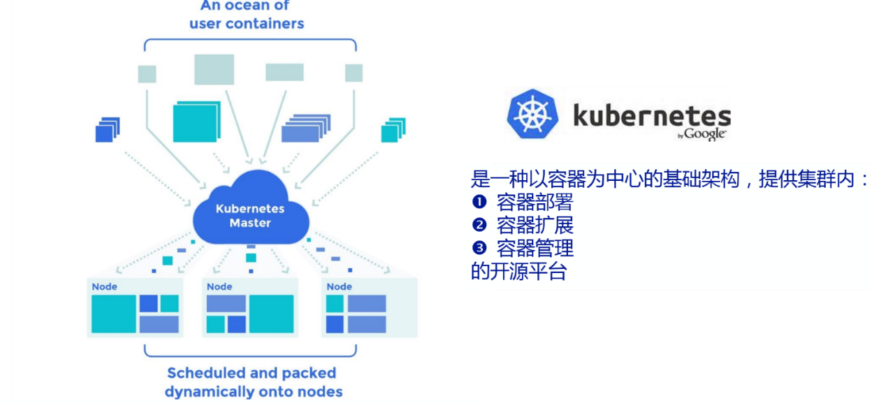
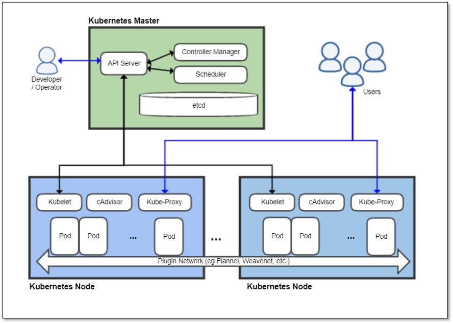
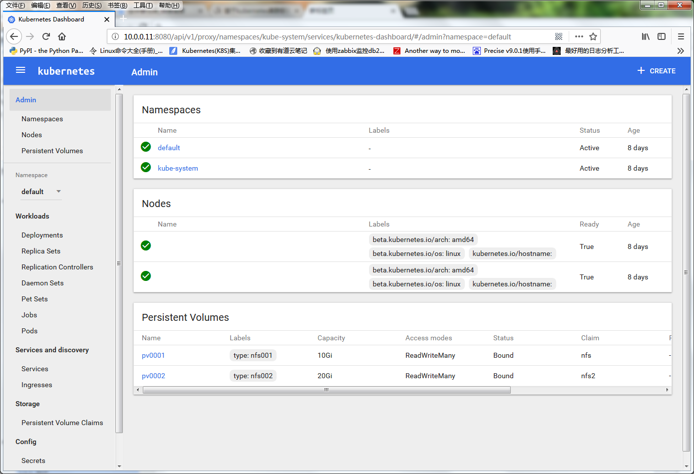
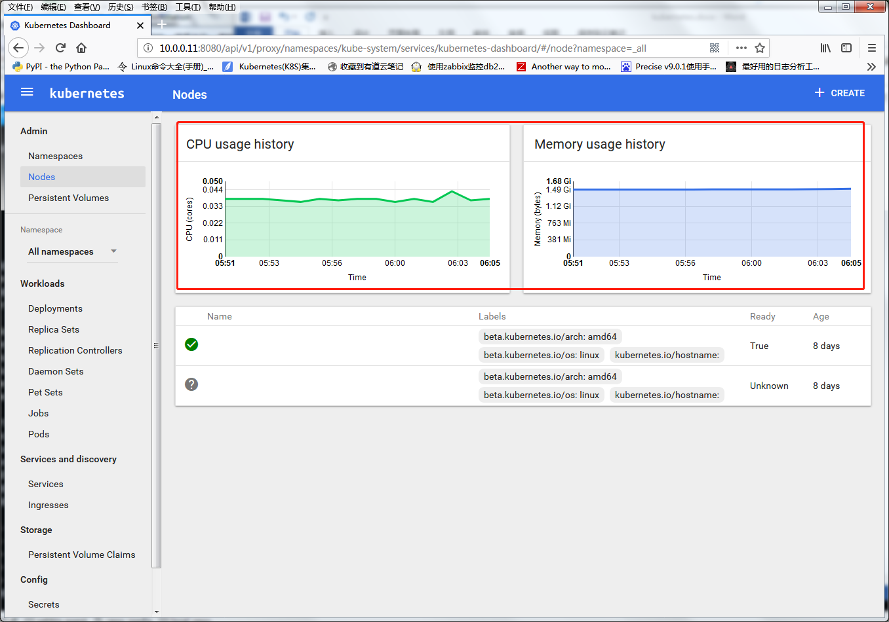

# day100 kubernetesv1

#### 1.1 Kubernetes简介


##### 1.1.1 什么是Kubernetes
Kubernetes (通常称为K8s，K8s是将8个字母“ubernete”替换为“8”的缩写) 是一个以容器为中心的基础架构，可以实现在物理集群或虚拟机集群上调度和运行容器，提供容器自动部署、扩展和管理的开源平台。满足了应用程序在生产环境中的一些通用需求：应用实例副本、水平自动扩展、命名与发现、负载均衡、滚动升级、资源监控等。

##### 1.1.2 Kubernetes发展史
Kubernetes (希腊语"舵手" 或 "飞行员") 由Joe Beda，Brendan Burns和Craig McLuckie创立，并由其他谷歌工程师，包括Brian Grant和Tim Hockin进行加盟创作，并由谷歌在2014年首次对外宣布 。它的开发和设计都深受谷歌的Borg系统的影响，它的许多顶级贡献者之前也是Borg系统的开发者。在谷歌内部，Kubernetes的原始代号曾经是Seven，即星际迷航中友好的Borg(博格人)角色。Kubernetes标识中舵轮有七个轮辐就是对该项目代号的致意。

Kubernetes v1.0于2015年7月21日发布。随着v1.0版本发布，谷歌与Linux 基金会合作组建了Cloud Native Computing Foundation (CNCF)并把Kubernetes作为种子技术来提供。

Rancher Labs在其Rancher容器管理平台中包含了Kubernetes的发布版。Kubernetes也在很多其他公司的产品中被使用，比如Red Hat在OpenShift产品中，CoreOS的Tectonic产品中， 以及IBM的IBM云私有产品中。

##### 1.1.3 Kubernetes 特点
1、可移植: 支持公有云，私有云，混合云，多重云（multi-cloud）

2、可扩展: 模块化, 插件化, 可挂载, 可组合

3、自动化: 自动部署，自动重启，自动复制，自动伸缩/扩展

4、快速部署应用，快速扩展应用

5、无缝对接新的应用功能

6、节省资源，优化硬件资源的使用

##### 1.1.4 Kubernetes核心组件
Kubernetes遵循_master-slave architecture_。Kubernetes的组件可以分为管理单个的 node 组件和控制平面的一部分的组件。

Kubernetes Master是集群的主要控制单元，用于管理其工作负载并指导整个系统的通信。Kubernetes控制平面由各自的进程组成，每个组件都可以在单个主节点上运行，也可以在支持_high-availability clusters(高可用集群) _的多个主节点上运行。

Kubernetes主要由以下几个核心组件组成：

| **<font style="color:white;">组件名称</font>** | **<font style="color:white;">说明</font>** |
| --- | --- |
| **<font style="color:black;">etcd</font>** | <font style="color:black;">保存了整个集群的状态；</font> |
| **apiserver** | 提供了资源操作的唯一入口，并提供认证、授权、访问控制、API注册和发现等机制； |
| **<font style="color:black;">controller manager</font>** | <font style="color:black;">负责维护集群的状态，比如故障检测、自动扩展、滚动更新等；</font> |
| **scheduler** | 负责资源的调度，按照预定的调度策略将Pod调度到相应的机器上； |
| **<font style="color:black;">kubelet</font>** | <font style="color:black;">负责维护容器的生命周期，同时也负责</font><font style="color:black;">Volume</font><font style="color:black;">（</font><font style="color:black;">CVI</font><font style="color:black;">）和网络（</font><font style="color:black;">CNI</font><font style="color:black;">）的管理；</font> |
| **Container runtime** | 负责镜像管理以及Pod和容器的真正运行（CRI）； |
| **<font style="color:black;">kube-proxy</font>** | <font style="color:black;">负责为</font><font style="color:black;">Service</font><font style="color:black;">提供</font><font style="color:black;">cluster</font><font style="color:black;">内部的服务发现和负载均衡；</font> |


<font style="color:white;">核心组件结构图</font>



除了核心组件，还有一些推荐的Add-ons：

| **<font style="color:white;">组件名称</font>** | **<font style="color:white;">说明</font>** |
| --- | --- |
| **<font style="color:black;">kube-dns</font>** | <font style="color:black;">负责为整个集群提供</font><font style="color:black;">DNS</font><font style="color:black;">服务</font> |
| **Ingress Controller** | 为服务提供外网入口 |
| **<font style="color:black;">Heapster</font>** | <font style="color:black;">提供资源监控</font> |
| **Dashboard** | 提供GUI |
| **<font style="color:black;">Federation</font>** | <font style="color:black;">提供跨可用区的集群</font> |
| **Fluentd-elasticsearch** | 提供集群日志采集、存储与查询 |


#### <font style="color:white;"></font>部署Kubernetes集群
```yaml
1.2.1 主机环境说明
# 系统版本说明
[root@k8s-master ~]# cat /etc/redhat-release
CentOS Linux release 7.2.1511 (Core)
[root@k8s-master ~]# uname -r
3.10.0-327.el7.x86_64
[root@k8s-master ~]# getenforce
Disabled
[root@k8s-master ~]# systemctl status  firewalld.service  # 关闭防火墙


主机IP规划
主机名   IP    功能
k8s-master     10.0.0.11/172.16.1.11    Master
k8s-node-1     10.0.0.12/172.16.1.12    node1
k8s-node-2     10.0.0.13/172.16.1.13    node2

# 设置hosts解析 所有节点操作
[root@k8s-master ~]# cat /etc/hosts
127.0.0.1   localhost localhost.localdomain localhost4 localhost4.localdomain4
::1         localhost localhost.localdomain localhost6 localhost6.localdomain6
10.0.0.11   k8s-master
10.0.0.12   k8s-node-1
10.0.0.13   k8s-node-2

# sed -i '2a10.0.0.6  k8s-master\n10.0.0.7  k8s-node1\n10.0.0.8  k8s-node2' /etc/hosts

1.2.2 安装软件包
# 在三个节点上分别操作
yum install etcd docker kubernetes flannel  -y  #master
yum install docker kubernetes flannel  -y       #node
yum install docker kubernetes flannel  -y

安装的软件版本说明
[root@k8s-master ~]# rpm -qa  etcd docker kubernetes flannel
flannel-0.7.1-2.el7.x86_64
docker-1.12.6-71.git3e8e77d.el7.centos.1.x86_64
kubernetes-1.5.2-0.7.git269f928.el7.x86_64
etcd-3.2.11-1.el7.x86_64

1.2.3 修改配置etcd
# yum安装的etcd默认配置文件在/etc/etcd/etcd.conf。
#最终配置文件
[root@k8s-master ~]# grep -Ev '^$|#' /etc/etcd/etcd.conf
ETCD_DATA_DIR="/var/lib/etcd/default.etcd"
ETCD_LISTEN_CLIENT_URLS="http://0.0.0.0:2379"
ETCD_NAME="default"
ETCD_ADVERTISE_CLIENT_URLS="http://10.0.0.11:2379"
# 启动etcd
systemctl enable etcd
systemctl start etcd

# 测试etcd
etcdctl set testdir/testkey0 0
etcdctl get testdir/testkey0 0
[root@k8s-master ~]# etcdctl -C http://10.0.0.11:2379 cluster-health
member 8e9e05c52164694d is healthy: got healthy result from http://10.0.0.11:2379
cluster is healthy

1.2.4 配置并启动kubernetes
# /etc/kubernetes/apiserver配置文件内容
[root@k8s-master ~]#  grep -Ev '^$|#'  /etc/kubernetes/apiserver
KUBE_API_ADDRESS="--insecure-bind-address=0.0.0.0"
KUBE_API_PORT="--port=8080"
KUBE_ETCD_SERVERS="--etcd-servers=http://10.0.0.11:2379"
KUBE_SERVICE_ADDRESSES="--service-cluster-ip-range=10.254.0.0/16"
KUBE_ADMISSION_CONTROL="--admission-control=NamespaceLifecycle,NamespaceExists,LimitRanger,SecurityContextDeny,ResourceQuota"
KUBE_API_ARGS=""

# /etc/kubernetes/config配置文件
[root@k8s-master ~]#  grep -Ev '^$|#' /etc/kubernetes/config
KUBE_LOGTOSTDERR="--logtostderr=true"
KUBE_LOG_LEVEL="--v=0"
KUBE_ALLOW_PRIV="--allow-privileged=false"
KUBE_MASTER="--master=http://10.0.0.11:8080"

# 启动服务
systemctl enable kube-apiserver.service
systemctl start kube-apiserver.service
systemctl enable kube-controller-manager.service
systemctl start kube-controller-manager.service
systemctl enable kube-scheduler.service
systemctl start kube-scheduler.service

1.2.5 部署配置node
# /etc/kubernetes/config配置文件
[root@k8s-node-1 ~]# grep -Ev '^$|#'  /etc/kubernetes/config
KUBE_LOGTOSTDERR="--logtostderr=true"
KUBE_LOG_LEVEL="--v=0"
KUBE_ALLOW_PRIV="--allow-privileged=false"
KUBE_MASTER="--master=http://10.0.0.11:8080"
[root@k8s-node-1 ~]# grep -Ev '^$|#'  /etc/kubernetes/kubelet
KUBELET_ADDRESS="--address=0.0.0.0"
KUBELET_HOSTNAME="--hostname-override=10.0.0.12"
KUBELET_API_SERVER="--api-servers=http://10.0.0.11:8080"
KUBELET_POD_INFRA_CONTAINER="--pod-infra-container-image=registry.access.redhat.com/rhel7/pod-infrastructure:latest"
KUBELET_ARGS=""

# /etc/kubernetes/config配置文件
[root@k8s-node-2 ~]# grep -Ev '^$|#'  /etc/kubernetes/config
KUBE_LOGTOSTDERR="--logtostderr=true"
KUBE_LOG_LEVEL="--v=0"
KUBE_ALLOW_PRIV="--allow-privileged=false"
KUBE_MASTER="--master=http://10.0.0.11:8080"
[root@k8s-node-2 ~]# grep -Ev '^$|#'  /etc/kubernetes/kubelet
KUBELET_ADDRESS="--address=0.0.0.0"
KUBELET_HOSTNAME="--hostname-override=10.0.0.13"
KUBELET_API_SERVER="--api-servers=http://10.0.0.11:8080"
KUBELET_POD_INFRA_CONTAINER="--pod-infra-container-image=registry.access.redhat.com/rhel7/pod-infrastructure:latest"
KUBELET_ARGS=""

# 启动
systemctl enable kubelet.service
systemctl start kubelet.service
systemctl enable kube-proxy.service
systemctl start kube-proxy.service

# 在master上查看集群中节点及节点状态
# kubectl -s http://10.0.0.11:8080 get node
[root@k8s-master ~]# kubectl -s http://10.0.0.11:8080 get node
NAME        STATUS    AGE
10.0.0.12   Ready     49s
10.0.0.13   Ready     56s
[root@k8s-master ~]# kubectl get nodes
NAME        STATUS    AGE
10.0.0.12   Ready     1m
10.0.0.13   Ready     1m

# 至此Kubernetes基础部署完成
```

##### 1.2.6 Kubernetes其他安装方法介绍和总结
**二进制安装：**

可以安装最新版的1.9,二进制安装需要手动创建配置文件和systemd启动文件，优势是有助于理解系统各组件的交互原理和熟悉组件启动参数，有助于快速排查解决实际问题

**kubuadm：**

kubeadm是Kubernetes官方推出的快速部署Kubernetes集群工具，其思路是将Kubernetes相关服务容器化(Kubernetes静态Pod)以简化部署。

**minikube：**

minikube 由 CoreOS 提供在单机上构件 kubernetes 集群。minikube命令可以运行在windows/linux/macos等平台，使用minikube搭建本地集群是非常方便的，同时minikube提供了完整的kubernetes集群的功能。对于初识者minikube是一种很好的安装方式，而且上手也非常快。但问题在于minikube安装的时候需要连接互联网，而且网络需要足够好

**编译安装：**

kubernetes是使用golang开发的，编译安装需要go环境，编译时间特别长，不建议

**ansible部署：**

由于k8s部署二进制安装步骤较多，于是有网友将其写成ansible剧本简化部署 [https://github.com/gjmzj/kubeasz](https://github.com/gjmzj/kubeasz)


#### 1.3 创建覆盖网络--Flannel
```yaml
1.3.1 配置Flannel（所有节点操作）
# 安装软件包
yum install flannel
# 修改配置文件
[root@k8s-master ~]# grep "^[a-Z]" /etc/sysconfig/flanneld
FLANNEL_ETCD_ENDPOINTS="http://10.0.0.11:2379"
FLANNEL_ETCD_PREFIX="/atomic.io/network"

1.3.2 配置etcd中关于flannel的key
#Flannel使用Etcd进行配置，来保证多个Flannel实例之间的配置一致性，所以需要在etcd上进行如下配置：
#（‘/atomic.io/network/config’这个key与上文/etc/sysconfig/flannel中的配置项FLANNEL_ETCD_PREFIX是相对应的，错误的话启动就会出错）
# 配置网络范围
etcdctl mk /atomic.io/network/config '{ "Network": "172.16.0.0/16" }'
# 操作创建网络
[root@k8s-master ~]# etcdctl mk /atomic.io/network/config '{ "Network": "172.16.0.0/16" }'
{ "Network": "172.16.0.0/16" }

# master节点操作
systemctl enable flanneld.service
systemctl start flanneld.service
service docker restart
systemctl restart kube-apiserver.service
systemctl restart kube-controller-manager.service
systemctl restart kube-scheduler.service

# node节点操作
systemctl enable flanneld.service
systemctl start flanneld.service
service docker restart
systemctl restart kubelet.service
systemctl restart kube-proxy.service
```

 

#### 1.4  k8s核心概念
##### 1.4.1、Pod
　　Pod 是Kubernetes的基本操作单元，也是应用运行的载体。整个Kubernetes系统都是围绕着Pod展开的，比如如何部署运行Pod、如何保证Pod的数量、如何访问Pod等。另外，Pod是一个或多个机关容器的集合，这可以说是一大创新点，提供了一种容器的组合的模型。

###### 1.4.1.1 基本操作
| 创建 | <font style="color:black;">kubectl create -f xxx.yaml</font> |
| --- | --- |
| <font style="color:black;">查询</font> | <font style="color:black;">kubectl get pod yourPodName</font><br/><font style="color:black;">kubectl describe pod yourPodName</font> |
| <font style="color:black;">删除</font> | <font style="color:black;">kubectl delete pod yourPodName</font> |
| <font style="color:black;">更新</font><font style="color:black;"> </font><font style="color:black;">（忽略</font><font style="color:black;"> </font><font style="color:black;">先删除再创建）</font> | <font style="color:black;">kubectl replace /path/to/yourNewYaml.yaml</font> |


###### <font style="color:white;"></font>Pod与容器
　　在Docker中，容器是最小的处理单元，增删改查的对象是容器，容器是一种虚拟化技术，容器之间是隔离的，隔离是基于Linux Namespace实现的。而在Kubernetes中，Pod包含一个或者多个相关的容器，Pod可以认为是容器的一种延伸扩展，一个Pod也是一个隔离体，而Pod内部包含的一组容器又是共享的（包括PID、Network、IPC、UTS）。除此之外，Pod中的容器可以访问共同的数据卷来实现文件系统的共享。

###### 1.4.1.3 镜像
　在kubernetes中，镜像的下载策略为：

　　　　**Always**：每次都下载最新的镜像

　　　　**Never**：只使用本地镜像，从不下载

　　　　**IfNotPresent**：只有当本地没有的时候才下载镜像

　　Pod被分配到Node之后会根据镜像下载策略进行镜像下载，可以根据自身集群的特点来决定采用何种下载策略。无论何种策略，都要确保Node上有正确的镜像可用。

###### 1.4.1.4 其他设置
　通过yaml文件，可以在Pod中设置：

　　　**启动命令**，如：spec-->containers-->command；

　　　**环境变量**，如：spec-->containers-->env-->name/value；

　　 **端口桥接**，如：spec-->containers-->ports-->containerPort/protocol/hostIP/hostPort

（使用hostPort时需要注意端口冲突的问题，不过Kubernetes在调度Pod的时候会检查宿主机端口是否冲突，比如当两个Pod均要求绑定宿主机的80端口，Kubernetes将会将这两个Pod分别调度到不同的机器上）;

　　**Host网络**，一些特殊场景下，容器必须要以host方式进行网络设置（如接收物理机网络才能够接收到的组播流），在Pod中也支持host网络的设置，如：spec-->hostNetwork=true；

　　**数据持久化**，如：spec-->containers-->volumeMounts-->mountPath;

　　**重启策略**，当Pod中的容器终止退出后，重启容器的策略。这里的所谓Pod的重启，实际上的做法是容器的重建，之前容器中的数据将会丢失，如果需要持久化数据，那么需要使用数据卷进行持久化设置。Pod支持三种重启策略：Always（默认策略，当容器终止退出后，总是重启容器）、OnFailure（当容器终止且异常退出时，重启）、Never（从不重启）；

** **

##### 1.4.2、Replication Controller
　　Replication Controller（RC）是Kubernetes中的另一个核心概念，应用托管在Kubernetes之后，Kubernetes需要保证应用能够持续运行，这是RC的工作内容，它会确保任何时间Kubernetes中都有指定数量的Pod在运行。在此基础上，RC还提供了一些更高级的特性，比如滚动升级、升级回滚等。

###### 1.4.2.1 RC与Pod的关联——Label
　　RC与Pod的关联是通过Label来实现的。Label机制是Kubernetes中的一个重要设计，通过Label进行对象的弱关联，可以灵活地进行分类和选择。对于Pod，需要设置其自身的Label来进行标识，Label是一系列的Key/value对，在Pod-->metadata-->labeks中进行设置。

　　Label的定义是任一的，但是Label必须具有可标识性，比如设置Pod的应用名称和版本号等。另外Lable是不具有唯一性的，为了更准确的标识一个Pod，应该为Pod设置多个维度的label。如下：

```yaml
"release" : "stable", "release" : "canary"
"environment" : "dev", "environment" : "qa", "environment" : "production"
"tier" : "frontend", "tier" : "backend", "tier" : "cache"
"partition" : "customerA", "partition" : "customerB"
"track" : "daily", "track" : "weekly"
```

　　举例，当你在RC的yaml文件中定义了该RC的selector中的label为app:my-web，那么这个RC就会去关注Pod-->metadata-->labeks中label为app:my-web的Pod。修改了对应Pod的Label，就会使Pod脱离RC的控制。同样，在RC运行正常的时候，若试图继续创建同样Label的Pod，是创建不出来的。因为RC认为副本数已经正常了，再多起的话会被RC删掉的。

###### 1.4.2.2 弹性伸缩
　　弹性伸缩是指适应负载变化，以弹性可伸缩的方式提供资源。反映到Kubernetes中，指的是可根据负载的高低动态调整Pod的副本数量。调整Pod的副本数是通过修改RC中Pod的副本是来实现的，示例命令如下：

```yaml
　　扩容Pod的副本数目到10
$ kubectl scale relicationcontroller yourRcName --replicas=10
　　缩容Pod的副本数目到1
$ kubectl scale relicationcontroller yourRcName --replicas=1
 
```

###### 1.4.2.3 滚动升级
　　滚动升级是一种平滑过渡的升级方式，通过逐步替换的策略，保证整体系统的稳定，在初始升级的时候就可以及时发现、调整问题，以保证问题影响度不会扩大。Kubernetes中滚动升级的命令如下：

```yaml
$ kubectl rolling-update my-rcName-v1 -f my-rcName-v2-rc.yaml --update-period=10s
```

　　升级开始后，首先依据提供的定义文件创建V2版本的RC，然后每隔10s（--update-period=10s）逐步的增加V2版本的Pod副本数，逐步减少V1版本Pod的副本数。升级完成之后，删除V1版本的RC，保留V2版本的RC，及实现滚动升级。

　　升级过程中，发生了错误中途退出时，可以选择继续升级。Kubernetes能够智能的判断升级中断之前的状态，然后紧接着继续执行升级。当然，也可以进行回退，命令如下：

```yaml
$ kubectl rolling-update my-rcName-v1 -f my-rcName-v2-rc.yaml --update-period=10s --rollback
```

回退的方式实际就是升级的逆操作，逐步增加V1.0版本Pod的副本数，逐步减少V2版本Pod的副本数。

###### 1.4.2.4 新一代副本控制器replica set
　　这里所说的replica set，可以被认为 是“升级版”的Replication Controller。也就是说。replica set也是用于保证与label selector匹配的pod数量维持在期望状态。区别在于，replica set引入了对基于子集的selector查询条件，而Replication Controller仅支持基于值相等的selecto条件查询。这是目前从用户角度肴，两者唯一的显著差异。 社区引入这一API的初衷是用于取代vl中的Replication Controller，也就是说．当v1版本被废弃时，Replication Controller就完成了它的历史使命，而由replica set来接管其工作。虽然replica set可以被单独使用，但是目前它多被Deployment用于进行pod的创建、更新与删除。Deployment在滚动更新等方面提供了很多非常有用的功能，关于Deployment 的更多信息，读者们可以在后续小节中获得。** **

##### 1.4.3、Service
　　为了适应快速的业务需求，微服务架构已经逐渐成为主流，微服务架构的应用需要有非常好的服务编排支持。Kubernetes中的核心要素Service便提供了一套简化的服务代理和发现机制，天然适应微服务架构。

###### 1.4.3.1 原理
　　在Kubernetes中，在受到RC调控的时候，Pod副本是变化的，对于的虚拟IP也是变化的，比如发生迁移或者伸缩的时候。这对于Pod的访问者来说是不可接受的。Kubernetes中的Service是一种抽象概念，它定义了一个Pod逻辑集合以及访问它们的策略，Service同Pod的关联同样是居于Label来完成的。Service的目标是提供一种桥梁， 它会为访问者提供一个固定访问地址，用于在访问时重定向到相应的后端，这使得非 Kubernetes原生应用程序，在无须为Kubemces编写特定代码的前提下，轻松访问后端。

　　Service同RC一样，都是通过Label来关联Pod的。当你在Service的yaml文件中定义了该Service的selector中的label为app:my-web，那么这个Service会将Pod-->metadata-->labeks中label为app:my-web的Pod作为分发请求的后端。当Pod发生变化时（增加、减少、重建等），Service会及时更新。这样一来，Service就可以作为Pod的访问入口，起到代理服务器的作用，而对于访问者来说，通过Service进行访问，无需直接感知Pod。

　　需要注意的是，Kubernetes分配给Service的固定IP是一个虚拟IP，并不是一个真实的IP，在外部是无法寻址的。真实的系统实现上，Kubernetes是通过Kube-proxy组件来实现的虚拟IP路由及转发。所以在之前集群部署的环节上，我们在每个Node上均部署了Proxy这个组件，从而实现了Kubernetes层级的虚拟转发网络。

 

###### 1.4.3.2 Service内部负载均衡
　　当Service的Endpoints包含多个IP的时候，及服务代理存在多个后端，将进行请求的负载均衡。默认的负载均衡策略是轮训或者随机（有kube-proxy的模式决定）。同时，Service上通过设置Service-->spec-->sessionAffinity=ClientIP，来实现基于源IP地址的会话保持。

**1.4.3.3 ****发布****Service**

　　Service的虚拟IP是由Kubernetes虚拟出来的内部网络，外部是无法寻址到的。但是有些服务又需要被外部访问到，例如web前段。这时候就需要加一层网络转发，即外网到内网的转发。Kubernetes提供了NodePort、LoadBalancer、Ingress三种方式。

　　**NodePort**，在之前的Guestbook示例中，已经延时了NodePort的用法。NodePort的原理是，Kubernetes会在每一个Node上暴露出一个端口：nodePort，外部网络可以通过（任一Node）[NodeIP]:[NodePort]访问到后端的Service。

　　**LoadBalancer**，在NodePort基础上，Kubernetes可以请求底层云平台创建一个负载均衡器，将每个Node作为后端，进行服务分发。该模式需要底层云平台（例如GCE）支持。

　　**Ingress**，是一种HTTP方式的路由转发机制，由Ingress Controller和HTTP代理服务器组合而成。Ingress Controller实时监控Kubernetes API，实时更新HTTP代理服务器的转发规则。HTTP代理服务器有GCE Load-Balancer、HaProxy、Nginx等开源方案。

###### 1.4.3.3 servicede 自发性机制
　　Kubernetes中有一个很重要的服务自发现特性。一旦一个service被创建，该service的service IP和service port等信息都可以被注入到pod中供它们使用。Kubernetes主要支持两种service发现 机制：环境变量和DNS。

**环境变量方式**

　　Kubernetes创建Pod时会自动添加所有可用的service环境变量到该Pod中，如有需要．这些环境变量就被注入Pod内的容器里。需要注意的是，环境变量的注入只发送在Pod创建时，且不会被自动更新。这个特点暗含了service和访问该service的Pod的创建时间的先后顺序，即任何想要访问service的pod都需要在service已经存在后创建，否则与service相关的环境变量就无法注入该Pod的容器中，这样先创建的容器就无法发现后创建的service。

**DNS****方式**

　　Kubernetes集群现在支持增加一个可选的组件——DNS服务器。这个DNS服务器使用Kubernetes的watchAPI，不间断的监测新的service的创建并为每个service新建一个DNS记录。如果DNS在整个集群范围内都可用，那么所有的Pod都能够自动解析service的域名。Kube-DNS搭建及更详细的介绍请见：[基于Kubernetes集群部署skyDNS服务](http://www.cnblogs.com/zhenyuyaodidiao/p/6500992.html)

###### 1.4.3.4 多个service如何避免地址和端口冲突
　　此处设计思想是，Kubernetes通过为每个service分配一个唯一的ClusterIP，所以当使用ClusterIP：port的组合访问一个service的时候，不管port是什么，这个组合是一定不会发生重复的。另一方面，kube-proxy为每个service真正打开的是一个绝对不会重复的随机端口，用户在service描述文件中指定的访问端口会被映射到这个随机端口上。这就是为什么用户可以在创建service时随意指定访问端口。

** **

##### 1.4.4、Deployment
　　Kubernetes提供了一种更加简单的更新RC和Pod的机制，叫做Deployment。通过在Deployment中描述你所期望的集群状态，Deployment Controller会将现在的集群状态在一个可控的速度下逐步更新成你所期望的集群状态。Deployment主要职责同样是为了保证pod的数量和健康，90%的功能与Replication Controller完全一样，可以看做新一代的Replication Controller。但是，它又具备了Replication Controller之外的新特性：

　　　　**Replication Controller****全部功能**：Deployment继承了上面描述的Replication Controller全部功能。

　　　　**事件和状态查看**：可以查看Deployment的升级详细进度和状态。

　　　　**回滚**：当升级pod镜像或者相关参数的时候发现问题，可以使用回滚操作回滚到上一个稳定的版本或者指定的版本。

　　　　**版本记录**: 每一次对Deployment的操作，都能保存下来，给予后续可能的回滚使用。

　　　　**暂停和启动**：对于每一次升级，都能够随时暂停和启动。

　　　　**多种升级方案**：Recreate----删除所有已存在的pod,重新创建新的; RollingUpdate----滚动升级，逐步替换的策略，同时滚动升级时，支持更多的附加参数，例如设置最大不可用pod数量，最小升级间隔时间等等。

###### 1.4.4.1 滚动升级
　　相比于RC，Deployment直接使用kubectl edit deployment/deploymentName 或者kubectl set方法就可以直接升级（原理是Pod的template发生变化，例如更新label、更新镜像版本等操作会触发Deployment的滚动升级）。操作示例——首先 我们同样定义一个nginx-deploy-v1.yaml的文件，副本数量为2：

```yaml
tee nginx-deploy-v1.yaml<<-'EOF'
apiVersion: extensions/v1beta1
kind: Deployment
metadata:
  name: nginx-deployment
spec:
  replicas: 3
  template:
    metadata:
      labels:
        app: nginx
    spec:
      containers:
      - name: nginx
        image: nginx:1.7.9
        ports:
        - containerPort: 80
EOF

# 创建deployment：
$ kubectl create -f nginx-deploy-v1.yaml --record
deployment "nginx-deployment" created

$ kubectl get deployments
NAME       DESIRED   CURRENT   UP-TO-DATE   AVAILABLE   AGE
nginx-deployment   3         0         0            0           1s

$ kubectl get deployments
NAME       DESIRED   CURRENT   UP-TO-DATE   AVAILABLE   AGE
nginx-deployment   3         3         3            3           18s
 
#正常之后，将nginx的版本进行升级，从1.7升级到1.9。第一种方法，直接set镜像：
$ kubectl set image deployment/nginx-deployment nginx=nginx:1.9
deployment "nginx-deployment" image updated

#第二种方法，直接edit：
$ kubectl edit deployment/nginx-deployment
deployment "nginx-deployment2" edited

#  查看Deployment的变更信息（以下信息得以保存，是创建时候加的“--record”这个选项起的作用）：
$ kubectl rollout history deployment/nginx-deployment
deployments "nginx-deployment":
REVISION    CHANGE-CAUSE
1           kubectl create -f docs/user-guide/nginx-deployment.yaml --record
2           kubectl set image deployment/nginx-deployment nginx=nginx:1.9.1
3           kubectl set image deployment/nginx-deployment nginx=nginx:1.91
 
$ kubectl rollout history deployment/nginx-deployment --revision=2
deployments "nginx-deployment" revision 2
  Labels:       app=nginx
  pod-template-hash=1159050644
  Annotations:  kubernetes.io/change-cause=kubectl set image deployment/nginx-deployment nginx=nginx:1.9.1
  Containers:
   nginx:
    Image:      nginx:1.9.1
    Port:       80/TCP
     QoS Tier:
        cpu:      BestEffort
        memory:   BestEffort
    Environment Variables:      <none>
  No volumes.
 
# 最后介绍下Deployment的一些基础命令。
$ kubectl describe deployments  		#查询详细信息，获取升级进度
$ kubectl rollout pause deployment/nginx-deployment2  	#暂停升级
$ kubectl rollout resume deployment/nginx-deployment2   #继续升级
$ kubectl rollout undo deployment/nginx-deployment2     #升级回滚
$ kubectl scale deployment nginx-deployment --replicas 10  #弹性伸缩Pod数量


```

　　关于多重升级，举例，当你创建了一个nginx1.7的Deployment，要求副本数量为5之后，Deployment Controller会逐步的将5个1.7的Pod启动起来；当启动到3个的时候，你又发出更新Deployment中Nginx到1.9的命令；这时Deployment Controller会立即将已启动的3个1.7Pod杀掉，然后逐步启动1.9的Pod。Deployment Controller不会等到1.7的Pod都启动完成之后，再依次杀掉1.7，启动1.9。

 

##### 1.4.5、Volume
　　在Docker的设计实现中，容器中的数据是临时的，即当容器被销毁时，其中的数据将会丢失。如果需要持久化数据，需要使用Docker数据卷挂载宿主机上的文件或者目录到容器中。在Kubernetes中，当Pod重建的时候，数据是会丢失的，Kubernetes也是通过数据卷挂载来提供Pod数据的持久化的。Kubernetes数据卷是对Docker数据卷的扩展，Kubernetes数据卷是Pod级别的，可以用来实现Pod中容器的文件共享。目前，Kubernetes支持的数据卷类型如下：

　　　　1)        EmptyDir

　　　　2)        HostPath

　　　　3)        GCE Persistent Disk

　　　　4)        AWS Elastic Block Store

　　　　5)        NFS

　　　　6)        iSCSI

　　　　7)        Flocker

　　　　8)        GlusterFS

　　　　9)        RBD

　　　　10)    Git Repo

　　　　11)    Secret

　　　　12)    Persistent Volume Claim

###### 1.4.5.1 Persistent Volume和Persistent Volume Claim
　　理解每个存储系统是一件复杂的事情，特别是对于普通用户来说，有时候并不需要关心各种存储实现，只希望能够安全可靠地存储数据。Kubernetes中提供了Persistent Volume和Persistent Volume Claim机制，这是存储消费模式。Persistent Volume是由系统管理员配置创建的一个数据卷（目前支持HostPath、GCE Persistent Disk、AWS Elastic Block Store、NFS、iSCSI、GlusterFS、RBD），它代表了某一类存储插件实现；而对于普通用户来说，通过Persistent Volume Claim可请求并获得合适的Persistent Volume，而无须感知后端的存储实现。Persistent Volume和Persistent Volume Claim的关系其实类似于Pod和Node，Pod消费Node资源，Persistent Volume Claim则消费Persistent Volume资源。Persistent Volume和Persistent Volume Claim相互关联，有着完整的生命周期管理：

　　　　1) 准备：系统管理员规划或创建一批Persistent Volume；

　　　　2)绑定：用户通过创建Persistent Volume Claim来声明存储请求，Kubernetes发现有存储请求的时候，就去查找符合条件的Persistent Volume（最小满足策略）。找到合适的就绑定上，找不到就一直处于等待状态；

　　　　3)使用：创建Pod的时候使用Persistent Volume Claim；

　　　　4)释放：当用户删除绑定在Persistent Volume上的Persistent Volume Claim时，Persistent Volume进入释放状态，此时Persistent Volume中还残留着上一个Persistent Volume Claim的数据，状态还不可用；

　　　　5)回收：是否的Persistent Volume需要回收才能再次使用。回收策略可以是人工的也可以是Kubernetes自动进行清理（仅支持NFS和HostPath）

##### 1.4.6、Horizontal Pod Autoscaler
　　自动扩展作为一个长久的议题，一直为人们津津乐道。系统能够根据负载的变化对计算资源的分配进行自动的扩增或者收缩，无疑是一个非常吸引人的特征，它能够最大可能地减少费用或者其他代价（如电力损耗）。自动扩展主要分为两种，其一为水平扩展，针对于实例数目的增减；其二为垂直扩展，即单个实例可以使用的资源的增减。Horizontal Pod Autoscaler（HPA）属于前者。

###### 1.4.6.1 Horizontal Pod Autoscaler如何工作
　　Horizontal Pod Autoscaler的操作对象是Replication Controller、ReplicaSet或Deployment对应的Pod，根据观察到的CPU实际使用量与用户的期望值进行比对，做出是否需要增减实例数量的决策。controller目前使用heapSter来检测CPU使用量，检测周期默认是30秒。

###### 1.4.6.2 Horizontal Pod Autoscaler的决策策略
　　在HPA Controller检测到CPU的实际使用量之后，会求出当前的CPU使用率（实际使用量与pod 请求量的比率)。然后，HPA Controller会通过调整副本数量使得CPU使用率尽量向期望值靠近．另外，考虑到自动扩展的决策可能需要一段时间才会生效，甚至在短时间内会引入一些噪声． 例如当pod所需要的CPU负荷过大，从而运行一个新的pod进行分流，在创建的过程中，系统的CPU使用量可能会有一个攀升的过程。所以，在每一次作出决策后的一段时间内，将不再进行扩展决策。对于ScaleUp而言，这个时间段为3分钟，Scaledown为5分钟。再者HPA Controller允许一定范围内的CPU使用量的不稳定，也就是说，只有当aVg（CurrentPodConsumption／Target低于0.9或者高于1.1时才进行实例调整，这也是出于维护系统稳定性的考虑。

 

#### 1.5 基于kubernetes集群部署DashBoard
##### 1.5.1  准备yaml配置文件
```yaml
tee dashboard.yaml <<-'EOF'
apiVersion: extensions/v1beta1
kind: Deployment
metadata:
# Keep the name in sync with image version and
# gce/coreos/kube-manifests/addons/dashboard counterparts
  name: kubernetes-dashboard-latest
  namespace: kube-system
spec:
  replicas: 1
  template:
    metadata:
      labels:
        k8s-app: kubernetes-dashboard
        version: latest
        kubernetes.io/cluster-service: "true"
    spec:
      containers:
      - name: kubernetes-dashboard
        image: index.tenxcloud.com/google_containers/kubernetes-dashboard-amd64:v1.4.1
        resources:
          # keep request = limit to keep this container in guaranteed class
          limits:
            cpu: 100m
            memory: 50Mi
          requests:
            cpu: 100m
            memory: 50Mi
        ports:
        - containerPort: 9090
        args:
         -  --apiserver-host=http://10.0.0.11:8080
        livenessProbe:
          httpGet:
            path: /
            port: 9090
          initialDelaySeconds: 30
          timeoutSeconds: 30
EOF

tee dashboardsvc.yaml <<-'EOF'
apiVersion: v1
kind: Service
metadata:
  name: kubernetes-dashboard
  namespace: kube-system
  labels:
    k8s-app: kubernetes-dashboard
    kubernetes.io/cluster-service: "true"
spec:
  selector:
    k8s-app: kubernetes-dashboard
  ports:
  - port: 80
    targetPort: 9090
EOF
    
1.5.2  启动
# 在master执行如下命令：
kubectl create -f dashboard.yaml
kubectl create -f dashboardsvc.yaml
 
# 1.5.3  验证
[root@k8s-master ~]# kubectl get deployment --all-namespaces
NAMESPACE   NAME DESIRED        				CURRENT   UP-TO-DATE   AVAILABLE   AGE
kube-system kubernetes-dashboard-latest  1  			1         1            1           1h

[root@k8s-master ~]# kubectl get svc  --all-namespaces
NAMESPACE     NAME                   CLUSTER-IP    EXTERNAL-IP   PORT(S)   AGE
default       kubernetes             10.254.0.1      <none>        443/TCP   9d
kube-system   kubernetes-dashboard   10.254.44.119   <none>        80/TCP    1h

[root@k8s-master ~]# kubectl get pod  -o wide  --all-namespaces
NAMESPACE   NAME                                READY     STATUS    RESTARTS     AGE   IP  NODE
kube-system kubernetes-dashboard-latest-3866786896-vsf3h 1/1 Running 0 1h 10.0.82.2 k8s-node-1

```

 

打开浏览器访问：[http://10.0.0.11:8080/ui/](http://10.0.0.11:8080/ui/)



 

#### 1.6  kubernetes集群配置dns
##### 1.6.1 准备 yaml配置文件
```yaml
# cat skydns-rc.yaml 文件
# Copyright 2016 The Kubernetes Authors.
#
# Licensed under the Apache License, Version 2.0 (the "License");
# you may not use this file except in compliance with the License.
# You may obtain a copy of the License at
#
#     http://www.apache.org/licenses/LICENSE-2.0
#
# Unless required by applicable law or agreed to in writing, software
# distributed under the License is distributed on an "AS IS" BASIS,
# WITHOUT WARRANTIES OR CONDITIONS OF ANY KIND, either express or implied.
# See the License for the specific language governing permissions and
# limitations under the License.
 
# TODO - At some point, we need to rename all skydns-*.yaml.* files to kubedns-*.yaml.*
# Should keep target in cluster/addons/dns-horizontal-autoscaler/dns-horizontal-autoscaler.yaml
# in sync with this file.
 
# __MACHINE_GENERATED_WARNING__
 
apiVersion: extensions/v1beta1
kind: Deployment
metadata:
  name: kube-dns
  namespace: kube-system
  labels:
    k8s-app: kube-dns
    kubernetes.io/cluster-service: "true"
spec:
  replicas: 1
  # replicas: not specified here:
  # 1. In order to make Addon Manager do not reconcile this replicas parameter.
  # 2. Default is 1.
  # 3. Will be tuned in real time if DNS horizontal auto-scaling is turned on.
  strategy:
    rollingUpdate:
      maxSurge: 10%
      maxUnavailable: 0
  selector:
    matchLabels:
      k8s-app: kube-dns
  template:
    metadata:
      labels:
        k8s-app: kube-dns
      annotations:
        scheduler.alpha.kubernetes.io/critical-pod: ''
        scheduler.alpha.kubernetes.io/tolerations: '[{"key":"CriticalAddonsOnly", "operator":"Exists"}]'
    spec:
      containers:
      - name: kubedns
        image: myhub.fdccloud.com/library/kubedns-amd64:1.9
        resources:
          # TODO: Set memory limits when we've profiled the container for large
          # clusters, then set request = limit to keep this container in
          # guaranteed class. Currently, this container falls into the
          # "burstable" category so the kubelet doesn't backoff from restarting it.
          limits:
            memory: 170Mi
          requests:
            cpu: 100m
            memory: 70Mi
        livenessProbe:
          httpGet:
            path: /healthz-kubedns
            port: 8080
            scheme: HTTP
          initialDelaySeconds: 60
          timeoutSeconds: 5
          successThreshold: 1
          failureThreshold: 5
        readinessProbe:
          httpGet:
            path: /readiness
            port: 8081
            scheme: HTTP
          # we poll on pod startup for the Kubernetes master service and
          # only setup the /readiness HTTP server once that's available.
          initialDelaySeconds: 3
          timeoutSeconds: 5
        args:
        - --domain=cluster.local.
        - --dns-port=10053
        - --config-map=kube-dns
        - --kube-master-url=http://10.0.0.11:8080
        # This should be set to v=2 only after the new image (cut from 1.5) has
        # been released, otherwise we will flood the logs.
        - --v=0
        #__PILLAR__FEDERATIONS__DOMAIN__MAP__
        env:
        - name: PROMETHEUS_PORT
          value: "10055"
        ports:
        - containerPort: 10053
          name: dns-local
          protocol: UDP
        - containerPort: 10053
          name: dns-tcp-local
          protocol: TCP
        - containerPort: 10055
          name: metrics
          protocol: TCP
      - name: dnsmasq
        image: myhub.fdccloud.com/library/kube-dnsmasq-amd64:1.4
        livenessProbe:
          httpGet:
            path: /healthz-dnsmasq
            port: 8080
            scheme: HTTP
          initialDelaySeconds: 60
          timeoutSeconds: 5
          successThreshold: 1
          failureThreshold: 5
        args:
        - --cache-size=1000
        - --no-resolv
        - --server=127.0.0.1#10053
        #- --log-facility=-
        ports:
        - containerPort: 53
          name: dns
          protocol: UDP
        - containerPort: 53
          name: dns-tcp
          protocol: TCP
        # see: https://github.com/kubernetes/kubernetes/issues/29055 for details
        resources:
          requests:
            cpu: 150m
            memory: 10Mi
      - name: dnsmasq-metrics
        image: myhub.fdccloud.com/library/dnsmasq-metrics-amd64:1.0
        livenessProbe:
          httpGet:
            path: /metrics
            port: 10054
            scheme: HTTP
          initialDelaySeconds: 60
          timeoutSeconds: 5
          successThreshold: 1
          failureThreshold: 5
        args:
        - --v=2
        - --logtostderr
        ports:
        - containerPort: 10054
          name: metrics
          protocol: TCP
        resources:
          requests:
            memory: 10Mi
      - name: healthz
        image: myhub.fdccloud.com/library/exechealthz-amd64:1.2
        resources:
          limits:
            memory: 50Mi
          requests:
            cpu: 10m
            # Note that this container shouldn't really need 50Mi of memory. The
            # limits are set higher than expected pending investigation on #29688.
            # The extra memory was stolen from the kubedns container to keep the
            # net memory requested by the pod constant.
            memory: 50Mi
        args:
        - --cmd=nslookup kubernetes.default.svc.cluster.local 127.0.0.1 >/dev/null
        - --url=/healthz-dnsmasq
        - --cmd=nslookup kubernetes.default.svc.cluster.local 127.0.0.1:10053 >/dev/null
        - --url=/healthz-kubedns
        - --port=8080
        - --quiet
        ports:
        - containerPort: 8080
          protocol: TCP
      dnsPolicy: Default  # Don't use cluster DNS.
      
# vim skydns-svc.yaml 文件
# Copyright 2016 The Kubernetes Authors.
#
# Licensed under the Apache License, Version 2.0 (the "License");
# you may not use this file except in compliance with the License.
# You may obtain a copy of the License at
#
#     http://www.apache.org/licenses/LICENSE-2.0
#
# Unless required by applicable law or agreed to in writing, software
# distributed under the License is distributed on an "AS IS" BASIS,
# WITHOUT WARRANTIES OR CONDITIONS OF ANY KIND, either express or implied.
# See the License for the specific language governing permissions and
# limitations under the License.
 
# TODO - At some point, we need to rename all skydns-*.yaml.* files to kubedns-*.yaml.*
 
# Warning: This is a file generated from the base underscore template file: skydns-svc.yaml.base
 
apiVersion: v1
kind: Service
metadata:
  name: kube-dns
  namespace: kube-system
  labels:
    k8s-app: kube-dns
    kubernetes.io/cluster-service: "true"
    kubernetes.io/name: "KubeDNS"
spec:
  selector:
    k8s-app: kube-dns
  clusterIP: 10.254.0.100
  ports:
  - name: dns
    port: 53
    protocol: UDP
  - name: dns-tcp
    port: 53
    protocol: TCP

# 1.6.2 启动
# 在master执行如下命令：
kubectl create -f  skydns-rc.yaml
kubectl create -f  skydns-svc.yaml

1.6.3修改node节点kubelet配置
# 查询dns服务的clusterip。
# kubectl get svc --namespace=kube-system
[root@k8s-matser ~]# kubectl get svc --namespace=kube-system
NAME                   CLUSTER-IP       EXTERNAL-IP   PORT(S)         AGE
kube-dns               10.254.230.254   <none>        53/UDP,53/TCP   7m
kubernetes-dashboard   10.254.249.6     <none>        80/TCP          4h
 
# 修改各node节点上的/etc/kubernetes/kubelet配置文件，增加如下行：
KUBELET_ARGS="--cluster_dns=10.254.230.254 --cluster_domain=cluster.local"
 
# 重启各node节点kubelet：
systemctl restart kubelet
 
1.6.4验证：
# 添加一个busybox的pod用于测试，busybox.yaml内容如下：
# vim busybox.yaml
apiVersion: v1
kind: Pod
metadata:
  labels:
    name: busybox
    role: master
  name: busybox
spec:
  containers:
  - name: busybox
    image: myhub.fdccloud.com/library/busybox
    command:
    - sleep
    - "3600"
 
# 执行如下操作：
kubectl exec -it busybox sh
nslookup kubernetes
nslookup kubernetes.default.svc.cluster.local

如果能正常解析，则部署OK。
 
 
```

 

#### 1.7  Kubernetes集成heapster
Heapster是kubernetes集群监控工具。在1.2的时候，kubernetes的监控需要在node节点上运行cAdvisor作为agent收集本机和容器的资源数据，包括cpu、内存、网络、文件系统等。在新版的kubernetes中，cAdvisor被集成到kubelet中。通过netstat可以查看到kubelet新开了一个4194的端口，这就是cAdvisor监听的端口，现在我们然后可以通过http://<node-ip>:4194的方式访问到cAdvisor。Heapster就是通过每个node上的kubelet，也就是实际的cAdvisor上收集数据并汇总，保存到后端存储中。

 

Heapster支持多种后端存储，包括influxDB，Elasticsearch，Kafka等，在这篇文档里，我们使用influxDB作为后端存储来展示heapster的相关配置。需要说明的是，heapster依赖kubernetes dns配置。


##### 1.7.1准备yaml配置文件
创建目录heapster-influxdb，在目录中创建以下文件

```yaml
[root@k8s-master heapster-influxdb]# cat influxdb-grafana-controller.yaml
apiVersion: v1
kind: ReplicationController
metadata:
  labels:
    name: influxGrafana
  name: influxdb-grafana
  namespace: kube-system
spec:
  replicas: 1
  selector:
    name: influxGrafana
  template:
    metadata:
      labels:
        name: influxGrafana
    spec:
      containers:
      - name: influxdb
        image: docker.io/kubernetes/heapster_influxdb:v0.5
        volumeMounts:
        - mountPath: /data
          name: influxdb-storage
      - name: grafana
        image: docker.io/kubernetes/heapster_grafana:v2.6.0
        env:
          - name: INFLUXDB_SERVICE_URL
            value: http://monitoring-influxdb:8086
            # The following env variables are required to make Grafana accessible via
            # the kubernetes api-server proxy. On production clusters, we recommend
            # removing these env variables, setup auth for grafana, and expose the grafana
            # service using a LoadBalancer or a public IP.
          - name: GF_AUTH_BASIC_ENABLED
            value: "false"
          - name: GF_AUTH_ANONYMOUS_ENABLED
            value: "true"
          - name: GF_AUTH_ANONYMOUS_ORG_ROLE
            value: Admin
          - name: GF_SERVER_ROOT_URL
            value: /api/v1/proxy/namespaces/kube-system/services/monitoring-grafana/
        volumeMounts:
        - mountPath: /var
          name: grafana-storage
      volumes:
      - name: influxdb-storage
        emptyDir: {}
      - name: grafana-storage
        emptyDir: {}
 
#######
[root@k8s-master heapster-influxdb]# cat grafana-service.yaml
apiVersion: v1
kind: Service
metadata:
  labels:
    kubernetes.io/cluster-service: 'true'
    kubernetes.io/name: monitoring-grafana
  name: monitoring-grafana
  namespace: kube-system
spec:
  # In a production setup, we recommend accessing Grafana through an external Loadbalancer
  # or through a public IP.
  # type: LoadBalancer
  ports:
  - port: 80
    targetPort: 3000
  selector:
    name: influxGrafana
#########
[root@k8s-master heapster-influxdb]# cat influxdb-service.yaml
apiVersion: v1
kind: Service
metadata:
  labels: null
  name: monitoring-influxdb
  namespace: kube-system
spec:
  ports:
  - name: http
    port: 8083
    targetPort: 8083
  - name: api
    port: 8086
    targetPort: 8086
  selector:
    name: influxGrafana
#######
[root@k8s-master heapster-influxdb]# cat heapster-controller.yaml
apiVersion: v1
kind: ReplicationController
metadata:
  labels:
    k8s-app: heapster
    name: heapster
    version: v6
  name: heapster
  namespace: kube-system
spec:
  replicas: 1
  selector:
    k8s-app: heapster
    version: v6
  template:
    metadata:
      labels:
        k8s-app: heapster
        version: v6
    spec:
      containers:
      - name: heapster
        image: docker.io/kubernetes/heapster:canary
        imagePullPolicy: Always
        command:
        - /heapster
        - --source=kubernetes:http://10.0.0.11:8080?inClusterConfig=false
        - --sink=influxdb:http://monitoring-influxdb:8086
########
[root@k8s-master heapster-influxdb]# cat heapster-service.yaml
apiVersion: v1
kind: Service
metadata:
  labels:
    kubernetes.io/cluster-service: 'true'
    kubernetes.io/name: Heapster
  name: heapster
  namespace: kube-system
spec:
  ports:
  - port: 80
    targetPort: 8082
  selector:
    k8s-app: heapster
 
 
1.7.2启动
# 一个个的yaml文件创建太慢，可以直接指定目录来创建
[root@k8s-master ~]# kubectl create -f influxdb/
service "monitoring-grafana" created
replicationcontroller "heapster" created
service "heapster" created
replicationcontroller "influxdb-grafana" created
service "monitoring-influxdb" created
 
# 1.7.3 验证
systemctl restart kube-apiserver.service
```

登录dashboard，出现cpu和内存使用即成功



 

#### 1.8 wordpress持久化实战
##### 1.8.1 准备两个pv和pvc
```bash
# 准备配置文件
[root@k8s-master ~]# cat wordpres_nfs_pv.yaml
apiVersion: v1
kind: PersistentVolume
metadata:
  name: pv0001
  labels:
    type: nfs001
spec:
  capacity:
    storage: 10Gi
  accessModes:
    - ReadWriteMany
  persistentVolumeReclaimPolicy: Recycle
  nfs:
    path: "/data/web"
    server: 10.0.0.11
    readOnly: false
    
#######
[root@k8s-master ~]# cat  wordpress_nfs_pvc.yaml
kind: PersistentVolumeClaim
apiVersion: v1
metadata:
  name: nfs
spec:
  accessModes:
    - ReadWriteMany
  resources:
    requests:
      storage: 1Gi
########
[root@k8s-master ~]# cat mysql_nfs_pv.yaml
apiVersion: v1
kind: PersistentVolume
metadata:
  name: pv0002
  labels:
    type: nfs002
spec:
  capacity:
    storage: 20Gi
  accessModes:
    - ReadWriteMany
  persistentVolumeReclaimPolicy: Recycle
  nfs:
    path: "/data/db"
    server: 10.0.0.11
    readOnly: false
    
############
[root@k8s-master ~]# cat mysql_nfs_pvc.yaml
kind: PersistentVolumeClaim
apiVersion: v1
metadata:
  name: nfs2
spec:
  accessModes:
    - ReadWriteMany
  resources:
    requests:
      storage: 2Gi

# 1.8.2 创建pv和pvc
kubectl create -f  wordpress_nfs_pv.yaml
kubectl create -f  wordpress_nfs_pvc.yaml
kubectl create -f  mysql_nfs_pv.yaml
kubectl create -f  mysql_nfs_pvc.yaml


 
```

 

##### 1.8.3 创建mysql rc和svc
```bash
[root@k8s-master ~]# cat mysql-rc.yaml
apiVersion: v1
kind: ReplicationController
metadata:
  name: mysql
spec:
  replicas: 1
  selector:
    app: mysql
  template:
    metadata:
      labels:
        app: mysql
    spec:
      containers:
      - name: mysql
        image: 10.0.0.11:5000/mysql:5.7
        ports:
        - containerPort: 3306
        volumeMounts:
        - name: nfs-vol2
          mountPath: /var/lib/mysql
        env:
        - name: MYSQL_ROOT_PASSWORD
          value: "somewordpress"
        - name: MYSQL_DATABASE
          value: "wordpress"
        - name: MYSQL_USER
          value: "wordpress"
        - name: MYSQL_PASSWORD
          value: "wordpress"
      volumes:
      - name: nfs-vol2
        persistentVolumeClaim:
          claimName: nfs2
          
#########
[root@k8s-master ~]# cat mysql-svc.yaml
apiVersion: v1
kind: Service
metadata:
  name: mysql
spec:
  clusterIP: 10.254.178.148
  ports:
    - port: 3306
  selector:
    app: mysql
#######

[root@k8s-master ~]# kubectl create -f mysql-rc.yaml
[root@k8s-master ~]# kubectl create -f mysql-svc.yaml

```

##### 1.8.4 创建wordpress rc和svc
```bash
[root@k8s-master ~]# cat myweb-rc-nfs.yaml
apiVersion: v1
kind: ReplicationController
metadata:
  name: myweb
spec:
  replicas: 1
  selector:
    app: myweb
  template:
    metadata:
      labels:
        app: myweb
    spec:
      nodeName: '10.0.0.13'
      containers:
      - name: myweb
        image: 10.0.0.11:5000/wordpress:latest
        ports:
        - containerPort: 80
        volumeMounts:
        - name: nfs-vol
          mountPath: /var/www/html
        env:
        - name: WORDPRESS_DB_HOST
          value: '10.254.178.148'
        - name: WORDPRESS_DB_USER
          value: 'wordpress'
        - name: WORDPRESS_DB_PASSWORD
          value: 'wordpress'
      volumes:
      - name: nfs-vol
        persistentVolumeClaim:
          claimName: nfs
          
#############
[root@k8s-master ~]# cat myweb-svc.yaml
apiVersion: v1
kind: Service
metadata:
  name: myweb
spec:
  type: NodePort
  ports:
    - port: 80
      nodePort: 30001
  selector:
    app: myweb
    
#################
[root@k8s-master ~]# kubectl create -f myweb-rc-nfs.yaml
[root@k8s-master ~]# kubectl create -f myweb-svc.yaml

```

##### 1.8.5  验证
访问[http://10.0.0.12:30001](http://10.0.0.12:30001)安装wordpress，删除mysql或者myweb开头的pod，wordpress依旧能访问，数据不丢，即成功！


> 更新: 2024-09-09 11:38:21  
> 原文: <https://www.yuque.com/chengkanghua/oldboy50/aogtaa>