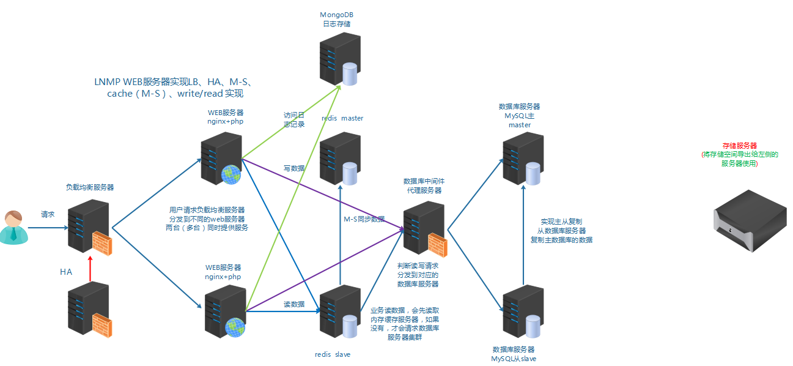
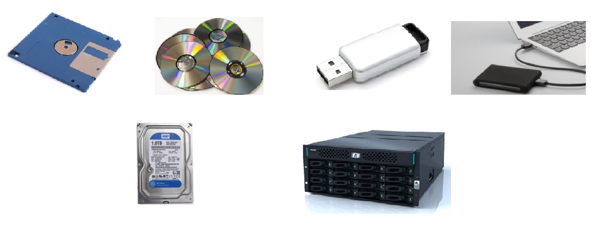
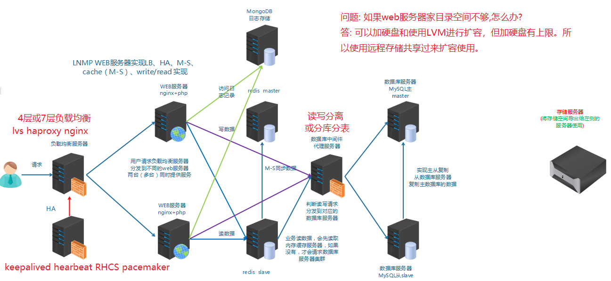
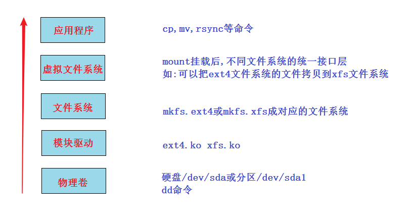
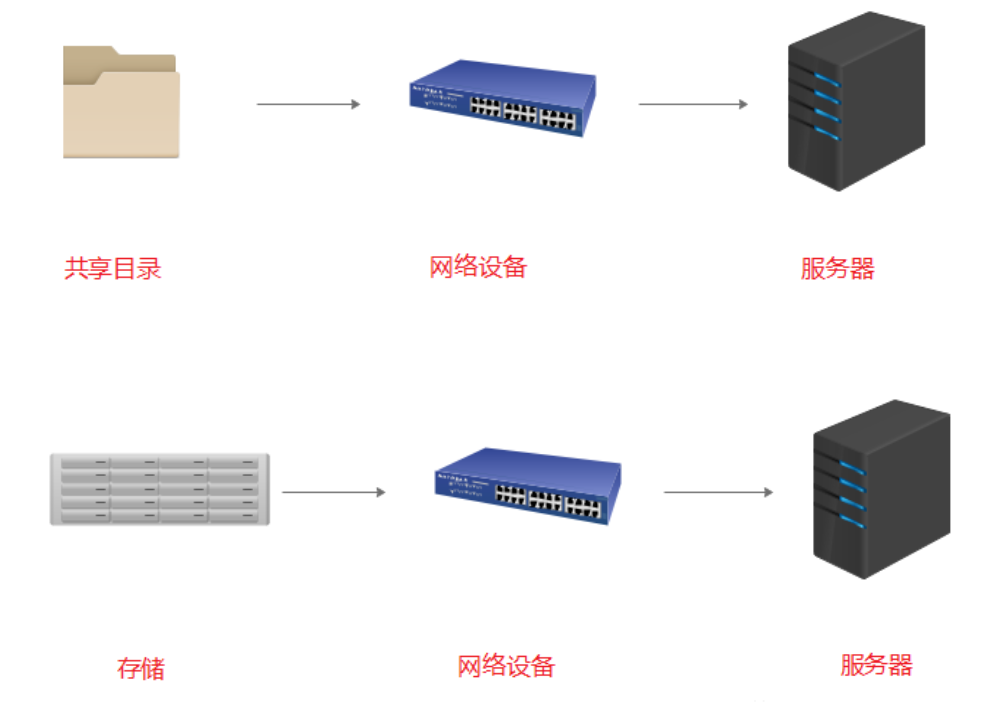
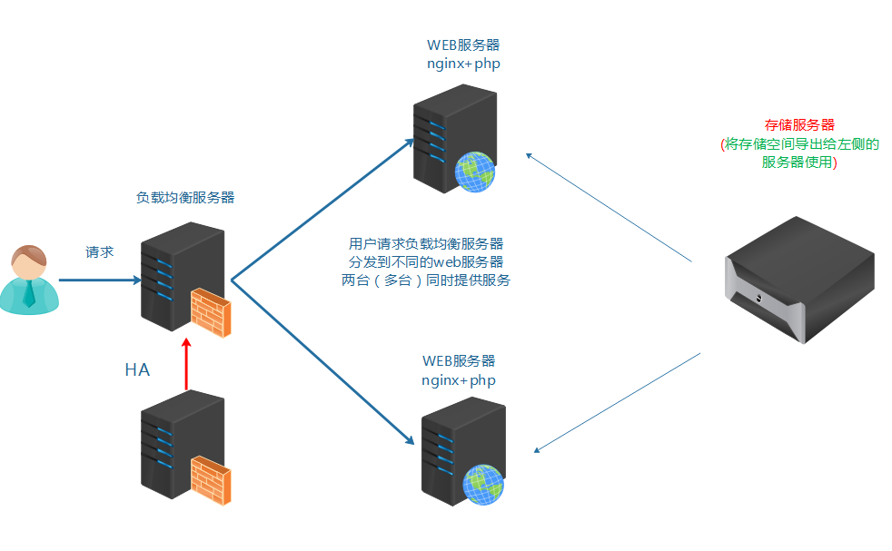

[存储.xmind](https://www.yuque.com/attachments/yuque/0/2024/xmind/194754/1728310905711-482f07f5-b781-4308-819e-4f2bc6e885b0.xmind)

[centos7虚拟机教学环境统一文档.pdf](https://www.yuque.com/attachments/yuque/0/2024/pdf/194754/1728310910173-d9d9fcf6-bfec-4271-8f3d-c9464639ca7d.pdf)

# <font style="color:rgb(51, 51, 51);">任务背景</font>
<font style="color:rgb(51, 51, 51);">随着某些业务数据的增大, 公司服务器硬盘空闲空间越来越小, 服务器上也无法再拓展硬盘, 所以我们考虑使用</font>**<font style="color:rgb(51, 51, 51);">==网络存储方式远程共享存储给服务器使用==</font>**<font style="color:rgb(51, 51, 51);">。</font>



# **<font style="color:rgb(51, 51, 51);">任务要求</font>**
<font style="color:rgb(51, 51, 51);">实现存储通过远程共享给应用服务器使用</font>

# <font style="color:rgb(51, 51, 51);">任务拆解</font>
<font style="color:rgb(51, 51, 51);">1, 需要知道存储有哪些方式可以通过网络共享给服务器使用,如何选择合理的方式</font>

<font style="color:rgb(51, 51, 51);">2, 需要知道存储共享给服务器后是一种什么形式,是一个目录呢, 还是一个块设备</font>

<font style="color:rgb(51, 51, 51);">3, 使用什么样的软件来实现</font>

<font style="color:rgb(51, 51, 51);">4, 配置实现</font>

# **<font style="color:rgb(51, 51, 51);">学习目标</font>**
+ <font style="color:rgb(51, 51, 51);">能够区分DAS,NAS,SAN三种存储分类</font>
+ <font style="color:rgb(51, 51, 51);">能够区分文件存储类型与块存储类型</font>
+ <font style="color:rgb(51, 51, 51);">能够使用iscsi实现IP-SAN</font>

# <font style="color:rgb(51, 51, 51);">知识储备</font>
## <font style="color:rgb(51, 51, 51);">存储介绍</font>
<font style="color:rgb(119, 119, 119);">存储(storage)是什么?</font>



**<font style="color:rgb(51, 51, 51);">简单来说，存储就是==存放数据的介质==。</font>**

<font style="color:rgb(51, 51, 51);">我们在这里不是学习这些硬件知识，而是学习</font>**<font style="color:rgb(51, 51, 51);">Linux平台下的存储技术</font>**<font style="color:rgb(51, 51, 51);">。</font>

<font style="color:rgb(51, 51, 51);">在前面学习的架构基础上再加上</font>**<font style="color:rgb(51, 51, 51);">远程存储</font>**<font style="color:rgb(51, 51, 51);">。</font>




## <font style="color:rgb(51, 51, 51);">Linux存储分层(了解)</font>
<font style="color:rgb(51, 51, 51);">问题: linux上如何挂载ntfs格式的移动硬盘?</font>

<font style="color:rgb(51, 51, 51);">linux内核支持ntfs,但centos7系统并没有加上此功能，解决方法两种:</font>

+ <font style="color:rgb(51, 51, 51);">重新编译内核,在内核加上支持ntfs(此方法不推荐,因为编译内核会造成内核运行不稳定, 没有过硬的实力不要做)</font>
+ <font style="color:rgb(51, 51, 51);">安装软件，为内核加上支持ntfs的模块</font>

```bash
安装
# yum install epel-release  -y
# yum install ntfs-3g        

挂载命令
# mount.ntfs-3g /dev/sdb1 /mnt
```

<font style="color:rgb(51, 51, 51);">一个新的硬盘在linux系统里使用一般来说就三步:(分区,格式化)-挂载-使用</font>

**<font style="color:rgb(51, 51, 51);">Linux存储五层:</font>**

<font style="color:rgb(51, 51, 51);">上面比较难理解的是虚拟文件系统: 又名VFS (Virtual File System),作用就是采用标准的Unix系统调用读写位于</font>**<font style="color:rgb(51, 51, 51);">不同物理介质上的不同文件系统</font>**<font style="color:rgb(51, 51, 51);">,即为各类文件系统提供了一个统一的操作界面和应用编程接口。</font>

<font style="color:rgb(51, 51, 51);">简单来说,就是使用上层应用程序不用关注底层是什么文件系统, 统一使用。</font>



## <font style="color:rgb(51, 51, 51);">存储的分类</font>
**<font style="color:rgb(51, 51, 51);">存储的分类</font>**<font style="color:rgb(51, 51, 51);">(重点)</font>

| **<font style="color:rgb(51, 51, 51);">存储分类</font>** | **<font style="color:rgb(51, 51, 51);">描述</font>** |
| :--- | :--- |
| **<font style="color:rgb(51, 51, 51);">==DAS==</font>**<font style="color:rgb(51, 51, 51);"> 直连式存储 (direct access/attach storage)</font> | <font style="color:rgb(51, 51, 51);">如:机箱里的disk，或通过接口直连到系统总线上的disk(如U盘，移动硬盘)</font> |
| **<font style="color:rgb(51, 51, 51);">==NAS==</font>**<font style="color:rgb(51, 51, 51);"> 网络附加存储(network attched storage)</font> | <font style="color:rgb(51, 51, 51);">通过交换机,路由器连接起来,共享的是</font>**<font style="color:rgb(51, 51, 51);">目录</font>**<font style="color:rgb(51, 51, 51);">。如:nfs,samba,ftp</font> |
| **<font style="color:rgb(51, 51, 51);">==SAN==</font>**<font style="color:rgb(51, 51, 51);"> 存储区域网络(storage area network)</font> | <font style="color:rgb(51, 51, 51);">通过交换机,路由器连接起来的高速存储网络,共享的是</font>**<font style="color:rgb(51, 51, 51);">块设备</font>** |


<font style="color:rgb(51, 51, 51);">DAS: 直接连接系统，不受网速限制，速度快; 扩展容量有上限。</font>

<font style="color:rgb(51, 51, 51);">NAS与SAN: 通过网络设备连接的远程存储，速度受网络影响; 但扩展方便，几乎无上限。</font>

<font style="color:rgb(51, 51, 51);">NAS和SAN都是通过网络(通过了网络设备,如路由器，交换机等)的，但NAS共享的是</font>**<font style="color:rgb(51, 51, 51);">应用层的目录</font>**<font style="color:rgb(51, 51, 51);">,而SAN共享的是/dev/sdb1或/dev/sdb这种</font>**<font style="color:rgb(51, 51, 51);">块设备</font>**<font style="color:rgb(51, 51, 51);">。</font>



## <font style="color:rgb(51, 51, 51);">存储类型的分类</font>
| **<font style="color:rgb(51, 51, 51);">存储类型分类</font>** | **<font style="color:rgb(51, 51, 51);">描述</font>** |
| :--- | :--- |
| **<font style="color:rgb(51, 51, 51);">==文件存储==</font>** | <font style="color:rgb(51, 51, 51);">NAS都属于这一类。简单来说就是mount后直接使用的</font> |
| **<font style="color:rgb(51, 51, 51);">==块存储==</font>** | <font style="color:rgb(51, 51, 51);">SAN都属于这一类。简单来说就是类似/dev/sdb这种，要分区,格式化后才能mount使用</font> |
| <font style="color:rgb(51, 51, 51);">==</font>**<font style="color:rgb(51, 51, 51);">对象存储</font>**<font style="color:rgb(51, 51, 51);">==</font> | <font style="color:rgb(51, 51, 51);">通俗来讲，就是存储是什么形式，怎么做的都不用关注。使用的人只要直接使用程序接口去访问, 进行get下载与put上传就好</font> |


<font style="color:rgb(51, 51, 51);">文件存储: 类似一个大的目录，多个客户端都可以挂载过来使用。</font>

+ <font style="color:rgb(51, 51, 51);">优点: 利于数据共享</font>
+ <font style="color:rgb(51, 51, 51);">缺点: 速度较慢</font>

<font style="color:rgb(51, 51, 51);">块存储: 类似一个block设备，客户端可以格式化，挂载并使用，和用一个硬盘一样。</font>

+ <font style="color:rgb(51, 51, 51);">优点: 和本地硬盘一样,直接使用,速度较快</font>
+ <font style="color:rgb(51, 51, 51);">缺点: 数据不共享</font>

<font style="color:rgb(51, 51, 51);">对象存储: 一个对象我们可以看成一个文件, 综合了文件存储和块存储的优点。</font>

+ <font style="color:rgb(51, 51, 51);">优点: 速度快,数据共享</font>
+ <font style="color:rgb(51, 51, 51);">缺点: 成本高, 不兼容现有的模式</font>

<font style="color:rgb(51, 51, 51);">如果两台nginx服务器想要实现web家目录里的数据一致, 请问怎么做?</font>



<font style="color:rgb(51, 51, 51);">小结:</font>

+ <font style="color:rgb(51, 51, 51);">存储要通过远程的方法共享</font>
+ <font style="color:rgb(51, 51, 51);">有可能要考虑数据共享的问题</font>
+ <font style="color:rgb(51, 51, 51);">存储分类:DAS,NAS,SAN</font>
+ <font style="color:rgb(51, 51, 51);">存储类型分类: 文件存储,块存储, 对象存储</font>

# <font style="color:rgb(51, 51, 51);">SAN</font>
## <font style="color:rgb(51, 51, 51);">SAN的分类</font>
<font style="color:rgb(51, 51, 51);">两种SAN:</font>

1. **<font style="color:rgb(51, 51, 51);">FC-SAN</font>**<font style="color:rgb(51, 51, 51);">: 早期的SAN, 服务器与交换机的数据传输是通过光纤进行的, 服务器把SCSI指令传输到存储设备上，不能走普通LAN网的IP协议。</font>
2. **<font style="color:rgb(51, 51, 51);">IP-SAN</font>**<font style="color:rgb(51, 51, 51);">: 用IP协议封装的SAN, 可以完全走普通网络,因此叫做IP-SAN, 最典型的就是ISCSI。</font>

<font style="color:rgb(51, 51, 51);">FC-SAN优缺点: 速度快(2G,8G,16G), 成本高。</font>

<font style="color:rgb(51, 51, 51);">IP-SAN优缺点: 速度较慢(已经有W兆以太网标准), 成本低。</font>

## <font style="color:rgb(51, 51, 51);">IP-SAN之iscsi实现</font>
<font style="color:rgb(51, 51, 51);">iscsi: internat small computer system interface </font>

<font style="color:rgb(51, 51, 51);">(网络小型计算机接口,就是一个通过网络可以实现SCSI接口的协议)</font>

**<font style="color:rgb(51, 51, 51);">实验: Linux平台通过iscsi实现IP-SAN</font>**

**<font style="color:rgb(51, 51, 51);">实验准备: 两台虚拟机（centos7平台)同网段（比如vmnet8), 交换机不用模拟,因为同网段的虚拟机就相当于连在同一个交换机上</font>**


1. <font style="color:rgb(51, 51, 51);">静态IP（两台IP互通就行,网关和DNS不做要求）</font>
2. <font style="color:rgb(51, 51, 51);">都配置主机名及其主机名互相绑定</font>
3. <font style="color:rgb(51, 51, 51);">关闭防火墙,selinux</font>
4. <font style="color:rgb(51, 51, 51);">时间同步</font>
5. <font style="color:rgb(51, 51, 51);">配置好yum(需要加上epel源)</font>
6. <font style="color:rgb(51, 51, 51);">在存储导出端模拟存储(模拟存储可以使用多种形式,如硬盘:/dev/sdb,分区:/dev/sdb1,软raid:/dev/md0,逻辑卷:/dev/vg/lv01,</font>`<font style="color:rgb(51, 51, 51);background-color:rgb(243, 244, 244);">dd if=/dev/zero of=/tmp/storage_file bs=1M count=1000</font>`<font style="color:rgb(51, 51, 51);">创建的大文件等等), </font>**<font style="color:rgb(51, 51, 51);">本实验请自行加一个硬盘来模拟</font>**

**<font style="color:rgb(51, 51, 51);">实验步骤:</font>**

1. <font style="color:rgb(51, 51, 51);">export导出端安装软件, 配置导出的存储，启动服务</font>
2. <font style="color:rgb(51, 51, 51);">import导入端安装软件, 导入存储，启动服务</font>

**<font style="color:rgb(51, 51, 51);">实验过程:</font>**

**<font style="color:rgb(51, 51, 51);">第1步: 在导出端上安装iscsi-target-utils软件包</font>**

```bash
export# yum install epel-release -y         没有安装epel源的,再次确认安装
export# yum install scsi-target-utils -y
```

**<font style="color:rgb(51, 51, 51);">第2步: 在导出端配置存储的导出</font>**

```bash
export# cat /etc/tgt/targets.conf |grep -v "#"   （配置完后的结果如下)

default-driver iscsi

<target iscsi:data>                     # 共享名,也就是存储导入端发现后看到的名称
        backing-store /dev/sdb          # /dev/sdb是实际要共享出去的设备
</target>
```

**<font style="color:rgb(51, 51, 51);">第3步: 导出端启动服务并验证</font>**

```bash
export# systemctl start tgtd                
export# systemctl enable tgtd
验证端口和共享资源是否ok
export# lsof -i:3260
export# tgt-admin --show
```

**<font style="color:rgb(51, 51, 51);">第4步: 导入端安装iscsi-initiator-utils软件包</font>**

import# yum install iscsi-initiator-utils

**<font style="color:rgb(51, 51, 51);">第5步: 导入端导入存储</font>**

<font style="color:rgb(51, 51, 51);">在登录前必须要先连接并发现资源(discovery)</font>

```bash
import# iscsiadm -m discovery -t sendtargets -p 10.1.1.11
10.1.1.11:3260,1 iscsi:data
```

<font style="color:rgb(51, 51, 51);">发现资源成功后，就可以进行资源登录了</font>

```bash
登录发现的存储:
import# iscsiadm -m node -l
```

<font style="color:rgb(51, 51, 51);">登录成功后，直接使用</font>`<font style="color:rgb(51, 51, 51);background-color:rgb(243, 244, 244);">fdisk -l</font>`<font style="color:rgb(51, 51, 51);">查看</font>

import# fdisk -l

**<font style="color:rgb(51, 51, 51);">第6步: import端启动服务</font>**

```bash
启动服务，并做成开机自启动（目的:import端服务器reboot后还能自动登录discovery发现的存储)
import# systemctl start iscsi
import# systemctl enable iscsi

import# systemctl start iscsid
import# systemctl enable iscsid
```

**<font style="color:rgb(51, 51, 51);">补充: 关于取消连接的操作</font>**

```bash
取消登录:
import# iscsiadm -m node -u

删除登录过的信息：
import# iscsiadm -m node --op delete
```

<font style="color:rgb(51, 51, 51);">问题: 如果再加一个新的导入服务器，两个导入服务器导入同一个存储，然后格式化，挂载。能实现同读同写吗?</font>

答: 不可以

**<font style="color:rgb(51, 51, 51);">拓展:</font>**<font style="color:rgb(51, 51, 51);"> 可以对导出的存储配置验证功能，导入端配置正确的用户名和密码才能登陆</font>

<font style="color:rgb(51, 51, 51);">只有两个地方不一样:</font>

1. <font style="color:rgb(51, 51, 51);">在导出端配置时加上用户名和密码验证功能</font>

```bash
<target iscsi:data>
        backing-store /data/storage
        incominguser daniel daniel123		验证功能，此用户自定义即可，与系统用户无关
</target>
```

1. <font style="color:rgb(51, 51, 51);">在导入端配置时需要多配置下面一步，对应导出端的用户名与密码</font>

```bash
如果export端有源被配置了验证功能，那么import端需要配置正确的用户名和密码才OK
CHAP (Challenge-Handshake Authentication Protocol) 挑战握手验证协议

import# vim /etc/iscsi/iscsid.conf 		
57 node.session.auth.authmethod = CHAP		
61 node.session.auth.username = daniel
62 node.session.auth.password = daniel123

71 discovery.sendtargets.auth.authmethod = CHAP
75 discovery.sendtargets.auth.username = daniel
76 discovery.sendtargets.auth.password = daniel123
做完这一步后, 就可以发现资源并登录了
```

  
 

