# <font style="color:rgb(51, 51, 51);">任务背景</font>
<font style="color:rgb(51, 51, 51);">虽然使用了分布式的glusterfs存储, 但是对于爆炸式的数据增长仍然感觉力不从心。对于大数据与云计算等技术的成熟, 存储也需要跟上步伐. 所以这次我们选用</font>**<font style="color:rgb(51, 51, 51);">对象存储</font>**<font style="color:rgb(51, 51, 51);">.</font>

# <font style="color:rgb(51, 51, 51);">任务要求</font>
<font style="color:rgb(51, 51, 51);">1, 搭建ceph集群</font>

<font style="color:rgb(51, 51, 51);">2, 实现对象存储的应用</font>

# <font style="color:rgb(51, 51, 51);">任务拆解</font>
<font style="color:rgb(51, 51, 51);">1, 了解ceph</font>

<font style="color:rgb(51, 51, 51);">2, 搭建ceph集群</font>

<font style="color:rgb(51, 51, 51);">3, 了解rados原生数据存取</font>

<font style="color:rgb(51, 51, 51);">4, 实现ceph文件存储</font>

<font style="color:rgb(51, 51, 51);">5, 实现ceph块存储</font>

<font style="color:rgb(51, 51, 51);">6, 实现ceph对象存储</font>

# <font style="color:rgb(51, 51, 51);">学习目标</font>
+ <font style="color:rgb(51, 51, 51);">能够成功部署ceph集群</font>
+ <font style="color:rgb(51, 51, 51);">能够使用ceph共享文件存储,块存储与对象存储</font>
+ <font style="color:rgb(51, 51, 51);">能够说出对象存储的特点</font>

# <font style="color:rgb(51, 51, 51);">一、认识Ceph</font>
<font style="color:rgb(51, 51, 51);">Ceph是一个能提供的</font>**<font style="color:rgb(51, 51, 51);">文件存储</font>**<font style="color:rgb(51, 51, 51);">,</font>**<font style="color:rgb(51, 51, 51);">块存储</font>**<font style="color:rgb(51, 51, 51);">和</font>**<font style="color:rgb(51, 51, 51);">对象存储</font>**<font style="color:rgb(51, 51, 51);">的分布式存储系统。它提供了一个可无限伸缩的Ceph存储集群。</font>

# <font style="color:rgb(51, 51, 51);">二、ceph架构</font>
<font style="color:rgb(51, 51, 51);">参考官档: </font>[<font style="color:rgb(51, 51, 51);">https://docs.ceph.com/docs/master/</font>](https://docs.ceph.com/docs/master/)

<font style="color:rgb(51, 51, 51);"></font>

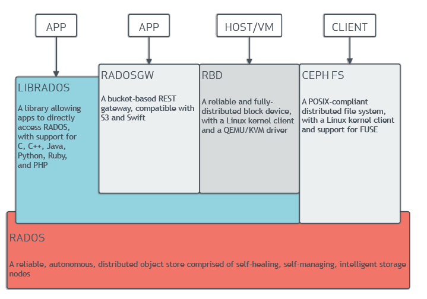

**<font style="color:rgb(51, 51, 51);">RADOS</font>**<font style="color:rgb(51, 51, 51);">: Ceph的高可靠,高可拓展,高性能,高自动化都是由这一层来提供的, 用户数据的存储最终也都是通过这一层来进行存储的。</font>

<font style="color:rgb(51, 51, 51);">可以说RADOS就是ceph底层原生的数据引擎, 但实际应用时却不直接使用它,而是分为如下4种方式来使用:</font>

+ **<font style="color:rgb(51, 51, 51);">LIBRADOS</font>**<font style="color:rgb(51, 51, 51);">是一个库, 它允许应用程序通过访问该库来与RADOS系统进行交互，支持多种编程语言。如Python,C,C++等. </font>**<font style="color:rgb(51, 51, 51);">简单来说,就是给开发人员使用的接口</font>**<font style="color:rgb(51, 51, 51);">。</font>
+ **<font style="color:rgb(51, 51, 51);">CEPH FS</font>**<font style="color:rgb(51, 51, 51);">通过Linux内核客户端和FUSE来提供文件系统。</font>**<font style="color:rgb(51, 51, 51);">(文件存储)</font>**
+ **<font style="color:rgb(51, 51, 51);">RBD</font>**<font style="color:rgb(51, 51, 51);">通过Linux内核客户端和QEMU/KVM驱动来提供一个分布式的块设备。</font>**<font style="color:rgb(51, 51, 51);">(块存储)</font>**
+ **<font style="color:rgb(51, 51, 51);">RADOSGW</font>**<font style="color:rgb(51, 51, 51);">是一套基于当前流行的RESTFUL协议的网关，并且兼容S3和Swift。</font>**<font style="color:rgb(51, 51, 51);">(对象存储)</font>**

## **<font style="color:rgb(51, 51, 51);">拓展名词</font>**
**<font style="color:rgb(51, 51, 51);">RESTFUL</font>**<font style="color:rgb(51, 51, 51);">: RESTFUL是一种架构风格,提供了一组设计原则和约束条件,http就属于这种风格的典型应用。REST最大的几个特点为：资源、统一接口、URI和无状态。</font>

+ <font style="color:rgb(51, 51, 51);">资源: 网络上一个具体的信息: 一个文件,一张图片,一段视频都算是一种资源。</font>
+ <font style="color:rgb(51, 51, 51);">统一接口: 数据的元操作，即CRUD(create, read, update和delete)操作，分别对应于HTTP方法</font>
    - <font style="color:rgb(51, 51, 51);">GET（SELECT）：从服务器取出资源(一项或多项)。</font>
    - <font style="color:rgb(51, 51, 51);">POST（CREATE）：在服务器新建一个资源。</font>
    - <font style="color:rgb(51, 51, 51);">PUT（UPDATE）：在服务器更新资源(客户端提供完整资源数据)。</font>
    - <font style="color:rgb(51, 51, 51);">PATCH（UPDATE）：在服务器更新资源(客户端提供需要修改的资源数据)。</font>
    - <font style="color:rgb(51, 51, 51);">DELETE（DELETE）：从服务器删除资源。</font>
+ <font style="color:rgb(51, 51, 51);">URI(统一资源定位符): 每个URI都对应一个特定的资源。要获取这个资源，访问它的URI就可以。最典型的URI即URL</font>
+ <font style="color:rgb(51, 51, 51);">无状态: 一个资源的定位与其它资源无关，不受其它资源的影响。</font>

**<font style="color:rgb(51, 51, 51);">S3 (Simple Storage Service 简单存储服务)</font>**<font style="color:rgb(51, 51, 51);">: 可以把S3看作是一个超大的硬盘, 里面存放数据资源(文件,图片,视频等),这些资源统称为</font>**<font style="color:rgb(51, 51, 51);">对象</font>**<font style="color:rgb(51, 51, 51);">.这些对象存放在</font>**<font style="color:rgb(51, 51, 51);">存储段</font>**<font style="color:rgb(51, 51, 51);">里,在S3叫做</font>**<font style="color:rgb(51, 51, 51);">bucket</font>**<font style="color:rgb(51, 51, 51);">. </font>

<font style="color:rgb(51, 51, 51);">和硬盘做类比, 存储段(bucket)就相当于目录,对象就相当于文件。</font>

<font style="color:rgb(51, 51, 51);">硬盘路径类似</font>`<font style="color:rgb(51, 51, 51);background-color:rgb(243, 244, 244);">/root/file1.txt</font>`

<font style="color:rgb(51, 51, 51);">S3的URI类似</font>`<font style="color:rgb(51, 51, 51);background-color:rgb(243, 244, 244);">s3://bucket_name/object_name</font>`

**<font style="color:rgb(51, 51, 51);">swift:</font>**<font style="color:rgb(51, 51, 51);"> 最初是由Rackspace公司开发的高可用分布式对象存储服务，并于2010年贡献给OpenStack开源社区作为其最初的核心子项目之一.</font>

# <font style="color:rgb(51, 51, 51);">三、Ceph集群</font>
## <font style="color:rgb(51, 51, 51);">集群组件</font>
<font style="color:rgb(51, 51, 51);">Ceph集群包括</font>**<font style="color:rgb(51, 51, 51);">Ceph OSD</font>**<font style="color:rgb(51, 51, 51);">,</font>**<font style="color:rgb(51, 51, 51);">Ceph Monitor</font>**<font style="color:rgb(51, 51, 51);">两种守护进程。</font>

**<font style="color:rgb(51, 51, 51);">Ceph OSD</font>**<font style="color:rgb(51, 51, 51);">(Object Storage Device): 功能是存储数据,处理数据的复制、恢复、回填、再均衡,并通过检查其他OSD守护进程的心跳来向Ceph Monitors提供一些监控信息。</font>**<font style="color:rgb(51, 51, 51);">Ceph Monitor</font>**<font style="color:rgb(51, 51, 51);">: 是一个监视器,监视Ceph集群状态和维护集群中的各种关系。</font>

<font style="color:rgb(51, 51, 51);">Ceph存储集群至少需要一个Ceph Monitor和两个 OSD 守护进程。</font>

## <font style="color:rgb(51, 51, 51);">集群环境准备</font>
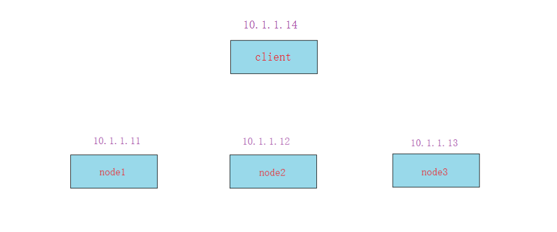

**<font style="color:rgb(51, 51, 51);">准备工作:</font>**

<font style="color:rgb(51, 51, 51);">准备四台服务器，需要能上外网,IP静态固定 (</font>**<font style="color:rgb(51, 51, 51);">==除client外每台最少加1个磁盘，最小1G，不用分区==</font>**<font style="color:rgb(51, 51, 51);">); </font>

<font style="color:rgb(51, 51, 51);">1, 配置主机名和主机名绑定(</font>**<font style="color:rgb(51, 51, 51);">所有节点都要绑定</font>**<font style="color:rgb(51, 51, 51);">)</font>

<font style="color:rgb(51, 51, 51);">(==</font>**<font style="color:rgb(51, 51, 51);">注意:这里都全改成短主机名,方便后面实验。如果你坚持用类似vm1.cluster.com这种主机名,或者加别名的话,ceph会在后面截取你的主机名vm1.cluster.com为vm1,造成不一致导致出错</font>**<font style="color:rgb(51, 51, 51);">==)</font>

```bash
# hostnamectl set-hostname --static node1
# vim /etc/hosts
10.1.1.11   node1
10.1.1.12   node2
10.1.1.13   node3

10.1.1.14   client
```

<font style="color:rgb(51, 51, 51);">2, 关闭防火墙,selinux(</font>**<font style="color:rgb(51, 51, 51);">使用iptables -F清一下规则</font>**<font style="color:rgb(51, 51, 51);">)</font>

```bash
# systemctl stop firewalld
# systemctl disable firewalld

# iptables -F

# setenforce 0
```

<font style="color:rgb(51, 51, 51);">3, 时间同步(</font>**<font style="color:rgb(51, 51, 51);">==启动ntpd服务并确认所有节点时间一致==</font>**<font style="color:rgb(51, 51, 51);">)</font>

```bash
# systemctl restart ntpd

# systemctl enable ntpd
```

<font style="color:rgb(51, 51, 51);">4, 配置yum源(==</font>**<font style="color:rgb(51, 51, 51);">所有节点都要配置,包括client</font>**<font style="color:rgb(51, 51, 51);">==)</font>

<font style="color:rgb(51, 51, 51);">ceph的yum源方法2种:</font>

+ <font style="color:rgb(51, 51, 51);">公网ceph源(</font>**<font style="color:rgb(51, 51, 51);">==centos7默认的公网源+epel源+ceph的aliyun源==</font>**<font style="color:rgb(51, 51, 51);">)</font>

```bash
# yum install epel-release -y

# vim /etc/yum.repos.d/ceph.repo

[ceph]
name=ceph
baseurl=http://mirrors.aliyun.com/ceph/rpm-mimic/el7/x86_64/
enabled=1
gpgcheck=0
priority=1

[ceph-noarch]
name=cephnoarch
baseurl=http://mirrors.aliyun.com/ceph/rpm-mimic/el7/noarch/
enabled=1
gpgcheck=0
priority=1

[ceph-source]
name=Ceph source packages
baseurl=http://mirrors.aliyun.com/ceph/rpm-mimic/el7/SRPMS
enabled=1
gpgcheck=0
priority=1
```

+ <font style="color:rgb(51, 51, 51);">本地ceph源(</font>**<font style="color:rgb(51, 51, 51);">==centos7默认的公网源+ceph本地源==</font>**<font style="color:rgb(51, 51, 51);">)</font>
    - <font style="color:rgb(51, 51, 51);">公网源下载网络慢,而且公网源可能更新会造成问题。可使用下载好的做本地ceph源</font>

<font style="color:rgb(51, 51, 51);">将共享的ceph_soft目录拷贝到</font>**<font style="color:rgb(51, 51, 51);">所有节点</font>**<font style="color:rgb(51, 51, 51);">上(比如:/root/目录下)</font>

```bash
# vim /etc/yum.repos.d/ceph.repo
[local_ceph]
name=local_ceph
baseurl=file:///root/ceph_soft
gpgcheck=0

enabled=1
```

## <font style="color:rgb(51, 51, 51);">集群部署过程</font>
### <font style="color:rgb(51, 51, 51);">第1步: 配置ssh免密</font>
**<font style="color:rgb(51, 51, 51);">以node1为==部署配置节点==,在node1上配置ssh等效性(要求ssh node1,node2,node3 ,client都要免密码)</font>**

<font style="color:rgb(51, 51, 51);">说明: 此步骤不是必要的，做此步骤的目的: </font>

+ <font style="color:rgb(51, 51, 51);">如果使用ceph-deploy来安装集群,密钥会方便安装</font>
+ <font style="color:rgb(51, 51, 51);">如果不使用ceph-deploy安装,也可以方便后面操作: 比如同步配置文件</font>

```bash
[root@node1 ~]# ssh-keygen 

[root@node1 ~]# ssh-copy-id -i node1
[root@node1 ~]# ssh-copy-id -i node2
[root@node1 ~]# ssh-copy-id -i node3
[root@node1 ~]# ssh-copy-id -i client
```

### <font style="color:rgb(51, 51, 51);">第2步: 在node1上安装部署工具</font>
**<font style="color:rgb(51, 51, 51);">(其它节点不用安装)</font>**

```bash
[root@node1 ~]# yum install ceph-deploy -y

yum install python-setuptools
```

### <font style="color:rgb(51, 51, 51);">第3步: 在node1上创建集群</font>
**<font style="color:rgb(51, 51, 51);">建立一个集群配置目录</font>**

**<font style="color:rgb(51, 51, 51);">==注意: 后面的大部分操作都会在此目录==</font>**

```bash
[root@node1 ~]# mkdir /etc/ceph

[root@node1 ~]# cd /etc/ceph
```

**<font style="color:rgb(51, 51, 51);">创建一个ceph集群</font>**

```bash
[root@node1 ceph]# ceph-deploy new node1

[root@node1 ceph]# ls
ceph.conf  ceph-deploy-ceph.log  ceph.mon.keyring

说明:
ceph.conf               集群配置文件
ceph-deploy-ceph.log    使用ceph-deploy部署的日志记录

ceph.mon.keyring        mon的验证key文件
```

### <font style="color:rgb(51, 51, 51);">第4步: ceph集群节点安装ceph</font>
<font style="color:rgb(51, 51, 51);">前面准备环境时已经准备好了yum源,在这里==</font>**<font style="color:rgb(51, 51, 51);">所有集群节点(不包括client)</font>**<font style="color:rgb(51, 51, 51);">==都安装以下软件</font>

```bash
# yum install ceph ceph-radosgw -y


# ceph -v
ceph version 13.2.6 (02899bfda814146b021136e9d8e80eba494e1126) mimic (stable)
```

**<font style="color:rgb(51, 51, 51);">补充说明:</font>**

+ <font style="color:rgb(51, 51, 51);">如果公网OK,并且网速好的话,可以用</font>`<font style="color:rgb(51, 51, 51);background-color:rgb(243, 244, 244);">ceph-deploy install node1 node2 node3</font>`<font style="color:rgb(51, 51, 51);">命令来安装,但网速不好的话会比较坑</font>
+ <font style="color:rgb(51, 51, 51);">所以这里我们选择直接用准备好的本地ceph源,然后</font>`<font style="color:rgb(51, 51, 51);background-color:rgb(243, 244, 244);">yum install ceph ceph-radosgw -y</font>`<font style="color:rgb(51, 51, 51);">安装即可。</font>

### <font style="color:rgb(51, 51, 51);">第5步: 客户端安装</font>`<font style="color:rgb(51, 51, 51);background-color:rgb(243, 244, 244);">ceph-common</font>`
```bash
[root@client ~]# yum install ceph-common -y
```

### <font style="color:rgb(51, 51, 51);">第6步: 创建mon(监控)</font>
**<font style="color:rgb(51, 51, 51);">增加public网络用于监控</font>**

```bash
在[global]配置段里添加下面一句（直接放到最后一行)

[root@node1 ceph]# vim /etc/ceph/ceph.conf  

public network = 10.1.1.0/24            监控网络
```

**<font style="color:rgb(51, 51, 51);">监控节点初始化,并同步配置到所有节点(node1,node2,node3,不包括client)</font>**

```bash
cd /etc/ceph/

[root@node1 ceph]# ceph-deploy mon create-initial

[root@node1 ceph]# ceph health          
HEALTH_OK                                       状态health（健康）

将配置文件信息同步到所有节点

[root@node1 ceph]# ceph-deploy admin node1 node2 node3
```

```bash
[root@node1 ceph]# ceph -s
  cluster:
    id:     c05c1f28-ea78-41b7-b674-a069d90553ac
    health: HEALTH_OK                           健康状态为OK

  services:
    mon: 1 daemons, quorum node1                1个监控
    mgr: no daemons active
    osd: 0 osds: 0 up, 0 in

  data:
    pools:   0 pools, 0 pgs
    objects: 0  objects, 0 B
    usage:   0 B used, 0 B / 0 B avail
    pgs:
```

**<font style="color:rgb(51, 51, 51);">为了防止mon单点故障，你可以加多个mon节点(建议奇数个，因为有quorum仲裁投票)</font>**

<font style="color:rgb(51, 51, 51);">回顾: 什么是quorum(仲裁,法定人数)? </font>

```bash
cd /etc/ceph/

[root@node1 ceph]# ceph-deploy mon add node2    
[root@node1 ceph]# ceph-deploy mon add node3


[root@node1 ceph]# ceph -s
  cluster:
    id:     c05c1f28-ea78-41b7-b674-a069d90553ac
    health: HEALTH_OK                               健康状态为OK
 
  services:
    mon: 3 daemons, quorum node1,node2,node3        3个监控
    mgr: no daemons active                          
    osd: 0 osds: 0 up, 0 in
 
  data:
    pools:   0 pools, 0 pgs
    objects: 0  objects, 0 B
    usage:   0 B used, 0 B / 0 B avail
    pgs:
```

#### <font style="color:rgb(51, 51, 51);">监控到时间不同步的解决方法</font>
**<font style="color:rgb(51, 51, 51);">ceph集群对时间同步要求非常高, 即使你已经将ntpd服务开启,但仍然可能有</font>**`**<font style="color:rgb(51, 51, 51);background-color:rgb(243, 244, 244);">clock skew deteted</font>**`**<font style="color:rgb(51, 51, 51);">相关警告</font>**

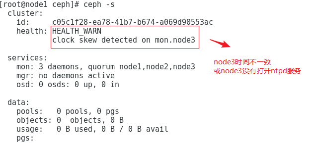

<font style="color:rgb(51, 51, 51);">请做如下尝试:</font>

<font style="color:rgb(51, 51, 51);">1, 在ceph集群所有节点上(</font>`<font style="color:rgb(51, 51, 51);background-color:rgb(243, 244, 244);">node1</font>`<font style="color:rgb(51, 51, 51);">,</font>`<font style="color:rgb(51, 51, 51);background-color:rgb(243, 244, 244);">node2</font>`<font style="color:rgb(51, 51, 51);">,</font>`<font style="color:rgb(51, 51, 51);background-color:rgb(243, 244, 244);">node3</font>`<font style="color:rgb(51, 51, 51);">)不使用ntpd服务,直接使用crontab同步</font>

```bash
# systemctl stop ntpd
# systemctl disable ntpd

# crontab -e

*/10 * * * * ntpdate ntp1.aliyun.com                每5或10分钟同步1次公网的任意时间服务器
```

<font style="color:rgb(51, 51, 51);">2, 调大时间警告的阈值</font>

```bash
[root@node1 ceph]# vim ceph.conf
[global]                                在global参数组里添加以下两行                       
......
mon clock drift allowed = 2             # monitor间的时钟滴答数(默认0.5秒)
mon clock drift warn backoff = 30       # 调大时钟允许的偏移量(默认为5)
```

<font style="color:rgb(51, 51, 51);">3, 同步到所有节点</font>

```bash
[root@node1 ceph]# ceph-deploy --overwrite-conf admin node1 node2 node3

前面第1次同步不需要加--overwrite-conf参数
这次修改ceph.conf再同步就需要加--overwrite-conf参数覆盖
```

<font style="color:rgb(51, 51, 51);">4, </font>**<font style="color:rgb(51, 51, 51);">所有ceph集群节点</font>**<font style="color:rgb(51, 51, 51);">上重启ceph-mon.target服务</font>

```bash
# systemctl restart ceph-mon.target
```

### <font style="color:rgb(51, 51, 51);">第7步: 创建mgr(管理)</font>
<font style="color:rgb(51, 51, 51);">ceph luminous版本中新增加了一个组件：Ceph Manager Daemon，简称ceph-mgr。</font>

<font style="color:rgb(51, 51, 51);">该组件的主要作用是分担和扩展monitor的部分功能，减轻monitor的负担，让更好地管理ceph存储系统。</font>

**<font style="color:rgb(51, 51, 51);">创建一个mgr</font>**

```bash
[root@node1 ceph]# ceph-deploy mgr create node1


[root@node1 ceph]# ceph -s
  cluster:
    id:     c05c1f28-ea78-41b7-b674-a069d90553ac
    health: HEALTH_OK

  services:
    mon: 3 daemons, quorum node1,node2,node3
    mgr: node1(active)                          node1为mgr
    osd: 0 osds: 0 up, 0 in

  data:
    pools:   0 pools, 0 pgs
    objects: 0  objects, 0 B
    usage:   0 B used, 0 B / 0 B avail
    pgs:
```

**<font style="color:rgb(51, 51, 51);">添加多个mgr可以实现HA</font>**

```bash
[root@node1 ceph]# ceph-deploy mgr create node2

[root@node1 ceph]# ceph-deploy mgr create node3


[root@node1 ceph]# ceph -s
  cluster:
    id:     c05c1f28-ea78-41b7-b674-a069d90553ac
    health: HEALTH_OK                               健康状态为OK
 
  services:
    mon: 3 daemons, quorum node1,node2,node3        3个监控
    mgr: node1(active), standbys: node2, node3      看到node1为主,node2,node3为备
    osd: 0 osds: 0 up, 0 in                         看到为0个磁盘
 
  data:
    pools:   0 pools, 0 pgs
    objects: 0  objects, 0 B
    usage:   0 B used, 0 B / 0 B avail
    pgs:
```

### <font style="color:rgb(51, 51, 51);">第8步: 创建osd(存储盘)</font>
```bash
[root@node1 ceph]# ceph-deploy disk --help

[root@node1 ceph]# ceph-deploy osd --help
```

<font style="color:rgb(51, 51, 51);">列表所有节点的磁盘,都有sda和sdb两个盘,sdb为我们要加入分布式存储的盘</font>

```bash
列表查看节点上的磁盘

cd /etc/ceph/

[root@node1 ceph]# ceph-deploy disk list node1

[root@node1 ceph]# ceph-deploy disk list node2

[root@node1 ceph]# ceph-deploy disk list node3


zap表示干掉磁盘上的数据,相当于格式化

[root@node1 ceph]# ceph-deploy disk zap node1 /dev/sdb
[root@node1 ceph]# ceph-deploy disk zap node2 /dev/sdb
[root@node1 ceph]# ceph-deploy disk zap node3 /dev/sdb

将磁盘创建为osd

[root@node1 ceph]# ceph-deploy osd create --data /dev/sdb node1

[root@node1 ceph]# ceph-deploy osd create --data /dev/sdb node2

[root@node1 ceph]# ceph-deploy osd create --data /dev/sdb node3
```

```bash
[root@node1 ceph]# ceph -s
  cluster:
    id:     c05c1f28-ea78-41b7-b674-a069d90553ac
    health: HEALTH_OK
 
  services:
    mon: 3 daemons, quorum node1,node2,node3
    mgr: node1(active), standbys: node2, node3
    osd: 3 osds: 3 up, 3 in                                 看到这里有3个osd
 
  data:
    pools:   0 pools, 0 pgs
    objects: 0  objects, 0 B
    usage:   41 MiB used, 2.9 GiB / 3.0 GiB avail           大小为3个磁盘的总和
    pgs:
```

<font style="color:rgb(51, 51, 51);">osd都创建好了，那么怎么存取数据呢?</font>

## <font style="color:rgb(51, 51, 51);">集群节点的扩容方法</font>
<font style="color:rgb(51, 51, 51);">假设再加一个新的集群节点node4</font>

<font style="color:rgb(51, 51, 51);">1, 主机名配置和绑定</font>

<font style="color:rgb(51, 51, 51);">2, 在node4上</font>`<font style="color:rgb(51, 51, 51);background-color:rgb(243, 244, 244);">yum install ceph ceph-radosgw -y</font>`<font style="color:rgb(51, 51, 51);">安装软件</font>

<font style="color:rgb(51, 51, 51);">3, 在部署节点node1上同步配置文件给node4. </font>`<font style="color:rgb(51, 51, 51);background-color:rgb(243, 244, 244);">ceph-deploy admin node4</font>`

<font style="color:rgb(51, 51, 51);">4, 按需求选择在node4上添加mon或mgr或osd等</font>

# <font style="color:rgb(51, 51, 51);">四、RADOS原生数据存取演示</font>
<font style="color:rgb(51, 51, 51);">上面提到了RADOS也可以进行数据的存取操作, 但我们一般不直接使用它，但我们可以先用RADOS的方式来深入了解下ceph的数据存取原理。</font>

## <font style="color:rgb(51, 51, 51);">存取原理</font>
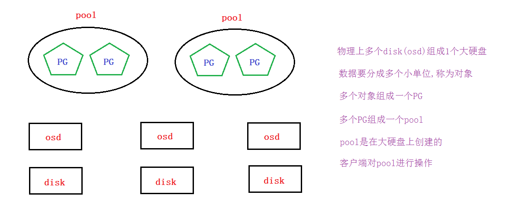

<font style="color:rgb(51, 51, 51);">要实现数据存取需要创建一个pool,创建pool要先分配PG。</font>

<font style="color:rgb(51, 51, 51);">如果客户端对一个pool写了一个文件, 那么这个文件是如何分布到多个节点的磁盘上呢?</font>

<font style="color:rgb(51, 51, 51);">答案是通过</font>**<font style="color:rgb(51, 51, 51);">CRUSH算法</font>**<font style="color:rgb(51, 51, 51);">。</font>

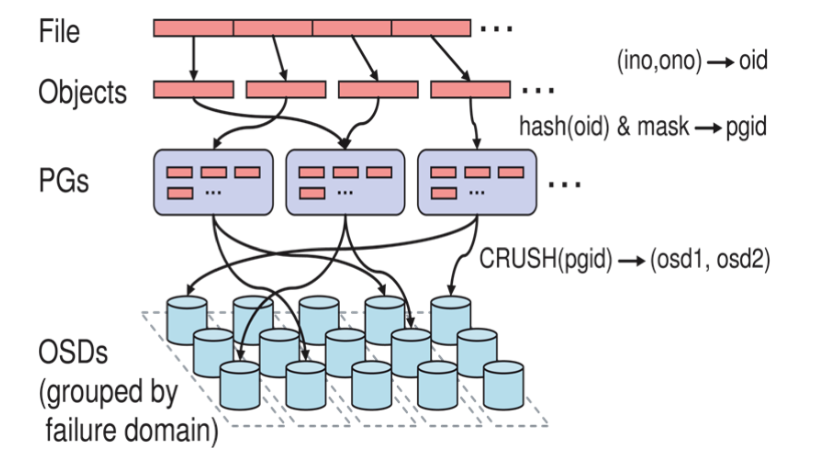

**<font style="color:rgb(51, 51, 51);">CRUSH算法</font>**

+ <font style="color:rgb(51, 51, 51);">CRUSH(Controlled Scalable Decentralized Placement of Replicated Data)算法为可控的,可扩展的,分布式的副本数据放置算法的简称。</font>
+ <font style="color:rgb(51, 51, 51);">PG到OSD的映射的过程算法叫做CRUSH 算法。(一个Object需要保存三个副本，也就是需要保存在三个osd上)。</font>
+ <font style="color:rgb(51, 51, 51);">CRUSH算法是一个伪随机的过程，他可以从所有的OSD中，随机性选择一个OSD集合，但是同一个PG每次随机选择的结果是不变的，也就是映射的OSD集合是固定的。</font>

**<font style="color:rgb(51, 51, 51);">小结:</font>**

+ <font style="color:rgb(51, 51, 51);">客户端直接对pool操作(但文件存储,块存储,对象存储我们不这么做)</font>
+ <font style="color:rgb(51, 51, 51);">pool里要分配PG</font>
+ <font style="color:rgb(51, 51, 51);">PG里可以存放多个对象</font>
+ <font style="color:rgb(51, 51, 51);">对象就是由客户端写入的数据分离的单位</font>
+ <font style="color:rgb(51, 51, 51);">CRUSH算法将客户端写入的数据映射分布到OSD,从而最终存放到物理磁盘上(这个具体过程是抽象的,我们运维工程师可不用再深挖,因为分布式存储对于运维工程师来说就一个大硬盘)</font>

## <font style="color:rgb(51, 51, 51);">创建pool</font>
<font style="color:rgb(51, 51, 51);">创建test_pool,指定pg数为128</font>

```bash
[root@node1 ceph]# ceph osd pool create test_pool 128
pool 'test_pool' created
```

<font style="color:rgb(51, 51, 51);">查看pg数量,可以使用ceph osd pool set test_pool pg_num 64这样的命令来尝试调整</font>

```bash
[root@node1 ceph]# ceph osd pool get test_pool pg_num
pg_num: 128
```

<font style="color:rgb(51, 51, 51);">说明: </font>**<font style="color:rgb(51, 51, 51);">pg数与ods数量有关系</font>**

+ <font style="color:rgb(51, 51, 51);">pg数为2的倍数,一般5个以下osd,分128个PG或以下即可(分多了PG会报错的,可按报错适当调低)</font>
+ <font style="color:rgb(51, 51, 51);">可以使用</font>`<font style="color:rgb(51, 51, 51);background-color:rgb(243, 244, 244);">ceph osd pool set test_pool pg_num 64</font>`<font style="color:rgb(51, 51, 51);">这样的命令来尝试调整</font>

## <font style="color:rgb(51, 51, 51);">存储测试</font>
<font style="color:rgb(51, 51, 51);">1, 我这里把本机的/etc/fstab文件上传到test_pool,并取名为newfstab</font>

```bash
[root@node1 ceph]# rados put newfstab /etc/fstab --pool=test_pool
```

<font style="color:rgb(51, 51, 51);">2, 查看</font>

```bash
[root@node1 ceph]# rados -p test_pool ls
newfstab
```

<font style="color:rgb(51, 51, 51);">3, 删除</font>

```bash
[root@node1 ceph]# rados rm newfstab --pool=test_pool
```

## <font style="color:rgb(51, 51, 51);">删除pool</font>
<font style="color:rgb(51, 51, 51);">1, 在部署节点node1上增加参数允许ceph删除pool</font>

```bash
[root@node1 ceph]# vim /etc/ceph/ceph.conf 

mon_allow_pool_delete = true
```

<font style="color:rgb(51, 51, 51);">2, 修改了配置, 要同步到其它集群节点</font>

```bash
[root@node1 ceph]# ceph-deploy --overwrite-conf admin node1 node2 node3
```

<font style="color:rgb(51, 51, 51);">3, 重启监控服务</font>

```bash
[root@node1 ceph]# systemctl restart ceph-mon.target
```

<font style="color:rgb(51, 51, 51);">4, 删除时pool名输两次，后再接</font>`<font style="color:rgb(51, 51, 51);background-color:rgb(243, 244, 244);">--yes-i-really-really-mean-it</font>`<font style="color:rgb(51, 51, 51);">参数就可以删除了</font>

```bash
[root@node1 ceph]# ceph osd pool delete test_pool test_pool --yes-i-really-really-mean-it
```

# <font style="color:rgb(51, 51, 51);">五、创建Ceph文件存储</font>
<font style="color:rgb(51, 51, 51);">要运行Ceph文件系统, 你必须先创建至少带一个mds的Ceph存储集群.</font>

<font style="color:rgb(51, 51, 51);">(Ceph块设备和Ceph对象存储不使用MDS)。</font>

**<font style="color:rgb(51, 51, 51);">Ceph MDS</font>**<font style="color:rgb(51, 51, 51);">: Ceph文件存储类型存放与管理==元数据metadata==的服务</font>

## <font style="color:rgb(51, 51, 51);">创建文件存储并使用</font>
<font style="color:rgb(51, 51, 51);">第1步: 在node1部署节点上同步配置文件,并创建mds服务(也可以做多个mds实现HA)</font>

```bash
[root@node1 ceph]# ceph-deploy mds create node1 node2 node3
我这里做三个mds
```

<font style="color:rgb(51, 51, 51);">第2步: 一个Ceph文件系统需要至少两个RADOS存储池，一个用于数据，一个用于元数据。所以我们创建它们。</font>

```bash
[root@node1 ceph]# ceph osd pool create cephfs_pool 128
pool 'cephfs_pool' created

[root@node1 ceph]# ceph osd pool create cephfs_metadata 64
pool 'cephfs_metadata' created


[root@node1 ceph]# ceph osd pool ls |grep cephfs
cephfs_pool
cephfs_metadata
```

<font style="color:rgb(51, 51, 51);">第3步: 创建Ceph文件系统,并确认客户端访问的节点</font>

```bash
[root@node1 ceph]# ceph fs new cephfs cephfs_metadata cephfs_pool

[root@node1 ceph]# ceph fs ls
name: cephfs, metadata pool: cephfs_metadata, data pools: [cephfs_pool ]


[root@node1 ceph]# ceph mds stat
cephfs-1/1/1 up  {0=ceph_node3=up:active}, 2 up:standby     这里看到node3为up状态
```

<font style="color:rgb(51, 51, 51);">第4步: 客户端准备验证key文件 </font>

+ <font style="color:rgb(51, 51, 51);">说明: ceph默认启用了cephx认证, 所以客户端的挂载必须要验证</font>

<font style="color:rgb(51, 51, 51);">在集群节点(node1,node2,node3)上任意一台查看密钥字符串</font>

```bash
[root@node1 ~]# cat /etc/ceph/ceph.client.admin.keyring
[client.admin]
        key = AQDEKlJdiLlKAxAARx/PXR3glQqtvFFMhlhPmw==      后面的字符串就是验证需要的
        caps mds = "allow *"
        caps mgr = "allow *"
        caps mon = "allow *"
        caps osd = "allow *"
```

<font style="color:rgb(51, 51, 51);">在客户端上创建一个文件记录密钥字符串</font>

```bash
[root@client ~]# vim admin.key          # 创建一个密钥文件,复制粘贴上面得到的字符串
AQDEKlJdiLlKAxAARx/PXR3glQqtvFFMhlhPmw==
```

<font style="color:rgb(51, 51, 51);">第5步: 客户端挂载(</font>**<font style="color:rgb(51, 51, 51);">挂载ceph集群中跑了mon监控的节点, mon监控为6789端口</font>**<font style="color:rgb(51, 51, 51);">)</font>

```bash
[root@client ~]# mount -t ceph node1:6789:/ /mnt -o name=admin,secretfile=/root/admin.key
```

<font style="color:rgb(51, 51, 51);">第6步: 验证</font>

```bash
[root@client ~]# df -h |tail -1

node1:6789:/  3.8G     0  3.8G   0% /mnt # 大小不用在意,场景不一样,pg数,副本数都会影响
```

<font style="color:rgb(51, 51, 51);">如要验证读写请自行验证</font>

<font style="color:rgb(51, 51, 51);">可以使用两个客户端, 同时挂载此文件存储,可实现同读同写</font>

## <font style="color:rgb(51, 51, 51);">删除文件存储方法</font>
**<font style="color:rgb(51, 51, 51);">如果需要删除文件存储,请按下面操作过程来操作</font>**

<font style="color:rgb(51, 51, 51);">第1步: 在客户端上删除数据,并umount所有挂载</font>

```bash
[root@client ~]# rm /mnt/* -rf

[root@client ~]# umount /mnt/
```

<font style="color:rgb(51, 51, 51);">第2步: 停掉所有节点的mds(只有停掉mds才能删除文件存储)</font>

```bash
[root@node1 ~]# systemctl stop ceph-mds.target
[root@node2 ~]# systemctl stop ceph-mds.target
[root@node3 ~]# systemctl stop ceph-mds.target
```

<font style="color:rgb(51, 51, 51);">第3步: 回到集群任意一个节点上(node1,node2,node3其中之一)删除</font>

<font style="color:rgb(51, 51, 51);">==如果要客户端删除,需要在node1上</font>`<font style="color:rgb(51, 51, 51);background-color:rgb(243, 244, 244);">ceph-deploy admin client</font>`<font style="color:rgb(51, 51, 51);">同步配置才可以==</font>

```bash
[root@client ~]# ceph fs rm cephfs --yes-i-really-mean-it


[root@client ~]# ceph osd pool delete cephfs_metadata cephfs_metadata --yes-i-really-really-mean-it
pool 'cephfs_metadata' removed


[root@client ~]# ceph osd pool delete cephfs_pool cephfs_pool --yes-i-really-really-mean-it
pool 'cephfs_pool' removed
```

<font style="color:rgb(51, 51, 51);">第4步: 再次mds服务再次启动</font>

```bash
[root@node1 ~]# systemctl start ceph-mds.target
[root@node2 ~]# systemctl start ceph-mds.target
[root@node3 ~]# systemctl start ceph-mds.target
```

# <font style="color:rgb(51, 51, 51);">六、创建Ceph块存储</font>
## <font style="color:rgb(51, 51, 51);">创建块存储并使用</font>
<font style="color:rgb(51, 51, 51);">第1步: 在node1上同步配置文件到client</font>

```bash
[root@node1 ceph]# ceph-deploy admin client
```

<font style="color:rgb(51, 51, 51);">第2步:建立存储池,并初始化</font>

**<font style="color:rgb(51, 51, 51);">==注意:在客户端操作==</font>**

```bash
[root@client ~]# ceph osd pool create rbd_pool 128      
pool 'rbd_pool' created


[root@client ~]# rbd pool init rbd_pool
```

<font style="color:rgb(51, 51, 51);">第3步:创建一个存储卷(我这里卷名为volume1,大小为5000M)</font>

**<font style="color:rgb(51, 51, 51);">注意: volume1的专业术语为image, 我这里叫存储卷方便理解</font>**

```bash
[root@client ~]# rbd create volume1 --pool rbd_pool --size 5000


[root@client ~]# rbd ls rbd_pool

volume1


[root@client ~]# rbd info volume1 -p rbd_pool
rbd image 'volume1':                        可以看到volume1为rbd image
        size 4.9 GiB in 1250 objects
        order 22 (4 MiB objects)
        id: 149256b8b4567
        block_name_prefix: rbd_data.149256b8b4567
        format: 2                           格式有1和2两种,现在是2
        features: layering, exclusive-lock, object-map, fast-diff, deep-flatten   特性
        op_features:
        flags:
        create_timestamp: Sat Aug 17 19:47:51 2019
```

<font style="color:rgb(51, 51, 51);">第4步: 将创建的卷映射成块设备</font>

+ <font style="color:rgb(51, 51, 51);">因为rbd镜像的一些特性，OS kernel并不支持，所以映射报错</font>

```bash
[root@client ~]# rbd map rbd_pool/volume1

rbd: sysfs write failed
RBD image feature set mismatch. You can disable features unsupported by the kernel with "rbd feature disable rbd_pool/volume1 object-map fast-diff deep-flatten".
In some cases useful info is found in syslog - try "dmesg | tail".
rbd: map failed: (6) No such device or address
```

+ <font style="color:rgb(51, 51, 51);">解决方法: disable掉相关特性</font>

```bash
[root@client ~]# rbd feature disable rbd_pool/volume1 exclusive-lock object-map fast-diff deep-flatten
```

+ <font style="color:rgb(51, 51, 51);">再次映射</font>

```bash
[root@client ~]# rbd map rbd_pool/volume1
/dev/rbd0
```

<font style="color:rgb(51, 51, 51);">第5步: 查看映射(如果要取消映射, 可以使用</font>`<font style="color:rgb(51, 51, 51);background-color:rgb(243, 244, 244);">rbd unmap /dev/rbd0</font>`<font style="color:rgb(51, 51, 51);">)</font>

```bash
[root@client ~]# rbd showmapped
id pool     image   snap device    
0  rbd_pool volume1 -    /dev/rbd0
```

<font style="color:rgb(51, 51, 51);">第6步: 格式化,挂载</font>

```bash
[root@client ~]# mkfs.xfs /dev/rbd0


[root@client ~]# mount /dev/rbd0 /mnt/


[root@client ~]# df -h |tail -1
/dev/rbd0        4.9G   33M  4.9G   1%   /mnt
```

<font style="color:rgb(51, 51, 51);">可自行验证读写</font>

**<font style="color:rgb(51, 51, 51);">==注意: 块存储是不能实现同读同写的,请不要两个客户端同时挂载进行读写==</font>**

## <font style="color:rgb(51, 51, 51);">块存储扩容与裁减</font>
<font style="color:rgb(51, 51, 51);">在线扩容</font>

<font style="color:rgb(51, 51, 51);">经测试,分区后</font>`<font style="color:rgb(51, 51, 51);background-color:rgb(243, 244, 244);">/dev/rbd0p1</font>`<font style="color:rgb(51, 51, 51);">不能在线扩容,直接使用</font>`<font style="color:rgb(51, 51, 51);background-color:rgb(243, 244, 244);">/dev/rbd0</font>`<font style="color:rgb(51, 51, 51);">才可以</font>

```bash
扩容成8000M

[root@client ~]# rbd resize --size 8000 rbd_pool/volume1


[root@client ~]# rbd info rbd_pool/volume1  |grep size
        size 7.8 GiB in 2000 objects


查看大小,并没有变化

[root@client ~]# df -h |tail -1
/dev/rbd0        4.9G   33M  4.9G   1%   /mnt


[root@client ~]# xfs_growfs -d /mnt/
再次查看大小,在线扩容成功
[root@client ~]# df -h |tail -1
/dev/rbd0        7.9G   33M  7.9G   1%   /mnt
```

<font style="color:rgb(51, 51, 51);">块存储裁减</font>

<font style="color:rgb(51, 51, 51);">不能在线裁减.裁减后需重新格式化再挂载，所以请提前备份好数据.</font>

```bash
再裁减回5000M

[root@client ~]# rbd resize --size 5000 rbd_pool/volume1 --allow-shrink

重新格式化挂载

[root@client ~]# umount /mnt/

[root@client ~]# mkfs.xfs -f /dev/rbd0

[root@client ~]# mount /dev/rbd0 /mnt/
再次查看,确认裁减成功
[root@client ~]# df -h |tail -1
/dev/rbd0        4.9G   33M  4.9G   1%   /mnt
```

## <font style="color:rgb(51, 51, 51);">删除块存储方法</font>
```bash
[root@client ~]# umount /mnt/

[root@client ~]# rbd unmap /dev/rbd0


[root@client ~]# ceph osd pool delete rbd_pool rbd_pool --yes-i-really-really-mean-it
pool 'rbd_pool' removed
```

# <font style="color:rgb(51, 51, 51);">七、Ceph对象存储</font>
## <font style="color:rgb(51, 51, 51);">测试ceph对象网关的连接</font>
<font style="color:rgb(51, 51, 51);">第1步: 在node1上创建rgw</font>

```bash
[root@node1 ceph]# ceph-deploy rgw create node1

[root@node1 ceph]# lsof -i:7480
COMMAND  PID USER   FD   TYPE DEVICE SIZE/OFF NODE NAME

radosgw 6748 ceph   40u  IPv4  49601      0t0  TCP *:7480 (LISTEN)
```

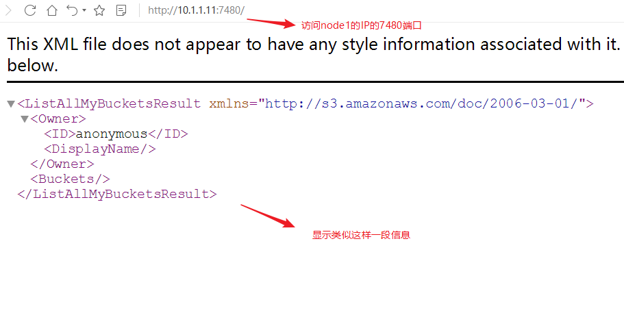


<font style="color:rgb(51, 51, 51);">第2步: 在客户端测试连接对象网关</font>

```bash
创建一个测试用户,需要在部署节点使用ceph-deploy admin client同步配置文件给client

[root@client ~]# radosgw-admin user create --uid="testuser" --display-name="First User"
{
    "user_id": "testuser",
    "display_name": "First User",
    "email": "",
    "suspended": 0,
    "max_buckets": 1000,
    "auid": 0,
    "subusers": [],
    "keys": [
        {
            "user": "testuser",
            "access_key": "36ROCI84S5NSP4BPYL01",
            "secret_key": "jBOKH0v6J79bn8jaAF2oaWU7JvqTxqb4gjerWOFW"

        }
    ],
    "swift_keys": [],
    "caps": [],
    "op_mask": "read, write, delete",
    "default_placement": "",
    "placement_tags": [],
    "bucket_quota": {
        "enabled": false,
        "check_on_raw": false,
        "max_size": -1,
        "max_size_kb": 0,
        "max_objects": -1
    },
    "user_quota": {
        "enabled": false,
        "check_on_raw": false,
        "max_size": -1,
        "max_size_kb": 0,
        "max_objects": -1
    },
    "temp_url_keys": [],
    "type": "rgw",
    "mfa_ids": []
}
```

<font style="color:rgb(51, 51, 51);">上面一大段主要有用的为access_key与secret_key，用于连接对象存储网关</font>

```bash
[root@client ~]# radosgw-admin user create --uid='testuser' --display-name='First User' |grep -E 'access_key|secret_key'

            "access_key": "UOO0SJF8ONCL90KFQHYZ",

            "secret_key": "V3oq62eWAT4GSARb1WNWydWQBGMPbAXWvWC6jKfs"
```

## <font style="color:rgb(51, 51, 51);">S3连接ceph对象网关</font>
<font style="color:rgb(51, 51, 51);">AmazonS3是一种面向Internet的对象存储服务.我们这里可以使用s3工具连接ceph的对象存储进行操作</font>

<font style="color:rgb(51, 51, 51);">第1步: 客户端安装s3cmd工具,并编写ceph连接配置文件</font>

```bash
[root@client ~]# yum install s3cmd

创建并编写下面的文件,key文件对应前面创建测试用户的key

[root@client ~]# vim /root/.s3cfg
[default]

access_key = UOO0SJF8ONCL90KFQHYZ

secret_key = V3oq62eWAT4GSARb1WNWydWQBGMPbAXWvWC6jKfs 
host_base = 10.1.1.11:7480
host_bucket = 10.1.1.11:7480/%(bucket)
cloudfront_host = 10.1.1.11:7480

use_https = False
```

<font style="color:rgb(51, 51, 51);">第2步: 命令测试</font>

```bash
列出bucket,可以查看到先前测试创建的my-new-bucket

[root@client ~]# s3cmd ls

2019-01-05 23:01  s3://my-new-bucket
再建一个桶

[root@client ~]# s3cmd mb s3://test_bucket
上传文件到桶

[root@client ~]# s3cmd put /etc/fstab s3://test_bucket
upload: '/etc/fstab' -> 's3://test_bucket/fstab'  [1 of 1]
 501 of 501   100% in    1s   303.34 B/s  done
下载到当前目录

[root@client ~]# s3cmd get s3://test_bucket/fstab

更多命令请见参考命令帮助
[root@client ~]# s3cmd --help
```

# <font style="color:rgb(51, 51, 51);">ceph dashboard(拓展)</font>
<font style="color:rgb(51, 51, 51);">通过ceph dashboard完成对ceph存储系统可视化监视。</font>

<font style="color:rgb(51, 51, 51);">第1步：查看集群状态确认mgr的active节点</font>

```bash
[root@node1 ~]# ceph -s
  cluster:
    id:     6788206c-c4ea-4465-b5d7-ef7ca3f74552
    health: HEALTH_OK

  services:
    mon: 3 daemons, quorum node1,node2,node3
    mgr: node1(active), standbys: node3, node2          确认mgr的active节点为node1
    osd: 4 osds: 4 up, 4 in
    rgw: 1 daemon active

  data:
    pools:   6 pools, 48 pgs
    objects: 197  objects, 2.9 KiB
    usage:   596 MiB used, 3.4 GiB / 4.0 GiB avail
    pgs:     48 active+clean
```

<font style="color:rgb(51, 51, 51);">第2步：开启dashboard模块</font>

```bash
[root@node1 ~]# ceph mgr module enable dashboard
```

<font style="color:rgb(51, 51, 51);">第3步：创建自签名证书</font>

```bash
[root@node1 ~]# ceph dashboard create-self-signed-cert
Self-signed certificate created
```

<font style="color:rgb(51, 51, 51);">第4步: 生成密钥对,并配置给ceph mgr</font>

```bash
[root@node1 ~]# mkdir /etc/mgr-dashboard

[root@node1 ~]# cd /etc/mgr-dashboard/

[root@node1 mgr-dashboard]# openssl req -new -nodes -x509 -subj "/O=IT-ceph/CN=cn" -days 365 -keyout dashboard.key -out dashboard.crt -extensions v3_ca
Generating a 2048 bit RSA private key
.+++
.....+++
writing new private key to 'dashboard.key'
-----

[root@node1 mgr-dashboard]# ls
dashboard.crt  dashboard.key
```

<font style="color:rgb(51, 51, 51);">第5步: 在ceph集群的active mgr节点上(我这里为node1)配置mgr services</font>

<font style="color:rgb(51, 51, 51);">使用dashboard服务，主要配置dashboard使用的IP及Port</font>

```bash
[root@node1 mgr-dashboard]# ceph config set mgr mgr/dashboard/server_addr 10.1.1.11
[root@node1 mgr-dashboard]# ceph config set mgr mgr/dashboard/server_port 8080
```

<font style="color:rgb(51, 51, 51);">第6步: 重启dashboard模块,并查看访问地址</font>

```bash
[root@node1 mgr-dashboard]# ceph mgr module disable dashboard                 
[root@node1 mgr-dashboard]# ceph mgr module enable dashboard                    

[root@node1 mgr-dashboard]# ceph mgr services
{
    "dashboard": "https://10.1.1.11:8080/"
}
```

<font style="color:rgb(51, 51, 51);">第7步：设置访问web页面用户名和密码</font>

```bash
[root@node1 mgr-dashboard]# ceph dashboard set-login-credentials daniel daniel123
Username and password updated
```

<font style="color:rgb(51, 51, 51);">第8步：通过本机或其它主机访问</font>

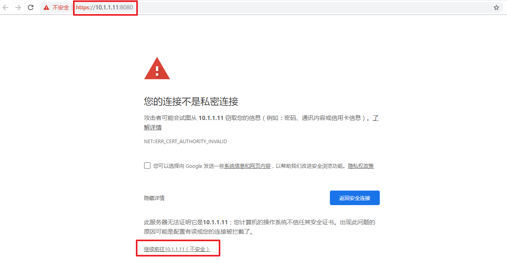

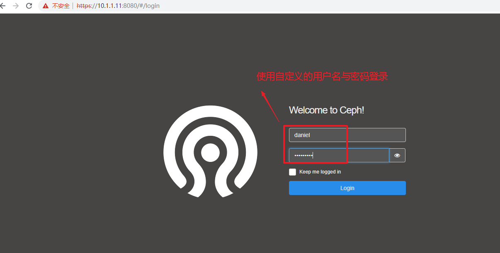


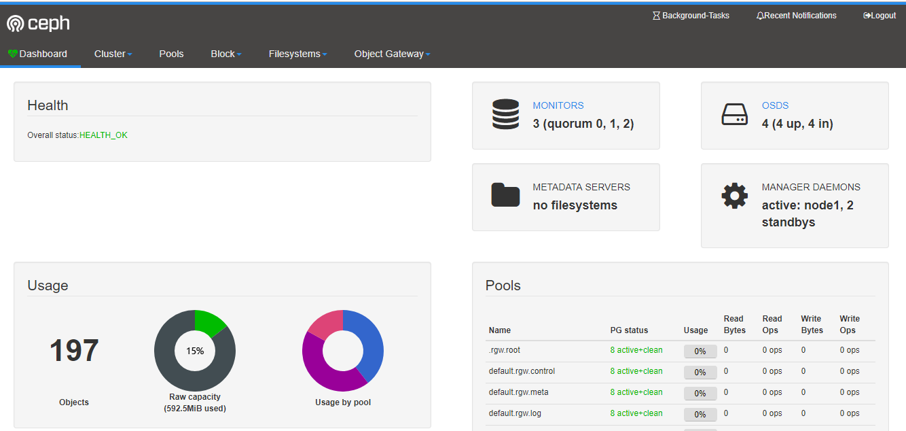

# <font style="color:rgb(51, 51, 51);">ceph对象存储结合owncloud打造云盘(拓展)</font>
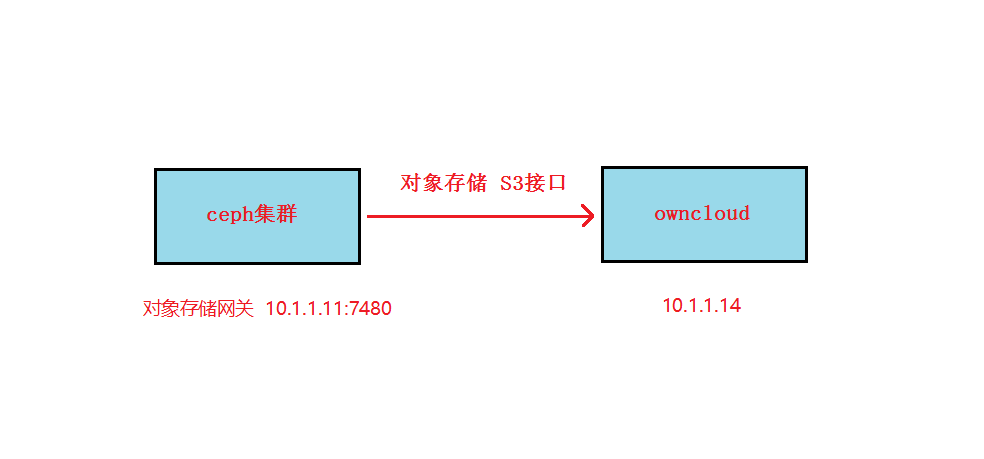


<font style="color:rgb(51, 51, 51);">1,在ceph的客户端上准备好bucket和相关的连接key</font>

```bash
[root@client ~]# s3cmd mb s3://owncloud
Bucket 's3://owncloud/' created

[root@client ~]# cat /root/.s3cfg
[default]
access_key = 36ROCI84S5NSP4BPYL01
secret_key = jBOKH0v6J79bn8jaAF2oaWU7JvqTxqb4gjerWOFW 
host_base = 10.1.1.11:7480
host_bucket = 10.1.1.11:7480/%(bucket)
cloudfront_host = 10.1.1.11:7480
use_https = False
```

<font style="color:rgb(51, 51, 51);">2, 在client端安装owncloud云盘运行所需要的web环境</font>

<font style="color:rgb(51, 51, 51);">owncloud需要web服务器和php支持. 目前最新版本owncloud需要php7.x版本,在这里我们为了节省时间,使用rpm版安装 </font>

```bash
[root@client ~]# yum install httpd mod_ssl php-mysql php php-gd php-xml php-mbstring -y


[root@client ~]# systemctl restart httpd
```

<font style="color:rgb(51, 51, 51);">3, 上传owncloud软件包, 并解压到httpd家目录</font>

[owncloud-9.0.1.tar.bz2.pdf](https://www.yuque.com/attachments/yuque/0/2024/pdf/194754/1728312080054-3ad47948-324d-4f06-a7d5-7b4a52e0323e.pdf)

owncloud-9.0.1.tar.bz2.pdf 下载下来改名owncloud-9.0.1.tar.bz2

```bash
# https://download.owncloud.com/server/stable/
# wget https://download.owncloud.com/server/stable/owncloud-10.11.0.tar.bz2

yum install bzip2
[root@client ~]# tar xf owncloud-9.0.1.tar.bz2 -C /var/www/html/


[root@client ~]# chown apache.apache -R /var/www/html/
需要修改为运行web服务器的用户owner,group,否则后面写入会出现权限问题
```

<font style="color:rgb(51, 51, 51);">4, 通过浏览器访问</font>`<font style="color:rgb(51, 51, 51);background-color:rgb(243, 244, 244);">http:10.1.1.14/owncloud</font>`<font style="color:rgb(51, 51, 51);">,进行配置</font>

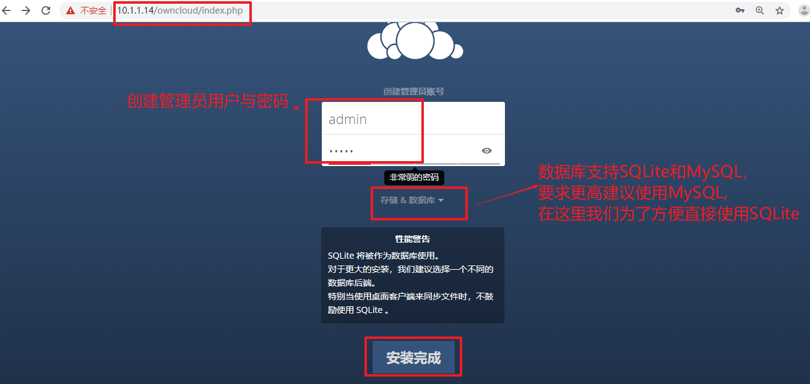


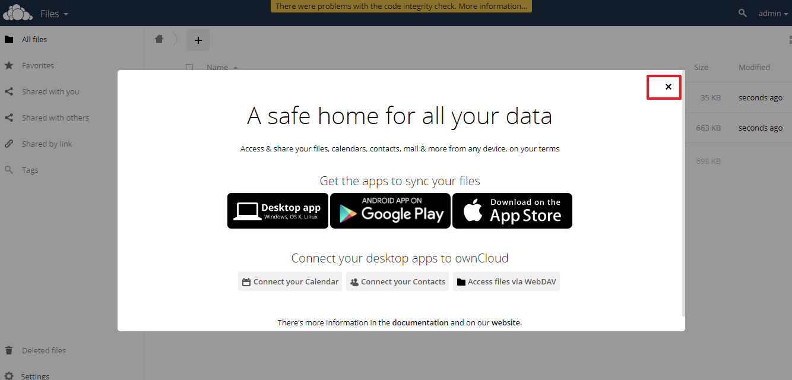


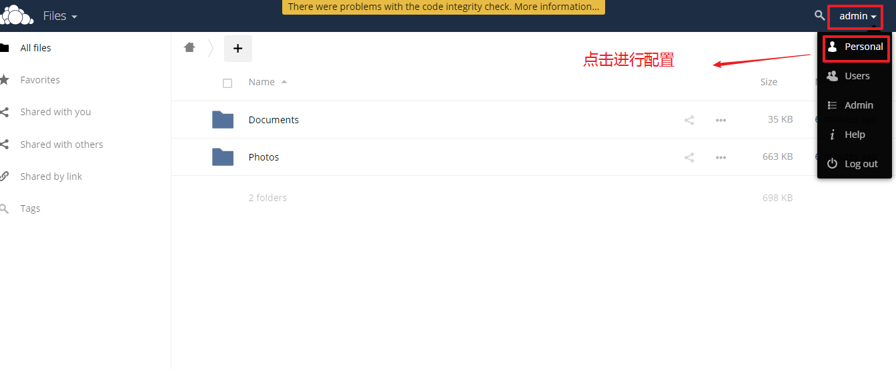


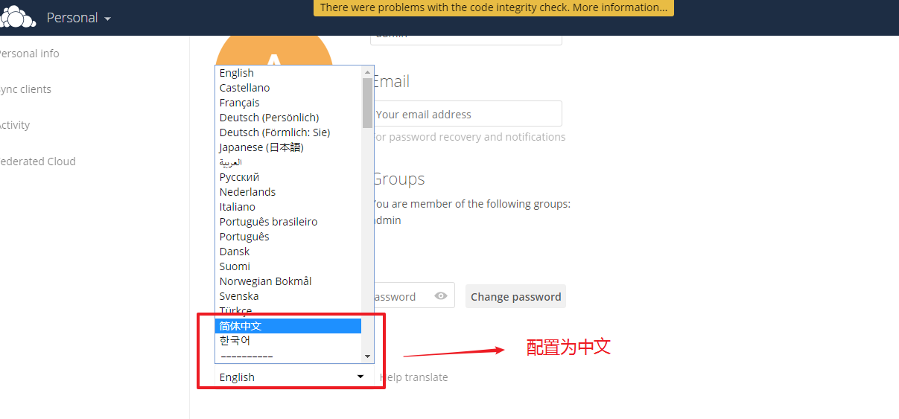


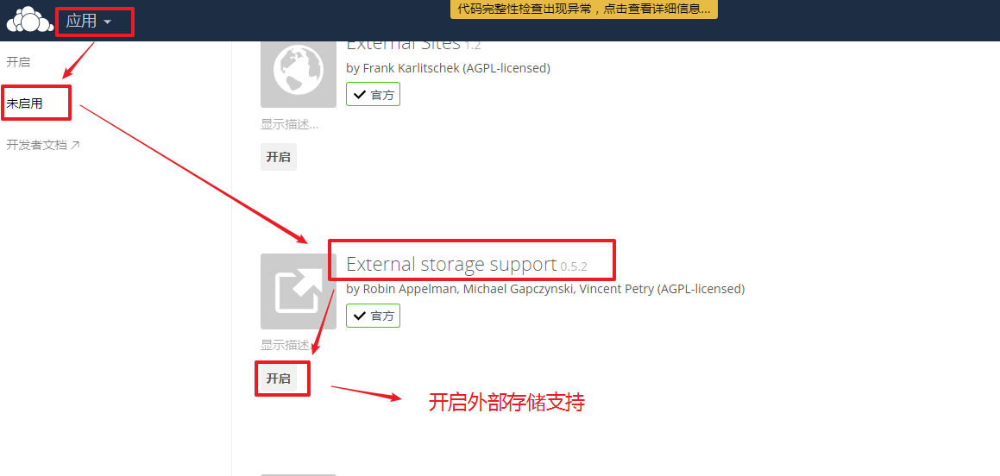


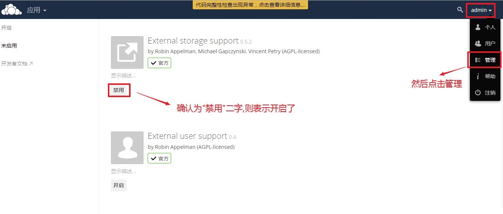


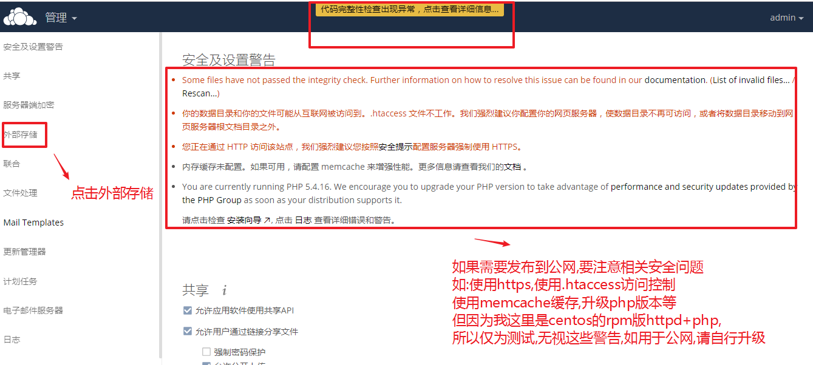

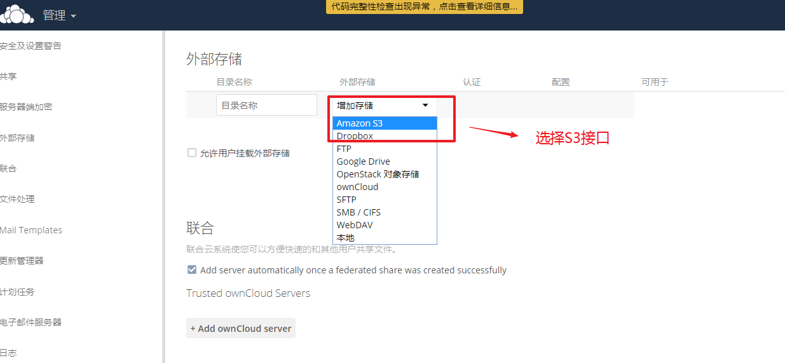

<font style="color:rgb(51, 51, 51);">10版本需要到应用市场下载 s3插件;</font>

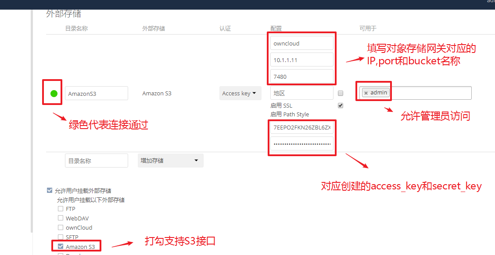

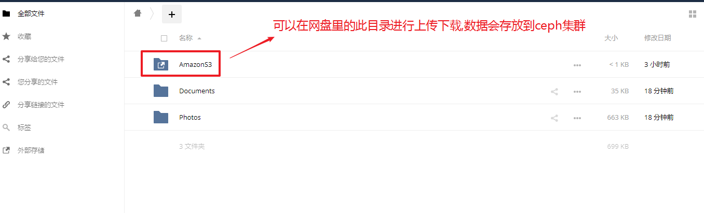


<font style="color:rgb(51, 51, 51);">5, 文件上传下载测试</font>

```bash
[root@client ~]# s3cmd put /etc/fstab s3://owncloud
upload: '/etc/fstab' -> 's3://owncloud/fstab'  [1 of 1]
 501 of 501   100% in    0s     6.64 kB/s  done
```

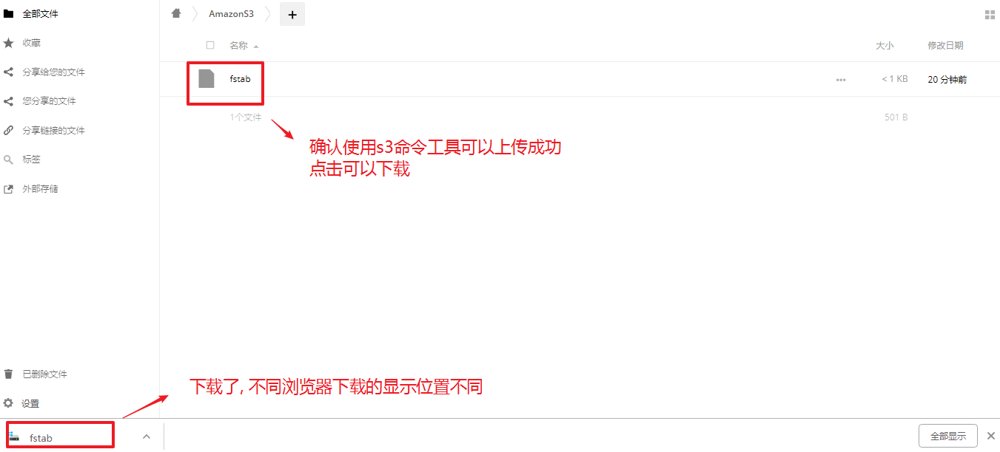


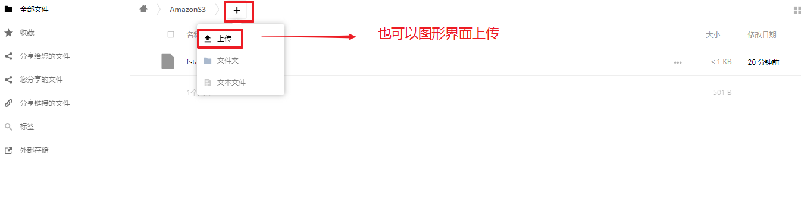

<font style="color:rgb(51, 51, 51);">因为默认owncloud上传文件有限制,不能超过2M。所以需要修改</font>

```bash
[root@client ~]# vim /var/www/html/owncloud/.htaccess

<IfModule mod_php5.c>
  php_value upload_max_filesize 2000M               修改调大
  php_value post_max_size 2000M                     修改调大


[root@client ~]# vim /etc/php.ini

post_max_size = 2000M                               修改调大        
upload_max_filesize = 2000M                         修改调大

[root@client ~]# systemctl restart httpd
```

<font style="color:rgb(51, 51, 51);"></font>

<font style="color:rgb(51, 51, 51);"></font>

<font style="color:rgb(51, 51, 51);"> 其他工具: seafile </font>

