# centos7虚拟机环境统一文档

## 创建虚拟机注意事项

### 内存大小


### 网络类型

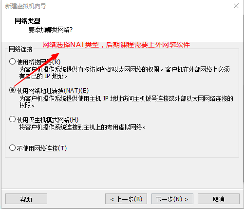

### 安装包选择

选包的话大家最好和我下面的一致（左边GNOME Desktop,右边全打勾)

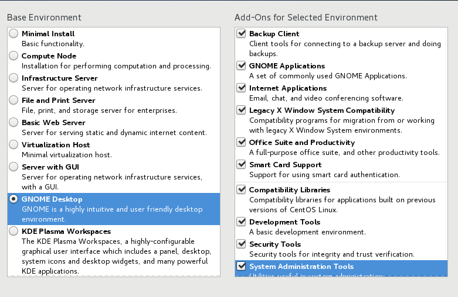

### 分区规划

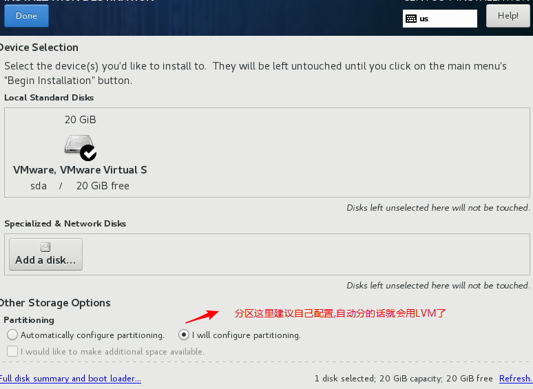

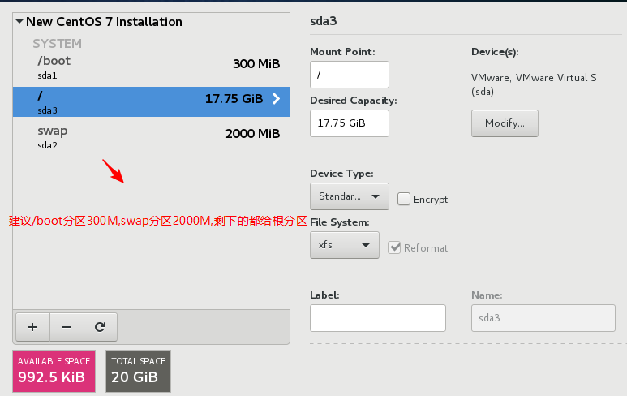

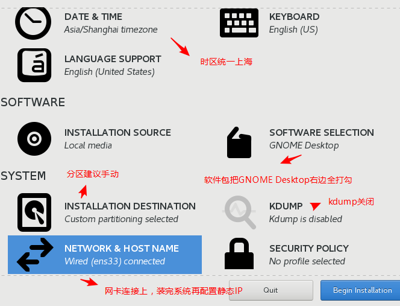

## 安装完成后注意事项

### 网络配置

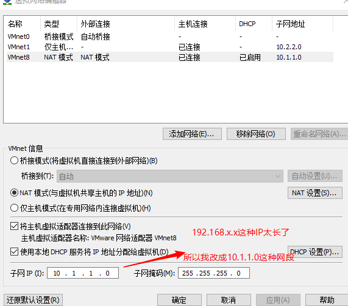

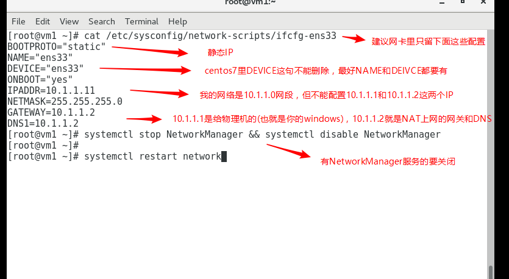

### 关闭selinux

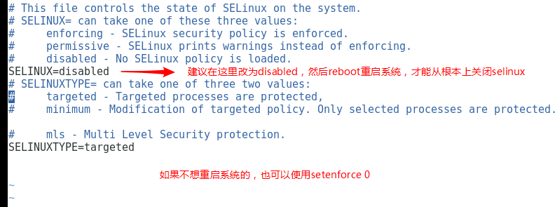

### 主机名配置与关闭防火墙

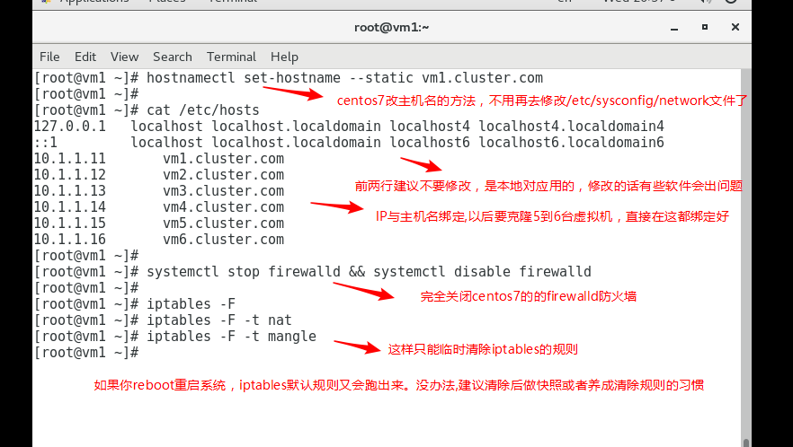

### yum源保持默认

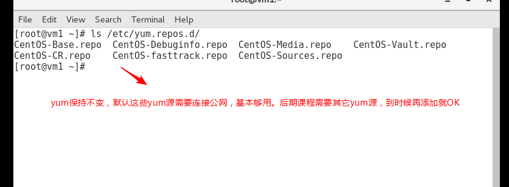

```bash
# yum clean all
# yum makecache
```

### 时间同步

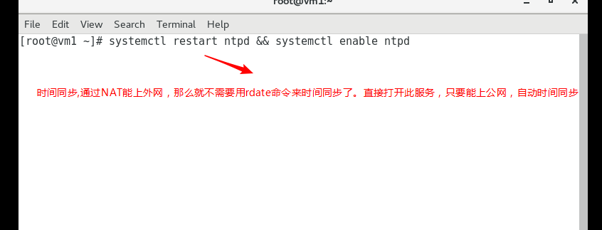

### 开机启动级别设置

```bash
# systemctl get-default         查看开机启动级别
graphical.target                相当于为5级别

# systemctl set-default multi-user.target       设置为
multi-user.target(相当于3级别)

# systemctl get-default
multi-user.target               确认开机启动级别为multi-
user.target(相当于3级别)
```

### 重启系统

selinux关闭后需要reboot才能生效,验证开机启动级别也需要reboot

```bash
# reboot
```

## 验证

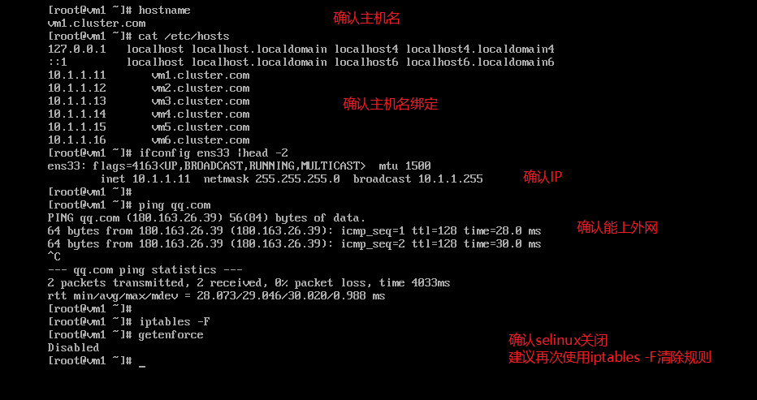

## 快照

上面都做好后，就可以做一个快照了

## 克隆

然后将这个虚拟机克隆5个, 克隆后的虚拟机，需要做如下修改

- 修改IP

- 修改对应的主机名

- 再次iptables -F 清除防火墙规则

再次做快照(因为克隆是不克隆快照的)

这样, 一共准备了6台完美快照虚拟机，大功告成。以后不用麻烦准备环境了。
