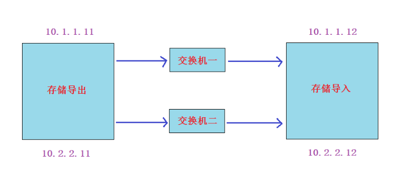

# <font style="color:rgb(51, 51, 51);">  
SAN</font>
## <font style="color:rgb(51, 51, 51);">SAN的分类</font>
<font style="color:rgb(51, 51, 51);">两种SAN:</font>

1. **<font style="color:rgb(51, 51, 51);">FC-SAN</font>**<font style="color:rgb(51, 51, 51);">: 早期的SAN, 服务器与交换机的数据传输是通过光纤进行的, 服务器把SCSI指令传输到存储设备上，不能走普通LAN网的IP协议。</font>
2. **<font style="color:rgb(51, 51, 51);">IP-SAN</font>**<font style="color:rgb(51, 51, 51);">: 用IP协议封装的SAN, 可以完全走普通网络,因此叫做IP-SAN, 最典型的就是ISCSI。</font>

<font style="color:rgb(51, 51, 51);">FC-SAN优缺点: 速度快(2G,8G,16G), 成本高, 传输距离有一定限制。</font>

<font style="color:rgb(51, 51, 51);">IP-SAN优缺点: 速度较慢(已经有W兆以太网标准), 成本低, 传输距离无限制。</font>

## <font style="color:rgb(51, 51, 51);">IP-SAN之iscsi实现</font>
**<font style="color:rgb(51, 51, 51);">实验: Linux平台通过iscsi实现IP-SAN</font>**

**<font style="color:rgb(51, 51, 51);">实验准备: 两台虚拟机（centos7平台)同网段（比如vmnet8), 交换机不用模拟,因为同网段的虚拟机就相当于连在同一个交换机上</font>**


1. <font style="color:rgb(51, 51, 51);">静态IP,（两台IP互通就行,网关和DNS不做要求）</font>
2. <font style="color:rgb(51, 51, 51);">都配置主机名及其主机名互相绑定</font>
3. <font style="color:rgb(51, 51, 51);">关闭防火墙,selinux</font>
4. <font style="color:rgb(51, 51, 51);">时间同步</font>
5. <font style="color:rgb(51, 51, 51);">配置好yum(需要加上epel源)</font>
6. <font style="color:rgb(51, 51, 51);">在存储导出端模拟存储（模拟存储可以使用多种形式,如硬盘:/dev/sdb,分区:/dev/sdb1,软raid:/dev/md0,逻辑卷:/dev/vg/lv01,dd创建的大文件等等)</font>

```bash
下面我为了实验方便，就用dd的大文件来模拟存储
export# mkdir /data/
export# dd if=/dev/zero of=/data/storage1 bs=1M count=500
export# dd if=/dev/zero of=/data/storage2 bs=1M count=1000
export# dd if=/dev/zero of=/data/storage3 bs=1M count=1500
export# dd if=/dev/zero of=/data/storage4 bs=1M count=2000
一个模拟了4个存储文件用来导出（大小不一样，是为了后续讨论)
```

**<font style="color:rgb(51, 51, 51);">实验步骤:</font>**

1. <font style="color:rgb(51, 51, 51);">export导出端安装软件, 配置导出的存储，启动服务</font>
2. <font style="color:rgb(51, 51, 51);">import导入端安装软件, 导入存储，启动服务</font>

**<font style="color:rgb(51, 51, 51);">实验过程:</font>**

**<font style="color:rgb(51, 51, 51);">第1步: 在导出端上安装iscsi-target-utils软件包</font>**

```bash
export# yum install epel-release -y       没有安装epel源的,再次确认安装
export# yum install scsi-target-utils -y
```

**<font style="color:rgb(51, 51, 51);">第2步: 在导出端配置存储的导出</font>**

```bash
export# cat /etc/tgt/targets.conf |grep -v "#"

default-driver iscsi

<target iscsi:data1>
        backing-store /data/storage1
</target>

<target iscsi:data2>
        backing-store /data/storage2
</target>

<target iscsi:data3>
        backing-store /data/storage3
</target>

<target iscsi:data4>
        backing-store /data/storage4
</target>
```

**<font style="color:rgb(51, 51, 51);">第3步: 导出端启动服务并验证</font>**

```bash
export# systemctl start tgtd
export# systemctl enable tgtd
验证端口和共享资源是否ok
export# lsof -i:3260
export# tgt-admin --show
```

**<font style="color:rgb(51, 51, 51);">第4步: 导入端安装iscsi-initiator-utils软件包</font>**

import# yum install iscsi-initiator-utils

**<font style="color:rgb(51, 51, 51);">第5步: 导入端导入存储</font>**

<font style="color:rgb(51, 51, 51);">在登录前必须要先连接并发现资源(discovery)</font>

```bash
import# iscsiadm -m discovery -t sendtargets -p 10.1.1.11
10.1.1.11:3260,1 iscsi:data1
10.1.1.11:3260,1 iscsi:data2
10.1.1.11:3260,1 iscsi:data3
10.1.1.11:3260,1 iscsi:data4
```

<font style="color:rgb(51, 51, 51);">发现资源成功后，就可以进行资源登录了</font>

```bash
只登录其中一个存储:
import# iscsiadm -m node -T iscsi:data1 -p 10.1.1.11 -l
直接登录所有发现的存储:
import# iscsiadm -m node -l
```

<font style="color:rgb(51, 51, 51);">登录成功后，直接使用fdisk -l查看</font>

import# fdisk -l |grep sd[b-z]

**<font style="color:rgb(51, 51, 51);">第6步: import端启动服务</font>**

```bash
启动服务，并做成开机自启动
import# systemctl start iscsi
import# systemctl enable iscsi

import# systemctl start iscsid
import# systemctl enable iscsid
```

**<font style="color:rgb(51, 51, 51);">补充: 关于取消连接的操作</font>**

```bash
取消登录其中一个特定目录: 把-l改成-u
import# iscsiadm -m node -T iscsi:data1 -p 10.1.1.11 -u
取消登录所有目录:
import# iscsiadm -m node -u

如果要连discovery的信息也删除则使用--op delete命令
import# iscsiadm -m node -T iscsi:data1 -p 10.1.1.11 --op delete
删除所有登录过的目录信息：
import# iscsiadm -m node --op delete
```

<font style="color:rgb(51, 51, 51);">问题一: 重新登录几次,会发现什么?</font>

```bash
import# iscsiadm -m node -u &> /dev/null
import# iscsiadm -m node -l &> /dev/null
import# fdisk -l |grep sd[b-z]
```

<font style="color:rgb(51, 51, 51);">答: 会发现名字会混乱. 解决方法有udev和存储多路径。</font>

<font style="color:rgb(51, 51, 51);">问题二: 如果再加一个新的导入服务器，两个导入服务器导入同一个存储，然后格式化，挂载。能实现同读同写吗?</font>

<font style="color:rgb(51, 51, 51);">答: 不可以。</font>

**<font style="color:rgb(51, 51, 51);">课外拓展:</font>**<font style="color:rgb(51, 51, 51);"> 可以对导出的存储配置验证功能，导入端配置正确的用户名和密码才能登陆</font>

<font style="color:rgb(51, 51, 51);">只有两个地方不一样:</font>

1. <font style="color:rgb(51, 51, 51);">在导出端配置时加上用户名和密码验证功能</font>

```bash
<target iscsi:data1>
        backing-store /data/storage1
        incominguser daniel daniel123		验证功能，此用户自定义即可，与系统用户无关
</target>
```

1. <font style="color:rgb(51, 51, 51);">在导入端配置时需要多配置下面一步，对应导出端的用户名与密码</font>

```bash
如果export端有源被配置了验证功能，那么import端需要配置正确的用户名和密码才OK
CHAP (Challenge-Handshake Authentication Protocol) 挑战握手验证协议

import# vim /etc/iscsi/iscsid.conf 		
57 node.session.auth.authmethod = CHAP		
61 node.session.auth.username = daniel
62 node.session.auth.password = daniel123

71 discovery.sendtargets.auth.authmethod = CHAP
75 discovery.sendtargets.auth.username = daniel
76 discovery.sendtargets.auth.password = daniel123
做完这一步后, 就可以发现资源并登录了
```

# <font style="color:rgb(51, 51, 51);">存储多路径</font>
<font style="color:rgb(51, 51, 51);">存储多路径（device-multipath）: 相当于存储线路的双线路绑定,做HA或LB。</font>

<font style="color:rgb(51, 51, 51);">作用:</font>

1. <font style="color:rgb(51, 51, 51);">双存储线路HA</font>
2. <font style="color:rgb(51, 51, 51);">双存储线路LB</font>
3. <font style="color:rgb(51, 51, 51);">可以自定义绑定后的设备名称，达到固定iscsi设备名称的目的。</font>




## **<font style="color:rgb(51, 51, 51);">实验准备</font>**
1. <font style="color:rgb(51, 51, 51);">在前面实验的基础上,导出端和导入端各加一个网卡连接到一个新的网络上(</font>**<font style="color:rgb(51, 51, 51);">注意</font>**<font style="color:rgb(51, 51, 51);">:新的网段一定要用静态ip)。我这里为10.2.2.0/24网段</font>

```bash
vmnet8	 10.1.1.0/24
vmnet1	 10.2.2.0/24
```

1. <font style="color:rgb(51, 51, 51);">然后在存储导入端登出这四个存储，并删除相关信息</font>

```bash
import# iscsiadm -m node -u
import# iscsiadm -m node --op delete
```

## **<font style="color:rgb(51, 51, 51);">实验过程</font>**
**<font style="color:rgb(51, 51, 51);">第1步: 在存储导入端去发现导出端上的存储。分别使用导出端的==两个IP==去发现,然后将它们登录</font>**

```bash
import# iscsiadm -m discovery -t sendtargets -p 10.1.1.11
10.1.1.11:3260,1 iscsi:data1
10.1.1.11:3260,1 iscsi:data2
10.1.1.11:3260,1 iscsi:data3
10.1.1.11:3260,1 iscsi:data4
import# iscsiadm -m discovery -t sendtargets -p 10.2.2.11
10.2.2.11:3260,1 iscsi:data1
10.2.2.11:3260,1 iscsi:data2
10.2.2.11:3260,1 iscsi:data3
10.2.2.11:3260,1 iscsi:data4
```

<font style="color:rgb(51, 51, 51);">把发现的targets全部登录</font>

```bash
import# iscsiadm -m node -l

使用fdisk -l |grep sd[b-z]命令能查看到8个存储(但实际是4个存储，分别由两个网络线路去访问的)
```

**<font style="color:rgb(51, 51, 51);">第2步, 在存储导入端安装device-mapper-multipath的包</font>**

import# yum install device-mapper\* 

**<font style="color:rgb(51, 51, 51);">第3步, 把上面的8个进行多路径绑定，绑成4个(同一个存储两个线路访问的绑定成一个)</font>**

<font style="color:rgb(51, 51, 51);">先运行此命令，才会产生/etc/multipath.conf的配置文件</font>

import# mpathconf --enable

<font style="color:rgb(51, 51, 51);">配置/etc/multipath.conf配置文件</font>

```bash
import# cat /etc/multipath.conf |grep -v ^# |grep -v ^$
defaults {							看作为全局配置参数
	user_friendly_names yes			使用友好名字（默认名为wwid，名字长且难认，友好名可以自定义)
	find_multipaths yes
}
blacklist {							黑名单（表示所有在黑名单里的设备不会被绑定成多路径设备)
}

import# vim /etc/multipath.conf 
blacklist {
        devnode "^sda"				除了sda开头的设备，我都做多路径(指的就是那8个发现的设备)
}
```

<font style="color:rgb(51, 51, 51);">启动服务</font>

```bash
import# systemctl start  multipathd.service
import# systemctl enable multipathd.service
```

**<font style="color:rgb(51, 51, 51);">第4步: 查看当前绑定状态</font>**

<font style="color:rgb(51, 51, 51);">使用</font>`<font style="color:rgb(51, 51, 51);background-color:rgb(243, 244, 244);">multipath -ll</font>`<font style="color:rgb(51, 51, 51);">命令可以看到四个新绑定的设备了(mpatha,mpathb,mpathc,mpathd)这四个设备就是双线路绑定的设备</font>

`<font style="color:rgb(51, 51, 51);background-color:rgb(243, 244, 244);">/lib/udev/scsi_id --whitelisted --replace-whitespace --device=/dev/sda</font>`<font style="color:rgb(51, 51, 51);">命令可用来查看wwid</font>

```bash
import# multipath -ll
mpathd (360000000000000000e00000000040001) dm-3 IET  ,VIRTUAL-DISK 长数字字符串就是wwid  
size=2.0G features='0' hwhandler='0' wp=rw
|-+- policy='service-time 0' prio=1 status=active		主线路
| `- 8:0:0:1 sdf 8:80  active ready running
`-+- policy='service-time 0' prio=1 status=enabled		备线路（也就是说默认为主备HA模式)
  `- 9:0:0:1 sdh 8:112 active ready running
mpathc (360000000000000000e00000000030001) dm-2 IET     ,VIRTUAL-DISK    
size=1.5G features='0' hwhandler='0' wp=rw
|-+- policy='service-time 0' prio=1 status=active
| `- 6:0:0:1 sde 8:64  active ready running
`-+- policy='service-time 0' prio=1 status=enabled
  `- 7:0:0:1 sdg 8:96  active ready running
mpathb (360000000000000000e00000000020001) dm-1 IET     ,VIRTUAL-DISK    
size=1000M features='0' hwhandler='0' wp=rw
|-+- policy='service-time 0' prio=1 status=active
| `- 4:0:0:1 sdc 8:32  active ready running
`-+- policy='service-time 0' prio=1 status=enabled
  `- 5:0:0:1 sdd 8:48  active ready running
mpatha (360000000000000000e00000000010001) dm-0 IET     ,VIRTUAL-DISK    
size=500M features='0' hwhandler='0' wp=rw
|-+- policy='service-time 0' prio=1 status=active
| `- 2:0:0:1 sda 8:0   active ready running
`-+- policy='service-time 0' prio=1 status=enabled
  `- 3:0:0:1 sdb 8:16  active ready running
```

**<font style="color:rgb(51, 51, 51);">第5步: 下面我对这8个存储进行自定义绑定（把名字分别绑成data1,data2,这两个做成ha高可用模式；data3,data4这两个做成lb负载均衡模式)</font>**

```bash
import# cat /etc/multipath.conf  |grep -v ^# |grep -v ^$

defaults {
        user_friendly_names yes
		find_multipaths yes		
}


multipaths {
	multipath {
		wwid			360000000000000000e00000000010001　		wwid值
		alias			data1									自定义绑定的名字
		path_grouping_policy	failover  						HA模式
		failback		immediate 						主线路挂了再启起来后,会马上切换回来

	}
	multipath {
		wwid			360000000000000000e00000000020001
		alias			data2
		path_grouping_policy	failover
		failback		immediate
	}
	multipath {
		wwid			360000000000000000e00000000030001
		alias			data3
		path_grouping_policy	multibus						LB模式
		path_selector		"round-robin 0"	 					LB的算法为rr轮循
	}
	multipath {
		wwid			360000000000000000e00000000040001
		alias			data4
		path_grouping_policy	multibus
		path_selector		"round-robin 0"
	}
}
blacklist {
}
```

**<font style="color:rgb(51, 51, 51);">第6步: 重启服务，使自定义配置生效</font>**

```bash
import# systemctl restart multipathd.service 

查看验证，就绑定成了data1,data2,data3,data4这样的名称
import# multipath -ll

import# ls /dev/mapper/data*
/dev/mapper/data1  /dev/mapper/data2  /dev/mapper/data3  /dev/mapper/data4
```

**<font style="color:rgb(51, 51, 51);">第7步: 测试（测试过程省略，见授课视频)</font>**

```bash
将failover和multibus两种模式各选一个存储格式化（可以直接格式化，也可以先分区再格式化)，并挂载进行测试

/dev/mapper/data4如果分两个区,则名字对应为:/dev/mapper/data4p1,/dev/mapper/data4p2（如果分区后看不到，可以使用partprobe命令刷新一下)
```

```bash
centos7写到/etc/fstab里需要多加一个参数(_netdev)就可以成功自动挂载，写法如下

/dev/mapper/data4p1  /mnt  xfs  defaults,_netdev 0 0
```

