# day60 Zabbix 02（自定义监控深入）

> 昨日回顾：监控体系、单机监控、添加被监控主机、新增监控项/触发器/图形、模板、自定义监控、报警、拆分数据库等。系统自带监控项触发器阈值偏低，需按实际场景调整。

## 一、TCP 11 种状态

| 状态 | 含义 |
| --- | --- |
| LISTEN | 侦听来自远方 TCP 端口的连接请求 |
| SYN-SENT | 发送连接请求后等待匹配的连接请求 |
| SYN-RECEIVED | 收到并发送连接请求后等待确认 |
| ESTABLISHED | 已建立连接，可传送数据 |
| FIN-WAIT-1 | 等待远程 TCP 连接中断请求或确认 |
| FIN-WAIT-2 | 从远程 TCP 等待连接中断请求 |
| CLOSE-WAIT | 等待本地用户发来的连接中断请求 |
| CLOSING | 等待远程 TCP 对中断的确认 |
| LAST-ACK | 等待原来发向远程的中断请求确认 |
| TIME-WAIT | 等待足够时间确保远程收到中断确认 |
| CLOSED | 没有任何连接状态 |

---

## 二、创建模板并添加 11 种 TCP 状态监控

### 1. 自定义监控项细节
配置 → 主机 → 创建监控项（逐项讲解参数作用）。监测中 → 最新数据 可筛选查看。

### 2. 自定义 TCP 11 种状态（传参方式）
```bash
# agent 端：/etc/zabbix/zabbix_agentd.d/tcp.conf
UserParameter=tcp[*],ss -an|awk '{print $2}'|grep -i "$1"|wc -l
systemctl restart zabbix-agent

# agent 本地验证
zabbix_agentd -p

# server 端取值
zabbix_get -s 172.16.1.7 -k tcp[estb]
# 0
```

创建流程（Web）：
1. 配置 → 模板 → 创建模板
   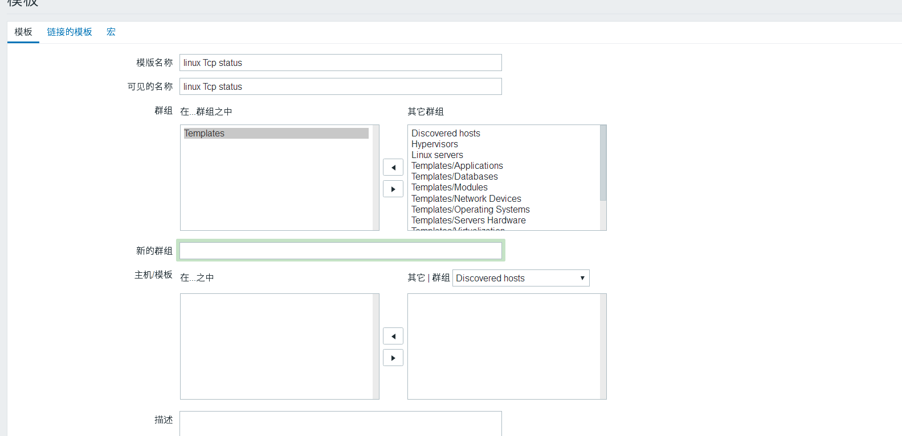
   
2. 点模板的「监控项」→ 添加 TCP 11 种状态监控项（第二个用克隆前一个）
   
   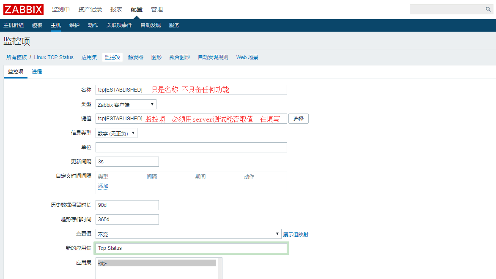
   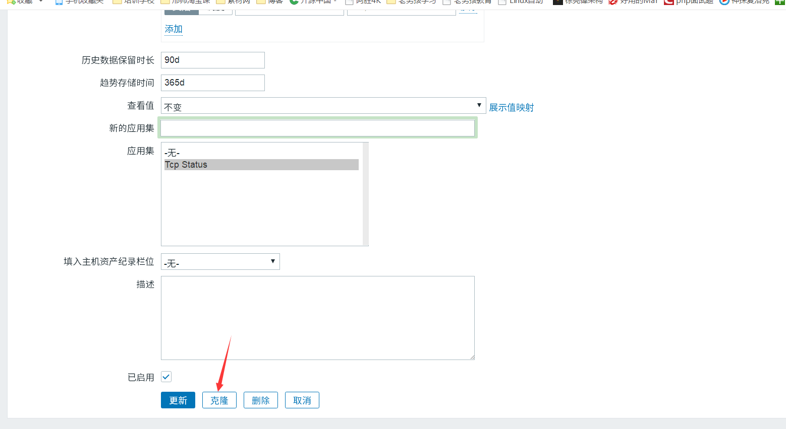
   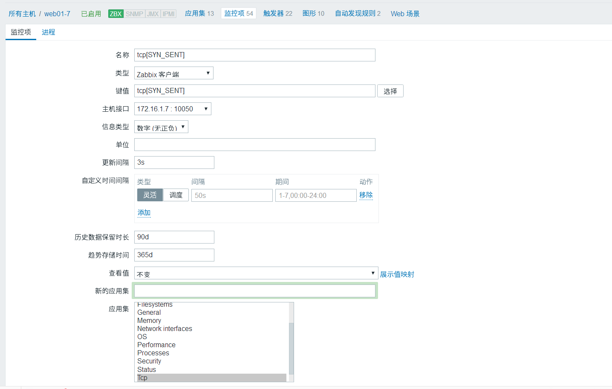
3. 配置 → 主机 → 图形 → 创建图形
   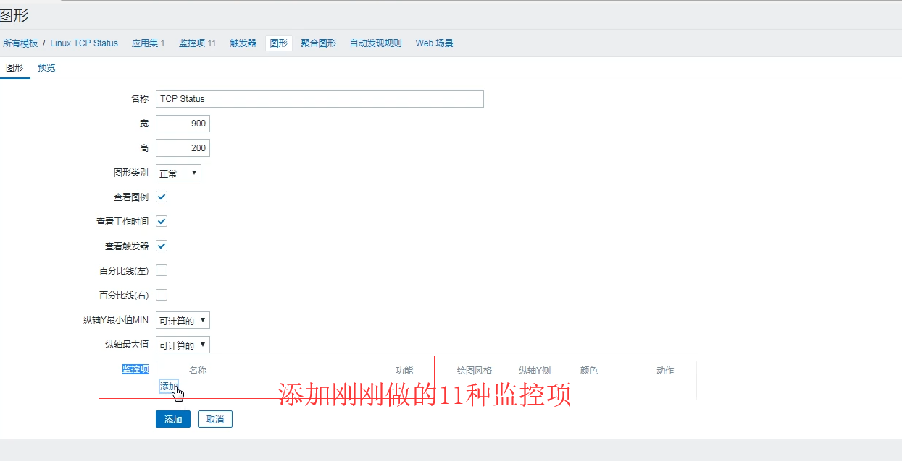
4. 主机 → 模板 → 链接指示器 → 填刚创建的模板 → 更新
   
   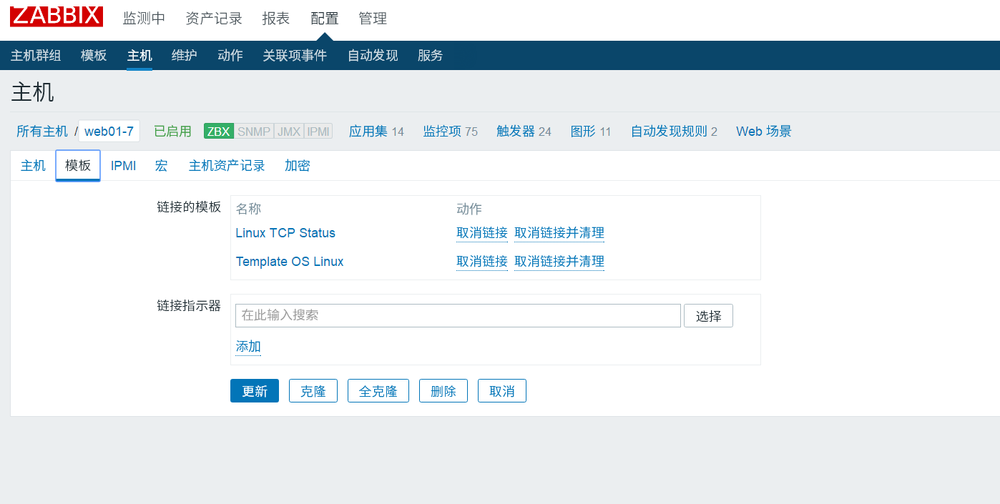
5. 查看主机监控项/触发器/图形变多了；最新数据筛选 `tcp status` 查看
   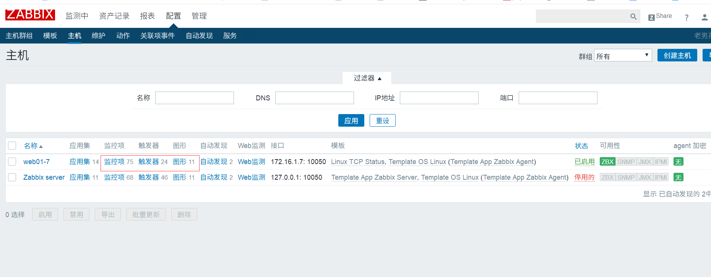
   
6. 导出模板供其他地方复用（模板 + `/etc/zabbix/zabbix_agentd.d/*.conf` 都要带）
   
7. 监测中 → 图形 查看
   

**小结**
1. agent 写 `UserParameter=tcp[*],ss -an|awk ...|grep -i "$1"|wc -l`
2. server 用 `zabbix_get -s IP -k tcp[estb]` 取值
3. Web 添加监控项、做图形、关联模板
4. 自定义监控项、面板可填项、自带监控项、传参方式（`tcp[estab]`、`system.uname`）

---

## 三、给模板添加触发器

配置 → 模板 → 触发器 → 创建。


**压测验证**（用 ab 打流量）
```bash
server {
  listen 80;
  server_name node.oldboy.com;
  location / {
    root /node;
    index index.html;
  }
}
echo '127.0.0.0.1 node.oldboy.com' > /etc/hosts
echo 'web01..' > /node/index.html
ab -n1000 -c200 http://node.oldboy.com;
# Web 面板出现相应报警
```

### 自定义内存百分比触发器（单/多条件）
```bash
# 1. 取可用内存百分比
free -m |awk '/^Mem/{print $NF/$2*100}'

# 2. agent 自定义监控项
cd /etc/zabbix/zabbix_agentd.d/
vim mem.conf
UserParameter=Mem_Num,free -m |awk '/^Mem/{print $NF/$2*100}'
systemctl restart zabbix-agent

# 3. agent 本地验证
zabbix_agentd -p|grep -i Mem_Num
# Mem_Num  [t|38.501]

# 4. server 端验证
zabbix_get -s 172.16.1.7 -k Mem_Num
# 38.7064

# 5. Web 添加监控项 → 监测中 → 最新数据
```


**触发器规则**
- 单条件：内存剩余 < 30% 触发
- 多条件：内存剩余 < 30% **并且** swap 使用 > 1%（防止误报，避免 agent 自定义项被转成不支持，调大超时）：
```bash
vim /etc/zabbix/zabbix_agentd.conf
Timeout=30
systemctl restart zabbix-agent

# 两个监控项
UserParameter=Mem_Num,free -m |awk '/^Mem/{print $NF/$2*100}'
UserParameter=Swap_Num,free -m|awk '/^Swap/{print $3/$2*100}'
```
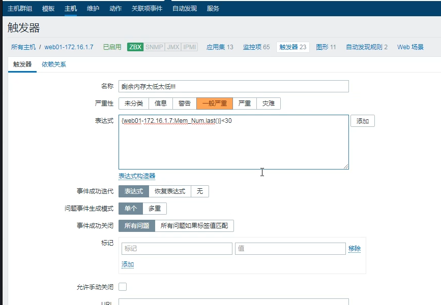


---

## 四、自定义报警内容

[定制报警内容官方文档](https://www.zabbix.com/documentation/3.4/zh/manual/appendix/macros/supported_by_location)

1. 配置 → 动作 → 事件源 → 触发器
   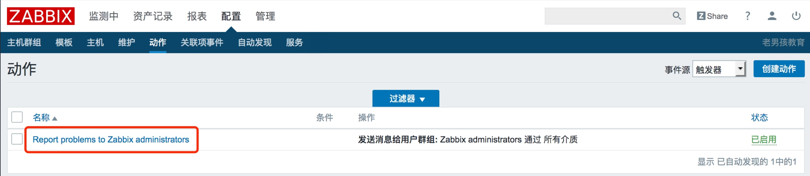
2. 故障报警邮件内容：
   > 报警主机：{HOST.NAME1} 报警服务: {ITEM.NAME1} 报警Key1: {ITEM.KEY1}：{ITEM.VALUE1} 报警Key2: {ITEM.KEY2}：{ITEM.VALUE2} 严重级别: {TRIGGER.SEVERITY}
   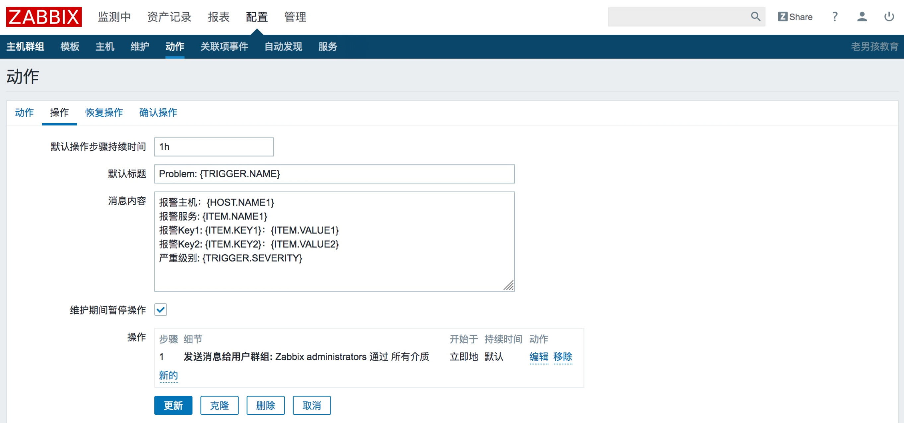
3. 恢复报警邮件内容：
   > 恢复主机：{HOST.NAME1} 恢复服务： {ITEM.NAME1} 恢复Key1：{ITEM.KEY1}：{ITEM.VALUE1} 恢复Key2: {ITEM.KEY2}：{ITEM.VALUE2}
4. 最终告警效果
   

---

## 五、常用触发器表达式 / 函数

| 函数 | 作用 |
| --- | --- |
| `and` / `or` | 并且 / 或者 |
| `last()` | 比对最新值 |
| `avg(5m)` | 最近 5 分钟平均值（避免波动误报） |
| `avg(5)` | 最后 5 秒平均值 |
| `avg(#5)` | 最近 5 次取值平均值 |
| `diff()` | 比对上一次文件内容 |
| `nodata(5m)` | 超过 5 分钟收不到数据则报警 |

参考：<https://www.cnblogs.com/dadonggg/p/8566443.html>

**告警方式**
- 邮件（必须会）、微信（一般）、短信、电话、钉钉
- 告警动作：发送消息 / 执行远程命令（可用于**自动化扩容缩容**）
  - 例：CPU 负载持续 80% → 执行命令创建虚拟机、装服务、加集群（扩容）
  - 例：CPU 持续 5% → 判断后端节点数 → 超阈值释放 2 台（缩容）
- 告警升级：步骤持续 1 小时 → ① 运维组 10m → ② 经理 10m → ③ 总监；可按不同主机发给不同人。

---

## 六、Zabbix 微信报警

```bash
# 1. 准备微信报警脚本（相当于配置好发件人）
yum install python-pip -y
pip install requests
cd /usr/lib/zabbix/alertscripts
rz        # 上传 weixin.py
chmod +x weixin.py
./weixin.py  WeiXinID  Subject  Messages
rm -f /tmp/weixin.log
# 变量：{ALERT.SENDTO} 发给谁 / {ALERT.SUBJECT} 主题 / {ALERT.MESSAGE} 内容

# 2. 收件人：用户基本资料 → 报警媒介 添加企业微信微信号
# 3. 配置 → 动作（操作、日志信息、告警升级）

# weixin.py 中需修改：
corpid='ww463574332468c121'          # 我的企业 → 最下面的企业ID
appsecret='5_Qgn_z5MufUZ8sxVsaXNKjhp9R2OspHvy5O9bMKbtE'   # 自建应用 secret
agentid=1000003                      # 自建应用 agentid
```

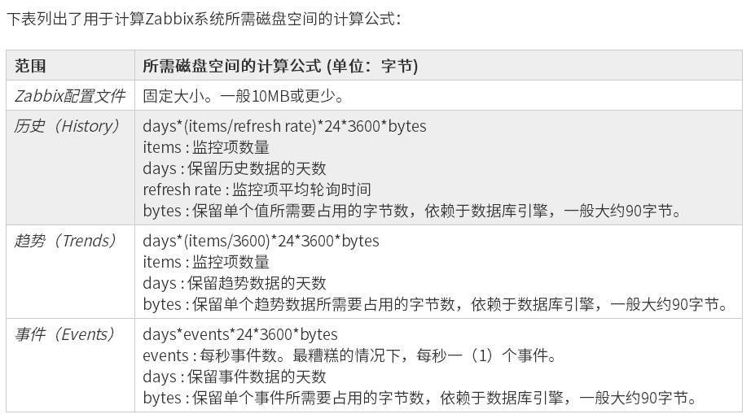

---

## 七、数据库空间与运维技巧

**计算历史数据保存 90 天占用的磁盘空间**
```bash
echo 90*(100/30)*24*3600|bc        # → 23328000
echo 90*(100/30)*24*3600/1024|bc   # → 22781 (KB)
echo 90*(100/30)*24*3600/1024/1024|bc  # → 22 (MB)
```

**重新加载配置（不重启）**
```bash
zabbix_server -R config_cache_reload
```

**压测内存 / swap 开关**
```bash
dd if=/dev/zero of=/opt/1.txt bs=400M count=20    # 压内存
swapon -a     # 开启 swap
swapoff -a    # 关闭 swap
```

---

## 常见面试题

1. **Zabbix 自定义监控项怎么传参？**
   用 `UserParameter=key[*],command $1`，server 端用 `zabbix_get -s IP -k key[arg]` 取值。

2. **单条件触发器与多条件触发器区别？**
   单条件：`{主机:项.last()}>阈值`；多条件用 `and`/`or` 组合多个监控项，如内存低且 swap 高才报警。

3. **触发器常用函数有哪些？**
   `last()`（最新值）、`avg(5m)`（平均防抖）、`nodata(5m)`（无数据报警）、`diff()`（比对变化）。

4. **如何防止自定义监控项被标记为"不支持"？**
   调大 agent 超时：`Timeout=30`（zabbix_agentd.conf）并重启 agent。

5. **Zabbix 告警升级怎么配？**
   动作里配步骤：运维 10m → 经理 10m → 总监，持续 1 小时；可按主机分组发给不同人。

6. **Zabbix 微信报警脚本放哪？需要什么？**
   放 `/usr/lib/zabbix/alertscripts/`，需企业微信 corpid、appsecret、agentid，脚本用 `{ALERT.SENDTO/SUBJECT/MESSAGE}` 宏。

7. **执行远程命令能做什么？**
   触发阈值时可自动执行命令，实现自动扩容（建 VM+加集群）或缩容（释放节点）。

---

> 更新：2019-01-12 21:26:49
> 原文：<https://www.yuque.com/chengkanghua/oldboy50/yi2du7>
