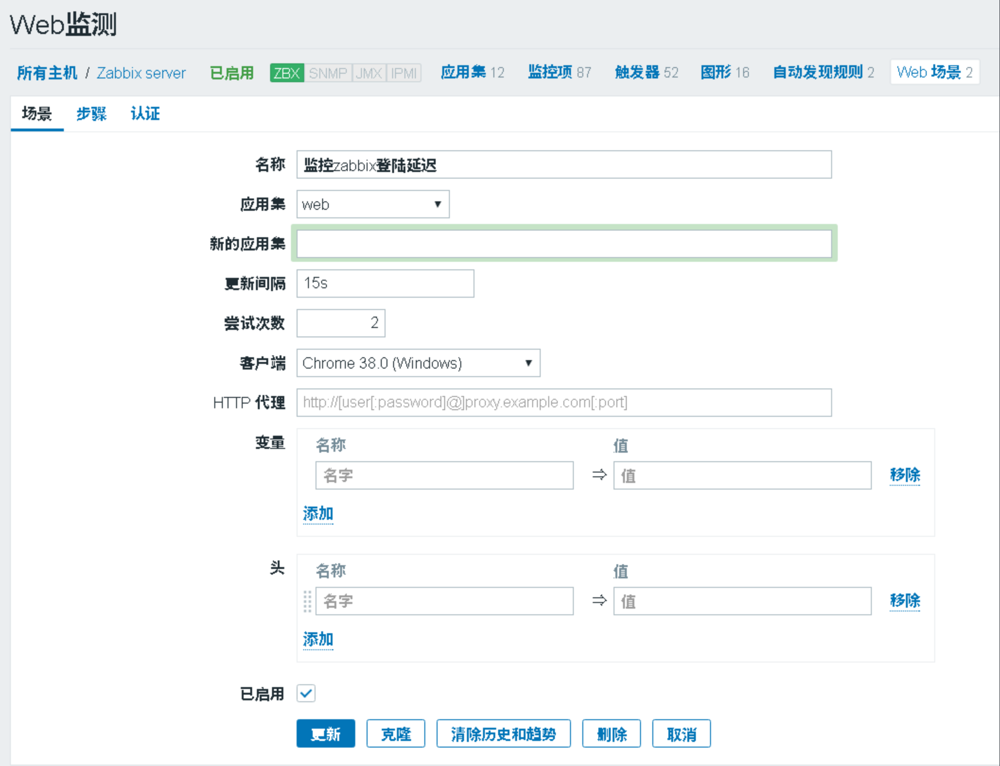
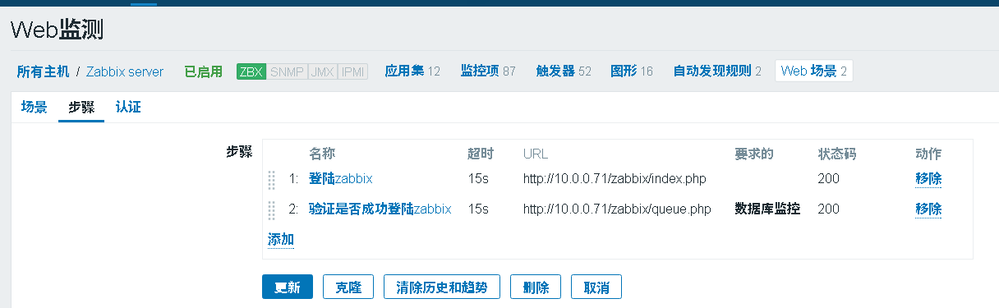
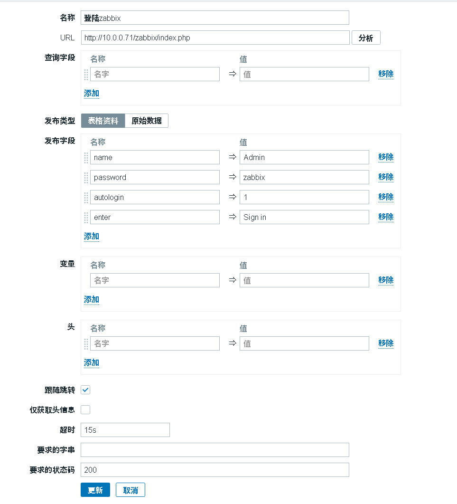
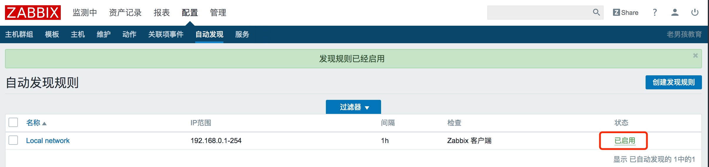
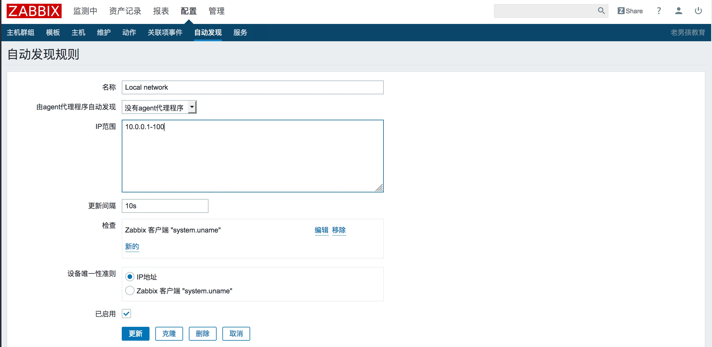
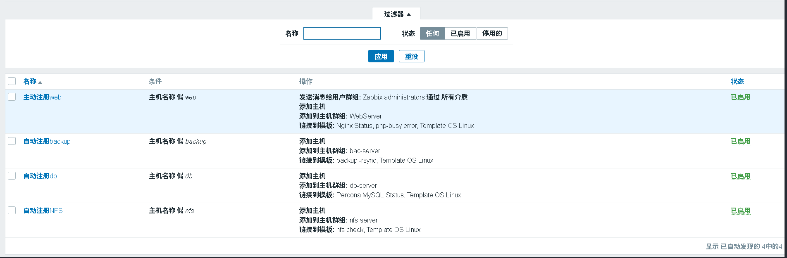
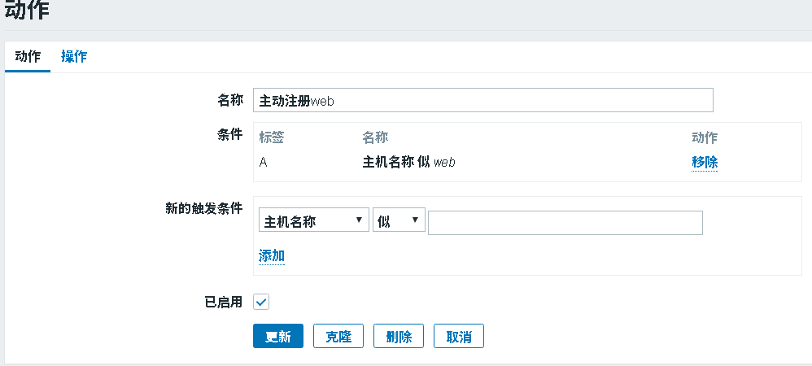

# day63 Zabbix 05（Web 监控、自动发现、自动注册、主被动模式）

## 一、Zabbix 架构回顾

- **基础架构**：agent 采集 → server 分析与报警 → 数据存 DB → web 展示。
- **监控方式**：agent（最常用）、SNMP（路由器/交换机）、IPMI（硬件）、SSH/Telnet（无法装 agent 时）、JMX（Java/JVM）。
- **资源对象**：监控项 → 应用集 → 触发器 → 动作 → 图形/聚合/幻灯片 → 模板。

---

## 二、Web 场景监测

### 1. 静态 vs 动态网站
- **静态网站**：服务端源码 = 客户端源码。
- **动态网站**：如 `<?php phpinfo()?>`，每次访问时 HTML 在内存中动态生成，支持登录与用户交互。交互靠 **Session（服务端）+ Cookie（客户端）**：服务端分配 `sessionID`，客户端存到 cookie，再次访问携带校验。

### 2. curl 模拟登录网站
```bash
# 先访问产生 cookie
curl http://10.0.0.71/zabbix/index.php
# 带账号密码登录（-L 跟踪跳转，c/b 读写 cookie）
curl -L -c cook -b cook -d 'name=Admin&password=zabbix&autologin=1&enter=Sign+in' 'http://10.0.0.71/zabbix/index.php'
# 登录后获取页面
curl -L -c cook -b cook 'http://10.0.0.71/zabbix/queue.php?config=0' > test.html
# 退出
curl -L -c cook -b cook -d 'sid=47939085e49beb00' 'http://10.0.0.30/zabbix/index.php?reconnect=1'
```

### 3. Web 界面添加 Web 监测
配置 → 主机 → Web 监测 → 创建场景（填 URL、POST 账号密码、登录后验证、退出步骤）→ 监测中 → Web 监测 查看结果。





---

## 三、Zabbix 自动化监控

### 1. 自动发现（被动，server 找 agent）

> 官方手册：<https://www.zabbix.com/documentation/3.4/zh/manual/discovery/network_discovery>

Zabbix 周期性扫描定义的 IP 范围，基于 IP 范围、外部服务（FTP/SSH/WEB/POP3/IMAP/TCP）、agent 信息、SNMP 信息来发现。由**发现（discovery）+ 动作（actions）** 两阶段组成。

**发现事件**
| 事件 | 条件 |
| --- | --- |
| Service Discovered | 服务首次被发现 / 由 down 变 up |
| Service Up | 服务持续 up |
| Service Lost | 服务由 up 变 down |
| Service Down | 服务持续 down |
| Host Discovered | 所有服务 down 后至少一个 up |
| Host Up | 至少一个服务 up |
| Host Lost | 所有服务 up 之后全部 down |
| Host Down | 所有服务持续 down |

**动作**（基于发现事件）：发送通知、添加/删除主机、启用/禁用主机、加/移主机组、链接/取消模板、执行远程命令。

**配置步骤**
1. 配置 → 自动发现 → 启动默认 Local network（或新建规则，指定 IP 范围、检查项、频次）。
    
2. 配置 → 动作 → 事件源选「自动发现」→ 启用动作。
    
3. 操作细节（标题/消息用宏，操作动作为「添加主机 + 加组 + 链接模板 + 发邮件」）。
   
4. 主机被扫描加入（如 web03）。
   

**自动发现的弊端**
1. 会让 zabbix-server 的自动发现进程非常繁忙；
2. 扫描过程中可能丢机器；
3. 某台卡住会降低后续扫描效率；
4. 规定时间内扫不完，后续机器本轮不检查，直接开始下一轮。

新增一台全新主机：
```bash
rpm -ivh https://mirrors.aliyun.com/zabbix/zabbix/3.4/rhel/7/x86_64/zabbix-agent-3.4.12-1.el7.x86_64.rpm
grep "^Server" /etc/zabbix/zabbix_agentd.conf
# Server=172.16.1.71
systemctl restart zabbix-agent
```

### 2. 自动注册（主动，agent 找 server）

> 官方手册：<https://www.zabbix.com/documentation/3.4/zh/manual/discovery/auto_registration>

agent 上线后主动通知 server，server 按动作添加主机+模板，无需手动配置。

```bash
# 1. agent 指向 server（关键：ServerActive）
vim /etc/zabbix/zabbix_agentd.conf
Server=172.16.1.71
ServerActive=172.16.1.71
# Hostname=web03      # 不写则用系统 hostname
systemctl restart zabbix-agent
```
> 不指定 Hostname 时，server 用 agent 系统主机名命名。

2. 配置 → 动作 → 事件源选「自动注册」→ 创建操作。
    
    
3. 等待自动注册、等待邮件通知。
    

**按主机名区分模板**（示例）
- 名称：web 服务主机自动注册，主机名似 `web` → 链接 `Template Nginx Status`
- 名称：db 服务主机自动注册，主机名似 `db` → 链接 `Template DB MySQL`
- 无法用主机名区分时，用「主机元数据（Host metadata）」区分（见官方文档）。

### 3. 主动/被动模式区别（相对 agent）

| 维度 | 被动模式（默认） | 主动模式 |
| --- | --- | --- |
| 谁发起 | server 轮询 agent | agent 主动上报 server |
| 配置项 | `Server` | `ServerActive` |
| 100 个监控项 | 需要 100 个回合 | 1 个回合（server 发清单，agent 一次性回传） |
| 适用 | 机器少 | 机器 >300、Queue 延迟大、监控项多、自动注册 |

**调整为主动模式**
```bash
vim /etc/zabbix/zabbix_agentd.conf
ServerActive=172.16.1.71
Hostname=web02      # 建议填写
systemctl restart zabbix-agent
```
Web 端：全克隆被动模板 → 改名 → 把监控项改为主动（类型选 Zabbix agent (active)）→ 主机先取消被动模板链接并清理，再链接主动模板。

**示例配置**
```bash
# web02
grep -Ev '^$|#' /etc/zabbix/zabbix_agentd.conf
Server=172.16.1.71
ServerActive=172.16.1.71
Hostname=web02

# db01
grep -Ev '^$|#' /etc/zabbix/zabbix_agentd.conf
Server=172.16.1.71
ServerActive=172.16.1.71
Hostname=db01
```
按主机名调用不同模板：web → linux_temp/tcp/nginx/php；db → linux_temp/tcp/mysql；nfs → linux_temp/tcp/nfs。

> 主机名规范示例：`al-bj-shop-nginx-web01-nginx_php`（地区-业务-集群-节点-服务-IP）。
> 用 Ansible / SaltStack 的 Jinja 模板批量设置 Hostname：
> `ssh root@172.16.1.8 'ho=$(hostname);sed -i "/^Hostname=/c Hostname=$ho" /etc/zabbix/zabbix_agentd.conf'`

---

## 四、小结

**Zabbix 内部资源**
监控项 → 应用集 → 触发器 → 动作（发消息：邮件/微信/钉钉/电话/短信；执行命令）→ 图形/聚合/幻灯片 → 模板。

**监控主机手段**
ZabbixAgent（常用）、SSH（不能装客户端）、SNMP（路由交换）、IPMI（硬件）、JMX（Java/JVM）。

**Web 监控**
cookie 与 session 知识；用 curl 登录网站；Web 界面加 POST 场景（登录 → 验证 → 退出）。

**自动化监控**
- 自动发现（server 找小弟）：server 轮询 agent；弊端——丢机器、server 压力大、效率低。
- 自动注册（小弟找大哥）：基于主动模式；效率高；可按主机名/元数据用不同模板。

**主被动模式（相对 agent）**
- `Server`（被动）/`ServerActive`（主动）
- 被动：机少、100 项要 100 次获取；主动：机多、项多、频繁、自动注册，100 项只需 1 次交互。

---

## 常见面试题

1. **自动发现和自动注册的区别？**
   自动发现是 server 被动扫描 IP 范围找 agent（易丢机器、server 压力大）；自动注册是 agent 主动上报给 server（效率高，适合大规模、配合主动模式）。

2. **什么时候用主动模式？**
   主机超过 300 台、Queue 有延迟、监控项多、抓取频繁，或要做自动注册时。

3. **主动模式的配置要点？**
   agent 配 `ServerActive=serverIP`（并建议写 Hostname）；Web 端把被动模板全克隆改为主动类型，主机引用主动模板。

4. **Zabbix 有哪些监控方式？**
   agent、SNMP（网络设备）、IPMI（硬件）、SSH/Telnet（无 agent）、JMX（Java/JVM）。

5. **Web 监测怎么模拟登录？**
   用 curl 带 cookie（`-c/-b`）POST 账号密码登录，再带 cookie 访问验证登录成功的页面；Web 界面建场景（登录→验证→退出）。

6. **自动注册如何按主机类型关联不同模板？**
   用主机名（如含 web/db）或主机元数据（Host metadata）在动作里匹配，分别链接不同模板。

---

> 更新：2019-01-12 21:55:16
> 原文：<https://www.yuque.com/chengkanghua/oldboy50/cmqzcg>
