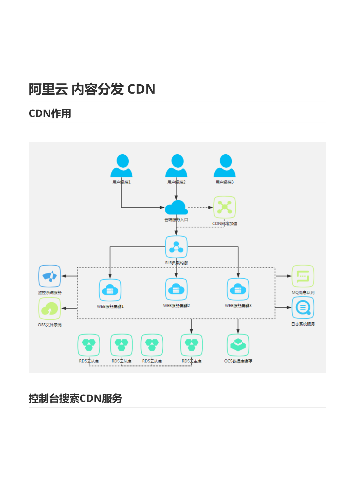
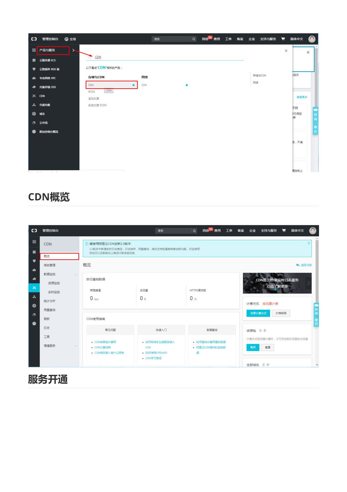
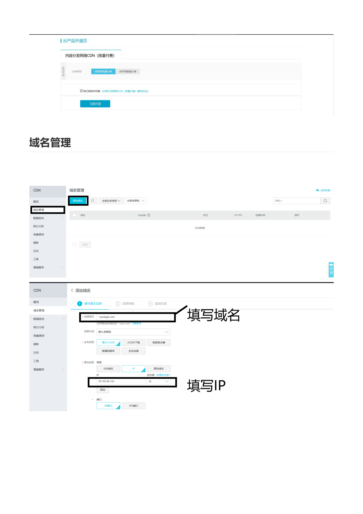
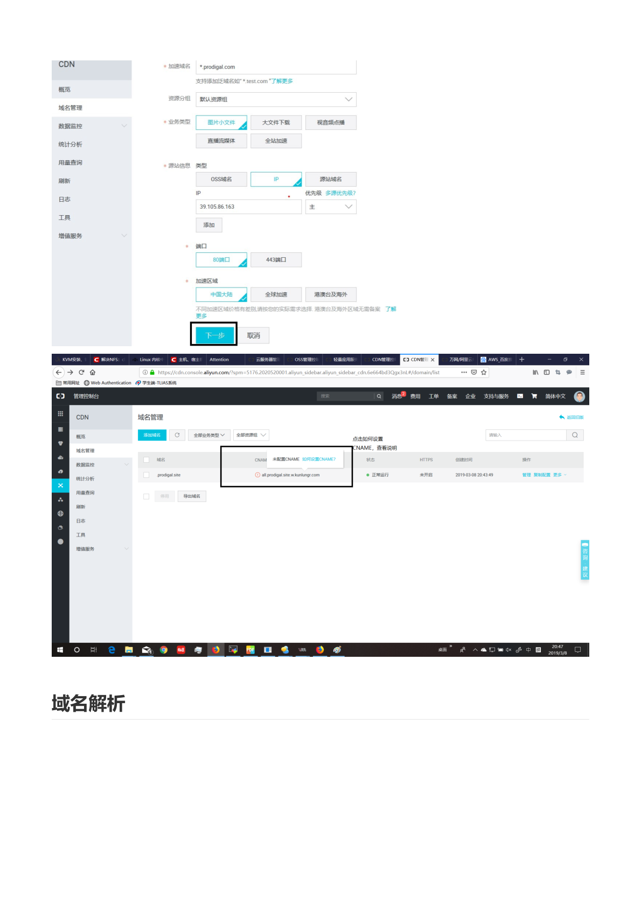
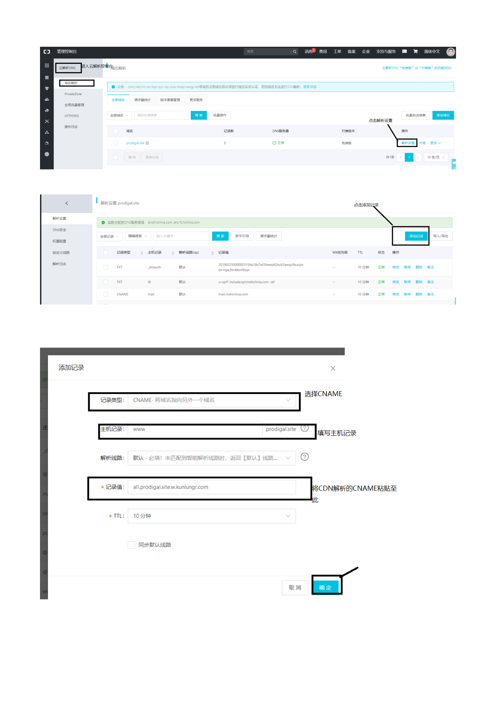

# 阿里云 内容分发 CDN

> 本文档由《阿里云CDN应用.pdf》整理而来，共 6 页截图，全部保存在 `img/` 目录中。
> 教学脉络：**了解 CDN 作用 → 搜索并开通 CDN 服务 → 添加加速域名 → 配置 CNAME 解析 → 验证生效**。
> 前置条件：一个自己的域名（教程示例 `prodigal.site`），且已完成实名认证；一个源站 IP（教程示例 ECS 公网 IP `39.105.86.163`）。

---

## 1. CDN 作用



CDN（内容分发网络）把源站内容**缓存到分布在全国/全球的边缘节点**。用户访问时：

1. 用户请求 → 云端接入入口 → **CDN 网络加速** → SLB 负载调度 → 最近的边缘节点直接返回缓存内容；
2. 节点没有缓存时才回源站取（图中 WEB 服务集群 + RDS 主从 + OSS 文件系统 + 监控/日志/消息队列构成的典型架构）。

**核心收益**：

- **就近访问**：用户从距离最近的节点拿数据，延迟大幅降低；
- **减轻源站压力**：静态内容（图片、CSS、JS、视频）由节点扛，源站只需要处理动态请求；
- **抗流量峰值**：突发流量被边缘节点分摊。

> **教学说明**：一句话记住 CDN——**"让用户从最近的服务器拿到不常变化的内容"**。适合静态资源、音视频、大文件下载；频繁变化或强个性化的动态内容加速效果有限（动态加速另有技术方案）。

## 2. 控制台搜索 CDN 服务


控制台搜索「CDN」，进入「**分发与CDN → CDN**」。

## 3. CDN 概览与服务开通



概览页可看到昨日带宽、流量、HTTPS 请求数等用量数据；计费方式默认「**按流量计费**」。



首次使用需在「**云产品开通页**」勾选同意服务协议，点击「**立即开通**」。CDN 按量计费，**开通本身不收费**，用多少流量付多少。

## 4. 域名管理：添加加速域名


进入「**域名管理**」→「**添加域名**」。




| 配置项 | 教程取值 | 说明 |
| --- | --- | --- |
| 加速域名 | `*.prodigal.com`（示例） | 支持**泛域名**；域名需已在阿里云备案 |
| 资源分组 | 默认资源组 | 便于资源归类管理 |
| 业务类型 | **图片小文件** | 可选：大文件下载、视音频点播、直播流媒体、全站加速 |
| 源站信息类型 | **IP** | 也可选 OSS 域名、源站域名 |
| 源站 IP | `39.105.86.163`（ECS 公网 IP） | 可添加多个源站并设置优先级/权重 |
| 端口 | 80 端口 / 443 端口 | 回源使用的端口 |
| 加速区域 | **中国内地** | 也可选全球加速、全球（含港澳台） |

填写完成后点击「**下一步**」。

> **教学说明**：
> - **业务类型**决定节点调度的策略和缓存规则，不要乱选（如视频点播选"视音频点播"）。
> - **源站信息**：加速内容的"老家"。CDN 节点未命中缓存时就去这里取。源站可以是 ECS、SLB、OSS 或其他可访问的服务器。
> - 中国大陆 CDN 要求域名**必须有 ICP 备案**，未备案域名会添加失败。


提交后域名列表出现新域名，状态为「**正常运行**」，但会提示「**点击可设置 CNAME，查看*CNAME*解析操作方法**」，**CNAME 未配置前加速并不生效**。

## 5. 域名解析：配置 CNAME

### 5.1 进入云解析控制台


进入控制台「**域名解析**」→「**解析设置**」，找到自己的域名（`prodigal.site`），点击「**解析设置**」→「**添加记录**」。



### 5.2 添加 CNAME 记录


| 配置项 | 教程取值 | 说明 |
| --- | --- | --- |
| 记录类型 | **CNAME** | 将域名指向另一个域名 |
| 主机记录 | `www` | 即加速 `www.prodigal.site` |
| 解析线路 | 默认 | |
| **记录值** | CDN 分配的 CNAME 地址 | 从 CDN 域名管理页**复制粘贴**（形如 `al.prodigal.site.kunlgr.com`） |
| TTL | 10 分钟 | 生效缓存时间 |

点击「**确定**」保存。

> **教学说明**：CNAME 的含义是"**把 www.prodigal.site 这个名字指向 CDN 的调度域名**"。之后用户解析到的是 CDN 边缘节点的 IP（随用户位置动态变化），而不是源站 IP——这就是"就近访问"的实现机制。

### 5.3 确认添加成功


解析记录列表中出现记录类型 `CNAME`、主机记录 `www`、记录值为 CDN 分配域名的记录，状态正常即添加成功。

## 6. 验证与常见问题

**验证方法**：

```bash
# 1. 解析是否生效：应返回 CDN 分配的 CNAME
nslookup www.prodigal.site
dig www.prodigal.site +short

# 2. 加速是否生效：响应头中出现阿里云 CDN 特征头
curl -I http://www.prodigal.site
# X-Swift-Cache / X-Cache / EagleId 等头出现即命中 CDN
```

**常见问题**：

| 现象 | 排查方向 |
| --- | --- |
| 域名列表显示"待配置 CNAME" | 解析记录未添加/未生效，回步骤 5.2 检查主机记录与记录值 |
| 解析后访问 404/超时 | 源站 IP 或端口填错，检查源站上的 Web 服务（80 端口是否监听、安全组是否放行） |
| 缓存不更新 | 在 CDN 控制台「刷新」中提交 URL/目录刷新，或等待缓存过期 |
| 添加域名失败 | 检查域名是否完成 ICP 备案、格式是否合法 |

> **教学说明**：CDN 上线后源站不再直接暴露公网，还可以在 CDN 上开启 HTTPS、防盗链、鉴权 URL、限速等防护与优化能力，这也是 CDN 相比"直接暴露源站"的安全收益。
