# 阿里云 ECS 云服务器

> 本文档由《阿里云 ECS.pdf》整理而来，共 18 页截图，全部保存在 `img/` 目录中。
> 教学脉络：**注册账号 → 充值 → 准备专有网络（VPC + 交换机）→ 准备安全组 → 创建 ECS 实例 → 安装 Web 服务并验证**。

---

## 1. 注册阿里云账号

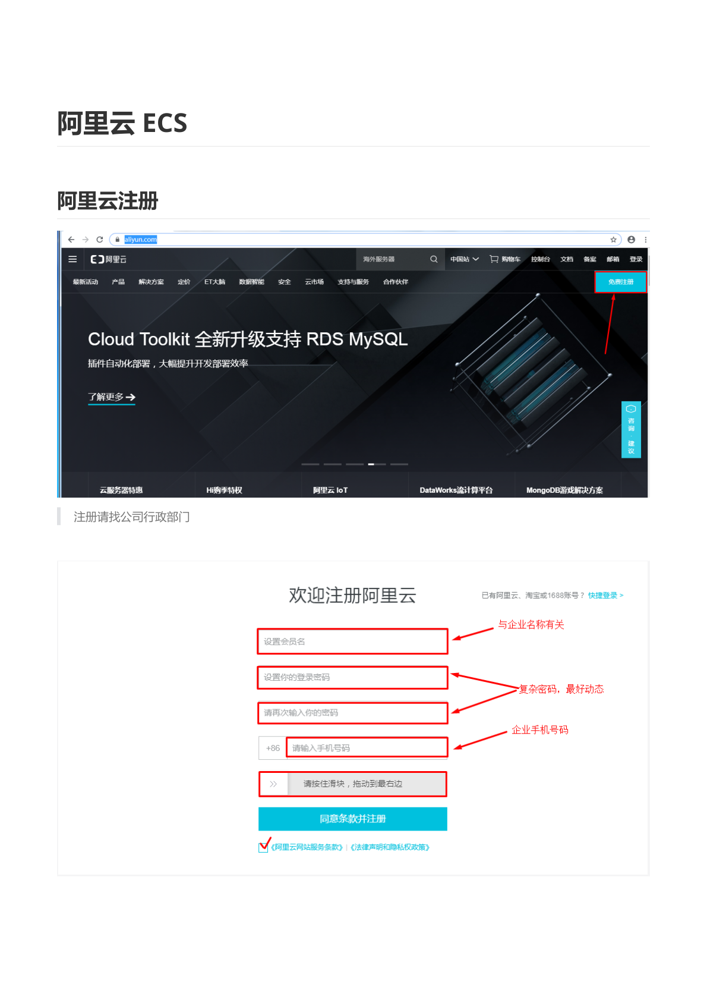

注册入口在官网右上角「**免费注册**」。

- **会员名**：与企业名称相关，便于企业内管理。
- **登录密码**：建议设置复杂密码，最好包含大小写字母、数字和符号（动态组合）。
- **手机号码**：填写企业手机号，用于接收验证码和后续安全提醒。

> **教学说明**：个人学习可直接用手机号注册；生产/公司环境请走企业实名认证。**实名认证完成后才能购买云资源**，个人认证也可以完成本教程的所有操作。

## 2. 登录阿里云与控制台介绍

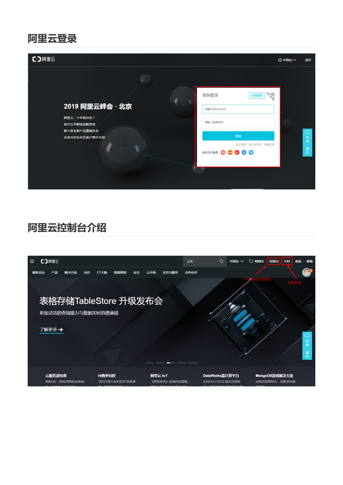

- 支持密码登录、扫码登录等多种方式。
- 登录后进入官网首页，右上角可进入「**控制台**」（管理控制台）和「**文档**」（帮助中心）。

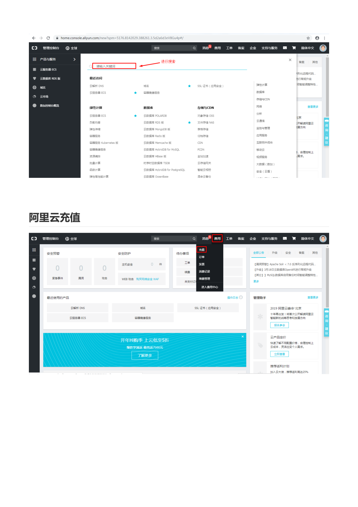

控制台是阿里云所有产品的统一管理入口，页面顶部的搜索框可以**直接搜索产品名称**（如 ECS、RDS、CDN），这是后续所有实验的第一步。

> **教学说明**：记住一个通用习惯——**任何产品都可以通过控制台顶部搜索框快速找到**，不必在菜单里一层层翻找。

## 3. 账户充值


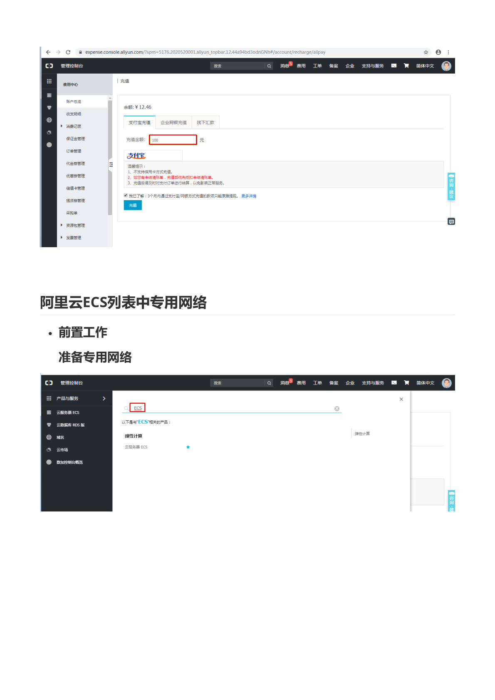

进入「费用」→「充值」，输入充值金额（如 100 元），选择支付宝等支付方式完成充值。

> **注意**：
> - 本教程的 ECS、RDS 均采用**按量付费**，按小时扣费，账户里必须有余额，否则实例会因欠费被停机甚至释放。
> - 实验结束请**及时释放实例**（见各章节末尾），避免持续产生费用。

---

## 4. 前置工作（一）：准备专有网络 VPC

### 4.1 进入 ECS 产品页


### 4.2 找到「专有网络 VPC」菜单

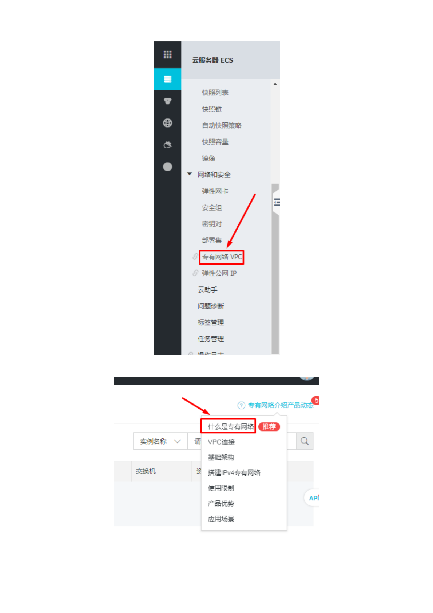

在云服务器 ECS 控制台左侧菜单：**网络和安全 → 专有网络 VPC**。

### 4.3 选择区域

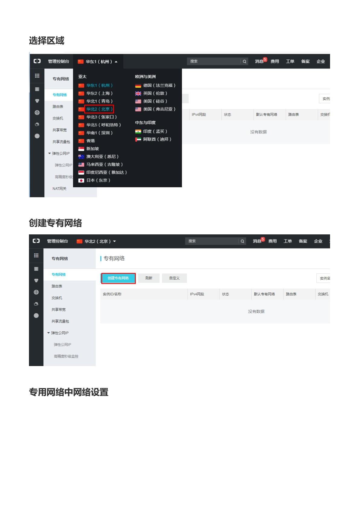

右上角切换地域，教程选择 **华北2（北京）**。

> **教学说明**：VPC 是**地域级**资源，交换机是**可用区级**资源。后续的 ECS、RDS、SLB、NAS 必须和 VPC 在**同一地域**才能内网互通，所以第一步就要定好地域，后面不要再换。

### 4.4 创建专有网络


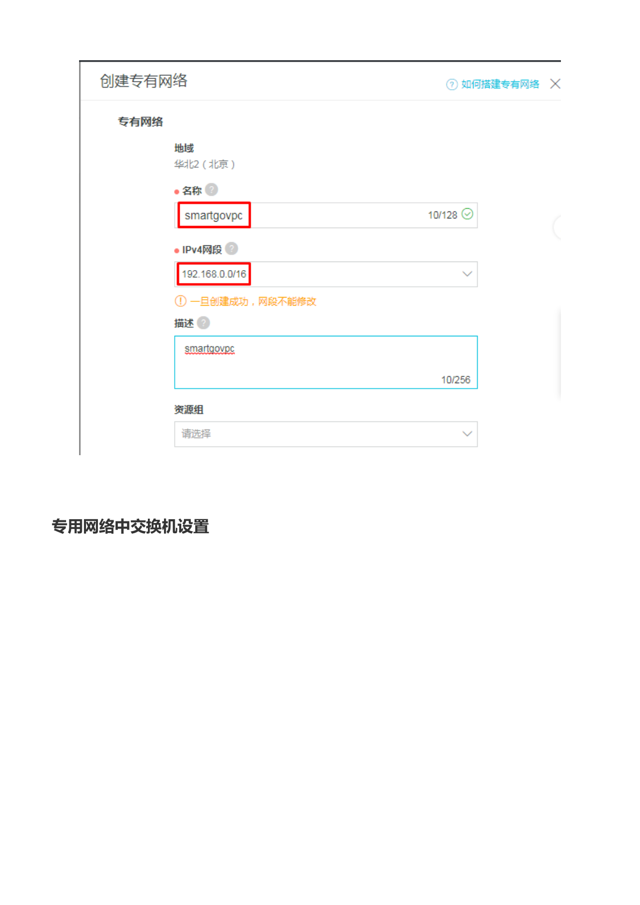

- **名称**：如 `smartgovpc`（自定义）。
- **IPv4 网段**：选择 `192.168.0.0/16`。
- 一旦创建成功，**网段不能修改**。

### 4.5 创建交换机（VSwitch）

在同一对话框下方的「交换机」部分填写：

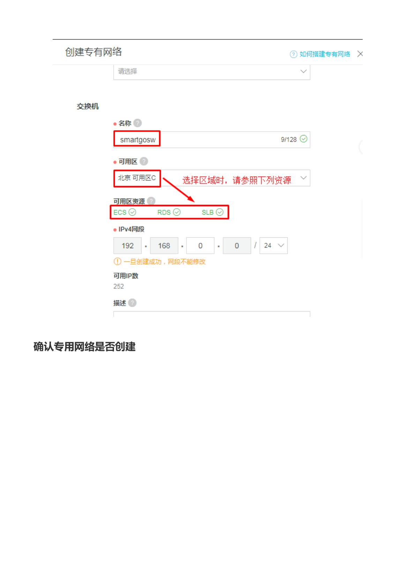

- **名称**：如 `smartgosw`（自定义）。
- **可用区**：选择 **北京 可用区 C**。选择可用区时，请对照页面上的资源提示，**确认 ECS、RDS、SLB 在该可用区都可用**（图中有绿色对勾）。
- **IPv4 网段**：`192.168.0.0/24`（是 VPC 网段的子集）。同样创建后不能修改。

### 4.6 确认创建结果

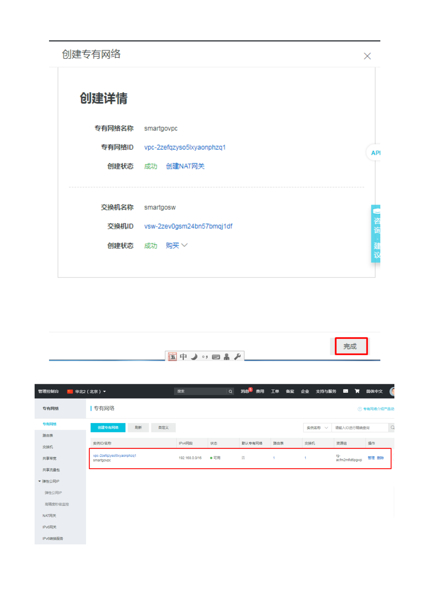


创建详情显示：

- 专有网络 `smartgovpc`，ID `vpc-2zefqzyso5ixyaonphzq1`，状态「成功」。
- 交换机 `smartgosw`，ID `vsw-2zev0gsm24bn57bmqj1df`，状态「成功」。

点击「**完成**」，回到专有网络列表中可以看到处于「**可用**」状态的 VPC。

---

## 5. 前置工作（二）：准备安全组

### 5.1 进入安全组页面

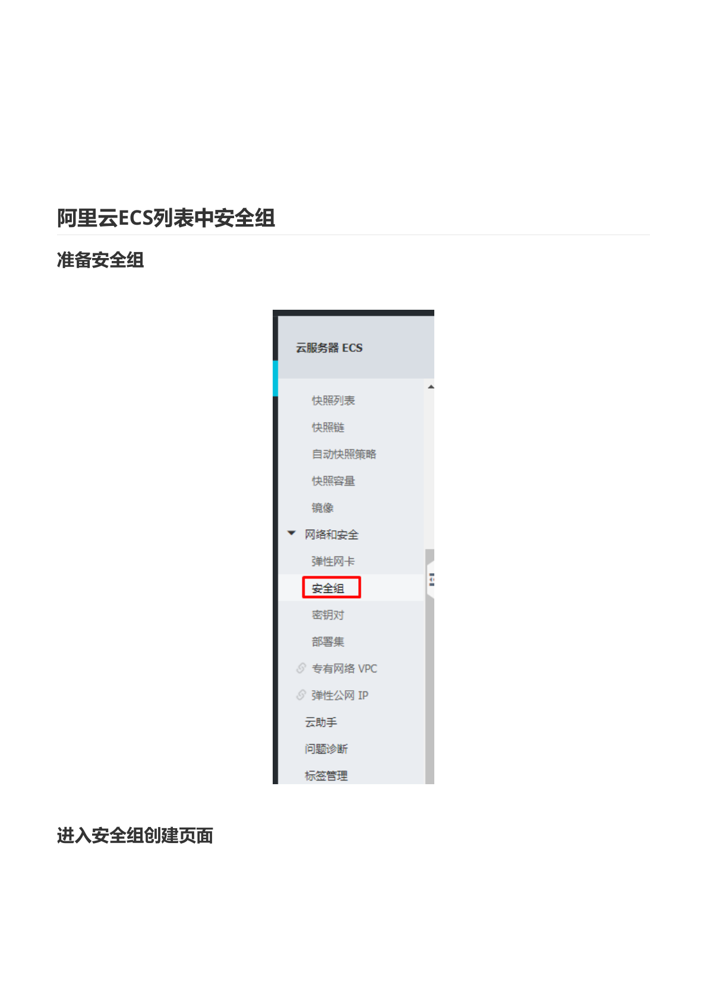

ECS 控制台左侧菜单：**网络和安全 → 安全组**。

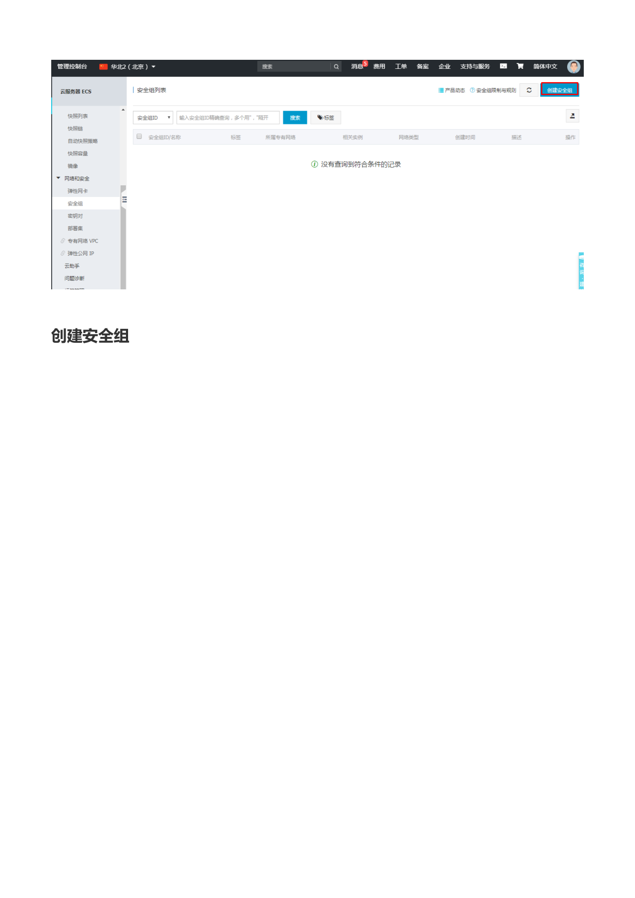

### 5.2 创建安全组

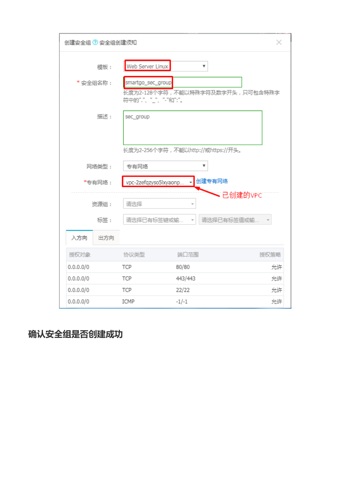

| 配置项 | 教程取值 | 说明 |
| --- | --- | --- |
| 模板 | Web Server Linux | 快速生成 Web 服务器常用规则 |
| 安全组名称 | `smartgo_sec_group` | 自定义，便于识别 |
| 描述 | `sec_group` | 可选 |
| 网络类型 | 专有网络 | 与 VPC 配套 |
| 专有网络 | 选择刚创建的 VPC | 即 `smartgovpc` |

模板默认生成的**入方向规则**：

| 授权对象 | 协议类型 | 端口范围 | 授权策略 |
| --- | --- | --- | --- |
| 0.0.0.0/0 | TCP | 80/80 | 允许 |
| 0.0.0.0/0 | TCP | 443/443 | 允许 |
| 0.0.0.0/0 | TCP | 22/22 | 允许 |
| 0.0.0.0/0 | ICMP | -1/-1 | 允许 |

> **教学说明**：
> - 安全组相当于**虚拟防火墙**，ECS 实例必须关联安全组，入方向规则不放行的端口将无法访问。
> - `0.0.0.0/0` 表示对所有 IP 开放。实验可以这样做；**生产环境建议把 22 端口的授权对象改为自己的固定 IP**，防止被暴力破解。
> - 如果模板里没有自己需要的端口（如 3306、8080），创建后可以在安全组详情页「手动添加」入方向规则。

### 5.3 确认安全组创建成功

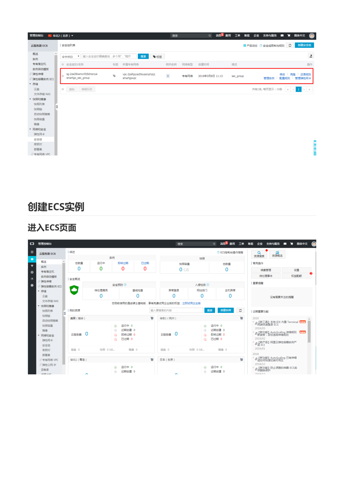

安全组列表中出现 `sg-2ze8vmwcf5d3mrwvl`（smartgo_sec_group），所属专有网络为 `smartgovpc`。

---

## 6. 创建 ECS 实例

### 6.1 进入 ECS 页面并创建实例


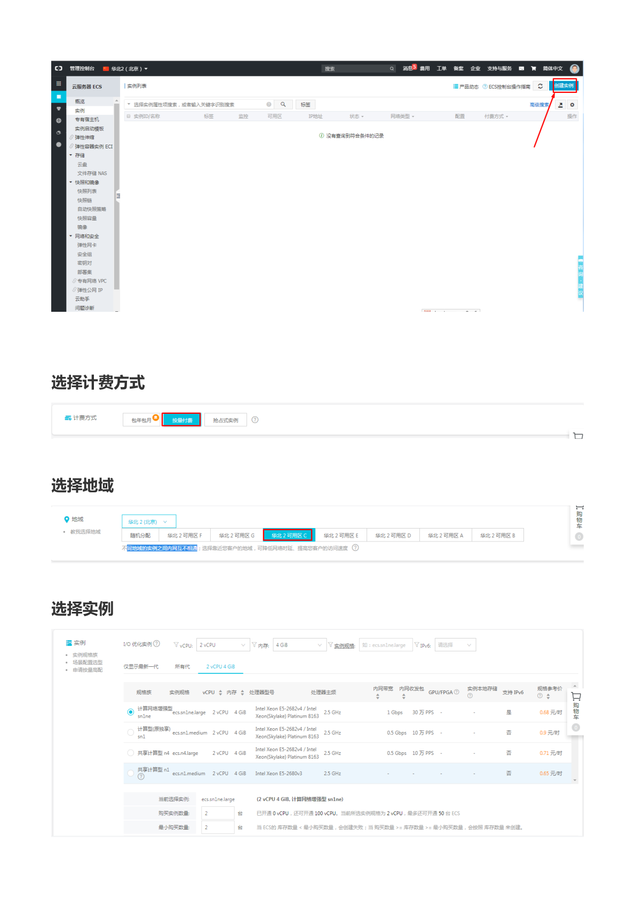

在「实例与镜像 → 实例」页面点击右上角「**创建实例**」。

### 6.2 选择计费方式、地域与实例规格


- **计费方式**：选择「**按量付费**」（用多久付多久，适合实验；包年包月适合长期使用）。
- **地域**：华北 2（北京），**可用区 C**——必须与前面的交换机一致。
- **实例规格**：教程选择 **2 vCPU + 4 GB**（如 ecs.sn1ne.large 一类通用型规格即可满足实验）。

> **教学说明**：按量付费的实例规格价格差别很大，实验选择最低够用的规格即可；共享型规格更便宜，适合练习。

### 6.3 选择镜像、存储、网络、带宽、安全组

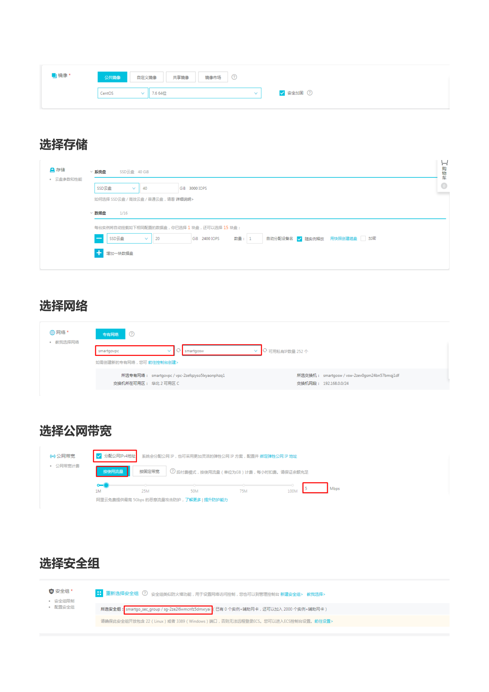

| 配置项 | 教程取值 | 说明 |
| --- | --- | --- |
| 镜像 | 公共镜像 CentOS 7.6 64 位 | 勾选「安全加固」 |
| 系统盘 | ESSD 云盘 40 GiB | 默认即可 |
| 数据盘 | 可选，实验可不加 | 需要时单独购买并挂载 |
| 专有网络 | `smartgovpc` | 前面创建的 VPC |
| 交换机 | `smartgosw` | 前面创建的交换机 |
| 公网 IP | **勾选「分配公网 IPv4 地址」** | 没有公网 IP 无法远程连接和对外服务 |
| 带宽计费 | 按使用流量，峰值 5 Mbps | 实验够用 |
| 安全组 | `smartgo_sec_group` | 前面创建的安全组 |

> **注意**：**忘记分配公网 IP 是新手最常见的错误**。如果创建后发现没有公网 IP，只能再绑定弹性公网 IP（EIP），所以购买时务必勾选。

### 6.4 网卡、登录密码与实例名称

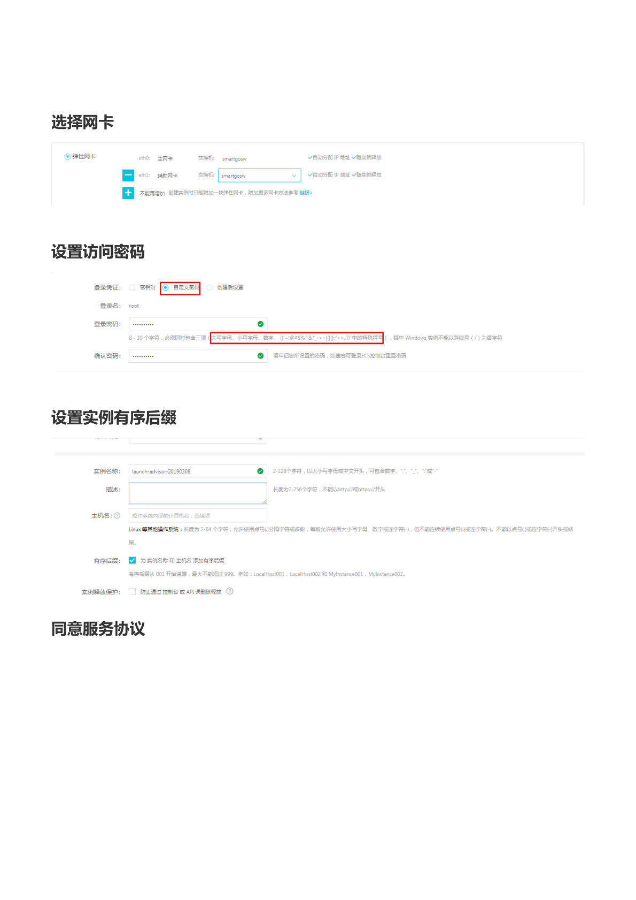

- **弹性网卡**：主网卡 eth0 使用交换机 `smartgosw`；可再添加辅助网卡（实验可省略）。
- **登录凭证**：选择「**自定义密码**」，用户名 `root`，密码需 8–30 位，包含大写字母、小写字母、数字、特殊字符中的至少三类。
- **实例名称/主机名**：如 `launch-advisor-20190308001`；可勾选「**有序后缀**」批量命名（LocalHost001、LocalHost002 …）。
- 勾选「**同意服务协议**」后创建。

### 6.5 确认实例创建成功

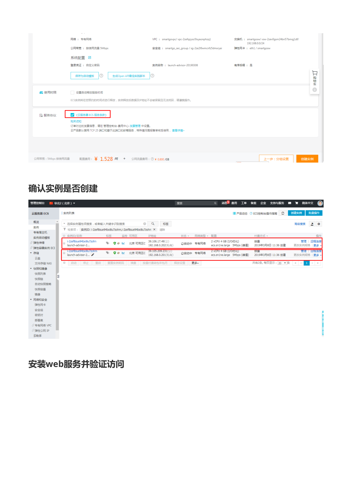

回到实例列表，可以看到两台状态为「**运行中**」的实例（`launch-advisor-20190308001/002`），分别分配了公网 IP（39.106.17.48 / 39.105.209.231）和内网 IP（192.168.0.202 / 192.168.0.201）。

> **教学说明**：实例从「启动中」到「运行中」约需 1–2 分钟；刚创建时可能分配不到公网 IP，稍等刷新即可。

## 7. 安装 Web 服务并验证访问


在 ECS 上安装并启动 Web 服务后，浏览器访问 `http://<公网IP>`，页面显示出网页内容（图中为 `test1`）即验证成功。

在 CentOS 7 上的典型操作：

```bash
# 安装 Apache
yum -y install httpd
# 写一个测试页面
echo "test1" > /var/www/html/index.html
# 启动并设置开机自启
systemctl start httpd
systemctl enable httpd
```

> **常见排查思路**（按顺序检查）：
> 1. 服务是否启动：`systemctl status httpd`；
> 2. 安全组入方向是否放行 80 端口；
> 3. 是否分配了公网 IP；
> 4. 本机防火墙（firewalld）是否拦截。

## 8. 实验结束：释放实例

> **注意**：按量付费实例**不用时务必释放**，否则会持续计费。在实例列表「更多」→「实例状态」→「释放设置」中选择「立即释放」。VPC、交换机、安全组不单独计费，可保留供下次实验使用。

---

## 附：本教程资源清单

| 资源 | 名称 |
| --- | --- |
| 专有网络 | smartgovpc（192.168.0.0/16） |
| 交换机 | smartgosw（192.168.0.0/24，北京可用区 C） |
| 安全组 | smartgo_sec_group（放行 22/80/443/ICMP） |
| ECS 实例 | launch-advisor-20190308001/002，CentOS 7.6 |
| 公网 IP | 39.106.17.48 / 39.105.209.231 |
| 内网 IP | 192.168.0.202 / 192.168.0.201 |
