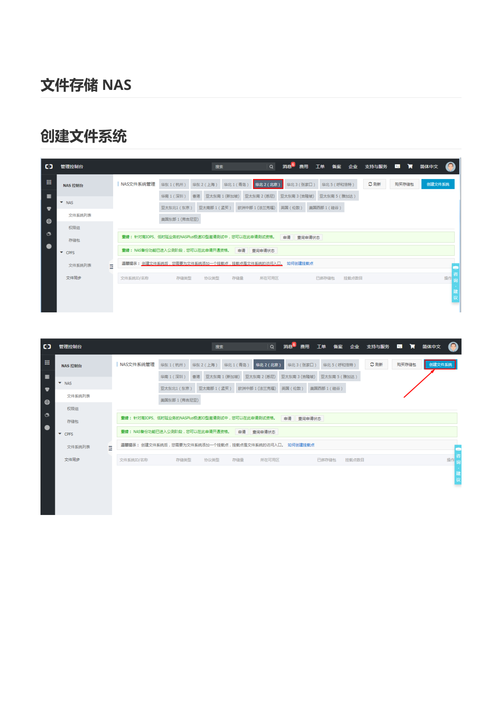
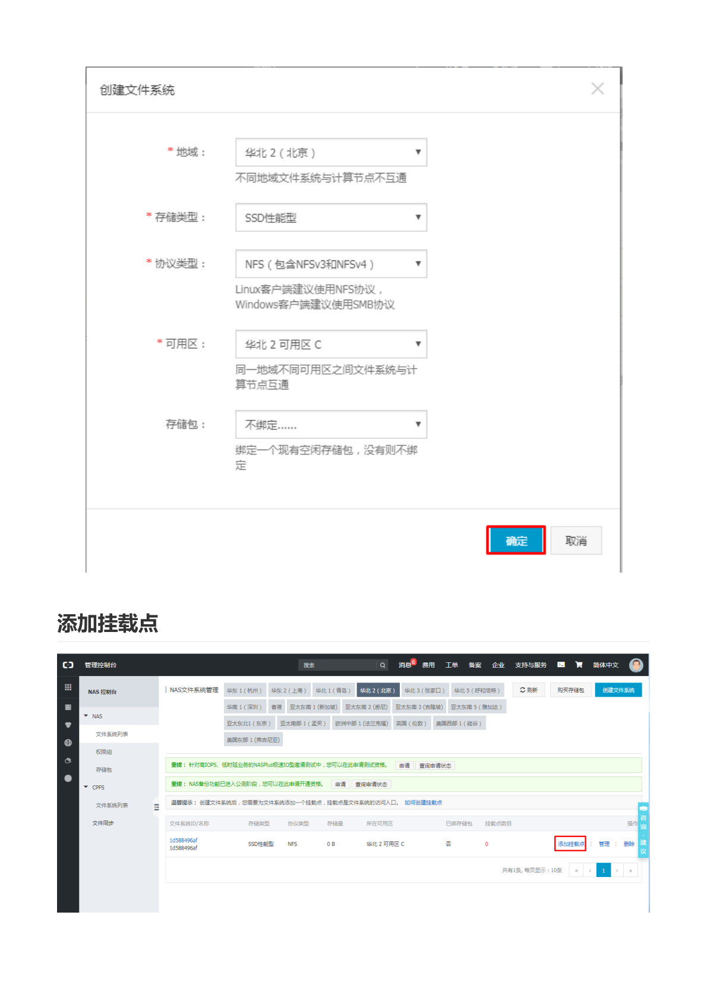
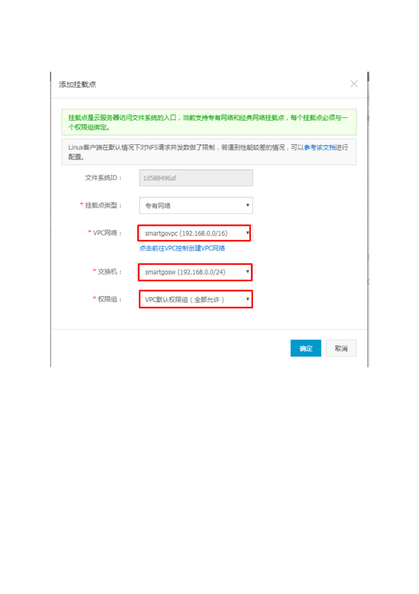
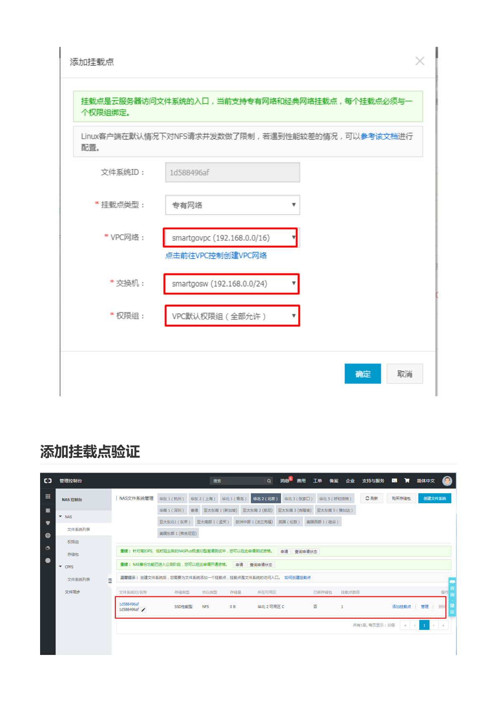
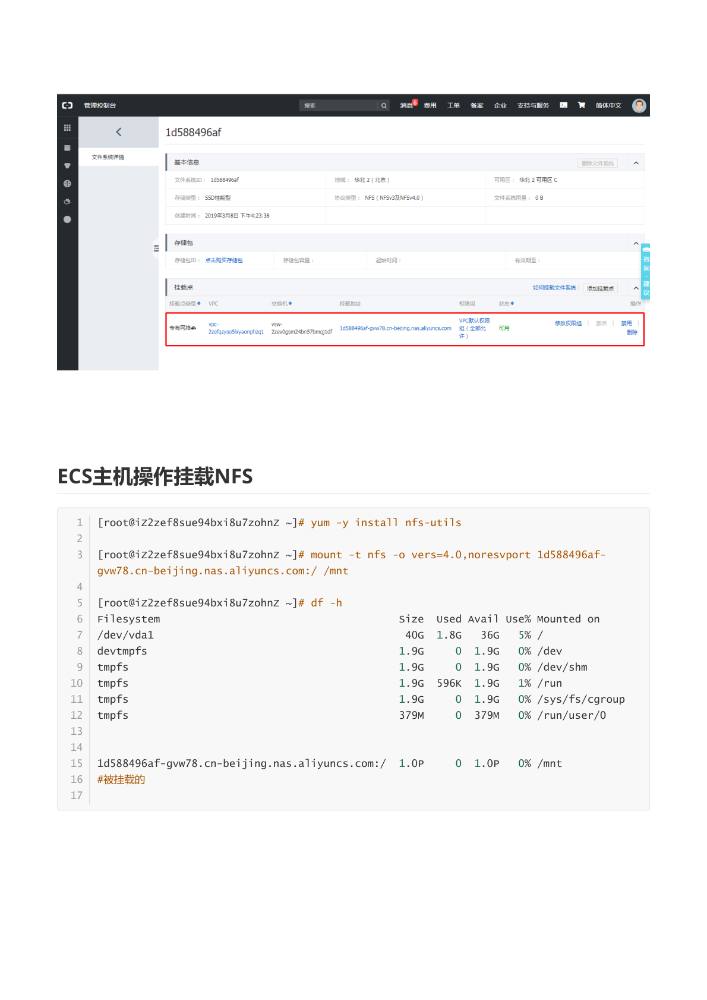

# 阿里云 文件存储 NAS

> 本文档由《阿里云文件存储 NAS.pdf》整理而来，共 6 页截图，全部保存在 `img/` 目录中。
> 教学脉络：**创建文件系统 → 添加挂载点 → 挂载点验证 → ECS 挂载 NFS → 验证使用**。
> 前置条件：已按《阿里云ECS.md》创建好 **VPC（smartgovpc，192.168.0.0/16）+ 交换机（smartgosw，192.168.0.0/24）**，及同 VPC 内的 ECS。

---

## 1. NAS 简介

**文件存储 NAS（Apsara File Storage NAS）**是阿里云提供的**共享文件存储**：

- 目录树结构、POSIX 兼容，**可像本地目录一样读写**；
- 支持多台 ECS **同时挂载共享**（与块存储只能挂给一台主机不同）；
- 弹性扩容，按实际存储量与性能计费。

> **教学说明**：NAS 的典型用法——Web 集群的**共享静态文件目录**（多台 Web 服务器上传/读取同一份文件）、日志集中收集、容器共享存储、开发测试共享目录等。

## 2. 创建文件系统



控制台搜索「NAS」，进入 **NAS 控制台 → 文件系统列表**。**先选择与 ECS 相同的地域**（华北2 北京），再点击「**创建文件系统**」。



| 配置项 | 教程取值 | 说明 |
| --- | --- | --- |
| 地域 | **华北2（北京）** | **不同地域文件系统与计算节点不互通** |
| 存储类型 | **SSD 性能型** | 还有容量型、极速型，按性能/价格选择 |
| 协议类型 | **NFS（包含 NFSv3 和 NFSv4）** | **Linux 客户端使用 NFS；Windows 客户端使用 SMB** |
| 可用区 | 华北2 可用区 C | **同一地域不同可用区之间文件系统与计算节点不互通**，需与 ECS 同可用区 |
| 存储包 | 不绑定 | 可绑定预付存储包降低成本 |

点击「**确定**」创建。

> **教学说明**：
> - **协议选择**是第一步的分叉口：Linux 走 NFS，Windows 走 SMB（CIFS），本教程使用 NFS。
> - 创建文件系统**不等于**能访问它——还必须添加"挂载点"（网络入口）。

## 3. 添加挂载点


文件系统列表中，点击新文件系统操作列的「**添加挂载点**」。



**挂载点是云服务器访问文件系统的入口**，当前支持专有网络和经典网络挂载点，**每个挂载点必须与一个权限组绑定**。

| 配置项 | 教程取值 | 说明 |
| --- | --- | --- |
| 文件系统 ID | `1d588496af`（自动带出） | |
| 挂载点类型 | **专有网络** | 推荐，安全且免流量费 |
| VPC 网络 | `smartgovpc (192.168.0.0/16)` | 与 ECS 相同的 VPC |
| 交换机 | `smartgosw (192.168.0.0/24)` | 与 ECS 相同的交换机 |
| 权限组 | **VPC 默认权限组（全部允许）** | 控制哪些 IP/网段可以访问 |

点击「**确定**」。

> **教学说明**：
> - **权限组**相当于 NAS 的白名单/防火墙，规则允许/拒绝特定 IP 对挂载点的读写。生产环境不要用"全部允许"的默认组，应为具体网段建专用权限组。
> - 挂载点地址形如 `1d588496af-gvw78.cn-beijing.nas.aliyuncs.com`，是后续 mount 命令使用的域名。

## 4. 添加挂载点验证



回到文件系统详情页，挂载点列表出现：

- 挂载点类型：VPC，网络：`vpc-2zefqzyso5ixyaonphzq1 / vsw-2zev0gsm24bn57bmqj1df`；
- 挂载地址：`1d588496af-gvw78.cn-beijing.nas.aliyuncs.com`；
- 权限组：VPC 默认权限组（允许），状态正常。

## 5. ECS 主机操作挂载 NFS



登录 ECS，执行：

```bash
# 1. 安装 NFS 客户端工具
yum -y install nfs-utils

# 2. 挂载（vers=4.0 表示使用 NFSv4 协议）
mount -t nfs -o vers=4.0,noresvport \
  1d588496af-gvw78.cn-beijing.nas.aliyuncs.com:/ /mnt

# 3. 验证
df -h
```

`df -h` 输出（节选）：

```text
Filesystem                                   Size  Used Avail Use% Mounted on
/dev/vda1                                     40G  1.8G   36G   5% /
1d588496af-gvw78.cn-beijing.nas.aliyuncs.com:/ 1.0P    0  1.0P   0% /mnt
```

最后一行出现 `1d588496af-gvw78.cn-beijing.nas.aliyuncs.com:/ 1.0P 0 1.0P 0% /mnt` 即**挂载成功**（容量显示为 NAS 的弹性上限）。

> **命令参数说明**：
> - `-t nfs`：文件系统类型为 NFS；
> - `vers=4.0`：NFSv4 协议（也支持 `vers=3`）；
> - `noresvport`：重连时使用新的随机源端口，避免网络闪断后连接恢复失败（NAS 官方推荐参数）；
> - `:/`：挂载文件系统根目录，也可以挂载子目录 `:/share`。

## 6. 使用与验证

```bash
# 在挂载点里创建文件
touch /mnt/nas-test.txt
echo "hello nas" > /mnt/nas-test.txt
cat /mnt/nas-test.txt

# 多台 ECS 挂载同一挂载点后，文件互相可见（共享存储）
```

> **教学说明 / 常见问题**：
> 1. **开机自动挂载**：写入 `/etc/fstab`（务必加 `_netdev`，否则网络未就绪会导致开机卡住）：
>    ```text
>    1d588496af-gvw78.cn-beijing.nas.aliyuncs.com:/ /mnt nfs vers=4.0,noresvport,_netdev 0 0
>    ```
> 2. **mount 卡住/超时**：检查 ECS 与挂载点是否**同 VPC 同可用区**、NAS 权限组是否放行 ECS 网段、`nfs-utils` 是否已安装。
> 3. **权限问题**：NFS 默认以 UID 映射权限，多台主机 uid 不一致时注意统一用户或使用 `no_root_squash` 类权限组规则（了解即可，注意安全）。
> 4. **卸载**：`umount /mnt`。
> 5. 用完记得在 NAS 控制台删除文件系统，避免按量计费产生存储费用（删除前先删除挂载点）。
