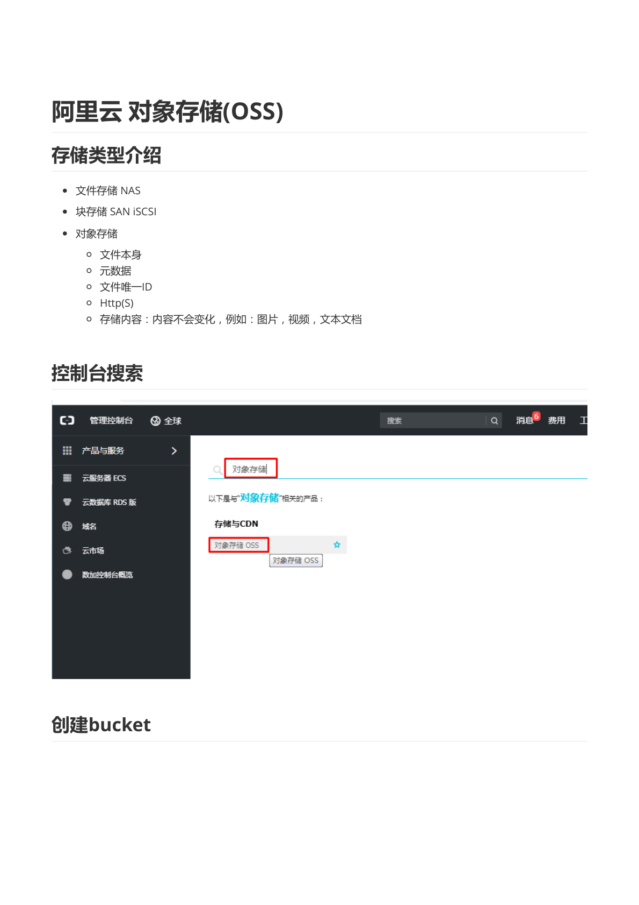
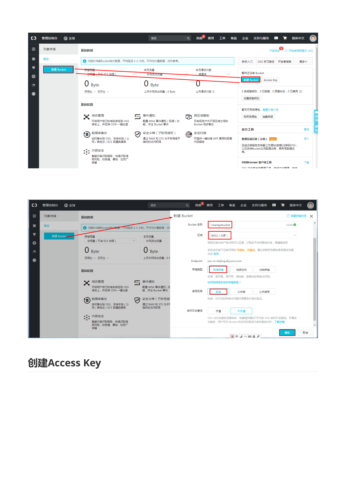
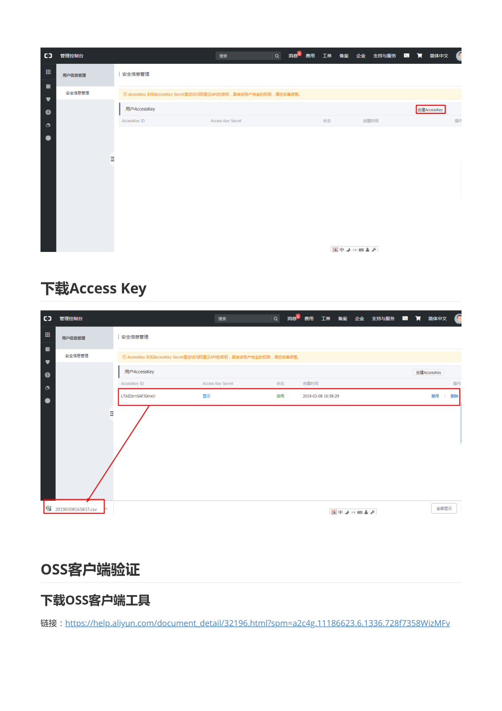
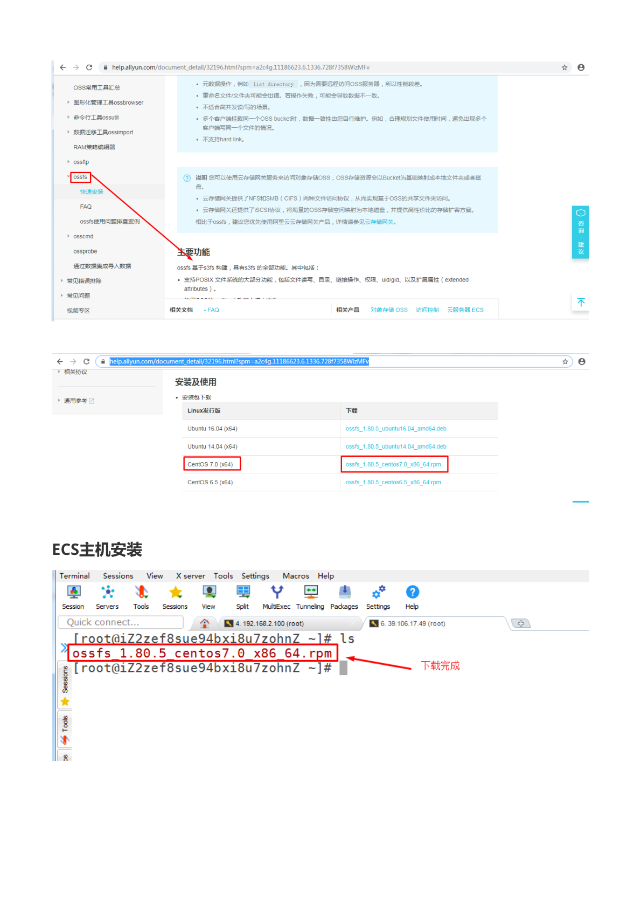
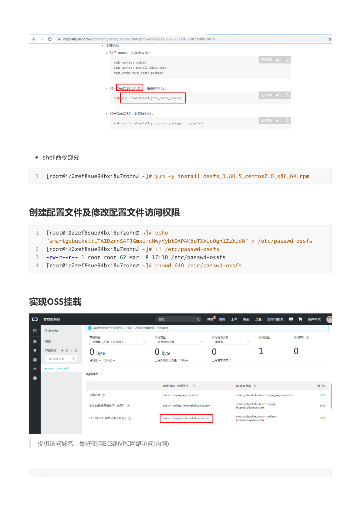
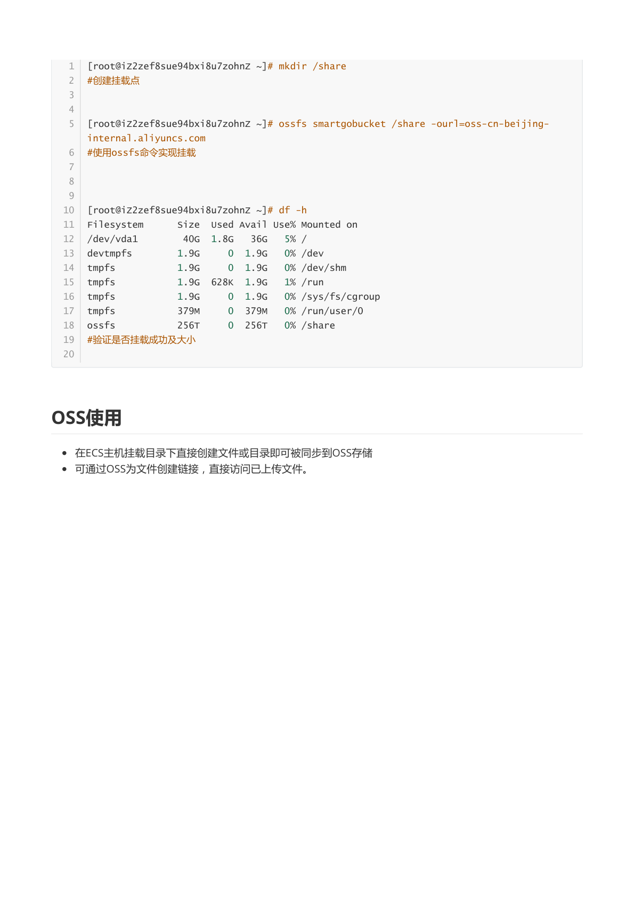

# 阿里云 对象存储（OSS）

> 本文档由《阿里云 对象存储(OSS).pdf》整理而来，共 6 页截图，全部保存在 `img/` 目录中。
> 教学脉络：**了解存储类型 → 创建 Bucket → 创建 AccessKey → 下载 ossfs 客户端工具 → ECS 安装 ossfs 并挂载 → 验证使用**。
> 前置条件：一台已创建的 ECS（本教程用 CentOS 7，内网 IP 192.168.x.x，公网 IP 39.106.17.48）。

---

## 1. 存储类型介绍



| 类型 | 特点 | 典型场景 |
| --- | --- | --- |
| **文件存储 NAS** | 目录树结构，POSIX 语义，可被多主机共享挂载 | 共享目录、Web 共享文件 |
| **块存储 SAN (iSCSI)** | 裸磁盘块设备，挂给单台主机当硬盘 | 系统盘、数据盘 |
| **对象存储 OSS** | 文件本体 + **元数据** + **文件唯一 ID**，通过 **HTTP(S)** 访问 | 图片、视频、文本文档等**内容不变**的文件 |

**对象存储的核心特征**：存储内容**不会变化**（例如图片、视频、文本文档），每次访问都是读整个对象；对象 = 数据 + 元数据（大小、类型、自定义标签等）+ 唯一标识（Key），通过 RESTful HTTP 接口读写。

> **教学说明**：三种存储的选型口诀——
> - 要像用**本地硬盘**一样用 → 块存储（云盘）；
> - 要多台机器共享**目录/文件** → NAS；
> - 要存放**海量静态文件**并直接给用户提供 HTTP 下载/访问（网站图片、备份、日志归档）→ OSS。
>
> 严格说 OSS 不是文件系统：**不适合频繁修改、追加**的文件（如正在编辑的数据库文件），也不要直接拿来当数据库存储。

## 2. 控制台搜索与创建 Bucket


控制台搜索「**对象存储 OSS**」进入 OSS 管理控制台。




点击「**创建 Bucket**」：

| 配置项 | 教程取值 | 说明 |
| --- | --- | --- |
| Bucket 名称 | `smartgobucket` | **全局唯一**，只能小写字母、数字、短划线 |
| 地域 | 华东2（上海） | 与 ECS 同地域才能走内网（本页示例为华东2，实际建议与 ECS 同地域） |
| 存储类型 | **标准存储** | 默认，访问频繁时使用 |
| 读写权限 | **私有** | 只有授权用户能访问，最安全 |
| 实时日志查询 | 关闭 | 按需 |

> **教学说明**：
> - Bucket 名称全局唯一（所有阿里云用户范围内），命名要唯一。
> - 权限三选一：**私有**（推荐默认）、**公共读**（任何人可读，适合网站静态资源）、**公共读写**（任何人可写，**极危险，禁止**）。
> - 创建 Bucket **本身免费**，费用来自存储量、外网流出流量、请求次数等。
> - 低于 1 小时的存储量按 1 小时计算，不用不收费。

## 3. 创建 Access Key



进入控制台头像 →「**AccessKey 管理**」（或 RAM 访问控制），点击「**创建 AccessKey**」。

> **安全提示**：页面会提示「AccessKey Secret 只在创建时可见」。**AccessKey（AK/SK）等同于账号的 API 密码，泄露即等于账号被完全控制**。生产环境应在 RAM 中为具体用户创建最小权限的 AccessKey，而不是直接使用主账号 AK。


创建成功后点击「**下载**」，得到 `.csv` 凭证文件（如 `20190308165657.csv`），内含 **AccessKey ID** 与 **AccessKey Secret**，后面配置 ossfs 时要用。

## 4. OSS 客户端验证：下载 ossfs



访问官方文档《**OSS 客户端工具**》：<https://help.aliyun.com/document_detail/32196.html>，找到 **ossfs** 工具。

**ossfs 主要功能**：基于 FUSE 的文件系统工具，把 OSS Bucket **挂载为本地目录**，支持 5 GB 内的文件读写、目录/文件操作、软链接、权限 uid/gid 等扩展属性。

在文档「安装及使用 → 安装执行」表格中，按系统选择安装包：

| Linux 发行版 | 下载 |
| --- | --- |
| Ubuntu 14.04 (x64) | ossfs_1.80.5_ubuntu14.04_amd64.deb |
| Ubuntu 16.04 (x64) | ossfs_1.80.5_ubuntu16.04_amd64.deb |
| **CentOS 7.0 (x64)** | **ossfs_1.80.5_centos7.0_x86_64.rpm** |
| CentOS 6.5 (x64) | ossfs_1.80.5_centos6.5_x86_64.rpm |

## 5. ECS 主机安装


将 rpm 包上传到 ECS（图中为 Xshell 的 xftp 拖拽上传，`ls` 可见 `ossfs_1.80.5_centos7.0_x86_64.rpm`）。



```bash
yum -y install ossfs_1.80.5_centos7.0_x86_64.rpm
```

## 6. 创建配置文件及修改配置文件访问权限


把 Bucket 名、AccessKey ID、AccessKey Secret 写入 `/etc/passwd-ossfs`：

```bash
echo "smartgobucket:LTAIDZrrnSAFJGmXu:GmWYVybQAPAK8oTXAUo0ghlzzxUdN" > /etc/passwd-ossfs
ll /etc/passwd-ossfs
chmod 640 /etc/passwd-ossfs
```

格式为 `bucket:AccessKeyId:AccessKeySecret`，一行一个 Bucket。

> **教学说明**：`chmod 640` 让配置文件只有属主可读写、组可读，**其余用户不可读**——因为这个文件里是明文密钥，权限过宽（如 644）ossfs 会拒绝加载并告警。

## 7. 实现 OSS 挂载


在 OSS 控制台 Bucket 的「**访问域名**」页面获取 Endpoint，**优先使用「ECS 的 VPC 网络（内网）」域名**（如 `oss-cn-beijing-internal.aliyuncs.com`）：

| 网络类型 | Endpoint 示例 |
| --- | --- |
| 外网访问 | oss-cn-beijing.aliyuncs.com |
| ECS 经典网络（内网） | oss-cn-beijing-internal.aliyuncs.com |
| **ECS 的 VPC 网络（内网）** | oss-cn-beijing-internal.aliyuncs.com |

> **教学说明**：**内网 Endpoint 不收流量费、带宽更高、延迟更低**，前提是 Bucket 与 ECS 在同一地域。

## 8. 挂载与验证



```bash
mkdir /share                                   # 创建挂载点

ossfs smartgobucket /share -ourl=oss-cn-beijing-internal.aliyuncs.com
                                               # 使用 ossfs 命令实现挂载

df -h                                          # 验证是否挂载成功及大小
```

验证输出（节选）：

```text
Filesystem      Size  Used Avail Use% Mounted on
/dev/vda1        40G  1.8G   36G   5% /
ossfs           256T     0  256T   0% /share
```

`/share` 的文件系统类型为 `ossfs`，容量显示 256T（OSS 的容量上限展示），说明**挂载成功**。

## 9. OSS 使用

- **在 ECS 主机挂载目录下直接创建文件或目录即可被同步到 OSS 存储**：

  ```bash
  touch /share/hello.txt
  mkdir /share/docs
  # 稍后在 OSS 控制台 Bucket 内即可看到这些对象
  ```

- **可通过 OSS 为文件创建链接，直接访问已上传文件**：在控制台选中对象 →「获取地址 / 分享链接」，即可生成可访问的 URL。

> **教学说明 / 注意事项**：
> 1. **开机自动挂载**：上面的命令重启后会失效。可写入 `/etc/fstab`：
>    ```text
>    ossfs smartgobucket /share fuse _netdev,url=oss-cn-beijing-internal.aliyuncs.com,allow_other 0 0
>    ```
> 2. **卸载**：`fusermount -u /share`（或 `umount /share`）。
> 3. ossfs 本质是对象存储的"伪装文件系统"，**随机写、重命名大文件性能差**；顺序上传下载、归档类场景没有问题。
> 4. 如果挂载报 `unable to access bucket` 类错误，依次检查：`/etc/passwd-ossfs` 中的 Bucket 名/AK/SK 是否正确、Endpoint 是否写成了与 Bucket 同地域的地址、ECS 与 Bucket 是否同地域。
