# 阿里云 RDS 云数据库

> 本文档由《阿里云 RDS.pdf》整理而来，共 14 页截图，全部保存在 `img/` 目录中。
> 教学脉络：**了解 RDS → 购买实例 → 配置白名单 → 创建账号与数据库 → DMS Web 端访问 → ECS 客户端访问 → 释放实例**。
> 前置条件：已完成《阿里云ECS.md》中的**专有网络（VPC + 交换机）**创建，本教程使用 `smartgovpc / smartgosw`。

---

## 1. RDS 介绍

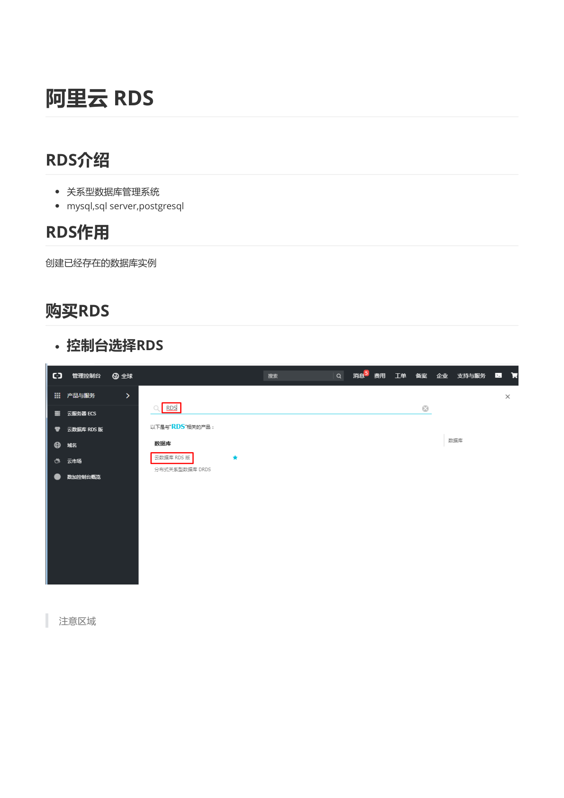

- **RDS（Relational Database Service）**是阿里云提供的关系型数据库管理系统托管服务，支持 **MySQL、SQL Server、PostgreSQL** 等引擎。
- **作用**：帮我们**创建一个"已经存在"的数据库实例**——不需要自己装 MySQL、做主从、备份、监控，开箱即用，自带高可用和数据备份。

> **教学说明**：自建数据库需要自己处理安装、调优、备份、容灾、安全补丁；RDS 把这些全部托管，应用侧只需像连接普通 MySQL 一样连接它。这也是"云数据库"相对"云主机自建库"的核心价值。

## 2. 购买 RDS 实例

### 2.1 控制台选择 RDS


控制台搜索「RDS」，进入 **云数据库 RDS 版**。**注意地域**——应与 ECS 相同（华北2 北京），否则无法内网互通。

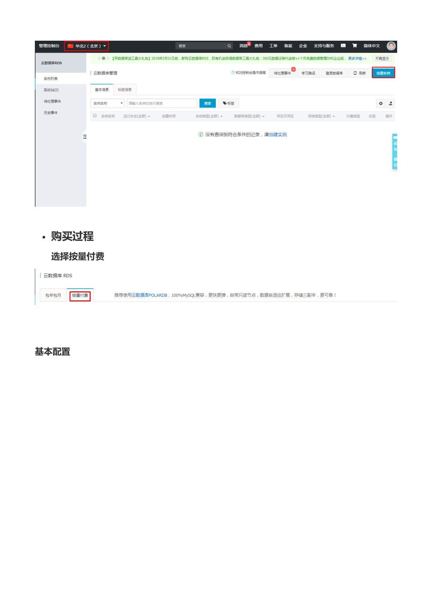

### 2.2 购买过程：选择按量付费


计费方式选择「**按量付费**」（实验用，用完即释放；长期使用建议包年包月，更便宜）。

### 2.3 基本配置

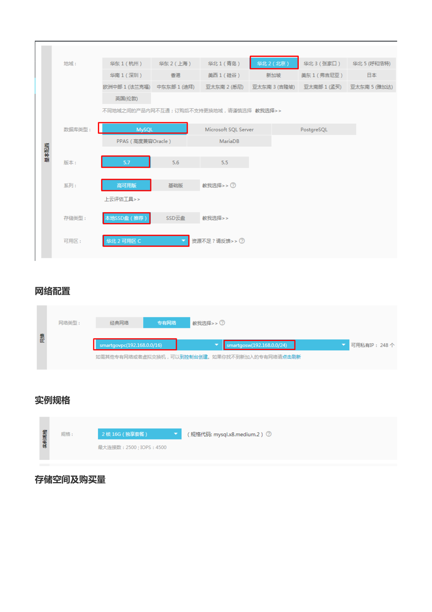

| 配置项 | 教程取值 | 说明 |
| --- | --- | --- |
| 地域 | **华北2（北京）** | 与 ECS 同地域 |
| 数据库类型 | **MySQL** | 常用开源数据库 |
| 版本 | **5.7** | 与客户端兼容性好 |
| 系列 | **高可用版** | 一主一备，自动故障切换 |
| 存储类型 | **本地 SSD 盘（推荐）** | 性能好 |
| 可用区 | 华北2 可用区 C | 与交换机可用区一致 |

### 2.4 网络配置


- 网络类型：**专有网络**。
- VPC：`smartgovpc (192.168.0.0/16)`，交换机：`smartgosw (192.168.0.0/24)`。

> **教学说明**：RDS **只支持通过专有网络内网互通**。选择与 ECS 相同的 VPC/交换机，ECS 才能通过内网地址免流量费地访问 RDS，且延迟更低、更安全。

### 2.5 实例规格与存储


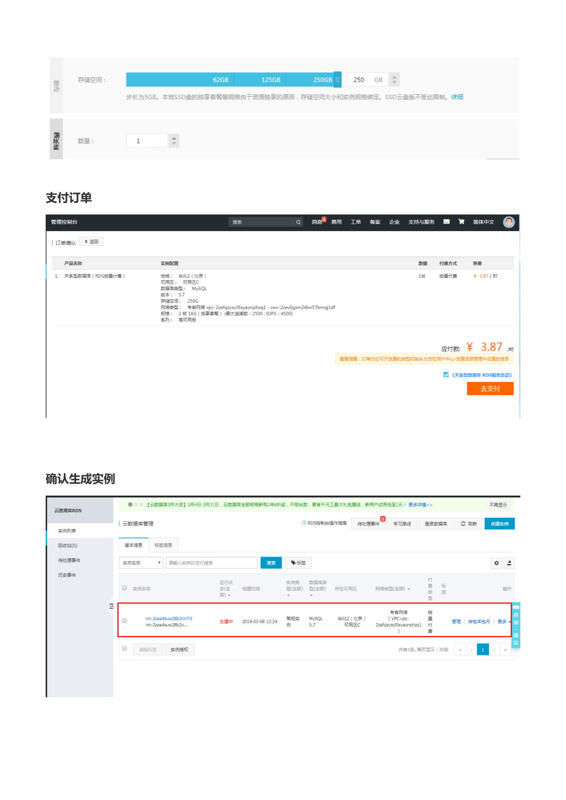

- 实例规格：**2 核 16G**（mysql.x8.medium.2，内存型），最大连接数 2500，IOPS 4500。
- 存储空间：拖动选择 **250 GB**（步长 5 GB；本地 SSD 盘受库存影响，可选范围不固定）。
- 购买数量：1。

> **教学说明**：实验场景不必照搬该配置，选最小规格（如 1 核 2G 基础版）即可，**重点是把流程走通**。

### 2.6 支付订单并确认实例生成


确认订单（图中按量付费约 ¥3.87/时，以页面实时价格为准）后支付。回到实例列表，实例 `rm-2zea4suw28b2nn7i3` 从「**创建中**」变为「**运行中**」约需 5–10 分钟。

## 3. 访问控制（白名单）

### 3.1 添加访问控制列表

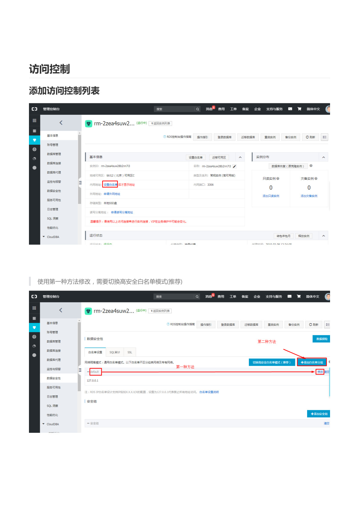

进入实例详情 → **数据安全性 → 白名单设置**。默认白名单只有 `127.0.0.1`（等于拒绝所有外部访问），必须把客户端 IP 加进来。

有两种修改方法：

- **第一种方法（推荐）**：切换到「高安全白名单模式」，按分组管理白名单；
- **第二种方法**：直接「修改」默认白名单。


### 3.2 切换高安全白名单模式（推荐）

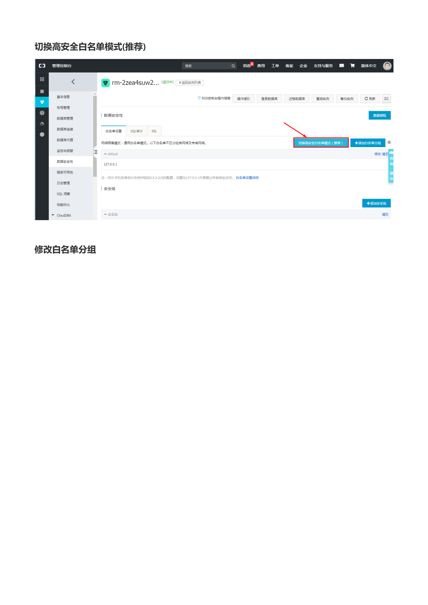

点击「**切换为高安全白名单模式（推荐）**」。

### 3.3 修改白名单分组

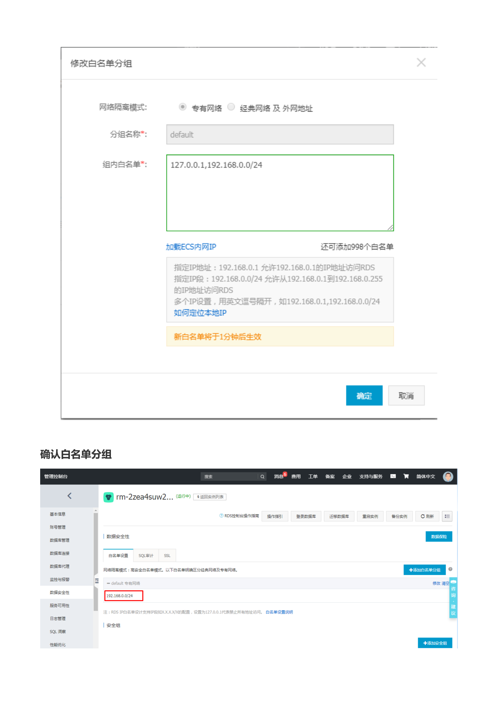

在分组 `default` 的「组内白名单」中填写：

```
127.0.0.1,192.168.0.0/24
```

- 指定 IP `192.168.0.1`：允许单个 IP 访问；
- 指定网段 `192.168.0.0/24`：允许 192.168.0.1–192.168.0.255 整个网段访问（即交换机内的 ECS 都能访问）；
- 多个 IP 用英文逗号隔开；
- 新白名单将于 **1 分钟后生效**。


> **教学说明**：
> - 白名单是 RDS 的第一道防线：**不在白名单里的 IP，即使有账号密码也连不上**。
> - 如果 ECS 与 RDS 在同一 VPC/交换机，直接放行交换机网段 `192.168.0.0/24` 即可；如果要从公网访问，需填写自己的出口公网 IP。
> - 千万不要图省事写 `0.0.0.0/0`（对所有 IP 开放）。

## 4. 查看内网访问地址

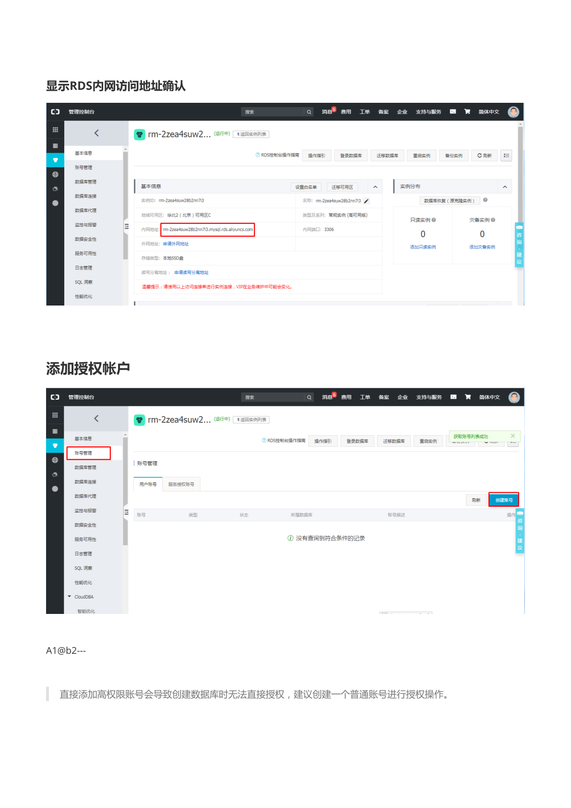

实例详情「基本信息」中的**内网地址**（如 `rm-2zea4suw28b2nn7i3.mysql.rds.aliyuncs.com`，端口 3306）就是后续连接数据库用的地址。

> **教学说明**：RDS 提供「内网地址」和「外网地址」两套地址：
> - **内网地址**：同 VPC 内的 ECS 免费访问，推荐；
> - **外网地址**：需手动申请，存在公网暴露风险，且产生流量费。

## 5. 添加授权帐户


实例详情 → **账号管理 → 创建账号**。

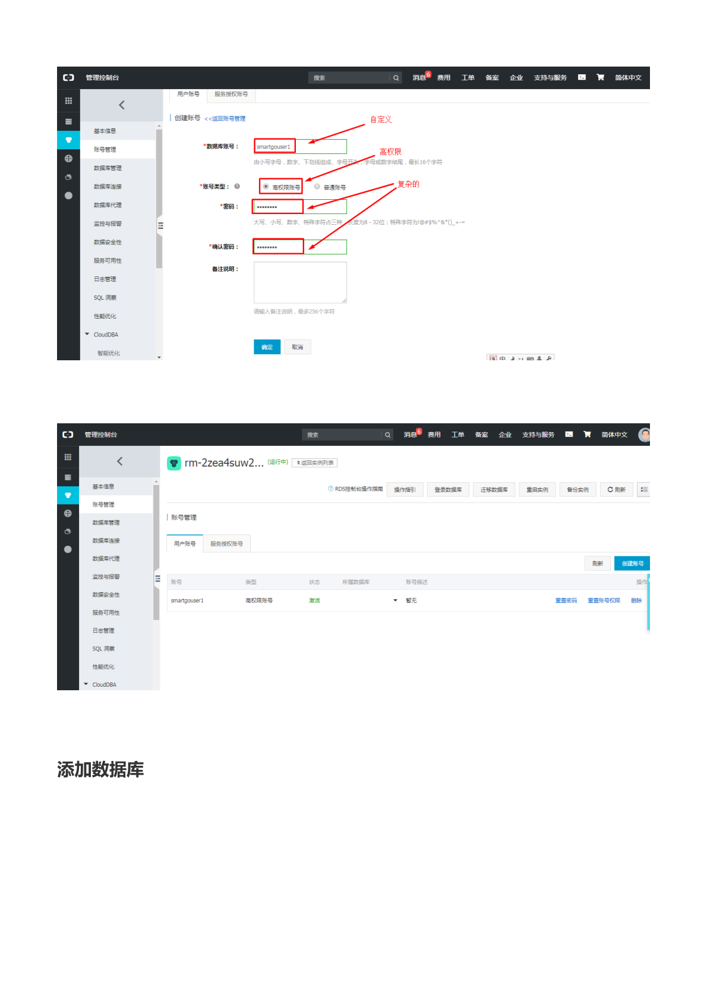

- **数据库账号**：自定义，如 `smartgouser1`（创建数据库后会自动补后缀）。
- **账号类型**：选择「**普通账号**」（创建后需再给某个库授权）或「高权限账号」。
- **密码**：大写字母、小写字母、数字、特殊字符中至少三类，8–32 位。

> **注意（原文提示）**：**直接添加高权限账号会导致创建数据库时无法直接授权，建议创建一个普通账号进行授权操作。** 教程密码示例为 `A1@b2---` 一类复杂密码（仅作演示，请自拟）。


## 6. 添加数据库

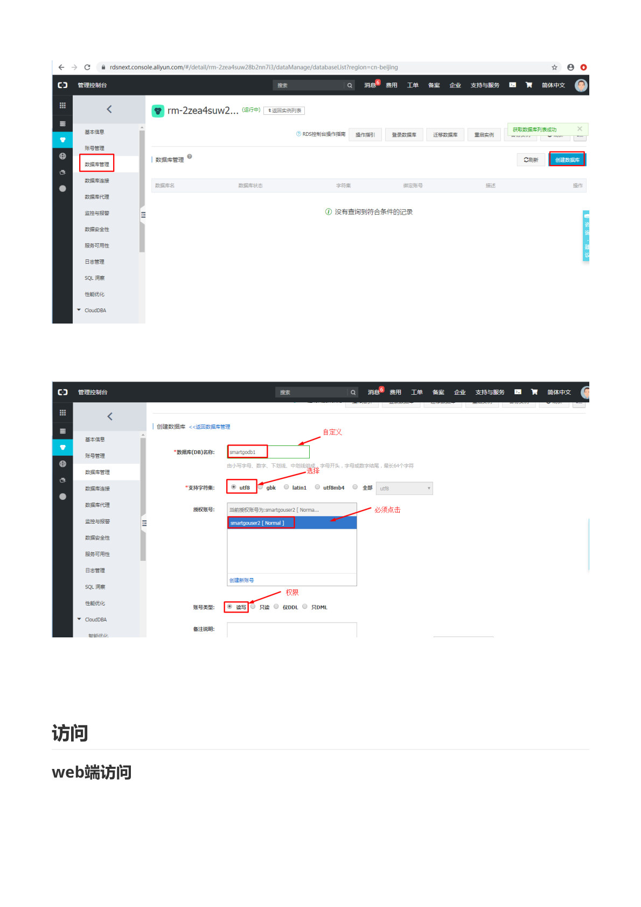

实例详情 → **数据库管理 → 创建数据库**。


- **数据库（DB）名称**：自定义，如 `smartgodb1`。
- **支持字符集**：选择 `utf8`（避免中文乱码）。
- **授权账号**：选择刚创建的普通账号（如 `smartgouser2 [Normal]`），**必须点击选中**。
- **账号类型**：选择「**读写**」（另有只读、仅 DML、仅 DDL）。

## 7. 访问（一）：Web 端（DMS 控制台）

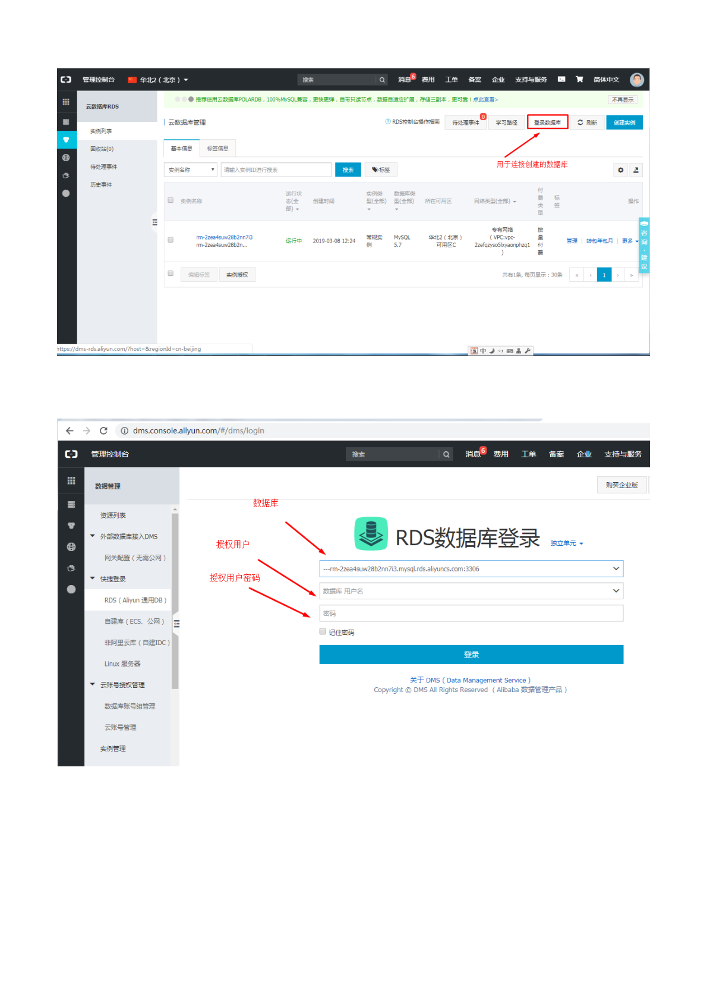

在实例列表点击「**登录数据库**」，跳转到 **DMS 数据管理平台**登录页，填写：

- **数据库地址**：`rm-2zea4suw28b2nn7i3.mysql.rds.aliyuncs.com:3306`（自动带出）；
- **数据库用户名**：授权的账号；
- **密码**：对应密码。

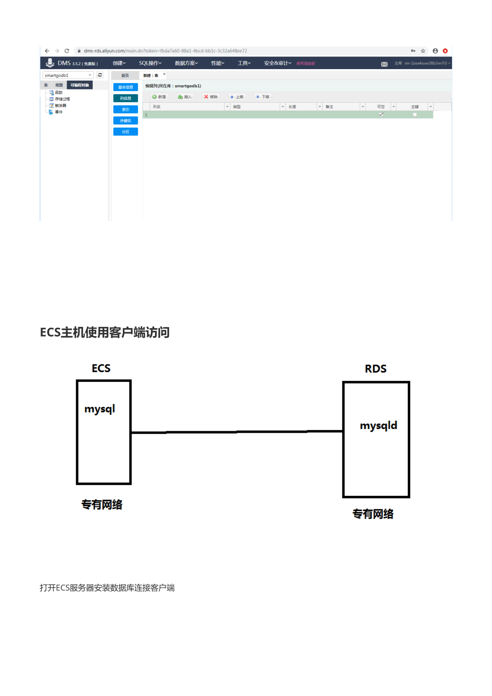

登录后即可在 DMS 中对数据库 `smartgodb1` 进行建表、查询、导入导出等操作。

> **教学说明**：DMS 是阿里云免费的**网页版数据库管理工具**，不装任何客户端就能管理 RDS，适合临时查看/运维；开发调试时更常用客户端或程序直连。

## 8. 访问（二）：ECS 主机使用客户端访问


架构：ECS 上装 **mysql 客户端**，RDS 上运行 **mysqld 服务端**，两者处于同一**专有网络**，通过内网地址互连。

### 8.1 在 ECS 上安装客户端

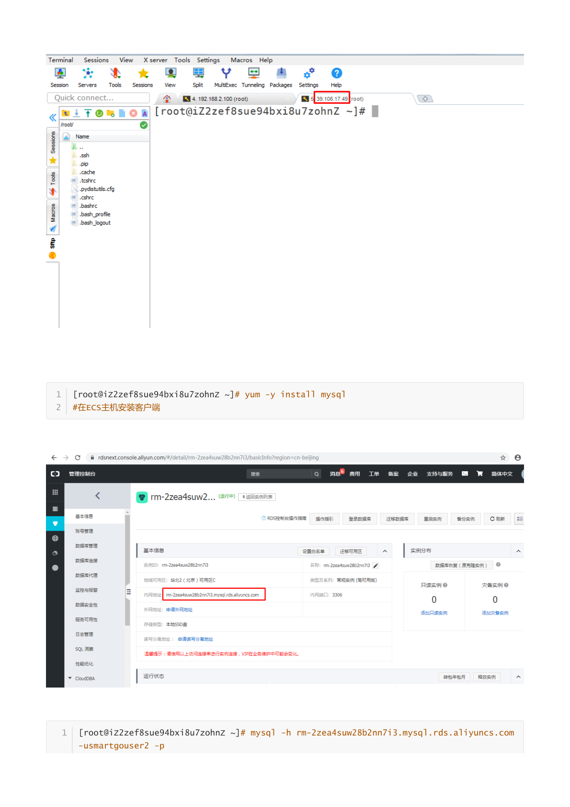

```bash
yum -y install mysql   # 在 ECS 主机安装客户端
```

### 8.2 从 ECS 连接 RDS


```bash
mysql -h rm-2zea4suw28b2nn7i3.mysql.rds.aliyuncs.com -usmartgouser2 -p
```

- `-h`：RDS 的**内网地址**（实例详情中复制）；
- `-u`：创建的普通账号；
- `-p`：回车后输入密码。

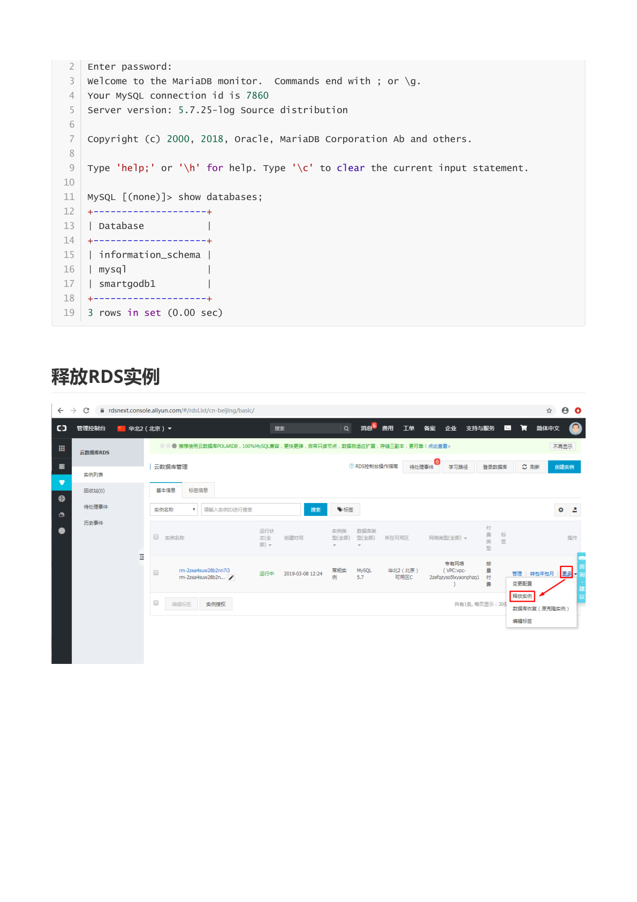

```text
Enter password:
Welcome to the MariaDB monitor.  Commands end with ; or \g.
Your MySQL connection id is 7860
Server version: 5.7.25-log Source distribution

MySQL [(none)]> show databases;
+--------------------+
| Database           |
+--------------------+
| information_schema |
| mysql              |
| smartgodb1         |
+--------------------+
3 rows in set (0.00 sec)
```

能看到自己创建的 `smartgodb1` 即访问成功。

> **常见排查思路**：
> 1. 连接超时 → 检查 RDS **白名单**是否放行了 ECS 的网段；
> 2. `Access denied` → 账号密码错误，或账号未被授权访问该库；
> 3. 使用了外网地址但未开通外网 → 在实例详情申请外网地址，或改用内网地址（ECS 与 RDS 必须同 VPC）。

## 9. 释放 RDS 实例


实验结束后，在实例列表「更多」→「**释放实例**」中立即释放，避免按量付费持续扣费。

> **注意**：释放后数据全部清除。若需要保留数据，先在「备份恢复」中把备份下载到本地/OSS。
