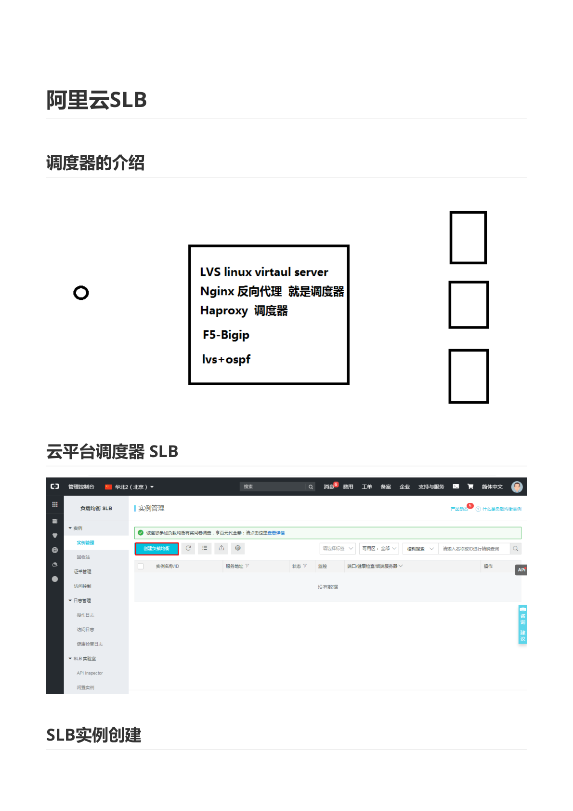
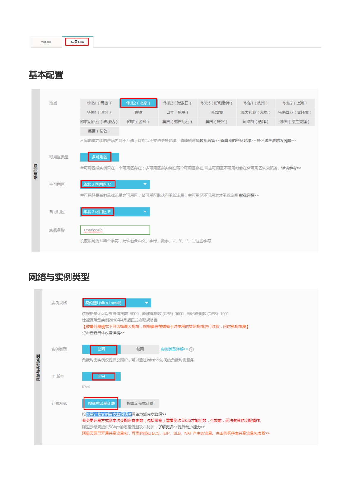
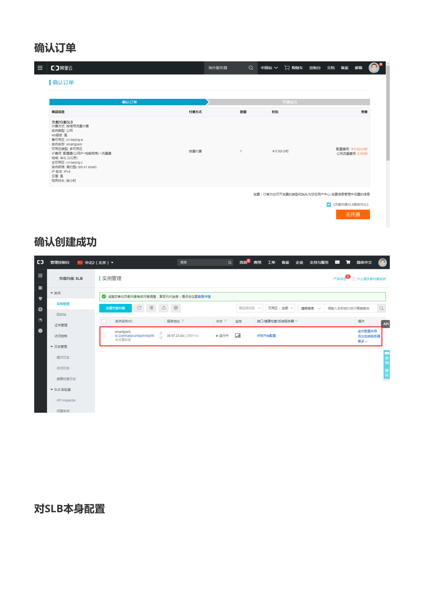
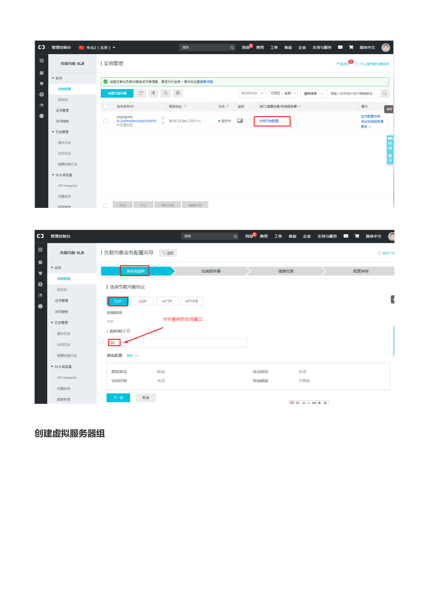
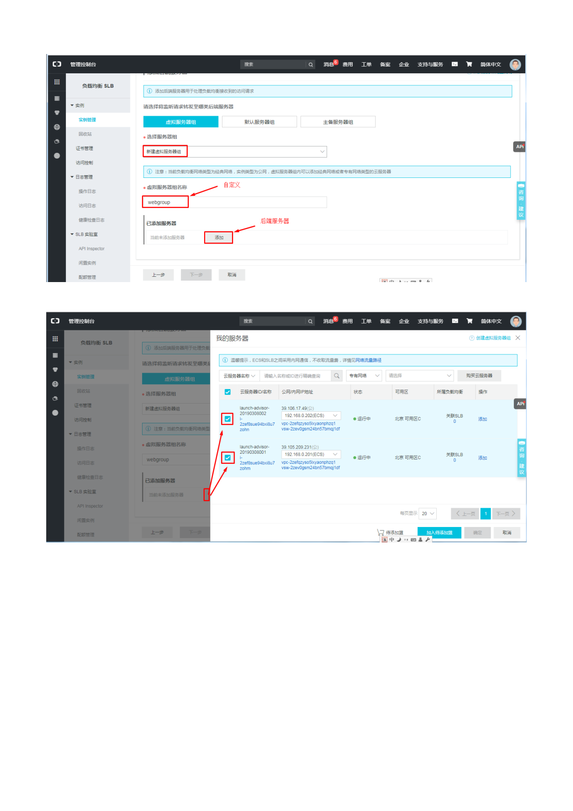
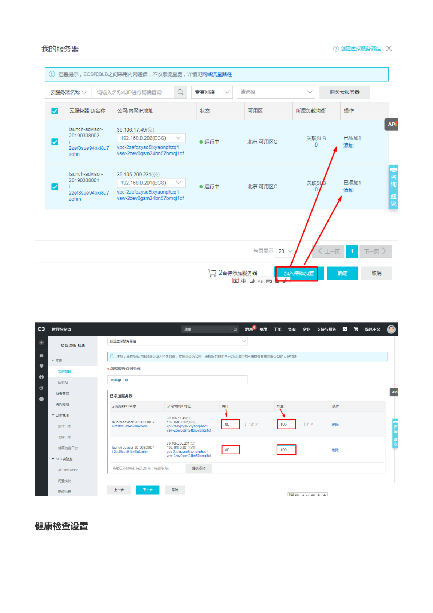
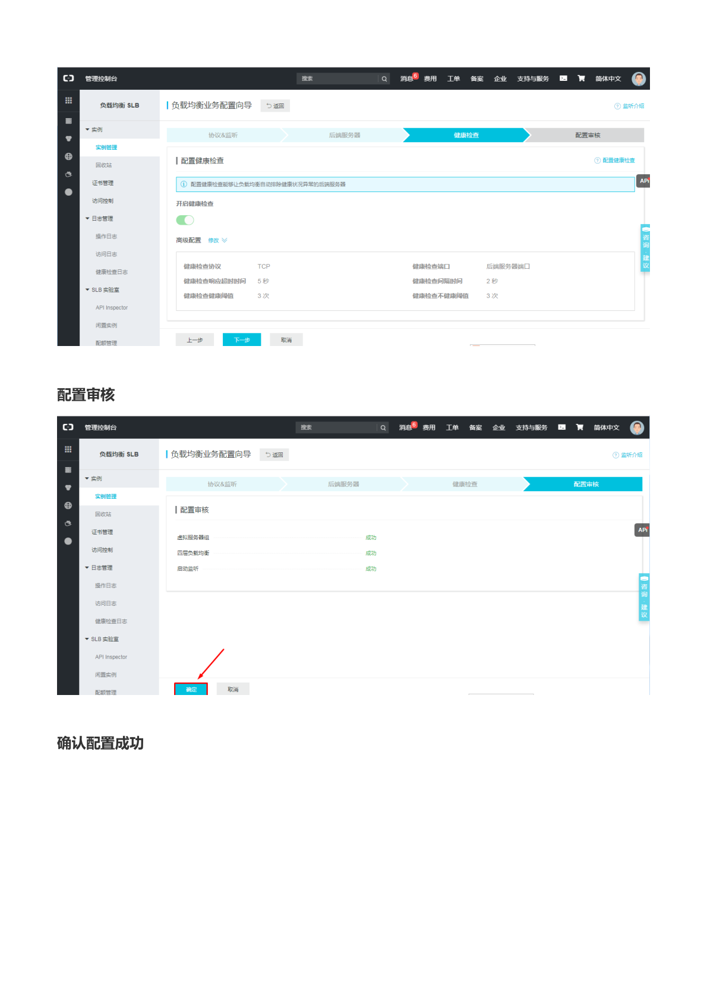
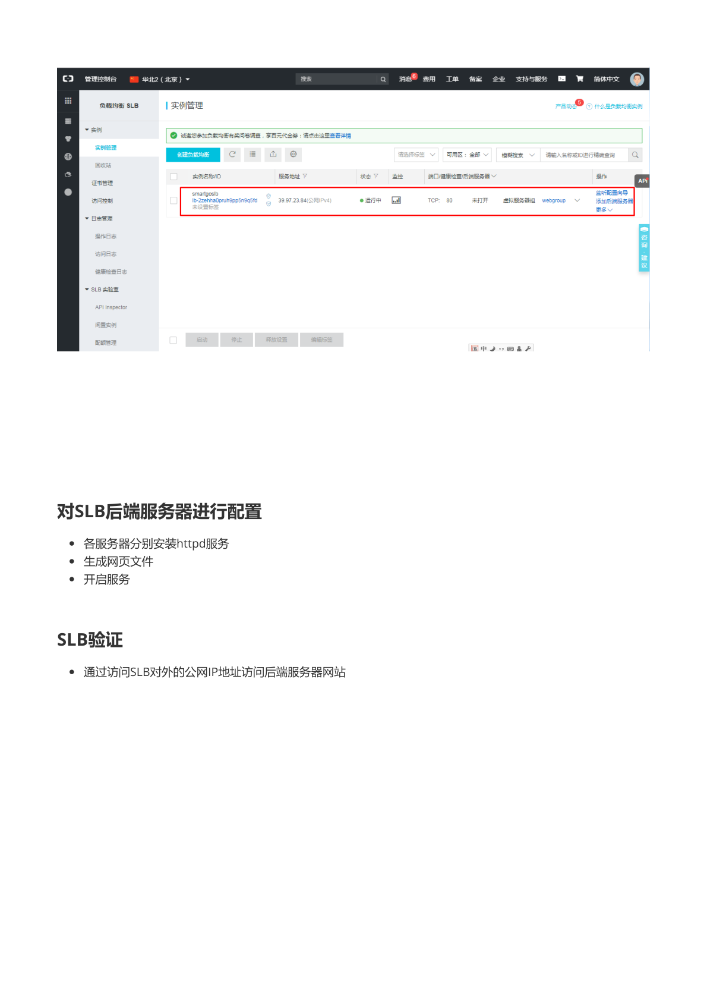

# 阿里云 SLB 负载均衡

> 本文档由《阿里云 SLB.pdf》整理而来，共 8 页截图，全部保存在 `img/` 目录中。
> 教学脉络：**了解调度器 → 创建 SLB 实例 → 配置监听 → 创建虚拟服务器组 → 健康检查 → 配置审核 → 部署后端服务并验证**。
> 前置条件：已按《阿里云ECS.md》创建好 **VPC（smartgovpc）+ 交换机（smartgosw）**，并最好准备 **2 台 ECS**（用于观察负载分发效果）。

---

## 1. 调度器的介绍



负载均衡（调度器）的常见实现：

| 方案 | 类型 |
| --- | --- |
| LVS（Linux Virtual Server） | 四层转发，内核级高性能 |
| Nginx 反向代理 | 七层，常见 Web 架构 |
| Haproxy | 四层/七层均可 |
| F5-Bigip | 硬件负载均衡设备 |
| lvs + ospf | 大规模网络负载分担 |

阿里云把这套能力做成了云产品 **SLB（Server Load Balancer，负载均衡 SLB）**，免运维、支持健康检查、可弹性扩容。

## 2. SLB 实例创建

### 2.1 进入负载均衡控制台


控制台搜索「负载均衡 SLB」，在 **实例管理** 页点击「**创建负载均衡**」。

### 2.2 基本配置



| 配置项 | 教程取值 | 说明 |
| --- | --- | --- |
| 地域 | **华北2（北京）** | 必须与后端 ECS 同地域 |
| 可用区类型 | **多可用区** | 主备可用区容灾 |
| 主可用区 | 华北 2 可用区 C | 承载流量 |
| 备可用区 | 华北 2 可用区 B | 主可用区故障时接管 |
| 实例名称 | `smartgoslb` | 自定义 |

> **教学说明**：SLB 是**地域级**资源；多可用区部署可以在机房级故障时自动切换，生产环境建议保留默认的多可用区配置。

### 2.3 网络与实例类型


| 配置项 | 教程取值 | 说明 |
| --- | --- | --- |
| 实例规格 | 简约型（slb.s1.small） | 最大连接数 5000，每秒新建 3000，QPS 1000 |
| 实例类型 | **公网** | 分配公网 IP，可从 Internet 访问；「私网」仅 VPC 内部使用 |
| IP 版本 | IPv4 | |
| 计费方式 | **按使用流量计费** | 与带宽峰值组合计费 |

> **教学说明**：
> - **公网 SLB** 对外提供服务；**私网 SLB** 用于内部分层架构（如 Web 层调 App 层）。
> - 后端 ECS 的流量经 SLB 分发时走**内网**，**不收取流量费**（页面提示：ECS 与 SLB 之间采用内网通信，不收取流量费）。

### 2.4 确认订单与创建成功




确认订单（按量付费，约 ¥0.061/小时 + 流量费，以页面为准）并「**去开通**」。实例列表中出现状态为「**运行中**」的实例 `smartgoslb`，并分配了公网 IP（39.97.23.84）。

## 3. 对 SLB 本身配置：添加监听



点击实例右侧「**配置监听**」，进入负载均衡业务配置向导（协议&监听 → 后端服务器 → 健康检查 → 配置审核）。

### 3.1 协议&监听


- **负载均衡协议**：`TCP`（也可选 UDP / HTTP / HTTPS，按业务选择）。
- **监听端口（对外端口）**：`80`。

> **教学说明**：
> - TCP 监听 = **四层**转发，原样转发 TCP 连接，性能高，不解析应用内容；
> - HTTP/HTTPS 监听 = **七层**转发，可基于 URL/Cookie 做会话保持、内容路由等高级功能。
> - 对端口映射：**监听端口**是用户访问 SLB 的端口，**后端端口**是 ECS 上服务实际监听的端口，两者可以不同（如 80 → 8080）。

## 4. 创建虚拟服务器组

### 4.1 选择服务器组并命名



在「后端服务器」步骤选择「**虚拟服务器组**」→「创建虚拟服务器组」：

- 服务器组类型：选择「**开通&去移除**」类型（即默认后端服务器组）；
- **虚拟服务器组名称**：自定义，如 `webgroup`；
- 点击「**添加**」按钮添加后端 ECS。

### 4.2 添加 ECS 到服务器组


在「我的服务器」弹窗中勾选同 VPC 下可用的 ECS（图中两台：39.106.17.48、39.105.209.231），点击「**加入待添加**」→「确定」。

> **注意**：只有与 SLB **网络类型匹配**（同 VPC）的 ECS 才会被列出；无法跨地域、跨 VPC 添加。



为每台后端服务器设置：

- **端口**：`80`（ECS 上 Web 服务监听的端口）；
- **权重**：`100`（权重越高，分到的请求越多；两台都是 100 即均分发）。

## 5. 健康检查设置



保持「开启健康检查」，默认配置：

| 参数 | 默认值 | 含义 |
| --- | --- | --- |
| 健康检查协议 | TCP | 探测方式 |
| 健康检查响应超时时间 | 5 秒 | 等待响应的时长 |
| 健康检查间隔时间 | 2 秒 | 探测频率 |
| 健康检查健康阈值 | 3 次 | 连续成功几次判定为健康 |
| 健康检查不健康阈值 | 3 次 | 连续失败几次判定为异常 |

> **教学说明**：健康检查是 SLB 高可用的核心——某台 ECS 服务挂掉后，SLB 会在数秒内把它**摘除**，请求全部发给健康节点；恢复后又自动加回。HTTP 业务可以改用 HTTP 检查并指定探测 URL，检查粒度更准确。

## 6. 配置审核


审核页显示「虚拟服务器组 / 后端服务器 / 监听」均已配置成功，点击「**提交**」。



实例列表中该实例的监听显示为 `TCP: 80`，虚拟服务器组为 `webgroup`，状态「运行中」。

## 7. 对 SLB 后端服务器进行配置

后端两台 ECS 分别执行：


1. **各服务器分别安装 httpd 服务**：

   ```bash
   yum -y install httpd
   ```

2. **生成网页文件**（为了验证负载分发，两台机器写不同内容）：

   ```bash
   # ECS-1
   echo "server-1" > /var/www/html/index.html
   # ECS-2
   echo "server-2" > /var/www/html/index.html
   ```

3. **开启服务**：

   ```bash
   systemctl start httpd
   systemctl enable httpd
   ```

## 8. SLB 验证


通过访问 **SLB 对外的公网 IP** 地址（如 `http://39.97.23.84`）访问后端服务器网站。

> **教学说明**：
> - 反复刷新页面，内容会在 `server-1` / `server-2` 之间轮换，说明负载均衡在按权重分发请求。
> - 单独停掉某一台的 httpd（`systemctl stop httpd`），SLB 会在健康检查超时后把该节点摘除，访问不再返回坏节点内容——这就是**健康检查 + 故障摘除**的效果。
> - 注意验证时访问的是 **SLB 的公网 IP**，而不是任何一台 ECS 的 IP。

## 9. 实验结束

- 释放 SLB 实例：实例管理 →「更多」→ 释放（按量付费实例闲置也计费）。
- 后端 ECS 释放/停机：《阿里云ECS.md》中的释放方法。
- 虚拟服务器组、监听随实例释放而删除，无需单独处理。
