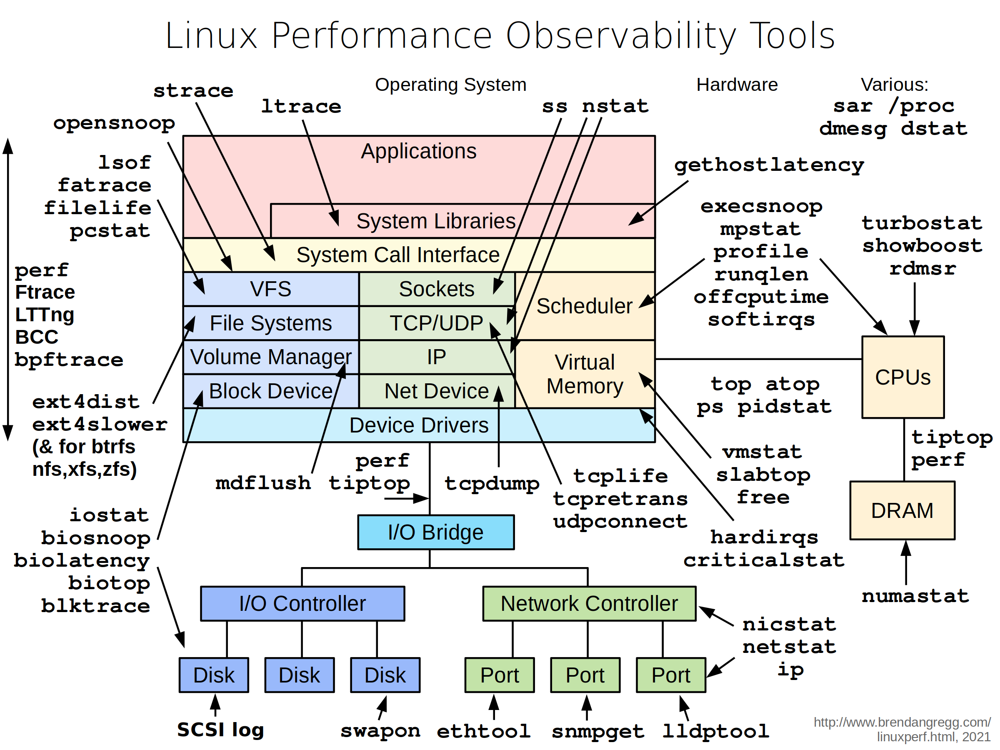

<font style="color:rgb(0, 0, 0);background-color:rgba(0, 0, 0, 0);">这张图是 Brendan Gregg 绘制的经典 </font>**<font style="color:rgb(0, 0, 0);background-color:rgba(0, 0, 0, 0);">Linux 性能观测工具全景图</font>**<font style="color:rgb(0, 0, 0);background-color:rgba(0, 0, 0, 0);">，它把 Linux 系统从应用层到底层硬件的结构，和对应层级的性能排查工具一一对应起来，相当于一份「性能问题排查地图」。</font>

<font style="color:rgb(0, 0, 0);background-color:rgba(0, 0, 0, 0);">下面我按从上到下、从内到外的结构，给你逐层拆解。</font>

---

## <font style="color:rgb(0, 0, 0);background-color:rgba(0, 0, 0, 0);">一、整体结构概览</font>
<font style="color:rgb(0, 0, 0);background-color:rgba(0, 0, 0, 0);">整个系统分为三大块：</font>

1. **<font style="color:rgb(0, 0, 0);background-color:rgba(0, 0, 0, 0);">应用与操作系统层（上半部分的分层方块）</font>**<font style="color:rgb(0, 0, 0);background-color:rgba(0, 0, 0, 0);">：从应用程序到系统调用，再到文件系统、网络、内存、调度器等内核子系统。</font>
2. **<font style="color:rgb(0, 0, 0);background-color:rgba(0, 0, 0, 0);">设备驱动与硬件层（下半部分）</font>**<font style="color:rgb(0, 0, 0);background-color:rgba(0, 0, 0, 0);">：I/O 桥接、磁盘控制器、网卡、CPU、内存等硬件。</font>
3. **<font style="color:rgb(0, 0, 0);background-color:rgba(0, 0, 0, 0);">工具集（箭头标注）</font>**<font style="color:rgb(0, 0, 0);background-color:rgba(0, 0, 0, 0);">：每个箭头指向的工具，都可以观测对应层级的系统行为。</font>

---

## <font style="color:rgb(0, 0, 0);background-color:rgba(0, 0, 0, 0);">二、逐层拆解：系统层级 + 对应工具</font>
### <font style="color:rgb(0, 0, 0);background-color:rgba(0, 0, 0, 0);">1. 最上层：Applications / System Libraries（应用与系统库）</font>
+ **<font style="color:rgb(0, 0, 0);background-color:rgba(0, 0, 0, 0);">层级含义</font>**<font style="color:rgb(0, 0, 0);background-color:rgba(0, 0, 0, 0);">：用户直接运行的程序，以及程序调用的系统库（如 </font>`<font style="color:rgb(0, 0, 0);background-color:rgba(0, 0, 0, 0);">libc</font>`<font style="color:rgb(0, 0, 0);background-color:rgba(0, 0, 0, 0);">）。</font>

```bash
centos7 的lib位置
lrwxrwxrwx.   1 root root    7 Aug 28  2024 lib -> usr/lib
lrwxrwxrwx.   1 root root    9 Aug 28  2024 lib64 -> usr/lib64

ldd 是 List Dynamic Dependencies（列出动态库依赖关系） 
```

+ **<font style="color:rgb(0, 0, 0);background-color:rgba(0, 0, 0, 0);">观测工具</font>**<font style="color:rgb(0, 0, 0);background-color:rgba(0, 0, 0, 0);">：</font>
    - `<font style="color:rgb(0, 0, 0);background-color:rgba(0, 0, 0, 0);">strace</font>`<font style="color:rgb(0, 0, 0);background-color:rgba(0, 0, 0, 0);">：跟踪进程的系统调用（比如 </font>`<font style="color:rgb(0, 0, 0);background-color:rgba(0, 0, 0, 0);">open</font>`<font style="color:rgb(0, 0, 0);background-color:rgba(0, 0, 0, 0);">/</font>`<font style="color:rgb(0, 0, 0);background-color:rgba(0, 0, 0, 0);">read</font>`<font style="color:rgb(0, 0, 0);background-color:rgba(0, 0, 0, 0);">/</font>`<font style="color:rgb(0, 0, 0);background-color:rgba(0, 0, 0, 0);">write</font>`<font style="color:rgb(0, 0, 0);background-color:rgba(0, 0, 0, 0);"> 等），排查程序卡在哪个系统调用上。</font>
    - `<font style="color:rgb(0, 0, 0);background-color:rgba(0, 0, 0, 0);">ltrace</font>`<font style="color:rgb(0, 0, 0);background-color:rgba(0, 0, 0, 0);">：跟踪进程调用的库函数（比如 </font>`<font style="color:rgb(0, 0, 0);background-color:rgba(0, 0, 0, 0);">libc</font>`<font style="color:rgb(0, 0, 0);background-color:rgba(0, 0, 0, 0);"> 里的 </font>`<font style="color:rgb(0, 0, 0);background-color:rgba(0, 0, 0, 0);">malloc</font>`<font style="color:rgb(0, 0, 0);background-color:rgba(0, 0, 0, 0);">/</font>`<font style="color:rgb(0, 0, 0);background-color:rgba(0, 0, 0, 0);">printf</font>`<font style="color:rgb(0, 0, 0);background-color:rgba(0, 0, 0, 0);">），定位库函数级别的性能问题。</font>
    - `<font style="color:rgb(0, 0, 0);background-color:rgba(0, 0, 0, 0);">opensnoop</font>`<font style="color:rgb(0, 0, 0);background-color:rgba(0, 0, 0, 0);">：专门跟踪文件打开操作，快速定位程序频繁打开 / 关闭文件导致的性能问题。</font>

```bash
yum install -y strace ltrace bcc-tools
ln -s /usr/share/bcc/tools/opensnoop /usr/local/bin/
# 安装内核头文件 + 内核开发包（必须和你当前内核版本一致） opensnoop需要
yum install -y kernel-devel-$(uname -r) kernel-headers-$(uname -r)

[root@m01 ~]# opensnoop    #实时显示
PID    COMM               FD ERR PATH
684    irqbalance          3   0 /proc/interrupts
684    irqbalance          3   0 /proc/stat


[root@m01 ~]# strace ls
execve("/usr/bin/ls", ["ls"], 0x7ffe8ae90380 /* 21 vars */) = 0
brk(NULL)                               = 0xc22000
。。。。。
brk：调整进程堆内存的大小
mmap：内存映射，申请一块内存（Linux 最常用的内存分配方式）
fstat：获取文件状态（大小、权限、类型等）
mprotect：设置内存权限  PROT_NONE：禁止访问（内存保护，防止越界）
ioctl：终端控制获取终端的行列大小（决定 ls 输出排版）
openat：打开目录
getdents：读取目录内容（ls 的核心调用）

总结（最关键）
execve：启动 ls 程序
mmap/open/close：加载所有依赖的系统库
openat + getdents：真正读取当前目录（ls 的核心功能）
write：把目录文件名打印到屏幕
exit_group：进程正常退出
整个 strace ls 就是：启动程序 → 加载依赖 → 读目录 → 输出结果 → 退出。
总结
strace 跟踪的是用户程序 → 内核的系统调用，是排查命令故障的神器
ls 90% 的调用都是加载库、初始化环境，只有最后几步是真正列目录
常见关键调用：open/read/write/close/mmap/execve/exit
返回值 =0 成功，=-1 失败，数字 = 文件描述符

[root@m01 ~]# ltrace ls
__libc_start_main(0x402910, 1, 0x7ffc62346208, 0x4129a0 <unfinished ...>
strrchr("ls", '/')                                                   = nil
setlocale(LC_ALL, "")                                                = "en_US.UTF-8"
。。。。
简单说：
strace：程序 → 内核（系统调用）
ltrace：程序 → 动态库（C 库 / 第三方库）

最核心总结（一看就懂）
ltrace 跟踪的是库函数（malloc、open、read、write 等）
ls 执行流程：
初始化环境
解析参数
打开目录
读取所有文件
输出文件名
释放内存
退出
最关键库函数：
opendir / readdir：读目录
malloc / free：内存管理
fwrite：输出内容
总结
strace = 系统调用（程序↔内核）
ltrace = 库函数调用（程序↔动态库）
你看到的 ltrace ls 就是：打开目录 → 读文件 → 输出 → 退出 的完整库函数轨迹。


```

### <font style="color:rgb(0, 0, 0);background-color:rgba(0, 0, 0, 0);">2. 第二层：System Call Interface（系统调用接口）</font>
+ **<font style="color:rgb(0, 0, 0);background-color:rgba(0, 0, 0, 0);">层级含义</font>**<font style="color:rgb(0, 0, 0);background-color:rgba(0, 0, 0, 0);">：用户程序和内核交互的入口，所有文件读写、网络收发、内存分配都要通过系统调用完成。</font>
+ **<font style="color:rgb(0, 0, 0);background-color:rgba(0, 0, 0, 0);">观测工具</font>**<font style="color:rgb(0, 0, 0);background-color:rgba(0, 0, 0, 0);">：</font>
    - `<font style="color:rgb(0, 0, 0);background-color:rgba(0, 0, 0, 0);">lsof</font>`<font style="color:rgb(0, 0, 0);background-color:rgba(0, 0, 0, 0);">：列出进程打开的所有文件（包括普通文件、套接字、管道），排查文件句柄泄漏。</font>
    - `<font style="color:rgb(0, 0, 0);background-color:rgba(0, 0, 0, 0);">fatrace</font>`<font style="color:rgb(0, 0, 0);background-color:rgba(0, 0, 0, 0);">/</font>`<font style="color:rgb(0, 0, 0);background-color:rgba(0, 0, 0, 0);">filelife</font>`<font style="color:rgb(0, 0, 0);background-color:rgba(0, 0, 0, 0);">/</font>`<font style="color:rgb(0, 0, 0);background-color:rgba(0, 0, 0, 0);">pcstat</font>`<font style="color:rgb(0, 0, 0);background-color:rgba(0, 0, 0, 0);">：跟踪文件访问、文件生命周期、文件缓存状态，定位文件 I/O 瓶颈。</font>
    - `<font style="color:rgb(0, 0, 0);background-color:rgba(0, 0, 0, 0);">perf</font>`<font style="color:rgb(0, 0, 0);background-color:rgba(0, 0, 0, 0);">/</font>`<font style="color:rgb(0, 0, 0);background-color:rgba(0, 0, 0, 0);">ftrace</font>`<font style="color:rgb(0, 0, 0);background-color:rgba(0, 0, 0, 0);">/</font>`<font style="color:rgb(0, 0, 0);background-color:rgba(0, 0, 0, 0);">LTTng</font>`<font style="color:rgb(0, 0, 0);background-color:rgba(0, 0, 0, 0);">/</font>`<font style="color:rgb(0, 0, 0);background-color:rgba(0, 0, 0, 0);">BCC</font>`<font style="color:rgb(0, 0, 0);background-color:rgba(0, 0, 0, 0);">/</font>`<font style="color:rgb(0, 0, 0);background-color:rgba(0, 0, 0, 0);">bpfrace</font>`<font style="color:rgb(0, 0, 0);background-color:rgba(0, 0, 0, 0);">：高级跟踪工具，能深入系统调用、内核函数甚至硬件层面分析性能，是现代 Linux 性能排查的瑞士军刀。</font>

```bash
lsof = list open files，意思是列出所有进程正在打开的文件。
Linux 一切皆文件：普通文件、目录、库、管道、网络连接、设备都算文件。

COMMAND  PID  TID  USER  FD      TYPE     DEVICE  SIZE/OFF   NODE   NAME
命令名   进程ID 线程ID 用户  文件描述符 类型     设备号   大小/偏移  inode  文件名/路径
FD（File Descriptor）
文件描述符，进程用这个数字找到文件
常见值：
cwd：当前工作目录
rtd：根目录   ：root directory，进程的根目录
txt：程序代码 / 二进制文件
mem：内存映射的库文件
数字：普通打开的文件（0 = 输入 1 = 输出 2 = 错误）

TYPE
文件类型
DIR：目录
REG：普通文件
CHR：字符设备
FIFO：管道

DEVICE
设备号（主：次），253,0 对应 /dev/vda1 系统盘

[root@m01 ~]# lsof  | head -20
COMMAND    PID  TID    USER   FD      TYPE             DEVICE  SIZE/OFF       NODE NAME
systemd      1         root  cwd       DIR              253,0       244         64 /
systemd      1         root  rtd       DIR              253,0       244         64 /
systemd      1         root  txt       REG              253,0   1632960     271854 /usr/lib/systemd/systemd
systemd      1         root  mem       REG              253,0     20064      43506 /usr/lib64/libuuid.so.1.3.0

超级精简总结（你只需要记这 6 条）
lsof -p PID        # 看进程打开的文件
lsof -c nginx      # 看程序打开的文件
lsof -i :80        # 看谁占用端口
lsof 文件名         # 谁在使用这个文件
lsof +D 目录        # 谁在占用目录
lsof | grep deleted # 查找已删除但未释放的文件

yum install -y  bcc-tools
ln -s /usr/share/bcc/tools/filelife /usr/local/bin/

# 下载地址
https://github.com/tobert/pcstat/releases/download/v0.0.1/pcstat_0.0.1_x86_64.rpm
yum install  pcstat_0.0.1_x86_64.rpm

# 安装必要的依赖
sudo yum install gcc make git -y
# 克隆 fatrace 源码仓库
git clone https://github.com/martinpitt/fatrace.git
# 进入项目目录并编译
cd fatrace
make CFLAGS="-std=c99"
# 将编译后的 fatrace 可执行文件移动到系统路径
sudo cp fatrace /usr/local/bin/


fatrace：跟踪谁在读写文件（最常用！）
作用
实时监控整个系统的文件读 / 写 / 打开 / 关闭
能看到：哪个进程、PID、读写了哪个文件
R = Read 读
W = Write 写
O = Open 打开
C = Close 关闭
组合字母 = 连续操作

1. 实时监控所有文件访问（排查谁在疯狂写盘）
fatrace
2. 只监控写操作（排查谁在占磁盘 I/O）
fatrace -w
3. 监控某个目录下的文件（排查应用日志 / 数据目录）
fatrace -C /var/log
fatrace -C /data
[root@m01 ~]# fatrace |head -10
head(9337): O   /usr/lib/locale/locale-archive
head(9337): RCO /usr/share/locale/locale.alias

filelife：查看文件存活时间
作用
监控文件从创建到删除活了多久
专门排查：临时文件疯狂创建删除、磁盘 I/O 抖动
filelife
输出
plaintext
PID    COMM             FILE          AGE(ms)
1234   python           tmp.txt       42
AGE 就是文件存活毫秒数，越小说明创建删除越频繁。


pcstat：查看文件是否在内存缓存
作用
查看文件有多少在 page cache 里
判断：读慢是不是因为没缓存、频繁读磁盘
运维最常用 2 条
1. 查看某个文件缓存状态
pcstat /var/log/messages
pcstat /data/app.jar
2. 同时看多个文件
pcstat /data/*
输出解释
plaintext
+-------------------+----------------+------------+-----------+
| FILE              | SIZE           | CACHED     | PERCENT |
+-------------------+----------------+------------+-----------+
| /data/app.log     | 123456         | 123456     | 100.0%    |
+-------------------+----------------+------------+-----------+
100% 缓存 → 读极快
0% 缓存 → 每次读都走磁盘，慢！

四、Linux 运维工程师最经典 3 大 I/O 排查场景
场景 1：磁盘 I/O 高，不知道谁在读写？
fatrace -w
直接看到谁在疯狂写文件。
场景 2：磁盘频繁读写，但看不到大文件？
filelife
看是不是大量临时文件频繁创建删除。
场景 3：读取文件特别慢，怀疑没缓存？
pcstat 文件名
看是否百分比很低，说明没读到缓存里，每次都读物理磁盘。

超级总结（你只需要记这 6 条）
fatrace            # 监控所有文件访问
fatrace -w         # 只看谁在写文件（排查I/O高）
fatrace -C /dir     # 监控某个目录
filelife           # 看谁在疯狂创建删除临时文件
pcstat 文件        # 看文件是否在内存缓存
pcstat /dir/*      # 看目录下所有文件缓存

 I/O 排查工具选择图（面试 / 工作必用）
看谁在读写文件 → fatrace
看临时文件疯狂创建删除 → filelife
看文件是否在缓存 → pcstat
看进程打开文件 → lsof
看系统 I/O 整体情况 → iostat
看进程系统调用 → strace


yum install -y perf
yum install -y lttng-tools lttng-ust
yum install -y bcc bcc-tools


ftrace 不是一个普通命令！没有 /usr/bin/ftrace 这种可执行文件
它是内核内置的跟踪框架，完全通过 /sys 目录下的文件读写 来工作。
本质是：/sys/kernel/debug/tracing/ 下面的一堆文件  
先挂载（必须执行）
mount -t debugfs none /sys/kernel/debug


LTTng：安装 lttng-tools，命令是 lttng
BCC：安装 bcc-tools，工具都在 /usr/share/bcc/tools/，必须软链接才能全局调用

# 软链接 BCC 常用工具
ln -s /usr/share/bcc/tools/opensnoop /usr/local/bin/
ln -s /usr/share/bcc/tools/execsnoop /usr/local/bin/
ln -s /usr/share/bcc/tools/biolatency /usr/local/bin/
ln -s /usr/share/bcc/tools/filetop /usr/local/bin/
ln -s /usr/share/bcc/tools/trace /usr/local/bin/
ln -s /usr/share/bcc/tools/funccount /usr/local/bin/
ln -s /usr/share/bcc/tools/argdist /usr/local/bin/


一、perf（万能性能采样工具）最常用 4 条
1. 查看系统 CPU 最热函数（找 CPU 高）
思路：CPU 高？不知道谁占的？perf top 直接看。
perf top
能看到：
    内核函数消耗 CPU
    应用程序函数消耗 CPU
    哪个函数最耗 CPU
2. 抓取 10 秒性能采样（生成报告）
思路：后台采样，定位慢调用
perf record -F 99 -a -g -- sleep 10
perf report
用途：
  排查 Java/C++/Go 程序 CPU 高
  排查系统卡顿
3. 查看系统 page fault（内存慢）
思路：应用读取文件慢、内存访问慢
perf stat -e page-faults -a -- sleep 3
  看是否大量缺页异常 → 内存不够 / 缓存失效
4. 查看 I/O 延迟（块设备 I/O 慢）
perf trace -a
  能看到所有进程系统调用，排查谁在慢 I/O
二、ftrace（内核级跟踪，排查内核 / 驱动 / 系统延迟）最常用 2 条
5. 查看函数调用栈（排查内核延迟）
思路：系统卡顿、内核态 CPU 高、I/O 卡住
echo 1 > /sys/kernel/debug/tracing/events/sched/sched_switch/enable
cat /sys/kernel/debug/tracing/trace
能看到：
    进程切换
    为什么进程被阻塞
    内核函数调用路径
6. 查看系统函数调用耗时
  思路：系统调用特别慢，比如 open/read/write
echo function_graph > /sys/kernel/debug/tracing/current_tracer
cat /sys/kernel/debug/tracing/trace
  显示每个内核函数耗时多少，直接定位慢函数。
三、LTTng（高性能追踪，排查复杂长时间问题）最常用 1 条
7. 抓取系统完整事件（适合复杂故障）
思路：故障难复现、需要记录历史轨迹
lttng create
lttng enable-event -k -a
lttng start
sleep 10
lttng stop
lttng view
能抓：
    进程创建销毁
    系统调用
    文件打开
    网络事件
    磁盘 I/O
    适合最难排查的隐现故障。
四、BCC（BPF 超级排障工具集）最常用 3 条
8. biolatency：查看磁盘 I/O 延迟（排查慢盘神器）
思路：磁盘 I/O 高、应用卡顿、写数据库慢
biolatency
输出：
  I/O 延迟分布
  多少 I/O 在 1ms 内
  多少 I/O 超过 10ms（慢 I/O）
9. opensnoop：实时查看谁在打开文件（排查文件 I/O 瓶颈）
思路：不知道谁在疯狂打开文件、文件描述符暴涨
opensnoop
直接显示：
    PID
    进程名
    打开的文件路径
10. execsnoop：实时监控谁在频繁创建进程（排查 fork 炸弹）
思路：系统卡顿、CPU 高、大量短进程
execsnoop
    能看到：
    谁在不停执行新进程
    频繁 sh/crontab/ 脚本 导致负载高


```


### <font style="color:rgb(0, 0, 0);background-color:rgba(0, 0, 0, 0);">3. 第三层：内核子系统（按功能划分）</font>
<font style="color:rgb(0, 0, 0);background-color:rgba(0, 0, 0, 0);">这一层是 Linux 内核的核心，分为文件系统、网络、内存、CPU 调度四大模块：</font>

#### <font style="color:rgb(0, 0, 0);background-color:rgba(0, 0, 0, 0);">（1）文件系统与存储栈（左侧）</font>
<font style="color:rgb(0, 0, 0);background-color:rgba(0, 0, 0, 0);">从上层到底层依次是：VFS（虚拟文件系统）→ 具体文件系统（ext4/xfs/btrfs 等）→ 卷管理器 → 块设备 → 设备驱动</font>

+ **<font style="color:rgb(0, 0, 0);background-color:rgba(0, 0, 0, 0);">关键工具</font>**<font style="color:rgb(0, 0, 0);background-color:rgba(0, 0, 0, 0);">：</font>
    - `<font style="color:rgb(0, 0, 0);background-color:rgba(0, 0, 0, 0);">ext4dist</font>`<font style="color:rgb(0, 0, 0);background-color:rgba(0, 0, 0, 0);">/</font>`<font style="color:rgb(0, 0, 0);background-color:rgba(0, 0, 0, 0);">ext4slower</font>`<font style="color:rgb(0, 0, 0);background-color:rgba(0, 0, 0, 0);">/</font>`<font style="color:rgb(0, 0, 0);background-color:rgba(0, 0, 0, 0);">nfs/xfs/zfs</font>`<font style="color:rgb(0, 0, 0);background-color:rgba(0, 0, 0, 0);"> 系列工具：针对不同文件系统的延迟和分布统计，排查文件系统级别的慢操作。</font>
    - `<font style="color:rgb(0, 0, 0);background-color:rgba(0, 0, 0, 0);">iostat</font>`<font style="color:rgb(0, 0, 0);background-color:rgba(0, 0, 0, 0);">/</font>`<font style="color:rgb(0, 0, 0);background-color:rgba(0, 0, 0, 0);">biosnoop</font>`<font style="color:rgb(0, 0, 0);background-color:rgba(0, 0, 0, 0);">/</font>`<font style="color:rgb(0, 0, 0);background-color:rgba(0, 0, 0, 0);">biolatency</font>`<font style="color:rgb(0, 0, 0);background-color:rgba(0, 0, 0, 0);">/</font>`<font style="color:rgb(0, 0, 0);background-color:rgba(0, 0, 0, 0);">biotop</font>`<font style="color:rgb(0, 0, 0);background-color:rgba(0, 0, 0, 0);">/</font>`<font style="color:rgb(0, 0, 0);background-color:rgba(0, 0, 0, 0);">blktrace</font>`<font style="color:rgb(0, 0, 0);background-color:rgba(0, 0, 0, 0);">：块设备 I/O 监控，查看磁盘读写速率、IOPS、队列长度、I/O 延迟，是磁盘瓶颈排查的核心工具。</font>
    - `<font style="color:rgb(0, 0, 0);background-color:rgba(0, 0, 0, 0);">mdf lush</font>`<font style="color:rgb(0, 0, 0);background-color:rgba(0, 0, 0, 0);">：监控 </font>`<font style="color:rgb(0, 0, 0);background-color:rgba(0, 0, 0, 0);">mdflush</font>`<font style="color:rgb(0, 0, 0);background-color:rgba(0, 0, 0, 0);"> 内核线程（负责软 RAID 设备的刷盘操作），排查 RAID 相关的性能问题。</font>
    - `<font style="color:rgb(0, 0, 0);background-color:rgba(0, 0, 0, 0);">swap on</font>`<font style="color:rgb(0, 0, 0);background-color:rgba(0, 0, 0, 0);">：监控交换分区使用情况，判断是否因为内存不足导致频繁换页到磁盘。</font>

```bash
Linux 下最常用、最稳、优先选的就是这几个：
xfs、ext4、btrfs、zfs，
ext4  优点：稳定、兼容性极强、几乎所有发行版都支持
xfs 适用：大数据、大文件、高并发
btrfs 地位：下一代 COW 文件系统  优点：
内置快照、压缩、校验、RAID
可以动态增删盘、方便回滚
缺点：复杂，极端场景稳定性不如 xfs/ext4
zfs
地位：功能最强、最安全
优点：
数据校验（防静默损坏）
超强快照、压缩、缓存、RAID-Z
缺点：内存要求高，许可证问题，Linux 内核不带
适合： 家庭 NAS、存储服务器  对数据安全要求极高的场景
Windows 常用 NTFS、exFAT。
ntfs  Windows 系统盘默认  支持大文件、权限、加密
exFAT  无 4GB 单文件限制  Windows / Mac / Linux 通用
FAT32   兼容性无敌 但单个文件不能 >4GB


机器变卡 → 先看是不是 IO 瓶颈
top          # 看 wa（iowait）高不高
vmstat 1     # 看 si so、bi bo、r b
iostat -x 1  # 看 %util、await
wa 高 → 找哪个进程在疯狂 IO
biotop
biosnoop
iotop
找到是磁盘慢，还是文件系统慢
xfsdist   或 ext4dist
biolatency
怀疑 NFS 慢
nfsslower
nfsstat -m
怀疑内存不够用开始 swap
vmstat 1
sar -W 1
grep VmSwap /proc/*/status

六、最简单总结（一句话）
看整体 IO：iostat -x 1
看谁在吃 IO：biotop、iotop
看每一条 IO：biosnoop
看 IO 延迟分布：biolatency
看文件系统慢操作：xfsslower / ext4slower
看 swap：vmstat、sar -W


```

#### <font style="color:rgb(0, 0, 0);background-color:rgba(0, 0, 0, 0);">（2）网络栈（中间）</font>
<font style="color:rgb(0, 0, 0);background-color:rgba(0, 0, 0, 0);">从上层到底层依次是：Sockets → TCP/UDP → IP → 网卡驱动</font>

+ **<font style="color:rgb(0, 0, 0);background-color:rgba(0, 0, 0, 0);">关键工具</font>**<font style="color:rgb(0, 0, 0);background-color:rgba(0, 0, 0, 0);">：</font>
    - `<font style="color:rgb(0, 0, 0);background-color:rgba(0, 0, 0, 0);">ss</font>`<font style="color:rgb(0, 0, 0);background-color:rgba(0, 0, 0, 0);">/</font>`<font style="color:rgb(0, 0, 0);background-color:rgba(0, 0, 0, 0);">nstat</font>`<font style="color:rgb(0, 0, 0);background-color:rgba(0, 0, 0, 0);">：比 </font>`<font style="color:rgb(0, 0, 0);background-color:rgba(0, 0, 0, 0);">netstat</font>`<font style="color:rgb(0, 0, 0);background-color:rgba(0, 0, 0, 0);"> 更高效的套接字和网络统计工具，查看连接状态、队列长度、协议统计。</font>
    - `<font style="color:rgb(0, 0, 0);background-color:rgba(0, 0, 0, 0);">tcpdump</font>`<font style="color:rgb(0, 0, 0);background-color:rgba(0, 0, 0, 0);">：抓包工具，直接分析网络数据包，定位网络延迟、丢包、重传问题。</font>
    - `<font style="color:rgb(0, 0, 0);background-color:rgba(0, 0, 0, 0);">tcplife</font>`<font style="color:rgb(0, 0, 0);background-color:rgba(0, 0, 0, 0);">/</font>`<font style="color:rgb(0, 0, 0);background-color:rgba(0, 0, 0, 0);">tcpretrans</font>`<font style="color:rgb(0, 0, 0);background-color:rgba(0, 0, 0, 0);">/</font>`<font style="color:rgb(0, 0, 0);background-color:rgba(0, 0, 0, 0);">udpconnect</font>`<font style="color:rgb(0, 0, 0);background-color:rgba(0, 0, 0, 0);">：跟踪 TCP 连接生命周期、TCP 重传、UDP 连接建立，排查网络连接问题。</font>
    - `<font style="color:rgb(0, 0, 0);background-color:rgba(0, 0, 0, 0);">ethtool</font>`<font style="color:rgb(0, 0, 0);background-color:rgba(0, 0, 0, 0);">：查看网卡硬件参数、协商速率、队列设置，排查网卡硬件或驱动层面的问题。</font>
    - `<font style="color:rgb(0, 0, 0);background-color:rgba(0, 0, 0, 0);">nicstat</font>`<font style="color:rgb(0, 0, 0);background-color:rgba(0, 0, 0, 0);">/</font>`<font style="color:rgb(0, 0, 0);background-color:rgba(0, 0, 0, 0);">netstat</font>`<font style="color:rgb(0, 0, 0);background-color:rgba(0, 0, 0, 0);">/</font>`<font style="color:rgb(0, 0, 0);background-color:rgba(0, 0, 0, 0);">ip</font>`<font style="color:rgb(0, 0, 0);background-color:rgba(0, 0, 0, 0);">：网卡流量统计、网络接口状态查看。</font>
    - `<font style="color:rgb(0, 0, 0);background-color:rgba(0, 0, 0, 0);">snmpget</font>`<font style="color:rgb(0, 0, 0);background-color:rgba(0, 0, 0, 0);">/</font>`<font style="color:rgb(0, 0, 0);background-color:rgba(0, 0, 0, 0);">lldptool</font>`<font style="color:rgb(0, 0, 0);background-color:rgba(0, 0, 0, 0);">：用于网络设备监控和链路层发现，排查交换机 / 网络拓扑相关问题。</font>

```bash
一、套接字 & 连接状态（Sockets/TCP）
1. ss（必用，替代 netstat）
ss -tan             # 查看所有 TCP 连接（数字格式）
ss -tanl            # 只看监听端口 LISTEN
ss -tanr            # 看连接+解析域名
ss -s               # 总体连接统计（总量、TIME-WAIT 等）
ss -tan state ESTABLISHED  # 只看已建立连接
ss -i               # 看 TCP 内部信息（rtt、cwnd、丢包）
ss -m               # 看套接字内存使用

[root@m01 tools]# ss -tan
State       Recv-Q Send-Q                        Local Address:Port                                       Peer Address:Port
LISTEN      0      64                                127.0.0.1:5345                                                  *:*
LISTEN      0      128                                       *:111                                                   *:*
LISTEN      0      128                                       *:22                                                    *:*
ESTAB       0      216                                10.0.0.2:22                                             10.0.0.1:11555
LISTEN      0      128                                    [::]:111                                                [::]:*
LISTEN      0      128                                    [::]:22                                                 [::]:*
State：表示套接字的状态
Recv - Q：接收队列的长度  以字节为单位
Send - Q：发送队列的长度  以字节为单位
Local Address:Port：本地地址和端口
Peer Address:Port：对等方（远程）地址和端口
[root@m01 tools]# ss -s
Total: 488 (kernel 561)  #总套接字488 内核管理的561
TCP:   6 (estab 1, closed 0, orphaned 0, synrecv 0, timewait 0/0), ports 0
estab 1：处于 ESTABLISHED（已建立连接）
closed 0：已关闭的 TCP 套接字数量为 0。
orphaned 0：孤立（orphaned）的 TCP 套接字数量为 0。
synrecv 0：处于 SYN_RECV 状态的 TCP 套接字数量为 0
timewait 0/0：处于 TIME_WAIT 状态的 TCP 套接字数量为 0
ports 0：正在使用的 TCP 端口数为 0

Transport Total     IP        IPv6
*         561       -         -
RAW       0         0         0
UDP       5         3         2
TCP       6         4         2
INET      11        7         4
FRAG      0         0         0
RAW：表示原始套接字
UDP：用户数据报协议。UDP 是一种无连接的传输协议，
TCP：传输控制协议。TCP 是一种面向连接的、可靠的传输协议
INET：表示 Internet 套接字，包括 TCP 和 UDP 等基于 IP 协议的套接字。
FRAG：表示 IP 分片。当 IP 数据包大小超过网络链路的最大传输单元（MTU）时，会被分片传输

2. nstat（网络协议统计）
nstat               # 查看网络协议计数（TcpRetransSeg 等）
nstat -a            # 显示所有
nstat -n            # 不解析名称
nstat TcpRetransSeg # 只看 TCP 重传


二、抓包与网络排错
3. tcpdump（必备）
tcpdump -i eth0             # 抓 eth0 所有包
tcpdump -i eth0 port 80     # 只抓 80 端口
tcpdump -i eth0 host 1.2.3.4 # 只抓和某个IP通信
tcpdump -i eth0 tcp         # 只抓 TCP
tcpdump -nn                 # 不解析域名+端口号（生产推荐）
tcpdump -c 100              # 抓 100 个包退出
tcpdump -w capture.pcap     # 保存到文件（用 Wireshark 分析）
tcpdump -nn -i any port 22  # 抓所有接口 SSH 流量
三、TCP 高级追踪（BPF 工具，bcc-tools）
4. tcplife
查看 TCP 连接的生命周期（持续时间、收发字节）
tcplife
5. tcpretrans
TCP 重传监控（排查丢包、网络抖动神器）
tcpretrans          # 实时打印重传
tcpretrans -d      # 显示详细信息
6. udpconnect
跟踪 UDP 连接 / 发送行为
udpconnect
四、网卡硬件 & 驱动层排查（非常重要）
7. ethtool
ethtool eth0                # 查看网卡速率、双工、万兆还是千兆
ethtool -i eth0             # 看驱动版本、固件版本
ethtool -S eth0             # 网卡硬件统计（丢包、错包、溢出）
ethtool -k eth0             # 查看卸载功能（TSO/GSO/RX 等）
ethtool -g eth0             # 查看网卡队列 ring buffer
ethtool -a eth0             # 查看自动协商
判断故障常用：
ethtool eth0 | grep -E "Speed|Duplex|Link detected"
五、网卡流量 & 接口状态
8. nicstat
类似 iostat，但看网卡
nicstat 1               # 每秒刷新
nicstat -i eth0 1       # 只看 eth0

9. ip（必用）
ip link                # 查看网卡状态
ip -s link             # 带流量/错包统计
ip addr                # 查看 IP 地址
ip route               # 查看路由
ip neigh               # 查看 ARP 表
ip -s link show eth0   # 只看 eth0 详细统计

[root@m01 tools]# ip addr
2: eth0: <BROADCAST,MULTICAST,UP,LOWER_UP> mtu 1500 qdisc pfifo_fast state UP group default qlen 1000
    link/ether 00:0c:29:e4:88:7d brd ff:ff:ff:ff:ff:ff
    inet 10.0.0.2/24 brd 10.0.0.255 scope global dynamic eth0
       valid_lft 886sec preferred_lft 886sec
    inet6 fe80::20c:29ff:fee4:887d/64 scope link
       valid_lft forever preferred_lft forever

scope global：表示该地址的作用范围是全局的。
dynamic 是通过dhcp获取的  配置在 eth0 网卡
valid_lft 886sec  “valid lifetime” 的缩写， IP 地址的有效时间长度 886 秒
preferred_lft 886sec  preferred lifetime” 的缩写  IP 地址的首选时间长度886 秒

scope link：说明该 IPv6 地址的作用范围是本地链路
valid_lft forever：表示该 IPv6 地址的有效时间为永远，即不会过期。


10. netstat（老机器兼容）
netstat -tulnp         # 监听端口+进程
netstat -s            # 协议栈统计（重传、丢包）
netstat -i            # 网卡统计
六、企业级网络设备排查
11. lldptool
查看交换机信息、对端端口、拓扑
lldptool -i eth0 -g    # 获取对端 LLDP 信息
lldptool -i eth0 status
12. snmpget
监控交换机、路由器流量
snmpget -v2c -c public 交换机IP 1.3.6.1.2.1.2.2.1.10.1
一般监控系统用，运维手动查得少。
七、运维工程师标准网络排查流程（背下来）
1. 先看连接是不是异常
ss -tan | awk '{print $1}' | sort | uniq -c
ss -s
2. 看是否丢包、错包、溢出
ip -s link
ethtool -S eth0
nstat TcpRetransSeg
3. 看是否 TCP 重传（网络不稳最明显标志）
tcpretrans
4. 看网卡速率、协商是否正常
ethtool eth0
5. 抓包定位问题
tcpdump -nn -i eth0 host 192.168.x.x
6. 看路由、ARP
ip route
ip neigh
八、极简记忆版
看连接：ss
看统计：nstat、ip -s link
看网卡硬件：ethtool
看重传丢包：tcpretrans
抓包：tcpdump
看拓扑 / 交换机：lldptool


```

#### <font style="color:rgb(0, 0, 0);background-color:rgba(0, 0, 0, 0);">（3）虚拟内存与调度器（右侧）</font>
+ **<font style="color:rgb(0, 0, 0);background-color:rgba(0, 0, 0, 0);">虚拟内存相关工具</font>**<font style="color:rgb(0, 0, 0);background-color:rgba(0, 0, 0, 0);">：</font>
    - `<font style="color:rgb(0, 0, 0);background-color:rgba(0, 0, 0, 0);">vmstat</font>`<font style="color:rgb(0, 0, 0);background-color:rgba(0, 0, 0, 0);">：虚拟内存统计，包括换页、缓存、交换区使用情况，判断是否存在内存瓶颈。</font>
    - `<font style="color:rgb(0, 0, 0);background-color:rgba(0, 0, 0, 0);">slabtop</font>`<font style="color:rgb(0, 0, 0);background-color:rgba(0, 0, 0, 0);">：内核 slab 分配器监控，查看内核缓存的使用情况，排查内核内存泄漏。</font>
    - `<font style="color:rgb(0, 0, 0);background-color:rgba(0, 0, 0, 0);">free</font>`<font style="color:rgb(0, 0, 0);background-color:rgba(0, 0, 0, 0);">：快速查看系统内存、缓存、交换区的使用状态。</font>
    - `<font style="color:rgb(0, 0, 0);background-color:rgba(0, 0, 0, 0);">numastat</font>`<font style="color:rgb(0, 0, 0);background-color:rgba(0, 0, 0, 0);">：NUMA 架构下的内存访问统计，排查跨 NUMA 节点内存访问导致的性能下降。</font>
+ **<font style="color:rgb(0, 0, 0);background-color:rgba(0, 0, 0, 0);">CPU 调度器相关工具</font>**<font style="color:rgb(0, 0, 0);background-color:rgba(0, 0, 0, 0);">：</font>
    - `<font style="color:rgb(0, 0, 0);background-color:rgba(0, 0, 0, 0);">execsnoop</font>`<font style="color:rgb(0, 0, 0);background-color:rgba(0, 0, 0, 0);">/</font>`<font style="color:rgb(0, 0, 0);background-color:rgba(0, 0, 0, 0);">mpstat</font>`<font style="color:rgb(0, 0, 0);background-color:rgba(0, 0, 0, 0);">/</font>`<font style="color:rgb(0, 0, 0);background-color:rgba(0, 0, 0, 0);">profile</font>`<font style="color:rgb(0, 0, 0);background-color:rgba(0, 0, 0, 0);">/</font>`<font style="color:rgb(0, 0, 0);background-color:rgba(0, 0, 0, 0);">runqlen</font>`<font style="color:rgb(0, 0, 0);background-color:rgba(0, 0, 0, 0);">/</font>`<font style="color:rgb(0, 0, 0);background-color:rgba(0, 0, 0, 0);">offcpuitime</font>`<font style="color:rgb(0, 0, 0);background-color:rgba(0, 0, 0, 0);">/</font>`<font style="color:rgb(0, 0, 0);background-color:rgba(0, 0, 0, 0);">softirqs</font>`<font style="color:rgb(0, 0, 0);background-color:rgba(0, 0, 0, 0);">：进程执行监控、CPU 使用率统计、CPU 运行队列长度、中断 / 软中断耗时统计，定位 CPU 调度瓶颈、上下文切换过高、中断占用 CPU 过高等问题。</font>

```bash
[root@m01 ~]# vmstat 1 3
procs -----------memory---------- ---swap-- -----io---- -system-- ------cpu-----
 r  b   swpd   free   buff  cache   si   so    bi    bo   in   cs us sy id wa st
 1  0      0 539104   2108 204500    0    0   745    89  426  461  5  8 87  0  0
 0  0      0 539112   2108 204500    0    0     0     0  382  246  0  0 100  0  0
 0  0      0 538100   2108 204500    0    0     0     0 1298 1188 13  3 85  0  0

buff：用于 buffer cache（缓冲区缓存）的内存大小（单位：KB）。缓冲区缓存主要用于缓存块设备（如磁盘）的 I/O 数据，以提高磁盘读写性能。
cache：用于 page cache（页面缓存）的内存大小（单位：KB）。页面缓存用于缓存文件数据，加速文件系统的读写操作。在这组数据中，buff 和 cache 的值相对稳定，说明系统对 I/O 缓存的使用情况较为平稳。

si：从磁盘交换到内存的数据量（单位：KB/s）
so：从内存交换到磁盘的数据量（单位：KB/s）

bi：从块设备读入的数据量（单位：块 /s）
bo：写到块设备的数据量（单位：块 /s）
in：每秒的中断数，包括硬件中断和软件中断。
cs：每秒的上下文切换次数。

us：用户空间程序占用 CPU 的百分比
sy：内核空间程序占用 CPU 的百分比。
id：CPU 空闲时间的百分比。
wa：CPU 等待 I/O 操作完成所花费的时间百分比
st：被虚拟机偷走的 CPU 时间百分比（在虚拟机环境下才有意义）。


numastat 命令提供了关于 NUMA（非统一内存访问）架构系统中内存访问的统计信息
[root@m01 ~]# numastat
                           node0
numa_hit                  675436   numa_hit：本地节点内存访问命中次数
numa_miss                      0   numa_miss：本地节点内存访问未命中次数
numa_foreign                   0   numa_foreign：远程节点内存访问次数
interleave_hit             14375   interleave_hit：交错内存访问命中次数，
local_node                675436   local_node：对本地节点内存的访问次数，
other_node                     0   other_node：对其他节点内存的访问次数


execsnoop  实时监控新进程执行，查看进程启动情况，
[root@m01 ~]# execsnoop
PCOMM            PID    PPID   RET ARGS
sh               4076   4075     0 /bin/sh -c /usr/bin/ntopng-utils-manage-updates -a handle-on-demand-requests
PCOMM：进程命令名，标识进程功能。
PID：进程唯一 ID，用于区分进程。
PPID：父进程 ID，体现进程父子关系。
RET：进程返回值，示执行结果，0 表正常。
ARGS：进程启动参数，影响其行为。

[root@m01 ~]# mpstat -P ALL   间隔时间显示各 CPU 核心使用率，定位负载过高核心。
Linux 3.10.0-1160.71.1.el7.x86_64 (m01)         04/22/2026      _x86_64_        (2 CPU)
07:04:19 PM  CPU    %usr   %nice    %sys %iowait    %irq   %soft  %steal  %guest  %gnice   %idle
07:04:19 PM  all    3.23    0.00    1.33    0.04    0.00    0.08    0.00    0.00    0.00   95.32
07:04:19 PM    0    3.27    0.00    1.31    0.04    0.00    0.07    0.00    0.00    0.00   95.31
07:04:19 PM    1    3.18    0.00    1.34    0.05    0.00    0.09    0.00    0.00    0.00   95.34
CPU：标识统计的是所有 CPU（all）还是特定 CPU 核心编号。
%usr：用户空间程序占用 CPU 的百分比。
%nice：以 nice 值调整优先级后，用户空间程序占用 CPU 百分比。
%sys：内核空间程序占用 CPU 的百分比。
%iowait：CPU 等待 I/O 操作完成的时间百分比。
%irq：CPU 处理硬中断的时间百分比。
%soft：CPU 处理软中断的时间百分比。
%steal：在虚拟化环境中，被其他虚拟机偷走的 CPU 时间百分比。
%guest：运行虚拟机客户操作系统占用的 CPU 百分比。
%gnice：运行具有 nice 值的虚拟机客户操作系统占用的 CPU 百分比。
%idle：CPU 空闲时间的百分比。


profile：用perf record -g记录，perf report分析，找 CPU 耗时函数，优化性能瓶颈。

runqlen：看 CPU 运行队列长度，判断 CPU 资源紧张程度。

offcpuitime  统计进程非运行时间，找性能瓶颈点。
softirqs：监控软中断耗时，优化高耗软中断。


```

### <font style="color:rgb(0, 0, 0);background-color:rgba(0, 0, 0, 0);">4. 硬件层（CPU、DRAM、磁盘、网卡）</font>
+ **<font style="color:rgb(0, 0, 0);background-color:rgba(0, 0, 0, 0);">CPU 相关工具</font>**<font style="color:rgb(0, 0, 0);background-color:rgba(0, 0, 0, 0);">：</font>
    - `<font style="color:rgb(0, 0, 0);background-color:rgba(0, 0, 0, 0);">turbostat</font>`<font style="color:rgb(0, 0, 0);background-color:rgba(0, 0, 0, 0);">/</font>`<font style="color:rgb(0, 0, 0);background-color:rgba(0, 0, 0, 0);">showboost</font>`<font style="color:rgb(0, 0, 0);background-color:rgba(0, 0, 0, 0);">/</font>`<font style="color:rgb(0, 0, 0);background-color:rgba(0, 0, 0, 0);">rdmsr</font>`<font style="color:rgb(0, 0, 0);background-color:rgba(0, 0, 0, 0);">：查看 CPU 频率、睿频状态、硬件寄存器信息，排查 CPU 降频、电源管理导致的性能问题。</font>
    - `<font style="color:rgb(0, 0, 0);background-color:rgba(0, 0, 0, 0);">tiptop</font>`<font style="color:rgb(0, 0, 0);background-color:rgba(0, 0, 0, 0);">/</font>`<font style="color:rgb(0, 0, 0);background-color:rgba(0, 0, 0, 0);">perf</font>`<font style="color:rgb(0, 0, 0);background-color:rgba(0, 0, 0, 0);">：CPU 性能计数器监控，查看缓存命中率、指令执行效率等硬件级指标。</font>
    - `<font style="color:rgb(0, 0, 0);background-color:rgba(0, 0, 0, 0);">hardirqs</font>`<font style="color:rgb(0, 0, 0);background-color:rgba(0, 0, 0, 0);">/</font>`<font style="color:rgb(0, 0, 0);background-color:rgba(0, 0, 0, 0);">criticalstat</font>`<font style="color:rgb(0, 0, 0);background-color:rgba(0, 0, 0, 0);">：硬中断和临界区统计，排查中断风暴、锁竞争导致的性能下降。</font>
+ **<font style="color:rgb(0, 0, 0);background-color:rgba(0, 0, 0, 0);">磁盘硬件相关</font>**<font style="color:rgb(0, 0, 0);background-color:rgba(0, 0, 0, 0);">：</font>
    - `<font style="color:rgb(0, 0, 0);background-color:rgba(0, 0, 0, 0);">SCSI log</font>`<font style="color:rgb(0, 0, 0);background-color:rgba(0, 0, 0, 0);">：查看 SCSI 设备日志，排查磁盘控制器、RAID 卡相关的硬件问题。</font>
+ **<font style="color:rgb(0, 0, 0);background-color:rgba(0, 0, 0, 0);">网卡硬件相关</font>**<font style="color:rgb(0, 0, 0);background-color:rgba(0, 0, 0, 0);">：</font>
    - <font style="color:rgb(0, 0, 0);background-color:rgba(0, 0, 0, 0);">前面提到的 </font>`<font style="color:rgb(0, 0, 0);background-color:rgba(0, 0, 0, 0);">ethtool</font>`<font style="color:rgb(0, 0, 0);background-color:rgba(0, 0, 0, 0);">/</font>`<font style="color:rgb(0, 0, 0);background-color:rgba(0, 0, 0, 0);">nicstat</font>`<font style="color:rgb(0, 0, 0);background-color:rgba(0, 0, 0, 0);"> 等，同时覆盖网卡硬件和驱动层。</font>

```bash
[root@m01 ~]# turbostat

Package CPU     TSC_MHz IRQ
-       -       3187    1607
0       0       3187    308
1       1       3187    1299

Package：代表处理器封装，一个物理处理器可能有多个内核，
CPU：指具体的 CPU 核心编号 。
TSC_MHz：TSC 是 Time Stamp Counter（时间戳计数器）的缩写，TSC_MHz 表示以 MHz 为单位的 TSC 频率。它反映了 CPU 内部计数器的运行频率，在一定程度上体现了 CPU 的工作频率 。
IRQ：即 Interrupt Request（中断请求），IRQ 列展示了该 CPU 核心接收到的中断请求数量。中断用于处理各种异步事件，如硬件设备请求服务等 。


```

### <font style="color:rgb(0, 0, 0);background-color:rgba(0, 0, 0, 0);">5. 跨层级通用工具（Various）</font>
+ `<font style="color:rgb(0, 0, 0);background-color:rgba(0, 0, 0, 0);">sar</font>`<font style="color:rgb(0, 0, 0);background-color:rgba(0, 0, 0, 0);">：系统活动报告器，能按时间统计 CPU、内存、磁盘、网络等几乎所有系统指标，适合做长期性能趋势分析。</font>
+ `<font style="color:rgb(0, 0, 0);background-color:rgba(0, 0, 0, 0);">/proc</font>`<font style="color:rgb(0, 0, 0);background-color:rgba(0, 0, 0, 0);"> 文件系统：内核暴露的虚拟文件，能直接查看系统状态（如 </font>`<font style="color:rgb(0, 0, 0);background-color:rgba(0, 0, 0, 0);">/proc/cpuinfo</font>`<font style="color:rgb(0, 0, 0);background-color:rgba(0, 0, 0, 0);">/</font>`<font style="color:rgb(0, 0, 0);background-color:rgba(0, 0, 0, 0);">/proc/meminfo</font>`<font style="color:rgb(0, 0, 0);background-color:rgba(0, 0, 0, 0);">/</font>`<font style="color:rgb(0, 0, 0);background-color:rgba(0, 0, 0, 0);">/proc/net/dev</font>`<font style="color:rgb(0, 0, 0);background-color:rgba(0, 0, 0, 0);">），是很多工具的数据源。</font>
+ `<font style="color:rgb(0, 0, 0);background-color:rgba(0, 0, 0, 0);">dmesg</font>`<font style="color:rgb(0, 0, 0);background-color:rgba(0, 0, 0, 0);">：查看内核日志，排查硬件错误、驱动加载问题、系统异常。</font>
+ `<font style="color:rgb(0, 0, 0);background-color:rgba(0, 0, 0, 0);">dstat</font>`<font style="color:rgb(0, 0, 0);background-color:rgba(0, 0, 0, 0);">：全能型系统监控工具，整合了 </font>`<font style="color:rgb(0, 0, 0);background-color:rgba(0, 0, 0, 0);">vmstat</font>`<font style="color:rgb(0, 0, 0);background-color:rgba(0, 0, 0, 0);">/</font>`<font style="color:rgb(0, 0, 0);background-color:rgba(0, 0, 0, 0);">iostat</font>`<font style="color:rgb(0, 0, 0);background-color:rgba(0, 0, 0, 0);">/</font>`<font style="color:rgb(0, 0, 0);background-color:rgba(0, 0, 0, 0);">netstat</font>`<font style="color:rgb(0, 0, 0);background-color:rgba(0, 0, 0, 0);"> 等工具的功能，实时展示多维度性能数据。</font>

```bash

sar 命令常用参数（简洁版）
核心格式
sar [参数] [间隔秒数] [次数]
常用参数
-u：CPU 使用率（最常用）
-r：内存使用率
-b：磁盘 I/O
-n DEV：网络流量（网卡收发数据）
-d：磁盘设备使用率
-q：系统负载 / 进程队列
-v：inode / 文件句柄
-f 文件名：读取历史统计文件
-o 文件名：保存结果到文件
常用示例
实时 CPU：sar -u 1 5（每秒 1 次，共 5 次）
实时内存：sar -r 1 3
实时网卡：sar -n DEV 1 2
实时磁盘 I/O：sar -b 1 3
查看历史 CPU（默认日志）：sar -u -f /var/log/sa/sa28
总结
看 CPU：-u
看内存：-r
看磁盘：-b
看网络：-n DEV
通用格式：sar 参数 秒数 次数


yum install -y dstat 
dstat 默认字段说明（极简）
total-cpu-usage
usr：用户 CPU | sys：系统 CPU | idl：空闲 | wai：I/O 等待 | hiq/siq：硬 / 软中断
dsk/total
read：磁盘读 | writ：磁盘写
net/total
recv：网络收 | send：网络发
paging   内存分页交换
in：换入 数据从 swap读入内存 | out：换出  数据从内存写出到 swap
system
int：中断 | csw：上下文切换

dstat -cdn -t 1


dmesg
```

## <font style="color:rgb(0, 0, 0);background-color:rgba(0, 0, 0, 0);">三、这张图的核心用途</font>
<font style="color:rgb(0, 0, 0);background-color:rgba(0, 0, 0, 0);">这张图本质上是一份</font>**<font style="color:rgb(0, 0, 0);background-color:rgba(0, 0, 0, 0);">性能问题排查的 “地图”</font>**<font style="color:rgb(0, 0, 0);background-color:rgba(0, 0, 0, 0);">，它帮你建立一个清晰的排查思路：</font>

1. **<font style="color:rgb(0, 0, 0);background-color:rgba(0, 0, 0, 0);">先定层级</font>**<font style="color:rgb(0, 0, 0);background-color:rgba(0, 0, 0, 0);">：系统变慢，是 CPU 占用高？还是磁盘 I/O 延迟？还是网络丢包？</font>
2. **<font style="color:rgb(0, 0, 0);background-color:rgba(0, 0, 0, 0);">再选工具</font>**<font style="color:rgb(0, 0, 0);background-color:rgba(0, 0, 0, 0);">：根据问题所在的层级，用对应的工具深入分析。</font>
3. **<font style="color:rgb(0, 0, 0);background-color:rgba(0, 0, 0, 0);">逐层下探</font>**<font style="color:rgb(0, 0, 0);background-color:rgba(0, 0, 0, 0);">：从应用层到内核，再到硬件，一步步定位问题的根源。</font>

<font style="color:rgb(0, 0, 0);background-color:rgba(0, 0, 0, 0);">举个例子：</font>

+ <font style="color:rgb(0, 0, 0);background-color:rgba(0, 0, 0, 0);">你发现程序读写文件很慢 → 先用 </font>`<font style="color:rgb(0, 0, 0);background-color:rgba(0, 0, 0, 0);">strace</font>`<font style="color:rgb(0, 0, 0);background-color:rgba(0, 0, 0, 0);"> 看 </font>`<font style="color:rgb(0, 0, 0);background-color:rgba(0, 0, 0, 0);">write</font>`<font style="color:rgb(0, 0, 0);background-color:rgba(0, 0, 0, 0);"> 系统调用的耗时 → 再用 </font>`<font style="color:rgb(0, 0, 0);background-color:rgba(0, 0, 0, 0);">iostat</font>`<font style="color:rgb(0, 0, 0);background-color:rgba(0, 0, 0, 0);"> 看磁盘 IOPS 和延迟 → 再用 </font>`<font style="color:rgb(0, 0, 0);background-color:rgba(0, 0, 0, 0);">blktrace</font>`<font style="color:rgb(0, 0, 0);background-color:rgba(0, 0, 0, 0);"> 跟踪块设备请求，最终定位是磁盘硬件还是文件系统的问题。</font>

<font style="color:rgb(0, 0, 0);background-color:rgba(0, 0, 0, 0);"></font>

<font style="color:rgb(0, 0, 0);background-color:rgba(0, 0, 0, 0);"></font>

# <font style="color:rgb(0, 0, 0);background-color:rgba(0, 0, 0, 0);">服务器响应慢排查步骤（通用精简版）</font>
## <font style="color:rgb(0, 0, 0);background-color:rgba(0, 0, 0, 0);">一、先快速判断问题范围</font>
1. <font style="color:rgb(0, 0, 0);background-color:rgba(0, 0, 0, 0);">本地网络是否正常：测速、打开其他网站 / 服务是否卡顿</font>
2. <font style="color:rgb(0, 0, 0);background-color:rgba(0, 0, 0, 0);">是</font>**<font style="color:rgb(0, 0, 0);background-color:rgba(0, 0, 0, 0);">所有用户</font>**<font style="color:rgb(0, 0, 0);background-color:rgba(0, 0, 0, 0);">慢，还是</font>**<font style="color:rgb(0, 0, 0);background-color:rgba(0, 0, 0, 0);">个别地区 / 个别用户</font>**<font style="color:rgb(0, 0, 0);background-color:rgba(0, 0, 0, 0);">慢</font>
3. <font style="color:rgb(0, 0, 0);background-color:rgba(0, 0, 0, 0);">是</font>**<font style="color:rgb(0, 0, 0);background-color:rgba(0, 0, 0, 0);">所有接口 / 页面</font>**<font style="color:rgb(0, 0, 0);background-color:rgba(0, 0, 0, 0);">慢，还是</font>**<font style="color:rgb(0, 0, 0);background-color:rgba(0, 0, 0, 0);">某个功能 / 接口</font>**<font style="color:rgb(0, 0, 0);background-color:rgba(0, 0, 0, 0);">慢</font>
4. <font style="color:rgb(0, 0, 0);background-color:rgba(0, 0, 0, 0);">是</font>**<font style="color:rgb(0, 0, 0);background-color:rgba(0, 0, 0, 0);">突然变慢</font>**<font style="color:rgb(0, 0, 0);background-color:rgba(0, 0, 0, 0);">，还是</font>**<font style="color:rgb(0, 0, 0);background-color:rgba(0, 0, 0, 0);">一直慢</font>**

## <font style="color:rgb(0, 0, 0);background-color:rgba(0, 0, 0, 0);">二、服务器基础资源排查</font>
1. **<font style="color:rgb(0, 0, 0);background-color:rgba(0, 0, 0, 0);">CPU</font>**
    - <font style="color:rgb(0, 0, 0);background-color:rgba(0, 0, 0, 0);">看是否持续 100%</font>
    - <font style="color:rgb(0, 0, 0);background-color:rgba(0, 0, 0, 0);">找出占用高的进程：MySQL、Nginx、Java、PHP、定时任务等</font>

```bash
top
常用操作（在 top 界面里按）：
P → 按 CPU 使用率排序（默认就是）
M → 按内存排序
1 → 显示每个 CPU 核心的使用率
q → 退出

yum install -y htop  # htop界面目更友好

# 直接打印占用 CPU 最高的前 10 进程
ps -aux --sort=-%cpu | head -10

ps -aux | grep mysqld
ps -aux | grep java
ps -aux | grep nginx

# 看 CPU 历史负载（是不是一直高）
uptime

 01:34:50 up 10 min,  2 users,  load average: 0.00, 0.05, 0.05
 三个数字分别是：1 分钟、5 分钟、15 分钟平均负载
负载 > CPU 核心数 → 明显高负载
持续很高 → CPU 一直跑满


快速判断总结
运行 top
看 %Cpu(s) 是不是接近 100%
看列表里 % CPU 最高的那个进程是谁
对应优化：
MySQL 高 → 慢查询、索引、锁
Java 高 → GC、死循环、业务逻辑
PHP 高 → 代码死循环、大量请求
定时任务高 → crontab 脚本扎堆执行
```

2. **<font style="color:rgb(0, 0, 0);background-color:rgba(0, 0, 0, 0);">内存</font>**
    - <font style="color:rgb(0, 0, 0);background-color:rgba(0, 0, 0, 0);">是否占用过高、出现 Swap 交换</font>
    - <font style="color:rgb(0, 0, 0);background-color:rgba(0, 0, 0, 0);">有无内存泄漏</font>

```bash
[root@m01 ~]# free -h
              total        used        free      shared  buff/cache   available
Mem:           972M        106M        629M        7.6M        236M        725M
Swap:          2.0G          0B        2.0G
重点看：used、available、Swap
available 很低 = 内存紧张
Swap used 明显变大 = 开始用交换分区，性能会卡顿

[root@m01 ~]# cat /proc/swaps
Filename                                Type            Size    Used    Priority
/dev/dm-1                               partition       2097148 0       -2


# 实时看内存占用（动态）
top
进入后按：
M：按内存排序
P：按 CPU 排序
q 退出

# 找出占用内存最高的进程
ps aux --sort=-%mem | head -10

watch free -h → 看内存是否只涨不跌 → 判断泄漏
dmesg | grep -i oom → 看是否被系统杀死过

# 观察 VSZ、RSS 是否持续缓慢上涨，是典型泄漏。
watch -n 1 'ps aux | grep 进程PID | grep -v grep'

cat /proc/meminfo
重点字段：
MemTotal / MemFree / MemAvailable
SwapTotal / SwapFree
Slab：内核缓存，异常大可能内核层面问题

#查看缓存、页缓存、脏页
[root@m01 ~]# vmstat -S M 1 3
procs -----------memory---------- ---swap-- -----io---- -system-- ------cpu-----
 r  b   swpd   free   buff  cache   si   so    bi    bo   in   cs us sy id wa st
 1  0      0    629      2    234    0    0    32     2   31   39  0  0 100  0  0
 0  0      0    629      2    234    0    0     0     0   30   22  0  0 100  0  0
 1  0      0    629      2    234    0    0     0     0   16   12  0  0 100  0  0
si/so：Swap 换入换出，持续不为 0 说明内存严重不足
buff/cache 过高可以手动释放（不推荐生产随意执行）

# 检查 OOM（内存溢出被杀进程）  有输出说明系统因内存不足杀过进程。
dmesg -T | grep -i "out of memory"
dmesg -T | grep -i "oom-killer"


专业工具排查内存泄漏
1. 用 valgrind 排查程序泄漏（开发 / 测试环境）
valgrind --leak-check=full ./你的程序
2. 用 pmap 看进程内存详情
pmap -x 进程PID
3. 用 sar 看历史内存趋势
sar -r 1 10
sar -S 1 10   # Swap
```

3. **<font style="color:rgb(0, 0, 0);background-color:rgba(0, 0, 0, 0);">磁盘 I/O</font>**
    - <font style="color:rgb(0, 0, 0);background-color:rgba(0, 0, 0, 0);">磁盘读写繁忙（iowait 高）会导致整体极慢</font>
    - <font style="color:rgb(0, 0, 0);background-color:rgba(0, 0, 0, 0);">检查磁盘是否满、inode 耗尽</font>

```bash
df -h → 看磁盘空间      
df -i → 看 inode  
   看 IUse% 列，接近 100% 就是 inode 满了
    常见原因：大量小文件、日志碎片、临时文件没清理
top  按1 显示所有cpu核心
      wa：就是 iowait
      长期 >20% 基本就是磁盘拖慢系统
vmstat 1 → 看 iowait

iotop → 看哪个进程在刷磁盘
iotop -oP
    -o 只显示正在 I/O 的进程
    能直接看到谁占磁盘最高

# 找大文件：
du -sh /* | sort -rh
# 进入目录继续深挖：
du -sh /var/* | sort -rh
# 找文件数最多的目录（inode 满常用）：
for i in /*; do echo $i; find $i | wc -l; done
    
```

4. **<font style="color:rgb(0, 0, 0);background-color:rgba(0, 0, 0, 0);">带宽 / 网络</font>**
    - <font style="color:rgb(0, 0, 0);background-color:rgba(0, 0, 0, 0);">出口带宽跑满</font>
    - <font style="color:rgb(0, 0, 0);background-color:rgba(0, 0, 0, 0);">内网延迟、丢包</font>
    - <font style="color:rgb(0, 0, 0);background-color:rgba(0, 0, 0, 0);">云服务器检查安全组、流量清洗、DDoS 防护</font>

```bash
#  实时看带宽占用（最常用）
iftop 
TX：出口流量（你服务器往外发）
RX：入口流量
看顶部是否长期接近带宽上限 → 就是跑满

# 看整体网卡流量
sar -n DEV 1 3
或
nload

# 看哪个进程占带宽
iptraf-ng


# https://blog.csdn.net/dandanfengyun/article/details/110622451 
# 有web界面 带redis数据库
ntopng

# 内网延迟、丢包排查
ping 192.168.x.x -c 100
  packet loss 丢包率
  time 延迟（内网应 <1ms）

#  路由追踪（查哪一跳丢包）
mtr 192.168.x.x --report
或
traceroute 192.168.x.x

# 本机网卡是否丢包
netstat -i
看 RX-ERR、TX-ERR、RX-DRP 有数字就是异常

# 查看防火墙状态
# firewalld（CentOS）
systemctl status firewalld
firewall-cmd --list-all
firewall-cmd --list-ports
# ufw（Ubuntu）
ufw status
ufw status numbered
# iptables
iptables -L -n


# 看本机开放端口
netstat -tulnp
# 或
ss -tulnp
测试端口通不通（从别的机器执行）：
telnet 服务器IP 端口
或
nc -zv 服务器IP 端口

# DDoS 防护、流量清洗 相关命令
1. 看当前连接数（判断是否被 CC / 攻击）
netstat -an | grep :80 | wc -l
netstat -an | grep :443 | wc -l
2. 看哪个 IP 连接最多
netstat -ntu | awk '{print $5}' | cut -d: -f1 | sort | uniq -c | sort -nr | head -20
3. 查看 SYN 半连接（DDoS 典型特征）
netstat -n | grep SYN_RECV | wc -l
超过几百基本就是被攻击了

##   查看系统是否被打满
# CPU
top
# 内存
free -h
# 磁盘IO
iostat 1 3
# 系统文件句柄（被打满会拒绝服务）
ulimit -n
ls /proc/$(pidof nginx)/fd | wc -l


```

---

## <font style="color:rgb(0, 0, 0);background-color:rgba(0, 0, 0, 0);">三、Web 服务与中间件</font>
1. **<font style="color:rgb(0, 0, 0);background-color:rgba(0, 0, 0, 0);">Nginx/Apache</font>**
    - <font style="color:rgb(0, 0, 0);background-color:rgba(0, 0, 0, 0);">连接数、并发数是否超限</font>
    - <font style="color:rgb(0, 0, 0);background-color:rgba(0, 0, 0, 0);">日志是否大量报错</font>

```bash
Nginx 连接数：ss -ant | grep nginx | grep ESTAB | wc -l
查看 Nginx 最大允许连接数（配置上限）
grep worker_connections /etc/nginx/nginx.conf
  正常生产：1024 / 4096 / 8192
  如果活跃连接数接近这个值，就是并发超限
实时监控连接数（持续刷新）
watch -n1 "ss -ant | grep nginx | grep ESTAB | wc -l"

1）定位日志路径
grep -E 'error_log|access_log' /etc/nginx/nginx.conf
2）实时查看报错日志（最常用）
tail -f /var/log/nginx/error.log
3）统计最近 1000 行报错数量
tail -1000 /var/log/nginx/error.log | wc -l
4）筛选5xx 服务器错误（后端挂了 / 超时）
tail -n 2000 /var/log/nginx/access.log | awk '{if($9>=500) print $0}'
5）统计 5xx 报错次数
tail -n 2000 /var/log/nginx/access.log | awk '{print $9}' | grep 5.. | wc -l
6）查看最频繁的报错
tail -n 1000 /var/log/nginx/error.log | sort | uniq -c | sort -nr


Apache 并发：ps -ef | grep httpd | grep -v grep | wc -l
实时报错：tail -f 错误日志路径
统计 5xx：tail -n 2000 访问日志 | awk '{if($9>=500)}'
```

2. **<font style="color:rgb(0, 0, 0);background-color:rgba(0, 0, 0, 0);">应用服务</font>**<font style="color:rgb(0, 0, 0);background-color:rgba(0, 0, 0, 0);">（Tomcat、Node.js、PHP-FPM 等）</font>
    - <font style="color:rgb(0, 0, 0);background-color:rgba(0, 0, 0, 0);">进程 / 线程池耗尽</font>
    - <font style="color:rgb(0, 0, 0);background-color:rgba(0, 0, 0, 0);">GC 频繁（Java）</font>
    - <font style="color:rgb(0, 0, 0);background-color:rgba(0, 0, 0, 0);">请求队列堆积</font>

```bash
通用：先定位进程 PID（所有服务都要用）
# Tomcat
ps -ef | grep tomcat | grep -v grep
# Node.js
ps -ef | grep node | grep -v grep
# PHP-FPM
ps -ef | grep php-fpm | grep -v grep

Tomcat（Java）专项排查
1. 线程池耗尽 / 进程卡死
1）查看当前线程总数
top -H -p 你的PID
线程数 > maxThreads（Tomcat 默认 200）= 线程池耗尽
2）查看 Tomcat 最大线程配置
grep maxThreads /你的tomcat路径/conf/server.xml
3）导出线程栈（定位死锁 / 卡死）
jstack 你的PID > thread.log
打开 thread.log 搜：
BLOCKED：线程阻塞（线程池满了）
WAITING：等待死锁
4）实时看活跃线程数
jstack 你的PID | grep java.lang.Thread.State | wc -l

 GC 频繁（CPU 高、卡顿）
1）查看 GC 次数、耗时（核心命令）
jstat -gc 你的PID 1000
看这 2 列：
YGC：秒级涨 > 5 次 = GC 频繁
FGC：出现 > 0~2 次 = 严重问题（内存泄漏）
2）查看堆内存是否溢出
jmap -heap 你的PID
老年代使用率 100% + FGC 频繁 = 内存泄漏
3）实时监控 GC（最直观）
jstat -gcutil 你的PID 1000
3. 请求队列堆积（Tomcat 排队）
1）查看 Tomcat 请求队列长度
grep acceptCount /你的tomcat/conf/server.xml
默认 100，超过就会503 / 超时
2）实时看当前正在处理的请求数
ss -antp | grep 你的端口(8080) | grep ESTAB | wc -l


三、PHP-FPM 排查（PHP 网站最常用）
1. 进程池耗尽（502 爆了）
1）查看当前活跃进程数
ps -ef | grep php-fpm | wc -l
2）查看最大进程配置（上限）
grep max_children /etc/php-fpm.d/www.conf
进程数 接近 max_children = 进程池耗尽
3）看等待队列（堆积）
ss -lntp | grep php-fpm
Listen-overflow 持续涨 = 请求排队溢出
2. 请求队列堆积
1）实时看请求堆积
tail -f /var/log/php-fpm/www-error.log
  出现：
  server reached pm.max_children → 进程满了，队列爆了


Node.js 排查
1. 进程 / 线程耗尽（event-loop 阻塞）
1）查看进程状态
top -p 你的PID
    CPU 100%、load 高 = 事件循环阻塞
2）查看 Node 句柄数（连接耗尽）
ls /proc/你的PID/fd | wc -l
    句柄数 > 1000 容易耗尽。
2. 请求队列堆积
1）看 Node 积压请求
ss -ant | grep 3000 | wc -l
      大量 TIME_WAIT、SYN 队列 = 堆积


```

3. **<font style="color:rgb(0, 0, 0);background-color:rgba(0, 0, 0, 0);">缓存</font>**
    - <font style="color:rgb(0, 0, 0);background-color:rgba(0, 0, 0, 0);">Redis/Memcached 响应慢、连接满</font>
    - <font style="color:rgb(0, 0, 0);background-color:rgba(0, 0, 0, 0);">缓存命中率低，大量穿透到数据库</font>

```bash
一、Redis 响应慢（怎么查？怎么解决？）
1）先判断是不是真的慢
redis-cli
PING     如果返回 PONG 很慢（>10ms），就是真慢。
2）看 Redis 慢查询（最关键）
127.0.0.1:6379> SLOWLOG GET 10
慢查询会告诉你：哪个命令慢、执行了多久、什么时候执行的。
    常见慢命令：
    KEYS *
    HGETALL
    LRANGE 取大量数据
    SORT 超大 ZSET 操作
3）看内存、CPU、命中率
INFO stats
INFO memory
INFO cpu
  看：
  used_memory_peak 内存爆了 → 会导致频繁淘汰、变慢
  evicted_keys 不断上涨 → 内存不够用
  idle_cpu 很低 → CPU 打满
4）最常见导致慢的 3 个原因
  使用了 O (N) 慢命令（必须改掉）
  Redis 内存满了，开始主动删缓存
  网络问题 / 连接数爆了
二、Redis 连接满（报错：Could not get a resource from the pool）
1）立刻看当前连接数
INFO clients
    connected_clients：当前连接数
    如果接近 maxclients → 连接满了
2）3 个最常见原因
① 代码没有正确关闭连接
Java 用 Jedis/Redisson 时，忘记 close()，连接泄漏。
② 连接池设置太小
例如：
spring.redis.jedis.pool.max-active=50
并发高 → 50 根本不够，改成 100~200。

③ 有慢查询阻塞，连接不释放
一个慢命令卡住，所有连接都在等 → 连接瞬间打满。
3）解决步骤
  升级连接池大小（max-active=100~200）
  检查代码，确保用完连接关闭
  干掉慢查询
  开启TCP keepalive，清理僵尸连接
三、缓存命中率低（大量请求穿透到 DB）
1）先看命中率
INFO stats
看：
  plaintext
  keyspace_hits
  keyspace_misses
公式：
  命中率 = hits / (hits + misses)
  正常应该 ≥ 95%
  低于 90% 就是严重问题。
2）命中率低的 4 个真实原因
  缓存时间太短（比如 10 秒）
  缓存没设置成功（代码 bug）
  查询的 key 根本不存在，每次都查 DB
  大量冷数据 / 随机请求
3）提升命中率的实操方法
  ① 延长缓存时间
  热门数据：10~30 分钟
  不要用 5 秒、10 秒这种自杀配置。
  ② 缓存空值（防止穿透）
  查数据库没有结果 → 也缓存一个空值 30~60 秒。
  ③ 把高频访问数据优先缓存
  用户信息、商品详情、首页数据 → 必须缓存。
  ④ 不要缓存频繁变化的数据
  比如实时库存、实时统计 → 不适合缓存。


缓存穿透（大量请求查不存在的数据 → 直接打数据库）
现象
  缓存永远不命中
  数据库压力巨大
  黑客用随机 ID 狂刷接口
解决方法（3 种，按推荐顺序）
1）缓存空值（最简单有效）
  if (db查询为空) {
      redis.set(key, null, 60秒);
  }
2）布隆过滤器（最专业）
  把存在的 ID 全部放进布隆过滤器。
  请求过来先判断：
  不存在 → 直接返回
  存在 → 再查缓存 + DB
  适合高并发、防攻击。
3）接口层校验 + 限流
  非法 ID 直接拦截，不让进 DB。
  
标准排查流程
1. 看 Redis 状态
sh
redis-cli INFO stats
redis-cli INFO clients
redis-cli INFO memory
redis-cli SLOWLOG GET 10
2. 看命中率
低 → 延长缓存时间 + 缓存空值
3. 看慢查询
有慢查询 → 立刻改代码
4. 看连接数
满了 → 加大连接池 + 检查连接泄漏
5. 看内存
used_memory 接近 maxmemory → 加内存或调整淘汰策略
6. 防穿透
缓存空值 + 布隆过滤器（可选）
```

## <font style="color:rgb(0, 0, 0);background-color:rgba(0, 0, 0, 0);">四、数据库排查（最常见瓶颈）</font>
1. <font style="color:rgb(0, 0, 0);background-color:rgba(0, 0, 0, 0);">慢查询开启，查看</font>**<font style="color:rgb(0, 0, 0);background-color:rgba(0, 0, 0, 0);">慢查询日志</font>**
2. <font style="color:rgb(0, 0, 0);background-color:rgba(0, 0, 0, 0);">查看当前正在执行的 SQL，有无锁等待</font>
3. <font style="color:rgb(0, 0, 0);background-color:rgba(0, 0, 0, 0);">索引缺失、全表扫描</font>
4. <font style="color:rgb(0, 0, 0);background-color:rgba(0, 0, 0, 0);">连接数满、事务未提交</font>
5. <font style="color:rgb(0, 0, 0);background-color:rgba(0, 0, 0, 0);">数据库 CPU/IO 高</font>

```bash
一、慢查询开启 + 查看慢查询日志
1）临时开启慢查询（不用重启 MySQL）
-- 开启慢查询日志
set global slow_query_log = ON;
-- 超过 1 秒就算慢查询（生产常用）
set global long_query_time = 1;
-- 日志文件路径
set global slow_query_log_file = '/var/lib/mysql/slow.log';
-- 没用到索引的 SQL 也记录
set global log_queries_not_using_indexes = ON;

2）查看是否开启成功
show variables like '%slow%';
show variables like '%long_query_time%';

3）查看慢查询日志（直接看）
tail -f /var/lib/mysql/slow.log

4）慢查询分析工具（推荐）
mysqldumpslow -s t -t 10 /var/lib/mysql/slow.log
会列出执行最慢的前 10 条 SQL。

二、查看当前正在执行的 SQL + 锁等待
1）看正在跑的 SQL（最常用）
show processlist;
重点看：
  Time：执行了多久
  State：是不是 Sending data / Copying to tmp table / Locked
  Info：具体 SQL
  
2）看详细 + 完整SQL（重要）
show full processlist;

3）查看锁等待（谁在等锁、谁持有锁）
select * from information_schema.innodb_locks;
select * from information_schema.innodb_lock_waits;

4）最专业的锁 / 事务查看
select * from performance_schema.data_locks;
select * from performance_schema.data_lock_waits;
能看到：
  哪个 SQL 被阻塞
  哪个事务持有锁
  锁等待多久了
  
三、索引缺失、全表扫描排查
1）查看表有没有索引
show index from 表名;

2）查看 SQL 是否走索引（最关键）
explain select * from 表名 where user_id = 100;
重点看这 3 列：
  type：最好是 ref /range，最差是 ALL（全表扫描）
  key：显示用到的索引名，NULL = 没走索引
  rows：扫描行数，越大越慢
  
3）生产最常见缺索引场景
where user_id = ?
where order_no = ?
where create_time between ? and ?
join on a.user_id = b.user_id
这些字段必须建索引。

4）批量查看全表扫描的 SQL
select * from sys.schema_unused_indexes;
select * from sys.statement_analysis where full_scan = 'Yes';

四、连接数满、事务未提交排查
1）查看最大连接数 & 当前连接数
show variables like '%max_connections%';  -- 最大连接
show status like 'Threads_connected';     -- 当前连接
2）查看连接来自哪里（IP / 用户）
select host,db,command,time,state,info from information_schema.processlist;
3）查看未提交的事务（非常危险）
select * from information_schema.innodb_trx;
能看到：
  事务开始时间
  执行了多久
  事务里的 SQL
  事务没提交会占连接 + 占锁，导致整个库卡死！
4）解决连接满
加大 max_connections = 1000
杀掉空闲睡眠连接
检查代码：事务必须提交 / 回滚
检查应用连接池配置是否合理

五、数据库 CPU 高 / IO 高排查
1）看 MySQL 是不是 CPU 高
top
看 mysqld 是不是 CPU 100%~300%+

2）定位导致 CPU 高的 SQL
-- 消耗 CPU 最高的 SQL
select * from sys.statement_analysis order by cpu_latency desc limit 10;
99% 是这 3 个原因：
  全表扫描
  没索引
  大量排序 / 分组（order by /group by 没索引）
3）查看磁盘 IO 高
iostat -x 1 10
看 %util 接近 100% = IO 被打满
IO 高常见原因：
  大量慢查询刷磁盘
  事务太大
  日志频繁刷盘
  内存太小，导致频繁磁盘读取

一句话总结（面试 / 工作都能直接说）
慢查询 = 开日志 + 分析最慢 SQL
锁等待 = 查 innodb_lock_waits
全表扫描 = explain 看 type=ALL
连接满 = 看 Threads_connected + 未提交事务
CPU/IO 高 = 全表扫描 + 无索引 + 大 SQL
  
```

## <font style="color:rgb(0, 0, 0);background-color:rgba(0, 0, 0, 0);">五、业务代码与外部依赖</font>
1. <font style="color:rgb(0, 0, 0);background-color:rgba(0, 0, 0, 0);">接口内部逻辑复杂、循环嵌套查询</font>
2. <font style="color:rgb(0, 0, 0);background-color:rgba(0, 0, 0, 0);">调用第三方接口超时 / 慢（支付、短信、OSS、第三方 API）</font>
3. <font style="color:rgb(0, 0, 0);background-color:rgba(0, 0, 0, 0);">文件上传 / 下载、大文件读写阻塞</font>
4. <font style="color:rgb(0, 0, 0);background-color:rgba(0, 0, 0, 0);">定时任务集中执行导致高峰期卡顿</font>


## <font style="color:rgb(0, 0, 0);background-color:rgba(0, 0, 0, 0);">六、网络与环境</font>
1. <font style="color:rgb(0, 0, 0);background-color:rgba(0, 0, 0, 0);">DNS 解析慢</font>
2. <font style="color:rgb(0, 0, 0);background-color:rgba(0, 0, 0, 0);">跨运营商网络延迟（电信 / 联通 / 移动）</font>
3. <font style="color:rgb(0, 0, 0);background-color:rgba(0, 0, 0, 0);">CDN 回源慢、配置不合理</font>
4. <font style="color:rgb(0, 0, 0);background-color:rgba(0, 0, 0, 0);">防火墙、WAF 规则过多导致延迟</font>


## <font style="color:rgb(0, 0, 0);background-color:rgba(0, 0, 0, 0);">七、快速定位常用命令</font>
+ <font style="color:rgb(0, 0, 0);background-color:rgba(0, 0, 0, 0);">CPU / 内存 / 负载：</font>`<font style="color:rgb(0, 0, 0);background-color:rgba(0, 0, 0, 0);">top</font>``<font style="color:rgb(0, 0, 0);background-color:rgba(0, 0, 0, 0);">htop</font>``<font style="color:rgb(0, 0, 0);background-color:rgba(0, 0, 0, 0);">uptime</font>`
+ <font style="color:rgb(0, 0, 0);background-color:rgba(0, 0, 0, 0);">磁盘：</font>`<font style="color:rgb(0, 0, 0);background-color:rgba(0, 0, 0, 0);">df -h</font>``<font style="color:rgb(0, 0, 0);background-color:rgba(0, 0, 0, 0);">du -sh</font>``<font style="color:rgb(0, 0, 0);background-color:rgba(0, 0, 0, 0);">iostat</font>`
+ <font style="color:rgb(0, 0, 0);background-color:rgba(0, 0, 0, 0);">网络：</font>`<font style="color:rgb(0, 0, 0);background-color:rgba(0, 0, 0, 0);">iftop</font>``<font style="color:rgb(0, 0, 0);background-color:rgba(0, 0, 0, 0);">sar</font>``<font style="color:rgb(0, 0, 0);background-color:rgba(0, 0, 0, 0);">ping</font>``<font style="color:rgb(0, 0, 0);background-color:rgba(0, 0, 0, 0);">mtr</font>`
+ <font style="color:rgb(0, 0, 0);background-color:rgba(0, 0, 0, 0);">连接数：</font>`<font style="color:rgb(0, 0, 0);background-color:rgba(0, 0, 0, 0);">netstat</font>``<font style="color:rgb(0, 0, 0);background-color:rgba(0, 0, 0, 0);">ss</font>`
+ <font style="color:rgb(0, 0, 0);background-color:rgba(0, 0, 0, 0);">Nginx 日志：</font>`<font style="color:rgb(0, 0, 0);background-color:rgba(0, 0, 0, 0);">access.log</font>``<font style="color:rgb(0, 0, 0);background-color:rgba(0, 0, 0, 0);">error.log</font>`
+ <font style="color:rgb(0, 0, 0);background-color:rgba(0, 0, 0, 0);">MySQL：</font>`<font style="color:rgb(0, 0, 0);background-color:rgba(0, 0, 0, 0);">show processlist;</font>`<font style="color:rgb(0, 0, 0);background-color:rgba(0, 0, 0, 0);"> 开启慢查询</font>


## <font style="color:rgb(0, 0, 0);background-color:rgba(0, 0, 0, 0);">八、排查结论思路</font>
1. <font style="color:rgb(0, 0, 0);background-color:rgba(0, 0, 0, 0);">资源不够 → 升级配置 / 优化程序</font>
2. <font style="color:rgb(0, 0, 0);background-color:rgba(0, 0, 0, 0);">程序问题 → 优化代码、SQL、索引</font>
3. <font style="color:rgb(0, 0, 0);background-color:rgba(0, 0, 0, 0);">外部依赖慢 → 加缓存、异步、超时控制</font>
4. <font style="color:rgb(0, 0, 0);background-color:rgba(0, 0, 0, 0);">网络问题 → 切换线路、加 CDN、优化 DNS</font>
5. <font style="color:rgb(0, 0, 0);background-color:rgba(0, 0, 0, 0);">攻击 / 异常流量 → 限流、WAF、黑名单</font>

