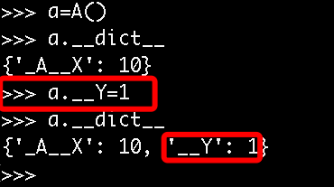

# 第5章 面向对象编程设计与开发

## 本章重点：

* 掌握面向对象编程的特性、开发思想
* 能独立开发基于面向对象的程序

## 本节重点：

* 使学员了解面向对象概念、与面向过程的区别

> **本节时长需控制在30分钟内**

## 编程范式

编程是 程序 员 用特定的语法+数据结构+算法 组成的代码来告诉计算机如何执行任务的过程 。

一个程序是程序员为了得到一个任务结果而编写的一组指令的集合，正所谓条条大路通罗马，实现一个任务的方式有很多种不同的方式， 对这些不同的编程方式的特点进行归纳总结得出来的编程方式类别，即为编程范式。 不同的编程范式本质上代表对各种类型的任务采取的不同的解决问题的思路， 大多数语言只支持一种编程范式，当然也有些语言可以同时支持多种编程范式。 两种最重要的编程范式分别是面向过程编程和面向对象编程。

### 面向过程编程(Procedural Programming)

Procedural programming uses a list of instructions to tell the computer what to do step-by-step.

面向过程编程依赖 - 你猜到了- procedures，一个procedure包含一组要被进行计算的步骤， 面向过程又被称为top-down languages， 就是程序从上到下一步步执行，一步步从上到下，从头到尾的解决问题 。基本设计思路就是程序一开始是要着手解决一个大的问题，然后把一个大问题分解成很多个小问题或子过程，这些子过程再执行的过程再继续分解直到小问题足够简单到可以在一个小步骤范围内解决。

举个典型的面向过程的例子， 写一个数据远程备份程序， 分三步，本地数据打包，上传至云服务器，测试备份文件可用性。

```plain
def cloud_upload(file):
        print("\nconnecting cloud storage center...")
        print("cloud storage connected.")
        print("upload file...xxx..to cloud...", file)
        print('close connection.....')
def data_backup(folder):
    print("找到要备份的目录...", folder)
    print("将备份文件打包，移至相应目录...")
    return '/tmp/backup20181103.zip'
def data_backup_test():
    print("\n从另外一台机器将备份文件从远程cloud center下载，看文件是否无损")
def main():
    zip_file = data_backup("c:\\users\\alex\欧美100G高清无码")
    cloud_upload(zip_file)
    data_backup_test()
if __name__ == '__main__':
    main()
```

这个变量，那这个子过程你也要修改，假如又有一个其它子程序依赖这个子过程 ， 那就会发生一连串的影响，随着程序越来越大， 这种编程方式的维护难度会越来越高。

```plain
test = 1
def cloud_upload(file):
    if test == 1:
        print("\nconnecting cloud storage center...")
        print("cloud storage connected.")
        print("upload file...xxx..to cloud...", file)
        print('close connection.....')
        return True
    else:
        print("不备份")
        return False
def data_backup(folder):
    print("找到要备份的目录...", folder)
    print("将备份文件打包，移至相应目录...")
    return '/tmp/backup20181103.zip'
def data_backup_test(upload_res):
    if upload_res == 1:
        print("\n从另外一台机器将备份文件从远程cloud center下载，看文件是否无损")
    else:
        print("upload error,不备份")
def main():
    zip_file = data_backup("c:\\users\\alex\欧美100G高清无码")
    res = cloud_upload(zip_file)
    data_backup_test(res)
if __name__ == '__main__':
    main()
```

所以我们一般认为， 如果你只是写一些简单的脚本，去做一些一次性任务，用面向过程的方式是极好的，但如果你要处理的任务是复杂的，且需要不断迭代和维护 的， 那还是用面向对象最方便了。

### 面向对象编程(Object Oriented Programing)

直接解释，你必然会蒙逼，所以先讲个引子。

你现在是一家游戏公司的开发人员，现在需要你开发一款叫做<人狗大战>的游戏，你就思考呀，人狗作战，那至少需要2个角色，一个是人， 一个是狗，且人和狗都有不同的技能，比如人拿棍打狗， 狗可以咬人，怎么描述这种不同的角色和他们的功能呢？

你搜罗了自己掌握的所有技能，写出了下面的代码来描述这两个角色

```plain
person = {
    'name':'Alex',
    'attack': 100, #杀伤力
    'life_value':1000
}
dog = {
    'name':'Peiqi',
    'attack': 200, #杀伤力
    'life_value':800
}
```

一个字典表示一个角色实体，但如果有多条狗和多个人一起打呢？那就得写多个字典

```plain
person = {
    'name':'Alex',
    'attack': 100, #杀伤力
    'life_value':1000
}
person2 = {
    'name':'Black Girl',
    'attack': 100, #杀伤力
    'life_value':600
}
dog = {
    'name':'Peiqi',
    'attack': 200, #杀伤力
    'life_value':800
}
```

这样是有问题的，因为如果你字典里的值不小心定义错了，把attack写成了了atteck的话，那整个程序就有问题了。so 你很快想出了改进方案，把字典放进函数

```plain
def person(name,attack,life_value):
    data = {
        'name':name,
        'attack':attack,
        'life_value':life_value,
    }
    return data
def dog(name, attack, life_value):
    data = {
        'name': name,
        'attack': attack,
        'life_value': life_value,
    }
    return data
alex = person("Alex",100,1000)
rain = person("Black girl",80,700)
d = dog("PeiQi",200,800)
```

好，现在角色定义好了，还差每个角色的功能，人打狗，狗咬人的功能要定义出来

```plain
....
def attack(p,d):
    """人打狗功能"""
    d['life_value'] -= p['attack'] #被打了，要掉血
    print("人[%s] 打了 狗[%s]。。。,[%s]的生命值还有[%s]" % (p['name'], d['name'],d['name'],d['life_value']))
def bite(d,p):
    """狗咬人功能"""
    p['life_value'] -= d['attack']
    print("狗[%s] 咬了 人[%s]。。。,[%s]的生命值还有[%s]" % (d['name'], p['name'],p['name'],p['life_value']))
alex = person("Alex",100,1000)
black_girl = person("Black girl",80,700)
d = dog("PeiQi",200,800)
attack(alex,d)
bite(d,black_girl)
```

现在，就可以开心的玩耍啦。。。

但玩着玩着， 你不小心调用错了，

```plain
bite(alex,black_girl) #你调用咬人功能时，把alex当狗传进去了，结果就变成了如下
```

> 人\[Alex] 打了 狗\[PeiQi]。。。,\[PeiQi]的生命值还有\[700]
>
> 狗\[PeiQi] 咬了 人\[Black girl]。。。,\[Black girl]的生命值还有\[500]
>
> 狗\[Alex] 咬了 人\[Black girl]。。。,\[Black girl]的生命值还有\[400]

你让我咬black_girl一口我不介意，但以狗的身份，我是反对的，所以这明显是个bug,bite()功能是狗专属的，不应该允许人调用，这可怎么办呢？

哈，想了一会，你又搞定了。

```plain
def person(name,attack_val,life_value):
    def attack( d):
        """人打狗功能"""
        d['life_value'] -= attack_val  # 被打了，要掉血
        print("人[%s] 打了 狗[%s]。。。,[%s]的生命值还有[%s]" % (name, d['name'], d['name'], d['life_value']))
    data = {
        'name':name,
        'attack_val':attack_val,
        'life_value':life_value,
        'attack':attack
    }
    return data
def dog(name, attack_val, life_value):
    def bite(p):
        """狗咬人功能"""
        p['life_value'] -= attack_val
        print("狗[%s] 咬了 人[%s]。。。,[%s]的生命值还有[%s]" % (name, p['name'], p['name'], p['life_value']))
    data = {
        'name': name,
        'attack_val': attack_val,
        'life_value': life_value,
        'bite':bite
    }
    return data
alex = person("Alex",100,1000)
black_girl = person("Black girl",80,700)
d = dog("PeiQi",200,800)
alex['attack'](d)
d['bite'](black_girl)
```

你是如此的机智，这样就实现了限制人只能用人自己的功能啦。

但，我的哥，不要高兴太早，刚才你只是阻止了两个完全 不同的角色 之间的功能混用， 但有没有可能 ，同一个种角色，但有些属性是不同的呢？ 比如 ，现在游戏升级了，不仅可以打狗，还可以生孩子，但男人不能生呀，只能女的生，怎么办呢？你想了想说，简单呀， 在person函数里包一个子函数叫`get_birth(),`

```plain
def get_birth(person_data):
    if person_data['sex'] == 'female':
        print("%s生孩子 啦..."% person_data['name'] )
    else:
        print("你是男的生个毛线.")
```

没错， 这虽然解决了只能女人生孩子的问题，但其实随着游戏功能越来越多，你会发出男女之间的区别也越来越多 ，但又同时有很多共性，如果 在每个区别处都 单独做判断，那得累死。

你想了想说， 那就直接写2个角色吧， 反正 这么多区别， 我的哥， 不能写两个角色呀，因为他们还有很多共性 ， 写两个不同的角色，就代表 相同的功能 也要重写了，是不是我的哥？ 。。。 没话说了吧？哈哈， 就是要逼你到绝路上。

**上面的问题通过面向对象编程可轻松解决！**

#### 什么是面向对象编程？

OOP(Object Oriented Programing）编程是利用“类”和“对象”来创建各种模型来实现对真实世界的描述。

上面的描述你必定是懵逼的，用白话解释面向对象与面向过程的区别就是：

**面向过程 = 个人视角**

```plain
我要去做大保健，我只需考虑，我有没有钱，去哪家店，怎么去，做什么价位的就可以，你的每一步都要通过程序定义出来，写死了，在这个程序里，你只被设定了去做大保健的功能，你说中途我想去个ktv,那可能会导致整个程序的逻辑都得更改。 用面向过程的方式写代码，那你care的就是整个事情的执行过程
```

**面向对象 = 上帝视角**

```plain
如果你是上帝，你现在要创世纪，把这么多人、动物、山河造出来，上帝光靠自己干，一个一个的造人，多累呀，让你干这个活，你肯定是先造模子，一个男人模子，一个女人模子，剩下的就一个个复制就行啦。这个模子的作用是什么？模子定义了人这个物种所具备的所有特征\(或者说，我们把具备这些特征的个体归为人类\)。
这个世界上所有的东西都是你定义的，你需要用最高效的方式去造世界，最高效的方式就是，先把世界按物种、样貌、有无生命等各种维度分类，然后给每类东西建模型，再让其在不脱离你基本横型定义的框架下，自我繁衍（世界要多姿多彩，所以即使是同一物种，也要有些不一样）
```

#### 为什么要用面向对象？

1. 使程序更加容易扩展和易更改，使开发效率变的更高
2. 基于面向对象的程序可以使它人更加容易理解你的代码逻辑，从而使团队开发变得更从容。

## 面向对象介绍

学习面向对象过程中会遇到一些名词，我们先解释下

### 名词解释

\*\*类：\*\*一个类即是对一类拥有相同属性的对象的抽象、蓝图、原型、模板。在类中定义了这些对象的都具备的属性（variables(data)）、共同的方法

\*\*属性：\*\*人类包含很多特征，把这些特征用程序来描述的话，叫做属性，比如年龄、身高、性别、姓名等都叫做属性，一个类中，可以有多个属性

\*\*方法：\*\*人类不止有身高、年龄、性别这些属性，还能做好多事情，比如说话、走路、吃饭等，相比较于属性是名词，说话、走路是动词，这些动词用程序来描述就叫做方法。

\*\*实例(对象)：\*\*一个对象即是一个类的实例化后实例，一个类必须经过实例化后方可在程序中调用，一个类可以实例化多个对象，每个对象亦可以有不同的属性，就像人类是指所有人，每个人是指具体的对象，人与人之前有共性，亦有不同

\*\*实例化：\*\*把一个类转变为一个对象的过程就叫实例化

### 面向对象3大特性

> 注意，此处只需知道这几个名词，后面会专门再对着代码学习这几大特性

**Encapsulation 封装**

在类中对数据的赋值、内部调用对外部用户是透明的，这使类变成了一个胶囊或容器，里面包含着类的数据和方法

**Inheritance 继承**

一个类可以派生出子类，在这个父类里定义的属性、方法自动被子类继承

**Polymorphism 多态**

多态是面向对象的重要特性,简单点说:“一个接口，多种实现”，指一个基类中派生出了不同的子类，且每个子类在继承了同样的方法名的同时又对父类的方法做了不同的实现，这就是同一种事物表现出的多种形态。

编程其实就是一个将具体世界进行抽象化的过程，多态就是抽象化的一种体现，把一系列具体事物的共同点抽象出来, 再通过这个抽象的事物, 与不同的具体事物进行对话。

对不同类的对象发出相同的消息将会有不同的行为。比如，你的老板让所有员工在九点钟开始工作, 他只要在九点钟的时候说：“开始工作”即可，而不需要对销售人员说：“开始销售工作”，对技术人员说：“开始技术工作”, 因为“员工”是一个抽象的事物, 只要是员工就可以开始工作，他知道这一点就行了。至于每个员工，当然会各司其职，做各自的工作。

多态允许将子类的对象当作父类的对象使用，某父类型的引用指向其子类型的对象,调用的方法是该子类型的方法。这里引用和调用方法的代码编译前就已经决定了,而引用所指向的对象可以在运行期间动态绑定

# 类、实例、属性、方法详解

## 本节重点：

* 使学员了解面向对象语法使用

> **本节时长需控制在60分钟内**

### 类的语法


上面的代码其实有问题，属性名字和年龄都写死了，想传名字传不进去。

```plain
class Person(object):
    def __init__(self, name, age):
        self.name = name
        self.age = age
p = Person("Alex", 22)
print(p.name, p.age)
```

为什么有__init\_\_? 为什么有self? 此时的你一脸蒙逼，相信不画个图，你的智商是理解不了的！

画图之前， 你先注释掉这两句

```plain
# p = Person("Alex", 22)
# print(p.name, p.age)
#加上句
print(Person)
```

```plain
#执行结果
<class '__main__.Person'>
```

这代表什么?代表 即使不实例化，这个Person类本身也是已经存在内存里的对不对， yes, cool，那实例化时，会产生什么化学反应呢？

根据上图我们得知，**其实self,就是实例本身！你实例化时python解释器会自动把这个实例本身通过self参数传进去。**

你说好吧，假装懂了，但是这么干有什么好处呢？想了解self的好处，得给Person类加个功能

```plain
class Person(object):
    def __init__(self, name, age):
        self.name = name
        self.age = age
    def talk(self):
        print("Hello, my name is %s, I'm %s years old!" % (self.name, self.age))
p = Person("Alex", 22)
# print(p.name, p.age)
p.talk() #注意这里调用并未传递参数
```

执行输出

```plain
Hello, my name is Alex, I'm 22 years old!
```

**为何p.talk()未传参数不报错，且为何talk方法定义要跟一个self参数？**

我们上面讲到self其实是实例本身， 那p.talk() 其实相当于p.talk(p),你不需要自己把p实例传进去，解释器帮你干了，那为何要在talk定义时加self参数呢？

是因为，你的talk方法里有调用到实例的属性呀，这些属性又都是绑定在实例上的，你想调用实例属性，就必须要把实例传进去。

**构造方法**

`__init__(...)`被称为 构造方法或初始化方法，在例实例化过程中自动执行，目的是初始化实例的一些属性。每个实例通过__init__初始化的属性都是独有的

刚才定义的这个类体现了面向对象的第一个基本特性，**封装，其实就是使用构造方法将内容封装到某个具体对象中，然后通过对象直接或者self间接获取被封装的内容**

了解了基本定义，下面详解下类的方法和属性

### 类的方法

**构造方法**

刚才上面已经说了，主要作用是实例化时给实例一些初始化参数，或执行一些其它的初始化工作，总之，因为这个__init__只要一实例化，就会自动执行，so不管你在这个方法里写什么，它都会统统在实例化时执行一遍

**普通方法**

定义类的一些正常功能，比如人这个类， 可以说话、走路、吃饭等，每个方法其实想当于一个功能或动作

**析构方法(解构方法)**

实例在内存中被删除时，会自动执行这个方法，如你在内存里生成了一个人的实例，现在他被打死了，那这个人除了自己的实例要被删除外，可能它在实例外产生的一些痕迹也要清除掉，清除的动作就可以写在这个方法里

```plain
class Person(object):
    def __init__(self, name, age):
        self.name = name
        self.age = age
    def talk(self):
        print("Hello, my name is %s, I'm %s years old!" % (self.name, self.age))
    def __del__(self):
        print("running del method, this person must be died.")
p = Person("Alex", 22)
p.talk()
del p
print('--end program--')
```

# 5.1 什么是面向对象的程序设计

## 本节重点：

* 使学员了解面向对象概念、与面向过程的区别

> **本节时长需控制在30分钟内**

## 编程范式

编程即写程序or写代码，具体是指程序员用特定的语法+数据结构+算法编写代码，目的是用来告诉计算机如何执行任务 。

如果把编程的过程比喻为练习武功，那么编程范式指的就是武林中的各种流派，而在编程的世界里最常见的两大流派便是：面向过程与面向对象。

“功夫的流派没有高低之分，只有习武的人才有高低之分“，在编程世界里更是这样，面向过程与面向对象在不同的场景下都各有优劣，谁好谁坏不能一概而论，下面就让我们来详细了解它们。

### 面向过程的程序设计

#### 概念：

核心是“过程”二字，“过程”指的是解决问题的步骤，即先干什么再干什么......，基于面向过程设计程序就好比在设计一条流水线，是一种机械式的思维方式。若程序一开始是要着手解决一个大的问题，面向过程的基本设计思路就是把这个大的问题分解成很多个小问题或子过程，这些子过程在执行的过程中继续分解，直到小问题足够简单到可以在一个小步骤范围内解决。

#### **优点是**：

复杂的问题流程化，进而简单化（一个复杂的问题，分成一个个小的步骤去实现，实现小的步骤将会非常简单）

举个典型的面向过程的例子， 写一个数据远程备份程序， 分三步，本地数据打包，上传至云服务器，测试备份文件可用性。

```plain
import os
def data_backup(folder):
    print("找到备份目录: %s" %folder)
    print('正在备份......')
    zip_file='/tmp/backup20181103.zip'
    print('备份成功，备份文件为: %s' %zip_file)
    return zip_file
def cloud_upload(file):
    print("\nconnecting cloud storage center...")
    print("cloud storage connected.")
    print("upload file...%s...to cloud..." %file)
    link='http://www.xxx.com/bak/%s' %os.path.basename(file)
    print('close connection.....')
    return link
def data_backup_test(link):
    print("\n下载文件: %s , 验证文件是否无损" %link)
def main():
    #步骤一：本地数据打包
    zip_file = data_backup("c:\\users\\alex\欧美100G高清无码")
    #步骤二：上传至云服务器
    link=cloud_upload(zip_file)
    #步骤三：测试备份文件的可用性
    data_backup_test(link)
if __name__ == '__main__':
    main()
```

#### **缺点是：**

一套流水线或者流程就是用来解决一个问题，比如生产汽水的流水线无法生产汽车，即便是能，也得是大改，改一个组件，与其相关的组件都需要修改，牵一发而动全身，扩展性极差。

比如我们修改了步骤二的函数cloud_upload的逻辑，那么依赖于步骤二结果才能正常执行的步骤三的函数data_backup_test相关的逻辑也需要修改，这就造成了连锁反应，而这一弊端会随着程序的增大而变得越发的糟糕，我们程序的维护难度将会越来越大。

```plain
import os
def data_backup(folder):
    print("找到备份目录: %s" %folder)
    print('正在备份......')
    zip_file='/tmp/backup20181103.zip'
    print('备份成功，备份文件为: %s' %zip_file)
    return zip_file
def cloud_upload(file): #加上异常处理，在出现异常的情况下，没有link返回
    try:
        print("\nconnecting cloud storage center...")
        print("cloud storage connected.")
        print("upload file...%s...to cloud..." % file)
        link = 'http://www.xxx.com/bak/%s' % os.path.basename(file)
        return link
    except Exception:
        print('upload error')
    finally:
        print('close connection.....')
def data_backup_test(link): #加上对参数link的判断
    if link:
        print("\n下载文件: %s , 验证文件是否无损" %link)
    else:
        print('\n链接不存在')
def main():
    #步骤一：本地数据打包
    zip_file = data_backup("c:\\users\\alex\欧美100G高清无码")
    #步骤二：上传至云服务器
    link=cloud_upload(zip_file)
    #步骤三：测试备份文件的可用性
    data_backup_test(link)
if __name__ == '__main__':
    main()
```

#### 应用场景：

面向过程的程序设计思想一般用于那些功能一旦实现之后就很少需要改变的场景， 如果你只是写一些简单的脚本，去做一些一次性任务，用面向过程的方式是极好的，著名的例子有Linux內核，git，以及Apache HTTP Server等。但如果你要处理的任务是复杂的，且需要不断迭代和维护 的， 那还是用面向对象最方便了。

### 面向对象的程序设计

#### 概念：

核心是“对象”二字，要理解对象为何物，必须把自己当成上帝，在上帝眼里，世间存在的万物皆为对象，不存在的也可以创造出来。程序员基于面向对象设计程序就好比如来设计西游记，如来要解决的问题是把经书传给东土大唐，如来并没有考虑问题的解决流程，而是设计出了负责取经的师傅四人：唐僧，沙和尚，猪八戒，孙悟空，负责骚扰的一群妖魔鬼怪，以及负责保驾护航的一众神仙，这些全都是对象，然后取经开始，就是师徒四人与妖魔鬼怪神仙交互着直到完成取经任务。所以说基于面向对象设计程序就好比在创造一个世界，世界是由一个个对象组成，而你就是这个世界的上帝。

我们从西游记中的任何一个人物对象都不难总结出：对象是特征与技能的结合体。比如孙悟空的特征是：毛脸雷公嘴，技能是：七十二变、火眼金睛等。

与面向过程机械式的思维方式形成鲜明对比，面向对象更加注重对现实世界而非流程的模拟，是一种“上帝式”的思维方式。

#### **优点是**：

解决了面向过程可扩展性低的问题，这一点我们将在5.2小节中为大家验证，需要强调的是，对于一个软件质量来说，面向对象的程序设计并不代表全部，面向对象的程序设计只是用来解决扩展性问题。

<!-- OCR_START -->
- 性能
- 成本
- 可靠性
- 软件质量
- 可扩展性
- 安全性
- 属性
- 可伸缩性
- 可维护性
- 可移植性
<!-- OCR_END -->

#### 缺点是：

编程的复杂度远高于面向过程，不了解面向对象而立即上手并基于它设计程序，极容易出现过度设计的问题，而且在一些扩展性要求低的场景使用面向对象会徒增编程难度，比如管理linux系统的shell脚本程序就不适合用面向对象去设计，面向过程反而更加适合。

#### 应用场景：

当然是应用于需求经常变化的软件中，一般需求的变化都集中在用户层，互联网应用，企业内部软件，游戏等都是面向对象的程序设计大显身手的好地方。

# 5.2 类与对象

## 本节重点

* 掌握什么是类、什么是对象
* 掌握如何定义及使用类与对象
* 了解对类与对象之间的关系

> **本节时长需控制在45分钟内**

### 类与对象的概念

类即类别、种类，是面向对象设计最重要的概念，从一小节我们得知对象是特征与技能的结合体，而类则是一系列对象相似的特征与技能的结合体。

那么问题来了，先有的一个个具体存在的对象（比如一个具体存在的人），还是先有的人类这个概念，这个问题需要分两种情况去看

* 在现实世界中：肯定是先有对象，再有类

```plain
世界上肯定是先出现各种各样的实际存在的物体，然后随着人类文明的发展，人类站在不同的角度总结出了不同的种类，比如
人类、动物类、植物类等概念。也就说，对象是具体的存在，而类仅仅只是一个概念，并不真实存在，比如你无法告诉我人类
具体指的是哪一个人。
```

* 在程序中：务必保证先定义类，后产生对象

```plain
这与函数的使用是类似的：先定义函数，后调用函数，类也是一样的：在程序中需要先定义类，后调用类。不一样的是：调用
函数会执行函数体代码返回的是函数体执行的结果，而调用类会产生对象，返回的是对象
```

### 定义类

按照上述步骤，我们来定义一个类（我们站在老男孩学校的角度去看，在座的各位都是学生）

* 在现实世界中，先有对象，再有类

```plain
对象1：李坦克
    特征:
        学校=oldboy
        姓名=李坦克
        性别=男
        年龄=18
    技能：
        学习
        吃饭
        睡觉
对象2：王大炮
    特征:
        学校=oldboy
        姓名=王大炮
        性别=女
        年龄=38
    技能：
        学习
        吃饭
        睡觉
对象3：牛榴弹
    特征:
        学校=oldboy
        姓名=牛榴弹
        性别=男
        年龄=78
    技能：
        学习
        吃饭
        睡觉
现实中的老男孩学生类
    相似的特征:
        学校=oldboy
    相似的技能：
        学习
        吃饭
        睡觉
```

* 在程序中，务必保证：先定义（类），后使用类（用来产生对象）

```plain
#在Python中程序中的类用class关键字定义，而在程序中特征用变量标识，技能用函数标识，因而类中最常见的无非是：变量和函数的定义
class OldboyStudent:
    school='oldboy'
    def learn(self):
        print('is learning')
    def eat(self):
        print('is eating')
    def sleep(self):
        print('is sleeping')
```

注意：

* 类中可以有任意python代码，这些代码在类定义阶段便会执行，因而会产生新的名称空间，用来存放类的变量名与函数名，可以通过OldboyStudent.\_\_dict__查看
* 类中定义的名字，都是类的属性，点是访问属性的语法。
* 对于经典类来说我们可以通过该字典操作类名称空间的名字，但新式类有限制（新式类与经典类的区别我们将在后续章节介绍）

### 类的使用

* 引用类的属性

```plain
OldboyStudent.school #查
OldboyStudent.school='Oldboy' #改
OldboyStudent.x=1 #增
del OldboyStudent.x #删
```

* 调用类，或称为实例化，得到程序中的对象

```plain
s1=OldboyStudent()
s2=OldboyStudent()
s3=OldboyStudent()
#如此，s1、s2、s3都一样了，而这三者除了相似的属性之外还各种不同的属性，这就用到了__init__
```

* \_\_\_init___方法

```plain
#注意：该方法是在对象产生之后才会执行，只用来为对象进行初始化操作，可以有任意代码，但一定不能有返回值
class OldboyStudent:
    ......
    def __init__(self,name,age,sex):
        self.name=name
        self.age=age
        self.sex=sex
    ......
s1=OldboyStudent('李坦克','男',18) #先调用类产生空对象s1，然后调用OldboyStudent.__init__(s1,'李坦克','男',18)
s2=OldboyStudent('王大炮','女',38)
s3=OldboyStudent('牛榴弹','男',78)
```

### 对象的使用

```plain
#执行__init__,s1.name='牛榴弹'，很明显也会产生对象的名称空间可以用s2.__dict__查看，查看结果为
{'name': '王大炮', 'age': '女', 'sex': 38}
s2.name #查，等同于s2.__dict__['name']
s2.name='王三炮' #改，等同于s2.__dict__['name']='王三炮'
s2.course='python' #增，等同于s2.__dict__['course']='python'
del s2.course #删，等同于s2.__dict__.pop('course')
```

### 补充说明

* 站的角度不同，定义出的类是截然不同的；
* 现实中的类并不完全等于程序中的类，比如现实中的公司类，在程序中有时需要拆分成部门类，业务类等；
* 有时为了编程需求，程序中也可能会定义现实中不存在的类，比如策略类，现实中并不存在，但是在程序中却是一个很常见的类。

# 5.3 属性查找与绑定方法

## 本节重点

* 掌握类属性与实例属性
* 掌握绑定方法

> **本节时长需控制在20分钟内**

### 属性查找

类有两种属性：数据属性和函数属性

1、类的数据属性是所有对象共享的

```plain
#类的数据属性是所有对象共享的,id都一样
print(id(OldboyStudent.school))
print(id(s1.school)) #4377347328
print(id(s2.school)) #4377347328
print(id(s3.school)) #4377347328
```

2、类的函数数据是绑定给对象用的，称为绑定到对象的方法

```plain
#类的函数属性是绑定给对象使用的,obj.method称为绑定方法,内存地址都不一样
print(OldboyStudent.learn) #<function OldboyStudent.learn at 0x1021329d8>
print(s1.learn) #<bound method OldboyStudent.learn of <__main__.OldboyStudent object at 0x1021466d8>>
print(s2.learn) #<bound method OldboyStudent.learn of <__main__.OldboyStudent object at 0x102146710>>
print(s3.learn) #<bound method OldboyStudent.learn of <__main__.OldboyStudent object at 0x102146748>>
#ps:id是python的实现机制,并不能真实反映内存地址,如果有内存地址,还是以内存地址为准
```

在obj.name会先从obj自己的名称空间里找name，找不到则去类中找，类也找不到就找父类...最后都找不到就抛出异常

### 绑定方法

定义类并实例化出三个对象

```plain
class OldboyStudent:
    school='oldboy'
    def __init__(self,name,age,sex):
        self.name=name
        self.age=age
        self.sex=sex
    def learn(self):
        print('%s is learning' %self.name) #新增self.name
    def eat(self):
        print('%s is eating' %self.name)
    def sleep(self):
        print('%s is sleeping' %self.name)
s1=OldboyStudent('李坦克','男',18)
s2=OldboyStudent('王大炮','女',38)
s3=OldboyStudent('牛榴弹','男',78)
```

类中定义的函数（没有被任何装饰器装饰的）是类的函数属性，类可以使用，但必须遵循函数的参数规则，有几个参数需要传几个参数

```plain
OldboyStudent.learn(s1) #李坦克 is learning
OldboyStudent.learn(s2) #王大炮 is learning
OldboyStudent.learn(s3) #牛榴弹 is learning
```

类中定义的函数（没有被任何装饰器装饰的）,其实主要是给对象使用的，而且是绑定到对象的，虽然所有对象指向的都是相同的功能，但是绑定到不同的对象就是不同的绑定方法

强调：绑定到对象的方法的特殊之处在于，绑定给谁就由谁来调用，谁来调用，就会将‘谁’本身当做第一个参数传给方法，即自动传值（方法__init__也是一样的道理）

```plain
s1.learn() #等同于OldboyStudent.learn(s1)
s2.learn() #等同于OldboyStudent.learn(s2)
s3.learn() #等同于OldboyStudent.learn(s3)
```

**注意：绑定到对象的方法的这种自动传值的特征，决定了在类中定义的函数都要默认写一个参数self，self可以是任意名字，但是约定俗成地写出self。**

### 类即类型

python中一切皆为对象，且python3中类与类型是一个概念，类型就是类

```plain
#类型dict就是类dict
>>> list
<class 'list'>
#实例化的到3个对象l1,l2,l3
>>> l1=list()
>>> l2=list()
>>> l3=list()
#三个对象都有绑定方法append,是相同的功能,但内存地址不同
>>> l1.append
<built-in method append of list object at 0x10b482b48>
>>> l2.append
<built-in method append of list object at 0x10b482b88>
>>> l3.append
<built-in method append of list object at 0x10b482bc8>
#操作绑定方法l1.append(3),就是在往l1添加3,绝对不会将3添加到l2或l3
>>> l1.append(3)
>>> l1
[3]
>>> l2
[]
>>> l3
[]
#调用类list.append(l3,111)等同于l3.append(111)
>>> list.append(l3,111) #l3.append(111)
>>> l3
[111]
```

## 小节练习

**练习1：编写一个学生类，产生一堆学生对象， (5分钟)**

要求：

1. 有一个计数器（属性），统计总共实例了多少个对象

**练习2：模仿王者荣耀定义两个英雄类， (10分钟)**

要求：

1. 英雄需要有昵称、攻击力、生命值等属性；
2. 实例化出两个英雄对象；
3. 英雄之间可以互殴，被殴打的一方掉血，血量小于0则判定为死亡。

# 5.4 小结

## 本节重点

* 总结面向对象的优点

> **本节时长需控制在10分钟内**

### 从代码级别看面向对象

1、在没有学习类这个概念时，数据与功能是分离的

```plain
def exc1(host,port,db,charset):
    conn=connect(host,port,db,charset)
    conn.execute(sql)
    return xxx
def exc2(host,port,db,charset,proc_name)
    conn=connect(host,port,db,charset)
    conn.call_proc(sql)
    return xxx
#每次调用都需要重复传入一堆参数
exc1('127.0.0.1',3306,'db1','utf8','select * from tb1;')
exc2('127.0.0.1',3306,'db1','utf8','存储过程的名字')
```

2、我们能想到的解决方法是，把这些变量都定义成全局变量

```plain
HOST=‘127.0.0.1’
PORT=3306
DB=‘db1’
CHARSET=‘utf8’
def exc1(host,port,db,charset):
    conn=connect(host,port,db,charset)
    conn.execute(sql)
    return xxx
def exc2(host,port,db,charset,proc_name)
    conn=connect(host,port,db,charset)
    conn.call_proc(sql)
    return xxx
exc1(HOST,PORT,DB,CHARSET,'select * from tb1;')
exc2(HOST,PORT,DB,CHARSET,'存储过程的名字')
```

3、但是2的解决方法也是有问题的，按照2的思路，我们将会定义一大堆全局变量，这些全局变量并没有做任何区分，即能够被所有功能使用，然而事实上只有HOST，PORT，DB，CHARSET是给exc1和exc2这两个功能用的。言外之意：我们必须找出一种能够将数据与操作数据的方法组合到一起的解决方法，这就是我们说的类了

```plain
class MySQLHandler:
    def __init__(self,host,port,db,charset='utf8'):
        self.host=host
        self.port=port
        self.db=db
        self.charset=charset
        self.conn=connect(self.host,self.port,self.db,self.charset)
    def exc1(self,sql):
        return self.conn.execute(sql)
    def exc2(self,sql):
        return self.conn.call_proc(sql)
obj=MySQLHandler('127.0.0.1',3306,'db1')
obj.exc1('select * from tb1;')
obj.exc2('存储过程的名字')
```

总结使用类可以：

```plain
将数据与专门操作该数据的功能整合到一起。
```

## 可扩展性高

定义类并产生三个对象

```plain
class Chinese:
    def __init__(self,name,age,sex):
        self.name=name
        self.age=age
        self.sex=sex
p1=Chinese('egon',18,'male')
p2=Chinese('alex',38,'female')
p3=Chinese('wpq',48,'female')
```

如果我们新增一个类属性，将会立刻反映给所有对象，而对象却无需修改

```plain
class Chinese:
    country='China'
    def __init__(self,name,age,sex):
        self.name=name
        self.age=age
        self.sex=sex
    def tell_info(self):
        info='''
        国籍:%s
        姓名:%s
        年龄:%s
        性别:%s
        ''' %(self.country,self.name,self.age,self.sex)
        print(info)
p1=Chinese('egon',18,'male')
p2=Chinese('alex',38,'female')
p3=Chinese('wpq',48,'female')
print(p1.country)
p1.tell_info()
```

# 5.5 继承与派生    ---暂无

# 5.6 组合

## 本节重点

* 组合

> **本节时长需控制在15分钟内**

### 组合与重用性

软件重用的重要方式除了继承之外还有另外一种方式，即：组合

组合指的是，在一个类中以另外一个类的对象作为数据属性，称为类的组合

```plain
>>> class Equip: #武器装备类
...     def fire(self):
...         print('release Fire skill')
... 
>>> class Riven: #英雄Riven的类,一个英雄需要有装备,因而需要组合Equip类
...     camp='Noxus'
...     def __init__(self,nickname):
...         self.nickname=nickname
...         self.equip=Equip() #用Equip类产生一个装备,赋值给实例的equip属性
... 
>>> r1=Riven('锐雯雯')
>>> r1.equip.fire() #可以使用组合的类产生的对象所持有的方法
release Fire skill
```

组合与继承都是有效地利用已有类的资源的重要方式。但是二者的概念和使用场景皆不同，

**1.继承的方式**

通过继承建立了派生类与基类之间的关系，它是一种'是'的关系，比如白马是马，人是动物。

当类之间有很多相同的功能，提取这些共同的功能做成基类，用继承比较好，比如老师是人，学生是人

**2.组合的方式**

用组合的方式建立了类与组合的类之间的关系，它是一种‘有’的关系,比如教授有生日，教授教python和linux课程，教授有学生s1、s2、s3...

示例：继承与组合

```plain
class People:
    def __init__(self,name,age,sex):
        self.name=name
        self.age=age
        self.sex=sex
class Course:
    def __init__(self,name,period,price):
        self.name=name
        self.period=period
        self.price=price
    def tell_info(self):
        print('<%s %s %s>' %(self.name,self.period,self.price))
class Teacher(People):
    def __init__(self,name,age,sex,job_title):
        People.__init__(self,name,age,sex)
        self.job_title=job_title
        self.course=[]
        self.students=[]
class Student(People):
    def __init__(self,name,age,sex):
        People.__init__(self,name,age,sex)
        self.course=[]
egon=Teacher('egon',18,'male','沙河霸道金牌讲师')
s1=Student('牛榴弹',18,'female')
python=Course('python','3mons',3000.0)
linux=Course('python','3mons',3000.0)
#为老师egon和学生s1添加课程
egon.course.append(python)
egon.course.append(linux)
s1.course.append(python)
#为老师egon添加学生s1
egon.students.append(s1)
#使用
for obj in egon.course:
    obj.tell_info()
```

**总结：**

当类之间有显著不同，并且较小的类是较大的类所需要的组件时，用组合比较好

# 5.7 抽象类

## 本节重点

* 接口与归一化设计
* 抽象类

> **本节时长需控制在15分钟内**

### 接口与归一化设计

**1.什么是接口**

hi boy，给我开个查询接口。。。此时的接口指的是：自己提供给使用者来调用自己功能的方式\方法\入口，java中的interface使用如下

```plain
=================第一部分：Java 语言中的接口很好的展现了接口的含义: IAnimal.java
/*
* Java的Interface接口的特征:
* 1)是一组功能的集合,而不是一个功能
* 2)接口的功能用于交互,所有的功能都是public,即别的对象可操作
* 3)接口只定义函数,但不涉及函数实现
* 4)这些功能是相关的,都是动物相关的功能,但光合作用就不适宜放到IAnimal里面了 */
package com.oo.demo;
public interface IAnimal {
    public void eat();
    public void run(); 
    public void sleep(); 
    public void speak();
}
=================第二部分：Pig.java：猪”的类设计,实现了IAnnimal接口 
package com.oo.demo;
public class Pig implements IAnimal{ //如下每个函数都需要详细实现
    public void eat(){
        System.out.println("Pig like to eat grass");
    }
    public void run(){
        System.out.println("Pig run: front legs, back legs");
    }
    public void sleep(){
        System.out.println("Pig sleep 16 hours every day");
    }
    public void speak(){
        System.out.println("Pig can not speak"); }
}
=================第三部分：Person2.java
/*
*实现了IAnimal的“人”,有几点说明一下: 
* 1)同样都实现了IAnimal的接口,但“人”和“猪”的实现不一样,为了避免太多代码导致影响阅读,这里的代码简化成一行,但输出的内容不一样,实际项目中同一接口的同一功能点,不同的类实现完全不一样
* 2)这里同样是“人”这个类,但和前面介绍类时给的类“Person”完全不一样,这是因为同样的逻辑概念,在不同的应用场景下,具备的属性和功能是完全不一样的 */
package com.oo.demo;
public class Person2 implements IAnimal { 
    public void eat(){
        System.out.println("Person like to eat meat");
    }
    public void run(){
        System.out.println("Person run: left leg, right leg");
    }
    public void sleep(){
        System.out.println("Person sleep 8 hours every dat"); 
    }
    public void speak(){
        System.out.println("Hellow world, I am a person");
    } 
}
=================第四部分：Tester03.java
package com.oo.demo;
public class Tester03 {
    public static void main(String[] args) {
        System.out.println("===This is a person==="); 
        IAnimal person = new Person2();
        person.eat();
        person.run();
        person.sleep();
        person.speak();
        System.out.println("\n===This is a pig===");
        IAnimal pig = new Pig();
        pig.eat();
        pig.run();
        pig.sleep();
        pig.speak();
    } 
}
 java中的interface
```

**2. 为何要用接口**

接口提取了一群类共同的函数，可以把接口当做一个函数的集合。

然后让子类去实现接口中的函数。

这么做的意义在于归一化，什么叫归一化，就是只要是基于同一个接口实现的类，那么所有的这些类产生的对象在使用时，从用法上来说都一样。

归一化的好处在于：

1. 归一化让使用者无需关心对象的类是什么，只需要的知道这些对象都具备某些功能就可以了，这极大地降低了使用者的使用难度。
2. 归一化使得高层的外部使用者可以不加区分的处理所有接口兼容的对象集合
   1. 就好象linux的泛文件概念一样，所有东西都可以当文件处理，不必关心它是内存、磁盘、网络还是屏幕（当然，对底层设计者，当然也可以区分出“字符设备”和“块设备”，然后做出针对性的设计：细致到什么程度，视需求而定）。
   2. 再比如：我们有一个汽车接口，里面定义了汽车所有的功能，然后由本田汽车的类，奥迪汽车的类，大众汽车的类，他们都实现了汽车接口，这样就好办了，大家只需要学会了怎么开汽车，那么无论是本田，还是奥迪，还是大众我们都会开了，开的时候根本无需关心我开的是哪一类车，操作手法（函数调用）都一样

**3. 模仿interface**

在python中根本就没有一个叫做interface的关键字，如果非要去模仿接口的概念

可以借助第三方模块：<http://pypi.python.org/pypi/zope.interface>

也可以使用继承，其实继承有两种用途

一：继承基类的方法，并且做出自己的改变或者扩展（代码重用）：实践中，继承的这种用途意义并不很大，甚至常常是有害的。因为它使得子类与基类出现强耦合。

二：声明某个子类兼容于某基类，定义一个接口类（模仿java的Interface），接口类中定义了一些接口名（就是函数名）且并未实现接口的功能，子类继承接口类，并且实现接口中的功能

```plain
class Interface:#定义接口Interface类来模仿接口的概念，python中压根就没有interface关键字来定义一个接口。
    def read(self): #定接口函数read
        pass
    def write(self): #定义接口函数write
        pass
class Txt(Interface): #文本，具体实现read和write
    def read(self):
        print('文本数据的读取方法')
    def write(self):
        print('文本数据的读取方法')
class Sata(Interface): #磁盘，具体实现read和write
    def read(self):
        print('硬盘数据的读取方法')
    def write(self):
        print('硬盘数据的读取方法')
class Process(Interface):
    def read(self):
        print('进程数据的读取方法')
    def write(self):
        print('进程数据的读取方法')
```

上面的代码只是看起来像接口，其实并没有起到接口的作用，子类完全可以不用去实现接口 ，这就用到了抽象类

### 抽象类

**1 什么是抽象类**

*与java一样，python也有抽象类的概念但是同样需要借助模块实现，抽象类是一个特殊的类，它的特殊之处在于只能被继承，不能被实例化*

**2 为什么要有抽象类**

*如果说类是从一堆对象中抽取相同的内容而来的，那么抽象类就是从一堆类中抽取相同的内容而来的，内容包括数据属性和函数属性。*

\_　 比如我们有香蕉的类，有苹果的类，有桃子的类，从这些类抽取相同的内容就是水果这个抽象的类，你吃水果时，要么是吃一个具体的香蕉，要么是吃一个具体的桃子。。。。。。你永远无法吃到一个叫做水果的东西。\_

*从设计角度去看，如果类是从现实对象抽象而来的，那么抽象类就是基于类抽象而来的。*

\_　 从实现角度来看，抽象类与普通类的不同之处在于：抽象类中只能有抽象方法（没有实现功能），该类不能被实例化，只能被继承，且子类必须实现抽象方法。这一点与接口有点类似，但其实是不同的，即将揭晓答案\_

**3. 在python中实现抽象类**

```plain
#一切皆文件
import abc #利用abc模块实现抽象类
class All_file(metaclass=abc.ABCMeta):
    all_type='file'
    @abc.abstractmethod #定义抽象方法，无需实现功能
    def read(self):
        '子类必须定义读功能'
        pass
    @abc.abstractmethod #定义抽象方法，无需实现功能
    def write(self):
        '子类必须定义写功能'
        pass
# class Txt(All_file):
#     pass
#
# t1=Txt() #报错,子类没有定义抽象方法
class Txt(All_file): #子类继承抽象类，但是必须定义read和write方法
    def read(self):
        print('文本数据的读取方法')
    def write(self):
        print('文本数据的读取方法')
class Sata(All_file): #子类继承抽象类，但是必须定义read和write方法
    def read(self):
        print('硬盘数据的读取方法')
    def write(self):
        print('硬盘数据的读取方法')
class Process(All_file): #子类继承抽象类，但是必须定义read和write方法
    def read(self):
        print('进程数据的读取方法')
    def write(self):
        print('进程数据的读取方法')
wenbenwenjian=Txt()
yingpanwenjian=Sata()
jinchengwenjian=Process()
#这样大家都是被归一化了,也就是一切皆文件的思想
wenbenwenjian.read()
yingpanwenjian.write()
jinchengwenjian.read()
print(wenbenwenjian.all_type)
print(yingpanwenjian.all_type)
print(jinchengwenjian.all_type)
```

**4. 抽象类与接口**

抽象类的本质还是类，指的是一组类的相似性，包括数据属性（如all_type）和函数属性（如read、write），而接口只强调函数属性的相似性。

抽象类是一个介于类和接口直接的一个概念，同时具备类和接口的部分特性，可以用来实现归一化设计

# 5.8 多态与多态性

## 本节重点

* 多态与多态性
* 鸭子类型

> **本节时长需控制在15分钟内**

### 多态

多态指的是一类事物有多种形态，比如

动物有多种形态：人，狗，猪

```plain
import abc
class Animal(metaclass=abc.ABCMeta): #同一类事物:动物
    @abc.abstractmethod
    def talk(self):
        pass
class People(Animal): #动物的形态之一:人
    def talk(self):
        print('say hello')
class Dog(Animal): #动物的形态之二:狗
    def talk(self):
        print('say wangwang')
class Pig(Animal): #动物的形态之三:猪
    def talk(self):
        print('say aoao')
```

文件有多种形态：文本文件，可执行文件

```plain
import abc
class File(metaclass=abc.ABCMeta): #同一类事物:文件
    @abc.abstractmethod
    def click(self):
        pass
class Text(File): #文件的形态之一:文本文件
    def click(self):
        print('open file')
class ExeFile(File): #文件的形态之二:可执行文件
    def click(self):
        print('execute file')
```

### 多态性

一 **什么是多态动态绑定（在继承的背景下使用时，有时也称为多态性）**

多态性是指在不考虑实例类型的情况下使用实例，多态性分为静态多态性和动态多态性

*静态多态性：如任何类型都可以用运算符+进行运算*

*动态多态性：如下*

```plain
peo=People()
dog=Dog()
pig=Pig()
#peo、dog、pig都是动物,只要是动物肯定有talk方法
#于是我们可以不用考虑它们三者的具体是什么类型,而直接使用
peo.talk()
dog.talk()
pig.talk()
#更进一步,我们可以定义一个统一的接口来使用
def func(obj):
    obj.talk()
```

**二 为什么要用多态性（多态性的好处）**

其实大家从上面多态性的例子可以看出，我们并没有增加什么新的知识，也就是说python本身就是支持多态性的，这么做的好处是什么呢？

1.增加了程序的灵活性

\_　　以不变应万变，不论对象千变万化，使用者都是同一种形式去调用，如func(animal)\_

2.增加了程序额可扩展性

\_　通过继承animal类创建了一个新的类，使用者无需更改自己的代码，还是用func(animal)去调用 　　\_

```plain
>>> class Cat(Animal): #属于动物的另外一种形态：猫
...     def talk(self):
...         print('say miao')
... 
>>> def func(animal): #对于使用者来说，自己的代码根本无需改动
...     animal.talk()
... 
>>> cat1=Cat() #实例出一只猫
>>> func(cat1) #甚至连调用方式也无需改变，就能调用猫的talk功能
say miao
'''
这样我们新增了一个形态Cat，由Cat类产生的实例cat1，使用者可以在完全不需要修改自己代码的情况下。使用和人、狗、猪一样的方式调用cat1的talk方法，即func(cat1)
'''
```

### 鸭子类型

逗比时刻：

Python崇尚鸭子类型，即‘如果看起来像、叫声像而且走起路来像鸭子，那么它就是鸭子’

python程序员通常根据这种行为来编写程序。例如，如果想编写现有对象的自定义版本，可以继承该对象

也可以创建一个外观和行为像，但与它无任何关系的全新对象，后者通常用于保存程序组件的松耦合度。

例1：利用标准库中定义的各种‘与文件类似’的对象，尽管这些对象的工作方式像文件，但他们没有继承内置文件对象的方法

```plain
#二者都像鸭子,二者看起来都像文件,因而就可以当文件一样去用
class TxtFile:
    def read(self):
        pass
    def write(self):
        pass
class DiskFile:
    def read(self):
        pass
    def write(self):
        pass
```

例2：序列类型有多种形态：字符串，列表，元组，但他们直接没有直接的继承关系

```plain
#str,list,tuple都是序列类型
s=str('hello')
l=list([1,2,3])
t=tuple((4,5,6))
#我们可以在不考虑三者类型的前提下使用s,l,t
s.__len__()
l.__len__()
t.__len__()
len(s)
len(l)
len(t)
```

# 5.9 封装

## 本节重点

* 掌握封装，封装与扩展性
* 掌握property

> **本节时长需控制在35分钟内**

### 引子

从封装本身的意思去理解，封装就好像是拿来一个麻袋，把小猫，小狗，小王八，还有alex一起装进麻袋，然后把麻袋封上口子。照这种逻辑看，封装=‘隐藏’，这种理解是相当片面的

### 先看如何隐藏

在python中用双下划线开头的方式将属性隐藏起来（设置成私有的）

```plain
#其实这仅仅这是一种变形操作
#类中所有双下划线开头的名称如__x都会自动变形成：_类名__x的形式：
class A:
    __N=0 #类的数据属性就应该是共享的,但是语法上是可以把类的数据属性设置成私有的如__N,会变形为_A__N
    def __init__(self):
        self.__X=10 #变形为self._A__X
    def __foo(self): #变形为_A__foo
        print('from A')
    def bar(self):
        self.__foo() #只有在类内部才可以通过__foo的形式访问到.
#A._A__N是可以访问到的，即这种操作并不是严格意义上的限制外部访问，仅仅只是一种语法意义上的变形
```

**这种自动变形的特点：**

1. 类中定义的__x只能在内部使用，如self.\_\_x，引用的就是变形的结果。
2. 这种变形其实正是针对外部的变形，在外部是无法通过__x这个名字访问到的。
3. 在子类定义的__x不会覆盖在父类定义的__x，因为子类中变形成了：\_子类名__x,而父类中变形成了：\_父类名__x，即双下滑线开头的属性在继承给子类时，子类是无法覆盖的。

**这种变形需要注意的问题是：**

1、这种机制也并没有真正意义上限制我们从外部直接访问属性，知道了类名和属性名就可以拼出名字：\_类名__属性，然后就可以访问了，如a.\_A__N

2、变形的过程只在类的定义是发生一次,在定义后的赋值操作，不会变形



3、在继承中，父类如果不想让子类覆盖自己的方法，可以将方法定义为私有的

```plain
#正常情况
>>> class A:
...     def fa(self):
...         print('from A')
...     def test(self):
...         self.fa()
... 
>>> class B(A):
...     def fa(self):
...         print('from B')
... 
>>> b=B()
>>> b.test()
from B
#把fa定义成私有的，即__fa
>>> class A:
...     def __fa(self): #在定义时就变形为_A__fa
...         print('from A')
...     def test(self):
...         self.__fa() #只会与自己所在的类为准,即调用_A__fa
... 
>>> class B(A):
...     def __fa(self):
...         print('from B')
... 
>>> b=B()
>>> b.test()
from A
```

### 封装不是单纯意义的隐藏

1：封装数据

将数据隐藏起来这不是目的。隐藏起来然后对外提供操作该数据的接口，然后我们可以在接口附加上对该数据操作的限制，以此完成对数据属性操作的严格控制。

```plain
class Teacher:
    def __init__(self,name,age):
        self.__name=name
        self.__age=age
    def tell_info(self):
        print('姓名:%s,年龄:%s' %(self.__name,self.__age))
    def set_info(self,name,age):
        if not isinstance(name,str):
            raise TypeError('姓名必须是字符串类型')
        if not isinstance(age,int):
            raise TypeError('年龄必须是整型')
        self.__name=name
        self.__age=age
t=Teacher('egon',18)
t.tell_info()
t.set_info('egon',19)
t.tell_info()
```

2：封装方法：目的是隔离复杂度

```plain
#取款是功能,而这个功能有很多功能组成:插卡、密码认证、输入金额、打印账单、取钱
#对使用者来说,只需要知道取款这个功能即可,其余功能我们都可以隐藏起来,很明显这么做
#隔离了复杂度,同时也提升了安全性
class ATM:
    def __card(self):
        print('插卡')
    def __auth(self):
        print('用户认证')
    def __input(self):
        print('输入取款金额')
    def __print_bill(self):
        print('打印账单')
    def __take_money(self):
        print('取款')
    def withdraw(self):
        self.__card()
        self.__auth()
        self.__input()
        self.__print_bill()
        self.__take_money()
a=ATM()
a.withdraw()
```

封装方法的其他举例：

1. 你的身体没有一处不体现着封装的概念：你的身体把膀胱尿道等等这些尿的功能隐藏了起来，然后为你提供一个尿的接口就可以了（接口就是你的。。。，），你总不能把膀胱挂在身体外面，上厕所的时候就跟别人炫耀：hi，man，你瞅我的膀胱，看看我是怎么尿的。
2. 电视机本身是一个黑盒子，隐藏了所有细节，但是一定会对外提供了一堆按钮，这些按钮也正是接口的概念，所以说，封装并不是单纯意义的隐藏！！！
3. 快门就是傻瓜相机为傻瓜们提供的方法，该方法将内部复杂的照相功能都隐藏起来了

提示：在编程语言里，对外提供的接口（接口可理解为了一个入口），可以是函数，称为接口函数，这与接口的概念还不一样，接口代表一组接口函数的集合体。

### 特性（property）

**什么是特性property**

*property是一种特殊的属性，访问它时会执行一段功能（函数）然后返回值*

例一：BMI指数（bmi是计算而来的，但很明显它听起来像是一个属性而非方法，如果我们将其做成一个属性，更便于理解）

成人的BMI数值：

过轻：低于18.5

正常：18.5-23.9

过重：24-27

肥胖：28-32

非常肥胖, 高于32

体质指数（BMI）=体重（kg）÷身高^2（m）

EX：70kg÷（1.75×1.75）=22.86

```plain
class People:
    def __init__(self,name,weight,height):
        self.name=name
        self.weight=weight
        self.height=height
    @property
    def bmi(self):
        return self.weight / (self.height**2)
p1=People('egon',75,1.85)
print(p1.bmi)
```

例二：圆的周长和面积

```plain
import math
class Circle:
    def __init__(self,radius): #圆的半径radius
        self.radius=radius
    @property
    def area(self):
        return math.pi * self.radius**2 #计算面积
    @property
    def perimeter(self):
        return 2*math.pi*self.radius #计算周长
c=Circle(10)
print(c.radius)
print(c.area) #可以向访问数据属性一样去访问area,会触发一个函数的执行,动态计算出一个值
print(c.perimeter) #同上
'''
输出结果:
314.1592653589793
62.83185307179586
'''
```

注意：此时的特性area和perimeter不能被赋值

```plain
c.area=3 #为特性area赋值
'''
抛出异常:
AttributeError: can't set attribute
'''
```

**为什么要用property**

将一个类的函数定义成特性以后，对象再去使用的时候obj.name,根本无法察觉自己的name是执行了一个函数然后计算出来的，这种特性的使用方式**遵循了统一访问的原则**

除此之外，看下

```plain
ps：面向对象的封装有三种方式:
【public】
这种其实就是不封装,是对外公开的
【protected】
这种封装方式对外不公开,但对朋友(friend)或者子类(形象的说法是“儿子”,但我不知道为什么大家 不说“女儿”,就像“parent”本来是“父母”的意思,但中文都是叫“父类”)公开
【private】
这种封装对谁都不公开
```

python并没有在语法上把它们三个内建到自己的class机制中，在C++里一般会将所有的所有的数据都设置为私有的，然后提供set和get方法（接口）去设置和获取，在python中通过property方法可以实现

```plain
class Foo:
    def __init__(self,val):
        self.__NAME=val #将所有的数据属性都隐藏起来
    @property
    def name(self):
        return self.__NAME #obj.name访问的是self.__NAME(这也是真实值的存放位置)
    @name.setter
    def name(self,value):
        if not isinstance(value,str):  #在设定值之前进行类型检查
            raise TypeError('%s must be str' %value)
        self.__NAME=value #通过类型检查后,将值value存放到真实的位置self.__NAME
    @name.deleter
    def name(self):
        raise TypeError('Can not delete')
f=Foo('egon')
print(f.name)
# f.name=10 #抛出异常'TypeError: 10 must be str'
del f.name #抛出异常'TypeError: Can not delete'
```

### 封装与扩展性

封装在于明确区分内外，使得类实现者可以修改封装内的东西而不影响外部调用者的代码；而外部使用用者只知道一个接口(函数)，只要接口（函数）名、参数不变，使用者的代码永远无需改变。这就提供一个良好的合作基础——或者说，只要接口这个基础约定不变，则代码改变不足为虑。

```plain
#类的设计者
class Room:
    def __init__(self,name,owner,width,length,high):
        self.name=name
        self.owner=owner
        self.__width=width
        self.__length=length
        self.__high=high
    def tell_area(self): #对外提供的接口，隐藏了内部的实现细节，此时我们想求的是面积
        return self.__width * self.__length
#使用者
>>> r1=Room('卧室','egon',20,20,20)
>>> r1.tell_area() #使用者调用接口tell_area
#类的设计者，轻松的扩展了功能，而类的使用者完全不需要改变自己的代码
class Room:
    def __init__(self,name,owner,width,length,high):
        self.name=name
        self.owner=owner
        self.__width=width
        self.__length=length
        self.__high=high
    def tell_area(self): #对外提供的接口，隐藏内部实现，此时我们想求的是体积,内部逻辑变了,只需求修该下列一行就可以很简答的实现,而且外部调用感知不到,仍然使用该方法，但是功能已经变了
        return self.__width * self.__length * self.__high
#对于仍然在使用tell_area接口的人来说，根本无需改动自己的代码，就可以用上新功能
>>> r1.tell_area()
```

# 5.10 绑定方法与非绑定方法

## 本节重点

* 掌握封装，封装与扩展性
* 掌握property

> **本节时长需控制在15分钟内**

### **类中定义的函数分成两大类**

**一：绑定方法（绑定给谁，谁来调用就自动将它本身当作第一个参数传入）：**

1. 绑定到类的方法：用classmethod装饰器装饰的方法。

```plain
为类量身定制
     类.boud_method(),自动将类当作第一个参数传入
   （其实对象也可调用，但仍将类当作第一个参数传入）
```

1. 绑定到对象的方法：没有被任何装饰器装饰的方法。

```plain
为对象量身定制
    对象.boud_method(),自动将对象当作第一个参数传入
  （属于类的函数，类可以调用，但是必须按照函数的规则来，没有自动传值那么一说）
```

**二：非绑定方法：用staticmethod装饰器装饰的方法**

1. 不与类或对象绑定，类和对象都可以调用，但是没有自动传值那么一说。就是一个普通工具而已

注意：与绑定到对象方法区分开，在类中直接定义的函数，没有被任何装饰器装饰的，都是绑定到对象的方法，可不是普通函数，对象调用该方法会自动传值，而staticmethod装饰的方法，不管谁来调用，都没有自动传值一说

### 绑定方法

绑定给对象的方法（略）

绑定给类的方法（classmethod）

classmehtod是给类用的，即绑定到类，类在使用时会将类本身当做参数传给类方法的第一个参数（即便是对象来调用也会将类当作第一个参数传入），python为我们内置了函数classmethod来把类中的函数定义成类方法

```plain
#settings.py
HOST='127.0.0.1'
PORT=3306
DB_PATH=r'C:\Users\Administrator\PycharmProjects\test\面向对象编程\test1\db'
#test.py
import settings
class MySQL:
    def __init__(self,host,port):
        self.host=host
        self.port=port
    @classmethod
    def from_conf(cls):
        print(cls)
        return cls(settings.HOST,settings.PORT)
print(MySQL.from_conf) #<bound method MySQL.from_conf of <class '__main__.MySQL'>>
conn=MySQL.from_conf()
conn.from_conf() #对象也可以调用，但是默认传的第一个参数仍然是类
```

### 非绑定方法

在类内部用staticmethod装饰的函数即非绑定方法，就是普通函数

statimethod不与类或对象绑定，谁都可以调用，没有自动传值效果

```plain
import hashlib
import time
class MySQL:
    def __init__(self,host,port):
        self.id=self.create_id()
        self.host=host
        self.port=port
    @staticmethod
    def create_id(): #就是一个普通工具
        m=hashlib.md5(str(time.time()).encode('utf-8'))
        return m.hexdigest()
print(MySQL.create_id) #<function MySQL.create_id at 0x0000000001E6B9D8> #查看结果为普通函数
conn=MySQL('127.0.0.1',3306)
print(conn.create_id) #<function MySQL.create_id at 0x00000000026FB9D8> #查看结果为普通函数
```

### classmethod与staticmethod的对比

```plain
import settings
class MySQL:
    def __init__(self,host,port):
        self.host=host
        self.port=port
    @staticmethod
    def from_conf():
        return MySQL(settings.HOST,settings.PORT)
    # @classmethod #哪个类来调用,就将哪个类当做第一个参数传入
    # def from_conf(cls):
    #     return cls(settings.HOST,settings.PORT)
    def __str__(self):
        return '就不告诉你'
class Mariadb(MySQL):
    def __str__(self):
        return '<%s:%s>' %(self.host,self.port)
m=Mariadb.from_conf()
print(m) #我们的意图是想触发Mariadb.__str__,但是结果触发了MySQL.__str__的执行，打印就不告诉你：
```

### 练习

**练习1：定义MySQL类**

要求：

1.对象有id、host、port三个属性

2.定义工具create_id，在实例化时为每个对象随机生成id，保证id唯一

3.提供两种实例化方式，方式一：用户传入host和port 方式二：从配置文件中读取host和port进行实例化

4.为对象定制方法，save和get_obj_by_id，save能自动将对象序列化到文件中，文件路径为配置文件中DB_PATH,文件名为id号，保存之前验证对象是否已经存在，若存在则抛出异常，;get_obj_by_id方法用来从文件中反序列化出对象

# 5.11 内置方法

## 一 isinstance(obj,cls)和issubclass(sub,super)

**isinstance(obj,cls)检查是否obj是否是类 cls 的对象**

```plain
class Foo(object):
    pass
obj = Foo()
isinstance(obj, Foo)
```

**issubclass(sub, super)检查sub类是否是 super 类的派生类**

```plain
class Foo(object):
    pass
class Bar(Foo):
    pass
issubclass(Bar, Foo)
```

## 二 反射

### 1 什么是反射

反射的概念是由Smith在1982年首次提出的，主要是指程序可以访问、检测和修改它本身状态或行为的一种能力（自省）。这一概念的提出很快引发了计算机科学领域关于应用反射性的研究。它首先被程序语言的设计领域所采用,并在Lisp和面向对象方面取得了成绩。

### 2 python面向对象中的反射：通过字符串的形式操作对象相关的属性。python中的一切事物都是对象（都可以使用反射）

四个可以实现自省的函数 下列方法适用于类和对象（一切皆对象，类本身也是一个对象）

**hasattr(object,name)**

```plain
判断object中有没有一个name字符串对应的方法或属性
```

**getattr(object, name, default=None)**

```plain
def getattr(object, name, default=None): # known special case of getattr
    """
    getattr(object, name[, default]) -> value
    Get a named attribute from an object; getattr(x, 'y') is equivalent to x.y.
    When a default argument is given, it is returned when the attribute doesn't
    exist; without it, an exception is raised in that case.
    """
    pass
```

**setattr(x, y, v)**

```plain
def setattr(x, y, v): # real signature unknown; restored from __doc__
    """
    Sets the named attribute on the given object to the specified value.
    setattr(x, 'y', v) is equivalent to ``x.y = v''
    """
    pass
```

**delattr(x, y)**

```plain
def delattr(x, y): # real signature unknown; restored from __doc__
    """
    Deletes the named attribute from the given object.
    delattr(x, 'y') is equivalent to ``del x.y''
    """
    pass
```

**四个方法的使用演示**

```plain
class BlackMedium:
    feature='Ugly'
    def __init__(self,name,addr):
        self.name=name
        self.addr=addr
    def sell_house(self):
        print('%s 黑中介卖房子啦,傻逼才买呢,但是谁能证明自己不傻逼' %self.name)
    def rent_house(self):
        print('%s 黑中介租房子啦,傻逼才租呢' %self.name)
b1=BlackMedium('万成置地','回龙观天露园')
#检测是否含有某属性
print(hasattr(b1,'name'))
print(hasattr(b1,'sell_house'))
#获取属性
n=getattr(b1,'name')
print(n)
func=getattr(b1,'rent_house')
func()
# getattr(b1,'aaaaaaaa') #报错
print(getattr(b1,'aaaaaaaa','不存在啊'))
#设置属性
setattr(b1,'sb',True)
setattr(b1,'show_name',lambda self:self.name+'sb')
print(b1.__dict__)
print(b1.show_name(b1))
#删除属性
delattr(b1,'addr')
delattr(b1,'show_name')
delattr(b1,'show_name111')#不存在,则报错
print(b1.__dict__)
```

**类也是对象**

```plain
class Foo(object):
    staticField = "old boy"
    def __init__(self):
        self.name = 'wupeiqi'
    def func(self):
        return 'func'
    @staticmethod
    def bar():
        return 'bar'
print getattr(Foo, 'staticField')
print getattr(Foo, 'func')
print getattr(Foo, 'bar')
```

**反射当前模块成员**

```plain
#!/usr/bin/env python
# -*- coding:utf-8 -*-
import sys
def s1():
    print 's1'
def s2():
    print 's2'
this_module = sys.modules[__name__]
hasattr(this_module, 's1')
getattr(this_module, 's2')
```

导入其他模块，利用反射查找该模块是否存在某个方法

**module_test.py**

```plain
#!/usr/bin/env python
# -*- coding:utf-8 -*-
"""
程序目录：
    module_test.py
    index.py
当前文件：
    index.py
"""
import module_test as obj
#obj.test()
print(hasattr(obj,'test'))
getattr(obj,'test')()
```

### 3 为什么用反射之反射的好处

好处一：实现可插拔机制

有俩程序员，一个lili，一个是egon，lili在写程序的时候需要用到egon所写的类，但是egon去跟女朋友度蜜月去了，还没有完成他写的类，lili想到了反射，使用了反射机制lili可以继续完成自己的代码，等egon度蜜月回来后再继续完成类的定义并且去实现lili想要的功能。

总之反射的好处就是，可以事先定义好接口，接口只有在被完成后才会真正执行，这实现了即插即用，这其实是一种‘后期绑定’，什么意思？即你可以事先把主要的逻辑写好（只定义接口），然后后期再去实现接口的功能

**egon还没有实现全部功能**

```plain
class FtpClient:
    'ftp客户端,但是还么有实现具体的功能'
    def __init__(self,addr):
        print('正在连接服务器[%s]' %addr)
        self.addr=addr
```

**不影响lili的代码编写**

```plain
#from module import FtpClient
f1=FtpClient('192.168.1.1')
if hasattr(f1,'get'):
    func_get=getattr(f1,'get')
    func_get()
else:
    print('---->不存在此方法')
    print('处理其他的逻辑')
```

好处二：动态导入模块（基于反射当前模块成员）

<!-- OCR_START -->
```text
hon基础自动化day7面向对象高级
Ptest.py
Project
自动化day7面向对象高级/metaclass.py×
meta class.py x
test.py ×
import_lib/metaclass.py x
python基础~/Documents/w
1
#_*_coding:utf-8_* py_training
tmp
2
author
='Alex Li
全栈班答疑0602
3
全栈答疑0712
4
import importlib
自动化day6面向对象
自动化day7面向对象高级
5
import_lib
#_import("import_lib.metaclass")
init
metaclass.py
importlib.import_module("import_lib.metaclass")
_import__.py
_.init__-.PY
getitem.py
getslice.py
meta class.py
.metarlass.py
test.py
属性方法.py
import importlib
2
3
import_（'import_lib.metaclass'）#这是解释器自己内部用的
1
#importlib.import_module（'import_lib.metaclass'）#与上面这句效果一样，官方建议用这个
```
<!-- OCR_END -->

### 三 **setattr**,**delattr**,**getattr**

**三者的用法演示**

```plain
class Foo:
    x=1
    def __init__(self,y):
        self.y=y
    def __getattr__(self, item):
        print('----> from getattr:你找的属性不存在')
    def __setattr__(self, key, value):
        print('----> from setattr')
        # self.key=value #这就无限递归了,你好好想想
        # self.__dict__[key]=value #应该使用它
    def __delattr__(self, item):
        print('----> from delattr')
        # del self.item #无限递归了
        self.__dict__.pop(item)
#__setattr__添加/修改属性会触发它的执行
f1=Foo(10)
print(f1.__dict__) # 因为你重写了__setattr__,凡是赋值操作都会触发它的运行,你啥都没写,就是根本没赋值,除非你直接操作属性字典,否则永远无法赋值
f1.z=3
print(f1.__dict__)
#__delattr__删除属性的时候会触发
f1.__dict__['a']=3#我们可以直接修改属性字典,来完成添加/修改属性的操作
del f1.a
print(f1.__dict__)
#__getattr__只有在使用点调用属性且属性不存在的时候才会触发
f1.xxxxxx
```

### 四 二次加工标准类型(包装)

包装：python为大家提供了标准数据类型，以及丰富的内置方法，其实在很多场景下我们都需要基于标准数据类型来定制我们自己的数据类型，新增/改写方法，这就用到了我们刚学的继承/派生知识（其他的标准类型均可以通过下面的方式进行二次加工）

**二次加工标准类型(基于继承实现)**

```plain
class List(list): #继承list所有的属性，也可以派生出自己新的，比如append和mid
    def append(self, p_object):
        ' 派生自己的append：加上类型检查'
        if not isinstance(p_object,int):
            raise TypeError('must be int')
        super().append(p_object)
    @property
    def mid(self):
        '新增自己的属性'
        index=len(self)//2
        return self[index]
l=List([1,2,3,4])
print(l)
l.append(5)
print(l)
# l.append('1111111') #报错，必须为int类型
print(l.mid)
#其余的方法都继承list的
l.insert(0,-123)
print(l)
l.clear()
print(l)
```

### 练习（clear加权限限制）

````plain
class List(list):
    def __init__(self,item,tag=False):
        super().__init__(item)
        self.tag=tag
    def append(self, p_object):
        if not isinstance(p_object,str):
            raise TypeError
        super().append(p_object)
    def clear(self):
        if not self.tag:
            raise PermissionError
        super().clear()
l=List([1,2,3],False)
print(l)
print(l.tag)
l.append('saf')
print(l)
# l.clear() #异常
l.tag=True
l.clear()
```py
授权：授权是包装的一个特性, 包装一个类型通常是对已存在的类型的一些定制,这种做法可以新建,修改或删除原有产品的功能。其它的则保持原样。授权的过程,即是所有更新的功能都是由新类的某部分来处理,但已存在的功能就授权给对象的默认属性。
实现授权的关键点就是覆盖\_\_getattr\_\_方法
**授权示范一**
```py
import time
class FileHandle:
    def __init__(self,filename,mode='r',encoding='utf-8'):
        self.file=open(filename,mode,encoding=encoding)
    def write(self,line):
        t=time.strftime('%Y-%m-%d %T')
        self.file.write('%s %s' %(t,line))
    def __getattr__(self, item):
        return getattr(self.file,item)
f1=FileHandle('b.txt','w+')
f1.write('你好啊')
f1.seek(0)
print(f1.read())
f1.close()
````

**授权示范二**

```plain
#_*_coding:utf-8_*_
__author__ = 'Linhaifeng'
#我们来加上b模式支持
import time
class FileHandle:
    def __init__(self,filename,mode='r',encoding='utf-8'):
        if 'b' in mode:
            self.file=open(filename,mode)
        else:
            self.file=open(filename,mode,encoding=encoding)
        self.filename=filename
        self.mode=mode
        self.encoding=encoding
    def write(self,line):
        if 'b' in self.mode:
            if not isinstance(line,bytes):
                raise TypeError('must be bytes')
        self.file.write(line)
    def __getattr__(self, item):
        return getattr(self.file,item)
    def __str__(self):
        if 'b' in self.mode:
            res="<_io.BufferedReader name='%s'>" %self.filename
        else:
            res="<_io.TextIOWrapper name='%s' mode='%s' encoding='%s'>" %(self.filename,self.mode,self.encoding)
        return res
f1=FileHandle('b.txt','wb')
# f1.write('你好啊啊啊啊啊') #自定制的write,不用在进行encode转成二进制去写了,简单,大气
f1.write('你好啊'.encode('utf-8'))
print(f1)
f1.close()
```

**练习题（授权）**

```plain
#练习一
class List:
    def __init__(self,seq):
        self.seq=seq
    def append(self, p_object):
        ' 派生自己的append加上类型检查，覆盖原有的append'
        if not isinstance(p_object,int):
            raise TypeError('must be int')
        self.seq.append(p_object)
    @property
    def mid(self):
        '新增自己的方法'
        index=len(self.seq)//2
        return self.seq[index]
    def __getattr__(self, item):
        return getattr(self.seq,item)
    def __str__(self):
        return str(self.seq)
l=List([1,2,3])
print(l)
l.append(4)
print(l)
# l.append('3333333') #报错，必须为int类型
print(l.mid)
#基于授权，获得insert方法
l.insert(0,-123)
print(l)
#练习二
class List:
    def __init__(self,seq,permission=False):
        self.seq=seq
        self.permission=permission
    def clear(self):
        if not self.permission:
            raise PermissionError('not allow the operation')
        self.seq.clear()
    def __getattr__(self, item):
        return getattr(self.seq,item)
    def __str__(self):
        return str(self.seq)
l=List([1,2,3])
# l.clear() #此时没有权限，抛出异常
l.permission=True
print(l)
l.clear()
print(l)
#基于授权，获得insert方法
l.insert(0,-123)
print(l)
```

### 五 **getattribute**

**回顾__getattr\_\_**

```plain
class Foo:
    def __init__(self,x):
        self.x=x
    def __getattr__(self, item):
        print('执行的是我')
        # return self.__dict__[item]
f1=Foo(10)
print(f1.x)
f1.xxxxxx #不存在的属性访问，触发__getattr__
```

**getattribute**

```plain
class Foo:
    def __init__(self,x):
        self.x=x
    def __getattribute__(self, item):
        print('不管是否存在,我都会执行')
f1=Foo(10)
f1.x
f1.xxxxxx
```

**二者同时出现**

```plain
#_*_coding:utf-8_*_
__author__ = 'Linhaifeng'
class Foo:
    def __init__(self,x):
        self.x=x
    def __getattr__(self, item):
        print('执行的是我')
        # return self.__dict__[item]
    def __getattribute__(self, item):
        print('不管是否存在,我都会执行')
        raise AttributeError('哈哈')
f1=Foo(10)
f1.x
f1.xxxxxx
#当__getattribute__与__getattr__同时存在,只会执行__getattrbute__,除非__getattribute__在执行过程中抛出异常AttributeError
```

### 六 描述符(**get**,**set**,**delete**)

1 描述符是什么:描述符本质就是一个新式类,在这个新式类中,至少实现了__get\_\_(),**set**(),**delete**()中的一个,这也被称为描述符协议 **get**():调用一个属性时,触发 **set**():为一个属性赋值时,触发 **delete**():采用del删除属性时,触发

**定义一个描述符**

```plain
class Foo: #在python3中Foo是新式类,它实现了三种方法,这个类就被称作一个描述符
    def __get__(self, instance, owner):
        pass
    def __set__(self, instance, value):
        pass
    def __delete__(self, instance):
        pass
```

2 描述符是干什么的:描述符的作用是用来代理另外一个类的属性的(必须把描述符定义成这个类的类属性，不能定义到构造函数中)

**引子:描述符类产生的实例进行属性操作并不会触发三个方法的执行**

```plain
class Foo:
    def __get__(self, instance, owner):
        print('触发get')
    def __set__(self, instance, value):
        print('触发set')
    def __delete__(self, instance):
        print('触发delete')
#包含这三个方法的新式类称为描述符,由这个类产生的实例进行属性的调用/赋值/删除,并不会触发这三个方法
f1=Foo()
f1.name='egon'
f1.name
del f1.name
#疑问:何时,何地,会触发这三个方法的执行
```

**描述符应用之何时?何地?**

```plain
#描述符Str
class Str:
    def __get__(self, instance, owner):
        print('Str调用')
    def __set__(self, instance, value):
        print('Str设置...')
    def __delete__(self, instance):
        print('Str删除...')
#描述符Int
class Int:
    def __get__(self, instance, owner):
        print('Int调用')
    def __set__(self, instance, value):
        print('Int设置...')
    def __delete__(self, instance):
        print('Int删除...')
class People:
    name=Str()
    age=Int()
    def __init__(self,name,age): #name被Str类代理,age被Int类代理,
        self.name=name
        self.age=age
#何地？：定义成另外一个类的类属性
#何时？：且看下列演示
p1=People('alex',18)
#描述符Str的使用
p1.name
p1.name='egon'
del p1.name
#描述符Int的使用
p1.age
p1.age=18
del p1.age
#我们来瞅瞅到底发生了什么
print(p1.__dict__)
print(People.__dict__)
#补充
print(type(p1) == People) #type(obj)其实是查看obj是由哪个类实例化来的
print(type(p1).__dict__ == People.__dict__)
```

3 描述符分两种 一 数据描述符:至少实现了__get\_\_()和__set\_\_()

```plain
class Foo:
    def __set__(self, instance, value):
        print('set')
    def __get__(self, instance, owner):
        print('get')
```

二 非数据描述符:没有实现__set\_\_()

```plain
class Foo:
    def __get__(self, instance, owner):
        print('get')
```

4 注意事项: 一 描述符本身应该定义成新式类,被代理的类也应该是新式类 二 必须把描述符定义成这个类的类属性，不能为定义到构造函数中 三 要严格遵循该优先级,优先级由高到底分别是 1.类属性 2.数据描述符 3.实例属性 4.非数据描述符 5.找不到的属性触发__getattr\_\_()

**类属性>数据描述符**

```plain
#描述符Str
class Str:
    def __get__(self, instance, owner):
        print('Str调用')
    def __set__(self, instance, value):
        print('Str设置...')
    def __delete__(self, instance):
        print('Str删除...')
class People:
    name=Str()
    def __init__(self,name,age): #name被Str类代理,age被Int类代理,
        self.name=name
        self.age=age
#基于上面的演示,我们已经知道,在一个类中定义描述符它就是一个类属性,存在于类的属性字典中,而不是实例的属性字典
#那既然描述符被定义成了一个类属性,直接通过类名也一定可以调用吧,没错
People.name #恩,调用类属性name,本质就是在调用描述符Str,触发了__get__()
People.name='egon' #那赋值呢,我去,并没有触发__set__()
del People.name #赶紧试试del,我去,也没有触发__delete__()
#结论:描述符对类没有作用-------->傻逼到家的结论
'''
原因:描述符在使用时被定义成另外一个类的类属性,因而类属性比二次加工的描述符伪装而来的类属性有更高的优先级
People.name #恩,调用类属性name,找不到就去找描述符伪装的类属性name,触发了__get__()
People.name='egon' #那赋值呢,直接赋值了一个类属性,它拥有更高的优先级,相当于覆盖了描述符,肯定不会触发描述符的__set__()
del People.name #同上
'''
```

**数据描述符>实例属性**

```plain
#描述符Str
class Str:
    def __get__(self, instance, owner):
        print('Str调用')
    def __set__(self, instance, value):
        print('Str设置...')
    def __delete__(self, instance):
        print('Str删除...')
class People:
    name=Str()
    def __init__(self,name,age): #name被Str类代理,age被Int类代理,
        self.name=name
        self.age=age
p1=People('egon',18)
#如果描述符是一个数据描述符(即有__get__又有__set__),那么p1.name的调用与赋值都是触发描述符的操作,于p1本身无关了,相当于覆盖了实例的属性
p1.name='egonnnnnn'
p1.name
print(p1.__dict__)#实例的属性字典中没有name,因为name是一个数据描述符,优先级高于实例属性,查看/赋值/删除都是跟描述符有关,与实例无关了
del p1.name
```

**实例属性>非数据描述符**

```plain
class Foo:
    def func(self):
        print('我胡汉三又回来了')
f1=Foo()
f1.func() #调用类的方法,也可以说是调用非数据描述符
#函数是一个非数据描述符对象(一切皆对象么)
print(dir(Foo.func))
print(hasattr(Foo.func,'__set__'))
print(hasattr(Foo.func,'__get__'))
print(hasattr(Foo.func,'__delete__'))
#有人可能会问,描述符不都是类么,函数怎么算也应该是一个对象啊,怎么就是描述符了
#笨蛋哥,描述符是类没问题,描述符在应用的时候不都是实例化成一个类属性么
#函数就是一个由非描述符类实例化得到的对象
#没错，字符串也一样
f1.func='这是实例属性啊'
print(f1.func)
del f1.func #删掉了非数据
f1.func()
```

**再次验证：实例属性>非数据描述符**

```plain
class Foo:
    def __set__(self, instance, value):
        print('set')
    def __get__(self, instance, owner):
        print('get')
class Room:
    name=Foo()
    def __init__(self,name,width,length):
        self.name=name
        self.width=width
        self.length=length
#name是一个数据描述符,因为name=Foo()而Foo实现了get和set方法,因而比实例属性有更高的优先级
#对实例的属性操作,触发的都是描述符的
r1=Room('厕所',1,1)
r1.name
r1.name='厨房'
class Foo:
    def __get__(self, instance, owner):
        print('get')
class Room:
    name=Foo()
    def __init__(self,name,width,length):
        self.name=name
        self.width=width
        self.length=length
#name是一个非数据描述符,因为name=Foo()而Foo没有实现set方法,因而比实例属性有更低的优先级
#对实例的属性操作,触发的都是实例自己的
r1=Room('厕所',1,1)
r1.name
r1.name='厨房'
```

**非数据描述符>找不到**

```plain
class Foo:
    def func(self):
        print('我胡汉三又回来了')
    def __getattr__(self, item):
        print('找不到了当然是来找我啦',item)
f1=Foo()
f1.xxxxxxxxxxx
```

5 描述符使用

众所周知，python是弱类型语言，即参数的赋值没有类型限制，下面我们通过描述符机制来实现类型限制功能

**牛刀小试**

```plain
class Str:
    def __init__(self,name):
        self.name=name
    def __get__(self, instance, owner):
        print('get--->',instance,owner)
        return instance.__dict__[self.name]
    def __set__(self, instance, value):
        print('set--->',instance,value)
        instance.__dict__[self.name]=value
    def __delete__(self, instance):
        print('delete--->',instance)
        instance.__dict__.pop(self.name)
class People:
    name=Str('name')
    def __init__(self,name,age,salary):
        self.name=name
        self.age=age
        self.salary=salary
p1=People('egon',18,3231.3)
#调用
print(p1.__dict__)
p1.name
#赋值
print(p1.__dict__)
p1.name='egonlin'
print(p1.__dict__)
#删除
print(p1.__dict__)
del p1.name
print(p1.__dict__)
```

**拔刀相助**

```plain
class Str:
    def __init__(self,name):
        self.name=name
    def __get__(self, instance, owner):
        print('get--->',instance,owner)
        return instance.__dict__[self.name]
    def __set__(self, instance, value):
        print('set--->',instance,value)
        instance.__dict__[self.name]=value
    def __delete__(self, instance):
        print('delete--->',instance)
        instance.__dict__.pop(self.name)
class People:
    name=Str('name')
    def __init__(self,name,age,salary):
        self.name=name
        self.age=age
        self.salary=salary
#疑问:如果我用类名去操作属性呢
People.name #报错,错误的根源在于类去操作属性时,会把None传给instance
#修订__get__方法
class Str:
    def __init__(self,name):
        self.name=name
    def __get__(self, instance, owner):
        print('get--->',instance,owner)
        if instance is None:
            return self
        return instance.__dict__[self.name]
    def __set__(self, instance, value):
        print('set--->',instance,value)
        instance.__dict__[self.name]=value
    def __delete__(self, instance):
        print('delete--->',instance)
        instance.__dict__.pop(self.name)
class People:
    name=Str('name')
    def __init__(self,name,age,salary):
        self.name=name
        self.age=age
        self.salary=salary
print(People.name) #完美,解决
```

**磨刀霍霍**

```plain
class Str:
    def __init__(self,name,expected_type):
        self.name=name
        self.expected_type=expected_type
    def __get__(self, instance, owner):
        print('get--->',instance,owner)
        if instance is None:
            return self
        return instance.__dict__[self.name]
    def __set__(self, instance, value):
        print('set--->',instance,value)
        if not isinstance(value,self.expected_type): #如果不是期望的类型，则抛出异常
            raise TypeError('Expected %s' %str(self.expected_type))
        instance.__dict__[self.name]=value
    def __delete__(self, instance):
        print('delete--->',instance)
        instance.__dict__.pop(self.name)
class People:
    name=Str('name',str) #新增类型限制str
    def __init__(self,name,age,salary):
        self.name=name
        self.age=age
        self.salary=salary
p1=People(123,18,3333.3)#传入的name因不是字符串类型而抛出异常
```

**大刀阔斧**

```plain
class Typed:
    def __init__(self,name,expected_type):
        self.name=name
        self.expected_type=expected_type
    def __get__(self, instance, owner):
        print('get--->',instance,owner)
        if instance is None:
            return self
        return instance.__dict__[self.name]
    def __set__(self, instance, value):
        print('set--->',instance,value)
        if not isinstance(value,self.expected_type):
            raise TypeError('Expected %s' %str(self.expected_type))
        instance.__dict__[self.name]=value
    def __delete__(self, instance):
        print('delete--->',instance)
        instance.__dict__.pop(self.name)
class People:
    name=Typed('name',str)
    age=Typed('name',int)
    salary=Typed('name',float)
    def __init__(self,name,age,salary):
        self.name=name
        self.age=age
        self.salary=salary
p1=People(123,18,3333.3)
p1=People('egon','18',3333.3)
p1=People('egon',18,3333)
```

大刀阔斧之后我们已然能实现功能了，但是问题是，如果我们的类有很多属性，你仍然采用在定义一堆类属性的方式去实现，low，这时候我需要教你一招：独孤九剑

**类的装饰器:无参**

```plain
def decorate(cls):
    print('类的装饰器开始运行啦------>')
    return cls
@decorate #无参:People=decorate(People)
class People:
    def __init__(self,name,age,salary):
        self.name=name
        self.age=age
        self.salary=salary
p1=People('egon',18,3333.3)
```

**类的装饰器:有参**

```plain
def typeassert(**kwargs):
    def decorate(cls):
        print('类的装饰器开始运行啦------>',kwargs)
        return cls
    return decorate
@typeassert(name=str,age=int,salary=float) #有参:1.运行typeassert(...)返回结果是decorate,此时参数都传给kwargs 2.People=decorate(People)
class People:
    def __init__(self,name,age,salary):
        self.name=name
        self.age=age
        self.salary=salary
p1=People('egon',18,3333.3)
```

终极大招

**刀光剑影**

```plain
class Typed:
    def __init__(self,name,expected_type):
        self.name=name
        self.expected_type=expected_type
    def __get__(self, instance, owner):
        print('get--->',instance,owner)
        if instance is None:
            return self
        return instance.__dict__[self.name]
    def __set__(self, instance, value):
        print('set--->',instance,value)
        if not isinstance(value,self.expected_type):
            raise TypeError('Expected %s' %str(self.expected_type))
        instance.__dict__[self.name]=value
    def __delete__(self, instance):
        print('delete--->',instance)
        instance.__dict__.pop(self.name)
def typeassert(**kwargs):
    def decorate(cls):
        print('类的装饰器开始运行啦------>',kwargs)
        for name,expected_type in kwargs.items():
            setattr(cls,name,Typed(name,expected_type))
        return cls
    return decorate
@typeassert(name=str,age=int,salary=float) #有参:1.运行typeassert(...)返回结果是decorate,此时参数都传给kwargs 2.People=decorate(People)
class People:
    def __init__(self,name,age,salary):
        self.name=name
        self.age=age
        self.salary=salary
print(People.__dict__)
p1=People('egon',18,3333.3)
```

6 描述符总结

描述符是可以实现大部分python类特性中的底层魔法,包括@classmethod,@staticmethd,@property甚至是__slots__属性

描述父是很多高级库和框架的重要工具之一,描述符通常是使用到装饰器或者元类的大型框架中的一个组件.

7 利用描述符原理完成一个自定制@property,实现延迟计算（本质就是把一个函数属性利用装饰器原理做成一个描述符：类的属性字典中函数名为key，value为描述符类产生的对象）

**@property回顾**

```plain
class Room:
    def __init__(self,name,width,length):
        self.name=name
        self.width=width
        self.length=length
    @property
    def area(self):
        return self.width * self.length
r1=Room('alex',1,1)
print(r1.area)
```

**自己做一个@property**

```plain
class Lazyproperty:
    def __init__(self,func):
        self.func=func
    def __get__(self, instance, owner):
        print('这是我们自己定制的静态属性,r1.area实际是要执行r1.area()')
        if instance is None:
            return self
        return self.func(instance) #此时你应该明白,到底是谁在为你做自动传递self的事情
class Room:
    def __init__(self,name,width,length):
        self.name=name
        self.width=width
        self.length=length
    @Lazyproperty #area=Lazyproperty(area) 相当于定义了一个类属性,即描述符
    def area(self):
        return self.width * self.length
r1=Room('alex',1,1)
print(r1.area)
```

**实现延迟计算功能**

```plain
class Lazyproperty:
    def __init__(self,func):
        self.func=func
    def __get__(self, instance, owner):
        print('这是我们自己定制的静态属性,r1.area实际是要执行r1.area()')
        if instance is None:
            return self
        else:
            print('--->')
            value=self.func(instance)
            setattr(instance,self.func.__name__,value) #计算一次就缓存到实例的属性字典中
            return value
class Room:
    def __init__(self,name,width,length):
        self.name=name
        self.width=width
        self.length=length
    @Lazyproperty #area=Lazyproperty(area) 相当于'定义了一个类属性,即描述符'
    def area(self):
        return self.width * self.length
r1=Room('alex',1,1)
print(r1.area) #先从自己的属性字典找,没有再去类的中找,然后出发了area的__get__方法
print(r1.area) #先从自己的属性字典找,找到了,是上次计算的结果,这样就不用每执行一次都去计算
```

**一个小的改动，延迟计算的美梦就破碎了**

```plain
#缓存不起来了
class Lazyproperty:
    def __init__(self,func):
        self.func=func
    def __get__(self, instance, owner):
        print('这是我们自己定制的静态属性,r1.area实际是要执行r1.area()')
        if instance is None:
            return self
        else:
            value=self.func(instance)
            instance.__dict__[self.func.__name__]=value
            return value
        # return self.func(instance) #此时你应该明白,到底是谁在为你做自动传递self的事情
    def __set__(self, instance, value):
        print('hahahahahah')
class Room:
    def __init__(self,name,width,length):
        self.name=name
        self.width=width
        self.length=length
    @Lazyproperty #area=Lazyproperty(area) 相当于定义了一个类属性,即描述符
    def area(self):
        return self.width * self.length
print(Room.__dict__)
r1=Room('alex',1,1)
print(r1.area)
print(r1.area)
print(r1.area)
print(r1.area) #缓存功能失效,每次都去找描述符了,为何,因为描述符实现了set方法,它由非数据描述符变成了数据描述符,数据描述符比实例属性有更高的优先级,因而所有的属性操作都去找描述符了
```

8 利用描述符原理完成一个自定制@classmethod

**自己做一个@classmethod**

```plain
class ClassMethod:
    def __init__(self,func):
        self.func=func
    def __get__(self, instance, owner): #类来调用,instance为None,owner为类本身,实例来调用,instance为实例,owner为类本身,
        def feedback():
            print('在这里可以加功能啊...')
            return self.func(owner)
        return feedback
class People:
    name='linhaifeng'
    @ClassMethod # say_hi=ClassMethod(say_hi)
    def say_hi(cls):
        print('你好啊,帅哥 %s' %cls.name)
People.say_hi()
p1=People()
p1.say_hi()
#疑问,类方法如果有参数呢,好说,好说
class ClassMethod:
    def __init__(self,func):
        self.func=func
    def __get__(self, instance, owner): #类来调用,instance为None,owner为类本身,实例来调用,instance为实例,owner为类本身,
        def feedback(*args,**kwargs):
            print('在这里可以加功能啊...')
            return self.func(owner,*args,**kwargs)
        return feedback
class People:
    name='linhaifeng'
    @ClassMethod # say_hi=ClassMethod(say_hi)
    def say_hi(cls,msg):
        print('你好啊,帅哥 %s %s' %(cls.name,msg))
People.say_hi('你是那偷心的贼')
p1=People()
p1.say_hi('你是那偷心的贼')
```

9 利用描述符原理完成一个自定制的@staticmethod

**自己做一个@staticmethod**

```plain
class StaticMethod:
    def __init__(self,func):
        self.func=func
    def __get__(self, instance, owner): #类来调用,instance为None,owner为类本身,实例来调用,instance为实例,owner为类本身,
        def feedback(*args,**kwargs):
            print('在这里可以加功能啊...')
            return self.func(*args,**kwargs)
        return feedback
class People:
    @StaticMethod# say_hi=StaticMethod(say_hi)
    def say_hi(x,y,z):
        print('------>',x,y,z)
People.say_hi(1,2,3)
p1=People()
p1.say_hi(4,5,6)
```

### 六 再看property

一个静态属性property本质就是实现了get，set，delete三种方法

**用法一**

```plain
class Foo:
    @property
    def AAA(self):
        print('get的时候运行我啊')
    @AAA.setter
    def AAA(self,value):
        print('set的时候运行我啊')
    @AAA.deleter
    def AAA(self):
        print('delete的时候运行我啊')
#只有在属性AAA定义property后才能定义AAA.setter,AAA.deleter
f1=Foo()
f1.AAA
f1.AAA='aaa'
del f1.AAA
```

**用法二**

```plain
class Foo:
    def get_AAA(self):
        print('get的时候运行我啊')
    def set_AAA(self,value):
        print('set的时候运行我啊')
    def delete_AAA(self):
        print('delete的时候运行我啊')
    AAA=property(get_AAA,set_AAA,delete_AAA) #内置property三个参数与get,set,delete一一对应
f1=Foo()
f1.AAA
f1.AAA='aaa'
del f1.AAA
```

怎么用？

**案例一**

```plain
class Goods:
    def __init__(self):
        # 原价
        self.original_price = 100
        # 折扣
        self.discount = 0.8
    @property
    def price(self):
        # 实际价格 = 原价 * 折扣
        new_price = self.original_price * self.discount
        return new_price
    @price.setter
    def price(self, value):
        self.original_price = value
    @price.deleter
    def price(self):
        del self.original_price
obj = Goods()
obj.price         # 获取商品价格
obj.price = 200   # 修改商品原价
print(obj.price)
del obj.price     # 删除商品原价
```

**案例二**

```plain
#实现类型检测功能
#第一关：
class People:
    def __init__(self,name):
        self.name=name
    @property
    def name(self):
        return self.name
# p1=People('alex') #property自动实现了set和get方法属于数据描述符,比实例属性优先级高,所以你这面写会触发property内置的set,抛出异常
#第二关：修订版
class People:
    def __init__(self,name):
        self.name=name #实例化就触发property
    @property
    def name(self):
        # return self.name #无限递归
        print('get------>')
        return self.DouNiWan
    @name.setter
    def name(self,value):
        print('set------>')
        self.DouNiWan=value
    @name.deleter
    def name(self):
        print('delete------>')
        del self.DouNiWan
p1=People('alex') #self.name实际是存放到self.DouNiWan里
print(p1.name)
print(p1.name)
print(p1.name)
print(p1.__dict__)
p1.name='egon'
print(p1.__dict__)
del p1.name
print(p1.__dict__)
#第三关:加上类型检查
class People:
    def __init__(self,name):
        self.name=name #实例化就触发property
    @property
    def name(self):
        # return self.name #无限递归
        print('get------>')
        return self.DouNiWan
    @name.setter
    def name(self,value):
        print('set------>')
        if not isinstance(value,str):
            raise TypeError('必须是字符串类型')
        self.DouNiWan=value
    @name.deleter
    def name(self):
        print('delete------>')
        del self.DouNiWan
p1=People('alex') #self.name实际是存放到self.DouNiWan里
p1.name=1
```

# 5.11 内置方法（补充）

### 七 **setitem**,**getitem**,**delitem**

```plain
class Foo:
    def __init__(self,name):
        self.name=name
    def __getitem__(self, item):
        print(self.__dict__[item])
    def __setitem__(self, key, value):
        self.__dict__[key]=value
    def __delitem__(self, key):
        print('del obj[key]时,我执行')
        self.__dict__.pop(key)
    def __delattr__(self, item):
        print('del obj.key时,我执行')
        self.__dict__.pop(item)
f1=Foo('sb')
f1['age']=18
f1['age1']=19
del f1.age1
del f1['age']
f1['name']='alex'
print(f1.__dict__)
```

### 八 **str**,**repr**,**format**

改变对象的字符串显示__str\_\_,**repr**

自定制格式化字符串__format\_\_

```plain
#_*_coding:utf-8_*_
__author__ = 'Linhaifeng'
format_dict={
    'nat':'{obj.name}-{obj.addr}-{obj.type}',#学校名-学校地址-学校类型
    'tna':'{obj.type}:{obj.name}:{obj.addr}',#学校类型:学校名:学校地址
    'tan':'{obj.type}/{obj.addr}/{obj.name}',#学校类型/学校地址/学校名
}
class School:
    def __init__(self,name,addr,type):
        self.name=name
        self.addr=addr
        self.type=type
    def __repr__(self):
        return 'School(%s,%s)' %(self.name,self.addr)
    def __str__(self):
        return '(%s,%s)' %(self.name,self.addr)
    def __format__(self, format_spec):
        # if format_spec
        if not format_spec or format_spec not in format_dict:
            format_spec='nat'
        fmt=format_dict[format_spec]
        return fmt.format(obj=self)
s1=School('oldboy1','北京','私立')
print('from repr: ',repr(s1))
print('from str: ',str(s1))
print(s1)
'''
str函数或者print函数--->obj.__str__()
repr或者交互式解释器--->obj.__repr__()
如果__str__没有被定义,那么就会使用__repr__来代替输出
注意:这俩方法的返回值必须是字符串,否则抛出异常
'''
print(format(s1,'nat'))
print(format(s1,'tna'))
print(format(s1,'tan'))
print(format(s1,'asfdasdffd'))
```

**自定义format练习**

```plain
date_dic={
    'ymd':'{0.year}:{0.month}:{0.day}',
    'dmy':'{0.day}/{0.month}/{0.year}',
    'mdy':'{0.month}-{0.day}-{0.year}',
}
class Date:
    def __init__(self,year,month,day):
        self.year=year
        self.month=month
        self.day=day
    def __format__(self, format_spec):
        if not format_spec or format_spec not in date_dic:
            format_spec='ymd'
        fmt=date_dic[format_spec]
        return fmt.format(self)
d1=Date(2016,12,29)
print(format(d1))
print('{:mdy}'.format(d1))
```

**issubclass和isinstance**

```plain
#_*_coding:utf-8_*_
__author__ = 'Linhaifeng'
class A:
    pass
class B(A):
    pass
print(issubclass(B,A)) #B是A的子类,返回True
a1=A()
print(isinstance(a1,A)) #a1是A的实例
```

### 九 **slots**

**slots使用**

```plain
'''
1.__slots__是什么:是一个类变量,变量值可以是列表,元祖,或者可迭代对象,也可以是一个字符串(意味着所有实例只有一个数据属性)
2.引子:使用点来访问属性本质就是在访问类或者对象的__dict__属性字典(类的字典是共享的,而每个实例的是独立的)
3.为何使用__slots__:字典会占用大量内存,如果你有一个属性很少的类,但是有很多实例,为了节省内存可以使用__slots__取代实例的__dict__
当你定义__slots__后,__slots__就会为实例使用一种更加紧凑的内部表示。实例通过一个很小的固定大小的数组来构建,而不是为每个实例定义一个
字典,这跟元组或列表很类似。在__slots__中列出的属性名在内部被映射到这个数组的指定小标上。使用__slots__一个不好的地方就是我们不能再给
实例添加新的属性了,只能使用在__slots__中定义的那些属性名。
4.注意事项:__slots__的很多特性都依赖于普通的基于字典的实现。另外,定义了__slots__后的类不再 支持一些普通类特性了,比如多继承。大多数情况下,你应该
只在那些经常被使用到 的用作数据结构的类上定义__slots__比如在程序中需要创建某个类的几百万个实例对象 。
关于__slots__的一个常见误区是它可以作为一个封装工具来防止用户给实例增加新的属性。尽管使用__slots__可以达到这样的目的,但是这个并不是它的初衷。           更多的是用来作为一个内存优化工具。
'''
class Foo:
    __slots__='x'
f1=Foo()
f1.x=1
f1.y=2#报错
print(f1.__slots__) #f1不再有__dict__
class Bar:
    __slots__=['x','y']
n=Bar()
n.x,n.y=1,2
n.z=3#报错
```

**刨根问底**

```plain
class Foo:
    __slots__=['name','age']
f1=Foo()
f1.name='alex'
f1.age=18
print(f1.__slots__)
f2=Foo()
f2.name='egon'
f2.age=19
print(f2.__slots__)
print(Foo.__dict__)
#f1与f2都没有属性字典__dict__了,统一归__slots__管,节省内存
```

### 十 \_\_next__和__iter__实现迭代器协议

**简单示范**

```plain
#_*_coding:utf-8_*_
__author__ = 'Linhaifeng'
class Foo:
    def __init__(self,x):
        self.x=x
    def __iter__(self):
        return self
    def __next__(self):
        n=self.x
        self.x+=1
        return self.x
f=Foo(3)
for i in f:
    print(i)
```

```plain
class Foo:
    def __init__(self,start,stop):
        self.num=start
        self.stop=stop
    def __iter__(self):
        return self
    def __next__(self):
        if self.num >= self.stop:
            raise StopIteration
        n=self.num
        self.num+=1
        return n
f=Foo(1,5)
from collections import Iterable,Iterator
print(isinstance(f,Iterator))
for i in Foo(1,5):
    print(i)
```

**练习：简单模拟range，加上步长**

```plain
class Range:
    def __init__(self,n,stop,step):
        self.n=n
        self.stop=stop
        self.step=step
    def __next__(self):
        if self.n >= self.stop:
            raise StopIteration
        x=self.n
        self.n+=self.step
        return x
    def __iter__(self):
        return self
for i in Range(1,7,3): #
    print(i)
```

**斐波那契数列**

```plain
class Fib:
    def __init__(self):
        self._a=0
        self._b=1
    def __iter__(self):
        return self
    def __next__(self):
        self._a,self._b=self._b,self._a + self._b
        return self._a
f1=Fib()
print(f1.__next__())
print(next(f1))
print(next(f1))
for i in f1:
    if i > 100:
        break
    print('%s ' %i,end='')
```

### 十一 **doc**

**它类的描述信息**

```plain
class Foo:
    '我是描述信息'
    pass
print(Foo.__doc__)
```

**该属性无法被继承**

```plain
class Foo:
    '我是描述信息'
    pass
class Bar(Foo):
    pass
print(Bar.__doc__) #该属性无法继承给子类
```

### 十二 **module__和__class**

**module** 表示当前操作的对象在那个模块

**class** 表示当前操作的对象的类是什么

**lib/aa.py**

```plain
#!/usr/bin/env python
# -*- coding:utf-8 -*-
class C:
    def __init__(self):
        self.name = ‘SB'
```

**index.py**

```plain
from lib.aa import C
obj = C()
print obj.__module__  # 输出 lib.aa，即：输出模块
print obj.__class__      # 输出 lib.aa.C，即：输出类
```

### 十三 **del**

析构方法，当对象在内存中被释放时，自动触发执行。

注：如果产生的对象仅仅只是python程序级别的（用户级），那么无需定义__del\_\_,如果产生的对象的同时还会向操作系统发起系统调用，即一个对象有用户级与内核级两种资源，比如（打开一个文件，创建一个数据库链接），则必须在清除对象的同时回收系统资源，这就用到了__del\_\_。

**简单示范**

```plain
class Foo:
    def __del__(self):
        print('执行我啦')
f1=Foo()
del f1
print('------->')
#输出结果
执行我啦
------->
```

**挖坑埋了你**

```plain
class Foo:
    def __del__(self):
        print('执行我啦')
f1=Foo()
# del f1
print('------->')
#输出结果
------->
执行我啦
#为何啊？？？
```

典型的应用场景：

创建数据库类，用该类实例化出数据库链接对象，对象本身是存放于用户空间内存中，而链接则是由操作系统管理的，存放于内核空间内存中

当程序结束时，python只会回收自己的内存空间，即用户态内存，而操作系统的资源则没有被回收，这就需要我们定制__del\_\_，在对象被删除前向操作系统发起关闭数据库链接的系统调用，回收资源

这与文件处理是一个道理：

```plain
f=open('a.txt') #做了两件事，在用户空间拿到一个f变量，在操作系统内核空间打开一个文件
del f #只回收用户空间的f，操作系统的文件还处于打开状态
#所以我们应该在del f之前保证f.close()执行,即便是没有del，程序执行完毕也会自动del清理资源，于是文件操作的正确用法应该是
f=open('a.txt')
读写...
f.close()
很多情况下大家都容易忽略f.close,这就用到了with上下文管理
```

### 十四 **enter__和__exit**

我们知道在操作文件对象的时候可以这么写

```plain
with open('a.txt') as f:
　　'代码块'
```

上述叫做上下文管理协议，即with语句，为了让一个对象兼容with语句，必须在这个对象的类中声明__enter__和__exit__方法

**上下文管理协议**

```plain
class Open:
    def __init__(self,name):
        self.name=name
    def __enter__(self):
        print('出现with语句,对象的__enter__被触发,有返回值则赋值给as声明的变量')
        # return self
    def __exit__(self, exc_type, exc_val, exc_tb):
        print('with中代码块执行完毕时执行我啊')
with Open('a.txt') as f:
    print('=====>执行代码块')
    # print(f,f.name)
```

**exit**()中的三个参数分别代表异常类型，异常值和追溯信息,with语句中代码块出现异常，则with后的代码都无法执行

```plain
class Open:
    def __init__(self,name):
        self.name=name
    def __enter__(self):
        print('出现with语句,对象的__enter__被触发,有返回值则赋值给as声明的变量')
    def __exit__(self, exc_type, exc_val, exc_tb):
        print('with中代码块执行完毕时执行我啊')
        print(exc_type)
        print(exc_val)
        print(exc_tb)
with Open('a.txt') as f:
    print('=====>执行代码块')
    raise AttributeError('***着火啦,救火啊***')
print('0'*100) #------------------------------->不会执行
```

如果__exit()返回值为True,那么异常会被清空，就好像啥都没发生一样，with后的语句正常执行

```plain
class Open:
    def __init__(self,name):
        self.name=name
    def __enter__(self):
        print('出现with语句,对象的__enter__被触发,有返回值则赋值给as声明的变量')
    def __exit__(self, exc_type, exc_val, exc_tb):
        print('with中代码块执行完毕时执行我啊')
        print(exc_type)
        print(exc_val)
        print(exc_tb)
        return True
with Open('a.txt') as f:
    print('=====>执行代码块')
    raise AttributeError('***着火啦,救火啊***')
print('0'*100) #------------------------------->会执行
```

**练习：模拟Open**

```plain
class Open:
    def __init__(self,filepath,mode='r',encoding='utf-8'):
        self.filepath=filepath
        self.mode=mode
        self.encoding=encoding
    def __enter__(self):
        # print('enter')
        self.f=open(self.filepath,mode=self.mode,encoding=self.encoding)
        return self.f
    def __exit__(self, exc_type, exc_val, exc_tb):
        # print('exit')
        self.f.close()
        return True
    def __getattr__(self, item):
        return getattr(self.f,item)
with Open('a.txt','w') as f:
    print(f)
    f.write('aaaaaa')
    f.wasdf #抛出异常，交给__exit__处理
```

用途或者说好处：

1. 使用with语句的目的就是把代码块放入with中执行，with结束后，自动完成清理工作，无须手动干预
2. 在需要管理一些资源比如文件，网络连接和锁的编程环境中，可以在__exit__中定制自动释放资源的机制，你无须再去关系这个问题，这将大有用处

### 十五 **call**

对象后面加括号，触发执行。

注：构造方法的执行是由创建对象触发的，即：对象 = 类名() ；而对于 **call** 方法的执行是由对象后加括号触发的，即：对象() 或者 类()()

```plain
class Foo:
    def __init__(self):
        pass
    def __call__(self, *args, **kwargs):
        print('__call__')
obj = Foo() # 执行 __init__
obj()       # 执行 __call__
```

# 5.12 元类

## 本节重点

* 了解元类
* 了解元类的用途

> **本节时长需控制在45分钟内**

### 一 知识储备

```plain
exec：三个参数
参数一：字符串形式的命令
参数二：全局作用域（字典形式），如果不指定，默认为globals()
参数三：局部作用域（字典形式），如果不指定，默认为locals()
```

**exec的使用**

```plain
#可以把exec命令的执行当成是一个函数的执行，会将执行期间产生的名字存放于局部名称空间中
g={
'x':1,
'y':2
}
l={}
exec('''
global x,z
x=100
z=200
m=300
''',g,l)
print(g) #{'x': 100, 'y': 2,'z':200,......}
print(l) #{'m': 300}
```

### 二 引子（类也是对象）

```plain
class Foo:
      pass
f1=Foo() #f1是通过Foo类实例化的对象
```

python中一切皆是对象，类本身也是一个对象，当使用关键字class的时候，python解释器在加载class的时候就会创建一个对象(这里的对象指的是类而非类的实例)，因而我们可以将类当作一个对象去使用，同样满足第一类对象的概念，可以：

把类赋值给一个变量

把类作为函数参数进行传递

把类作为函数的返回值

在运行时动态地创建类

上例可以看出f1是由Foo这个类产生的对象，而Foo本身也是对象，那它又是由哪个类产生的呢？

```plain
#type函数可以查看类型，也可以用来查看对象的类，二者是一样的
print(type(f1)) # 输出：<class '__main__.Foo'> 表示，obj 对象由Foo类创建
print(type(Foo)) # 输出：<type 'type'>
```

### 三 什么是元类？

元类是类的类，是类的模板

元类是用来控制如何创建类的，正如类是创建对象的模板一样，而元类的主要目的是为了控制类的创建行为

元类的实例化的结果为我们用class定义的类，正如类的实例为对象(f1对象是Foo类的一个实例，Foo类是 type 类的一个实例)

type是python的一个内建元类，用来直接控制生成类，python中任何class定义的类其实都是type类实例化的对象

!\[image_1c1p03hmh198t1skn1ulrps57h19.png-80.6kB]\[1]

### 四 创建类的两种方式

**方式一：使用class关键字**

```plain
class Chinese(object):
    country='China'
    def __init__(self,name,age):
        self.name=name
        self.age=age
    def talk(self):
        print('%s is talking' %self.name)
```

**方式二：就是手动模拟class创建类的过程）：将创建类的步骤拆分开，手动去创建**

```plain
#准备工作：
#创建类主要分为三部分
　　1 类名
　　2 类的父类
　　3 类体
#类名
class_name='Chinese'
#类的父类
class_bases=(object,)
#类体
class_body="""
country='China'
def __init__(self,name,age):
    self.name=name
    self.age=age
def talk(self):
    print('%s is talking' %self.name)
"""
```

步骤一（先处理类体->名称空间）：类体定义的名字都会存放于类的名称空间中（一个局部的名称空间），我们可以事先定义一个空字典，然后用exec去执行类体的代码（exec产生名称空间的过程与真正的class过程类似，只是后者会将__开头的属性变形），生成类的局部名称空间，即填充字典

```plain
class_dic={}
exec(class_body,globals(),class_dic)
print(class_dic)
#{'country': 'China', 'talk': <function talk at 0x101a560c8>, '__init__': <function __init__ at 0x101a56668>}
```

步骤二：调用元类type（也可以自定义）来产生类Chinense

```plain
Foo=type(class_name,class_bases,class_dic) #实例化type得到对象Foo，即我们用class定义的类Foo
print(Foo)
print(type(Foo))
print(isinstance(Foo,type))
'''
<class '__main__.Chinese'>
<class 'type'>
True
'''
```

我们看到，type 接收三个参数：

* 第 1 个参数是字符串 ‘Foo’，表示类名
* 第 2 个参数是元组 (object, )，表示所有的父类
* 第 3 个参数是字典，这里是一个空字典，表示没有定义属性和方法

补充：若Foo类有继承，即class Foo(Bar):.... 则等同于type('Foo',(Bar,),{})

### 五 自定义元类控制类的行为

```plain
#一个类没有声明自己的元类，默认他的元类就是type，除了使用元类type，用户也可以通过继承type来自定义元类（顺便我们也可以瞅一瞅元类如何控制类的行为，工作流程是什么）
```

**egon5步带你学会元类**

```plain
#！！！如果你拷贝不注明出处的话，以后老子都不写了！！！
#知识储备：
    #产生的新对象 = object.__new__(继承object类的子类)
#步骤一：如果说People=type(类名,类的父类们,类的名称空间)，那么我们定义元类如下，来控制类的创建
class Mymeta(type):  # 继承默认元类的一堆属性
    def __init__(self, class_name, class_bases, class_dic):
        if '__doc__' not in class_dic or not class_dic.get('__doc__').strip():
            raise TypeError('必须为类指定文档注释')
        if not class_name.istitle():
            raise TypeError('类名首字母必须大写')
        super(Mymeta, self).__init__(class_name, class_bases, class_dic)
class People(object, metaclass=Mymeta):
    country = 'China'
    def __init__(self, name, age):
        self.name = name
        self.age = age
    def talk(self):
        print('%s is talking' % self.name)
#步骤二：如果我们想控制类实例化的行为，那么需要先储备知识__call__方法的使用
class People(object,metaclass=type):
    def __init__(self,name,age):
        self.name=name
        self.age=age
    def __call__(self, *args, **kwargs):
        print(self,args,kwargs)
# 调用类People，并不会出发__call__
obj=People('egon',18)
# 调用对象obj(1,2,3,a=1,b=2,c=3)，才会出发对象的绑定方法obj.__call__(1,2,3,a=1,b=2,c=3)
obj(1,2,3,a=1,b=2,c=3) #打印：<__main__.People object at 0x10076dd30> (1, 2, 3) {'a': 1, 'b': 2, 'c': 3}
#总结：如果说类People是元类type的实例，那么在元类type内肯定也有一个__call__，会在调用People('egon',18)时触发执行，然后返回一个初始化好了的对象obj
#步骤三：自定义元类，控制类的调用（即实例化）的过程
class Mymeta(type): #继承默认元类的一堆属性
    def __init__(self,class_name,class_bases,class_dic):
        if not class_name.istitle():
            raise TypeError('类名首字母必须大写')
        super(Mymeta,self).__init__(class_name,class_bases,class_dic)
    def __call__(self, *args, **kwargs):
        #self=People
        print(self,args,kwargs) #<class '__main__.People'> ('egon', 18) {}
        #1、实例化People，产生空对象obj
        obj=object.__new__(self)
        #2、调用People下的函数__init__，初始化obj
        self.__init__(obj,*args,**kwargs)
        #3、返回初始化好了的obj
        return obj
class People(object,metaclass=Mymeta):
    country='China'
    def __init__(self,name,age):
        self.name=name
        self.age=age
    def talk(self):
        print('%s is talking' %self.name)
obj=People('egon',18)
print(obj.__dict__) #{'name': 'egon', 'age': 18}
#步骤四：
class Mymeta(type): #继承默认元类的一堆属性
    def __init__(self,class_name,class_bases,class_dic):
        if not class_name.istitle():
            raise TypeError('类名首字母必须大写')
        super(Mymeta,self).__init__(class_name,class_bases,class_dic)
    def __call__(self, *args, **kwargs):
        #self=People
        print(self,args,kwargs) #<class '__main__.People'> ('egon', 18) {}
        #1、调用self，即People下的函数__new__，在该函数内完成：1、产生空对象obj 2、初始化 3、返回obj
        obj=self.__new__(self,*args,**kwargs)
        #2、一定记得返回obj，因为实例化People(...)取得就是__call__的返回值
        return obj
class People(object,metaclass=Mymeta):
    country='China'
    def __init__(self,name,age):
        self.name=name
        self.age=age
    def talk(self):
        print('%s is talking' %self.name)
    def __new__(cls, *args, **kwargs):
        obj=object.__new__(cls)
        cls.__init__(obj,*args,**kwargs)
        return obj
obj=People('egon',18)
print(obj.__dict__) #{'name': 'egon', 'age': 18}
#步骤五：基于元类实现单例模式,比如数据库对象,实例化时参数都一样,就没必要重复产生对象,浪费内存
class Mysql:
    __instance=None
    def __init__(self,host='127.0.0.1',port='3306'):
        self.host=host
        self.port=port
    @classmethod
    def singleton(cls,*args,**kwargs):
        if not cls.__instance:
            cls.__instance=cls(*args,**kwargs)
        return cls.__instance
obj1=Mysql()
obj2=Mysql()
print(obj1 is obj2) #False
obj3=Mysql.singleton()
obj4=Mysql.singleton()
print(obj3 is obj4) #True
#应用：定制元类实现单例模式
class Mymeta(type):
    def __init__(self,name,bases,dic): #定义类Mysql时就触发
        self.__instance=None
        super().__init__(name,bases,dic)
    def __call__(self, *args, **kwargs): #Mysql(...)时触发
        if not self.__instance:
            self.__instance=object.__new__(self) #产生对象
            self.__init__(self.__instance,*args,**kwargs) #初始化对象
            #上述两步可以合成下面一步
            # self.__instance=super().__call__(*args,**kwargs)
        return self.__instance
class Mysql(metaclass=Mymeta):
    def __init__(self,host='127.0.0.1',port='3306'):
        self.host=host
        self.port=port
obj1=Mysql()
obj2=Mysql()
print(obj1 is obj2)
```

### 六 练习题

**练习一：在元类中控制把自定义类的数据属性都变成大写**

```plain
class Mymetaclass(type):
    def __new__(cls,name,bases,attrs):
        update_attrs={}
        for k,v in attrs.items():
            if not callable(v) and not k.startswith('__'):
                update_attrs[k.upper()]=v
            else:
                update_attrs[k]=v
        return type.__new__(cls,name,bases,update_attrs)
class Chinese(metaclass=Mymetaclass):
    country='China'
    tag='Legend of the Dragon' #龙的传人
    def walk(self):
        print('%s is walking' %self.name)
print(Chinese.__dict__)
'''
{'__module__': '__main__',
 'COUNTRY': 'China', 
 'TAG': 'Legend of the Dragon',
 'walk': <function Chinese.walk at 0x0000000001E7B950>,
 '__dict__': <attribute '__dict__' of 'Chinese' objects>,                                         
 '__weakref__': <attribute '__weakref__' of 'Chinese' objects>,
 '__doc__': None}
'''
```

**练习二：在元类中控制自定义的类无需init方法**

1.元类帮其完成创建对象，以及初始化操作；

　　2.要求实例化时传参必须为关键字形式，否则抛出异常TypeError: must use keyword argument

　　3.key作为用户自定义类产生对象的属性，且所有属性变成大写

```plain
class Mymetaclass(type):
    # def __new__(cls,name,bases,attrs):
    #     update_attrs={}
    #     for k,v in attrs.items():
    #         if not callable(v) and not k.startswith('__'):
    #             update_attrs[k.upper()]=v
    #         else:
    #             update_attrs[k]=v
    #     return type.__new__(cls,name,bases,update_attrs)
    def __call__(self, *args, **kwargs):
        if args:
            raise TypeError('must use keyword argument for key function')
        obj = object.__new__(self) #创建对象，self为类Foo
        for k,v in kwargs.items():
            obj.__dict__[k.upper()]=v
        return obj
class Chinese(metaclass=Mymetaclass):
    country='China'
    tag='Legend of the Dragon' #龙的传人
    def walk(self):
        print('%s is walking' %self.name)
p=Chinese(name='egon',age=18,sex='male')
print(p.__dict__)
```

# 5.13 面向对象的软件开发

## 本节重点

* 了解面向对象的软件开发流程

> **本节时长需控制在15分钟内**

### 面向对象的软件开发

很多人在学完了python的class机制之后，遇到一个生产中的问题，还是会懵逼，这其实太正常了，因为任何程序的开发都是先设计后编程，python的class机制只不过是一种编程方式，如果你硬要拿着class去和你的问题死磕，变得更加懵逼都是分分钟的事，在以前，软件的开发相对简单，从任务的分析到编写程序，再到程序的调试，可以由一个人或一个小组去完成。但是随着软件规模的迅速增大，软件任意面临的问题十分复杂，需要考虑的因素太多，在一个软件中所产生的错误和隐藏的错误、未知的错误可能达到惊人的程度，这也不是在设计阶段就完全解决的。

所以软件的开发其实一整套规范，我们所学的只是其中的一小部分，一个完整的开发过程，需要明确每个阶段的任务，在保证一个阶段正确的前提下再进行下一个阶段的工作，称之为软件工程

面向对象的软件工程包括下面几个部：

**1.面向对象分析（object oriented analysis ，OOA）**

*软件工程中的系统分析阶段，要求分析员和用户结合在一起，对用户的需求做出精确的分析和明确的表述，从大的方面解析软件系统应该做什么，而不是怎么去做。面向对象的分析要按照面向对象的概念和方法，在对任务的分析中，从客观存在的事物和事物之间的关系，归纳出有关的对象（对象的‘特征’和‘技能’）以及对象之间的联系，并将具有相同属性和行为的对象用一个类class来标识。*

*建立一个能反映这是工作情况的需求模型，此时的模型是粗略的。*

**2 面向对象设计（object oriented design，OOD）**

*根据面向对象分析阶段形成的需求模型，对每一部分分别进行具体的设计。*

*首先是类的设计，类的设计可能包含多个层次（利用继承与派生机制）。然后以这些类为基础提出程序设计的思路和方法，包括对算法的设计。*

*在设计阶段并不牵涉任何一门具体的计算机语言，而是用一种更通用的描述工具（如伪代码或流程图）来描述*

**3 面向对象编程（object oriented programming，OOP）**

*根据面向对象设计的结果，选择一种计算机语言把它写成程序，可以是python*

**4 面向对象测试（object oriented test，OOT）**

*在写好程序后交给用户使用前，必须对程序进行严格的测试，测试的目的是发现程序中的错误并修正它。*

*面向对的测试是用面向对象的方法进行测试，以类作为测试的基本单元。*

**5 面向对象维护（object oriendted soft maintenance，OOSM）**

*正如对任何产品都需要进行售后服务和维护一样，软件在使用时也会出现一些问题，或者软件商想改进软件的性能，这就需要修改程序。*

*由于使用了面向对象的方法开发程序，使用程序的维护比较容易。*

*因为对象的封装性，修改一个对象对其他的对象影响很小，利用面向对象的方法维护程序，大大提高了软件维护的效率，可扩展性高。*

*在面向对象方法中，最早发展的肯定是面向对象编程(OOP),那时OOA和OOD都还没有发展起来，因此程序设计者为了写出面向对象的程序，还必须深入到分析和设计领域，尤其是设计领域，那时的OOP实际上包含了现在的OOD和OOP两个阶段，这对程序设计者要求比较高，许多人感到很难掌握。*

*现在设计一个大的软件，是严格按照面向对象软件工程的5个阶段进行的，这个5个阶段的工作不是由一个人从头到尾完成的，而是由不同的人分别完成，这样OOP阶段的任务就比较简单了。程序编写者只需要根据OOd提出的思路，用面向对象语言编写出程序既可。*

\_\_

# 5.14 领域模型

## 本节重点

* 了解什么领域模型
* 掌握如何在开发中使用领域模型进行面向对象程序设计

> **本节时长需控制在15分钟内**

好了，你现在会了面向对象的各种语法了， 那请看下本章最后的作业需求，我相信你可能是蒙蔽的， 很多同学都是学会了面向对象的语法，却依然写不出面向对象的程序，原因是什么呢？原因就是因为你还没掌握一门面向对象设计利器， 你说我读书少别骗我， 什么利器？

答案就是:**领域建模**。 从领域模型开始,我们就开始了面向对象的分析和设计过程,可以说,领域模型是完成从需求分析到面向 对象设计的一座桥梁。

领域模型,顾名思义,就是需求所涉及的领域的一个建模,更通俗的讲法是业务模型。 参考百度百科([http://baike.baidu.cn/view/757895.htm),领域模型定义如下](http://baike.baidu.cn/view/757895.htm%29,%E9%A2%86%E5%9F%9F%E6%A8%A1%E5%9E%8B%E5%AE%9A%E4%B9%89%E5%A6%82%E4%B8%8B):

从这个定义我们可以看出,领域模型有两个主要的作用:

1. **发掘重要的业务领域概念**
2. **建立业务领域概念之间的关系**

### **领域建模三字经**

领域模型如此重要,很多同学可能会认为领域建模很复杂,需要很高的技巧。然而事实上领域建模非常简 单,简单得有点难以让人相信,领域建模的方法概括一下就是“**找名词**”! 许多同学看到这个方法后估计都会笑出来:太假了吧,这么简单,找个初中生都会啊,那我们公司那些分 析师和设计师还有什么用哦?

分析师和设计师当然有用,后面我们会看到,即使是简单的找名词这样的操作,也涉及到分析和提炼,而 不是简单的摘取出来就可,这种情况下分析师和设计师的经验和技能就能够派上用场了。但领域模型分析 也确实相对简单,即使没有丰富的经验和高超的技巧,至少也能完成一个能用的领域模型。

虽然我们说“找名词”很简单,但一个关键的问题还没有说明:**从哪里找**? 如果你还记得领域模型是“需求到面向对象的桥梁”,那么你肯定一下子就能想到:从需求模型中找,具 体来说就是从用例中找。

归纳一下域建模的方法就是“**从用例中找名词**”。 当然,找到名词后,为了能够更加符合面向对象的要求和特点,我们还需要对这些名词进一步完善,这就 是接下来的步骤:**加属性,连关系**!

最后我们总结出领域建模的三字经方法:**找名词、加属性、连关系**。

> 以本章作业为例

#### **找名词**

who : 学员、讲师、管理员

**用例：**

1.**管理员**创建了 北京 和 上海 两个**校区**

1. 管理员 创建了 Linux Python Go 3个**课程**
2. 管理员 创建了 北京校区的Python 16期， Go开发第一期，和上海校区的Linux 36期**班级**
3. 管理员 创建了 北京校区的**学员**小晴 ，并将其 分配 在了 班级 python 16期
4. 管理员 创建了**讲师**Alex , 并将其分配 给了 班级 python 16期 和全栈脱产5期
5. 讲师 Alex 创建 了一条 python 16期的**上课纪录**Day6
6. 讲师 Alex 为Day6这节课 所有的学员 批了**作业**，小晴得了A, 李磊得了C-, 严帅得了B
7. 学员小晴 在 python 16 的 day6里 提交了作业
8. 学员李磊 查看了自己所报的所有课程
9. 学员 李磊 在 查看了 自己在 py16期 的**成绩**列表 ，然后自杀了
10. 学员小晴 跟 讲师 Alex 表白了

**名词列表：**

管理员、校区、课程、班级、上课纪录、作业、成绩、讲师、学员

#### **加属性**

<!-- OCR_START -->
- 名词
- 属性
- 备注
- 管理员
- N/A
- 具备所有后台管理功能，不需特别的用户属性
- 校区
- 开设的课程、班级、讲师列表、学员
- 列表、学校名称、地址
- 课程
- 课程名称、周期、价格、大纲
- 班级
- 学期、开课日期、讲师、学员列表
- 上课纪录
- 所属班级、课程节次、上课日期
- 作业
- 作业提交时间、作业评语、作业成绩
- 成绩
- 每节课的作业成绩
- 讲师
- 姓名、关联的班级
- 学员
- 姓名、年龄、所报的班级
<!-- OCR_END -->

#### **连关系**

有了类,也有了属性,接下来自然就是找出它们的关系了。

<!-- OCR_START -->
- School学校
- + name
- + address
- city
- Course课程
- + price
- outline
- Classes班级
- Teacher讲师
- +semester学期
- +课程
- +姓名
- +开课日期
- +讲师
- 学员
- ClassRecord上课纪录
- +班级
- +节次
- +上课日期
- Student学员
- +年龄
- StudyRecord学习纪录
- +上课纪录
- 签到状态
- 签到日期
- +成绩
<!-- OCR_END -->

# 5.15 异常处理

## 本节重点

* 了解什么是异常
* 了解常见异常的种类
* 掌握异常处理

> **本节时长需控制在15分钟内**

### 一 什么是异常

异常就是程序运行时发生错误的信号（在程序出现错误时，则会产生一个异常，若程序没有处理它，则会抛出该异常，程序的运行也随之终止），在python中,错误触发的异常如下
<!-- OCR_START -->
- #_*_coding:utf-8_*
- 异常的追踪信息
- author
- ='Linbaifeng
- aal
- 引发异常的错误
- 异常类
- test
- .5
- /Users/jieli>
- Traceback
- (most
- ccent call last):
- File
- Zuse
- s/jieli/testl/test/te
- py", line 3, in <module>
- aa
- NameError
- name
- isnotdefined
<!-- OCR_END -->

**而错误分成两种**

1.语法错误（这种错误，根本过不了python解释器的语法检测，必须在程序执行前就改正）

```plain
#语法错误示范一
if
#语法错误示范二
def test:
    pass
#语法错误示范三
class Foo
    pass
#语法错误示范四
print(haha)
```

2.逻辑错误

```plain
#TypeError:int类型不可迭代
for i in 3:
    pass
#ValueError
num=input(">>: ") #输入hello
int(num)
#NameError
aaa
#IndexError
l=['egon','aa']
l[3]
#KeyError
dic={'name':'egon'}
dic['age']
#AttributeError
class Foo:pass
Foo.x
#ZeroDivisionError:无法完成计算
res1=1/0
res2=1+'str'
```

### 二 异常的种类

在python中不同的异常可以用不同的类型（python中统一了类与类型，类型即类）去标识，一个异常标识一种错误

常见异常

```plain
AttributeError 试图访问一个对象没有的树形，比如foo.x，但是foo没有属性x
IOError 输入/输出异常；基本上是无法打开文件
ImportError 无法引入模块或包；基本上是路径问题或名称错误
IndentationError 语法错误（的子类） ；代码没有正确对齐
IndexError 下标索引超出序列边界，比如当x只有三个元素，却试图访问x[5]
KeyError 试图访问字典里不存在的键
KeyboardInterrupt Ctrl+C被按下
NameError 使用一个还未被赋予对象的变量
SyntaxError Python代码非法，代码不能编译(个人认为这是语法错误，写错了）
TypeError 传入对象类型与要求的不符合
UnboundLocalError 试图访问一个还未被设置的局部变量，基本上是由于另有一个同名的全局变量，
导致你以为正在访问它
ValueError 传入一个调用者不期望的值，即使值的类型是正确的
```

更多异常

```plain
ArithmeticError
AssertionError
AttributeError
BaseException
BufferError
BytesWarning
DeprecationWarning
EnvironmentError
EOFError
Exception
FloatingPointError
FutureWarning
GeneratorExit
ImportError
ImportWarning
IndentationError
IndexError
IOError
KeyboardInterrupt
KeyError
LookupError
MemoryError
NameError
NotImplementedError
OSError
OverflowError
PendingDeprecationWarning
ReferenceError
RuntimeError
RuntimeWarning
StandardError
StopIteration
SyntaxError
SyntaxWarning
SystemError
SystemExit
TabError
TypeError
UnboundLocalError
UnicodeDecodeError
UnicodeEncodeError
UnicodeError
UnicodeTranslateError
UnicodeWarning
UserWarning
ValueError
Warning
ZeroDivisionError
```

### 三 异常处理

为了保证程序的健壮性与容错性，即在遇到错误时程序不会崩溃，我们需要对异常进行处理，

**如果错误发生的条件是可预知的，我们需要用if进行处理：在错误发生之前进行预防**

```plain
AGE=10
while True:
    age=input('>>: ').strip()
    if age.isdigit(): #只有在age为字符串形式的整数时,下列代码才不会出错,该条件是可预知的
        age=int(age)
        if age == AGE:
            print('you got it')
            break
```

**如果错误发生的条件是不可预知的，则需要用到try...except：在错误发生之后进行处理**

```plain
#基本语法为
try:
    被检测的代码块
except 异常类型：
    try中一旦检测到异常，就执行这个位置的逻辑
#举例
try:
    f=open('a.txt')
    g=(line.strip() for line in f)
    print(next(g))
    print(next(g))
    print(next(g))
    print(next(g))
    print(next(g))
except StopIteration:
    f.close()
```

### 四 try..except...详细用法

**1.异常类只能用来处理指定的异常情况，如果非指定异常则无法处理**

```plain
s1 = 'hello'
try:
    int(s1)
except IndexError as e: # 未捕获到异常，程序直接报错
    print e
```

**2.多分支**

```plain
s1 = 'hello'
try:
    int(s1)
except IndexError as e:
    print(e)
except KeyError as e:
    print(e)
except ValueError as e:
    print(e)
```

**3.万能异常Exception**

```plain
s1 = 'hello'
try:
    int(s1)
except Exception as e:
    print(e)
```

**4.也可以在多分支后来一个Exception**

```plain
s1 = 'hello'
try:
    int(s1)
except IndexError as e:
    print(e)
except KeyError as e:
    print(e)
except ValueError as e:
    print(e)
except Exception as e:
    print(e)
```

**5.异常的其他机构**

```plain
s1 = 'hello'
try:
    int(s1)
except IndexError as e:
    print(e)
except KeyError as e:
    print(e)
except ValueError as e:
    print(e)
#except Exception as e:
#    print(e)
else:
    print('try内代码块没有异常则执行我')
finally:
    print('无论异常与否,都会执行该模块,通常是进行清理工作')
```

**6.主动触发异常**

```plain
try:
    raise TypeError('类型错误')
except Exception as e:
    print(e)
```

**7.自定义异常**

```plain
class EgonException(BaseException):
    def __init__(self,msg):
        self.msg=msg
    def __str__(self):
        return self.msg
try:
    raise EgonException('类型错误')
except EgonException as e:
    print(e)
```

**8.断言:assert 条件**

```plain
assert 1 == 1  
assert 1 == 2
```

**9.总结try..except**

1：把错误处理和真正的工作分开来

2：代码更易组织，更清晰，复杂的工作任务更容易实现；

3：毫无疑问，更安全了，不至于由于一些小的疏忽而使程序意外崩溃了；

# 5.16 本章总结

## 本章总结

### 练习题

1. 面向对象三大特性，各有什么用处，说说你的理解。
2. 类的属性和对象的属性有什么区别?
3. 面向过程编程与面向对象编程的区别与应用场景?
4. 类和对象在内存中是如何保存的。
5. 什么是绑定到对象的方法、绑定到类的方法、解除绑定的函数、如何定义，如何调用，给谁用？有什么特性
6. 使用实例进行 获取、设置、删除 数据, 分别会触发类的什么私有方法

```plain
class A(object):
     pass
 a = A()
 a["key"] = "val"
 a = a["key"]
 del a["key"]
```

1. python中经典类和新式类的区别
2. 如下示例, 请用面向对象的形式优化以下代码

```plain
def exc1(host,port,db,charset,sql):
       conn=connect(host,port,db,charset)
       conn.execute(sql)
       return xxx
   def exc2(host,port,db,charset,proc_name)
       conn=connect(host,port,db,charset)
       conn.call_proc(sql)
       return xxx
   # 每次调用都需要重复传入一堆参数
   exc1('127.0.0.1',3306,'db1','utf8','select * from tb1;')
   exc2('127.0.0.1',3306,'db1','utf8','存储过程的名字')
```

1. 示例1, 现有如下代码， 会输出什么：

```plain
class People(object):
      __name = "luffy"
      __age = 18
  p1 = People()
  print(p1.__name, p1.__age)
```

1. 示例2, 现有如下代码， 会输出什么：

```plain
class People(object):
   def __init__(self):
       print("__init__")
   def __new__(cls, *args, **kwargs):
       print("__new__")
       return object.__new__(cls, *args, **kwargs)
People()
```

1. 请简单解释Python中 staticmethod（静态方法）和 classmethod（类方法）, 并分别补充代码执行下列方法。

```plain
class A(object):
   def foo(self, x):
       print("executing foo(%s, %s)" % (self,x))
   @classmethod
   def class_foo(cls, x):
       print("executing class_foo(%s, %s)" % (cls,x))
   @staticmethod
   def static_foo(x):
       print("executing static_foo(%s)" % (x))
a = A()
```

1. 请执行以下代码，解释错误原因，并修正错误。

```plain
class Dog(object):
   def __init__(self,name):
       self.name = name
   @property
   def eat(self):
       print(" %s is eating" %self.name)
d = Dog("ChenRonghua")
d.eat()
```

1. 下面这段代码的输出结果将是什么？请解释。

```plain
class Parent(object):
   x = 1
class Child1(Parent):
   pass
class Child2(Parent):
   pass
print(Parent.x, Child1.x, Child2.x)
Child1.x = 2
print(Parent.x, Child1.x, Child2.x)
Parent.x = 3
print(Parent.x, Child1.x, Child2.x)
# 1 1 1 继承自父类的类属性x，所以都一样，指向同一块内存地址
# 1 2 1 更改Child1，Child1的x指向了新的内存地址
# 3 2 3 更改Parent，Parent的x指向了新的内存地址
```

1. 多重继承的执行顺序，请解答以下输出结果是什么？并解释。

```plain
class A(object):
   def __init__(self):
       print('A')
       super(A, self).__init__()
class B(object):
   def __init__(self):
       print('B')
       super(B, self).__init__()
class C(A):
   def __init__(self):
       print('C')
       super(C, self).__init__()
class D(A):
   def __init__(self):
       print('D')
       super(D, self).__init__()
class E(B, C):
   def __init__(self):
       print('E')
       super(E, self).__init__()
class F(C, B, D):
   def __init__(self):
       print('F')
       super(F, self).__init__()
class G(D, B):
   def __init__(self):
       print('G')
       super(G, self).__init__()
if __name__ == '__main__':
   g = G()
   f = F()
# G
# D
# A
# B
#
# F
# C
# B
# D
# A
```

1. 请编写一段符合多态特性的代码.
2. 很多同学都是学会了面向对象的语法，却依然写不出面向对象的程序，原因是什么呢？原因就是因为你还没掌握一门面向对象设计利器，即领域建模，请解释下什么是领域建模，以及如何通过其设计面向对象的程序？<http://www.cnblogs.com/alex3714/articles/5188179.html> 此blog最后面有详解
3. 请写一个小游戏，人狗大站，2个角色，人和狗，游戏开始后，生成2个人，3条狗，互相混战，人被狗咬了会掉血，狗被人打了也掉血，狗和人的攻击力，具备的功能都不一样。注意，请按题14领域建模的方式来设计类。
4. 编写程序, 在元类中控制把自定义类的数据属性都变成大写.
5. 编写程序, 在元类中控制自定义的类无需**init**方法.
6. 编写程序, 编写一个学生类, 要求有一个计数器的属性, 统计总共实例化了多少个学生.
7. 编写程序, A 继承了 B, 俩个类都实现了 handle 方法, 在 A 中的 handle 方法中调用 B 的 handle 方法
8. 编写程序, 如下有三点要求：
   1. 自定义用户信息数据结构， 写入文件, 然后读取出内容, 利用json模块进行数据的序列化和反序列化

```plain
e.g
{
    "egon":{"password":"123",'status':False,'timeout':0},
    "alex":{"password":"456",'status':False,'timeout':0},
}
```

```
1. 定义用户类，定义方法db，例如 执行obj.db可以拿到用户数据结构
2. 在该类中实现登录、退出方法, 登录成功将状态(status)修改为True, 退出将状态修改为False(退出要判断是否处于登录状态).密码输入错误三次将设置锁定时间(下次登录如果和当前时间比较大于10秒即不允许登录)
```

1. 用面向对象的形式编写一个老师角色, 并实现以下功能, 获取老师列表, 创建老师、删除老师、创建成功之后通过 pickle 序列化保存到文件里，并在下一次重启程序时能\
   读取到创建的老师, 例如程序目录结构如下.

```plain
.
|-- bin/
|   |-- main.py         程序运行主体程序(可进行菜单选择等)
|-- config/
|   |-- settings.py     程序配置(例如: 配置存储创建老师的路径相关等)
|-- db                  数据存储(持久化, 使得每次再重启程序时, 相关数据对应保留)
|   |-- teachers/          存储所有老师的文件
|   |-- ...                ...
|-- src/                程序主体模块存放
|   |-- __init__.py
|   |-- teacher.py      例如: 实现老师相关功能的文件
|   |-- group.py        例如: 实现班级相关的功能的文件
|-- manage.py           程序启动文件
|-- README.md           程序说明文件
```

1. 根据23 题, 再编写一个班级类, 实现以下功能, 创建班级, 删除班级, 获取班级列表、创建成功之后通过 pickle 序列化保存到文件里，并在下一次重启程序时能\
   读取到创建的班级.
2. 根据 23题, 编写课程类, 实现以下功能, 创建课程(创建要求如上), 删除课程, 获取课程列表
3. 根据23 题, 编写学校类, 实现以下功能, 创建学校, 删除学校, 获取学校列表
4. 通过23题, 它们雷同的功能, 是否可以通过继承的方式进行一些优化

```plain
伪代码
class Behavior(object):
    def fetch(self, keyword):
        通过 keyword 参数 查询出对应的数据列表
class School(Behavior):
    pass
class Teacher(Behavior):
    pass
s = School()
t = Teacher()
s.fetch("school")
t.fetch("teacher")
```

## 本章作业

**题目**：选课系统开发，要求有四种角色:学校、学员、课程、讲师

**详细要求:**

1. 创建北京、上海 2 所学校
2. 创建linux , python , go 3个课程 ， linux\py 在北京开， go 在上海开
3. 课程包含，周期，价格，通过学校创建课程
4. 通过学校创建班级， 班级关联课程、讲师
5. 创建学员时，选择学校，关联班级
6. 创建讲师角色时要关联学校
7. 提供两个角色接口
8. 为学员、讲师、管理员分别提供用户界面，并提供对应功能： 1 学员视图， 可以注册， 交学费， 选择班级， 2 讲师视图， 讲师可管理自己的班级， 上课时选择班级， 查看班级学员列表 ， 修改所管理的学员的成绩 3 管理视图，创建讲师， 创建班级，创建课程

\_注1：上面的操作产生的数据都通过pickle序列化保存到文件里 \_注2：此作业必须画流程图，图中标注好不同类或对象之间的调用关系

> 更新: 2021-01-15 09:58:34  
> 原文: <https://www.yuque.com/chengkanghua/kfeaim/gdkee9>