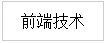
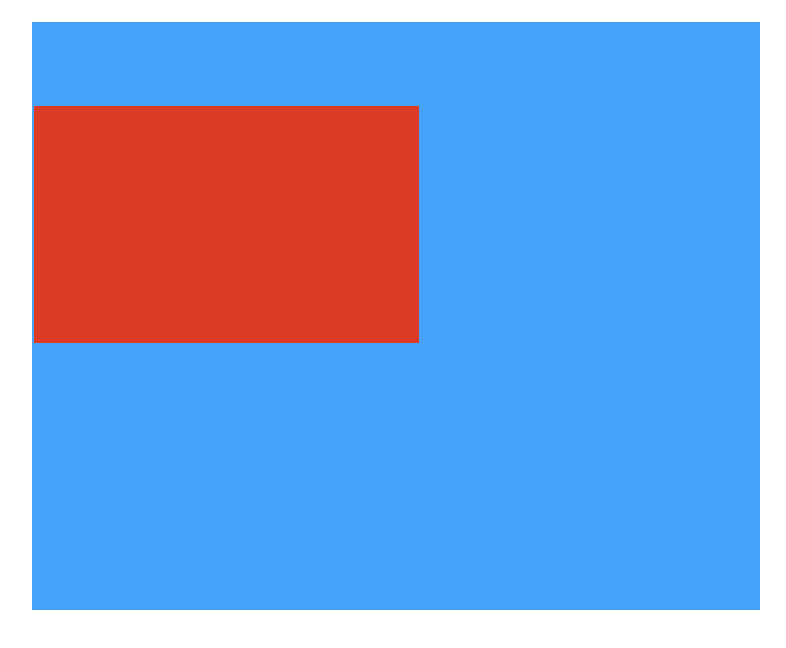

# 第9章前端开发

# 9.0 前端内容介绍

## 前端内容初识

### 前端内容介绍

### web1.0时代的网页制作

网页制作是web1.0时代的产物，那个时候的网页主要是静态网页，所谓的静态网页就是没有与用户进行交互而仅仅供读者浏览的网页，我们当时称为“牛皮癣”网页。例如一篇QQ日志、一篇博文等展示性文章。在web1.0时代，用户能做的唯一事情就是浏览这个网站的文字图片内容，这时用户也不能像现在在大多数网站都可以评论交流（缺乏交互性）。相信可能大多数人都听过“网页三剑客 Dreamweaver+Fireworks+Flash”吧，这个组合就是web1.0时代额产物

### web2.0时代的前端开发

“前端开发”是从“网页制作”演变而来的。

从2005年开始，互联网进入web 2.0时代，由单一的文字和图片组成的静态网页已经不能满足用户的需求，用户需要更好的体验。在web 2.0时代，网页有静态网页和动态网页。所谓动态网页，就是用户不仅仅可以浏览网页，还可以与服务器进行交互。举个例子，你登陆新浪微博，要输入账号密码，这个时候就需要服务器对你的账号和密码进行验证通过才行。web2.0时代的网页不仅包含炫丽的动画、音频和视频，还可以让用户在网页中进行评论交流、上传和下载文件等（交互性）。这个时代的网页，如果是用“网页三剑客Dreamweaver+Fireworks+Flash”制作的，那是远远不能满足需求。现在网站开发无论是开发难度，还是开发方式上，都更接近传统的网站后台开发，所以现在不再叫“网页制作”，而是叫“web前端开发”。

所以，处于web2.0时代的你，如果要学习网站开发技术，就不要再相信所谓的“网页三剑客Dreamweaver+Fireworks+Flash”，因为这个组合已经是上个互联网时代的产物。而且这个组合开发出来的网站问题也非常多，例如代码冗余、网站维护困难（学习到后期，你会知道为什么不用这个组合了

### Web前端能做什么？

公司官网（在PC通过浏览器来访问公司网站）移动端网页（在手机上来浏览公司信息、小游戏等）移动端APP（例如：淘宝、去哪儿旅游、携程等）微信小程序（微信最新推出的功能，随用随装，不占用手机空间）皮皮虾我们走可乐在厨房 红牛在冰箱66666。前端开发所学技术由简单到难，所以在很多网站上你会看到“七天入门前端”的视频博客等等，也就是说一星期就学会了HTML+CSS。那么最基本的页面你就可以书写了。

### 为什么要学习前端开发

我们为什么要学习前端开发，因为我们的课程定位是Python全栈开发，也就是说我们不仅要掌握后端开发的技术还要掌握一定程度的前端开发技术。 通过前面课程的学习，相信大家都已经掌握了Python基础语法、函数、面向对象、网络编程及数据库相关的内容。上面说的那些内容都是属于后端开发范畴的，在接下来的这个章节我们将一起来学习一下前端部分的内容，那么前端的核心内容有三部分，学习HTML+CSS是没有什么逻辑可言的。跟前面的课程可能存在一定的差异，希望同学们放下心里的包袱，跟着老师慢慢进入到前端开发。

### 前端开发都有哪些内容

我们知道，用所谓的网页三剑客已经不能满足需求了，那前端开发究竟要学习什么技术呢？网页最主要由3部分组成：结构、表现和行为。网页现在新的标准是W3C，目前模式是HTML、CSS和JavaScript。

### 三部分都是做什么的

（1）HTML是什么？

```plain
HTML，全称“Hyper Text Markup Language（超文本标记语言）”，简单来说，网页就是用HTML语言制作的。HTML是一门描述性语言，是一门非常容易入门的语言。
```

（2）CSS

```plain
CSS，全称“（层叠样式表）”。以后我们在别的地方看到“层叠样式表”、“CSS样式”，指的就是CSS。
```

（3）JavaScript

```plain
JavaScript是一门脚本语言。
```

（4）HTML、CSS和JavaScript的区别 我们都知道前端技术最核心的是HTML、CSS和JavaScript这三种。但是这三者究竟是干嘛的呢？

```plain
“HTML是网页的结构，CSS是网页的外观，而JavaScript是页面的行为
```

**哈哈！！有的同学此时可能就想，老师，你这不是等于没说吗？好吧，我给大家打个比喻。我们把前端开发的过程比喻成“建房子”，做一个网页就像盖一栋房子，先把房子结构建好（HTML）。建好房子之后给房子装修（CSS），例如往窗户安上窗帘、往地板铺上漂亮的瓷砖。最后呢，装修完了之后，当夜幕降临的时候，我们要开灯（JavaScript），这样才能看得见里面。现在大概懂了吧**。

我们回到实际例子中去，打开路飞学城官网([https://www.luffycity.com)，](https://www.luffycity.com%29%2C/)我们分析一下它的导航条，看一下“前端技术“这栏目的具有以下基本特点： **1、导航条文字颜色是灰色 2、大小是12px 3、背景颜色是白色 4、鼠标移到登录人头像时会展示你的个人信息**

那么这些效果是如何做出来的呢？ 很简单，思路呢其实就跟上面”建房子一样“，我们先用HTML搭建网页结构，这时候默认情况下，字体、字体颜色、字体大小和背景颜色如下图，仅仅使用HTML的文字



然后我们通过CSS修饰一下，改变其字体、字体大小、字体颜色和背景颜色，得到如下的效果图：在HTML基础上加入CSS的文字


最后，我们通过JavaScript定义鼠标一个行为，就是鼠标移动到上面的时候，背景颜色会变为深绿色，效果如下：


<!-- OCR_START -->
> 前端技术
> 前端技术
<!-- OCR_END -->


好了，相信大部分同学读到这里，肯定对于前端有所了解，那咱们就废话不多说，跟着老师这段时间一起去”搬砖“吧！！！

# 9.1 HTML

## 9.1.1 HTML简介

## HTML

HTML是一个网页的主体部分，也是一个网页的基础。因为一个网页可以没有样式，可以没有交互，但是必须要有网页需要呈现的内容。所以HTML部分是整个前端的基础。

## HTML简介

HTML，全称是超文本标记语言（HyperText Markup Language），它是一种用于创建网页的标记语言。标记语言是一种将文本（Text）以及文本相关的其他信息结合起来，展现出关于文档结构和数据处理细节的计算机文字编码。与文本相关的其他信息（包括例如文本的结构和表示信息等）与原来的文本结合在一起，但是使用标记（markup）进行标识。

### ？？？？？？ what？标记语言？ 什么是标记语言呢？

举个通俗的例子，就是一段文本内，不但有该文本真正需要传递给读者的有用信息，更有描述该段文本中各部分文字的情况的信息。 如下：

```plain
<问题>
    <问题标题>Alex老师是不是很帅？
    <问题描述>这是你说的啊，我可没说
<回答>
    <回答者>二狗子
    <回答者简介>我就叫二狗子
    <回答内容>你说什么就是什么啦，与我没关系了，反正我是个男的！！
<回答>
    <回答者>三袍子
    <回答者简介>我就叫三袍子
    <回答内容>我反对，我觉得武sir更帅。
```

就像这样，我用自己发明的一个标记语言描述了这个问题以及问题下的回答。这段标记语言既描述了文档本身的信息（问题内容和回答的情况），也描述了文档的结构和各部分的作用。而HTML则是世界通用的、用于描述一个网页的信息的标记语言，我们使用的浏览器具有将HTML文档渲染并展示给用户的功能（当你访问知乎网站的时候，实际上你获得了一份由知乎提供给你的HTML文档。浏览器将根据HTML文档渲染出你看到的网页）。将上面那段我刚发明的标记语言“翻译”成HTML，大概就是这样

```plain
<header>
    <h1>Alex老师是不是很帅？</h1>
    <p>这是你说的啊，我可没说</p>
</header>
<div>
        <div>
          二狗子<span>,我就叫二狗子</span>
        </div>
        <p>
            你说什么就是什么啦，与我没关系了，反正我是个男的！</a>
        </p>
        <div>
          三袍子,<span>我就叫三袍子</span>
        </div>
        <p>
           我反对，我觉得武sir更帅。
        </p>
</div>
```

上一段HTML文本中，header,div这类的带尖括号的玩意儿叫标签，标签描述了文本的作用，比如p标签表示其内部的文本是一个段落，a标签标识内部的文本是超链接等；与此同时，通过标签的互相嵌套，表示了这个文档的结构。至于哪个标签表示什么意思、总共有多少个种类的标签这类的问题，由W3C(万维网联盟)这一组织规定。 很显然，HTML作为一种标记语言它并没有什么逻辑，简单来说就是一些符号，一些有特殊意义的符号，一些浏览器认识的有特殊意义的符号。

### 开发者写好的网页

我们写好的HTML文件最终都会运行在**浏览器**上，由**浏览器来解析。** HTML很容易学习，相信你很快就能够掌握它。

## 9.1.2 开发环境

## 开发环境

市面上有很多的HTML编辑器可以选择，常见的Hbuild、Sublime Text、Dreamweare都可以用来开发HTML。 当然PyCharm也支持HTML开发。

## 文件后缀名规范

文件后缀一般使用.html或.htm .html与.htm均是静态网页后缀名，网页文件没有区别与区分，html与htm后缀网页后缀可以互换，对网页完全没有影响同时也没有区别。可以认为html与htm没有本质区别，唯一区别即多与少一个“l”。

对于开发环境我们不做多余的介绍啊，那么我们正式进入HTML标签的学习吧。 ps：同学们！同学们 如果你想知道整个前端所有的标签有哪一些，那么你可以打开一个百度首页，F12或者右击检查，你就会发现，如图：

<!-- OCR_START -->
Elements
Sources
Network
Performance
Memory
Application
Security
Audits
<!DOCTYPE html>
<html xmlns="http://www.w3.org/1999/xhtml" class="sui-componentWrap">
<head>.</head>
<body class=" has-background s-manhattan-index" style>
红色标记的就是一部分标签，
有没有感觉像梯形
<textarea id="s_is_result_css" style="display:none;">.</textarea>
<textarea
a id="s_index_off_css" style="display:none;">.</textarea>
<divclass="s-skin-containers-isindex-wrap"style="background-color:rgb(64,64
64);background-image:url("https://
ss2.bdstatic.com/kfoZeXSm1A5BphGlnYG/skin/881.jpg?2");">
<divid="s_mod_weather"class="s-mod-weathers-isindex-wraphide-unknow-city">
<a class="city-wather" href="//www.baidu.com/s?
tn=baidut0p10&rSVidx=2&wd=%E5%8C%97%E4%BA%AC%E5%A4%A9%E6%B0%94%E9%A2%84%E6%8A%A5
target="_blank">
<divclass="show-weather">
<em_class="show-city-name"data-key="北京">北京:
<spanclass="weather-icon"style="background-image:url(https://ss1.bdstatic.com/kvoZeXSm1A5BphGlnYG/icon/weather/
aladdin/png_18/a1.png);*background-image:none;*filter:progid:DXImageTransform.Microsoft.AlphaImageLoader(src=https://
ss1.bdstatic.com/kvoZeXSm1A5BphGlnYG/icon/weather/aladdin/png_18/ai.png,enabled=true,sizingMethod="=")"crop;>
13℃
<spanclass="show-temp">
<divclass="show-pollution">
<!-- OCR_END -->

## 9.1.3 HTML标签介绍

## HTML标签

HTML作为一门标记语言，是通过各种各样的标签来标记网页内容的。我们学习HTML主要就是学习的HTML标签。

### 那什么是标签呢？

```plain
1. 在HTML中规定标签使用英文的的尖括号即`<`和`>`包起来，如`<html>`、`<p>`都是标签。
2. HTML中标签**通常**都是成对出现的，分为开始标签和结束标签，结束标签比开始标签多了一个`/`，如`<p>标签内容</p>`和`<div>标签内容</div>`。开始标签和结束标签之间的就是标签的内容。
3. 标签之间是可以嵌套的。例如：div标签里面嵌套p标签的话，那么`</p>`必须放在`</div>`的前面。
4. HTML标签不区分大小写，`<h1>`和`<H1>`是一样的，但是我们通常建议使用小写，因为大部分程序员都以小写为准。
```

注意：不是所有标签都支持互相嵌套。（看下节）

## 9.1.4 HTML文档结构(重点)

## HTML文档结构

这一节课我们来学习HTML文件的结构：一个HTML文件是有自己固定结构的。

```plain
<!DOCTYPE HTML>
<html>
    <head>...</head>
    <body>...</body>
</html>
```

<!-- OCR_START -->
- <!DOCTYPE HTML>
- <html>
- <head>
- 头部信息相关内容
- <body>
- 页面主体相关内容
<!-- OCR_END -->

 让我们来解释一下上面的代码：

首先，`<!DOCTYPE HTML>`是文档声明，必须写在HTML文档的第一行，位于`<html>`标签之前，表明该文档是HTML5文档。

1. `<html></html>` 称为根标签，所有的网页标签都在`<html></html>`中。
2. `<head></head>` 标签用于定义文档的头部，它是所有头部元素的容器。常见的头部元素有`<title>`、`<script>`、`<style>`、`<link>`和`<meta>`等标签，头部标签在下一节中会有详细介绍。
3. 在`<body>`和`</body>`标签之间的内容是网页的主要内容，如`<h1>`、``、`<a>`、``等网页内容标签，在`<body>`标签中的内容（图中淡绿色部分内容）最终会在浏览器中显示出来。

HTML文档包含了HTML标签及文本内容，不同的标签在浏览器上会显示出不同的效果，所以我们需要记住最常见的标签的特性。

## 9.1.5 HTML注释

## HTML注释

无论我们学习什么编程语言，一定要重视的就是注释，我个人一直把注释看成是代码之母。 HTML中注释的格式:

```plain
<!--这里是注释的内容-->
```

注意： 注释中可以直接使用回车换行。

并且我们习惯用注释的标签把HTML代码包裹起来。如：

```plain
<!-- xx部分 开始 -->
    这里放你xx部分的HTML代码
<!-- xx部分 结束 -->
```

HTML注释的注意事项：

1. HTML注释不支持嵌套。
2. HTML注释不能写在HTML标签中。

## 9.1.6 head标签相关内容

## head标签

我们首先来介绍一下`head`标签的主要内容和作用，文档的头部描述了文档的各种属性和信息，包括文档的标题、编码方式及URL等信息,这些信息大部分是用于提供索引,辩认或其他方面的应用（移动端）的等。 以下标签是可以用在`head`标签中的：

```plain
<head lang='en'>
    <title>标题信息</title>
    <meta charset='utf-8'>
    <link>
    <style type='text/css'></style>
    <script type='text/javascript'></script>
</head>
```

### title标签

`<title>`标签：在`<title>`和`</title`>标签之间的文字内容是网页的标题信息，它会显示在浏览器标签页的标题栏中。可以把它看成是一个网页的标题。主要用来告诉用户和搜索引擎这个网页的主要内容是什么，搜索引擎可以通过网页标题，迅速的判断出当前网页的主题。

我们接下来做一个小练习，创建一个带有我们自定义标题内容的网页：

```plain
<!DOCTYPE HTML>
<html>
    <head>
        <title>路飞学城</title>
    </head>
    <body></body>
</html>
```

将上面的文件另存为`demo.html`，然后用浏览器打开，就可以看到下面的内容。

<!-- OCR_START -->
路飞学城
Q1mi
file:/
"//"+/+/'aboutLuffyCity/docs/html/demo
title标签中的内容会显示在这个位置
<!-- OCR_END -->

上面我们介绍了`title`标签的用法，接下来我们继续看一下`head`标签中可以使用的其他标签：

### meta标签

Meta标签介绍：

元素可提供有关页面的原信息（mata-information）,针对搜索引擎和更新频度的描述和关键词。

标签位于文档的头部，不包含任何内容。

提供的信息是用户不可见的。 meta标签的组成：meta标签共有两个属性，它们分别是http-equiv属性和name属性，不同的属性又有不同的参数值，这些不同的参数值就实现了不同的网页功能。

常用的meta标签：

1. http-equiv属性

它用来向浏览器传达一些有用的信息，帮助浏览器正确地显示网页内容，与之对应的属性值为content，content中的内容其实就是各个参数的变量值。

```plain
<!--重定向 2秒后跳转到对应的网址，注意分号-->
<meta http-equiv="refresh" content="2;URL=http://www.luffycity.com">
<!--指定文档的内容类型和编码类型 -->
<meta http-equiv="Content-Type" content="text/html;charset=utf-8" />
<!--告诉IE浏览器以最高级模式渲染当前网页-->
<meta http-equiv="x-ua-compatible" content="IE=edge">
```

1. name属性

主要用于页面的关键字和描述，是写给搜索引擎看的，关键字可以有多个用 ‘,’号隔开，与之对应的属性值为content，content中的内容主要是便于搜索引擎机器人查找信息和分类信息用的。

```plain
<meta name="keywords" content="meta总结,html meta,meta属性,meta跳转">
<meta name="description" content="路飞学城">
```

### 其他标签

```plain
<!--标题-->
<title>路飞学城</title>
<!--icon图标（网站的图标）-->
<link rel="icon" href="fav.ico">
<!--定义内部样式表-->
<style></style>
<!--引入外部样式表文件-->
<link rel="stylesheet" href="mystyle.css">
<!--定义JavaScript代码或引入JavaScript文件-->
<script src="myscript.js"></script>
```

## 9.1.7 body 标签相关内容(重点)

()## body标签

想要在网页上展示出来的内容一定要放在`body`标签中。 把我们之前海燕那一段HTML代码贴过来，保存到一个HTML格式的文件中。

```plain
<!DOCTYPE HTML>
<html>
    <head>
        <meta http-equiv="Content-Type" content="text/html; charset=utf-8" />
        <title>路飞学城</title>
    </head>
    <body>
        <h1>海燕</h1>
        <p>在苍茫的大海上，</p>
        <p>狂风卷集着乌云。</p>
        <p>在乌云和大海之间，</p>
        <p>海燕像黑色的闪电，</p>
        <p>在高傲地飞翔。</p>
    </body>
</html>
```

使用浏览器打开，看一下效果：

<!-- OCR_START -->
- 路飞学城
- Q1mi
- O file:///u:u/,///r./h/;/olumt//aboutluffyCity/docs/html/demo2.html
- 1
- 海燕
- 在苍茫的大海上，
- 狂风卷集着乌云。
- 在乌云和大海之间,
- body标签中的内容会显示在这里
- 海燕像黑色的闪电，
- 在高傲地飞翔。
<!-- OCR_END -->

### 常用标签一

## 标题标签 h1~h6

`<h1>` - `<h6>` 标签可定义标题。`<h1>` 定义最大的标题。`<h6>` 定义最小的标题。 由于 h 元素拥有确切的语义，因此请您慎重地选择恰当的标签层级来构建文档的结构。因此，请不要利用标题标签来改变同一行中的字体大小。相反，我们应当使用css来定义来达到漂亮的显示效果。 标题标签通常用来制作文章或网站的标题。

h1~h6标签的默认样式：

```plain
<!DOCTYPE HTML>
<html>
    <head lang='en'>
        <meta http-equiv="Content-Type" content="text/html; charset=utf-8" />
        <title>路飞学城</title>
    </head>
    <body>
        <h1>一级标题</h1><h2>二级标题</h2>
        <h3>三级标题</h3>
        <h4>四级标题</h4>
        <h5>五级标题</h5>
        <h6>六级标题</h6>
    </body>
</html>
```

请看上面代码 `<h1>`和`<h2>`书写在一行上展示，但是在浏览器的效果却是换行了，大家现在预习一下9.1.9标签分类知识点。

```plain
文本样式标签主要用来对HTML页面中的文本进行修饰，比如加粗、斜体、线条样式等...
1. `<b></b>`：加粗
2. `<i></i>`：斜体
3. `<u></u>`：下划线
4. `<s></s>`：删除线
5. `<sup></sup>`：上标 
6. `<sub></sub>`：下标
现在如果想在一段文字中特别强调某几个字，这时候就可以用到`<em>`或`<strong>`标签。
这两个标签都是表示强调，但是两者在强调的语气上有区别:`<em>`表示强调，`<strong>`表示更强烈的强调。
在浏览器中`<em>`默认会用斜体表示，`<strong>`会用粗体来表示。两个标签相比，我们通常会推荐大家使用`<strong>`表示强调
```

## 段落标签 p

``,paragraph的简写。定义段落

```plain
<body>
        <p>路飞学城立志帮助有志向的年轻人通过努力学习获得体面的工作和生活!路飞学员通过学习Python ,金融分析,人工智能等互联网最前沿技术,开启职业生涯新可能</p>
        <p>路飞学城立志帮助有志向的年轻人通过努力学习获得体面的工作和生活!路飞学员通过学习Python ,金融分析,人工智能等互联网最前沿技术,开启职业生涯新可能</p>
</body>
```

浏览器展示特点：

1. 跟普通文本一样，但我们可以通过css来设置当前段落的样式
2. 是否又独占一行呢？ 答案是的 块级元素

## 超链接标签 a

超级链接`<a>`标记代表一个链接点，是英文anchor（锚点）的简写。它的作用是把当前位置的文本或图片连接到其他的页面、文本或图像

```plain
<body>
    <h1>
        <!-- a链接 超链接  
        target:_blank 在新的网站打开链接的资源地址
                _self 在当前网站打开链接的资源地址
        title: 鼠标悬停时显示的标题
        -->
        <a href="http://www.baidu.com" target="_blank" title="路飞学城">路飞学城</a>
        <a href="a.zip">下载包</a>
        <a href="mailto:zhaoxu@tedu.cn">联系我们</a>
        <!-- 返回页面顶部的内容 -->
        <a href="#">跳转到顶部</a>
        <!-- 返回某个id -->
        <a href="#p1">跳转到p1</a>
        <!-- javascript:是表示在触发<a>默认动作时，执行一段JavaScript代码，而 javascript:; 表示什么都不执行，这样点击<a>时就没有任何反应。 -->
        <a href="javascript:alert(1)">内容</a>
        <a href="javascript:;">内容</a>
    </h1>
</body>
```

target:\_blank 在新的网站打开链接的资源地址 target：\_self 在当前网站打开链接的资源地址 title: 表示鼠标悬停时显示的标题

链接其他表现形式：

1. 目标文档为下载资源 例如：href属性值，指定的文件名称，就是下载操作(rar、zip等)
2. 电子邮件链接 前提：计算机中必须安装邮件客户端，并且配置好了邮件相关信息。 例如：`<a href="mailto:zhaoxu@tedu.cn">联系我们</a>`
3. 返回页面顶部的空链接或具体id值的标签 例如：`<a href="#">内容</a>`或`<a href="#id值">内容</a>`
4. javascript:是表示在触发`<a>`默认动作时，执行一段JavaScript代码。 例如：`<a href="javascript:alert()">内容</a>`
5. javascript:;表示什么都不执行，这样点击`<a>`时就没有任何反应 例如：`<a href="javascrip:;">`内容\</a

## 列表标签 ul，ol

网站页面上一些列表相关的内容比如说物品列表、人名列表等等都可以使用列表标签来展示。通常后面跟`<li>`标签一起用，每条li表示列表的内容

`<ul>`:unordered lists的缩写 无序列表 `<ol>`:ordered listsde的缩写 有序列表

```plain
<!-- 无序列表 type可以定义无序列表的样式-->
    <ul type="circle">
        <li>我的账户</li>
        <li>我的订单</li>
        <li>我的优惠券</li>
        <li>我的收藏</li>
        <li>退出</li>
    </ul>
    <!-- 有序列表 type可以定义有序列表的样式 -->
    <ol type="a">
        <li>我的账户</li>
        <li>我的订单</li>
        <li>我的优惠券</li>
        <li>我的收藏</li>
        <li>退出</li>
    </ol>
```

ol标签的属性：

type：列表标识的类型

* 1：数字
* a：小写字母
* A：大写字母
* i：小写罗马字符
* I：大写罗马字符

列表标识的起始编号

* 默认为1

ul标签的属性： type：列表标识的类型

* disc：实心圆(默认值)
* circle：空心圆
* square：实心矩形
* none：不显示标识

## 盒子标签 `div`

``可定义文档的分区 division的缩写 译：区 `` 标签可以把文档分割为独立的、不同的部分,请看下面代码我们将他们进行分区

```plain
<!DOCTYPE html>
<html>
<head lang="en">
    <meta charset="utf-8" >
    <title>常用标签一</title>
</head>
<body>
    <div id="wrap">
        <div class="para">
            <p style="height: 1000px" id="p1">段落</p>
        </div>
        <div class="anchor">
            我是普通的文本
            <h1>
                <a href="http://www.baidu.com" target="_blank" title="路飞学城">路飞学城</a>
                <a href="a.zip">下载包</a>
                <a href="mailto:zhaoxu@tedu.cn">联系我们</a>
                <a href="#">跳转到顶部</a>
                <a href="#p1">跳转到p1</a>
                <a href="javascript:alert(1)">内容</a>
                <a href="javascript:;">内容</a>
            </h1>
        </div>
        <!-- <h2>路飞学城</h2>
        <h3>路飞学城</h3>
        <h4>路飞学城</h4>
        <h5>路飞学城</h4>
        <h6>路飞学城</h6> -->
        <div class="para">
        <!-- 定义段落 通常指文章一段内容 -->
        <p>路飞学城立志帮助有志向的年轻人通过努力学习获得体面的工作和生活!路飞学员通过学习Python ,金融分析,人工智能等互联网最前沿技术,开启职业生涯新可能</p>
        <p>路飞学城立志帮助有志向的年轻人通过努力学习获得体面的工作和生活!路飞学员通过学习Python ,金融分析,人工智能等互联网最前沿技术,开启职业生涯新可能</p>
        <p>路飞学城立志帮助有志向的年轻人通过努力学习获得体面的工作和生活!路飞学员通过学习Python ,金融分析,人工智能等互联网最前沿技术,开启职业生涯新可能</p>
        </div>
        <div class="lists">
            <!-- 无序列表 -->
            <ul type="circle">
                <li>我的账户</li>
                <li>我的订单</li>
                <li>我的优惠券</li>
                <li>我的收藏</li>
                <li>退出</li>
            </ul>
            <!-- 有序列表 -->
            <ol type="a">
                <li>我的账户</li>
                <li>我的订单</li>
                <li>我的优惠券</li>
                <li>我的收藏</li>
                <li>退出</li>
            </ol>
        </div>
    </div>
</body>
</html>
```

分析上面代码可以下面的层次结构

```plain
<div id='wrap'>
    <div class='para'></div>
    <div class='anchor'></div>
    <div class='para'></div>
    <div class='lists'></div>    
</div>
```

我们将文档放在一个父级的区（div）中，它里面包含四块区（div）域，浏览器查看效果,你会发现每小块区域都是独占一行的，所以div是块级元素。另外，每块区域表示独立的一块，id属性和class属性其实很简单，你可以看成给这个区域起个名字。id是唯一的，一个页面中不能有两个重复的id，跟身份证号码一样，class可以设置同样的属性值，并且可以设置多个，例如class=’para n1‘

## 图片标签 ``

一个网页除了有文字，还会有图片。我们使用``标签在网页中插入图片。

语法：``

注意：

1. src设置的图片地址可以是本地的地址也可以是一个网络地址。
2. 图片的格式可以是png、jpg和gif。
3. alt属性的值会在图片加载失败时显示在网页上。
4. 还可以为图片设置宽度(width)和高度(height)，不设置就显示图片默认的宽度和高度

```plain
<div>
     <span>与行内元素展示的标签<span>
     <span>与行内元素展示的标签<span>
     
     
 </div>
```

1. 浏览器查看效果：行内块元素
2. 与行内元素在一行内显示
3. 可以设置宽度和高度
4. span标签可以单独摘出某块内容，结合css设置相应的样式

```plain
<p>路飞学城立志帮助有志向的年轻人通过努力学习获得体面的工作和生活!路飞学员通过学习Python ,<span>金融分析</span>,<span>人工智能</span>等互联网最前沿技术,开启职业生涯新可能</p>
```

好的，同学们，此时大家是不是对于以上标签有所认知了呢？ 这样吧！我来出一个小练习，你来做！ 练习：将img标签中的图片独占一行展示，并设置设置相应标题，在图片下方，描述该图片内容的信息。

## 其他标签

#### 换行标签 ``

``标签用来将内容换行，其在HTML网页上的效果相当于我们平时使用word编辑文档时使用回车换行。

#### 分割线 `<hr>`

`<hr>`标签用来在HTML页面中创建水平分隔线，通常用来分隔内容

#### 特殊符号

浏览器在显示的时候会移除源代码中多余的空格和空行。 所有连续的空格或空行都会被算作一个空格。需要注意的是，HTML代码中的所有连续的空行（换行）也被显示为一个空格。

举个例子：

```plain
<!DOCTYPE HTML>
<html>
    <head>
        <meta http-equiv="Content-Type" content="text/html; charset=utf-8" />
        <title>路飞学城</title>
    </head>
    <body>
        <p>帮助有志向的年轻人
            通过努力学习获得
            体面的   工作    和    生活！</p>
    </body>
</html>
```

上面的代码在浏览器中最终的显示效果：

<!-- OCR_START -->
Q1mi
路飞学城
① file:///Users/liwenzhou/workspace/docs/aboutLuffyCity/docs/html/demo/HTML/demo7.html
☆：
帮助有志向的年轻人通过努力学习获得体面的工作和生活！
连续的空格或空行在浏览器中都会显示为一个空格。
<!-- OCR_END -->

> 所以HTML代码对缩进的要求并不严格，我们通常使用缩进来让我们的代码结构更清晰，仅此而已。

### 特殊字符

在上一个实例中，我们演示了HTML中输入空格、回车都是没有作用的。要想输入空格，需要用特殊符号 -- `&nbsp;`。

常用的特殊字符：

| 内容 | 代码 |
| :---: | :---: |
| 空格 | `&nbsp;` |
| > | `&gt;` |
| < | `&lt;` |
| & | `&amp;` |
| ¥ | `&yen;` |
| 版权 | `&copy;` |
| 注册 | `&reg;` |

[HTML特殊符号对照表](http://tool.chinaz.com/Tools/HtmlChar.aspx)

[](http://book.luffycity.com/python-book/html/bodybiao-qian-xiang-guan-nei-rong.html)\[

]\(http://book.luffycity.com/python-book/html/bodybiao-qian-xiang-guan-nei-rong/chang-yong-biao-qian-er.html)

### 常用标签二

### 表格标签 table

表格由`<table>` 标签来定义。每个表格均有若干行（由 `<tr>` 标签定义），每行被分割为若干单元格（由`<td>`标签定义）。字母 td 指表格数据（table data），即数据单元格的内容。数据单元格可以包含文本、图片、列表、段落、表单、水平线、表格等等

<!-- OCR_START -->
- table-表格
- thead-表格头
- tbody-表格主体
- 表格
- tr-表格行
- th-表格头里的单元格（默认加粗并且居中）
- td-表格主体里的单元格
- tfoot-表格底部
<!-- OCR_END -->

```plain
<div class="table">
        <table>
            <!--表格头-->
            <thead>
                <!--表格行-->
                <tr>
                    <!--表格列，【注意】这里使用的是th-->
                    <th></th>
                </tr>
            </thead>
            <!--表格主体-->
            <tbody>
                <!--表格行-->
                <tr>
                    <!--表格列，【注意】这里使用的是td-->
                    <td></td>
                </tr>
                <tr>
                    <td></td>
                </tr>
            </tbody>
            <!--表格底部-->
            <tfoot>
                <tr>
                    <td></td>
                </tr>
            </tfoot>
        </table>
</div>
```

表格行和列的合并

```plain
rowspan 合并行(竖着合并)
colspan 合并列(横着合并)
```

```plain
<body>
    <div class="table">
        <table border="1" cellspacing="0">
            <!--表格头-->
            <thead>
                <!--表格行-->
                <tr>
                    <!--表格列，【注意】这里使用的是th-->
                    <th></th>
                    <th>星期一</th>
                    <th>星期二</th>
                    <th>星期三</th>
                    <th>星期四</th>
                    <th>星期五</th>
                </tr>
            </thead>
            <!--表格主体-->
            <tbody>
                <!--表格行-->
                <tr>
                    <td rowspan="3">上午</td>
                    <!--表格列，【注意】这里使用的是td-->
                    <td>语文</td>
                    <td>数学</td>
                    <td>英文</td>
                    <td>生物</td>
                    <td>化学</td>
                </tr>
                <tr>
                    <!--表格列，【注意】这里使用的是td-->
                    <td>语文</td>
                    <td>数学</td>
                    <td>英文</td>
                    <td>生物</td>
                    <td>化学</td>
                </tr>
                <tr>
                    <!--表格列，【注意】这里使用的是td-->
                    <td>语文</td>
                    <td>数学</td>
                    <td>英文</td>
                    <td>生物</td>
                    <td>化学</td>
                </tr>
                <tr>
                    <td rowspan ="2">下午</td>
                    <!--表格列，【注意】这里使用的是td-->
                    <td>语文</td>
                    <td>数学</td>
                    <td>英文</td>
                    <td>生物</td>
                    <td>化学</td>
                </tr>
                <tr>
                    <!--表格列，【注意】这里使用的是td-->
                    <td>语文</td>
                    <td>数学</td>
                    <td>英文</td>
                    <td>生物</td>
                    <td>化学</td>
                </tr>
            </tbody>
            <!--表格底部-->
            <tfoot>
                <tr>
                    <td colspan="6">课程表</td>
                </tr>
            </tfoot>
        </table>
    </div>
</body>
```

### 表单标签 form

表单是一个包含表单元素的区域

表单元素是允许用户在表单中输入内容，比如：文本域(textarea)、输入框(input)、单选框（）

### 表单的作用

表单用于显示、手机信息，并将信息提交给服务器

1. 语法：

```plain
<form>允许出现表单控件</form>
```

1. 属性 见下图：\
   
<!-- OCR_START -->
定义表单被提交时发生的动作
action
提交给服务器处理程序的地址
作用：定义表单提交数据时的方式
默认值，日
明文提交，所提交的数据时可以显示在地址上，安全性低
get
method
提交数据有大小限制，最大为2KB
取值
隐式提交-所提交的内容，不会显示到地址栏上，安全性高
post
无大小限制
编码类型，即表单数据进行编码的方式
允许表单将什么样的数据提交给服务器
取值：1.application/x-www-form-urlencoded
默认。允许将普通字符，特殊字符，都提交给服务器，不允许提交文件
enctype
2.multipart/form-data，允许被将文件提交给服务器
3.text/plain只允许提交普通字符。特殊字符，文件等都无法提交
form表单标签
注意：如果有文件需要提交给服务器，method必须为POST，enctype必须为multipart/form-data
<!-- OCR_END -->

2. 表单控件分类 见下图\
   
<!-- OCR_START -->
- 作用：允许用户录入多行数据到表单控件中
- textarea文本域
- cols指定文本区域的列数，变相设置当前元素宽度
- rows指定文本区域的行数，变相设置当前元素高度
- size取值大于1的话，则为滚动列表
- 否则就是下拉选项框
- select属性
- multiple设置多选，该属性出现在<select>中，
- 那么就允许多选（针对滚动列表）
- select和option选项框
- value选项的值
- option属性
- selected预选中
- 注意：如果不设置selected属性的话，那么选项框中的第一项会默认被选中
- button
- 表单控件分类
- text明文显示用户输入的数据
- <inputtype="text">
- password密文显示用户输入的数据
- <input type="password">
- type
- radio单选按钮checkbox复选框
- checked设置值后被选中
- input组元素
- submit功能固定化，负责将表中中的表单控件提交给服务器
- <input type="submit">
- fle上传文件所用
- <input type="file">
- value控件的值既要提交给服务器的数据
- name控件的名称，服务器用
- disabled该属性只要出现在标签中，表示的是禁用该控件
- lable功能：关联文本与表达元素的，点击文本时，如同点击表单元素一样
- for属性表示与该label相关联的表单控件元素的ID值
<!-- OCR_END -->

```plain
<form action="http://www.baidu.com" method="get">
            <!-- input -->
            <!--文本框-->
            <p>
                用户名称：
                <input type="text" name="txtUsename" value="请输入用户名称" readonly>
            </p>
            <p>
                用户密码：
                <input type="password" name="txtUsepwd">
            </p>
            <p>
                确认密码：
                <input type="password" name="txtcfmpwd" disabled>
            </p>
            <!--单选框-->
            <p>
                用户性别：
                <input type="radio" name="sexrdo" value="男">男
                <input type="radio" name="sexrdo" value="女" checked=''>女
            </p>
            <!--复选框-->
            <p>
                用户爱好：吃
                <input type="checkbox" name="chkhobby" value="吃" checked> 喝
                <input type="checkbox" name="chkhobby" value="喝"> 玩
                <input type="checkbox" name="chkhobox" value="玩"> 乐
                <input type="checkbox" name="chkhobox" value="乐" checked>
            </p>
            <!-- 按钮 -->
            <p>
                <input type="submit" name="btnsbt" value="提交">
                <input type="reset" name="btnrst" value="重置">
                <input type="button" name="btnbtn" value="普通按钮">
            </p>
            <!--文件选择框-->
            <p>
                请上传文件：
                <input type="file" name="txtfile">
            </p>
            <!--textarea-->
            <p>
                自我介绍：
                <textarea name="txt" cols="20" rows="5"></textarea>
            </p>
            <!--选择框-->
            <!--滚动列表 multiple设置以后实现多选效果，ctrl+鼠标左键进行多选-->
            <p>籍贯：
                <select name="sel" size="3" multiple>
                    <option value="深圳">深圳</option>
                    <option value="北京">北京</option>
                    <option value="上海">上海</option>
                    <option value="广州" selected>广州</option>
                </select>
            </p>
            <!--下拉列表-->
            <p>意向工作城市：
                <select name="sel">
                    <option value="深圳">深圳</option>
                    <option value="北京">北京</option>
                    <option value="上海">上海</option>
                    <option value="广州" selected>广州</option>
                </select>
            </p>        
        </form>
```

## 9.1.8 HTML标签属性

## HTML标签属性

HTML标签可以设置属性，属性一般以键值对的方式写在开始标签中。如

```plain
<div id="i1">这是一个div标签</div>
<p class='p1 p2 p3'>这是一个段落标签</p>
<a href="http://www.luffycity.com">这是一个链接</a>
<input type='button' onclick='addclick()'></input>
```

### 为什么能设置属性呢？

其实呢，你可以这样简单理解，因为最终我们这些标签会通过css去美化，通过javascript来操作，那么这些标签我们可以看成是一个对象，对象就应该有它自己的属性和方法。那么你像上面说到input标签，type=‘button’就是它的属性，onclick=‘addclick()’就是它的方法。后面会详细讲JavaScript和css，大家不用担心这里不好理解。

### 关于标签属性的注意事项：

```plain
1.HTML标签除一些特定属性外可以设置自定义属性，一个标签可以设置多个属性用空格分隔，多个属性不区分先后顺序。
2.属性值要用引号包裹起来，通常使用双引号也可以单引号。
3.属性和属性值不区分大小写，但是推荐使用小写。
```

## 9.1.9 HTML标签分类(重点)

## 标签分类

HTML中标签元素三种不同类型：**块状元素，行内元素，行内块状元素。**

常用的块状元素：

```plain
<div> <p> <h1>~<h6> <ol> <ul> <table><form> <li>
```

常用的行内元素

```plain
<a> <span> <br> <i> <em> <strong> <label>
```

常用的行内块状元素：

```plain
 <input>
```

**块级元素特点**：display:block;

1、每个块级元素都从新的一行开始，并且其后的元素也另起一行。**独占一行**

2、元素的高度、宽度、行高以及顶和底边距都**可设置**。

3、元素宽度在不设置的情况下，是它本身父容器的100%（和父元素的宽度一致），除非设定一个宽度。

**行内元素特点**：display:inline;

1、和其他元素都**在一行上**；

2、元素的高度、宽度及顶部和底部边距**不可设置**；

3、元素的宽度就是它包含的文字或图片的宽度，**不可改变。**

**行内块状元素的特点**：display:inline-block;

1、和其他元素都**在一行上**；

2、元素的高度、宽度、行高以及顶和底边距都**可设置**

### 注意

我们可以通过display属性对块级元素、行内元素、行内块元素进行转换，为后面页面布局做好了准备。

## 9.1.10 标签嵌套规则(重点)

### 标签嵌套规则

块元素可以包含内联元素或某些块元素，但内联元素却不能包含块元素，它只能包含其它的内联元素，例如：

`<h1></h1>` ✔️

`<a href=”#”></a>` ✔️

`` ❌

块级元素不能放在p标签里面，比如

`<ol><li></li></ol>` ❌

`` ❌

有几个特殊的块级元素只能包含内嵌元素，不能再包含块级元素，这几个特殊的标签是：

```plain
h1、h2、h3、h4、h5、h6、p
```

1. li元素可以嵌入ul，ol，div等标签

```plain
<ul>
        <li>
            <ul>
                <li>
                    <div>
                    </div>
                </li>
                <li>
                    <ol>
                        <li></li>
                        <li></li>
                        <li></li>
                        <li></li>
                    </ol>
                </li>
            </ul>
        </li>
    </ul>
```

## 9.1.11 HTML练习题

本小节重点： 熟练使用div+span布局，知道div和span的语义化的意思 熟悉对div、ul、li、span、a、img、table、form、input标签有深刻的认知，初期也了解他们，知道他们在浏览器上的初始化样式是怎样的。 熟练网站布局结构 比如 header区域，侧边栏区域，内容区域，脚部区域

1. 查询一下对div和span标签的理解
2. 如何理解标签的嵌套结构？它们的规则是怎样的？
3. 如果给你一个网站，让你只用div来画块的画，如何画？比如京东
4. 一个html文件包含几部分？
5. 当使用p标签的使用，应该注意什么？
6. 阐述一下form标签的作用？form标签的属性有哪些？
7. ul的孩子元素一定是li么？
8. 如何理解语义化的标签？
9. 标签的分类

功能实现：百度注册页面 

<!-- OCR_START -->
- 用户名
- 请设置用户名
- 手机号
- 可用于登录和找回密码
- 密码
- 请设置登录密码
- 验证码
- 请输入验证码
- 获取短信验证码
- 阅读并接受《百度用户协议》及《百度隐私权保护声明》
- 注册
<!-- OCR_END -->

不强制要求跟百度注册页面一样，最基本的结构要搭建出来，样式丑点不要紧

# 9.2 css

## 9.2.1 CSS介绍

## 我们为什么需要CSS?

使用css的目的就是让网页具有美观一致的页面，另外一个最重要的原因是内容与格式分离 在没有CSS之前，我们想要修改HTML元素的样式需要为每个HTML元素单独定义样式属性，当HTML内容非常多时，就会定义很多重复的样式属性，并且修改的时候需要逐个修改，费心费力。是时候做出改变了，所以CSS就出现了。

CSS的出现解决了下面两个问题：

1. 将HTML页面的内容与样式分离。
2. 提高web开发的工作效率。

## 什么是CSS?

CSS是指层叠样式表(**C**ascading **S**tyle **S**heets)，样式定义如何显示HTML元素，样式通常又会存在于样式表中。也就是说把HTML元素的样式都统一收集起来写在一个地方或一个CSS文件里。

### css的优势

1.内容与表现分离 2.网页的表现统一，容易修改 3.丰富的样式，使页面布局更加灵活 4.减少网页的代码量，增加网页浏览器速度，节省网络带宽 5.运用独立页面的css,有利于网页被搜索引擎收录

## 如何使用CSS？

我们通常会把样式规则的内容都保存在CSS文件中，此时该CSS文件被称为外部样式表，然后在HTML文件中通过`link`标签引用该CSS文件即可。这样浏览器在解析到该`link`标签的时候就会加载该CSS文件，并按照该文件中的样式规则渲染HTML文件。

## 9.2.2 CSS语法

## CSS基础语法

CSS语法可以分为两部分：

1. 选择器
2. 声明

声明由属性和值组成，多个声明之间用分号分隔。

<!-- OCR_START -->
```text
选择器
选择器{声明1； 属性 声明2; h1 {声明3; font-size:12px:
color:#F00;
声明
```
<!-- OCR_END -->

## CSS注释

注释是代码之母。

```plain
/*这是注释*/
```

## 9.2.3 css引入方式

网页中引用CSS样式

* 内联样式
* 行内样式表
* 外部样式表
  * 链接式
  * 导入式

<!-- OCR_START -->
- 文件路径
- 使作外部样式表
- 文件类型
- <head>
- <link href="style.css" rel="stylesheet" type="text/css" />
<!-- OCR_END -->

## 内嵌方式

`style`标签

```plain
<!doctype html>
<html>
    <head>
        <meta charset="utf8">
        <style>
            p {
                color: red;
            }
        </style>
    </head>
    <body>
        <p>这是一个p标签！</p>
    </body>
</html>
```

## 行内样式

```plain
<!doctype html>
<html>
<head>
<meta charset="utf8">
</head>
<body>
<p style="color: blue;">这是一个p标签！</p>
</body>
</html>
```

## 外联样式表-链接式

`link`标签

index.css

```plain
p {
  color: green;
}
```

然后在HTML文件中通过link标签引入：

```plain
<!doctype html>
<html>
    <head>
        <meta charset="utf8">
        <link rel="stylesheet" href="index.css">
    </head>
    <body>
        <p>这是一个p标签！</p>
    </body>
</html>
```

## 外联样式表-@import url()方式 导入式

了解即可。

index.css

```plain
@import url(other.css)
```

注意：

`@import url()`必须写在文件最开始的位置。

#### 链接式与导入式的区别

```plain
1、<link/>标签属于XHTML,@import是属性css2.1
2、使用<link/>链接的css文件先加载到网页当中，再进行编译显示
3、使用@import导入的css文件，客户端显示HTML结构，再把CSS文件加载到网页当中
4、@import是属于CSS2.1特有的，对于不兼容CSS2.1的浏览器来说就是无效的
```

## 9.2.4 基本选择器

**基本选择器**

首先来说一下，什么是选择器。在一个HTML页面中会有很多很多的元素，不同的元素可能会有不同的样式，某些元素又需要设置相同的样式，选择器就是用来从HTML页面中查找特定元素的，找到元素之后就可以为它们设置样式了。 选择器为样式规则指定一个作用范围。

基础选择器包括：

* 标签选择器
* 类选择器
* ID选择器
* 通用选择器

## 标签选择器

顾名思义就是通过标签名来选择元素：

示例：

```plain
p {
  color: red;
}
```

将所有的p标签设置字体颜色为红色。

## ID选择器

通过元素的ID值选择元素：

示例：

```plain
#i1 {
  color: red;
}
```

将id值为`i1`的元素字体颜色设置为红色。

## 类选择器

通过样式类选择元素：

示例：

```plain
.c1 {
  color: red;
}
```

将所有样式类含`.c1`的元素设置字体颜色为红色。

## 通用选择器

使用`*`选择所有元素：

```plain
* {
  color: black;
}
```

## 9.2.5 组合选择器

**高级选择器**

<!-- OCR_START -->
- 名称
- 说明
- 并集选择器
- 多个选择器通过逗号连接而成，同时声明多个风格相同样式
- 由两个选择器连接构成，选中二者范围的交集，两个选择器之间不能有空格
- 交集选择器
- 第一个必须是标签选择器，第二个必须是类选择器或者ID选择器
- 外层的选择器写在前面，内层的选择器写在后面，之间用空格分隔
- 后代选择器
- 标签嵌套时，内层的标签成为外层标签的后代
- 子元素选择器
- 通过>连接在一起而成，仅作用于子元素
- 属性选择器
- 选取带有指定属性的元素，或选取带有指定属性和值的元素
<!-- OCR_END -->

## 后代选择器

因为HTML元素可以嵌套，所以我们可以从某个元素的后代查找特定元素，并设置样式：

```plain
div p {
  color: red;
}
```

从div的所有后代中找p标签，设置字体颜色为红色。

## 儿子选择器

```plain
div>p {
  color: red;
}
```

从div的直接子元素中找到p标签，设置字体颜色为红色。

## 毗邻选择器

```plain
div+p {
  color: red;
}
```

找到所有紧挨在div后面的第一个p标签，设置字体颜色为红色。

## 弟弟选择器

```plain
div~p {
  color: red;
}
```

找到所有div标签后面同级的p标签，设置字体颜色为红色。

## 9.2.6 属性选择器

## 属性选择器

除了HTML元素的id属性和class属性外，还可以根据HTML元素的特定属性选择元素。

## 根据属性查找

```plain
[title] {
  color: red;
}
```

## 根据属性和值查找

找到所有title属性等于hello的元素：

```plain
[title="hello"] {
  color: red;
}
```

找到所有title属性以hello开头的元素：

```plain
[title^="hello"] {
  color: red;
}
```

找到所有title属性以hello结尾的元素：

```plain
[title$="hello"] {
  color: red;
}
```

找到所有title属性中包含（字符串包含）hello的元素：

```plain
[title*="hello"] {
  color: red;
}
```

找到所有title属性(有多个值或值以空格分割)中有一个值为hello的元素：

```plain
[title~="hello"] {
  color: red;
}
```

## 表单常用

```plain
input[type="text"] {
  backgroundcolor: red;
}
```

## 9.2.7分组选择器

当多个元素的样式相同的时候，我们没有必要重复地为每个元素都设置样式，我们可以通过在多个选择器之间使用逗号分隔的分组选择器来统一设置元素样式。

例如：

```plain
div,p {
  color: red;
}
```

为div标签和p标签统一设置字体为红色的样式。

通常，我们会分两行来写，更清晰:

```plain
div,
p {
 color: red;
}
```

## 9.2.8伪类选择器

常用的几种伪类选择器。

没有访问的超链接a标签样式：

```plain
a:link {
  color: blue;
}
```

访问过的超链接a标签样式：

```plain
a:visited {
  color: gray;
}
```

鼠标悬浮在元素上应用样式：

```plain
a:hover {
  background-color: #eee; 
}
```

鼠标点击瞬间的样式：

```plain
a:active {
  color: green;
}
```

input输入框获取焦点时样式：

```plain
input:focus {
  outline: none;
  background-color: #eee;
}
```

***hover选择器在网页中非常好用，如果是我鼠标悬浮的是父盒子，想让父盒子的子盒子显示出来，这种效果其实也可以用hover选择器。但是我们要将hover选择器和后代选择器结合起来一起用,下面是个例子，大家copy看效果，瞬间就明白,鼠标悬浮alex上 会显示一张图片。***

```plain
<!DOCTYPE html>
<html lang="en">
<head>
    <meta charset="UTF-8">
    <title>Document</title>
    <style type="text/css">
        ul{
            list-style: none;
        }
        ul li{
            position: relative;
        }
        ul li img{
            display: none;
            position: absolute;
            top: -16px;
            left: 36px;
        }
        ul li:hover img{
            display: block;
        }
    </style>
</head>
<body>
    <ul>
        <li>
             alex
            
        </li>
    </ul>
</body>
</html>
```

## 9.2.9 伪元素选择器

介绍常用的伪元素。

## first-letter

用于为文本的首字母设置特殊样式。

例如：

```plain
p:first-letter {
  font-size: 48px;
}
```

## before

用于在元素的内容前面插入新内容。

例如：

```plain
p:before {
  content: "*";
  color: red;
}
```

在所有p标签的内容前面加上一个红色的`*`。

## after

用于在元素的内容后面插入新内容。

例如：

```plain
p:after {
  content: "?";
  color: red;
}
```

在所有p标签的内容后面加上一个蓝色的`?`。

## 9.2.10 选择器的优先级

我们现在已经学过了很多的选择器，也就是说我们有很多种方法从HTML中找到某个元素，那么就会有一个问题：如果我通过不用的选择器找到了相同的一个元素，并且设置了不同的样式，那么浏览器究竟应该按照哪一个样式渲染呢？也就是不同的选择器它们的优先级是怎样的呢？

是先来后到呢还是后来居上呢？统统不是，它是按照下面的选择器的权重规则来决定的。

<!-- OCR_START -->
- CSS选择器优先级
- 内联样式
- ld选择器
- 类选择器
- 元素选择器
- 1000
- 100
- 10
- 内联样式的权重为1000
- id选择器的权重为100
- 类选择器的权重为10
- 元素选择器的权重为1
- 权重计算永不进位
<!-- OCR_END -->

注意：

还有一种不讲道理的`!import`方式来强制让样式生效，但是不推荐使用。因为大量使用`!import`的代码是无法维护的。

## 9.2.11 字体属性

### 字体相关CSS属性介绍

## font-family

字体系列。

`font-family`可以把多个字体名称作为一个“回退”系统来保存。如果浏览器不支持第一个字体，则会尝试下一个。浏览器会使用它可识别的第一个值。

简单实例：

```plain
body {
  font-family: "Microsoft Yahei", "微软雅黑", "Arial", sans-serif
}
```

如果设置成`inherit`，则表示继承父元素的字体。

## font-weight

字重（字体粗细）。

取值范围：

| 值 | 描述 |
| :---: | :---: |
| normal | 默认值，标准粗细 |
| bold | 粗体 |
| bolder | 更粗 |
| lighter | 更细 |
| 100~900 | 设置具体粗细，400等同于normal，而700等同于bold |
| inherit | 继承父元素字体的粗细值 |

## font-size

字体大小。

```plain
p {
  font-size: 14px;
}
```

如果设置成`inherit`表示继承父元素的字体大小值。

## color

设置内容的字体颜色。

支持三种颜色值：

* 十六进制值 如: ＃FF0000
* 一个RGB值 如: RGB(255,0,0)
* 颜色的名称 如: red

```plain
p {
  color: red;
}
```

## 9.2.12 文字属性

## text-align

文本对齐

text-align 属性规定元素中的文本的水平对齐方式。

| 值 | 描述 |
| :---: | :---: |
| left | 左边对齐 默认值 |
| right | 右对齐 |
| center | 居中对齐 |
| justify | 两端对齐 |

## line-height

行高

## text-decoration

文字装饰。

| 值 | 描述 |
| :---: | :---: |
| none | 默认。定义标准的文本。 |
| underline | 定义文本下的一条线。 |
| overline | 定义文本上的一条线。 |
| line-through | 定义穿过文本下的一条线。 |
| inherit | 继承父元素的text-decoration属性的值。 |

## 9.2.13 背景属性

常用背景相关属性：

| 属性 | 描述 |
| :---: | :---: |
| background-color | 规定要使用的背景颜色。 |
| background-image | 规定要使用的背景图像。 |
| background-size | 规定背景图片的尺寸。 |
| background-repeat | 规定如何重复背景图像。 |
| background-attachment | 规定背景图像是否固定或者随着页面的其余部分滚动。 |
| background-position | 规定背景图像的位置。 |
| inherit | 规定应该从父元素继承background属性的设置。 |

`background-repeat`取值范围：

| 值 | 描述 |
| :---: | :---: |
| repeat | 默认。背景图像将在垂直方向和水平方向重复。 |
| repeat-x | 背景图像将在水平方向重复。 |
| repeat-y | 背景图像将在垂直方向重复。 |
| no-repeat | 背景图像将仅显示一次。 |
| inherit | 规定应该从父元素继承background-repeat属性的设置。 |

`background-attachment`取值范围：

| 值 | 描述 |
| :---: | :---: |
| scroll | 默认值。背景图像会随着页面其余部分的滚动而移动。 |
| fixed | 当页面的其余部分滚动时，背景图像不会移动。 |
| inherit | 规定应该从父元素继承background-attachment属性的设置。 |

`background-position`取值范围：

| 值 | 描述 |
| :---: | :---: |
| top left   top center   top right   center left   center center   center right   bottom left   bottom center   bottom right | 如果只设置了一个关键词，那么第二个值就是"center"。   默认值：0% 0%。 |
| x% y% | 第一个值是水平位置，第二个值是垂直位置。   左上角是 0% 0%。右下角是 100% 100%。   如果只设置了一个值，另一个值就是50%。 |
| xpos ypos | 第一个值是水平位置，第二个值是垂直位置。   左上角是 0 0。单位是像素 (0px 0px) 或任何其他的 CSS 单位。   如果只设置了一个值，另一个值就是50%。   可以混合使用`%`和`position`值。 |

示例：

```plain
body {
  background-color: red;
  backgraound-image: url(xx.png);
  background-size: 300px 300px;
  background-repeat: no-repeat;
  background-position: center 
}
```

简写：

```plain
body { 
  background: red url(xx.png) no-repeat fixed center/300px 300px; 
}
```

## 9.2.14 display属性(重点)

学习的初期，我们就要知道，标准文档流等级森严。标签分为两种等级：

* 行内元素
* 块级元素

比如h1标签和span，同时设置宽高，来看浏览器效果，那么你会发现：

### **行内元素和块级元素的区别：**（非常重要）

行内元素：

* 与其他行内元素并排；
* 不能设置宽、高。默认的宽度，就是文字的宽度。

块级元素：

* 霸占一行，不能与其他任何元素并列；
* 能接受宽、高。如果不设置宽度，那么宽度将默认变为父亲的100%。

### **块级元素和行内元素的分类：**

在以前的HTML知识中，我们已经将标签分过类，当时分为了：文本级、容器级。

从HTML的角度来讲，标签分为：

* 文本级标签：p、span、a、b、i、u、em。
* 容器级标签：div、h系列、li、dt、dd。

　　PS：为甚么说p是文本级标签呢？因为p里面只能放文字&图片&表单元素，p里面不能放h和ul，p里面也不能放p。

现在，从CSS的角度讲，CSS的分类和上面的很像，就p不一样：

* 行内元素：除了p之外，所有的文本级标签，都是行内元素。p是个文本级，但是是个块级元素。
* 块级元素：所有的容器级标签都是块级元素，还有p标签。

### 块级元素和行内元素的相互转换

我们可以通过`display`属性将块级元素和行内元素进行相互转换。display即“显示模式”。

### 块级元素可以转换为行内元素：

一旦，给一个块级元素（比如div）设置：

```plain
display: 
inline;
```

那么，这个标签将立即变为行内元素，此时它和一个span无异。inline就是“行内”。也就是说：

* 此时这个div不能设置宽度、高度；
* 此时这个div可以和别人并排了

### 行内元素转换为块级元素：

同样的道理，一旦给一个行内元素（比如span）设置：

```plain
display: block;
```

那么，这个标签将立即变为块级元素，此时它和一个div无异。block”是“块”的意思。也就是说：

* 此时这个span能够设置宽度、高度
* 此时这个span必须霸占一行了，别人无法和他并排
* 如果不设置宽度，将撑满父亲

PS:标准流里面的限制非常多，导致很多页面效果无法实现。如果我们现在就要并排、并且就要设置宽高，那该怎么办呢？办法是：移民！**脱离标准流**！

css中一共有三种手段，使一个元素**脱离标准文档流**：

* （1）浮动
* （2）绝对定位
* （3）固定定位

## 9.2.15 盒模型(重点)

### width:内容的宽高

### height:内容的高

### padding:内边距

### border:边框

### margin:外边距

## 盒模型的概念

在CSS中，"box model"这一术语是用来设计和布局时使用，然后在网页中基本上都会显示一些方方正正的盒子。我们称为这种盒子叫盒模型。

盒模型有两种：标准模型和IE模型。我们在这里重点讲标准模型。

## 盒模型示意图

<!-- OCR_START -->
- Margin
- Border
- Padding
- Content
<!-- OCR_END -->

## 盒模型的属性

width：内容的宽度

height: 内容的高度

padding：内边距，边框到内容的距离

border: 边框，就是指的盒子的宽度

margin：外边距，盒子边框到附近最近盒子的距离

如果让你做一个宽高402\*402的盒子，您如何来设计呢？

答案有上万种，甚至上一种。

## 盒模型的计算

如果一个盒子设置了padding，border，width，height，margin(咱们先不要设置margin，margin有坑，后面课程会讲解)

盒子的真实宽度=width+2*padding+2*border

盒子的真实宽度=height+2*padding+2*border

那么在这里要注意看了。标准盒模型，width不等于盒子真实的宽度。

另外如果要保持盒子真实的宽度，那么加padding就一定要减width，减padding就一定要加width。真实高度一样设置。

## padding

padding：就是内边距的意思，它是边框到内容之间的距离

另外padding的区域是有背景颜色的。并且背景颜色和内容的颜色一样。也就是说background-color这个属性将填充所有的border以内的区域

## padding的设置

padding有四个方向，分别描述4个方向的padding。

描述的方法有两种

1、写小属性,分别设置不同方向的padding

```plain
padding-top: 30px;
padding-right: 30px;
padding-bottom: 30px;
padding-left: 30px;
```

2、写综合属性，用空格隔开

```plain
/*
上 右 下 左
*/
padding: 20px 30px 40px 50px ;
/*
上 左右  下
*/
padding: 20px 30px 40px;
/*
 上下 左右
*/
padding: 20px 30px;
/*
上下左右
*/
padding: 20px;
```

## 一些标签默认有padding

比如ul标签，有默认的padding-left值。

那么我们一般在做站的时候，是要清除页面标签中默认的padding和margin。以便于我们更好的去调整元素的位置。

我们现在初学可以使用通配符选择器

```plain
*{
  padding:0;
  margin:0;    
}
```

But，这种方法效率不高。

所以我们要使用并集选择器来选中页面中应有的标签（不同背，因为有人已经给咱们写好了这些清除默认的样式表，reset.css）

> <https://meyerweb.com/eric/tools/css/reset/>

边框

border:边框的意思，描述盒子的边框

边框有三个要素： 粗细 线性样式 颜色

```plain
border: solid
```

如果颜色不写，默认是黑色。如果粗细不写，不显示边框。如果只写线性样式，默认的有上下左右 3px的宽度,实体样式，并且黑色的边框。

## 按照3要素来写border

```plain
border-width: 3px;
border-style: solid;
border-color: red;
/*
border-width: 5px 10px;
border-style: solid dotted double dashed;
border-color: red green yellow;
*/
```

## 按照方向划分

```plain
border-top-width: 10px;
border-top-color: red;
border-top-style: solid;
border-right-width: 10px;
border-right-color: red;
border-right-style: solid;
border-bottom-width: 10px;
border-bottom-color: red;
border-bottom-style: solid;
border-left-width: 10px;
border-left-color: red;
border-left-style:solid;
```

上面12条语句，相当于 bordr: 10px solid red;

另外还可以这样：

```plain
border-top: 10px solid red;
border-right: 10px solid red;
border-bottom: 10px solid red;
border-left: 10px solid red;
```

清除边框的默认样式，比如input输入框

```plain
border:none;
 border:0;
```

## 使用border来制作小三角

```plain
/*小三角 箭头指向下方*/
        div{
            width: 0;
            height: 0;
            border-bottom: 20px solid red;
            border-left: 20px solid transparent;
            border-right: 20px solid transparent;
        }
```

## margin

margin：外边距的意思。表示边框到最近盒子的距离。(兄弟之间)

```plain
/*表示四个方向的外边距离为20px*/
margin: 20px;
/*表示盒子向下移动了30px*/
margin-top: 30px;
/*表示盒子向右移动了50px*/
margin-left: 50px;
margin-bottom: 100px;
```

## 9.2.16 浮动与清除浮动(重点)

**在玩浮动之前先看一下标准文档流**

## 什么是标准文档流

宏观的将，我们的web页面和ps等设计软件有本质的区别，web 网页的制作，是个“流”，从上而下 ，像 “织毛衣”。而设计软件 ，想往哪里画东西，就去哪里画

标准文档流下 有哪些微观现象？

### 1.空白折叠现象

多个空格会被合并成一个空格显示到浏览器页面中。img标签换行写。会发现每张图片之间有间隙，如果在一行内写img标签，就解决了这个问题，但是我们不会这样去写我们的html结构。这种现象称为空白折叠现象。

### 2.高矮不齐，底边对齐

文字还有图片大小不一，都会让我们页面的元素出现高矮不齐的现象，但是在浏览器查看我们的页面总会发现底边对齐

### 3.自动换行，一行写不满，换行写

如果在一行内写文字，文字过多，那么浏览器会自动换行去显示我们的文字。

## 浮动

浮动是css里面布局最多的一个属性，也是很重要的一个属性。

float：表示浮动的意思。它有四个值。

* none: 表示不浮动，默认
* left: 表示左浮动
* right：表示右浮动

看个栗子

```plain
<div class="box1"></div>
<div class="box2"></div>
<span>路飞学城</span>
```

```plain
.box1{
     width: 300px;
     height: 300px;
     background-color: red;
     float:left;
  }
 .box2{
     width: 400px;
     height: 400px;
     background-color: green;
     float:right;
   }
   span{
     float: left;
     width: 100px;
     height: 200px;
     background-color: yellow;
    }
```

我们会发现，三个元素并排显示，.box1和span因为是左浮动，紧挨在一起，这种现象贴边。.box2盒子因为右浮动，所以紧靠着右边。(UI很多都是模糊了用户的双眼，脱离了文档标准流，其实不在文档中了，好比是有个盒子，我给它设置了透明色，我们看不到它，但是它实际存在的。)

那么浮动如果大家想学好，一定要知道它的四大特性

**1.浮动的元素脱标**

**2.浮动的元素互相贴靠**

**3.浮动的元素由"子围"效果**

**4.收缩的效果**

### 浮动元素脱标

脱标：就是脱离了标准文档流

看例子

```plain
<div class="box1">小红</div>
     <div class="box2">小黄</div>
     <span>小马哥</span>
     <span>小马哥</span>
```

```plain
.box1{
            width: 200px;
            height: 200px;
            background-color: red;
            float: left;
        }
        .box2{
            width: 400px;
            height: 400px;
            background-color: yellow;
        }
        span{
            background-color: green;
            float: left;
            width: 300px;
            height: 50px;
        }
```

效果：红色盒子压盖住了黄色的盒子，一个行内的span标签竟然能够设置宽高了。

原因1：小红设置了浮动，小黄没有设置浮动，小红脱离了标准文档流，其实就是它不在页面中占位置了，此时浏览器认为小黄是标准文档流中的第一个盒子。所以就渲染到了页面中的第一个位置上。这种现象，也有一种叫法，浮动元素“飘起来了”，但我不建议大家这样叫。

原因2：所有的标签一旦设置浮动，就能够并排，并且都不区分行内、块状元素，都能够设置宽高

### 浮动元素互相贴靠

看例子

html结构

```plain
<div class="box1">1</div>
<div class="box2">2</div>
<div class="box3">3</div>
```

css样式

```plain
.box1{
            width: 100px;
            height: 400px;
            float: left;
            background-color: red;
        }
        .box2{
            width: 150px;       
            height: 450px;
            float: left;
            background-color: yellow;
        }
        .box3{
            width: 300px;
            height: 300px;
            float: left;
            background-color: green;
        }
```

效果发现：

如果父元素有足够的空间，那么3哥紧靠着2哥，2哥紧靠着1哥，1哥靠着边。

如果没有足够的空间，那么就会靠着1哥，如果再没有足够的空间靠着1哥，自己往边靠

### 浮动元素字围效果

html结构：

```plain
<div>
       
</div>
<p>
   123路飞路飞路飞路飞路飞路飞路飞路飞路飞路飞路飞路飞路飞路飞路飞路飞路飞路飞路飞路飞路飞路飞路飞路飞路飞路飞路飞路飞路飞路飞路飞路飞路飞路飞路飞路飞路飞路飞路飞路飞路飞路飞路飞路飞路飞路飞路飞路飞路飞路飞路飞路飞路飞路飞路飞路飞路飞路飞路飞路飞路飞路飞路飞路飞路飞路飞路飞路飞路飞路飞路飞路飞路飞路飞路飞路飞路飞路飞路飞路飞路飞路飞路飞路飞路飞路飞路飞路飞路飞路飞路飞路飞路飞路飞路飞路飞路飞路飞路飞路飞路飞路飞路飞路飞路飞路飞路飞路飞路飞路飞路飞路飞路飞路飞路飞路飞路飞路飞路飞路飞路飞路飞路飞路飞路飞路飞路飞路飞路飞路飞路飞路飞路飞路飞路飞路飞路飞路飞路飞路飞路飞路飞路飞路飞路飞路飞路飞路飞路飞路飞路飞路飞路飞路飞路飞路飞路飞路飞路飞路飞路飞路飞路飞路飞路飞路飞路飞路飞路飞路飞路飞路飞路飞路飞路飞路飞路飞路飞路飞路飞路飞路飞路飞路飞路飞路飞路飞路飞路飞路飞路飞路飞路飞路飞路飞路飞路飞路飞路飞路飞路飞路飞路飞路飞路飞路飞路飞路飞路飞路飞路飞路飞路飞路飞路飞路飞路飞路飞路飞路飞路飞路飞路飞路飞路飞路飞路飞路飞路飞路飞路飞路飞路飞路飞路飞路飞路飞路飞路飞路飞路飞路飞路飞路飞路飞路飞路飞路飞路飞路飞路飞路飞路飞路飞路飞路飞路飞路飞路飞路飞路飞路飞路飞路飞路飞路飞路飞路飞路飞路飞路飞路飞路飞路飞路飞路飞路飞路飞路飞路飞路飞路飞路飞路飞路飞路飞路飞路飞路飞路飞路飞路飞路飞路飞路飞路飞路飞路飞路飞路飞路飞路飞
</p>
```


css样式：

```plain
*{
            padding: 0;
            margin: 0;
        }
        div{
            float: left;
        }
        p{
            background-color: #666;
        }
```

**效果发现**：所谓字围效果，当div浮动，p不浮动，div遮盖住了p，div的层级提高，但是p中的文字不会被遮盖，此时就形成了字围效果。

### 浮动元素紧凑效果

收缩：一个浮动元素。如果没有设置width，那么就自动收缩为文字的宽度（这点跟行内元素很像）

html结构：

```plain
<div>alex</div>
```

css样式：

```plain
div{
    float: left;
    background-color: red;
}
```

大家一定要谨记：关于浮动，我们初期一定要遵循一个原则，永远不是一个盒子单独浮动，要浮动就要一起浮动。另外，有浮动，一定要清除浮动。

### 为什么要清除浮动

在页面布局的时候，每个结构中的父元素的高度，我们一般不会设置。（为什么？）

大家想，如果我第一版的页面的写完了，感觉非常爽，突然隔了一个月，老板说页面某一块的区域，我要加点内容，或者我觉得图片要缩小一下。这样的需求在工作中非常常见的。真想打他啊。那么此时作为一个前端小白，肯定是去每个地方加内容，改图片，然后修改父盒子的高度。那问题来了，这样不影响开发效率吗？答案是肯定的。

看一个效果：

html效果：

```plain
<div class="father">    
     <div class="box1"></div>
     <div class="box2"></div>
     <div class="box3"></div>
</div>
<div class="father2"></div>
```

css样式：

```plain
*{
            padding: 0;
            margin: 0;
        }
        .father{
            width: 1126px;
            /*子元素浮动 父盒子一般不设置高度*/
            /*出现这种问题，我们要清除浮动带来影响*/
            /*height: 300px;*/
        }
        .box1{
            width: 200px;
            height: 500px;
            float: left;
            background-color: red;
        }
        .box2{
            width: 300px;
            height: 200px;
            float: left;
            background-color: green;
        }
        .box3{
            width: 400px;
            float: left;
            height: 100px;
            background-color: blue;
        }
        .father2{
            width: 1126px;
            height: 600px;
            background-color: purple;
        }
```

效果发现：如果不给父盒子一个高度，那么浮动子元素是不会填充父盒子的高度，那么此时.father2的盒子就会跑到第一个位置上，影响页面布局。

那么我们知道，浮动元素确实能实现我们页面元素并排的效果，这是它的好处，同时它还带来了页面布局极大的错乱！！！所以我们要清除浮动

还好还好。我们有多种清除浮动的方法，在这里给大家介绍四种：

1. 给父盒子设置高度
2. clear:both
3. 伪元素清除法
4. overflow：hidden

#### 给父盒子设置高度

这个方法给大家上个代码介绍，它的使用不灵活，一般会常用页面中固定高度的，并且子元素并排显示的布局。比如：导航栏

#### clear：both

clear：意思就是清除的意思。

有三个值：

left：当前元素左边不允许有浮动元素

right：当前元素右边不允许有浮动元素

both：当前元素左右两边不允许有浮动元素

给浮动元素的后面加一个空的div，并且该元素不浮动，然后设置clear：both。

html结构：

```plain
<div>
        <ul>
            <li>Python</li>
            <li>web</li>
            <li>linux</li>
            <!-- 给浮动元素最后面加一个空的div 并且该元素不浮动 ，然后设置clear:both  清除别人对我的浮动影响-->
            <!-- 内墙法 -->
            <!-- 无缘无故加了div元素  结构冗余 -->
            <div class="clear"></div>
        </ul>
</div>
<div class="box">
</div>
```

css样式

```plain
*{
            padding: 0;
            margin: 0;
        }
        ul{
            list-style: none;
        }
        div{
            width: 400px;
        }
        div ul li {
            float: left;
            width: 100px;
            height: 40px;
            background-color: red;
        }
        .box{
            width: 200px;
            height: 100px;
            background-color: yellow;
        }
        .clear{
            clear: both;
        }
```

#### 伪元素清除法(常用)

给浮动子元素的父盒子，也就是不浮动元素，添加一个clearfix的类，然后设置

```plain
.clearfix:after{
    /*必须要写这三句话*/
    content: '.';
    clear: both;
    display: block;
}
```

新浪首页推荐伪元素清除法的写法

```plain
/*
新浪首页清除浮动伪元素方法
*/
              content: ".";
                display: block;
                height: 0;
                clear: both;
                visibility: hidden
```

#### overflow:hidden(常用)

overflow属性规定当内容溢出元素框时发生的事情。

说明：

这个属性定义溢出元素内容区的内容会如何处理。如果值为 scroll，不论是否需要，用户代理都会提供一种滚动机制。因此，有可能即使元素框中可以放下所有内容也会出现滚动条。

有五个值：

| 值 | 描述 |
| :--- | :--- |
| visible | 默认值。内容不会被修剪，会呈现在元素框之外。 |
| hidden | 内容会被修剪，并且其余内容是不可见的。 |
| scroll | 内容会被修剪，但是浏览器会显示滚动条以便查看其余的内容。 |
| auto | 如果内容被修剪，则浏览器会显示滚动条以便查看其余的内容。 |
| inherit | 规定应该从父元素继承 overflow 属性的值。 |

逐渐演变成overflow：hidden清除法。

其实它是一个BFC区域: <https://blog.csdn.net/riddle1981/article/details/52126522>

到此为止。关于浮动的实现并排、清除浮动的四个用法已经介绍完毕，大家一定要熟记于心。

### margin塌陷问题

当时说到了盒模型，盒模型包含着margin，为什么要在这里说margin呢？因为元素和元素在垂直方向上margin里面有坑。

我们来看一个例子：

html结构：

```plain
<div class="father">
    <div class="box1"></div>        
    <div class="box2"></div>
</div>
```

css样式：

```plain
*{
            padding: 0;
            margin: 0;
        }
        .father{
            width: 400px;
            overflow: hidden;
            border: 1px solid gray;
        }
        .box1{
            width: 300px;
            height: 200px;
            background-color: red;
            margin-bottom: 20px;}
        .box2{
            width: 400px;
            height: 300px;
            background-color: green;
            margin-top: 50px;
        }
```

当给两个标准流下兄弟盒子 设置垂直方向上的margin时，那么以较大的为准，那么我们称这种现象叫塌陷。我们称为这种技巧叫“奇淫技巧”。记住这种现象，在布局垂直方向盒子的时候主要margin的用法。

当我们给两个标准流下的兄弟盒子设置浮动之后，就不会出现margin塌陷的问题。

### margin：0 auto;

```plain
div{
            width: 780px;
            height: 50px;
            background-color: red;
            /*水平居中盒子*/
            margin: 0px auto;
                        /*水平居中文字*/
            text-align: center;
        }
```

当一个div元素设置margin：0 auto;时就会居中盒子，那我们知道margin:0 auto;表示上下外边距离为0，左右为auto的距离，那么auto是什么意思呢？

设置margin-left:auto；我们发现盒子尽可能大的右边有很大的距离，没有什么意义。当设置margin-right:auto；我们发现盒子尽可能大的左边有很大的距离。当两条语句并存的时候，我们发现盒子尽可能大的左右两边有很大的距离。此时我们就发现盒子居中了。

另外如何给盒子设置浮动，那么margin:0 auto失效。

使用margin：0 auto;注意点：

1.使用margin: 0 auto;水平居中盒子必须有width，要有明确width，文字水平居中使用text-align: center;

2.只有标准流下的盒子 才能使用margin:0 auto;

*当一个盒子浮动了，固定定位，绝对定位(后面会讲)，margin:0 auto; 不能用了*

3.margin：0 auto;居中盒子。而不是居中文本，文字水平居中使用text-align: center;

另外大家一定要知道margin属性是描述兄弟盒子的关系，而padding描述的是父子盒子的关系

### 善于使用父亲的padding，而不是margin



如果让大家实现如图的效果，应该有不少的同学做不出来。

那么我们来看看这个案例，它的坑在哪里？

下面这个代码应该是大家都会去写的代码。

```plain
*{
            padding: 0;
            margin: 0;
        }
        .father{
            width: 300px;
            height: 300px;
            background-color: blue;
        }
        .xiongda{
            width: 100px;
            height: 100px;
            background-color: orange;
            margin-top: 30px;
        }
```

<!-- OCR_START -->
- 子元素想端父亲一脚，把自己推开
- 但是实际上端的是行，也就是'流
<!-- OCR_END -->

因为父亲没有border，那么儿子margin-top实际上踹的是“流” 踹的是行,所以父亲掉下来了，一旦给父亲一个border发现就好了。

那么问题来了，我们不可能在页面中无缘无故的去给盒子加一个border，所以此时的解决方案只有一种。就是使用父亲的padding。让子盒子挤下来。

## 9.2.17 background 属性(侧重点)

**先来讲讲颜色表示法**

共有三种：单词、rgb表示法、十六进制表示法

rgb:红色 绿色 蓝色 三原色

光学显示器，每个像素都是由三原色的发光原件组成的，靠明亮度不同调成不同的颜色的。

用逗号隔开，r、g、b的值，每个值的取值范围0~255，一共256个值。

如果此项的值，是255，那么就说明是纯色：

黑色：

background-color: rgb(0,0,0);

光学显示器，每个元件都不发光，黑色的。

白色：

background-color: rgb(255,255,255);

颜色可以叠加，比如黄色就是红色和绿色的叠加：

background-color: rgb(255,255,0);

再比如：

background-color: rgb(111,222,123);

就是红、绿、蓝三种颜色的不同比例叠加。

16进制表示法

红色：

background-color: #ff0000;

所有用#开头的值，都是16进制的。

\#ff0000：红色

16进制表示法，也是两位两位看，看r、g、b，但是没有逗号隔开。

ff就是10进制的255 ，00 就是10进制的0，00就是10进制的0。所以等价于rgb(255,0,0);

怎么换算的？我们介绍一下

我们现在看一下10进制中的基本数字（一共10个）:

0、1、2、3、4、5、6、7、8、9

16进制中的基本数字（一共16个）:

0、1、2、3、4、5、6、7、8、9、a、b、c、d、e、f

16进制对应表：

十进制数 十六进制数

0 0

1 1

2 2

3 3

……

10 a

11 b

12 c

13 d

14 e

15 f

16 10

17 11

18 12

19 13

……

43 2b

……

255 ff

十六进制中，13 这个数字表示什么？

表示1个16和3个1。 那就是19。 这就是位权的概念，开头这位表示多少个16，末尾这位表示多少个1。

小练习：

16进制中28等于10进制多少？

答：2\*16+8 = 40。

16进制中的2b等于10进制多少？

答：2\*16+11 = 43。

16进制中的af等于10进制多少？

答：10 \* 16 + 15 = 175

16进制中的ff等于10进制多少？

答：15\*16 + 15 = 255

所以，#ff0000就等于rgb(255,0,0)

background-color: #123456;

等价于：

background-color: rgb(18,52,86);

所以，任何一种十六进制表示法，都能够换算成为rgb表示法。也就是说，两个表示法的颜色数量，一样。

十六进制可以简化为3位，所有#aabbcc的形式，能够简化为#abc;

比如：

background-color:#ff0000;

等价于

background-color:#f00;

比如：

background-color:#112233;

等价于

background-color:#123;

只能上面的方法简化，比如

background-color:#222333;

无法简化！

再比如

background-color:#123123;

无法简化！

要记住：

\#000 黑

\#fff 白

\#f00 红

\#333 灰

\#222 深灰

\#ccc 浅灰

### background-color属性表示背景颜色

### background-image:表示设置该元素的背景图片

那么发现默认的背景图片，水平方向和垂直方向都平铺

### background-repeat:表示设置该元素平铺的方式

属性值：

| 值 | 描述 |
| :--- | :--- |
| repeat | 默认。背景图像将在垂直方向和水平方向重复。 |
| repeat-x | 背景图像将在水平方向重复。 |
| repeat-y | 背景图像将在垂直方向重复。 |
| no-repeat | 背景图像将仅显示一次。 |
| inherit | 规定应该从父元素继承 background-repeat 属性的设置。 |

给元素设置padding之后，发现padding的区域也会平铺背景图片。

## repeat应用案例

还是上面那个超链接导航栏的案例，我们给body设置平铺的图片，注意：一定找左右对称的平铺图片，才能实现我们要的效果

background-position: 属性设置背景图像的起始位置。这个属性设置背景原图像（由 [background-image](http://www.w3school.com.cn/cssref/pr_background-image.asp) 定义）的位置

属性值：

| 值 | 描述 |
| :--- | :--- |
| top left 、top center 、top right、center left、center center、center right、bottom left、bottom center、bottom right | 如果您仅规定了一个关键词，那么第二个值将是"center"。默认值：0 0；这两个值必须挨在一起。 |

### 雪碧图技术（精灵图技术）

##### **CSS雪碧 即**[**CSS Sprite**](https://baike.baidu.com/item/CSS%20Sprite)**，也有人叫它CSS精灵，是一种CSS图像合并技术，该方法是将小图标和背景图像合并到一张图片上，然后利用css的背景定位来显示需要显示的图片部分**

CSS 雪碧图应用原理：

只有一张大的合并图， 每个小图标节点如何显示单独的小图标呢？

其实就是 截取 大图一部分显示，而这部分就是一个小图标。

使用雪碧图的好处：

1、利用CSS Sprites能很好地减少网页的http请求，从而大大的提高页面的性能，这也是CSS Sprites最大的优点，也是其被广泛传播和应用的主要原因；

2、CSS Sprites能减少图片的字节，曾经比较过多次3张图片合并成1张图片的字节总是小于这3张图片的字节总和。

3、解决了网页设计师在图片命名上的困扰，只需对一张集合的图片上命名就可以了，不需要对每一个小元素进行命名，从而提高了网页的制作效率。

4、更换风格方便，只需要在一张或少张图片上修改图片的颜色或样式，整个网页的风格就可以改变。维护起来更加方便

不足：

1）CSS雪碧的最大问题是内存使用

2）拼图维护比较麻烦

3）使CSS的编写变得困难

4）CSS 雪碧调用的图片不能被打印

我们可以使用background综合属性制·作通天banner，什么是通天banner呢，就是一般我们电脑的屏幕都是1439.但是设计师给我们的banner图都会比这个大，

那么我们可以此属性来制作通天banner。

```plain
background:  red  url('./images/banner.jpg')  no-repeat   center top;
```

**background-attach**

设置fixed之后，该属性固定背景图片不随浏览器的滚动而滚动

## 9.2.18 定位(重点)

## 定位

定位有三种：

1.相对定位 2.绝对定位 3.固定定位

这三种定位，每一种都暗藏玄机，所以我们要一一单讲。

## 相对定位

相对定位:**相对于自己原来的位置定位**

**现象和使用：**

1.如果对当前元素仅仅设置了相对定位，那么与标准流的盒子什么区别。

2.设置相对定位之后，我们才可以使用四个方向的属性： top、bottom、left、right

**特性：**

1.不脱标

2.形影分离

3.老家留坑（占着茅房不拉屎，恶心人）

所以说相对定位 在页面中没有什么太大的作用。影响我们页面的布局。我们不要使用相对定位来做压盖效果

**用途：**

1.微调元素位置

2.做绝对定位的参考（父相子绝）绝对定位会说到此内容。

**参考点：**

自己原来的位置做参考点。

## 绝对定位

**特性：**

1.脱标 2.做遮盖效果，提成了层级。设置绝对定位之后，不区分行内元素和块级元素，都能设置宽高。

**参考点(重点)：**

***一、单独一个绝对定位的盒子***

1.当我使用top属性描述的时候 是以页面的左上角（跟浏览器的左上角区分）为参考点来调整位置

2.当我使用bottom属性描述的时候。是以首屏页面左下角为参考点来调整位置。

***二、以父辈盒子作为参考点***

1.父辈元素设置相对定位，子元素设置绝对定位，那么会以父辈元素左上角为参考点，这个父辈元素不一定是爸爸，它也可以是爷爷，曾爷爷。

2.如果父亲设置了定位，那么以父亲为参考点。那么如果父亲没有设置定位，那么以父辈元素设置定位的为参考点

3.不仅仅是父相子绝，父绝子绝 ，父固子绝,都是以父辈元素为参考点

注意了：父绝子绝，没有实战意义，做站的时候不会出现父绝子绝。因为绝对定位脱离标准流，影响页面的布局。相反‘父相子绝’在我们页面布局中，是常用的布局方案。因为父亲设置相对定位，不脱离标准流，子元素设置绝对定位，仅仅的是在当前父辈元素内调整该元素的位置。

还要注意，绝对定位的盒子无视父辈的padding

作用：***页面布局常见的“父相子绝”，一定要会！！！！***

### 绝对定位的盒子居中

### 当做公式记下来吧！

```plain
*{
   padding: 0;
   margin: 0;
}
.box{
   width: 100%;
   height: 69px;
   background: #000;
}
.box .c{
   width: 960px;
   height: 69px;
   background-color: pink;
   *margin: 0 auto;*/
   position: relative;
   left: 50%;
    margin-left: -480px;
   /*设置绝对定位之后，margin:0 auto;不起任何作用，如果想让绝对定位的盒子居中。当做公式记下来 设置子元素绝对定位，然后left:50%; margin-left等于元素宽度的一半，实现绝对定位盒子居中*/
 }
```

## 固定定位

固定当前的元素不会随着页面滚动而滚动

**特性:**

1.脱标 2.遮盖，提升层级 3.固定不变

**参考点：**

设置固定定位，用top描述。那么是以浏览器的左上角为参考点

如果用bottom描述，那么是以浏览器的左下角为参考点

**作用：** 1.返回顶部栏 2.固定导航栏 3.小广告

## 9.2.19 z-index(重点)

## z-index

这个东西非常简单，它有四大特性，每个特性你记住了，页面布局就不会出现找不到盒子的情况。

* z-index 值表示谁压着谁，数值大的压盖住数值小的，
* 只有定位了的元素，才能有z-index,也就是说，不管相对定位，绝对定位，固定定位，都可以使用z-index，而浮动元素不能使用z-index
* *z-index值没有单位，就是一个正整数，默认的z-index值为0如果大家都没有z-index值，或者z-index值一样，那么谁写在HTML后面，谁在上面压着别人，定位了元素，永远压住没有定位的元素。*
* *从父现象：父亲怂了，儿子再牛逼也没用*

\_\_

## 9.2.20 css练习题

1.列举你知道的css选择器

2.分别阐述类选择器和id选择器的作用

3.如何重置网页样式

4.对盒模型是怎么理解的？它们的属性有哪些？

5.什么是标准文档流？

6.浮动盒子的特点？浮动的好处？如何清除浮动？

7.精灵图的好处是什么？

8.定位有几种？阐述一下“父相子绝”定位是怎样理解的？

9.什么样的盒子脱离了文档标准流？脱离文档标准流的盒子的特点是怎样的？

10.z-index的规则是怎样的？

11.display属性值有哪些？分别描述他们的意思？

**在这里说明一下 小米的作业**

1.不用把整个网页做完，做到“小米闪购区域即可”

2.其实大家能发现，小米闪购下面的区域结构布局基本类似。

3.前端的课程内容跟python不同，属性太多，记得东西太多，一旦不小心，可能整个网页都显示不出来

这也是对大家有好处，没点耐心你成不了大事，磨磨自己的性子，对自己以后未来的发展有好大帮助。

4.整个所以的开发语言里html+css是最简单的语言，另外前端菇凉很多，好好学python，到了公司里多跟菇凉沟通，做到前后端“真正”的交互

# 9.3 JavaScript

## 9.3.1  JavaScript 简介

## 本节内容

* [**JavaScript简介**](http://book.luffycity.com/python-book/931-javascriptjie-shao.html#javascript%E7%AE%80%E4%BB%8B)
* [**历史背景介绍**](http://book.luffycity.com/python-book/931-javascriptjie-shao.html#%E5%8E%86%E5%8F%B2%E8%83%8C%E6%99%AF%E4%BB%8B%E7%BB%8D)
* [JavaScript的发展](http://book.luffycity.com/python-book/JavaScript%E7%9A%84%E5%8F%91%E5%B1%95)
* [JavaScript的组成](http://book.luffycity.com/python-book/931-javascriptjie-shao.html#javascript%E7%9A%84%E7%BB%84%E6%88%90)

### Javascript简介

web前端有三层：

* HTML:从语义的角度，描述页面的结构
* CSS:从审美的角度，描述样式（美化页面）
* JavaScript：从交互的角度，描述行为（提升用户体验）

### 历史背景介绍

布兰登 艾奇 1995年在网景公司 发明的JavaScript

一开始的JavaScrip叫LiveScript

同一个时期 比如 VBScript,JScript等，但是后来被JavaScript打败了，**现在的浏览器只运行一种脚本语言叫JavaScript**

### JavaScript的发展

**2003**年之前，JavaScript被认为“牛皮鲜”，用来制作页面上的广告，弹窗、漂浮的广告。什么东西让人烦，什么东西就是JavaScript开发的。所以浏览器就推出了屏蔽广告功能。

**2004**年，JavaScript命运开始改变，那一年，**谷歌公司开始带头使用Ajax技术**，Ajax技术就是JavaScript的一个应用。并且，那时候人们逐渐开始提升用户体验了。Ajax有一些应用场景。比如，当我们在百度搜索框搜文字时，输入框下方的智能提示，可以通过Ajax实现。比如，当我们注册网易邮箱时，能够及时发现用户名是否被占用，而不用调到另外一个页面。

**2007**年乔布斯发布了第一款iPhone，这一年开始，用户就多了上网的途径，就是用移动设备上网。**JavaScript在移动页面中，也是不可或缺的**。并且这一年，互联网开始标准化，按照W3C规则三层分离，JavaScript越来越被重视。

**2010**年，人们更加了解**HTML5技术**，**HTML5推出了一个东西叫做Canvas**（画布），工程师可以在Canvas上进行游戏制作，利用的就是JavaScript。

**2011**年，**Node.js诞生**，使JavaScript能够开发服务器程序了。

React-native inoic

如今，**WebApp**已经非常流行，就是用**网页技术开发手机应用**。手机系统有iOS、安卓。比如公司要开发一个“携程网”App，就需要招聘三队人马，比如iOS工程师10人，安卓工程师10人，前端工程师10人。共30人，开发成本大；而且如果要改版，要改3个版本。现在，假设公司都用web技术，用html+css+javascript技术就可以开发App。也易于迭代（网页一改变，所有的终端都变了）。

虽然目前WebApp在功能和性能上的体验远不如Native App，但是“WebApp慢慢取代Native App”很有可能是未来的趋势。

### JavaScript的组成

* **ECMAScript 5.0**:定义了js的语法标准： 包含变量 、表达式、运算符、函数、if语句 for循环 while循环、内置的函数
* **DOM** :操作网页上元素的API。比如让盒子显示隐藏、变色、动画 form表单验证
* **BOM**:操作浏览器部分功能的API。比如刷新页面、前进后退、让浏览器自动滚动

## 9.3.2 ECMAScript5.0

## 本节内容

* [JS的引入方式](http://book.luffycity.com/python-book/932-kai-fa-gong-ju-yu-di-yi-ge-javascript-shi-li.html#js%E7%9A%84%E5%BC%95%E5%85%A5%E6%96%B9%E5%BC%8F)
* [注释](http://book.luffycity.com/python-book/932-kai-fa-gong-ju-yu-di-yi-ge-javascript-shi-li.html#%E6%B3%A8%E9%87%8A)
* [调试语句](http://book.luffycity.com/python-book/%E6%B3%A8%E9%87%8A)
* [变量的声明](http://book.luffycity.com/python-book/%E5%8F%98%E9%87%8F%E7%9A%84%E5%A3%B0%E6%98%8E)
* [变量的命名规范](http://book.luffycity.com/python-book/%E5%8F%98%E9%87%8F%E7%9A%84%E5%91%BD%E5%90%8D%E8%A7%84%E8%8C%83)
* [基本数据类型](http://book.luffycity.com/python-book/%E5%9F%BA%E6%9C%AC%E6%95%B0%E6%8D%AE%E7%B1%BB%E5%9E%8B)
* [复杂(引用)数据类型](http://book.luffycity.com/python-book/%E5%A4%8D%E6%9D%82%28%E5%BC%95%E7%94%A8%29%E6%95%B0%E6%8D%AE%E7%B1%BB%E5%9E%8B)
* [运算符](http://book.luffycity.com/python-book/%E8%BF%90%E7%AE%97%E7%AC%A6)
* [数据类型转换](http://book.luffycity.com/python-book/%E6%95%B0%E6%8D%AE%E7%B1%BB%E5%9E%8B%E8%BD%AC%E6%8D%A2)
* [流程控制](http://book.luffycity.com/python-book/%E6%B5%81%E7%A8%8B%E6%8E%A7%E5%88%B6)
* [常用内置对象(复杂数据类型)（重点）](http://book.luffycity.com/python-book/%E5%B8%B8%E7%94%A8%E5%86%85%E7%BD%AE%E5%AF%B9%E8%B1%A1%28%E5%A4%8D%E6%9D%82%E6%95%B0%E6%8D%AE%E7%B1%BB%E5%9E%8B%29%EF%BC%88%E9%87%8D%E7%82%B9%EF%BC%89)
* [函数（重点）](http://book.luffycity.com/python-book/%E5%87%BD%E6%95%B0%EF%BC%88%E9%87%8D%E7%82%B9%EF%BC%89)
* [伪数组arguments](http://book.luffycity.com/python-book/%E4%BC%AA%E6%95%B0%E7%BB%84arguments)
* [对象Object(重点)](http://book.luffycity.com/python-book/%E5%AF%B9%E8%B1%A1Object%28%E9%87%8D%E7%82%B9%29)
* [Date日期对象](http://book.luffycity.com/python-book/Date%E6%97%A5%E6%9C%9F%E5%AF%B9%E8%B1%A1)
* [JSON(重点)](http://book.luffycity.com/python-book/JSON%28%E9%87%8D%E7%82%B9%29)

前端常用开发工具：sublime、visual Studio Code、HBuilder、Webstorm。

那么大家使用的PCharm跟WebStorm是JetBrains公司推出的编辑工具，开发阶段建议使用。

#### JS的引入方式

* 内接式

```plain
<script type="text/javascript">
</script>
```

* 外接式

```plain
<!--相当于引入了某个模块-->
<script type="text/javascript" src = './index.js'></script>
```

#### 注释

````plain
#### 调试语句
- alert(''); 弹出警告框
- console.log('');  控制台输出
#### 变量的声明
在js中使用var关键字 进行变量的声明,注意 分号作为一句代码的结束符
```javascript
var a = 100;
````

* 定义变量：var就是一个**关键字**，用来定义变量。所谓关键字，就是有特殊功能的小词语。关键字后面一定要有空格隔开。
* 变量的赋值：等号表示**赋值**，将等号右边的值，赋给左边的变量。
* 变量名：我们可以给变量任意的取名字。

变量要先定义，才能使用。比如，我们不设置变量，直接输出：

```plain
<script type="text/javascript">
        console.log(a);
  </script>
```

控制台将会报错：

<!-- OCR_START -->
- Elements
- Sources
- Network
- Performance
- Memory
- Application
- Security
- Audits
- 81
- top
- LFilter
- Default levelsGroupsimilar
- 8 Uncaught ReferenceError: a is not defined
- 01-第一个js代码.html:10
- at01-第一个js代码.html:10
<!-- OCR_END -->

正确写法：

```plain
var a; //先定义
a = 100; // 后赋值
//也可以直接定义变量+赋值
var a = 100;
```

#### 变量的命名规范

变量名有命名规范：只能由\*\*英语字母、数字、下划线、美元符号$\*\*构成，且不能以数字开头，并且不能是JavaScript保留字。

下列的单词叫做保留字，就是说不允许当做变量名，不用记：

```plain
bstract、boolean、byte、char、class、const、debugger、double、enum、export、extends、final、float、goto
implements、import、int、interface、long、native、package、private、protected、public、short、static、super、synchronized、throws、transient、volatile
```

#### 基本数据类型

##### 数值类型:number

如果一个变量中，存放了数字，那么这个变量就是数值型的

```plain
var a = 100;            //定义了一个变量a，并且赋值100
    console.log(typeof a);  //输出a变量的类型 使用typeof函数 检测变量a的数据类型
    //特殊情况
    var b = 5/0;
    console.log(b); //Infinity 无限大
    console.log(typeof b); //number 类型
```

ps:**在JavaScript中，只要是数，就是数值型(number)的**。无论整浮、浮点数（即小数）、无论大小、无论正负，都是number类型的。

##### 字符串类型:string

```plain
var a = "abcde";
var b = "路飞";
var c = "123123";
var d = "哈哈哈哈哈";
var e = "";     //空字符串
```

###### 连字符和+号的区别

键盘上的`+`可能是连字符，也可能是数字的加号。如下：

```plain
console.log("我" + "爱" + "你");   //连字符，把三个独立的汉字，连接在一起了
console.log("我+爱+你");           //原样输出
console.log(1+2+3);             //输出6
```

**总结**：如果加号两边**都是**数值，此时是加。否则，就是连字符（用来连接字符串）。

##### 布尔类型：boolean

```plain
var isShow = false;
console.log(typeof b1);
```

##### 空对象：null

```plain
var c1 = null;//空对象. object
console.log(typeof c1);
```

##### 未定义：undefined

```plain
var d1;
//表示变量未定义
console.log(typeof d1);
```

#### 复杂（引用）数据类型

##### Function

##### Object

##### Arrary

##### String

##### Date

后面课程讲解

#### 运算符

##### 赋值运算符

以var x = 12,y=5来演示示例

<!-- OCR_START -->
- - 运算符
- - 例子
- - 等同于
- - 运算结果
- - x=y
- - X=5
- - +=
- - x=x+y
- - X=17
- - X=7
- - -=
- - *=
- - X=60
- - /=
- - X=2
- - % =
<!-- OCR_END -->

##### 算数运算符

var a = 5,b=2;

<!-- OCR_START -->
- - 运算符
- - 描述
- - 例子
- - 运算结果
- - 加法
- - var c = a+b
- - C=7
- - 减法
- - C=3
- - 乘法
- - C =10
- - 除法
- - C =2.5
- - 取余
- - C=1
- - 自增
- - ++
- - varx=a++
- - x = 5,a = 6
- - x = 6,a = 6
- - 自减
- - x = 5,y = 4
- - X = 4,y= 4
<!-- OCR_END -->

##### 比较运算符

var x = 5;

<!-- OCR_START -->
- - 运算符
- - 描述
- - 比较
- - 返回值
- - 等于
- - X==8,x==5
- - ==
- - ===
- - 等同于 （值和类型均相等）
- - X===5,x==='5
- - !=
- - 不等于
- - x!='8'
- - true
- - !==
- - 不等同与 (值和类型有一个不相等，或两个都不相等)
- - 大于
- - false
- - 小于
- - V=
- - 大于等于
- - 小于等于
- - <=
<!-- OCR_END -->

#### 数据类型转换

##### 将number类型转换成string类型

###### 隐式转换

```plain
var n1 = 123;
var n2 = '123';
var n3 = n1+n2;
// 隐式转换
console.log(typeof n3);
```

###### 强制转换

```plain
// 强制类型转换String(),toString()
var str1 = String(n1);
console.log(typeof str1);
var num = 234;
console.log(num.toString())
```

##### 将string类型转换成number类型

```plain
var  stringNum = '789.123wadjhkd';
var num2 =  Number(stringNum);
console.log(num2); //NaN  Not a Number 但是一个number类型
// parseInt()可以解析一个字符串 并且返回一个整数
console.log(parseInt(stringNum))； //789
console.log(parseFloat(stringNum)); //789.123
```

##### 任何的数据类型都可以转换为boolean类型

```plain
var b1 = '123'; //true
var b2 = 0; //false
var b3 = -123 //true
var b4 = Infinity; //true
var b5 = NaN; //false
var b6; //false
var b7 = null; //false
//使用Boolean(变量) 来查看当前变量的真假
```

#### 流程控制

##### if

```plain
var age = 20;
if(age>18){
    //{}相当于作用域
    console.log('可以去会所');
}
alert('alex'); //下面的代码照样执行
```

##### if-else

```plain
var age = 20;
if(age>18){
    //{}相当于作用域
    console.log('可以去会所');
}else{
    console.log('好好学js,年纪够了再去会所');
}
alert('alex'); //下面的代码照样执行
```

##### if-else if -else

```plain
var age = 18;
if(age==18){
    //{}相当于作用域
    console.log('可以去会所');
}else if(age==30){
    console.log('该娶媳妇了！！');
}else{
    console.log('随便你了')
}
alert('alex'); //下面的代码照样执行
```

##### 逻辑与&&、 逻辑或||

```plain
//1.模拟  如果总分 >400 并且数学成绩 >89分 被清华大学录入
//逻辑与&& 两个条件都成立的时候 才成立
if(sum>400 && math>90){
    console.log('清华大学录入成功')
}else{
    alert('高考失利')
}
```

```plain
//2.模拟 如果总分>400 或者你英语大于85 被复旦大学录入
//逻辑或  只有有一个条件成立的时候 才成立
if(sum>500 || english>85){
    alert('被复旦大学录入')
}else{
    alert('高考又失利了')
}
```

##### switch 语句

```plain
var gameScore = 'better';
switch(gameScore){
//case表示一个条件 满足这个条件就会走进来 遇到break跳出。break终止循环。如果某个条件中不写 break，那么直到该程序遇到下一个break停止
    case 'good':
    console.log('玩的很好')
    //break表示退出
    break;
    case  'better':
    console.log('玩的老牛逼了')
    break;
    case 'best':
    console.log('恭喜你 吃鸡成功')
    break;
    default:
    console.log('很遗憾')
}
//注意：switch相当于if语句 但是玩switch的小心case穿透
```

##### while循环

给大家总结了循环三步走，任何语言的循环离不开这三步：

1. 初始化循环变量
2. 判断循环条件
3. 更新循环变量

```plain
// 例子：打印 1~9之间的数
var i = 1; //初始化循环变量
while(i<=9){ //判断循环条件
    console.log(i);
    i = i+1; //更新循环条件
}
```

练习：将1~100所有是2的倍数在控制台打印。使用while循环

```plain
var i = 1;
while(i <= 100){
    if(i%2==0){
        console.log(i);
    }
    i +=1;
}
```

##### do-while循环

用途不大：就是先做一次 ，上来再循环

```plain
//不管有没有满足while中的条件do里面的代码都会走一次
var i = 3;//初始化循环变量
do{
    console.log(i)
    i++;//更新循环条件
}while (i<10) //判断循环条件
```

##### for循环

for循环遍历列表是最常用的对数据的操作，在js中希望大家熟练使用for循环的书写方式

```plain
//输出1~10之间的数
for(var i = 1;i<=10;i++){
     console.log(i)
 }
```

课堂练习：输入1~100之间所有数之和

```plain
var sum = 0;
for(var j = 1;j<=100;j++){
    sum = sum+j
}
console.log(sum);
```

##### for循环嵌套的练习

document.write('*'); 往浏览器文档中写*

```plain
for(var i=1;i<=3;i++){
 　　for(var j=0;j<6;j++){
        document.write('*')
    }
   document.write('')
 }
```

小作业：

1.在浏览器中输出直角三角形

```plain
*  
** 
***
****
*****
******
```

代码：

```plain
for(var i=1;i<=6;i++){ //控制的行数
   for(var j=1;j<=i;j++){ //控制的*
      　　document.write("*")；
   }
     document.write('')；
}
```

2.在浏览器中输出 等腰三角形

```plain
*  
        ***  
        ***** 
       ******* 
      ********* 
     ***********
```

代码：

```plain
for(var i=1;i<=6;i++){ //控制行数，一共显示6行 记得换行document.write('');
        //控制我们的空格数
        for(var s=i;s<6;s++){
            document.write('&nbsp;');
        }
        //控制每行的输出*数
        for(var j=1;j<=2*i-1;j++){
            document.write('*');
        }
        document.write('');
   }
```

#### 常用内置对象（复杂数据类型）

所谓内置对象就是ECMAScript提供出来的一些对象，我们知道对象都是有相应的属性和方法,jie'xi'lai

##### 数组Array

###### 字面量方式创建（推荐大家使用这种方式，简单粗暴）

```plain
var colors = ['red','green','yellow'];
```

###### 使用构造函数（后面会讲）的方式创建 使用new关键词对构造函数进行创建对象,构造函数与后面的面向对象有关系

```plain
var colors = new Array();
//通过下标进行赋值
colors[0] = 'red';
colors[1] = 'green';
colors[2] = 'yellow';
console.log(colors);
```

###### 数组的常用方法

<!-- OCR_START -->
- - 方法
- - 描述
- - concato
- - 把几个数组合并成一个数组
- - 返回字符串，其中包含了连接到一起的数组中的所有元素，元素由指定的分割符分割
- - joino
- - 开来
- - popo
- - 移除数组的最后一个元素
- - shiftO
- - 移除数组的第一个元素
- - unshifto
- - 往数组的开头添加一个元素，并且返回新的长度
- - slice(start,end)
- - 返回数组的一段
- - pusho
- - 往数组的最后添加一个元素，并返回新的长度
- - sorto
- - 对数组进行排序
- - reverse(
- - 对数组进行反转
- - length
- - 它是一个属性，唯一的一个，获取数组的长度，可以结合for循环遍历操作
<!-- OCR_END -->

* 数组的合并 concat()

```plain
var north = ['北京','山东','天津'];
var south = ['东莞','深圳','上海'];
var newCity = north.concat(south);
console.log(newCity)
```

* join() 将数组中元素使用指定的字符串连接起来，它会形成一个新的字符串

```plain
var score = [98,78,76,100,0];
var str = score.join('|');
console.log(str);//"98|78|76|100|0"
```

* slice(start,end); 返回数组的一段记录，顾头不顾尾

```plain
var arr = ['张三','李四','王文','赵六'];
var newArr  = arr.slice(1,3);
console.log(newArr);//["李四", "王文"]
```

* pop 移除数组的最后一个元素

```plain
var arr = ['张三','李四','王文','赵六'];
arr.pop();
console.log(arr);//["张三", "李四"，"王文"]
```

* push() 向数组最后添加一个元素

```plain
var arr = ['张三','李四','王文','赵六'];
arr.push('小马哥');
console.log(arr);//["张三", "李四"，"王文"，"赵六"，"小马哥"]
```

* reverse() 翻转数组

```plain
var names = ['alex','xiaoma','tanhuang','angle'];
//4.反转数组
names.reverse();
console.log(names);
```

* sort对数组排序

```plain
var names = ['alex','xiaoma','tanhuang','abngel'];
names.sort();
console.log(names)；// ["alex", "angle", "tanhuang", "xiaoma"]
```

* 判断是否为数组：isArray()

```plain
布尔类型值 = Array.isArray(被检测的值) ;
```

##### 字符串string

<!-- OCR_START -->
- 方法
- 描述
- charAtO
- 返回指定索引的位置的字符
- concato
- 返回字符串值，表示两个或多个字符串的拼接
- 返回正则表达式模式对字符串进行产找，并将包含查找结果作为结果返回（后面
- matcho
- 正则表达式课程会详细讲）
- replace(a,b)
- 字符串b替换了a
- 知名是否存在相应匹配。如果找到一个匹配，search方法将返回一个整数值
- search(stringObject)
- 指明这个匹配距离字符串开始的偏移位置。如果没有找到匹配，返回-1
- slice(start, end)
- 返回start到end-1之间的字符串，索引l从o开始
- split('a',1)
- 字符串拆分,以a拆分，第一个参数返回数组的最大长度
- substr(start,end)
- 字符串截取，左闭右开
- toUpperCase0
- 返回一个新的字符串，该字符串字母都变成了大写
- toLowerCase)
<!-- OCR_END -->

* chartAt() 返回指定索引的位置的字符

```plain
var str = 'alex';
var charset = str.charAt(1);
console.log(charset);//l
```

* concat 返回字符串值，表示两个或多个字符串的拼接

```plain
var str1 = 'al';
var str2  = 'ex';
console.log(str1.concat(str2,str2));//alexex
```

* replace(a,b) 将字符串a替换成字符串b

```plain
var a = '1234567755';
var newStr = a.replace("4567","****");
console.log(newStr);//123****755
```

* indexof() 查找字符的下标，如果找到返回字符串的下标，找不到则返回-1 。跟seach()方法用法一样

```plain
var str = 'alex';
console.log(str.indexOf('e'));//2
console.log(str.indexOf('p'));//-1
```

* slice(start，end) 左闭右开 分割字符串

```plain
var str = '小马哥';
console.log(str.slice(1,2));//马
```

* split('a',1) 以字符串a分割字符串，并返回新的数组。如果第二个参数没写，表示返回整个数组，如果定义了个数，则返回数组的最大长度

```plain
var  str =  '我的天呢,a是嘛,你在说什么呢?a哈哈哈';
console.log(str.split('a'));//["我的天呢,", "是嘛,你在说什么呢?", "哈哈哈"]
```

* substr(statr,end) 左闭右开

```plain
var  str =  '我的天呢,a是嘛,你在说什么呢?a哈哈哈';
console.log(str.substr(0,4));//我的天呢
```

* toLowerCase()转小写

```plain
var str = 'XIAOMAGE';
console.log(str.toLowerCase())；//xiaomage
```

* toUpperCase()转大写

```plain
var str = 'xiaomage';
console.log(str.toUpperCase());//XIAOMAGE
```

特别：

```plain
//1.将number类型转换成字符串类型
var num = 132.32522;
var numStr = num.toString()
console.log(typeof numStr)
//四舍五入
var newNum = num.toFixed(2)
console.log(newNum)
```

##### Math内置对象

<!-- OCR_START -->
- - 方法
- - 含义
- - Math.floor0
- - 向下取整,称为"地板函数"
- - Math.ceil0
- - Math.max(a,b)
- - 求a和b中的最大值
- - Math.min(a,b)
- - 随机数,默认0-1之间的随机数,公式min+Math.random0*(max-min),求min~max之间的
- - Math.random0
<!-- OCR_END -->

* Math.ceil() 向上取整，'天花板函数'

```plain
var x = 1.234;
//天花板函数  表示大于等于 x，并且与它最接近的整数是2
var a = Math.ceil(x);
console.log(a);//2
```

* Math.floor 向下取整，'地板函数'

```plain
var x = 1.234;
// 小于等于 x，并且与它最接近的整数 1
var b = Math.floor(x);
console.log(b);//1
```

* 求两个数的最大值和最小值

```plain
//求 两个数的最大值 最小值
console.log(Math.max(2,5));//5
console.log(Math.min(2,5));//2
```

* 随机数 Math.random()

```plain
var ran = Math.random();
console.log(ran);[0,1)
```

如果让你取100-200之间的随机数，怎么做？

背过公式：min - max之间的随机数： min+Math.random()\*(max-min);

#### 函数

函数：就是把将一些语句进行封装，然后通过调用的形式，执行这些语句。

函数的作用：

* 解决大量的重复性的语句
* 简化编程，让编程模块化

```plain
# python 中声明函数
def add(x,y):
    return x+y
# 调用函数
print(add(1,2))
```

```plain
//js中声明函数
function add(x,y){
    return x+y;
}
//js中调用函数
console.log(add(1,2));
```

解释如下：

* function：是一个关键字。中文是“函数”、“功能”。
* 函数名字：命名规定和变量的命名规定一样。只能是字母、数字、下划线、美元符号，不能以数字开头。
* 参数：后面有一对小括号，里面是放参数用的。
* 大括号里面，是这个函数的语句。

#### 伪数组 arguments

arguments代表的是实参。有个讲究的地方是：arguments**只在函数中使用**。

```plain
fn(2,4);
    fn(2,4,6);
    fn(2,4,6,8);
    function fn(a,b,c) {
        console.log(arguments);
        console.log(fn.length);         //获取形参的个数
        console.log(arguments.length);  //获取实参的个数
        console.log("----------------");
    }
```

结果：

<!-- OCR_START -->
- - Arguments(2)
- - 3
- - 2
- - Arguments(3)
- - Arguments(4)
- - 4
<!-- OCR_END -->

（2）之所以说arguments是伪数组，是因为：**arguments可以修改元素，但不能改变数组的长短**。举例：

```plain
fn(2,4);
    fn(2,4,6);
    fn(2,4,6,8);
    function fn(a,b) {
        arguments[0] = 99;  //将实参的第一个数改为99
        arguments.push(8);  //此方法不通过，因为无法增加元素
    }
```

清空数组的几种方式：

```plain
var array = [1,2,3,4,5,6];
    array.splice(0);      //方式1：删除数组中所有项目
    array.length = 0;     //方式2：length属性可以赋值，在其它语言中length是只读
    array = [];           //方式3：推荐
```

#### 对象Object

1.使用Object或对象字面量创建对象

2.工厂模式创建对象

3.构造函数模式创建对象

4.原型模式创建对象

##### 使用Object或字面量方式创建对象

JS中最基本创建对象的方式：

```plain
var student = new Object();
student.name = "easy";
student.age = "20";
```

这样，一个student对象就创建完毕，拥有2个属性`name`以及`age`，分别赋值为`"easy"`和`20`。

如果你嫌这种方法有一种封装性不良的感觉。来一个对象字面量方式创建对象。

```plain
var sutdent = {
  name : "easy",
  age : 20
};
```

这样看起来似乎就完美了。但是马上我们就会发现一个十分尖锐的问题：当我们要创建同类的student1，student2，…，studentn时，我们不得不将以上的代码重复n次....

```plain
var sutdent1 = {
  name : "easy1",
  age : 20
};
var sutdent2 = {
  name : "easy2",
  age : 20
};
...
var sutdentn = {
  name : "easyn",
  age : 20
};
```

有个提问？能不能像工厂车间那样，有一个车床就不断生产出对象呢？我们看”工厂模式”。

##### 工厂模式创建对象

JS中没有类的概念，那么我们不妨就使用一种函数将以上对象创建过程封装起来以便于重复调用，同时可以给出特定接口来初始化对象

```plain
function createStudent(name, age) {
  var obj = new Object();
  obj.name = name;
  obj.age = age;
  return obj;
}
var student1 = createStudent("easy1", 20);
var student2 = createStudent("easy2", 20);
...
var studentn = createStudent("easyn", 20);
```

这样一来我们就可以通过createStudent函数源源不断地”生产”对象了。看起来已经高枕无忧了，但贪婪的人类总有不满足于现状的天性：我们不仅希望”产品”的生产可以像工厂车间一般源源不断，我们还想知道生产的产品究竟是哪一种类型的。

比如说，我们同时又定义了”生产”水果对象的createFruit()函数：

```plain
function createFruit(name, color) {
  var obj = new Object();
  obj.name = name;
  obj.color = color;
  return obj;
}
var v1 = createStudent("easy1", 20);
var v2 = createFruit("apple", "green");
```

对于以上代码创建的对象v1、v2，我们用instanceof操作符去检测，他们统统都是Object类型。我们的当然不满足于此，我们希望v1是Student类型的，而v2是Fruit类型的。为了实现这个目标，我们可以用自定义构造函数的方法来创建对象

##### 构造函数模式创建对象

在上面创建Object这样的原生对象的时候，我们就使用过其构造函数：

```plain
var obj = new Object();
```

在创建原生数组Array类型对象时也使用过其构造函数：

```plain
var arr = new Array(10);  //构造一个初始长度为10的数组对象
```

在进行自定义构造函数创建对象之前，我们首先了解一下`构造函数`和`普通函数`有什么区别。

1、实际上并不存在创建构造函数的特殊语法，其与普通函数唯一的区别在于调用方法。对于任意函数，使用new操作符调用，那么它就是构造函数；不使用new操作符调用，那么它就是普通函数。

2、按照惯例，我们约定构造函数名以大写字母开头，普通函数以小写字母开头，这样有利于显性区分二者。例如上面的new Array()，new Object()。

3、使用new操作符调用构造函数时，会经历(1)创建一个新对象；(2)将构造函数作用域赋给新对象（使this指向该新对象）；(3)执行构造函数代码；(4)返回新对象；4个阶段。

ok，了解了`构造函数`和`普通函数`的区别之后，我们使用构造函数将`工厂模式`的函数重写，并添加一个方法属性：

```plain
function Student(name, age) {
  this.name = name;
  this.age = age;
  this.alertName = function(){
    alert(this.name)
  };
}
function Fruit(name, color) {
  this.name = name;
  this.color = color;
  this.alertName = function(){
    alert(this.name)
  };
}
```

这样我们再分别创建Student和Fruit的对象：

```plain
var v1 = new Student("easy", 20);
var v2 = new Fruit("apple", "green");
```

这时我们再来用instanceof操作符来检测以上对象类型就可以区分出Student以及Fruit了：

```plain
alert(v1 instanceof Student);  //true
alert(v2 instanceof Student);  //false
alert(v1 instanceof Fruit);  //false
alert(v2 instanceof Fruit);  //true
alert(v1 instanceof Object);  //true 任何对象均继承自Object
alert(v2 instanceof Object);  //true 任何对象均继承自Object
```

这样我们就解决了`工厂模式`无法区分对象类型的尴尬。那么使用构造方法来创建对象是否已经完美了呢？使用构造器函数通常在js中我们来创建对象。

我们会发现Student和Fruit对象中共有同样的方法，当我们进行调用的时候这无疑是内存的消耗。

我们完全可以在执行该函数的时候再这样做，办法是将对象方法移到构造函数外部：

```plain
function Student(name, age) {
  this.name = name;
  this.age = age;
  this.alertName = alertName;
}
function alertName() {
  alert(this.name);
}
var stu1 = new Student("easy1", 20);
var stu2 = new Student("easy2", 20);
```

在调用stu1.alertName()时，this对象才被绑定到stu1上。

我们通过将alertName()函数定义为全局函数，这样对象中的alertName属性则被设置为指向该全局函数的指针。由此stu1和stu2共享了该全局函数，解决了内存浪费的问题

但是，通过全局函数的方式解决对象内部共享的问题，终究不像一个好的解决方法。如果这样定义的全局函数多了，我们想要将自定义对象封装的初衷便几乎无法实现了。更好的方案是通过原型对象模式来解决。

##### 原型的模式创建对象

原型链甚至原型继承，是整个JS中最难的一部分也是最不好理解的一部分，在这里由于我们课程定位的原因，如果对js有兴趣的同学，可以去查阅一下相关JS原型的一些知识点。

```plain
function Student() {
    this.name = 'easy';
    this.age = 20;
}
Student.prototype.alertName = function(){
    alert(this.name);
};
var stu1 = new Student();
var stu2 = new Student();
stu1.alertName();  //easy
stu2.alertName();  //easy
alert(stu1.alertName == stu2.alertName);  //true 二者共享同一函数
```

#### Date日期对象

创建日期对象只有构造函数一种方式，使用new关键字

```plain
//创建了一个date对象
var myDate = new Date();
```

<!-- OCR_START -->
- 语法
- 含义
- getDate0
- 根据本地时间返回指定日期对象的月份中的第几天（1-31）。
- DateO
- 根据本地时间返回当天的日期和时间
- getMontho
- 根据本地时间返回指定日期对象的月份（0-11)
- getFullYearO
- 根据本地时间返回指定日期对象的年份 (四位数年份时返回四位数字)
- getDay0
- 根据本地时间返回指定日期对象的星期中的第几天 (0-6)
- getHours0
- 根据本地时间返回指定日期对象的小时 （0-23）
- getMinutesO
- 根据本地时间返回指定日期对象的分钟（0-59）
- getSecondsO
<!-- OCR_END -->

```plain
//返回本地时间
console.log(myDate().toLocalString());
```

#### JSON

##### 概念简介

JSON(JavaScript Object Notation) 是一种轻量级的数据交换格式，采用完全独立于语言的文本格式，是理想的数据交换格式。同时，JSON是 JavaScript 原生格式，这意味着在 JavaScript 中处理 JSON数据不须要任何特殊的 API 或工具包。

在JSON中，有两种结构：对象和数组。

* 对象

```plain
var packJSON= {"name":"alex", "password":"123"};
```

一个对象以“{”开始，“}”结束，“key/value”之间运用 “,”分隔。

* 数组

```plain
var packJSON = [{"name":"alex", "password":"123"}, {"name":"wusir", "password":"456"}];
```

数组是值的有序集合。一个数组以“\[”开始，“]”结束。值之间运用 “,”分隔。

##### JSON对象和JSON字符串转换

在数据传输过程中，JSON是以字符串的形式传递的，而JS操作的是JSON对象，所以，JSON对象和JSON字符串之间的相互转换是关键。例如：

* JSON字符串:

```plain
var jsonStr ='{"name":"alex", "password":"123"}' ;
```

* JSON对象：

```plain
var jsonObj = {"name":"alex", "password":"123"};
```

1. JSON字符串转换JSON对象

```plain
var jsonObject= jQuery.parseJSON(jsonstr);
```

1. JSON对象转化JSON字符串

```plain
var jsonstr =JSON.stringify(jsonObject );
```

##### 遍历JSON对象和JSON数组

1. 遍历JSON对象代码如下：

```plain
var packAlex  = {"name":"alex", "password":"123"} ;
for(var k in packAlex ){//遍历packAlex 对象的每个key/value对,k为key
   alert(k + " " + packAlex[k]);
}
```

1. 遍历JSON数组代码如下

```plain
var packAlex = [{"name":"alex", "password":"123"}, {"name":"wusir", "password":"456"}];
for(var i in packAlex){//遍历packJson 数组时，i为索引
   alert(packAlex[i].name + " " + packAlex[i].password);
}
```

## 9.3.3 正则表达式

## 正则表达式

#### 在线网络链接

<https://www.processon.com/view/link/5b3d87d8e4b00c2f18be35e4>

#### 在线图片链接

<http://on-img.com/chart_image/5add499be4b0518eacc94649.png>

## 9.3.4 DOM(重点)

## 本节知识点（重点）

* 解析过程
* DOM树（一切皆是节点）
* DOM可以做什么
* 清楚DOM的结构
* 获取其它DOM（事件源）的三种方式
* 事件
* 事件的三要素
* 绑定事件的方式
* JavaScript入口函数 window.onload()
* 样式属性操作
* 值的操作
* 标签属性操作

### DOM

##### 概念

所谓DOM,全称 Docuemnt Object Model 文档对象模型，毫无疑问，此时要操作对象，什么对象？文档对象

在文档中一切皆对象，比如html,body,div,p等等都看做对象，那么我们如何来点击某个盒子让它变色呢？

DOM 为文档提供了结构化表示，并定义了如何通过脚本来访问文档结构。目的其实就是为了能让js操作html元素而制定的一个规范。

##### 解析过程

HTML加载完毕，渲染引擎会在内存中把HTML文档，生成一个DOM树，getElementById是获取内中DOM上的元素节点。然后操作的时候修改的是该元素的**属性**。

##### DOM树（一切皆是节点）

<!-- OCR_START -->
- - 文档
- - 根元素：
- - <html>
- - 元素：
- - <head>
- - <body>
- - 属性：
- - <title>
- - href
- - <h1>
- - 文本：
- - 文档标题
- - “我的链接”
- - 我的标题
<!-- OCR_END -->

上图可知，**在HTML当中，一切都是节点**：（非常重要）

* **元素节点**：HMTL标签。
* **文本节点**：标签中的文字（比如标签之间的空格、换行）
* **属性节点**：：标签的属性

整个html文档就是一个文档节点。所有的节点都是Object。

##### DOM可以做什么

* 找对象（元素节点）
* 设置元素的属性值
* 设置元素的样式
* 动态创建和删除元素
* 事件的触发响应：事件源、事件、事件的驱动程序

##### 清楚DOM的结构

* 获取文档对象：document
* 获取html：document.documentElement
* 获取body: document.body

##### 获取其它DOM（事件源）的三种方式

```plain
var oDiv1 = document.getElementById("box1");      //方式一：通过id获取单个标签
var oDiv2 = document.getElementsByTagName("div")[0];     //方式二：通过 标签名 获得 标签数组，所以有s
var oDiv3 = document.getElementsByClassName("box")[0];  //方式三：通过 类名 获得 标签数组，所以有s
```

##### 事件

```plain
JS是事件驱动为核心的一门语言
```

##### 事件的三要素

**事件的三要素：事件源、事件、事件驱动程序**。

比如，我用手去按开关，灯亮了。这件事情里，事件源是：手。事件是：按开关。事件驱动程序是：灯的开和关。

再比如，网页上弹出一个广告，我点击右上角的`X`，广告就关闭了。这件事情里，事件源是：`X`。事件是：onclick。事件驱动程序是：广告关闭了。

于是我们可以总结出：谁引发的后续事件，谁就是事件源。

**总结如下：**

* 事件源：引发后续事件的html标签。
* 事件：js已经定义好了（见下图）。
* 事件驱动程序：对样式和html的操作。也就是DOM。\
  **代码书写步骤如下：**（重要）
* （1）获取事件源：`document.getElementById(“box”);` //类似与ios语言的`UIButton *adBtn = [UIButton buttonWithType:UIButtonTypeCustom];`
* （2）绑定事件： 事件源box.事件onclick = function(){ 事件驱动程序 };
* （3）书写事件驱动程序：关于DOM的操作

常用事件如下：

<!-- OCR_START -->
- - 事件名
- - 说明
- - onclick
- - 鼠标单击
- - ondblclick
- - 鼠标双击
- - onkeyup
- - 按下并释放键盘上的一个键时触发
- - onchange
- - 文本内容或下拉菜单中的选项发生改变
- - onfocus
- - 获得焦点，表示文本框等获得鼠标光标
- - onblur
- - 失去焦点，表示文本框等失去鼠标光标
- - 鼠标悬停，即鼠标停留在图片等的上方
- - onmouseover
- - 鼠标移出，即离开图片等所在的区域
- - onmouseout
- - onload
- - 网页文档加载事件
- - onunload
- - 关闭网页时
- - onsubmit
- - 表单提交事件
- - onreset
- - 重置表单时
<!-- OCR_END -->

##### 绑定事件的方式

###### 直接绑定匿名函数

```plain
var oDiv = document.getElementById("box");
    //绑定事件的第一种方式
    oDiv.onclick = function () {
        alert("我是弹出的内容");
    };
```

###### 先单独定义函数，再绑定

```plain
var oDiv = document.getElementById("box");
    //绑定事件的第二种方式
    oDiv.onclick = fn;   //注意，这里是fn，不是fn()。fn()指的是返回值。
    //单独定义函数
    function fn() {
        alert("我是弹出的内容");
    };
```

注意上方代码的注释。**绑定的时候，是写fn，不是写fn()**。fn代表的是整个函数，而fn()代表的是返回值。

###### 行内绑定

```plain
<!--行内绑定-->

<script type="text/javascript">
    function fn() {
        alert("我是弹出的内容");
    }
</script>
```

注意第一行代码，绑定时，是写的`"fn()"`，不是写的`"fn"`。因为绑定的这段代码不是写在js代码里的，而是被识别成了**字符串**。

##### JavaScript入口函数 window.onload()

此函数调用，是当页面加载完毕(文档和图片)的时候，触发onload()函数，文档先加载，图片资源后加载

```plain
<script type="text/javascript">
    window.onload = function () {
        console.log("alex");  //等页面加载完毕时，打印字符串
    }
</script>
```

有一点我们要知道：**js的加载是和html同步加载的**。因此，如果使用元素在定义元素之前，容易报错。这个时候，onload事件就能派上用场了，我们可以把使用元素的代码放在onload里，就能保证这段代码是最后执行。

###### window.onload()方法存在的问题

* 图片加载完成才调用onload方法，大家想个问题，如果现在用户访问JD商城页面，如果JD商城中的脚本文件在window.onload()方法调用，如果此时用户网速卡了，然后图片资源加载失败了，此时用户是做不了任何操作的，所以winodw.onload()方法有很大问题。
* window.onload()方法 如果脚本中书写两个这样的方法，那么会有事件覆盖现象。

##### 样式属性操作

所谓样式属性，就是对之前所讲解的style标签中的属性进行操作，并且通过js控制盒模型的属性（width,height等），控制盒子的显示隐藏（display:none|block）,控制盒子的颜色切换（background：red|green）等等

首先，大家明确一点，你是要操作文档对象了，要遵循事件三步走

* 获取事件源
* 事件
* 事件驱动程序

```plain

<script>
    window.onload = function(){
        //1.获取事件源(事件对象，在文档中一切的标签都是对象)
        var oDiv = docuement.getElementById('box');
        //2.事件
        oDiv.onclick = function(){
            //3.事件驱动程序  ps:记得 所有的style中使用的像margin-left 在js操作时都是用marginLeft属性进行赋值
            oDiv.style.backgroundColor = 'yellow'；
        }
    };
</script>
```

##### 值的操作

所谓值的操作，就是对前闭合标签和后闭合标签中间的文本内容的设置和获取。

* 双闭合标签： innerText或者innerHTML
* 单闭合标签：除了img标签，就剩input了，使用value进行赋值

```plain

<input type='text' value = 'alex' id='user'>
<script>
    window.onload = function(){
        //1.获取事件源(事件对象，在文档中一切的标签都是对象)
        var oDiv = docuement.getElementById('box');
         var oInput = docuement.getElementById('user');
        //2.事件
        oDiv.onclick = function(){
            //3.事件驱动程序  
            oDiv.innerText = 'alex'；//仅仅设置文本内容
            oDiv.innerHTML = '<h1>alex</h1>';//将标签和文本内容一起解析
        };
        //2.事件
        oInput.onclick = function(){
            //3.事件驱动程序   只有有value属性的 才能使用value赋值和设置值
            oInput.value = 'wusir'；
        }
    };
</script>
```

##### 标签属性操作

所谓标签属性,就是对标签中（字面上看到的）属性的操作。比如像每个标签中id，class，title、img

标签的src属性和alt属性、a标签的href属性、input标签中的name、type属性等等

```plain
<script>
        //window.onload页面加载完毕以后再执行此代码
        window.onload = function () {
            //需求：鼠标放到img上，更换为另一张图片，也就是修改路径（src的值）。
            //步骤：
            //1.获取事件源
            //2.绑定事件
            //3.书写事件驱动程序
            //1.获取事件源
            var oImg = document.getElementById("box");
            //2.绑定事件(悬停事件：鼠标进入到事件源中立即出发事件)
            oImg.onmouseover = function () {
                //3.书写事件驱动程序(修改src)
                img.src = "image/jd2.png";
//                this.src = "image/jd2.png";
            }
            //2.绑定事件(悬停事件：鼠标进入到事件源中立即出发事件)
            oImg.onmouseout = function () {
                //3.书写事件驱动程序(修改src)
                img.src = "image/jd1.png";
            }
        }
    </script>
```

#### 节点的操作

都是**函数**（方法）

##### 创建节点

格式如下：

```plain
新的标签(元素节点) = document.createElement("标签名");
```

比如，如果我们想创建一个li标签，或者是创建一个不存在的adbc标签，可以这样做：

```plain
<script type="text/javascript">
    var a1 = document.createElement("li");   //创建一个li标签
    var a2 = document.createElement("adbc");   //创建一个不存在的标签
    console.log(a1);
    console.log(a2);
    console.log(typeof a1);
    console.log(typeof a2);
</script>
```

结果：

<!-- OCR_START -->
- - 丨top
- - Filter
- - Default levels ▼  Group similar
- - <li></li>
- - <adbc></adbc>
- - object
<!-- OCR_END -->

##### 插入节点

插入节点有两种方式，它们的含义是不同的。

方式1：

```plain
父节点.appendChild(新的子节点);
```

解释：父节点的最后插入一个新的子节点。

方式2：

```plain
父节点.insertBefore(新的子节点,作为参考的子节点);
```

解释：

* 在参考节点前插入一个新的节点。
* 如果参考节点为null，那么他将在父节点最后插入一个子节点。

##### 删除节点

格式如下：

```plain
父节点.removeChild(子节点);
```

解释：**用父节点删除子节点**。必须要指定是删除哪个子节点。

如果我想删除自己这个节点，可以这么做：

```plain
node1.parentNode.removeChild(node1);
```

#### DOM相关案例

##### 1.模态框案例

需求：

打开网页时有一个普通的按钮，点击当前按钮显示一个背景图，中心并弹出一个弹出框，点击X的时候会关闭当前的模态框

代码如下：

```plain
<!DOCTYPE html>
<html>
    <head>
        <meta charset="UTF-8">
        <title></title>
        <style type="text/css">
            *{
                padding: 0;
                margin: 0;
            }
            html,body{
                height: 100%;
            }
            #box{
                width: 100%;
                height: 100%;
                background: rgba(0,0,0,.3);
            }
            #content{
                position: relative;
                top: 150px;
                width: 400px;
                height: 200px;
                line-height: 200px;
                text-align: center;
                color: red;
                background-color: #fff;
                margin: auto;
            }
            #span1{
                position: absolute;
                background-color: red;
                top: 0;
                right: 0;
                width: 30px;
                height: 30px;
                line-height: 30px;
                text-align: center;
                color: #fff;
            }
        </style>
    </head>
    <body>
        <button id="btn">弹出</button>
    </body>
    <script type="text/javascript">
        //获取dom元素 1.获取事件源
        var oBtn = document.getElementById('btn');
        //创建弹出模态框的相关DOM对象
        var oDiv = document.createElement('div');
        var oP = document.createElement('p');
        var oSpan = document.createElement('span');
        // 设置属性
        oDiv.id = 'box';
        oP.id = 'content'
        oP.innerHTML = '模态框成功弹出'
        oSpan.innerHTML = 'X';
        oSpan.id = 'span1'
        // 追加元素
        oDiv.appendChild(oP);
        oP.appendChild(oSpan);
        // 点击弹出按钮 弹出模态框
        oBtn.onclick = function(){
            //动态的添加到body中一个div
            this.parentNode.insertBefore(oDiv,oBtn)
        }
        // 点击X 关闭模态框
        oSpan.onclick = function(){
            // 移除oDiv元素
            oDiv.parentNode.removeChild(oDiv)
        }   
    </script>
</html>
```

##### 2.简易留言板

需求：

<!-- OCR_START -->
- - 简易留言板
- - 留言
- - 统计
<!-- OCR_END -->

当在textarea中输入内容，点击留言按钮，会添加到浏览器中

图如下：

<!-- OCR_START -->
- - 简易留言板
- - 王五
- - 生成一个i例表，每次添加新的数据，都会被插入到之前i标签的前面
- - 李四
- - 张三
- - 赵六
- - 留言）统计
<!-- OCR_END -->

代码如下：

```plain
<!DOCTYPE html>
<html>
    <head>
        <meta charset="UTF-8">
        <title>留言板</title>
        <style type="text/css">
            *{
                padding: 0;
                margin: 0;
            }
            .close{
                display: inline-block;
                width: 20px;
                height: 20px;
                line-height: 20px;
                text-align: center;
                cursor: pointer;
                background-color: rgba(0,0,0,.1);
                margin-left: 20px;
            }
        </style>
    </head>
    <body>
        <h1>简易留言板</h1>
        
            <!--<ul>
            </ul>-->
        
        <textarea id="msg"></textarea>
        <input type="button" id="btn" value="留言"/>
        <button onclick="sum()">统计</button>
    </body>
    <script type="text/javascript">
        // 0 将ul标签添加到div#box标签中
        var oUl = document.createElement('ul');
        var oBox = document.getElementById('box');
        oBox.appendChild(oUl);
        var oBtn = document.getElementById('btn');
        var oMsg = document.getElementById('msg')
        // 控制留言的总数量
        var count = 0;
        oBtn.onclick = function(){
            // 点击留言按钮事件操作
            // 1.创建li标签
            var oLi = document.createElement('li');        
            //2.设置内容
            oLi.innerHTML = oMsg.value + "X"
            // 3.如果想在插入的第一个li获取的前面继续添加li标签
            //3.1获取li标签
            var olis = document.getElementsByTagName('li');
             //3.2 如果是第一次添加的li标签，则直接添加到ul的后面
            if(olis.length == 0){
                oUl.appendChild(oLi);
                count++;
            }else{
                // 3.3 如果不是第一次添加的li标签，则插入到第一个li标签的前面
                oUl.insertBefore(oLi,olis[0]);
                count++;
            }
            // 4.添加完成之后 清空textarea的值
            oMsg.value = '';
            // 5.点击X的时候删除当前的一条数据
            //5.1先获取所有的X
            var oSpans = document.getElementsByTagName('span');
            // 5.2for循环 对所有的X添加点击事件
            for(var i = 0; i< oSpans.length; i++){
                oSpans[i].onclick  = function(){
                    // 5.3 移除当前的li标签
                    oUl.removeChild(this.parentNode)
                    count--;
                }
            }
        }
        function sum(){
            alert('一共发布了'+count+'条留言');
        }
    </script>
</html>
```

##### 3.使用js模拟选择器中hover

```plain
<!DOCTYPE html>
<html>
<head lang="en">
    <meta charset="UTF-8">
    <title></title>
    <style>
        button {
            margin: 10px;
            width: 100px;
            height: 40px;
            cursor: pointer;
        }
        .current {
            background-color: red;
        }
    </style>
</head>
<body>
<button>按钮1</button>
<button>按钮2</button>
<button>按钮3</button>
<button>按钮4</button>
<button>按钮5</button>
<script>
    //需求：鼠标放到哪个button上，改button变成黄色背景（添加类）
    var btnArr = document.getElementsByTagName("button");
    //绑定事件
    for(var i=0;i<btnArr.length;i++){   //要为每一个按钮绑定事件，所以用到了for循环
        btnArr[i].onmouseover = function () {
            //【重要】排他思想：先把所有按钮的className设置为空，然后把我（this）这个按钮的className设置为current
            //排他思想和for循环连用
            for(var j=0;j<btnArr.length;j++){
                btnArr[j].className = "";
            }
            this.className = "current";  //【重要】核心代码
        }
    }
    //鼠标离开current时，还原背景色
    for(var i=0;i<btnArr.length;i++){   //要为每一个按钮绑定事件，所以用到了for循环
        btnArr[i].onmouseout = function () { //鼠标离开任何一个按钮时，就把按钮的背景色还原
            this.className = "";
        }
    }
</script>
</body>
</html>
```

代码解释：

鼠标悬停时，current栏变色，这里用到了排他思想：先把所有按钮的className设置为空，然后把我(this)这个按钮的className设置为current，就可以达到变色的效果。核心代码是：

```plain
//排他思想：先把所有按钮的className设置为空，然后把我（this）这个按钮的className设置为current
            //排他思想和for循环连用
            for(var j=0;j<btnArr.length;j++){
                btnArr[j].className = "";
            }
            this.className = "current";
```

##### 4.tab栏选项卡

代码如下：

```plain
<!DOCTYPE html>
<html>
    <head>
        <meta charset="UTF-8">
        <title></title>
        <style type="text/css">
            *{
                padding: 0;
                margin: 0;
            }
            ul{
                list-style: none;
            }
            #tab{
                width: 480px;
                margin: 20px auto;
                border: 1px solid red;
            }
            ul{
                width: 100%;
                overflow: hidden;
            }
            ul li{
                float: left;
                width: 160px;
                height: 60px;
                line-height: 60px;
                text-align: center;
                background-color: #cccccc;
            }
            ul li a{
                text-decoration: none;
                color:black;
            }
            li.active{
                background-color: red;
            }
            p{
                display: none;
                height: 200px;
                text-align: center;
                line-height: 200px;
                background-color: red;
            }
            p.active{
                display: block;
            }
        </style>
    </head>
    <body>
        
            <ul>
                <li class="active">
                    <a href="#">首页</a>
                </li>
                <li>
                    <a href="#">新闻</a>
                </li>
                <li>
                    <a href="#">图片</a>
                </li>        
            </ul>
            首页内容
            新闻内容
            图片内容
        
    </body>
    <script type="text/javascript">
        window.onload = function(){
            // //需求：鼠标放到上面的li上，li本身变色(添加类)，对应的p也显示出来(添加类);
                    //思路：1.点亮上面的盒子。   2.利用索引值显示下面的盒子。
            var tabli = document.getElementsByTagName('li');
            var tabContent = document.getElementsByTagName('p')
            for(var i = 0; i < tabli.length; i++){
                // 绑定索引值（新增一个自定义属性：index属性）
                tabli[i].index  = i;
                tabli[i].onclick = function(){
                    // 1.点亮上面的盒子。   2.利用索引值显示下面的盒子。(排他思想)
                    for(var j = 0; j < tabli.length; j++){
                        tabli[j].className = '';
                        tabContent[j].className = '';
                    }    
                    this.className = 'active'
                    tabContent[this.index].className = 'active';//【重要代码】
                }
        }
        }
    </script>
</html>
```

##### 5、购物车案例

代码如下：

```plain
<!DOCTYPE html>
<html lang="en">
<head>
    <meta charset="UTF-8">
    <title></title>
    <style type="text/css">
        *{
            padding: 0;
            margin: 0;
        }
        .box{
            width: 500px;
            height: 400px;
            margin: 100px auto;
            background-color: rgba(255,255,255,0.4);
            position: relative;
        }
        .car{
            width: 150px;
            height: 30px;
            background-color: #fff;
            padding-left: 30px;
            position: absolute;
            left: 130px;
            top: 3px;
            z-index: 3;
            border: 1px solid green;
        }
        .shop{
            width: 310px;
            height: 70px;
            background-color: #fff;
            position: absolute;
            top:33px;
            left: 0;
            display: none;
        }
        div.c{
            border-bottom-width: 0;
        }
        div.t{
            border:  1px solid green;
        }
    </style>
</head>
<body>
    
        我的购物车
        
    
    <script type="text/javascript">
        var myCar =  document.getElementById('myCar');
        var shop  = document.getElementById('shop');
        myCar.onmouseover = function(){
            shop.style.display = 'block';
            myCar.className +=' c';
        }
        myCar.onmouseout = function(){
            shop.style.display = 'none';
            myCar.removeAttribute('class');
            myCar.className = 'car';
        }
    </script>
</body>
</html>
```

## 9.3.5 client、offset、scroll系列

## 本节知识

* client
* offset
* scroll

#### client、offset、scroll系列

他们的作用主要与计算盒模型、盒子的偏移量和滚动有关

```plain
clientTop 内容区域到边框顶部的距离 ，说白了，就是边框的高度
clientLeft 内容区域到边框左部的距离，说白了就是边框的乱度
clientWidth 内容区域+左右padding   可视宽度
clientHeight 内容区域+ 上下padding   可视高度
```

##### client演示

```plain
<!DOCTYPE html>
<html>
    <head>
        <meta charset="UTF-8">
        <title></title>
        <style type="text/css">
            .box{
                width: 200px;
                height: 200px;
                position: absolute;
                border: 10px solid red;
                /*margin: 10px 0px 0px 0px;*/
                padding: 80px;
            }
        </style>
    </head>
    <body>
        
            专业丰富的课程体系，博学多闻的实力讲师以及风趣生动的课堂，在路飞，不是灌输知识，而是点燃你的学习火焰。专业丰富的课程体系，博学多闻的实力讲师以及风趣生动的课堂，在路飞，不是灌输知识，而是点燃你的学习火焰。专业丰富的课程体系，博学多闻的实力讲师以及风趣生动的课堂，在路飞，不是灌输知识，而是点燃你的学习火焰。专业丰富的课程体系，博学多闻的实力讲师以及风趣生动的课堂，在路飞，不是灌输知识，而是点燃你的学习火焰。
        
    </body>
    <script type="text/javascript">
        /*
         *      clientTop 内容区域到边框顶部的距离 ，说白了，就是边框的高度
         *      clientLeft 内容区域到边框左部的距离，说白了就是边框的乱度
         *      clientWidth 内容区域+左右padding   可视宽度
         *      clientHeight 内容区域+ 上下padding   可视高度
         * */
        var oBox = document.getElementsByClassName('box')[0];
        console.log(oBox.clientTop);
        console.log(oBox.clientLeft);
        console.log(oBox.clientWidth);
        console.log(oBox.clientHeight)；   
    </script>
</html>
```

###### 屏幕的可视区域

```plain
<!DOCTYPE html>
<html>
    <head>
        <meta charset="UTF-8">
        <title></title>
    </head>
    <body>
    </body>
    <script type="text/javascript">
        // 屏幕的可视区域
        window.onload = function(){
            // document.documentElement 获取的是html标签
            console.log(document.documentElement.clientWidth);
            console.log(document.documentElement.clientHeight);
            // 窗口大小发生变化时，会调用此方法
            window.onresize = function(){    
                console.log(document.documentElement.clientWidth);
                console.log(document.documentElement.clientHeight);
            }         
        }
    </script>
</html>
```

##### offset演示

```plain
<!DOCTYPE html>
<html>
    <head>
        <meta charset="UTF-8">
        <title></title>
        <style type="text/css">
            *{
                padding: 0;
                margin: 0;
            }
        </style>
    </head>
    <body style="height: 2000px">
        
            
                            
                
            
        
    </body>
    <script type="text/javascript">
        window.onload = function(){
            var box = document.getElementById('box')
            /*
             offsetWidth占位宽  内容+padding+border
             offsetHeight占位高 
             offsetTop: 如果盒子没有设置定位 到body的顶部的距离,如果盒子设置定位，那么是以父辈为基准的top值
             offsetLeft： 如果盒子没有设置定位 到body的左部的距离，如果盒子设置定位，那么是以父辈为基准的left值
             * */
            console.log(box.offsetTop)
            console.log(box.offsetLeft)
            console.log(box.offsetWidth)
            console.log(box.offsetHeight)
        }
    </script>
</html>
```

##### scroll演示

```plain
<!DOCTYPE html>
<html>
    <head>
        <meta charset="UTF-8">
        <title></title>
        <style type="text/css">
            *{padding: 0;margin: 0;}
        </style>
    </head>
    <body style="width: 2000px;height: 2000px;">
        
        
        
        
        
        
            学习新技能，达成人生目标，开始用自己的力量影响世界学习新技能，达成人生目标，开始用自己的力量影响世界学习新技能，达成人生目标，开始用自己的力量影响世界学习新技能，达成人生目标，开始用自己的力量影响世界学习新技能，达成人生目标，开始用自己的力量影响世界学习新技能，达成人生目标，开始用自己的力量影响世界学习新技能，达成人生目标，开始用自己的力量影响世界学习新技能，达成人生目标，开始用自己的力量影响世界学习新技能，达成人生目标，开始用自己的力量影响世界学习新技能，达成人生目标，开始用自己的力量影响世界学习新技能，达成人生目标，开始用自己的力量影响世界学习新技能，达成人生目标，开始用自己的力量影响世界
            
        
    </body>
    <script type="text/javascript">
        window.onload = function(){
            //实施监听滚动事件
            window.onscroll = function(){
//                console.log(1111)
//                console.log('上'+document.documentElement.scrollTop)
//                console.log('左'+document.documentElement.scrollLeft)
//                console.log('宽'+document.documentElement.scrollWidth)
//                console.log('高'+document.documentElement.scrollHeight)
            }
            var s = document.getElementById('scroll');
            s.onscroll = function(){
//            scrollHeight : 内容的高度+padding  不包含边框
                console.log('上'+s.scrollTop)
                console.log('左'+s.scrollLeft)
                console.log('宽'+s.scrollWidth)
                console.log('高'+s.scrollHeight)
            }
        }
    </script>
</html>
```

## 9.3.6 定时器

## 本节知识点：(重点)

* setTimeout()
* setInterval()

##### 定时器

在js中有两种定时器：

* 一次性定时器：setTimeout()
* 周期性循环定时器: setInterval()

###### setTimeout()

只在指定的时间后执行一次

```plain
/定时器 异步运行  
function hello(){  
alert("hello");  
}  
//使用方法名字执行方法  
var t1 = window.setTimeout(hello,1000);  
var t2 = window.setTimeout("hello()",3000);//使用字符串执行方法  
window.clearTimeout(t1);//去掉定时器
```

###### setInterval()

在指定时间为周期循环执行

```plain
/实时刷新  时间单位为毫秒  
setInterval('refreshQuery()',8000);   
/* 刷新查询 */  
function refreshQuery(){  
  console.log('每8秒调一次') 
}
```

两种方法根据不同的场景和业务需求择而取之，

对于这两个方法，需要注意的是如果要求在每隔一个固定的时间间隔后就精确地执行某动作，那么最好使用setInterval，而如果不想由于连续调用产生互相干扰的问题，尤其是每次函数的调用需要繁重的计算以及很长的处理时间，那么最好使用setTimeout

## 9.3.7 BOM

## 本节知识点

* BOM的介绍
* BOM的结构图
* 弹出系统对话框
* 打开窗口、关闭窗口
* location对象
* HTML5 存储技术 localStorage sessionStorage（重点）

BOM

#### BOM的介绍

浏览器对象模型。

* 操作**浏览器部分功能**的API。比如让浏览器自动滚动。

#### BOM的结构图

<!-- OCR_START -->
- - Browser Objects (BOM)
- - window
- - frames[]
- - history
- - location
- - navigator
- - screen
- - DOM
- - anchors[]
- - applets[]
- - areas[]
- - embeds[]
- - document
- - forms[]
- - images[]
- - layers[]
- - links[]
<!-- OCR_END -->

* **window对象是BOM的顶层(核心)对象**，所有对象都是通过它延伸出来的，也可以称为window的子对象。
* DOM是BOM的一部分。

**window对象：**

* **window对象是JavaScript中的顶级对象**。
* 全局变量、自定义函数也是window对象的属性和方法。
* window对象下的属性和方法调用时，可以省略window。

#### 弹出系统对话框

比如说，`alert(1)`是`window.alert(1)`的简写，因为它是window的子方法。

系统对话框有三种：

```plain
alert();    //不同浏览器中的外观是不一样的
    confirm();  //兼容不好
    prompt();   //不推荐使用
```

#### 打开窗口、关闭窗口

1、打开窗口：

```plain
window.open(url,target);
```

**参数解释：**

* url：要打开的地址。
* target：新窗口的位置。可以是：`_blank` 、`_self`、 `_parent` 父框架。

2、关闭窗口

```plain
window.close();
```

```plain
<!DOCTYPE html>
<html>
    <head>
        <meta charset="UTF-8">
        <title></title>
    </head>
    <body>
        <!--行间的js中的open() window不能省略-->
        <button onclick="window.open('https://www.luffycity.com/')">路飞学城</button>
        <button>打开百度</button>
        <button onclick="window.close()">关闭</button>
        <button>关闭</button>
    </body>
    <script type="text/javascript">
        var oBtn = document.getElementsByTagName('button')[1];
        var closeBtn = document.getElementsByTagName('button')[3];
        oBtn.onclick = function(){
                      //open('https://www.baidu.com')
            //打开空白页面
            open('about:blank',"_self")
        }
        closeBtn.onclick = function(){
            if(confirm("是否关闭？")){
                close();
            }
        }
    </script>
</html>
```

#### location对象

`window.location`可以简写成location。location相当于浏览器地址栏，可以将url解析成独立的片段。

###### location对象的属性

* **href**：跳转
* hash 返回url中#后面的内容，包含#
* host 主机名，包括端口
* hostname 主机名
* pathname url中的路径部分
* protocol 协议 一般是http、https
* search 查询字符串

###### 案例 模拟a标签跳转

```plain
<body>
luffy
<script>
    var oSpan = document.getElementsByTagName("span")[0];
    oSpan.onclick = function () {
        location.href = "http://www.luffycity.com";   //点击span时，跳转到指定链接
 //     window.open("http://www.luffycity.com"","_blank");  //方式二 跳转
    }
</script>
</body>
```

###### location对象的方法

```plain
window.location.reload(); //全局刷新页面，相当于浏览器导航栏上 刷新按钮
```

###### navigator对象

window.navigator 的一些属性可以获取客户端的一些信息。

* userAgent：系统，浏览器)
* platform：浏览器支持的系统，win/mac/linux

```plain
console.log(navigator.userAgent);
console.log(navigator.platform);
```

###### history对象

1、后退：

* history.back()
* history.go(-1)：0是刷新

2、前进：

* history.forward()
* history.go(1)\
  用的不多。因为浏览器中已经自带了这些功能的按钮：

#### HTML5 存储技术 localStorage sessionStorage

```plain
对浏览器来说，使用 Web Storage 存储键值对比存储 Cookie 方式更直观，而且容量更大，它包含两种：localStorage 和 sessionStorage
sessionStorage（临时存储） ：为每一个数据源维持一个存储区域，在浏览器打开期间存在，包括页面重新加载
localStorage（长期存储） ：与 sessionStorage 一样，但是浏览器关闭后，数据依然会一直存在
```

##### API

```plain
sessionStorage 和 localStorage 的用法基本一致，引用类型的值要转换成JSON
```

##### 1.保存数据到本地

```plain
let info = {
    name: 'Lee',
    age: 20,
    id: '001'
};
sessionStorage.setItem('key', JSON.stringify(info));
localStorage.setItem('key', JSON.stringify(info));
```

##### 2.从本地存储获取数据

```plain
var data1 = JSON.parse(sessionStorage.getItem('key'));
var data2 = JSON.parse(localStorage.getItem('key'));
```

##### 3.本地存储中删除某个保存的数据

```plain
sessionStorage.removeItem('key');
localStorage.removeItem('key');
```

##### 4.删除所有保存的数据

```plain
sessionStorage.clear();
localStorage.clear();
```

##### 5.监听本地存储的变化

```plain
Storage 发生变化（增加、更新、删除）时的 触发，同一个页面发生的改变不会触发，只会监听同一域名下其他页面改变 Storage
```

```plain
window.addEventListener('storage', function (e) {
        console.log('key', e.key);
        console.log('oldValue', e.oldValue);
        console.log('newValue', e.newValue);
        console.log('url', e.url);
    })
```

##### 浏览器查看方法

```
1. 进入开发者工具
2. 选择 Application
3. 在左侧 Storage 下 查看 Local Storage 和 Session Storage
```

## 9.3.8 练习题

重点内容：DOM的操作

1.声明一个add函数，要求函数有返回值，并打印结果

2.对“hello world”进行翻转处理 要求变为："dlorw olleh"

3.如何定义一个对象？使用字面量方式 要求：该对象有名字、年龄、爱好多个

4.setTimeout()和setInterval()的区别？如何理解他们的作用

5.对于标签文本内容值的操作使用的是哪个属性？input输入框呢？

6.获取DOM的三种方式？

7.如何设置标签属性的值？比如类名如何设置？如何设置多个类型

8.列举你知道的js事件

9.如何设置样式属性？比如设置该div的背景颜色为红色

10.使用DOM操作，创建一个p标签，设置内容为alexsb，将p标签插入到div中。然后点击某个删除按钮，移除当前创建的p标签（练习dom的创建，修改内容，追加，删除）

11.如何打开一个新的网站，比如打开路飞学城官网

# 9.4 jQure

## 关于操作input的value值内容比较重要

```plain
<form action="">
        <input type="radio" name="sex"  value="112" />男
        <input type="radio" name="sex"  value="11" checked="" />女
        <input type="radio" name="sex"  value="11" />gay
        <input type="checkbox" value="a" checked=""/>吃饭
        <input type="checkbox" value="b" checked=""/>睡觉
        <input type="checkbox" value="c" checked=""/>打豆豆
        <select name="timespan" id="timespan" class="Wdate"   >  
            <option value="1">8:00-8:30</option>  
            <option value="2">8:30-9:00</option>  
            <option value="3">9:00-9:30</option>  
        </select>  
        <input type="text" name="" id="" value="111" />
    </form>
```

```plain
$(function(){
                //1.获取单选框被选中的value值
                console.log($('input[type=radio]:checked').val())
                //2.复选框被选中的value获取到第一个被选中的值
                console.log($('input[type=checkbox]:checked').val())
                //3.下拉列表被选中的值
                var obj = $("#timespan option:selected");
                var  artime_val  = obj.val();  
                console.log(artime_val)
                var  artime_text  = obj.text();  
                console.log("val:"+artime_val+" text"+ artime_text );//val:3 text 9:00-9:30
                //设置value  设置选中项
                $('input[type=radio]').val(['112'])
                $('input[type=checkbox]').val(['a','b'])
                //设置下拉列表框的选中值，必须使用select
                $('select').val(['3','2'])
                //文本框
                console.log($("input[type=text]").val())//获取文本框中的值
                //设置值
                $('input[type=text]').val('试试就试试')
    })
```

## 9.4.1 jQuery的介绍和核心

jQuery是一个快速，小巧，功能丰富的JavaScript库。它通过易于使用的API在大量浏览器中运行，使得HTML文档遍历和操作，事件处理，动画和Ajax更加简单。通过多功能性和可扩展性的结合，jQuery改变了数百万人编写JavaScript的方式。另外它只是封装了js的dom的操作和ajax，其它的未封装。所以js是包含jquery的。由此可见，jquery的出现，使我们更加容易操作DOM。

```plain
核心思想：write less,do more 写的少 做的多
```

**关于jQuery的相关资料：**

* 官网：<http://jquery.com/>
* 官网API文档：<http://api.jquery.com/>
* 汉化API文档：<http://www.css88.com/jqapi-1.9/>

#### 为什么要使用jQuery

在用js写代码时，会遇到一些问题：

* window.onload 事件有事件覆盖的问题，因此只能写一个事件。
* 代码容错性差。
* 浏览器兼容性问题。
* 书写很繁琐，代码量多。
* 代码很乱，各个页面到处都是。
* 动画效果很难实现。

<!-- OCR_START -->
- 前面的事件
- 简单功能实现很
- 代码容错性差，如
- 例如：
- 渐变的动画
- 果此处报错，会影响
- 效果
- 后续代码执行
- 浏览器兼容性问题

```text
学习JS遇到的痛点：
window.onload事件只能出现一次
2.如果出现多次，后面的事件会覆盖掉
js入口函数
window.onload
=function(）{//获取到页面中所有的div vor divArr=document.getElementsByTagName(div");// 返回值为：数组 //获取到设置内容按钮，并绑定单击事件 //document，getElementById(“btnSetHtml"）返回值为：唯一元素 document.getElementById("btnsetHtml").onclick = function() {//遍历获取到的div数组
for (var i = 0; i< divArr.length; i++) {繁琐。 //给div设置文本内容 divArr[i].innerText-“我是文本内容"；
1/获取到显示div按钮，并绑定单击事件
document-getElementById("btnShow").onclick = function(){for(var i= θ;1< divArr.length; i++){//让div展示出来 divArr[i].style.display = "block";
};
```
<!-- OCR_END -->

**jQuery的出现，可以解决以上问题。**

#### 学习jQuery，主要学什么

初期，主要学习如何使用jQuery操作DOM，其实就是学习jQuery封装好的那些功API。

这些API的共同特点是：几乎全都是**方法**。所以，在使用jQuery的API时，都是方法调用，也就是说要加小括号()，小括号里面是相应的参数，参数不同，功能不同。

#### jQuery的第一个demo

先让大家感受一下jquery的强大，为什么是write less ,do more?

```plain
<!DOCTYPE html>
<html lang="en">
<head>
    <meta charset="UTF-8">
    <title></title>
    <style type="text/css">
        div{
            width: 100px;
            height: 100px;
            background-color: green;
            margin-top: 20px;
            display: none;
        }
    </style>
</head>
<body>
    <button>操作</button>
    
    
    
    <script type="text/javascript" src="jquery-3.3.1.js"></script>
    <script type="text/javascript">
        $(document).ready(function(){
            // 获取dom元素
            var oBtn = $('button'); //根据标签名获取元素
            var oDiv = $('div'); //根据标签名获取元素
            oBtn.click(function(){
                oDiv.show(1000);//显示盒子
                oDiv.html('赵云'); // 设置内容
            });//事件是通过方法绑定的
        })
    </script>
</body>
</html>
```

#### jQuery的两大特点

* 链式编程：比如`.show()`和`.html()`可以连写成`.show().html()`。
* 隐式迭代：隐式 对应的是 显式。隐式迭代的意思是：在方法的内部进行循环遍历，而不用我们自己再进行循环，简化我们的操作，方便我们调用。

#### 入口函数和window.onload()对比

原生 js 的入口函数指的是：`window.onload = function() {};` 如下：

```plain
//原生 js 的入口函数。页面上所有内容加载完毕，才执行。
        //不仅要等文本加载完毕，而且要等图片也要加载完毕，才执行函数。
       window.onload = function () {
           alert(1);
       }
```

而 jQuery的入口函数，有以下几种写法：

```plain
写法一：
 //1.文档加载完毕，图片不加载的时候，就可以执行这个函数。
       $(document).ready(function () {
           alert(1);
       })
写法二：（写法一的简洁版）
 //2.文档加载完毕，图片不加载的时候，就可以执行这个函数。
       $(function () {
           alert(1);
       });
写法三：
  //3.文档加载完毕，图片也加载完毕的时候，在执行这个函数。
       $(window).ready(function () {
           alert(1);
       })
```

#### **jQuery入口函数与js入口函数的区别**：

区别一：书写个数不同：

* Js 的入口函数只能出现一次，出现多次会存在事件覆盖的问题。
* jQuery 的入口函数，可以出现任意多次，并不存在事件覆盖问题。

区别二：执行时机不同：

* Js的入口函数是在**所有的文件资源加载**完成后，才执行。这些**文件资源**包括：页面文档、外部的js文件、外部的css文件、图片等。
* jQuery的入口函数，是在文档加载完成后，就执行。文档加载完成指的是：DOM树加载完成后，就可以操作DOM了，不用等到所有的**外部资源**都加载完成。

**文档加载的顺序：从上往下，边解析边执行。**

#### jQuery的\`#### 符号

jQuery 使用 `$` 符号原因：书写简洁、相对于其他字符与众不同、容易被记住。

jQuery占用了我们两个变量：`$` 和 jQuery。当我们在代码中打印它们俩的时候：

```plain
<script src="jquery-3.3.1.js"></script>
    <script>
        console.log($);
        console.log(jQuery);
        console.log($===jQuery);
    </script>
```

打印结果：

<!-- OCR_START -->
```text
top
Filter
DefaultlevelsGroupsimilar
f（selector，context）{03-入口函数.html：16 //ThejQueryobjectisactuallyjusttheinitconstructor'enhanced' //NeedinitifjQueryiscalled(justallowerrortobethrownifnotincluded)
returnnewjQuery..
f（selector，context）{03-入口函数.html：17 //ThejQueryobjectisactuallyjusttheinitconstructor'enhanced' //Needinit ifjQueryiscalled(justallowerrortobethrownifnotincluded)
returnnewjQuery.
true
03-入口函数.html：18
```
<!-- OCR_END -->

从打印结果可以看出，$ 代表的就是 jQuery。

那怎么理解jQuery里面的 `$` 符号呢？

**$ 实际上表示的是一个函数名** 如下：

```plain
$(); // 调用上面我们自定义的函数$
    $(document）.ready(function(){}); // 调用入口函数
    $(function(){}); // 调用入口函数
    $("#btnShow") // 获取id属性为btnShow的元素
    $("div") // 获取所有的div标签元素
```

如上方所示，jQuery 里面的 `$` 函数，根据传入参数的不同，进行不同的调用，实现不同的功能。返回的是jQuery对象。

jQuery这个js库，除了`$` 之外，还提供了另外一个函数：jQuery。jQuery函数跟 `$` 函数的关系：`jQuery === $`。

#### js中的DOM对象 和 jQuery对象 比较（重点，难点）

##### 二者的区别

通过 jQuery 获取的元素是一个**伪数组**，数组中包含着原生JS中的DOM对象。举例：

针对下面这样一个div结构：

通过原生 js 获取这些元素节点的方式是：

```plain
var myBox = document.getElementById("app");           //通过 id 获取单个元素
    var boxArr = document.getElementsByClassName("box");  //通过 class 获取的是伪数组
    var divArr = document.getElementsByTagName("div");    //通过标签获取的是伪数组
```

通过 jQuery 获取这些元素节点的方式是：（获取的都是数组）

```plain
//获取的是伪数组，里面包含着原生 JS 中的DOM对象。
```

```plain
console.log($('#app'));
console.log($('.box'));
console.log($('div'));
```

打印结果如下：

<!-- OCR_START -->
- jQuery.fn.init[div#app]
- 0:div#app
- length:1
- proto_:object(0)
- jQuery.fn.init(2) [div.box,div.box,prev0bject:jQuery.fn.init(1)]
- 0:div.box
- 1:div.box
- 都有数组的索引和length
- length:2
- prevobject:jQuery.fn.init[document]
- jQuery.fn.init(5) [div，div#app,div.box,div.box，div,prev0bject:jQuery.fn.init(1)]
- 0: div
- 1:div#app
- 2:div.box
- 3: div.box
- 4: div
- length:5
<!-- OCR_END -->

##### 二者的相互准换

**1、 DOM 对象 转为 jQuery对象**：

```plain
$(js对象);
```

**2、jQuery对象 转为 DOM 对象**：

```plain
jquery对象[index];      //方式1（推荐）
jquery对象.get(index);  //方式2
```

jQuery对象转换成了 DOM 对象之后，可以直接调用 DOM 提供的一些功能。如：

```plain
$('div')[1].style.backgroundColor = 'yellow';
$('div')[3].style.backgroundColor = 'green';
```

**总结**：如果想要用哪种方式设置属性或方法，必须转换成该类型。

举例：

隔行换色

```plain
<!DOCTYPE html>
<html>
<head lang="en">
    <meta charset="UTF-8">
    <title></title>
    <script src="jquery-3.3.1.js"></script>
    <script>
        //入口函数
        jQuery(function () {
            var jqLi = $("li");
            for (var i = 0; i < jqLi.length; i++) {
                if (i % 2 === 0) {
                    //jquery对象，转换成了js对象
                    jqLi[i].style.backgroundColor = "pink";
                } else {
                    jqLi[i].style.backgroundColor = "yellow";
                }
            }
        });
    </script>
</head>
<body>
<ul>
    <li>小马哥</li>
    <li>小马哥</li>
    <li>小马哥</li>
    <li>小马哥</li>
    <li>小马哥</li>
    <li>小马哥</li>
</ul>
</body>
</html>
```

效果如下：

## 9.4.2 jQuery的选择器

我们以前在CSS中学习的选择器有：

<!-- OCR_START -->
- - CSS选择器回顾
- - 符号
- - 说明
- - 用法
- - #id
- - Id选择器
- - #id{colorred;}
- - .class
- - 类选择器
- - Element
- - 标签选择器
- - P{//}
- - 通配符选择器
- - 配合其他选择器来使用
- - 并集选择器
- - 空格
- - 后代选择器
- - div span{}
- - 选择div下面所有后代的
- - span
- - 子代选择器
- - 紧邻选择器
- - div+p
- - 选择div紧挨着的下一个
- - p元素
<!-- OCR_END -->

今天来学习一下jQuery 选择器。

jQuery选择器是jQuery强大的体现，它提供了一组方法，让我们更加方便的获取到页面中的元素。

#### jquery的基本选择器

<!-- OCR_START -->
- - jQuery基本选择器
- - 符号
- - 说明
- - 用法
- - S("#demo":)
- - 选择id为demo的第一
- - S("#demo").css(background""red")
- - 个元素
- - $(".liItem")
- - 选择所有类名（样式
- - S(.liItem").
- - 名）为litem的元素
- - css("background”，”red");
- - S("div1")
- - 选择所有标签名字为
- - S(div”). css(*background”,”red");
- - div的元素
- - S(*")
- - 选择所有元素
- - S(*").css("background",”red")
- - 少用或配合其他选择
- - 器来使用
- - $(".liItem,div")
- - 选择多个指定的元素，
- - S(.liItem,div").
- - 这个地方是选择出
- - 了.liltem元素和div
- - 元素
- - 规律：S（selector).css(“background",”red")；
<!-- OCR_END -->

<!-- OCR_START -->
号：重点
格式：选择器名称（选择器符号）
说明：
作用：选择id为指定值的第一个元素
ID选择器（#）
例如：$（"#demo"），会选择出第一个id属性为demo的元素
作用：选择具有指定class类名的所有元素
类选择器（.）
例如：$(".liltem")，会选择出具有类：liltem的所有元素
标签选择器（element）
jQuery基本选择器
作用：选择标签名为指定值的所有元素
例如：$（"1i")，会选择出标签名字为1i的所有元素
作用：选择所有元素
通配符选择器（*）
例如：$（"*")，会选择出所有元素
并集选择器（，）
作用：将单个选择器选择的所有元素合并后返回
例如：$（"#demo，.liItem")，会选择id为demo的第一个元素
和具有类：liItem的所有元素的合集
说明中用到的颜色：
<liid="demo"class="1iItem"></li>
<!-- OCR_END -->

```plain
<!DOCTYPE html>
<html lang="en">
<head>
    <meta charset="UTF-8">
    <title></title>
</head>
<body>
    
    
    
    
    
    <script type="text/javascript" src="jquery-3.3.1.js"></script>
    <script type="text/javascript">
        //入口函数
        $(function(){
            //三种方式获取jquery对象
            var jqBox1 = $("#box");
                   var jqBox2 = $(".box");
            var jqBox3 = $('div');
            //操作标签选择器
            jqBox3.css('width', '100');
            jqBox3.css('height', 100);
            jqBox3.css('background-color', 'red');
            jqBox3.css('margin-top', 10);
            //操作类选择器(隐式迭代，不用一个一个设置)
                    jqBox2.css("background", "green");
                    jqBox2.text('哈哈哈')
                    //操作id选择器
                    jqBox1.css("background", "yellow");
        })
    </script>
</body>
</html>
```

#### 层级选择器

<!-- OCR_START -->
- 层级选择器
- 符号
- 说明
- 用法
- 空格
- 后代选择器
- S("div span").
- 选择所有的后代元素
- css(background”,”red”");
- 子代选择器
- 紧邻选择器
- S("div + p").
- 选择紧挨着的下一个元
- 兄弟选择器
- 选择后面的所有的兄弟
- 元素
- 层级选择器选择了选择符后面那个元素，比如，div>p，是选择>后面的p元素。
- <div id=divItem">
- 作用：选择指定元素的直接子元素
- <p>我是div的直接子元素p</p>
- 例如：$（#divItem>p），会选择出id为divItem这个元素，
- <div>
- 下面的子元素p。注：绿色表示被选择出的p元素
- <p>我是div的后代元素</P>
- jQuery层级选择器
- 后代选择器（空格）
- 作用：选择指定元素的后代元素
- 下面的所有元素p。注：红色表示被选择出的p元素
- nda
<!-- OCR_END -->

```plain
<!DOCTYPE html>
<html>
<head lang="en">
    <meta charset="UTF-8">
    <title></title>
    <script src="jquery-3.3.1.js"></script>
    <script>
        $(function () {
            //获取ul中的li设置为粉色
            //后代：儿孙重孙曾孙玄孙....
            var jqLi = $("ul li");
            jqLi.css("margin",5);
            jqLi.css("background", "pink");
            //子代：亲儿子
            var jqOtherLi = $("ul>li");
            jqOtherLi.css("background", "red");
        });
    </script>
</head>
<body>
<ul>
    <li>111</li>
    <li>222</li>
    <li>333</li>
    <ol>
        <li>aaa</li>
        <li>bbb</li>
        <li>ccc</li>
    </ol>
</ul>
</body>
</html>
```

#### 基本过滤选择器

<!-- OCR_START -->
- - 基本过滤选择器
- - 符号
- - 说明
- - 用法
- - :eq(index)
- - index是从0开始的一个
- - $("li:eq(1)").
- - 数字，选择序号为index
- - css("background","red")
- - 的元素。选择第一个匹配
- - 的元素。
- - :gt(index)
- - Index是从o开始的一个S("li:gt(2)").
- - 数字，选择序号大于indexcss（background”，"red”)
- - :lt(index)
- - $("li:lt(2)").
- - 数字，选择小于index的
- - 元素
- - :odd
- - 选择所有序号为奇数行
- - S("li:odd").
- - :even
- - 选择所有序号为偶数的
- - $("li:even").
- - :first
- - 选择匹配第一个元素
- - S("li:first").
- - :last
- - 选择匹配的最后一个元
- - $("li:last").
<!-- OCR_END -->

<!-- OCR_START -->
- :odd
- 作用：选择序号为奇数的所有元素
- <ul>
- （奇数行选择器）
- 例如：$（"1i：odd），会选择出序号为奇数的所有1i元素
- <1i>第一个1i，序号为0</1i>
- 注：灰色表示被选择出的1i元素
- <1i>第二个1i，序号为1</1i>
- <1i>第三个1i，序号为2</1i>
- :even
- <1i>第四个1i，序号为3</1i>
- jQuery基本过滤选择器
- （偶数行选择器）
- 例如：$（"1i：even"），会选择出序号为偶数的所有li元素
- <1i>第五个1i，序号为4</1i>
- </u1>
- :eq(index)
- 作用：选择序号为index的一个元素
- （相等选择器）
- 例如：$（1i：eq（1）"），会选择出序号为1的一个1i元素
<!-- OCR_END -->

```plain
<!DOCTYPE html>
<html>
    <head>
        <meta charset="UTF-8">
        <title>基本过滤选择器</title>
    </head>
    <body>
        <ul>
            <li>哈哈哈哈，基本过滤选择器</li>
            <li>嘿嘿嘿</li>
            <li>天王盖地虎</li>
            <li>小鸡炖蘑菇</li>
        </ul>
    </body>
    <script src="jquery-3.3.1.js"></script>
    <script type="text/javascript">
        $(function(){
            //获取第一个 :first ,获取最后一个 :last
            //奇数
            $('li:odd').css('color','red');
            //偶数
            $('li:even').css('color','green');
            //选中索引值为1的元素 *
            $('li:eq(1)').css('font-size','30px');
            //大于索引值1
            $('li:gt(1)').css('font-size','50px');
            //小于索引值1
            $('li:lt(1)').css('font-size','12px');  
        })
    </script>
</html>
```

#### 属性选择器

<!-- OCR_START -->
- 属性选择器
- 符号
- 说明
- 用法
- S("a[href]")
- 选择所有包含href属性的
- 元素
- css("background","red")
- "luffy"
- 选择href属性值为itcast
- 的所有a标签
- $("a[href!='baidu']")
- 选择所有href属性不等
- S(a[href!='baidu']")
- baidu的所有元素，包括
- 没有href的元素
- S("a[href^='web']")
- 选择所有以web开头的元
- $("a[hrefS='cn']")
- 选择所有以cn结尾的元
- S("a[href$='cn'])
- $("a[href*='ij")
- 选择所有包含i这个字符
- S(a[href*='i²]")
- 的元素，可以是中英文
- $("a[href][title=我]")
- 选择所有符合指定属性
- S("a[href][title=我]").
- 规则的元素，都符合才会
- 被选中。
<!-- OCR_END -->

```plain
<!DOCTYPE html>
<html>
    <head>
        <meta charset="UTF-8">
        <title></title>
    </head>
    <body>
         
            <h2 class="title">属性元素器</h2>
            <!--我是一个段落-->
            <ul>
                <li id="li1">分手应该体面</li>
                <li class="what" id="li2">分手应该体面</li>
                <li class="what">分手应该体面</li>
                <li class="heihei">分手应该体面</li>
            </ul>
            <form action="" method="post">
                <input name="username" type='text' value="1" checked="checked" />
                <input name="username1111" type='text' value="1" />
                <input name="username2222" type='text' value="1" />
                <input name="username3333" type='text' value="1" />
                <button class="btn-default">按钮1</button>
                <button class="btn-info">按钮1</button>
                <button class="btn-success">按钮1</button>
                <button class="btn-danger">按钮1</button>
            </form>
        
    </body>
    <script src="jquery-3.3.1.js"></script>
    <script type="text/javascript">
        $(function(){
            //标签名[属性名] 查找所有含有id属性的该标签名的元素
            $('li[id]').css('color','red');
            //匹配给定的属性是what值得元素
            $('li[class=what]').css('font-size','30px');
            //[attr!=value] 匹配所有不含有指定的属性，或者属性不等于特定值的元素
            $('li[class!=what]').css('font-size','50px');
            //匹配给定的属性是以某些值开始的元素
            $('input[name^=username]').css('background','gray');
            //匹配给定的属性是以某些值结尾的元素
            $('input[name$=222]').css('background','greenyellow');
            //匹配给定的属性是以包含某些值的元素
            $('button[class*=btn]').css('background','red')
        })
    </script>
</html>
```

#### 筛选选择器

<!-- OCR_START -->
- - 筛选选择器（通过方法调用）
- - 符号(名称)
- - 说明
- - 用法
- - find(selector)
- - 查找指定元素的所
- - S(#j_wrap").find(li).css("color",
- - 有后代元素（包含
- - "red");
- - 子子孙孙)
- - 选择id为jwrap的所有后代元素li
- - childrenO
- - 查找指定元素的直
- - S(#j_wrap").children(ul").css("color"
- - 接子元素（亲儿子
- - 元素）
- - 选择id为jwrap的所有子代元素ul
- - siblingsO
- - 查找所有兄弟元素
- - S("#j_litem").siblingsO.css("color",
- - （不包括自己）
- - 选择id为j_litem的所有兄弟元素
- - parento
- - 查找父元素（亲的)
- - S("#j_liltem").parent("ul").css("color",
- - 选择id为j_litem的父元素
- - eq(index)
- - 查找指定元素的第
- - S("li”).eq(2).css("color”,“red²");
- - index个元素，
- - 选择所有i元素中的第二个
- - index是索引号，从
- - 0开始
<!-- OCR_END -->

```plain
<!DOCTYPE html>
<html>
    <head>
        <meta charset="UTF-8">
        <title></title>
    </head>
    <body>
         
            
                我是第一个span标签
                我是第二个span标签
                我是第三个span标签
            
            <button>按钮</button>
        
        <ul>
            <li class="list">2</li>
            <li>3</li>
            <li>4</li>
            <li>5</li>
        </ul>
    </body>
    <script src="jquery-3.3.1.js"></script>
    <script type="text/javascript">
        //获取第n个元素 数值从0开始
        $('span').eq(1).css('color','#FF0000');
        //获取第一个元素 :first :last    点语法  ：get方法 和set方法
        $('span').last().css('color','greenyellow');
        $('span').first().css('color','greenyellow');
        //查找span标签的父元素（亲的）
        $('span').parent('.p1').css({"width":'200px','height':'200px',"background":'red'});
        //选择所有的兄弟元素（不包括自己）
                  $('.list').siblings('li').css('color','red');
                //查找所有的后代元素
                   $('div').find('button').css('background','yellow');
                //不写参数代表获取所有子元素。
                   $('ul').children().css("background", "green");
                   $('ul').children("li").css("margin-top", 10);
    </script>
</html>
```

选择器介绍完毕，内容比较多，大家根据之前学习到的css选择器可以更好的使用jquery选择器的用法。

## 9.4.3 jQuery的动画实现

jQuery提供的一组网页中常见的动画效果，这些动画是标准的、有规律的效果；同时还提供给我们了自定义动画的功能。

#### 显示动画

方式一：

```plain
$("div").show();
```

解释：无参数，表示让指定的元素直接显示出来。其实这个方法的底层就是通过`display: block;`实现的。

方式二：

```plain
$('div').show(3000);
```

解释：通过控制元素的宽高、透明度、display属性，逐渐显示，2秒后显示完毕。

方式三：

```plain
$("div").show("slow");
```

参数可以是：

* slow 慢：600ms
* normal 正常：400ms
* fast 快：200ms

解释：和方式二类似，也是通过控制元素的宽高、透明度、display属性，逐渐显示。

方式四：

```plain
//show(毫秒值，回调函数;
    $("div").show(5000,function () {
        alert("动画执行完毕！");
    });
```

解释：动画执行完后，立即执行回调函数。

**总结：**

上面的四种方式几乎一致：参数可以有两个，第一个是动画的执行时长，第二个是动画结束后执行的回调函数。

#### 隐藏动画

方式参照上面的show()方法的方式。如下：

```plain
$(selector).hide();
    $(selector).hide(1000); 
    $(selector).hide("slow");
    $(selector).hide(1000, function(){});
```

###### **实现点击按钮显示盒子，再点击按钮隐藏盒子**

**代码如下：**

```plain
<!DOCTYPE html>
<html>
    <head>
        <meta charset="UTF-8">
        <title></title>
        <style type="text/css">
            #box{
                width: 200px;
                height: 200px;
                background-color: green;
                border: 1px solid red;
                display: none;
            }
        </style>
    </head>
    <body>
                
        
        <button id="btn">隐藏</button>    
    </body>
    <script src="jquery-3.3.1.js"></script>
    <script type="text/javascript">
        //jquery 提供了一些方法 show() hide() 控制元素显示隐藏
        var isShow = true;
        $('#btn').click(function(){
            if(isShow){
                $('#box').show('slow',function(){
                    $(this).text('盒子出来了');            
                    $('#btn').text('显示');
                    isShow = false;
                })
            }else{
                $('#box').hide(2000,function(){
                    $(this).text('');    
                    $('#btn').text('隐藏');
                    isShow = true;
                })
            }
        })
    </script>
</html>
```

#### **开关式显示隐藏动画**

```plain
$('#box').toggle(3000,function(){});
```

显示和隐藏的来回切换采用的是toggle()方法：就是先执行show()，再执行hide()。

代码如下：

```plain
$('#btn').click(function(){
            $('#box').toggle(3000,function(){
                $(this).text('盒子出来了');    
                if ($('#btn').text()=='隐藏') {
                    $('#btn').text('显示');    
                }else{
                    $('#btn').text('隐藏');    
                }
            });
     })
```

#### 滑入和滑出

**1、滑入动画效果**：（类似于生活中的卷帘门）

```plain
$(selector).slideDown(speed, 回调函数);
```

解释：下拉动画，显示元素。

注意：省略参数或者传入不合法的字符串，那么则使用默认值：400毫秒（同样适用于fadeIn/slideDown/slideUp）

**2、滑出动画效果：**

```plain
$(selector).slideUp(speed, 回调函数);
```

解释：上拉动画，隐藏元素。

**3、滑入滑出切换动画效果：**

```plain
$(selector).slideToggle(speed, 回调函数);
```

代码如下：

```plain
<!DOCTYPE html>
<html>
<head lang="en">
    <meta charset="UTF-8">
    <title></title>
    <style>
        div {
            width: 300px;
            height: 300px;
            display: none;
            background-color: green;
        }
    </style>
    <script src="jquery-3.3.1.js"></script>
    <script>
        $(function () {
            //点击按钮后产生动画
            $("button:eq(0)").click(function () {
                //滑入动画： slideDown(毫秒值，回调函数[显示完毕执行什么]);
                $("div").slideDown(2000, function () {
                    alert("动画执行完毕！");
                });
            })
            //滑出动画
            $("button:eq(1)").click(function () {
                //滑出动画：slideUp(毫秒值，回调函数[显示完毕后执行什么]);
                $("div").slideUp(2000, function () {
                    alert("动画执行完毕！");
                });
            })
            $("button:eq(2)").click(function () {
                //滑入滑出切换（同样有四种用法）
                $("div").slideToggle(1000);
            })
        })
    </script>
</head>
<body>
<button>滑入</button>
<button>滑出</button>
<button>切换</button>

</body>
</html>
```

#### 淡入淡出动画

1、淡入动画效果：

```plain
$(selector).fadeIn(speed, callback);
```

作用：让元素以淡淡的进入视线的方式展示出来。

2、淡出动画效果：

```plain
$(selector).fadeOut(1000);
```

作用：让元素以渐渐消失的方式隐藏起来

3、淡入淡出切换动画效果：

```plain
$(selector).fadeToggle('fast', callback);
```

作用：通过改变透明度，切换匹配元素的显示或隐藏状态。

参数的含义同show()方法。

```plain
<!DOCTYPE html>
<html>
<head lang="en">
    <meta charset="UTF-8">
    <title></title>
    <style>
        div {
            width: 300px;
            height: 300px;
            display: none;
            /*透明度*/
            opacity: 0.5;
            background-color: red;
        }
    </style>
    <script src="jquery-3.3.1.js"></script>
    <script>
        $(function () {
            //点击按钮后产生动画
            $("button:eq(0)").click(function () {
//                //淡入动画用法1:   fadeIn();   不加参数
                $("div").fadeIn();
//                //淡入动画用法2:   fadeIn(2000);   毫秒值
//                $("div").fadeIn(2000);
//                //通过控制  透明度和display
                //淡入动画用法3:   fadeIn(字符串);   slow慢：600ms   normal正常:400ms   fast快：200ms
//                $("div").fadeIn("slow");
//                $("div").fadeIn("fast");
//                $("div").fadeIn("normal");
                //淡入动画用法4:   fadeIn(毫秒值，回调函数[显示完毕执行什么]);
//                $("div").fadeIn(5000,function () {
//                    alert("动画执行完毕！");
//                });
            })
            //滑出动画
            $("button:eq(1)").click(function () {
//                //滑出动画用法1:   fadeOut();   不加参数
               $("div").fadeOut();
//                //滑出动画用法2:   fadeOut(2000);   毫秒值
//                $("div").fadeOut(2000);  //通过这个方法实现的：display: none;
//                //通过控制  透明度和display
                //滑出动画用法3:   fadeOut(字符串);   slow慢：600ms   normal正常:400ms   fast快：200ms
//                $("div").fadeOut("slow");
//                $("div").fadeOut("fast");
//                $("div").fadeOut("normal");
                //滑出动画用法1:   fadeOut(毫秒值，回调函数[显示完毕执行什么]);
//                $("div").fadeOut(2000,function () {
//                    alert("动画执行完毕！");
//                });
            })
            $("button:eq(2)").click(function () {
                //滑入滑出切换
                //同样有四种用法
                $("div").fadeToggle(1000);
            })
            $("button:eq(3)").click(function () {
                //改透明度
                //同样有四种用法
                $("div").fadeTo(1000, 0.5, function () {
                    alert(1);
                });
            })
        })
    </script>
</head>
<body>
<button>淡入</button>
<button>淡出</button>
<button>切换</button>
<button>改透明度为0.5</button>

</body>
</html>
```

#### 自定义动画

语法：

```plain
$(selector).animate({params}, speed, callback);
```

作用：执行一组CSS属性的自定义动画。

* 第一个参数表示：要执行动画的CSS属性（必选）
* 第二个参数表示：执行动画时长（可选）
* 第三个参数表示：动画执行完后，立即执行的回调函数（可选）

代码如下：

```plain
<!DOCTYPE html>
<html>
<head lang="en">
    <meta charset="UTF-8">
    <title></title>
    <style>
        div {
            position: absolute;
            left: 20px;
            top: 30px;
            width: 100px;
            height: 100px;
            background-color: green;
        }
    </style>
    <script src="jquery-3.3.1.js"></script>
    <script>
        jQuery(function () {
            $("button").click(function () {
                var json = {"width": 500, "height": 500, "left": 300, "top": 300, "border-radius": 100};
                var json2 = {
                    "width": 100,
                    "height": 100,
                    "left": 100,
                    "top": 100,
                    "border-radius": 100,
                    "background-color": "red"
                };
                //自定义动画
                $("div").animate(json, 1000, function () {
                    $("div").animate(json2, 1000, function () {
                        alert("动画执行完毕！");
                    });
                });
            })
        })
    </script>
</head>
<body>
<button>自定义动画</button>

</body>
</html>
```

#### 停止动画

```plain
$(selector).stop(true, false);
```

**里面的两个参数，有不同的含义。**

第一个参数：

* true：后续动画不执行。
* false：后续动画会执行。

第二个参数：

* true：立即执行完成当前动画。
* false：立即停止当前动画。

PS：参数如果都不写，默认两个都是false。实际工作中，直接写stop()用的多。

**案例：鼠标悬停时，弹出下拉菜单（下拉时带动画）**

```plain
<!DOCTYPE html>
<html>
<head lang="en">
    <meta charset="UTF-8">
    <title></title>
    <style type="text/css">
        * {
            margin: 0;
            padding: 0;
        }
        ul {
            list-style: none;
        }
        .wrap {
            width: 330px;
            height: 30px;
            margin: 100px auto 0;
            padding-left: 10px;
            background-color: pink;
        }
        .wrap li {
            background-color: green;
        }
        .wrap > ul > li {
            float: left;
            margin-right: 10px;
            position: relative;
        }
        .wrap a {
            display: block;
            height: 30px;
            width: 100px;
            text-decoration: none;
            color: #000;
            line-height: 30px;
            text-align: center;
        }
        .wrap li ul {
            position: absolute;
            top: 30px;
            display: none;
        }
    </style>
    <script src="jquery-3.3.1.js"></script>
    <script>
        //入口函数
        $(document).ready(function () {
            //需求：鼠标放入一级li中，让他里面的ul显示。移开隐藏。
            var jqli = $(".wrap>ul>li");
            //绑定事件
            jqli.mouseenter(function () {
                $(this).children("ul").stop().slideDown(1000);
            });
            //绑定事件(移开隐藏)
            jqli.mouseleave(function () {
                $(this).children("ul").stop().slideUp(1000);
            });
        });
    </script>
</head>
<body>

    <ul>
        <li>
            <a href="javascript:void(0);">一级菜单1</a>
            <ul>
                <li><a href="javascript:void(0);">二级菜单2</a></li>
                <li><a href="javascript:void(0);">二级菜单3</a></li>
                <li><a href="javascript:void(0);">二级菜单4</a></li>
            </ul>
        </li>
        <li>
            <a href="javascript:void(0);">二级菜单1</a>
            <ul>
                <li><a href="javascript:void(0);">二级菜单2</a></li>
                <li><a href="javascript:void(0);">二级菜单3</a></li>
                <li><a href="javascript:void(0);">二级菜单4</a></li>
            </ul>
        </li>
        <li>
            <a href="javascript:void(0);">三级菜单1</a>
            <ul>
                <li><a href="javascript:void(0);">三级菜单2</a></li>
                <li><a href="javascript:void(0);">三级菜单3</a></li>
                <li><a href="javascript:void(0);">三级菜单4</a></li>
            </ul>
        </li>
    </ul>

</body>
</html>
```

ps:

```plain
javascript:void(0); //跟javascript:;效果一样 阻止默认事件 比如a标签和form表单
```

## 9.4.4 jQuery的属性和值操作

上方代码中，关键的地方在于，用了stop函数，再执行动画前，先停掉之前的动画。

jquery的属性操作模块分为四个部分：html属性操作，dom属性操作，类样式操作和值操作

* `html属性操作：是对html文档中的属性进行读取，设置和移除操作。比如attr()、removeAttr()`
* `DOM属性操作：对DOM元素的属性进行读取，设置和移除操作。比如prop()、removeProp()`
* `类样式操作：是指对DOM属性className进行添加，移除操作。比如addClass()、removeClass()、toggleClass()`
* `值操作：是对DOM属性value进行读取和设置操作。比如html()、text()、val()`

#### 对html属性操作

##### attr()

设置属性值或者 返回被选元素的属性值

```plain
//获取值：attr()设置一个属性值的时候 只是获取值
var id = $('div').attr('id')
console.log(id)
var cla = $('div').attr('class')
console.log(cla)
//设置值
//1.设置一个值 设置div的class为box
$('div').attr('class','box')
//2.设置多个值，参数为对象，键值对存储
$('div').attr({name:'hahaha',class:'happy'})
```

##### removeAttr()

移除属性

```plain
//删除单个属性
$('#box').removeAttr('name');
$('#box').removeAttr('class');
//删除多个属性
$('#box').removeAttr('name class');
```

##### prop()

prop() 方法设置或返回被选元素的属性和值。

当该方法用于**返回**属性值时，则返回第一个匹配元素的值。

当该方法用于**设置**属性值时，则为匹配元素集合设置一个或多个属性/值对。

语法：

返回属性的值：

```plain
$(selector).prop(property)
```

设置属性和值：

```plain
$(selector).prop(property,value)
```

设置多个属性和值：

```plain
$(selector).prop({property:value, property:value,...})
```

##### 关于attr()和prop()的区别

```plain
<!DOCTYPE html>
<html lang="en">
<head>
    <meta charset="UTF-8">
    <title></title>
</head>
<body>
    男<input type="radio" id='test' name="sex"  checked/>
    女<input type="radio" id='test2' name="sex" />
    <button>提交</button>
    <script type="text/javascript" src="jquery-3.3.1.js"></script>
    <script type="text/javascript">
        $(function(){
            //获取第一个input
            var el = $('input').first();
            //undefined  因为attr是获取的这个对象属性节点的值，很显然此时没有这个属性节点，自然输出undefined
            console.log(el.attr('style'));
            // 输出CSSStyleDeclaration对象，对于一个DOM对象，是具有原生的style对象属性的，所以输出了style对象
            console.log(el.prop('style'));
            console.log(document.getElementById('test').style);
            $('button').click(function(){
                alert(el.prop("checked") ? "男":"女");
            })
        })
    </script>
</body>
</html>
```

##### 什么时候使用attr()，什么时候使用prop()？

1.是有true,false两个属性使用prop();

2.其他则使用attr();

#### 对标签class的操作

##### addClass（添加多个类名）

为每个匹配的元素添加指定的类名。

```plain
$('div').addClass("box");//追加一个类名到原有的类名
```

还可以为匹配的元素添加多个类名

```plain
$('div').addClass("box box2");//追加多个类名
```

##### removeClass

从所有匹配的元素中删除全部或者指定的类。

移除指定的类（一个或多个）

```plain
$('div').removeClass('box')；
```

移除全部的类

```plain
$('div').removeClass();
```

可以通过添加删除类名，来实现元素的显示隐藏

代码如下：

;)

```plain
var tag  = false;
    $('span').click(function(){
        if(tag){
            $('span').removeClass('active')
            tag=false;
        }else{
            $('span').addClass('active')
            tag=true;
        }    
})
```

##### 案例：

代码如下：

```plain
<!DOCTYPE html>
<html lang="en">
<head>
    <meta charset="UTF-8">
    <title></title>
    <style type="text/css">
        .active{
            color: red;
        }
    </style>
</head>
<body>
     <ul>
         <li class="item">张三</li>
         <li class="item">李四</li>
         <li class="item">王五</li>
     </ul>
     <script type="text/javascript" src="jquery-3.3.1.js"></script>
     <script type="text/javascript">
         $(function(){
             $('ul li').click(function(){
                 // this指的是当前点击的DOM对象 ,使用$(this)转化jquery对象
                 $(this).addClass('active').siblings('li').removeClass('active');
             })
         })
     </script>
</body>
</html>
```

##### toggleClass

如果存在（不存在）就删除（添加）一个类。

语法：toggleClass('box')

```plain
$('span').click(function(){
    //动态的切换class类名为active
    $(this).toggleClass('active')
})
```

#### 对值的操作

##### html()

获取值：

语法;

html() 是获取选中标签元素中所有的内容

```plain
$('#box').html();
```

设置值：设置该元素的所有内容 会替换掉 标签中原来的内容

```plain
$('#box').html('<a href="https://www.baidu.com">百度一下</a>');
```

##### text()

获取值：

text() 获取匹配元素包含的文本内容

语法：

```plain
$('#box').text();
```

设置值：

设置该所有的文本内容

```plain
$('#box').text('<a href="https://www.baidu.com">百度一下</a>');
```

注意：值为标签的时候 不会被渲染为标签元素 只会被当做值渲染到浏览器中

##### val()

获取值：

val()用于表单控件中获取值，比如input textarea select等等

设置值：

```plain
$('input').val('设置了表单控件中的值')；
```

#### 操作input的value值

```plain
<!DOCTYPE html>
<html lang="en">
<head>
    <meta charset="UTF-8">
    <title></title>
</head>
<body>
    <form>
        男
        <input type="radio" name="sex" checked=""> 女
        <input type="radio" name="sex">
        <select>
            <option >张三</option>
            <option text='test'>李四</option>
            <option>王五</option>
        </select>
    </form>
    <script type="text/javascript" src="jquery-3.3.1.js"></script>
    <script type="text/javascript">
    $(function() {
        // $('input[type=radio]').get(1).checked = true;
    //设置value=2的项目为当前选中项 
    $("input[type=radio]").eq(1).attr("checked",true);
        $('input[type=radio]').change(function(event) {
            /* Act on the event */
            alert(1);
            // console.log($(this).select());
            console.log($(this).select().prop('checked'));
            var item = $("input[type=radio]:checked").val();
            console.log(item);
            // 获取select被选中项的文本
            var item2 = $("select option[selected]").text();
            console.log(item2);
        });
        $('select').change(function() {
               console.log($(this).val());
            //1.获取选中项的值
            console.log($('select');
            // 2.获取选中项的文本
            console.log($("select option:selected").text());
            // 或者
            console.log($("select").find("option:selected").text());
            // 3.获取选中项的索引
            console.log($("select").get(0).selectedIndex);
        });
          // 设置值： 两种方式设置值
          $("select option").get(1).selected = true;
          $("select").get(0).selectedIndex = 2;
    });
    </script>
</body>
</html>
```

## 9.4.5 jQure的DOM操作

##### 一.插入操作

###### 知识点1：父子之间

语法：

```plain
父元素.append(子元素)
```

解释：追加某元素，在父元素中添加新的子元素。子元素可以为：stirng | element（js对象） | jquery元素

代码如下：

```plain
var oli = document.createElement('li');
oli.innerHTML = '哈哈哈';
$('ul').append('<li>1233</li>');
$('ul').append(oli);
$('ul').append($('#app'));
```

PS:如果追加的是jquery对象那么这些元素将从原位置上消失。简言之，就是一个移动操作。

###### 知识点2：父子之间

语法：

```plain
子元素.appendTo(父元素)
```

解释：追加到某元素 子元素添加到父元素

```plain
$('<li>天王盖地虎</li>').appendTo($('ul')).addClass('active');
```

PS:要添加的元素同样既可以是stirng 、element(js对象) 、 jquery元素

###### 知识点3：父子之间

语法：

```plain
父元素.prepend(子元素)；
```

解释：前置添加， 添加到父元素的第一个位置

```plain
$('ul').prepend('<li>我是第一个</li>');
```

###### 知识点4：父子之间

语法：

```plain
子元素.prependTo(父元素)；
```

解释：前置添加， 添加到父元素的第一个位置

```plain
$('<a href="#">路飞学诚</a>').prependTo('ul');
```

###### 知识点5：兄弟之间

语法：

```plain
兄弟元素.after(要插入的兄弟元素)；
要插入的兄弟元素.inserAfter(兄弟元素)；
```

解释：在匹配的元素之后插入内容

```plain
$('ul').after('<h4>我是一个h3标题</h4>');
$('<h5>我是一个h2标题</h5>').insertAfter('ul');
```

###### 知识点6：兄弟之间

语法：

```plain
兄弟元素.before(要插入的兄弟元素)；
要插入的兄弟元素.inserBefore(兄弟元素)；
```

解释：在匹配的元素之后插入内容

```plain
$('ul').before('<h3>我是一个h3标题</h3>');
$('<h2>我是一个h2标题</h2>').insertBefore('ul');
```

##### 二、替换操作

###### 知识点1：

语法：

````plain
$(selector).replaceWith(content);
```js
将所有匹配的元素替换成指定的string、js对象、jquery对象。
```js
//将所有的h5标题替换为a标签
$('h5').replaceWith('<a href="#">hello world</a>');
//将所有h5标题标签替换成id为app的dom元素
$('h5').replaceWith($('#app'));
````

###### 知识点2：

语法：

```plain
$('哈哈哈').replaceAll('h2');
```

解释：替换所有。将所有的h2标签替换成p标签。

```plain
$('<hr/><button>按钮</button>').replaceAll('h4');
```

##### 三、删除操作

###### 知识点1：

语法：

```plain
$(selector).remove();
```

解释：删除节点后，事件也会删除（简言之，删除了整个标签）

```plain
$('ul').remove();
```

###### 知识点2：

语法：

```plain
$(selector).detach();
```

解释：删除节点后，事件会保留

```plain
var $btn = $('button').detach()
 //此时按钮能追加到ul中
 $('ul').append($btn)
```

###### 知识点3：

语法：

```plain
$(selector).empty();
```

解释：清空选中元素中的所有后代节点

```plain
//清空掉ul中的子元素，保留ul
$('ul').empty()
```

## 9.4.6 jQuery位置信息对象操作

#### 一、宽度和高度

##### 获取宽度

```plain
.width()
```

描述：为匹配的元素集合中获取第一个元素的当前计算宽度值。这个方法不接受任何参数。`.css(width)` 和 `.width()`之间的区别是后者返回一个没有单位的数值（例如，`400`），前者是返回带有完整单位的字符串（例如，`400px`）。当一个元素的宽度需要数学计算的时候推荐使用`.width()` 方法 。

##### 设置宽度

```plain
.width( value )
```

描述：给每个匹配的元素设置CSS宽度。

##### 高度

##### 获取高度

```plain
.height()
```

描述：获取匹配元素集合中的第一个元素的当前计算高度值。

* 这个方法不接受任何参数。

##### 设置高度

```plain
.height( value )
```

描述：设置每一个匹配元素的高度值。

#### 二、innerHeight()和innerWidth()

##### 获取内部宽

```plain
.innerWidth()
```

描述：为匹配的元素集合中获取第一个元素的当前计算宽度值,包括padding，但是不包括border。

ps:这个方法不适用于`window` 和 `document`对象，对于这些对象可以使用`.width()`代替。

##### 设置内部宽

```plain
.innerWidth(value);
```

描述： 为匹配集合中的每个元素设置CSS内部宽度。如果这个“value”参数提供一个数字，jQuery会自动加上像素单位（px）

##### 获取内部高

```plain
.innerHeight();
```

描述：为匹配的元素集合中获取第一个元素的当前计算高度值,包括padding，但是不包括border。

ps:这个方法不适用于`window` 和 `document`对象，对于这些对象可以使用`.height()`代替。

##### 设置内部宽

```plain
.innerHeight(value);
```

描述： 为匹配集合中的每个元素设置CSS内部高度。如果这个“value”参数提供一个数字，jQuery会自动加上像素单位（px）

#### 三、outerWidth和outerHeight()

##### 获取外部宽

```plain
.outerWidth( [includeMargin ] )
```

描述：获取匹配元素集合中第一个元素的当前计算外部宽度（包括padding，border和可选的margin）

* includeMargin (默认: `false`)\
  类型： `Boolean`\
  一个布尔值，表明是否在计算时包含元素的margin值。
* 这个方法不适用于`window` 和 `document`对象，可以使用`.width()`代替

##### 设置外部宽

```plain
.outerWidth( value )
```

描述： 为匹配集合中的每个元素设置CSS外部宽度。

##### 获取外部宽

```plain
.outerHeight( [includeMargin ] )
```

描述：获取匹配元素集合中第一个元素的当前计算外部高度（包括padding，border和可选的margin）

* includeMargin (默认: `false`)\
  类型： `Boolean`\
  一个布尔值，表明是否在计算时包含元素的margin值。
* 这个方法不适用于`window` 和 `document`对象，可以使用`.width()`代替

##### 设置外部高

```plain
.outerHeight( value )
```

描述： 为匹配集合中的每个元素设置CSS外部高度。

#### 四、偏移

##### 获取

```plain
.offset()
```

返回值：[Object](http://www.shouce.ren/api/view/a/13081#articleHeader15) 。`.offset()`返回一个包含`top` 和 `left`属性的对象 。

描述：在匹配的元素集合中，获取的第一个元素的当前坐标，坐标相对于文档。

注意：jQuery不支持获取隐藏元素的偏移坐标。同样的，也无法取得隐藏元素的 border, margin, 或 padding 信息。若元素的属性设置的是 `visibility:hidden`，那么我们依然可以取得它的坐标

##### 设置

```plain
.offset( coordinates )
```

描述： 设置匹配的元素集合中每一个元素的坐标， 坐标相对于文档。

* coordinates\
  类型: [Object](http://www.shouce.ren/api/view/a/13081#articleHeader25)\
  一个包含`top` 和 `left`属性的对象，用整数指明元素的新顶部和左边坐标。

例子：

```plain
$("p").offset({ top: 10, left: 30 });
```

#### 五、滚动距离

##### 水平方向获取：

```plain
.scrollLeft()
```

描述：获取匹配的元素集合中第一个元素的当前水平滚动条的位置（页面卷走的宽度）

##### 水平方向设置：

```plain
.scrollLeft( value )
```

描述：设置每个匹配元素的水平方向滚动条位置。

##### 垂直方向获取：

```plain
.scrollTop()
```

描述：获取匹配的元素集合中第一个元素的当前迟滞滚动条的位置（页面卷走的高度）

##### 垂直方向获取：

```plain
.scrollLeft( value )
```

描述：设置每个匹配元素的垂直方向滚动条位置。

## 9.4.7 事件的概念(补充JS)

在学习jQuery的事件之前，大家必须要对JS的事件有所了解。看下文

### 事件的概念

HTML中与javascript交互是通过事件驱动来实现的，例如鼠标点击事件、页面的滚动事件onscroll等等，可以向文档或者文档中的元素添加事件侦听器来预订事件。想要知道这些事件是在什么时候进行调用的，就需要了解一下“事件流”的概念。

#### 什么是事件流

事件流描述的是从页面中接收事件的顺序

1、DOM事件流

“DOM2级事件”规定的事件流包括三个阶段：

① 事件捕获阶段；

② 处于目标阶段；

③ 事件冒泡阶段

那么其实呢，js中还有另外一种绑定事件的方式：看下面代码：

```plain
<!DOCTYPE html>
<html lang="en">
<head>
    <meta charset="UTF-8">
    <title>事件流</title>
    <script>
    window.onload = function(){
        var oBtn = document.getElementById('btn');
        oBtn.addEventListener('click',function(){
            console.log('btn处于事件捕获阶段');
        }, true);
        oBtn.addEventListener('click',function(){
            console.log('btn处于事件冒泡阶段');
        }, false);
        document.addEventListener('click',function(){
            console.log('document处于事件捕获阶段');
        }, true);
        document.addEventListener('click',function(){
            console.log('document处于事件冒泡阶段');
        }, false);
        document.documentElement.addEventListener('click',function(){
            console.log('html处于事件捕获阶段');
        }, true);
        document.documentElement.addEventListener('click',function(){
            console.log('html处于事件冒泡阶段');
        }, false);
        document.body.addEventListener('click',function(){
            console.log('body处于事件捕获阶段');
        }, true);
        document.body.addEventListener('click',function(){
            console.log('body处于事件冒泡阶段');
        }, false);
    };
    </script>
</head>
<body>
    <a href="javascript:;" id="btn">按钮</a>
</body>
</html>
```

当我们点击这个btn的时候，看看页面都输出了什么：

<!-- OCR_START -->
- - Elements
- - Sources
- - Network
- - Performance
- - Memory
- - Application
- - Security
- - Audits
- - top
- - 7
- - Filter
- - Default levelsGroup similar
- - document处于事件捕获阶段
- - html处于事件捕获阶段
- - body处于事件捕获阶段
- - btn处于事件捕获阶段
- - btn处于事件冒泡阶段
- - body处于事件冒泡阶段
- - html处于事件冒泡阶段
- - document处于事件冒泡阶段
<!-- OCR_END -->

在解释输出结果为什么是这样之前，还有几个知识点需要了解一下即可：

1、addEventListener

addEventListener 是DOM2 级事件新增的指定事件处理程序的操作，这个方法接收3个参数：要处理的事件名、作为事件处理程序的函数和一个布尔值。最后这个布尔值参数如果是true，表示在捕获阶段调用事件处理程序；如果是false，表示在冒泡阶段调用事件处理程序。

2、document、documentElement和document.body三者之间的关系：

document代表的是整个html页面；

document.documentElement代表的是`<html>`标签；

document.body代表的是`<body>`标签；

接着我们就来聊聊上面的例子中输出的结果为什么是这样：

在标准的“DOM2级事件”中规定，事件流首先是经过事件捕获阶段，接着是处于目标阶段，最后是事件冒泡阶段。这里可以画个图示意一下:

#### DOM2级事件图示

<!-- OCR_START -->
- - document
- - html
- - 冒泡阶段
- - body
- - 捕获阶段
- - btn
<!-- OCR_END -->

首先在事件捕获过程中，document对象首先接收到click事件，然后事件沿着DOM树依次向下，一直传播到事件的实际目标，就是id为btn的a标签。

接着在事件冒泡过程中，事件开始时由最具体的元素（a标签）接收，然后逐级向上传播到较为不具体的节点（document）。

需要注意的点：由于老版本的浏览器不支持事件捕获，因此在实际开发中需要使用事件冒泡，在由特殊需要时再使用事件捕获

补充知识了解即可：

1、IE中的事件流只支持“事件冒泡”，但是版本到了IE9+以后，实现了“DOM2级事件”，也就是说IE9+以后也可以在捕获阶段对元素进行相应的操作。

2、在DOM事件流中，实际的目标在“捕获阶段”不会接收到事件。而是在“处于目标阶段”被触发，并在事件处理中被看成“冒泡阶段”的一部分。然后，“冒泡阶段”发生，事件又传播回文档。

## 9.4.8 jquery的常用事件

jquery常用的事件，大家一定要熟记在心

<!-- OCR_START -->
鼠标单击触发事件，参数可选（data,fn）
dbcllck
双击触发，同上
mousedown(/up()
鼠标按下/弹起触发事件
mousemove0
鼠标移动事件
鼠标事件
mouseover0/out0
鼠标移入/移出触发事件
鼠标指针穿过/高开被选元素或者当前元素的子元素，会触发事件
mouseenter()/leave()
鼠标进入/高开触发事件*
鼠标指针只在穿过/高开被选元素触发事件
focus()/blur()
鼠标聚焦/失去焦点触发事件（不支持冒泡）
xeydown()/up
键盘按键按下/弹起触发
此事件仅限于<input>元素，<textarea>框和<select>元素
change()
表单元素发生改变时触发事件
对于选择框，复选框和单选按钮，当用户使用鼠标进行选择时，会立即触发事件
但对于其他元素类型，事件将延迟到元素失去焦点
表单事件
selectO
文本元素发生改变时触发事件
此事件仅限于inputtype类型为text和textarea表单元素
submit()
form表单有默认的submit行为，当对inputtype=submit按钮点击的时候会触发form的默认action行为，
此时可以调用jquery的submit方法通过e.preventDefault）来阻止默认事件，这样我们就能动态的跟服务端来发送数据了
<!-- OCR_END -->

#### 解决单双击的冲突问题

```plain
//定义setTimeout执行方法
var time = null;
$('div').click(function () {
    // 取消上次延时未执行的方法
    clearTimeout(time);
    //执行延时
    time = setTimeout(function(){
        //do function在此处写单击事件要执行的代码
    },300);
});
$('div').dblclick(functin () {
    // 取消上次延时未执行的方法
    clearTimeout(time);
    //双击事件的执行代码
});
```

### 事件委托

通俗的讲，事件就是onclick，onmouseover，onmouseout，等就是事件，委托呢，就是让别人来做，这个事件本来是加在某些元素上的，然而你却加到别人身上来做，完成这个事件。

　　举个列子：有三个同事预计会在周一收到快递。为签收快递，有两种办法：一是三个人在公司门口等快递；二是委托给前台MM代为签收。现实当中，我们大都采用委托的方案（公司也不会容忍那么多员工站在门口就为了等快递）。前台MM收到快递后，她会判断收件人是谁，然后按照收件人的要求签收，甚至代为付款。这种方案还有一个优势，那就是即使公司里来了新员工（不管多少），前台MM也会在收到寄给新员工的快递后核实并代为签收。

**原理：**

利用冒泡的原理，把事件加到父级上，触发执行效果。

**作用：**

1.性能要好

2.针对新创建的元素，直接可以拥有事件

**事件源 :**

跟this作用一样(他不用看指向问题，谁操作的就是谁),event对象下的

**使用情景：**

•为DOM中的很多元素绑定相同事件；

　　•为DOM中尚不存在的元素绑定事件；

## 9.4.9 jQuery的Ajax技术

### jQuery的ajax

#### 什么是ajax

AJAX = 异步的javascript和XML（Asynchronous Javascript and XML）

简言之，在不重载整个网页的情况下，AJAX通过后台加载数据，并在网页上进行显示。

通过 jQuery AJAX 方法，您能够使用 HTTP Get 和 HTTP Post 从远程服务器上请求文本、HTML、XML 或 JSON - 同时您能够把这些外部数据直接载入网页的被选元素中。

#### jquery的$.ajax()方法（重要）

jquery的$.ajax()方法 是做ajax技术经常使用的一个方法。 它的参数很多，总会有一些初学者记不住，在这里，演示几个经常使用的参数。后面讲django课程部分会详细讲ajax技术的原理。大家先把每个参数做个笔记。

```plain
参数如下： 
1.url: 要求为String类型的参数，（默认为当前页地址）发送请求的地址。
2.type: 要求为String类型的参数，请求方式（post或get）默认为get。注意其他http请求方法，例如put和delete也可以使用，但仅部分浏览器支持。
3.timeout: 要求为Number类型的参数，设置请求超时时间（毫秒）。此设置将覆盖$.ajaxSetup()方法的全局设置。
4.async: 要求为Boolean类型的参数，默认设置为true，所有请求均为异步请求。如果需要发送同步请求，请将此选项设置为false。注意，同步请求将锁住浏览器，用户其他操作必须等待请求完成才可以执行。
5.cache: 要求为Boolean类型的参数，默认为true（当dataType为script时，默认为false），设置为false将不会从浏览器缓存中加载请求信息。
6.data: 要求为Object或String类型的参数，发送到服务器的数据。如果已经不是字符串，将自动转换为字符串格式。get请求中将附加在url后。防止这种自动转换，可以查看　　processData选项。对象必须为key/value格式，例如{foo1:"bar1",foo2:"bar2"}转换为&foo1=bar1&foo2=bar2。如果是数组，JQuery将自动为不同值对应同一个名称。例如{foo:["bar1","bar2"]}转换为&foo=bar1&foo=bar2。
7.dataType: 要求为String类型的参数，预期服务器返回的数据类型。如果不指定，JQuery将自动根据http包mime信息返回responseXML或responseText，并作为回调函数参数传递。可用的类型如下：
　　xml：返回XML文档，可用JQuery处理。
　　html：返回纯文本HTML信息；包含的script标签会在插入DOM时执行。
　　script：返回纯文本JavaScript代码。不会自动缓存结果。除非设置了cache参数。注意在远程请求时（不在同一个域下），所有post请求都将转为get请求。
　　json：返回JSON数据。
　  jsonp：JSONP格式。使用SONP形式调用函数时，例如myurl?callback=?，JQuery将自动替换后一个“?”为正确的函数名，以执行回调函数。
　　text：返回纯文本字符串。
8.beforeSend： 要求为Function类型的参数，发送请求前可以修改XMLHttpRequest对象的函数，例如添加自定义HTTP头。在beforeSend中如果返回false可以取消本次ajax请求。XMLHttpRequest对象是惟一的参数。 function(XMLHttpRequest){ this; //调用本次ajax请求时传递的options参数 } 9.complete：
要求为Function类型的参数，请求完成后调用的回调函数（请求成功或失败时均调用）。参数：XMLHttpRequest对象和一个描述成功请求类型的字符串。 function(XMLHttpRequest, textStatus){ this; //调用本次ajax请求时传递的options参数 }
10.success：
　　要求为Function类型的参数，请求成功后调用的回调函数，有两个参数。
　　(1)由服务器返回，并根据dataType参数进行处理后的数据。
　　(2)描述状态的字符串。 function(data, textStatus){ //data可能是xmlDoc、jsonObj、html、text等等 
11.error: 要求为Function类型的参数，请求失败时被调用的函数。该函数有3个参数，即XMLHttpRequest对象、错误信息、捕获的错误对象(可选)。ajax事件函数如下： function(XMLHttpRequest, textStatus, errorThrown){ //通常情况下textStatus和errorThrown只有其中一个包含信息 this; //调用本次ajax请求时传递的options参数 }
12.contentType： 要求为String类型的参数，当发送信息至服务器时，内容编码类型默认为"application/x-www-form-urlencoded"。该默认值适合大多数应用场合。
13.dataFilter： 要求为Function类型的参数，给Ajax返回的原始数据进行预处理的函数。提供data和type两个参数。data是Ajax返回的原始数据，type是调用jQuery.ajax时提供的dataType参数。函数返回的值将由jQuery进一步处理。 function(data, type){ //返回处理后的数据 return data; }
14.dataFilter： 要求为Function类型的参数，给Ajax返回的原始数据进行预处理的函数。提供data和type两个参数。data是Ajax返回的原始数据，type是调用jQuery.ajax时提供的dataType参数。函数返回的值将由jQuery进一步处理。 function(data, type){ //返回处理后的数据 return data; }
15.global： 要求为Boolean类型的参数，默认为true。表示是否触发全局ajax事件。设置为false将不会触发全局ajax事件，ajaxStart或ajaxStop可用于控制各种ajax事件。
16.ifModified： 要求为Boolean类型的参数，默认为false。仅在服务器数据改变时获取新数据。服务器数据改变判断的依据是Last-Modified头信息。默认值是false，即忽略头信息。
17.jsonp： 要求为String类型的参数，在一个jsonp请求中重写回调函数的名字。该值用来替代在"callback=?"这种GET或POST请求中URL参数里的"callback"部分，例如{jsonp:'onJsonPLoad'}会导致将"onJsonPLoad=?"传给服务器。
18.username： 要求为String类型的参数，用于响应HTTP访问认证请求的用户名。
19.password： 要求为String类型的参数，用于响应HTTP访问认证请求的密码。
20.processData： 要求为Boolean类型的参数，默认为true。默认情况下，发送的数据将被转换为对象（从技术角度来讲并非字符串）以配合默认内容类型"application/x-www-form-urlencoded"。如果要发送DOM树信息或者其他不希望转换的信息，请设置为false。
21.scriptCharset： 要求为String类型的参数，只有当请求时dataType为"jsonp"或者"script"，并且type是GET时才会用于强制修改字符集(charset)。通常在本地和远程的内容编码不同时使用
```

### 和风天气API

关于和风天气,官网可能已经更新,大家不要慌,去找官网的api,尝试使用jquery的ajax的get请求,来请求一下实况天气(跟着视频操作一遍)

## 9.4.10 jQuery的练习题

1.js的入口函数和jquery入口函数的区别？

2.jquery的值的操作哪个方法？

3.jquery和js对象如何转化？

4.阐述一下js和jquery的关系？

5.jquery的html属相操作是哪个方法？你认为是js中哪个方法封装来的？

6.列举jquery的文档操作的方法？以及他们的意思？

7.对一个元素显示隐藏分别使用类控制(addClass和removeClass)和文档操作(append())来实现,并描述一下他们的区别？

8.列举jquery的筛选方法有哪些？重点

9.jquery的事件有哪些？

10.mouseout和mouseover以及mouseenter和mouseleave的区别？

11.写jquery的ajax的get请求方法和post请求方法？

# 9.5 Bootstrap

## <font style="color:#222222;">9.5.1 Bootstrap的介绍和响应式@metia媒体查询</font>

## Bootstrap的介绍

凡是使用过Bootstrap的开发者，都不在乎做这么两件事情：复制and粘贴。哈哈~，是的使用Bootstrap非常简单，但是在复制粘贴之前，需要先对Bootstrap的用法一一熟悉之后我们才开始干活！

Bootstrap，来自 Twitter，是目前最受欢迎的前端框架。Bootstrap 是基于 HTML、CSS、javascript 的，它简洁灵活，使得 Web 开发更加快捷。

它用于开发响应式布局、移动设备优先的 WEB 项目

#### 首先要知道，我们为什么要写自适应的页面（响应式页面）

众所周知，电脑、平板、手机的屏幕是差距很大的，假如在电脑上写好了一个页面，在电脑上看起来不错，但是如果放到手机上的话，那可能就会乱的一塌糊涂，这时候怎么解决呢？以前，可以再专门为手机定制一个页面，当用户访问的时候，判断设备是手机还是电脑，如果是手机就跳转到相应的手机页面，例如百度的就是，手机访问www.baidu.com就会跳转到m.baidu.com，这样做简直就是费力不讨好的活，所以聪明的程序员开发了一种自适应写法，即一次开发，处处显示！这到底是一个什么样的神器东西呢，接下来就揭晓它的神秘面纱。

#### CSS3 的 @media 查询

定义和使用

使用 @media 查询，你可以针对不同的屏幕大小定义不同的样式。 @media 可以针对不同的屏幕尺寸设置不同的样式，特别是如果你需要设置设计响应式的页面，@media 是非常有用的。 当你重置浏览器大小的过程中，页面也会根据浏览器的宽度和高度重新渲染页面，这对调试来说是一个极大的便利。

CSS 语法：

```plain
@media mediaType and|not|only (media feature) {
     /*CSS-Code;*/
}
```

媒体类型（mediaType ） 类型有很多，在这里不一一列出来了，只列出了常用的几个。

all 用于所有设备 print 用于打印机和打印预览 screen 用于电脑屏幕，平板电脑，智能手机等。（最常用） speech 应用于屏幕阅读器等发声设备 媒体功能（media feature） 媒体功能也有很多，以下列出常用的几个

值 描述

max-width:定义输出设备中的页面最大可见区域宽度 min-width:定义输出设备中的页面最小可见区域宽度

开始编写响应式页面

编写之前呢，有几个要准备的工作

准备工作1：设置Meta标签

首先我们在使用 @media 的时候需要先设置下面这段代码，来兼容移动设备的展示效果：

```plain
<meta name="viewport" content="width=device-width, initial-scale=1.0, user-scalable=no">
```

这段代码的几个参数解释：

width = device-width：宽度等于当前设备的宽度 initial-scale：初始的缩放比例（默认设置为1.0，即代表不缩放）

user-scalable：用户是否可以手动缩放（默认设置为no，因为我们不希望用户放大缩小页面） 其他还有很多参数呢，想要了解的童鞋可以直接去百度

准备工作2：加载兼容文件JS

因为IE8既不支持HTML5也不支持CSS3 @media ，所以我们需要加载两个JS文件，来保证我们的代码实现兼容效果：

```plain
<!--[if lt IE 9]>
　　<script src="https://oss.maxcdn.com/libs/html5shiv/3.7.0/html5shiv.js"></script>
　　<script src="https://oss.maxcdn.com/libs/respond.js/1.3.0/respond.min.js"></script>
<![endif]-->
```

准备工作3：设置IE渲染方式默认为最高(可选) 现在有很多人的IE浏览器都升级到IE9以上了，所以这个时候就有又很多诡异的事情发生了，例如现在是IE9的浏览器，但是浏览器的文档模式却是IE8 为了防止这种情况，我们需要下面这段代码来让IE的文档渲染模式永远都是最新的

```plain
<meta http-equiv="X-UA-Compatible" content="IE=Edge，chrome=1">
```

这段代码后面加了一个chrome=1，如果用户的电脑里安装了 chrome，就可以让电脑里面的IE不管是哪个版本的都可以使用Webkit引擎及V8引擎进行排版及运算，如果没有安装，就显示IE最新的渲染模式。

代码实例

1、如果文档宽度小于等于 300px 则应用花括号内的样式——修改body的背景颜色(background-color):

```plain
@media screen and (max-width: 300px) {
    body {
        background-color:lightblue;
    }
}
```

从上面的代码可以看出，媒体类型是屏幕（screen），使用 一个 and 连接后面的媒体功能，这里写的是 max-width:300px ，也就是说，当屏幕的最大宽度 小于等于 300px 的时候，就应用花括号里面的样式。

2、当文档宽度大于等于300px 的时候显示的样式

```plain
@media screen and (min-width: 300px){
    body {
        background-color:lightblue;
    }
}
```

注意，这里的媒体功能使用的是 min-width 而不是 max-width，我已经标红高亮显示出来了。

3、当文档宽度大于等于 300px 并且小于等于500px （ width >=300 && width <=500）的时候显示的样式

```plain
@media screen and (min-width:300px) and (max-width:500px) {
    /* CSS 代码 */
}
```

注意，这里使用了两个 and ，用来连接 两个媒体功能，一个用于限制最小，一个用于限制最大。

※ 需要注意的地方（划重点）

1、通过灵活应用以上技巧，开发出一个响应式页面，还不是近在咫尺的感觉。

2、不要被 min-width 和 max-width 所迷惑，初学者很容易误以为 min-width 的意思是小于xxx的时候才应用，然而这就陷入误区了，其实它的意思是：当设置了 min-width 的时候，文档的宽度如果小于设置的值，就不会应用这个区块里的CSS样式，所以 min-width 它才能实现大于等于设置的值得时候，才会应用区块里的CSS样式，max-width 也是如此。

3、或者这样想想，先看代码，这句代码的意思是宽度大于等于 300px ，小于等于 500px （ width >=300 && width <=500）的时候应用样式

```plain
@media screen and (min-width:300px) and (max-width:500px) {
    /* CSS 代码 */
}
```

min-width:300px 的作用是当文档宽度不小于 300px 的时候就应用 {} 里的CSS代码块，即大于等于 300px，max-width:500px 的作用是当文档宽度不大于 500px 的时候就应用{} 里的CSS代码块，即小于等于 500px 是不是这样想就容易明白了些呢？

4、这里有个弯很难绕过来，自己多动手做做实验，多动脑想想，就豁然开朗了。

## 9.5.2 Bootstrap的引入和使用

## Bootstrap的下载

一. 使用Bootstrap第一步，先将生成环境的Bootstrap下载下来。然后将下载，然后引入到自己建好的当前目录中

<!-- OCR_START -->
- Bootstrap
- 起步
- 全局CSS样式
- 组件
- JavaScript插件
- 定制
- 网站实例
- Bootstrap中文网
- 简要介绍Bootstrap，L
- 以及如何下载，使用，
- 还有基本模版和案例，等
- 等。
- 下载
- WEB前端
- 免费公开课
- （当前版本v3.3.7）提供以下几种方式帮你快速上手，每一种方式针>
- 具有不同
- 行业大咖实战分享，在线疑难解答
- 技能等级的开发者和不同的使用场景。继续阅读下面的内容，看看哪种方式适合你的需
- 我要听课
- 吧。
- 包含的内容
- 用于生产环境的
- Bootstrap源码
- Sass
- 编译CSS和JavaScript文件
- Less、JavaScript 和字体文
- 这是Bootstrap从Less到Sass的源码移
- 基本模板
- 编译并压缩后的CSS、JavaScript和字体
- 且带有文档
- 编详器和一些设
- 植项目，用于快速地在Rails、Compass
- 或只针对Sass的项目中引l入。
- 实例精选
- 文件。不包含文档和源码文件
- 工具
- 下载Bootstrap
- 下载源码
- 下载Sass项目
- 社区
- 禁止响应式布局
- 从2.x版本升级到3.0版本
<!-- OCR_END -->

<!-- OCR_START -->
- - 201611231457
- - CSS
- - 201705051449
- - fonts
- - 案例
- - js
- - 笔记.txt
- - 第一阶段
- - 三JS
- - 题库0404v1..ggdownload
- - bootstrap-3.3.7-dist
- - bootstrap-3.3.7-dist.zip
- - consolas
<!-- OCR_END -->

二、点到**起步**中的**基本模板**

将看到的整段代码复制粘贴到建好的index.html文件中

```plain
官网明确表示：
使用此给出的这份超级简单的HTML模板，或者修改这些实例。我们强烈建议你对这些实例按照自己的需求进行修改，而不要简单的复制、粘贴
```

本来是想在这里写Book，但发现官网上的语言组织的更牛逼！接下来就跟着我一起进入Bootstrap的css样式、组件、插件。

### Bootstrap支持移动设备优先

也就是说使用Bootstrap可以在移动设备上运行。为了确保适当的绘制和触屏缩放，需要在`<head>`之中添加viewport元数据标签。

```plain
<meta name="viewport" content="width=device-width, initial-scale=1">
```

在移动设备浏览器上，通过为视口（viewport）设置 meta 属性为 user-scalable=no 可以禁用其缩放（zooming）功能。这样禁用缩放功能后，用户只能滚动屏幕，就能让你的网站看上去更像原生应用的感觉。注意，这种方式我们并不推荐所有网站使用，还是要看你自己的情况而定！

```plain
<meta name="viewport" content="width=device-width, initial-scale=1, maximum-scale=1, user-scalable=no">
```

### Bootstrap重置样式

为了增强跨浏览器表现的一致性，我们使用了 Normalize.css，这是由 Nicolas Gallagher 和 Jonathan Neal 维护的一个CSS 重置样式库。

### 布局容器

Bootstrap 需要为页面内容和栅格系统包裹一个 .container 容器。我们提供了两个作此用处的类。注意，由于 padding 等属性的原因，这两种 容器类不能互相嵌套。

.container 类用于固定宽度并支持响应式布局的容器。

```plain

  ...

```

.container-fluid 类用于 100% 宽度，占据全部视口（viewport）的容器。

```plain

  ...

```

### 栅格系统

栅格系统的鼻祖是 https://960.gs/.

Bootstrap 提供了一套响应式、移动设备优先的流式栅格系统，随着屏幕或视口（viewport）尺寸的增加，系统会自动分为最多12列

栅格系统用于通过一系列的行（row）与列（column）的组合来创建页面布局，你的内容就可以放入这些创建好的布局中。下面就介绍一下 Bootstrap 栅格系统的工作原理：

<!-- OCR_START -->
·“行（row）"必须包含在·container （固定宽度）或.container-fluid （100%宽度）中，以便为其赋予合适的排列(aligment）和内补（padding）。 ·通过“行（row）”在水平方向创建一组“列（column）”。 ·你的内容应当放置于“列（column）”内，并且，只有“列（column）”可以作为行（row）”的直接子元素。 ·类似.row和.col-xs-4这种预定义的类，可以用来快速创建栅格布局。Bootstrap源码中定义的mixin也可以用来创建语义化的布局。 ·通过为“列（column）”设置padding属性，从而创建列与列之间的间隔（gutter）。通过为.row元素设置负值margin从而抵消掉为·container元素设置的padding，也就间接为“行（row）"所包含的“列（column）"抵消掉了padding。 ·负值的margin就是下面的示例为什么是向外突出的原因。在栅格列中的内容排成一行。 ·栅格系统中的列是通过指定1到12的值来表示其跨越的范围。例如，三个等宽的列可以使用三个，co1-xS-4来创建。 ·如果一“行（row）”中包含了的“列（column）”大于12，多余的“列（column）”所在的元素将被作为一个整体另起一行排列。 ·栅格类适用于与屏幕宽度大于或等于分界点大小的设备，并且针对小屏幕设备覆盖栅格类。因此，在元素上应用任何，co1-md-

*栅格类适用于与屏幕宽度大于或等于分界点大小的设备，并且针对小屏幕设备覆盖栅格类。因此，在元素上应用任何.co1-

Lg-*不存在，也影响大屏幕设备。
<!-- OCR_END -->

#### 栅格参数

<!-- OCR_START -->
- 通过下表可以详细查看Bootstrap的栅格系统是如何在多种屏幕设备上工作的。
- 超小屏幕手机
- 小屏幕平板
- 中等屏幕桌面显示器
- 大屏幕大桌面显示器
- (<768px)
- (≥992px)
- (≥1200px)
- 栅格系统行为
- 总是水平排列
- 开始是堆叠在一起的，当大于这些阈值时将变为水平排列C
- .container最大宽度
- None (自动)
- 750px
- 970px
- 1170px
- 类前缀
- .col-xs-
- .col-sm-
- .col-md-
- .col-lg-
- 列（column）数
- 12
- 最大列（column）宽
- 自动
- ~62px
- ~81px
- ~97px
- 槽（gutter）宽
- 30px
- （ (每列左右均有15px)
- 可嵌套
- 偏移（Offsets)
- 列排序
<!-- OCR_END -->

使用单一的一组 .col-md-\* 栅格类，就可以创建一个基本的栅格系统，在手机和平板设备上一开始是堆叠在一起的（超小屏幕到小屏幕这一范围），在桌面（中等）屏幕设备上变为水平排列。所有“列（column）必须放在 ” .row 内。

一些常使用网站

阿里巴巴图标库网站：[](http://www.iconfont.cn/)

如果想做图表，那可以去官网：[](https://chartjs.bootcss.com/)

**PS:还是那句话，使用Bootstrap非常简单，根据项目的需求适当去官网复制粘贴，然后根据需求更改自己的内容，如果想修改自己的样式，可以添加类，按照之前咱们学习css一样的方式，给它相应的样式**

***

## <font style="color:#222222;">9.5.3 Bootstrap插件的一些常用属性介绍</font>

## 1、下拉菜单

```plain

  <button class="btn btn-default dropdown-toggle" type="button" id="dropdownMenu1" data-toggle="dropdown" aria-haspopup="true" aria-expanded="true">
    Dropdown
    
  </button>
  <ul class="dropdown-menu" aria-labelledby="dropdownMenu1">
    <li><a href="#">Action</a></li>
    <li><a href="#">Another action</a></li>
    <li><a href="#">Something else here</a></li>
    <li role="separator" class="divider"></li>
    <li><a href="#">Separated link</a></li>
  </ul>

```

**aria-haspopup** :true表示点击的时候会出现菜单或是浮动元素； false表示没有pop-up效果。

**aria-expanded**:表示展开状态。默认为undefined, 表示当前展开状态未知。其它可选值：true表示元素是展开的；false表示元素不是展开的

**aria-labelledby**：当想要的标签文本已在其他元素中存在时，可以使用aria-labelledby，并将其值为所有读取的元素的id。如下：

当ul获取到焦点时，屏幕阅读器是会读：“选择您的职位”

**data-toggle**: 表示什么事件类型发生

## 2、模态框

```plain
<h2>创建模态框</h2>
<!-- 按钮触发模态框 -->
<button class="btn btn-primary btn-lg" data-toggle="modal" data-target="#myModal">删除</button>
<!-- 模态框（Modal） -->

    
        
            <button type="button" class="close" data-dismiss="modal" aria-hidden="true">&times;</button>
            <h4 class="modal-title" id="myModalLabel">是否删除</h4>
        
        你确定要删除吗？
        
            <button type="button" class="btn btn-default" data-dismiss="modal">关闭</button>
            <button type="button" class="btn btn-danger">确定</button>
        
    
    <!-- /.modal-content -->

<!-- /.modal -->

```

在模态框中需要注意两点：

```
1. 第一是**.modal**，用来把 的内容识别为模态框。
2. 第二是**.fade **class。当模态框被切换时，它会引起内容淡入淡出。
```

* **aria-labelledby="myModalLabel"** ，该属性引用模态框的标题。
* 属性 **aria-hidden="true"** 用于保持模态窗口不可见，直到触发器被触发为止（比如点击在相关的按钮上）。
* <div class="modal-header"> ，modal-header 是为模态窗口的头部定义样式的类。
* **class="close"**，close 是一个 CSS class，用于为模态窗口的关闭按钮设置样式。
* **data-dismiss="modal"**，是一个自定义的 HTML5 data 属性。在这里它被用于关闭模态窗口。
* **class="modal-body"**，是 Bootstrap CSS 的一个 CSS class，用于为模态窗口的主体设置样式。
* **class="modal-footer"**，是 Bootstrap CSS 的一个 CSS class，用于为模态窗口的底部设置样式。
* **data-toggle="modal"**，HTML5 自定义的 data 属性 data-toggle 用于打开模态窗口。

#### 通过js控制模态框弹出

```plain
<body>
        
            
                
                    
                        
                            
                            
                        
                        
                            <h2>创建模态框</h2>
                            <!-- 按钮触发模态框 -->
                            <button class="btn btn-primary btn-lg" data-toggle="modal" id="delete">删除</button>
                            <!-- 模态框（Modal） -->
                            
                                
                                    
                                        
                                            <button type="button" class="close" data-dismiss="modal" aria-hidden="true">&times;</button>
                                            <h4 class="modal-title" id="myModalLabel">是否删除</h4>
                                        
                                        你确定要删除吗？
                                        
                                            <button type="button" class="btn btn-default" data-dismiss="modal">关闭</button>
                                            <button type="button" class="btn btn-danger">确定</button>
                                        
                                    
                                    <!-- /.modal-content -->
                                
                                <!-- /.modal -->
                            
                        
                    
                
            
        
        <!-- jQuery (Bootstrap 的所有 JavaScript 插件都依赖 jQuery，所以必须放在前边) -->
        <script src="https://cdn.bootcss.com/jquery/1.12.4/jquery.min.js"></script>
        <!-- 加载 Bootstrap 的所有 JavaScript 插件。你也可以根据需要只加载单个插件。 -->
        <script src="https://cdn.bootcss.com/bootstrap/3.3.7/js/bootstrap.min.js"></script>
        <script type="text/javascript">
            $(function(){
                //通过jquery控制模态框弹出
                $('#delete').click(function(){
                    $('#myModal').modal({
                        keyboard:false
                    })
                })
            })
        </script>
    </body>
```

## 3、滚动监听

```plain
<nav id="navbar-example" class="navbar navbar-default navbar-static" role="navigation">
    
        
            <button class="navbar-toggle" type="button" data-toggle="collapse" data-target=".bs-js-navbar-scrollspy">
            切换导航
            
            
            
        </button>
            <a class="navbar-brand" href="#">luffy</a>
        
        
            <ul class="nav navbar-nav">
                <li>
                    <a href="#ios">iOS</a>
                </li>
                <li>
                    <a href="#svn">SVN</a>
                </li>
                <li class="dropdown">
                    <a href="#" id="navbarDrop1" class="dropdown-toggle" data-toggle="dropdown">Java
                        
                    </a>
                    <ul class="dropdown-menu" role="menu" aria-labelledby="navbarDrop1">
                        <li>
                            <a href="#jmeter" tabindex="-1">jmeter</a>
                        </li>
                        <li>
                            <a href="#ejb" tabindex="-1">ejb</a>
                        </li>
                        <li class="divider"></li>
                        <li>
                            <a href="#spring" tabindex="-1">spring</a>
                        </li>
                    </ul>
                </li>
            </ul>
        
    
</nav>

    <h4 id="ios">iOS</h4>
    iOS 是一个由苹果公司开发和发布的手机操作系统。最初是于 2007 年首次发布 iPhone、iPod Touch 和 Apple TV。iOS 派生自 OS X，它们共享 Darwin 基础。OS X 操作系统是用在苹果电脑上，iOS 是苹果的移动版本。
    
    <h4 id="svn">SVN</h4>
    Apache Subversion，通常缩写为 SVN，是一款开源的版本控制系统软件。Subversion 由 CollabNet 公司在 2000 年创建。但是现在它已经发展为 Apache Software Foundation 的一个项目，因此拥有丰富的开发人员和用户社区。
    
    <h4 id="jmeter">jMeter</h4>
    jMeter 是一款开源的测试软件。它是 100% 纯 Java 应用程序，用于负载和性能测试。
    
    <h4 id="ejb">EJB</h4>
    Enterprise Java Beans（EJB）是一个创建高度可扩展性和强大企业级应用程序的开发架构，部署在兼容应用程序服务器（比如 JBOSS、Web Logic 等）的 J2EE 上。
    
    <h4 id="spring">Spring</h4>
    Spring 框架是一个开源的 Java 平台，为快速开发功能强大的 Java 应用程序提供了完备的基础设施支持。
    
    Spring 框架最初是由 Rod Johnson 编写的，在 2003 年 6 月首次发布于 Apache 2.0 许可证下。
    

```

通过javascript 调用滚动监听，选取要监听的元素，然后调用.scrollspy()函数

```plain
$('.navbar-header').scrollspy('.bs-js-navbar-scrollspy')
```

像后面还介绍了：

1. 手风琴效果\
   data-toggle="collapse" 添加到您想要展开或折叠的组件的链接上。

href 或 data-target 属性添加到父组件，它的值是子组件的 id。

data-parent 属性把折叠面板（accordion）的 id 添加到要展开或折叠的组件的链接2

1. 弹出框
2. 警告框
3. 轮播\
   **通过 data 属性**：使用 data 属性可以很容易控制轮播（Carousel）的位置。
4. 属性**data-slide**接受关键字prev或next，用来改变幻灯片相对于当前位置的位置
5. 使用**data-slide-to**来向轮播传递一个原始滑动索引，\*\*data-slide-to="2" \*\*将把滑块移动到一个特定的索引，索引从 0 开始计数。
6. \*\*data-ride="carousel"\*\*属性用于标记轮播在页面加载时就开始动画播放

上面是常用Bootstrap插件，相关代码都在Bootstrap的官网上。大家自行copy一定要演示

# 9.6 前端内容流程导图

大家根据流程导图，规划好前端的内容知识点，导图中有问题的地方随时指出来，我及时修改。感谢！

以下链接我会每星期更新一次，简易大家不要偶尔回来逛逛，我会想你们的!

#### 前端HTML+CSS+JS流程导图

链接地址：

<https://www.processon.com/view/link/5ad1c2d0e4b0b74a6dd64f3c>

#### jQuery流程导图

<https://www.processon.com/view/link/5b7d6458e4b0534c9bb76ad9>

#### jQuery的流程导图

<https://www.processon.com/view/link/5b7d6458e4b0534c9bb76ad9>

#### jquery的事件流程导图

链接地址：

<https://www.processon.com/view/link/5ad1c48de4b0b74a6dd65426>

#### HTML+CSS+Javascript+jQuery+移动端响应式参考链接：

HTML:<https://www.cnblogs.com/majj/category/1218953.html>

CSS:<https://www.cnblogs.com/majj/category/1213642.html>

JS:<https://www.cnblogs.com/majj/category/1223635.html>

JQuery:<https://www.cnblogs.com/majj/category/1226448.html>

移动端响应式:<https://www.cnblogs.com/majj/category/1230407.html>

##### 前端内容不容小觑，如果有哪个后面的teacher说前端不重要的，请小窗我，我保证拿着菜刀等着他😀

> 更新: 2021-10-10 22:09:11  
> 原文: <https://www.yuque.com/chengkanghua/kfeaim/iqvq1g>