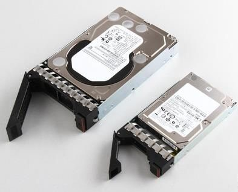

# 01.Linux系统磁盘管理

# 01.Linux系统磁盘管理

* [1.磁盘基本概述](http://kt.xuliangwei.com/15093351915609.html#toc_0)
* [2.磁盘容量检查](http://kt.xuliangwei.com/15093351915609.html#toc_1)
* [3.磁盘分区Fdisk](http://kt.xuliangwei.com/15093351915609.html#toc_2)
* [4.磁盘分区Gdisk](http://kt.xuliangwei.com/15093351915609.html#toc_3)
* [5.磁盘格式化Mkfs](http://kt.xuliangwei.com/15093351915609.html#toc_4)
* [6.磁盘挂载Mount](http://kt.xuliangwei.com/15093351915609.html#toc_5)
  * [6.1临时挂载磁盘](http://kt.xuliangwei.com/15093351915609.html#toc_6)
  * [6.2永久挂载磁盘](http://kt.xuliangwei.com/15093351915609.html#toc_7)
  * [6.3卸载挂载磁盘](http://kt.xuliangwei.com/15093351915609.html#toc_8)
* [7.虚拟磁盘SWAP](http://kt.xuliangwei.com/15093351915609.html#toc_9)
* [8.生产磁盘故障案例](http://kt.xuliangwei.com/15093351915609.html#toc_10)

> 徐亮伟, 江湖人称标杆徐。多年互联网运维工作经验，曾负责过大规模集群架构自动化运维管理工作。擅长Web集群架构与自动化运维，曾负责国内某大型电商运维工作。
>
> 个人博客"[徐亮伟架构师之路](http://www.xuliangwei.com/)"累计受益数万人。
>
> 笔者Q:552408925、572891887 
>
> 架构师群:471443208

## 1.磁盘基本概述


机械hdd与固态ssd

<!-- OCR_START -->
- 8611E03N
- 25
<!-- OCR_END -->

<!-- OCR_START -->
- Sector
- Track
- Platters
<!-- OCR_END -->

SSD采用电子存储介质进行数据存储和读取的一种技术，突破了传统机械硬盘的性能瓶颈，拥有极高的存储性能SSD无查找延迟, 存储于读取速度快同时防震抗摔, 无噪音, 易携带

**磁盘大小**

<!-- OCR_START -->
- VVD
- 2.0TB
- WD2IEARX
- CEG
- 30.0=（
<!-- OCR_END -->



**硬盘命名**

在设备名称的定义规则如下, 其他的分区可以以此类推

系统的第一块SCSI接口的硬盘名称为`/dev/sda`

系统的第二块SCSI接口的硬盘名称为`/dev/sdb`

系统中分区由数字编号表示, 1~4留给主分区使用和扩展分区, 逻辑分区从5开始

> 有些存放数据的设备并不是直接硬件对应的设备文件，而是通过软件生成的块设备文件，例如lvm和软raid设备文件。

```plain
物理硬盘    /dev/sd[a-z]
KVM虚拟化  /dev/vd[a-z] online
//第一块磁盘
/dev/sda
//第二块磁盘第一个分区
/dev/sdb1
//第一块磁盘, 第一个分区
/dev/vda1
```

注意:

> `MBR`方式只能分4个主分区, `GPT`可分128个主分区
>
> `MBR`与`GPT`之间互相转换会导致数据丢失

[GPT磁盘概述](https://baike.baidu.com/item/GPT%E7%A3%81%E7%9B%98/12761414)

[MBR和GPT区别](http://www.udaxia.com/wtjd/6117.html)

## 2.磁盘容量检查

1.使用`df`命令查看磁盘容量，不加参数以k为单位

```plain
df -i   //查看inode使用情况
df -h   //以G或者T或者M人性化方式显示
df -T   //查看文件类型
//使用df命令查看磁盘，下面分别介绍每列什么含义
[root@xuliangwei ~]# df -h
//设备名称    //磁盘大小 已用大小  可用大小 使用百分比  挂载点
Filesystem      Size    Used    Avail       Use%    Mounted on
/dev/vda1       62G    1.5G     58G          3%       /
```

2.使用`lsblk`查看分区情况

```plain
[root@xuliangwei ~]# lsblk
NAME   MAJ:MIN RM  SIZE RO TYPE MOUNTPOINT
sr0     11:0    1 1024M  0 rom
vda    252:0    0   20G  0 disk
└─vda1 252:1    0   20G  0 part /
```

2.使用`du`命令查看目录或者文件的容量，不加参数以k为单位

```plain
du -sh opt  //人性化输出显示大小
-s：列出总和
-h：人性化显示容量信息
```

## 3.磁盘分区Fdisk

分区之前, 需要先给虚拟机添加一块磁盘，以便于我们做后续的实验`vmware`虚拟机，请按如下进行操作:

> 1.找到对应虚拟主机点击右键, 选择设置
>
> 2.在硬件向导里面点击添加按钮, 在硬件类型中选中“硬盘”, 点击下一步
>
> 3.磁盘类型选择默认, 然后创建新虚拟磁盘, 调整大小(不要勾选立即分配空间)
>
> 4.最后点击下一步, 完成即可

小于2TB存储磁盘, 可选分区工具`fdisk`

```plain
//生产分区建议: 如无特殊需求, 直接使用整个磁盘即可, 无需分区
//学习分区建议:1P+1E(3L) 2P+1E(2L) 3P+1E(1L) (仅适用于练习)      
[root@xuliangwei ~]# fdisk -l
[root@xuliangwei ~]# fdisk  /dev/sdb
Command (m for help): m //输入m列出常用的命令
Command action
   a   toggle a bootable flag   //切换分区启动标记
   b   edit bsd disklabel     //编辑sdb磁盘标签
   c   toggle the dos compatibility flag    //切换dos兼容模式
   d   delete a partition     //删除分区
   l   list known partition types   //显示分区类型
   m   print this menu      //显示帮助菜单
   n   add a new partition  //新建分区
   o   create a new empty DOS partition table   //创建新的空白分区表
   p   print the partition table       //显示分区表的信息
   q   quit without saving changes  //不保存退出
   s   create a new empty Sun disklabel //创建新的Sun磁盘标签
   t   change a partition's system id   //修改分区ID,可以通过l查看id
   u   change display/entry units       //修改容量单位,磁柱或扇区
   v   verify the partition table       //检验分区表
   w   write table to disk and exit     //保存退出
   x   extra functionality (experts only)   //拓展功能
//创建主分区
Command (m for help): n //新建分区
Partition type:
   p   primary (0 primary, 0 extended, 4 free)  //主分区
   e   extended //扩展分区
Select (default p): p   //选择主分区
Partition number (1-4, default 1):  //默认回车
First sector (2048-2097151, default 2048): //默认扇区回车
Using default value 2048
Last sector, +sectors or +size{K,M,G} (2048-2097151, default 2097151): +50M //分配50MB
//创建扩展分区
Command (m for help): n //新建分区
Partition type:
   p   primary (1 primary, 0 extended, 3 free)
   e   extended
Select (default p): e   //创建扩展分区
Partition number (2-4, default 2):
First sector (104448-2097151, default 104448):
Using default value 104448
Last sector, +sectors or +size{K,M,G} (104448-2097151, default 2097151):    //默认划分所有空间给扩展分区
//创建逻辑分区
Command (m for help): n //新建分区
Partition type:
   p   primary (1 primary, 1 extended, 2 free)
   l   logical (numbered from 5)
Select (default p): l   //创建逻辑分区
Adding logical partition 5
First sector (106496-2097151, default 106496):
Using default value 106496
Last sector, +sectors or +size{K,M,G} (106496-2097151, default 2097151): +100M  //分配100MB空间
//查看分区创建
Command (m for help): p
Device Boot      Start         End      Blocks   Id  System
/dev/sdb1            2048      104447       51200   83  Linux
/dev/sdb2          104448     2097151      996352    5  Extended
/dev/sdb5          106496      311295      102400   83  Linux
//保存分区
Command (m for help): w
The partition table has been altered!
Calling ioctl() to re-read partition table.
Syncing disks.
//检查磁盘是否是MBR分区方式
[root@xuliangwei ~]# fdisk /dev/sdb -l|grep type
Disk label type: dos
//安装parted, 刷新内核立即生效,无需重启
[root@xuliangwei ~]# yum -y install parted
[root@xuliangwei ~]# partprobe /dev/sdb
```

## 4.磁盘分区Gdisk

大于2TB使用分区工具`gdisk`

```plain
//安装gdisk工具
[root@xuliangwei ~]# yum install gdisk
[root@xuliangwei ~]# gdisk /dev/sdb
Command (? for help): n     //创建新分区
Partition number (1-128, default 1):
First sector (34-2097118, default = 2048) or {+-}size{KMGTP}:
Last sector (2048-2097118, default = 2097118) or {+-}size{KMGTP}: +500M //分配500M大小
Command (? for help): p //打印查看
Number  Start (sector)    End (sector)  Size       Code  Name
   1            2048         1026047   500.0 MiB   8300  Linux filesystem
Command (? for help): w //保存分区
Do you want to proceed? (Y/N): y    //确认
OK; writing new GUID partition table (GPT) to /dev/sdb.
The operation has completed successfully.
//检查磁盘是否是gpt格式
[root@xuliangwei-node1 /]# fdisk /dev/sdb -l|grep type
Disk label type: gpt
//安装parted, 刷新内核立即生效,无需重启
[root@xuliangwei ~]# yum -y install parted
[root@xuliangwei ~]# partprobe /dev/sdb
```

## 5.磁盘格式化Mkfs

mkfs格式化磁盘，实质创建文件系统

```plain
mkfs常用的选项有
-b  //设定数据区块占用空间大小，目前支持1024、2048、4096 bytes每个块。
-t  //用来指定什么类型的文件系统，可以是ext4, xfs
-i  //设定inode的大小
-N  //设定inode数量，防止Inode数量不够导致磁盘不足
-L  //预设该分区的标签label
//格式化整个sdb磁盘为ext4文件系统
[root@xuliangwei ~]# mkfs.ext4  /dev/sdb 
//也可以格式化sdb1分区为xfs文件系统
[root@xuliangwei ~]# mkfs.xfs  /dev/sdb1
```

## 6.磁盘挂载Mount

在上面的内容中讲到了磁盘的分区和格式化, 那么格式化完了后, 如何使用, 这就涉及到了挂载这块磁盘。

> 挂载分区前需要创建挂载点, 挂载点以目录形式出现
>
> 如何往挂载点目录写入数据, 实际上会写入到该分区
>
> 挂载点建议是空目录, 不是也不影响挂载分区的使用

### 6.1临时挂载磁盘

```plain
命令：mount挂载磁盘，实质为文件系统指定访问入口
mount -t       //指定文件系统挂载分区，如ext4, xfs
mount -a       //读取/etc/fstab配置文件的所有分区
mount -o       //指定挂载参数
//fstab被损坏情况下,让只读文件系统可写（正常情况下不使用）
[root@xuliangwei ~]#mount -o rw,remount /  
//挂载/dev/sdb1至db1目录
[root@xuliangwei ~]# mkdir /db1
[root@xuliangwei ~]# mount -t xfs /dev/sdb1  /db1/
```

### 6.2永久挂载磁盘

```plain
//使用blkid命令获取各分区的UUID
[root@xuliangwei ~]# blkid |grep "sdb1"
/dev/sdb1: UUID="e271b5b2-b1ba-4b18-bde5-66e394fb02d9" TYPE="xfs"
//使用UUID挂载磁盘sdb1分区至于db1, 临时挂载
[root@xuliangwei ~]# mount UUID="e271b5b2-b1ba-4b18-bde5-66e394fb02d9" /db1
//也可以把下面这行写到/etc/fstab中，永久挂载, 开机自动挂载
[root@xuliangwei ~]# tail -1 /etc/fstab    
UUID=e271b5b2-b1ba-4b18-bde5-66e394fb02d9 /db1 xfs  defaults 0  0
//加载fstab配置文件, 同时检测语法是否有错误
[root@xuliangwei ~]# mount –a
```

`fstab`配置文件介绍

```plain
[root@xuliangwei ~]# vim /etc/fstab
//分区标识(UUID或设备名)                    挂载点 文件类型    挂载参数    不检查 不备份
UUID=e271b5b2-b1ba-4b18-bde5-66e394fb02d9 /db1     xfs     defaults    0     0
//挂载参数, 可写fstab配置文件, 也可以mount时使用-o参数指定
参数              参数意义                               系统默认值
async           系统每隔一段时间把内存数据写入磁盘中，
sync            时时同步内存和磁盘中数据；
suid，nosuid     允许/不允许分区有suid属性                suid
rw，ro           可以指定文件系统是只读(ro)或可写(rw)       rw
exec，noexec     允许/不允许可执行文件执行，不要挂载根分区    exec
user，nouser     允许/不允许root外的其他用户挂载分区        nouser
auto，noauto     开机自动挂载/不自动挂载                    auto
default         默认文件系统挂载设置 rw, suid, dev, exec, auto, nouser, async
//加载所有配置
[root@xuliangwei ~]# mount -a
```

### 6.3卸载挂载磁盘

```plain
umount -lf  //强制卸载挂载
//使用站点目录卸载
[root@xuliangwei ~]# umount /db1
//使用设备名卸载/dev/sdb1
[root@xuliangwei ~]# umount /dev/sdb1
//umount不能卸载的情况
[root@xuliangwei db1]# umount /db1  
umount: /db1: device is busy.
        (In some cases useful info about processes that use
         the device is found by lsof(8) or fuser(1)
       
//如上情况解决办法有两种, 切换至其他目录 或使用'-l'选项强制卸载    
[root@student db1]# umount -l /db1
```

## 7.虚拟磁盘SWAP

分区一般指定虚拟内存的大小为实际内存的1~1.5倍。如果实际内存超过8GB，可以直接划分16GB给虚拟内存即可，如果虚拟内存不够用的情况，须增加一个虚拟磁盘，由于不能给原有的磁盘重新分区，所以可以选择新建。

1.创建swapfile

```plain
[root@student ~]# dd if=/dev/zero of=/opt/newdisk bs=40k count=102400
//if：指定源  一般写/dev/zero
//of：指定目标
//bs：定义快大小
//count：数量
```

1.格式化swap分区

```plain
[root@student opt]# mkswap -f /opt/newdisk 
Setting up swapspace version 1, size = 1926952 KiB
no label, UUID=69d11824-8d72-4ea5-b383-ddbfd970db3d
```

2.检测当前swap分区情况

```plain
[root@student opt]# free -m
             total       used       free     shared    buffers     cached
Mem:        348        343          5          0          1        276
-/+ buffers/cache:         65        283
Swap:         999          8        991 //原来swap分区1G
```

3.启动虚拟磁盘，并检查

```plain
[root@student opt]# swapon /opt/newdisk
[root@student opt]# free -m
             total       used       free     shared    buffers     cached
Mem:        348        343          5          0          1        274
-/+ buffers/cache:         66        281
Swap:      2881          8       2873   //swap分区多出来了两个G
```

4.关闭虚拟磁盘，并检查

```plain
[root@student opt]# swapoff /opt/newdisk
[root@student opt]# free -m
         total       used       free     shared    buffers     cached
Mem:       348        342          6          0          1        274
-/+ buffers/cache:           65        283
Swap:         999          8        991 //还原到没有增加虚拟磁盘
```

```plain
创建swap分区并且持久化使用
例子： 给系统新增加一个交换分区(swap)
考试题目：一般是要求新建一个分区，并且把分区作为swap分区使用
查看内存和交换分区的使用情况
# free -m
             total       used       free     shared    buffers     cached
Mem:          1841        613       1227         16          0        258
-/+ buffers/cache:        354       1486
Swap:            0          0          0  <--- 没有交换分区
# swapon -s  也能用该命令查看，只是默认也是没有交换分区所有没有输出
# fdisk  -l /dev/vdb
。。。。。
   设备 Boot      Start         End      Blocks   Id  System
/dev/vdb1            2048     2099199     1048576   83  Linux
/dev/vdb2         2099200     6293503     2097152   83  Linux  <---准备把该分区作为交换分区
1、新建一个分区，并且把分区类型更改为82 
    新分区我们在上面的练习已经完成了，所以本例子不用分区，而是需要修改该分区的类型
# fdisk  /dev/vdb
命令(输入 m 获取帮助)：l  列出所有支持的分区类型对应的id
命令(输入 m 获取帮助)：t  修改分区id
分区号 (1-5，默认 5)：2  修改第2个分区
Hex 代码(输入 L 列出所有代码)：82  修改成id为82
已将分区“Linux”的类型更改为“Linux swap / Solaris”
命令(输入 m 获取帮助)：p
。。。
   设备 Boot      Start         End      Blocks   Id  System
/dev/vdb1            2048     2099199     1048576   83  Linux
/dev/vdb2         2099200     6293503     2097152   82  Linux swap / Solaris <---修改成功
命令(输入 m 获取帮助)：w
强烈建议： 对分区做了修改后都刷新一下
# partprobe  /dev/vdb
2、把vdb2格式化为交换分区
# mkswap  /dev/vdb2
正在设置交换空间版本 1，大小 = 2097148 KiB
无标签，UUID=ba08eb90-2003-44e6-9769-9a9351aebb05
3、启动交换分区
# swapon /dev/vdb2  或者  # swanon -a  启动所有交换分区
查看
# swapon -s
文件名             类型      大小  已用  权限
/dev/vdb2                               partition   2097148 0   -1
4、持久化保存交换分区的使用
# blkid /dev/vdb2
/dev/vdb2: UUID="ba08eb90-2003-44e6-9769-9a9351aebb05" TYPE="swap" 
# vim /etc/fstab 
....
UUID=ba08eb90-2003-44e6-9769-9a9351aebb05  swap         swap    defaults  0 0
```

## 8.生产磁盘故障案例

**Inode被沾满，导致磁盘有可用的剩余空间也无法继续使用**

```plain
[root@xuliangwei ~]# dd if=/dev/zero of=/opt/newdisk bs=1k count=1024
[root@xuliangwei ~]# mkfs.ext4 -i 1024 /opt/newdisk
[root@xuliangwei ~]# mkdir /data
[root@xuliangwei ~]# mount -t ext4 -o loop /opt/newdisk /data/
//inode被沾满
[root@xuliangwei ~]# touch {1..20000}
touch: cannot touch `19997': No space left on device
touch: cannot touch `19998': No space left on device
touch: cannot touch `19999': No space left on device
touch: cannot touch `20000': No space left on device
//inode被沾满，剩余block也是无法继续使用
[root@xuliangwei ~]# df -i|grep data
/opt/newdisk      1024  1024       0  100% /data
[root@xuliangwei ~]# df -h|grep data
/opt/newdisk    891K   34K  806K   5% /data
```

**Block空间即将被沾满, 但删除大文件也没有释放空间**

> 假设现在线上正在运行Nginx服务, Nginx产生的日志已经达到了20个G, 磁盘眼看就看沾满了, 请问不重启Nginx的方式如何处理

```plain
//是会删除文件, 但Nginx持续占用着文件, 所以空间并不会被释放
rm -f access.log
//正确做法如下, 清空该文件即可释放文件内容
> access.log
```

> 更新: 2019-03-20 19:54:47  
> 原文: <https://www.yuque.com/chengkanghua/xuliangwei/olthhb>