# day60 zabbix 02

day60 zabbix 02

昨天内容回顾:

```plain
介绍监控体系
单机怎么监控（系统命令  简单Shell脚本）
Zabbix监控（CPU、内存、磁盘、网络  监控tcp11状态(自己编写脚本取值,将取到值传递给  ZabbixServer)）
添加一台被监控主机（agent->server）
新增监控项、新增触发器、新增图形----> Teamplate OS Linux 模板（人工新增模板）自定义监控
自定义触发器
自定义报警（邮件|微信）
自定义图形（screen 幻灯片）
自定义模板
系统自带的监控项，默认设定的触发器比较的低【设置不合理，需要根据实际场景进行调整】
```

TCP 11种状态

```plain
各个状态的意义如下：
LISTEN - 侦听来自远方TCP端口的连接请求；
SYN-SENT -在发送连接请求后等待匹配的连接请求；
SYN-RECEIVED - 在收到和发送一个连接请求后等待对连接请求的确认；
ESTABLISHED- 代表一个打开的连接，数据可以传送给用户；
FIN-WAIT-1 - 等待远程TCP的连接中断请求，或先前的连接中断请求的确认；
FIN-WAIT-2 - 从远程TCP等待连接中断请求；
CLOSE-WAIT - 等待从本地用户发来的连接中断请求；
CLOSING -等待远程TCP对连接中断的确认；
LAST-ACK - 等待原来发向远程TCP的连接中断请求的确认；
TIME-WAIT -等待足够的时间以确保远程TCP接收到连接中断请求的确认；
CLOSED - 没有任何连接状态；
```

## 创建一个模板,添加11种tcp监控状态

## 1.zabbix自定义监控深入

1.详细介绍自定义添加监控项中的每一个参数的作用和使用方法。

配置-->主机-->创建监控项

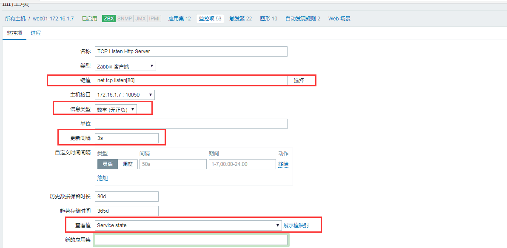

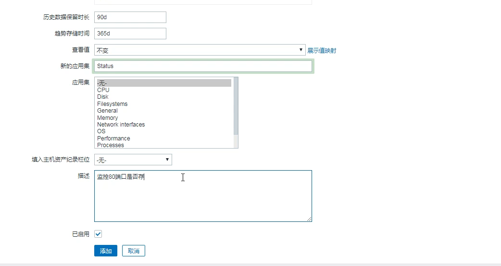

配置 -> 主机-> 监控项--> 应用集 -->status -->

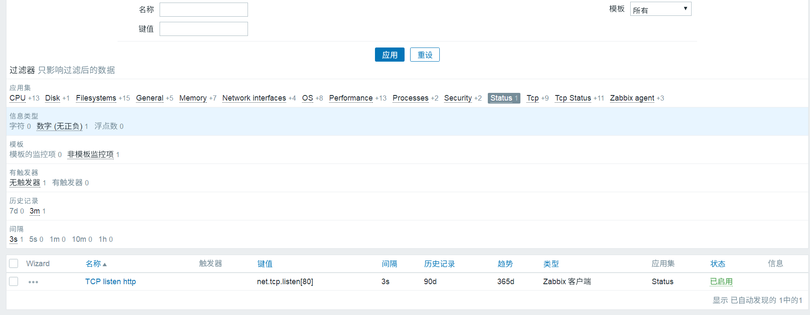

监测中--> 最新数据 --,筛选 Status 查看

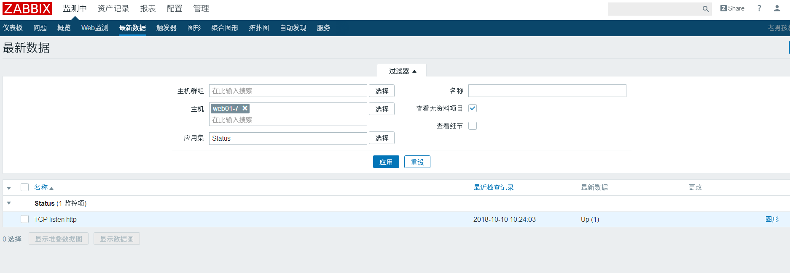

管理 --> 一般--> 值映射

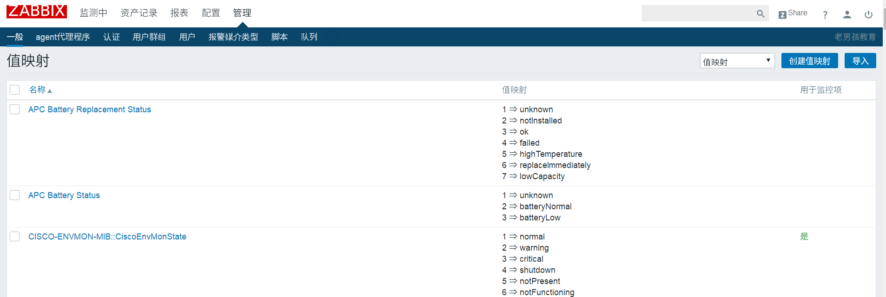

2.自定义监控`tcp11`种状态(传参方式)

```plain
[root@web01-agent ~]# cd /etc/zabbix/zabbix_agentd.d/
# 1.在对应的主机上编写自定义监控TCP的11中状态[在本地进行取值，web01 
[root@web01 zabbix_agentd.d]# cat tcp.conf 
UserParameter=tcp[*],ss -an|awk '{print $2}'|grep -i "$1"|wc -l
[root@zabbix-agent ~]#  systemctl restart zabbix-agent
[root@web01 ~]# zabbix_agentd -p
# 2.在server上使用zabbix_get获取对应主机的值试
[root@zabbix ~]# zabbix_get -s 172.16.1.7 -k tcp[estb]
0
```

配置-->模板-->创建模板 -->


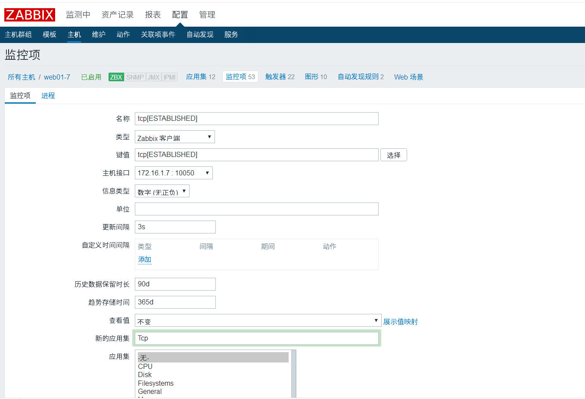

点击模板的 监控项

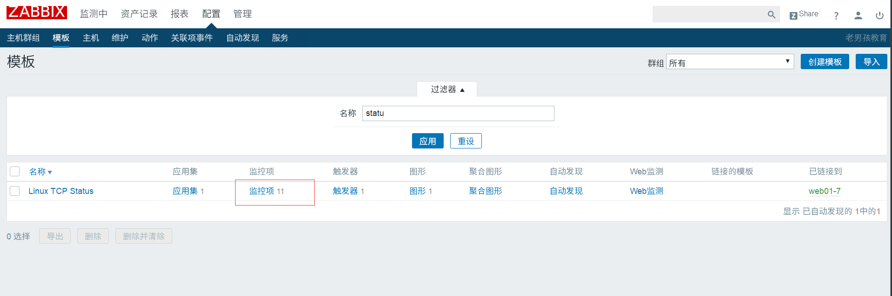

添加 tcp 11种状态的监控项


添加第二个 克隆前一个


添加第二个状态


配置-->主机-->图形--> 创建图形


配置--> 主机 -->点主机名 --> 模板--> 链接指示器 -->填写刚刚创建的模板 --->更新

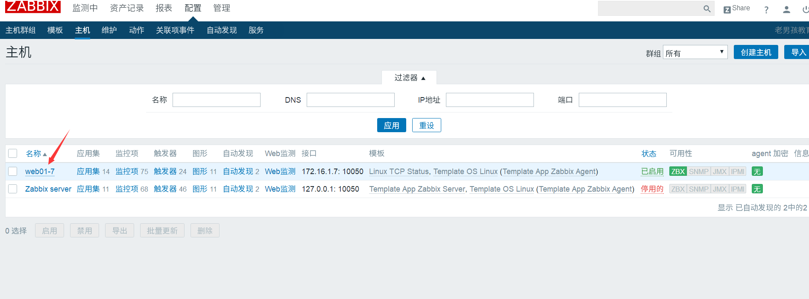


查看 配置--> 主机 监控项 触发器 图形 变多了


检测中--> 最新数据 --> 应用集 筛选 tcp status

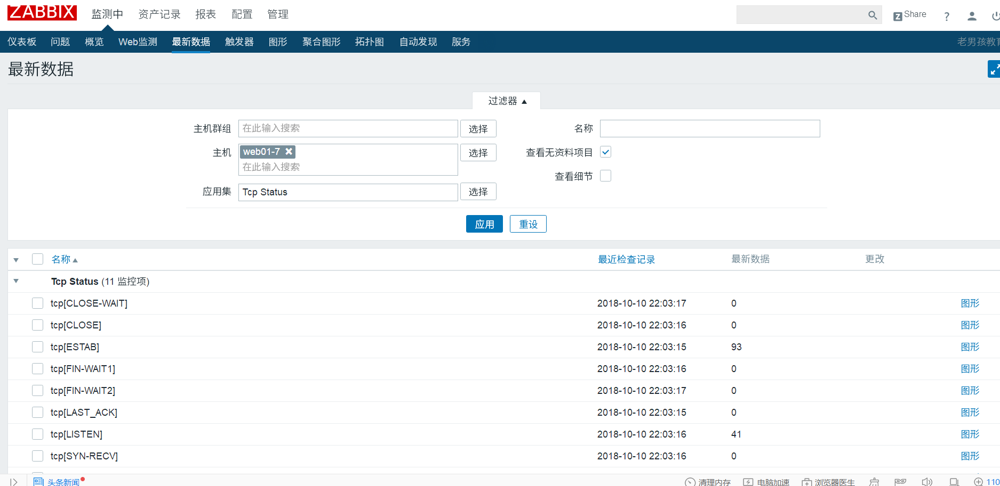

导出模板 可以给其他地方监控使用(除了模板还要包含/etc/zabbix/zabbix_agentd.d/\*.conf)

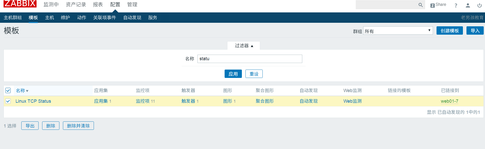

监控中-->图形 查看图形

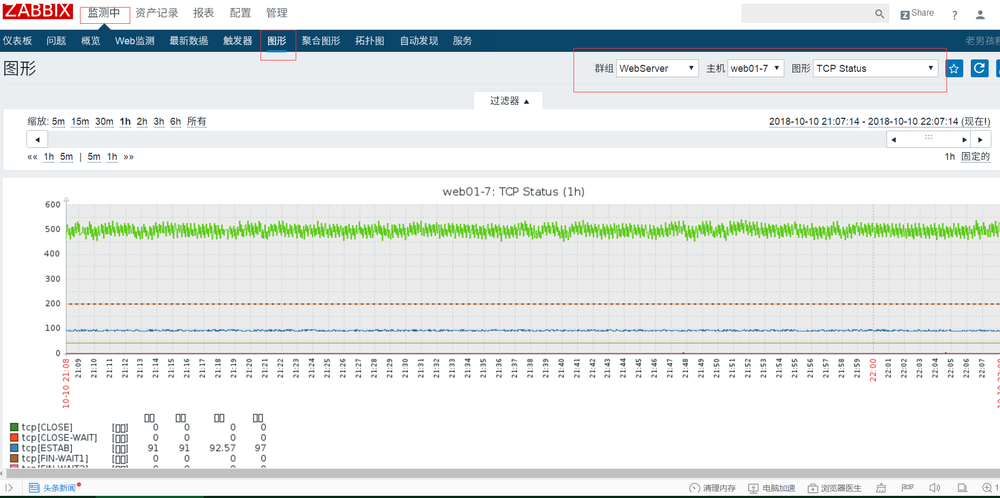

小结:

```plain
1.在对应的主机上编写自定义监控TCP的11中状态[在本地进行取值，web01]
[root@web01 zabbix_agentd.d]# cat tcp.conf 
UserParameter=tcp[*],ss -an|awk '{print $2}'|grep -i "$1"|wc -l
2.在server上使用zabbix_get获取对应主机的值
[root@web01 zabbix-server]# zabbix_get -s 172.16.1.7 -k tcp[estb]
3.在web界面添加
监控项
将监控项制作了一个图形
将主机关联该 TCP状态的模板
自定义监控项
面板所有可填写项
zabbix自带的监控项
zabbix如何自定义监控（tps   system.uname  tcp[estab]）
为自定义监控设定（模板 ->应用级  -> 图形   ->触发器 ）
```

## 给模板添加触发器:

配置-->模板-->触发器

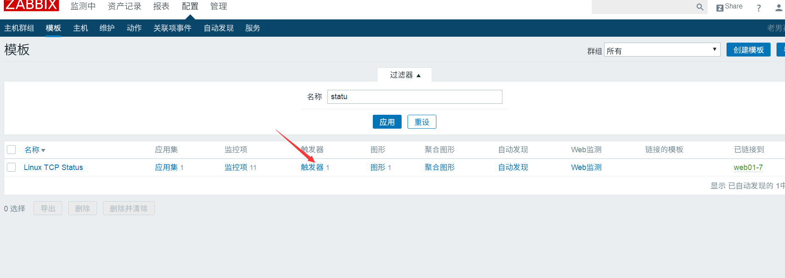

创建触发器: 添加触发器

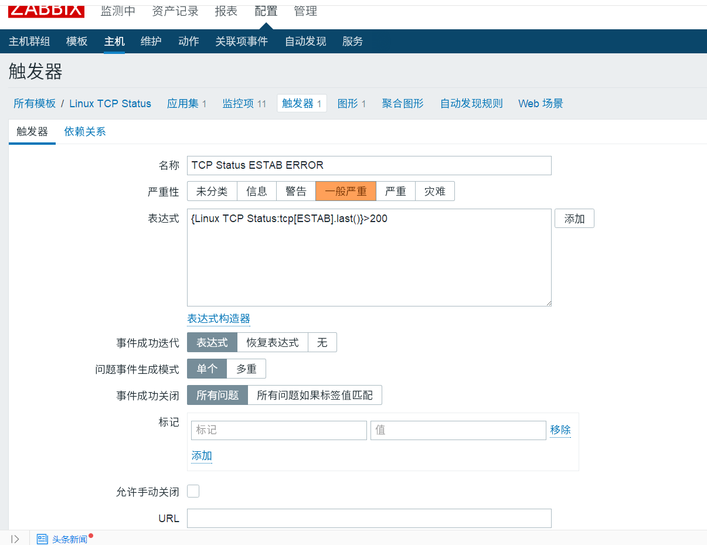

自定义网站做压测

```plain
server {
listen 80;
server_name node.oldboy.com;
location / {
root /node;
index index.html;
}
echo '127.0.0.0.1 node.oldboy.com ' > /etc/hosts;
echo 'web01..' > /node/index.html;
ab -n1000 -c200 http://node.oldboy.com;
```

web面板上有相应的报警

```plain
定义触发器（单条件触发器，多条件触发器），自定义取内存的使用百分比，当内存剩余百分之30%则报警。
1）写一个脚本用于获取需要监控的一些状态信息
free -m |awk '/^Mem/{print $NF/$2*100}'
2）在ZabbixAgent的/etc/zabbix/zabbix_agentd.d/*.conf自定义监控项, 使用UserParameter=KEY,shell command,目的是便于zabbixServer获取ZabbixAgent对应监控项的数据
[root@web01 ~]# cd /etc/zabbix/zabbix_agentd.d/
[root@web01 zabbix_agentd.d]# vim mem.conf
UserParameter=Mem_Num,free -m |awk '/^Mem/{print $NF/$2*100}'
[root@web01 zabbix_agentd.d]# systemctl restart zabbix-agent
3）在ZabbixAgent客户端测试设置的监控项是否正常，使用zabbix_agentd -p | grep KEY，如果获取到值则正常
[root@web01 zabbix_agentd.d]# zabbix_agentd -p|grep -i Mem_Num
Mem_Num                                       [t|38.501]
4）在ZabbixServer端测试获取ZabbixAgent端自定义的监控项是否正常zabbix_get -s IP_addr -k KEY
[root@zabbix-server ~]# zabbix_get -s 172.16.1.7 -k Mem_Num
38.7064
5) 只要通过zabbix_get获取到值, 那么该监控项可直接在Zabbix-web界面进行添加[只能添加对应的主机]
6）然后点击检测中-->最新数据
```

配置-->主机-->监控项 -->创建监控项

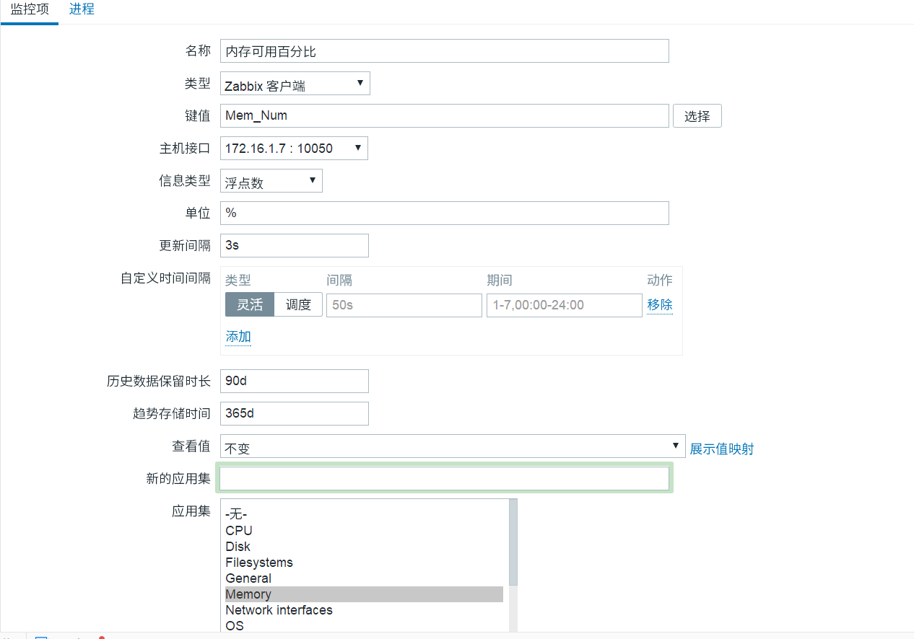

添加完->到检测中-->最新数据中查看 -->帅选对应的应用集

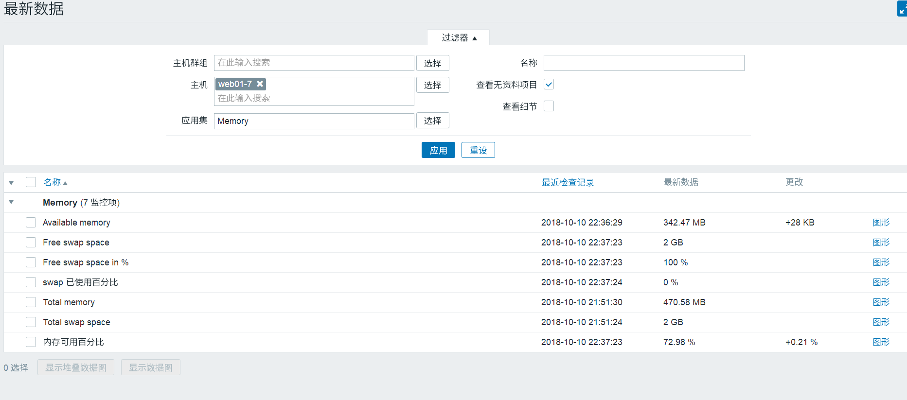

```plain
自定义触发器，基于某一个监控项基础之上来进行触发器的规则设定
1.单条件的触发器（当内存低于百分之30则触发报警）
可用的还剩余百分之31，但swap已经在开始被使用。
2.当内存使用剩余百分之30，并且swap使用超过百分之1%
监控项1  （内存剩余百分之）
监控项2   （swap使用百分比）  free -m|awk '/^Swap/{print $3/$2*100}'
触发器（多条件触发，当满足条件1 并且 满足条件2  该触发器才生效）
注意：防止agent自定义的监控项被转为不支持，建议调整agent端的超时时间
vim /etc/zabbix/zabbix_agentd.conf
Timeout=30
systemctl restart zabbix-agent
# 配置的两个监控项
[root@web01 zabbix_agentd.d]# cat /etc/zabbix/zabbix_agentd.d/mem.conf
UserParameter=Mem_Num,free -m |awk '/^Mem/{print $NF/$2*100}'
UserParameter=Swap_Num,free -m|awk '/^Swap/{print $3/$2*100}'
```

配置-->主机 -->创建触发器- 单条件的

day60 zabbix 02

多条件触发器

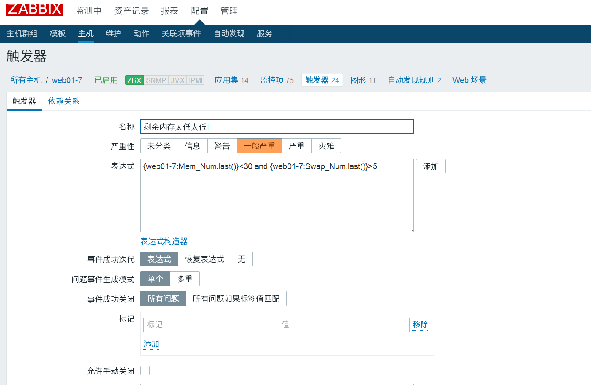

## zabbix自定义报警内容

[定制Zabbix报警的内容](https://www.zabbix.com/documentation/3.4/zh/manual/appendix/macros/supported_by_location)

*1.单击配置->动作->事件源->触发器* 


*2.配置故障报警邮件内容*

> 告警消息内容： 报警主机：{HOST.NAME1} 报警服务: {ITEM.NAME1} 报警Key1: {ITEM.KEY1}：{ITEM.VALUE1} 报警Key2: {ITEM.KEY2}：{ITEM.VALUE2} 严重级别: {TRIGGER.SEVERITY}


*3.配置恢复告警邮件内容*

> 恢复消息内容： 恢复主机：{HOST.NAME1} 恢复服务： {ITEM.NAME1} 恢复Key1：{ITEM.KEY1}：{ITEM.VALUE1} 恢复Key2: {ITEM.KEY2}：{ITEM.VALUE2}

4.最终告警效果如下图所示 

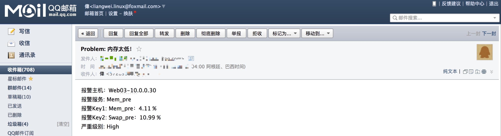

## 7.常用的触发器表达式，常用的函数

```plain
and 并且 or 或者
last() 比对最新的值
avg()  解决波动报警，流量在多少分钟平均达到多少报警avg(5m)
avg(5)    最后5秒的平均值
avg(#5）  表示最近5次得到值的平均值（选择avg 找到计数）
diff()   比对上一次文件的内容
nodata() 收不到数据进行报警nodata(5m)
```

<https://www.cnblogs.com/dadonggg/p/8566443.html>

```plain
自定义报警（报警内容修改，微信报警）
告警消息内容：
报警主机：{HOST.NAME1}
报警服务: {ITEM.NAME1}
报警Key1: {ITEM.KEY1}：{ITEM.VALUE1}
报警Key2: {ITEM.KEY2}：{ITEM.VALUE2}
告警方式： 邮件     （第三方    短信  微信  电话  钉钉）
告警动作： 发送消息| 执行远程命令
假设：当cpu负载持续达到百分之80%，（执行命令，创建虚拟机，安装服务，加入集群--->扩容）
缩小：当cpu持续多长时间之占百分之5（执行命令，判断有多少后端节点->如果超过定义的值-->释放2台）
发邮件--->换微信 （短信 电话--->阿里大鱼）
告警升级，
告警执行的步骤
步骤总共持续1小时
1.发给运维组，持续10分钟
2.发给经理，持续10分钟
3.发给总监，持续10分钟
通过多个条件来设定不同的动作【根据不同的主机来决定告警发送给不同的人接收】
```

## zabbix 微信报警

```plain
1.准备微信报警脚本, 脚本怎么写->脚本放在哪【相当于配置好了发件人】
[root@m01 ~]# yum install python-pip -y
[root@m01 ~]# pip install requests
[root@m01 ~]# cd /usr/lib/zabbix/alertscripts
[root@m01 alertscripts]# rz
[root@m01 alertscripts]# chmod +x weixin.py
[root@m01 alertscripts]# ./weixin.py  WeiXinID   Subject Messages
[root@m01 alertscripts]# rm -f /tmp/weixin.log
{ALERT.SENDTO} #发给谁
{ALERT.SUBJECT} #发送的主题
{ALERT.MESSAGE} #发送的内容
2.收件人是谁【配置企业微信中的微信号】
在 用户基本资料 --> 报警媒介  添加 企业微信的微信号
3.配置-动作->    (配置操作 日志信息 告警升级)
```

```plain
#########
1.介绍自定义监控项
命令
脚本
2.zabbix系统内置的监控项（不是命令也不是脚本，c语言）
3.zabbix触发器
但条件的触发器
多条件触发器
触发器常用的表达式
last
avg
nodata
diff
4.zabbix报警
通知方式
消息       （微信 电话 邮件 短信 .....）
邮件(必须会)
微信(一般)
执行命令    （实现自动化扩容和缩容）
告警升级
默认这个告警持续多久
1.发消息给运维  10m
2.发消息给经理  20m
3.发消息给总监  .....
修改告警消息
调整变量（官方）
```

weixin.py 文件修改

```plain
#我的企业->最下面的企业ID
corpid='ww463574332468c121'
#点击应用于小程序->创建程序->点击自建->自己创建的应用。然后能看见secret、agentid
appsecret='5_Qgn_z5MufUZ8sxVsaXNKjhp9R2OspHvy5O9bMKbtE'
agentid=1000003
# 将自己的微信加入自己的公众号即可
```


```plain
计算历史保存90天数据所占用的数据库磁盘空间
[root@zabbix-server ~]# echo 90*(100/30)*24*3600|bc
23328000
[root@zabbix-server ~]# echo 90*(100/30)*24*3600/1024|bc
22781
[root@zabbix-server ~]# echo 90*(100/30)*24*3600/1024/1024|bc
22
```

重新加载数据 zabbix_server -R config_cache_reload

压测内存 \[root@web01 zabbix_agentd.d]# dd if=/dev/zero of=/opt/1.txt bs=400M count=20

swapon -a //开启swap swapoff -a //关闭swap

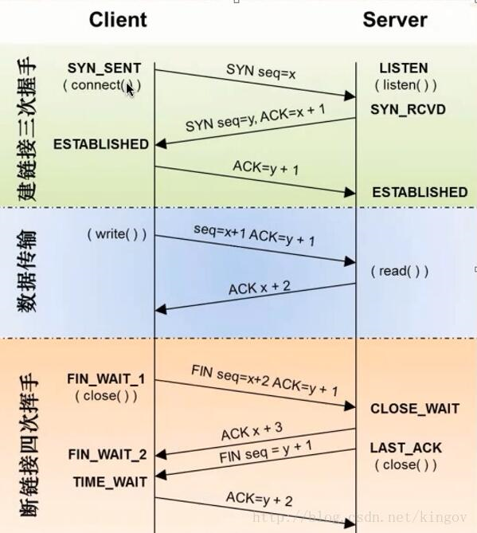


> 更新: 2019-01-12 21:26:49  
> 原文: <https://www.yuque.com/chengkanghua/oldboy50/yi2du7>