# day63 zabbix05

day63 zabbix05

回顾:

```plain
自定义监控【监控项、触发器、图形、】
1.我需要监控什么？   NFS
1.我怎么监控，监控哪些指标
端口，2049|rpcbind的111
磁盘使用量
2.怎么监控，首先需要知道怎么获取这些数据，怎么取值
netstat -lntp
df -h
3.Tomcat是使用jmx方式监控
```

> web监控\
> 自动化监控（自动发现|主动注册）\
> 分布式监控\
> 监控的优化\
> 批量创建100台主机

## Zabbix架构回顾

zabbix监控基础架构回顾\
Zabbix监控方式（agent、snmp、ipmi、ssh、telnet）\
Zabbix资源回顾（基于监控项基础的所有资源）

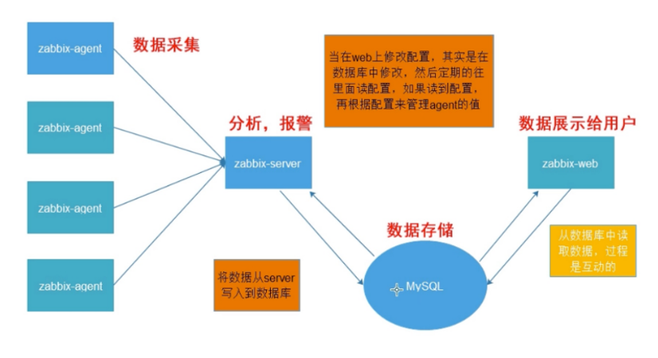

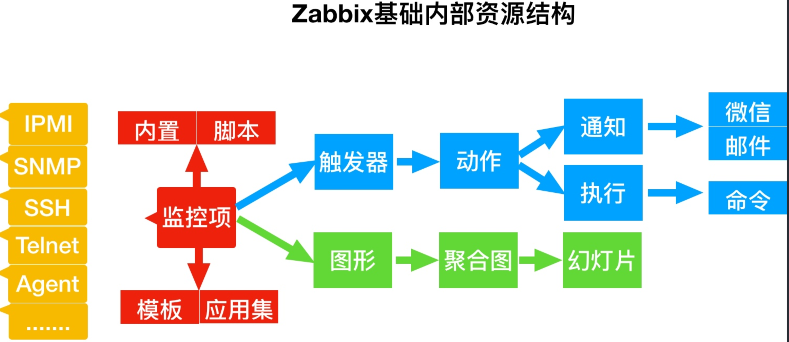

## Web场景检测

*1.Web网站中什么是动态网站，什么是静态网站*

> 静态网站： 纯静态网站就是服务器的源代码和客户端的源代码一致。 动态网站：<?php phpinfo()?> 每次用户访问的时候，html都是在内存中动态生成的，支持登陆，支持用户交互，所以动态网站登陆需要有东西存下来，那么动态网站会给客户端下发sessionID，客户端会将SessionID保存至cookie中。
>
> 演示例子: 禁用IE浏览器的cookie验证,检查是否能登录网站。

*2.当用户访问Web网站时，session和cookie是如何进行工作的*

> 1.当用户首次访问网站，是不会携带cookie信息，那么在服务端返回网页的时候，会给该用户分配一个sessionID 2.当用户再次访问网站时，会携带网站对应的cookies信息，服务端接收后会通过session校验用户的cookid

*3.使用curl模拟用户访问网站*

> 1.模拟登陆`curl -L -c cook -b cook -d '原始数据' 请求URL` 2.登陆成功后再次使用`curl -c cook -b cook Url >test.html`保存获取的内容

## Web场景监测实战

*1.使用curl命令模拟登陆 zabbix*

```plain
# 先curl 一下产生cookie 信息
[root@web01 conf.d]# curl http://10.0.0.71/zabbix/index.php
# 带账号密码登陆访问   -L跳转跟踪
[root@web01 conf.d]]# curl -L -c cook -b cook -d 'name=Admin&password=zabbix&autologin=1&enter=Sign+in' 'http://10.0.0.71/zabbix/index.php'
```

*2.使用curl命令获取zabbix队列信息*

```plain
curl -L -c cook -b cook 'http://10.0.0.71/zabbix/queue.php?config=0'
```

*3.使用curl命令退出zabbix*

```plain
[root@m01 ~]# curl -L -c cook -b cook -d 'sid=47939085e49beb00' 'http://10.0.0.30/zabbix/index.php?reconnect=1'
[root@m01 ~]# curl -L -c cook -b cook -d 'sid=21f500721fe19d1b' 'http://10.0.0.30/zabbix/index.php?reconnect=1'
```

zabbix 界面添加web监测


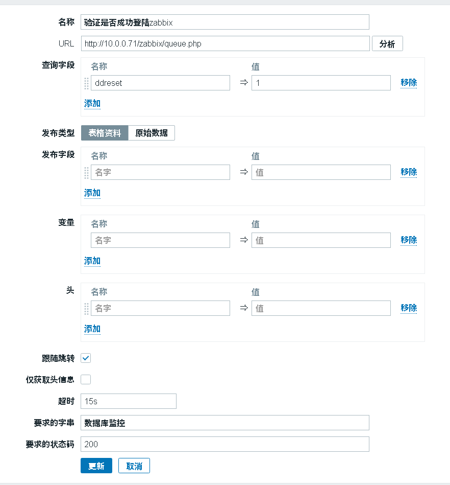

监测中-->web监测:

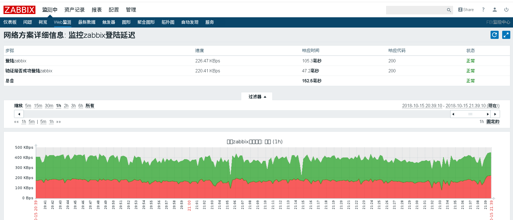

## Zabbix自动化监控

* [1.Zabbix自动发现(被动)](http://docs.etiantian.org/15351931735356.html#toc_0)
* [2.Zabbix自动注册(主动)](http://docs.etiantian.org/15351931735356.html#toc_1)
* [3.Zabbix主被模式区别](http://docs.etiantian.org/15351931735356.html#toc_2)

## 1.Zabbix自动发现(被动)

[网络发现官方手册](https://www.zabbix.com/documentation/3.4/zh/manual/discovery/network_discovery)

概述\
Zabbix提供了有效和非常灵活的网络自动发现功能。

当网络发现正确设置后你可以：\
加快ZabbixAgent部署\
简化管理，快速使用zabbx监控

Zabbix网络发现基于以下信息：\
IP范围\
可用的外部服务（FTP，SSH，WEB，POP3，IMAP，TCP等）\
来自 zabbix agent 的信息（仅支持未加密模式）\
来自 snmp agent 的信息

网络发现由两个阶段组成: 发现（discovery）和 动作（actions）

```plain
发现
Zabbix定期扫描网络发现规则中定义的IP范围，并为每个规则单独配置检查的频次。
请注意，一个发现规则始终由单一发现进程处理，IP范围主机不会被分拆到多个发现进程处理。
网络发现模块每次检测到 service 和 host(IP)都会生成一个 discovery 事件
事件                        条件
Service Discovered            服务首次被发现或者由'down'变'up'
Service Up                    服务持续 'up'
Service Lost                服务由 'up' 变 'down'
Service Down                服务持续 'down'
Host Discovered                在主机的所有服务都 'down' 之后，至少一个服务是'up'。
Host Up                        主机至少有一个服务是 'up' 状态
Host Lost                    主机的所有服务在至少一个是 'up' 之后全部是 'down'。
Host Down                    所有服务都持续 'down'
动作
zabbix 所有 动作 都是基于发现事件,例如:
发送通知
添加/删除主机
启用/禁用主机
添加主机到组
从组中删除主机
将主机链接到模板/从模板中取消链接
执行远程脚本命令
配置Zabbix的网络发现规则去发现主机和服务：
首先配置（Configuration） → 自动发现（Discovery）
单击创建发现规则（Create rule）（或在自动发现规则名称上编辑现有规则）
编辑自动发现规则属性
网络发现的弊端
1.会导致zabbix-server自动发现触发器非常的繁忙。
2.在扫描的过程中会导致丢机器。
3.在扫描多台机器的时候，如果某一台机器夯住了，会导致后续的扫描效率变低。
4.如果在规定时间内没有扫描完毕，会导致后续的机器根本不会检查，然后就马上开始第二次扫描。
自动注册（只要有客户端上线了，他会主动的通知server，server可以配置动作->添加主机-添加模板）
```

*1.单击配置->自动发现->启动默认的Local network* 


*2.配置规则* 


*3.单击配置->动作->事件源->自动发现->启用动作* 

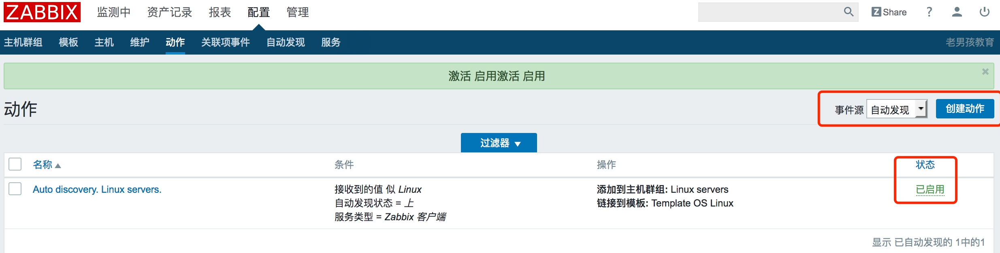

*4.修改动作规则* 

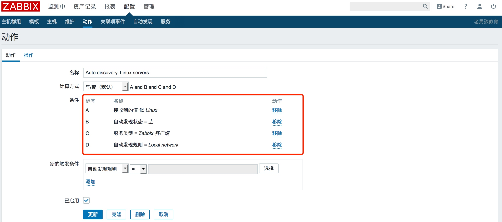

*5.修改操作细节*

> 默认标题 自动发现主机IP:{DISCOVERY.DEVICE.IPADDRESS}
>
> 消息内容 客户端名称: {DISCOVERY.SERVICE.NAME} 客户端端口: {DISCOVERY.SERVICE.PORT} 客户端状态: {DISCOVERY.SERVICE.STATUS}
>
> 操作动作 添加主机,添加主机组，链接模板，发送邮件，等等

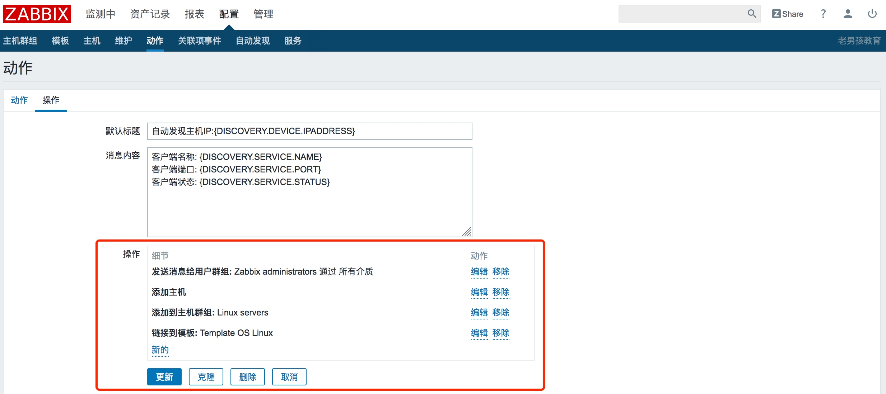

*6.主机已扫描加入节点 web03是/etc/hosts中定义的*

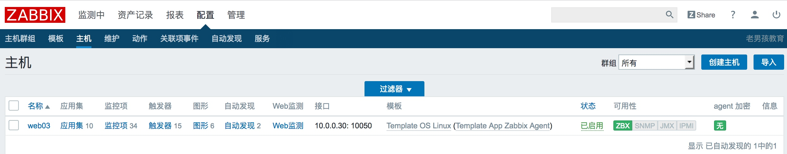

*新增一台全新的主机*

```plain
[root@web02 ~]# rpm -ivh https://mirrors.aliyun.com/zabbix/zabbix/3.4/rhel/7/x86_64/zabbix-agent-3.4.12-1.el7.x86_64.rpm
[root@web02 ~]# grep "^Server" /etc/zabbix/zabbix_agentd.conf
Server=172.16.1.71
[root@web02 ~]# systemctl restart zabbix-agent
```

## Zabbix自动注册(主动)

`Zabbix agent`可以自动注册到服务器进行监控。这种方式无需在服务器上手动配置它们。[自动注册官方手册](https://www.zabbix.com/documentation/3.4/zh/manual/discovery/auto_registration)

*1.配置Zabbix-Agent指定Zabbix-Server*

```plain
[root@web03 ~]# vim /etc/zabbix/zabbix_agentd.conf
Server=172.16.1.71
ServerActive=172.16.1.71
#Hostname=web03
[root@web03 ~]# systemctl restart zabbix-agent
```

> *注意： 如果不指定Hostname,则服务器将使用agent的系统主机名命名主机*

*2.单击配置->动作，选择自动注册为事件源，然后单击创建操作*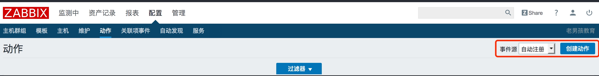*3.配置动作规则* 


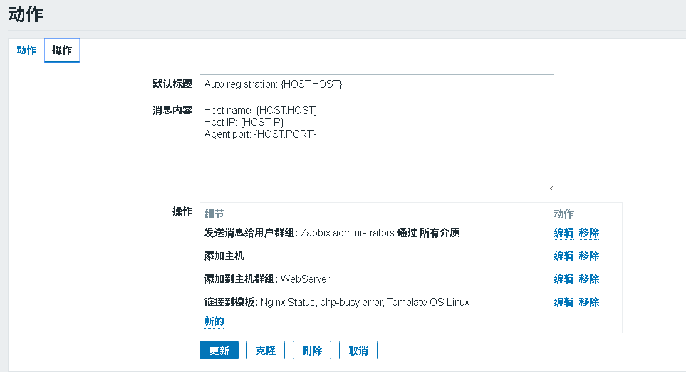

*5.等待自动注册* 

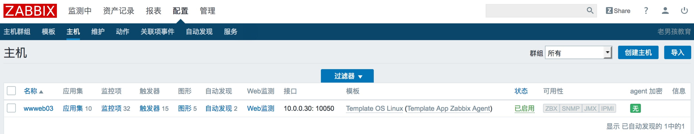

*6.等待邮件通知* 

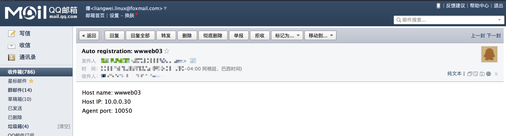

*7.可以通过主机名称来区分不同的主机，例如web，db，这样可以根据不同的主机配置不同的模板。*

*第一个动作如下*

> 名称：web服务主机自动注册 主机名称似 web 操作：链接到模板：Template Nginx Status

*第二个动作如下*

> 名称：db服务主机自动注册 主机名称似 db 操作：链接到模板：Template DB MySQL

*如无法通过主机名称进行区分各个主机，建议使用"主机元数据"进行区分各个主机，详情参考官方文档*

## Zabbix主被模式区别

*1.主动模式与被动模式针对的是*

> 1.被动模式 (Zabbix-server轮询检测zabbix-agent) 2.主动模式 (Zabbix-agent主动上报给Zabbix-server)

*2.主动模式与被被动模式选择如何选择*

> 1.当Queue里有大量延迟的监控项 2.当监控主机超过300+, 建议使用主动模式。

*1.Zabbix被动模式: Zabbix默认是被动模式被动模式,100个监控, 需要100个回合（注意zabbix图中的时间)*

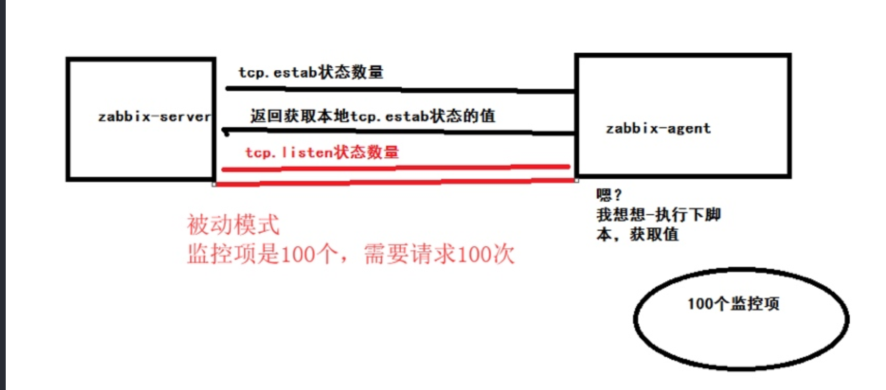 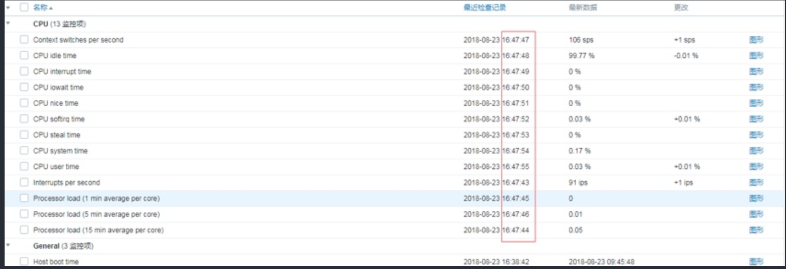

*2.Zabbix主动模式,100个监控,只需要1个回合，需要调整zabbix-agent.conf配置文件*

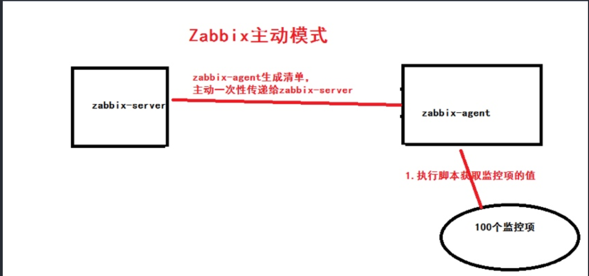 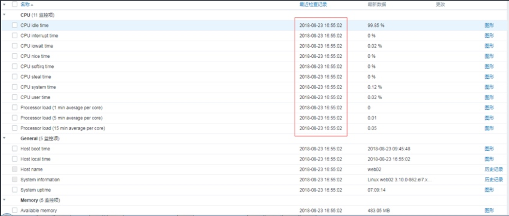

*3.如何调整Zabbix主动模式/etc/zabbix/zabbix_agentd.conf*

*1.Zabbix-agent修改配置文件*

```plain
[root@web03 ~]# vim /etc/zabbix/zabbix_agentd.conf
ServerActive=172.16.1.71
Hostname=   #建议填写
```

*2.Zabbix需要更新模板为Active*

> 1.全克隆被动模式的模板->改名->主动模式的模板 2.修改克隆好的模板，进行监控项的修改，修改为主动模式 3.主机引用，先取消被动使用的模板（取消链接并清理），然后链接新模板

```plain
主动和被动模式的区别
1.web02的配置如下
[root@web02 ~]# grep  -Ev '^$|#' /etc/zabbix/zabbix_agentd.conf
Server=172.16.1.71
ServerActive=172.16.1.71
Hostname=web02
[root@web02 ~]# systemctl restart zabbix-agent
2.db01的配置如下
[root@db01 ~]# grep  -Ev '^$|#' /etc/zabbix/zabbix_agentd.conf
Server=172.16.1.71
ServerActive=172.16.1.71
Hostname=db01
[root@db01 ~]# systemctl restart zabbix-agent
根据不同的主机调用不同的动作，关联不同的模板、
2台web       linux_temp  tcp  nginx php
1台db        linux_temp  tcp  mysql
1台nfs       linux_temp  tcp  nfs
手动的修改Hostname，Ansible的JInja模板。SaltStack的Jinja模板
ssh root@172.16.1.8 'ho=$(hostname);sed -i "/^Hostname=/c Hostname=$ho" /etc/zabbix/zabbix_agentd.conf'
某某地区-业务-集群-节点-服务-IP
al-bj-shop-nginx-web01-nginx_php
al-hz-cz-redis-master-redis-IP
1.根据主机名来区分服务器是什么类型        （动作都是主机名）
如果你没有在zabbix_agentd.conf中特别定义了Hostname，
则服务器将使用agent的系统主机名命名主机。Linux中的系统主机名可以通过运行'hostname'命令获得。
2.根据主机的元数据区分Linux和Windows       （动作都是元数据）
######################################################################
相对于Agent端
Server        被动模式
ServerActive  主动模式
1.主动模式与被动模式针对的是
1.被动模式 (Zabbix-server轮询检测zabbix-agent)
2.主动模式 (Zabbix-agent主动上报给Zabbix-server)
2.主动模式与被被动模式选择如何选择
1.当Queue里有大量延迟的监控项
2.当监控主机超过300+, 建议使用主动模式。
3.如何调整Zabbix主动模式/etc/zabbix/zabbix_agentd.conf
1.Zabbix-agent修改配置文件
[root@web03 ~]# vim /etc/zabbix/zabbix_agentd.conf
ServerActive=172.16.1.71
4.Zabbix需要更新模板为Active
1.全克隆被动模式的模板->改名->主动模式的模板
2.修改克隆好的模板，进行监控项的修改，修改为主动模式
3.主机引用，先取消被动使用的模板（取消链接并清理），然后链接新模板
```

小结

> \###########\
> Zabbix内部资源\
> 监控项\
> 应用级\
> 触发器\
> 动作\
> 发消息 邮件 微信 钉钉 电话 短信\
> 执行命令\
> 图形 聚合 幻灯片\
> 模板
>
> 监控主机的手段\
> ZabbixAgent 常用\
> SSH 不能安装客户端时\
> SNMP 简单网络管理，路由器 交换机\
> IPMI 硬件监控\
> JMX 监控JAVA,实际上监控的是JVM
>
> web监控\
> cookie和session知识\
> 怎么使用curl命令登录网站\
> 如何在zabbix的web界面添加监控 （POST请求）\
> 登录\
> 测试是否成功登录\
> 退出登录
>
> 自动化监控\
> 自动发现（server找小弟）\
> zabbix-server轮询查询zabbix-agent客户端\
> 1.丢机器。\
> 2.server压力大\
> 3.效率低下

自动注册（小弟自动找大哥）\
1.基于主动模式实现\
2.效率高\
3.可以根据不同的主机使用不同的模板（主机名称,不写主机名称默认使用 hostname | \[元数据]）

> 主动模式和被动模式（相对于Agent来说）\
> ServerActive\
> Server\
> 被动模式\
> 1.机器少\
> 2.需要获取100个监控项，需要ZabbixServer去获取100次\
> 主动模式\
> 1.机器多\
> 2.监控项多\
> 3.抓取数据频繁\
> 4.用于自动注册\
> 5.需要获取100个监控项，只需要Server发送一次清单，Agent获取所有数据一次性返回给Server


> 更新: 2019-01-12 21:55:16  
> 原文: <https://www.yuque.com/chengkanghua/oldboy50/cmqzcg>