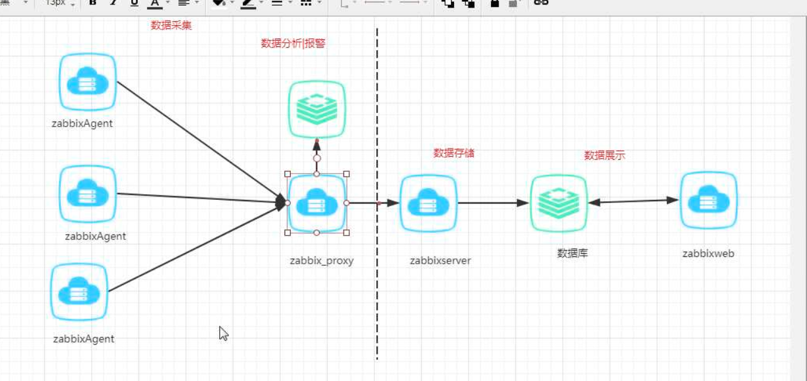
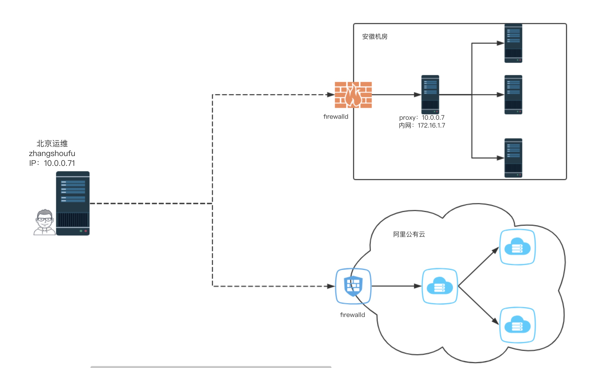
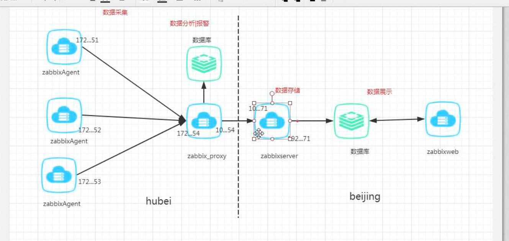
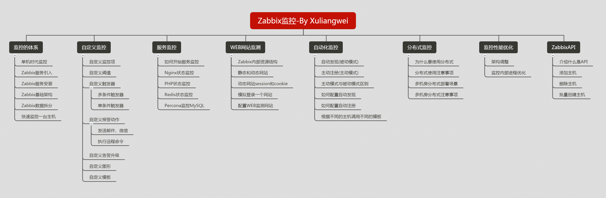
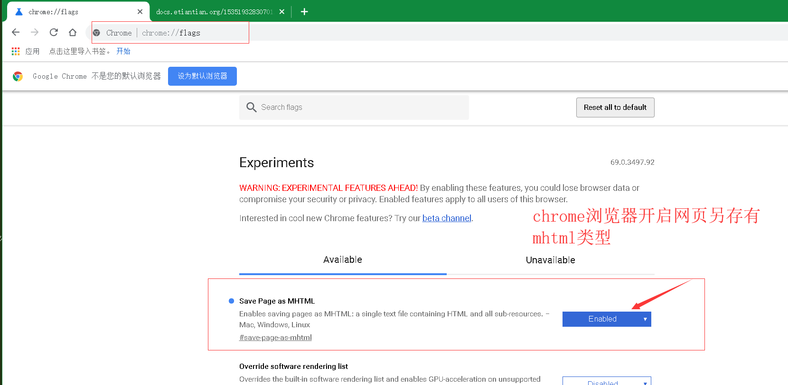

# day64 zabbix06

day64 zabbix06

硬件监控IPMI  
系统监控Agent  
服务监控Agent  
Web检测  
JVM监控JMX  
自动化监控  
 被动模式  
 主动模式  
分布式监控

标准化建设 自动化体系 监控 安全体系

> 分布式Proxy监控  
Zabbix监控优化  
Zabbix API
>

## 分布式监控 ZabbixProxy
| 服务器功能 | 服务器外网 | 服务器内网 | |
| --- | --- | --- | --- |
| Zabbix-Server | 10.0.0.71 | | |
| Zabbix-Proxy-node1 | 10.0.0.7 | 172.16.1.7 | 湖北 |
| Zabbix-Agent | 10.0.0.31 | 172.16.1.31 | 湖北 |
| | | | |
| Zabbix-Proxy-node2 | 10.0.0.8 | 172.16.1.8 | 上海 |
| Zabbix-Agent | 10.0.0.41 | 172.16.1.41 | 上海 |


```plain
#安装数据库
##### 
安装报错 操作
[root@web01 yum.repos.d]# yum remove -y mysql-community-libs
[root@web01 yum.repos.d]# yum remove -y mysql-community-client
[root@web01 yum.repos.d]# rm -rf //usr/share/mysql
######
安装Zabbix-Proxy
[root@proxy_node1 ~]# yum localinstall -y https://mirrors.tuna.tsinghua.edu.cn/zabbix/zabbix/3.4/rhel/7/x86_64/zabbix-proxy-mysql-3.4.14-1.el7.x86_64.rpm
# 配置Zabbix-Proxy服务, 将Zabbix Proxy的指向Zabbix-Server地址
[root@proxy_node1 ~]# grep '^[a-Z]' /etc/zabbix/zabbix_proxy.conf
Server=10.0.0.71
Hostname=Zabbix Proxy
DBName=zabbix_proxy
DBUser=zabbix_proxy
DBPassword=zabbix_proxy
[root@web01 zabbix-proxy-mysql-3.4.14]# egrep -v '^$|^#' /etc/zabbix/zabbix_proxy.conf
Server=10.0.0.71
Hostname=proxy_hb
DBHost=localhost
DBName=zabbix_proxy
DBUser=zabbix_proxy
DBPassword=zabbix_proxy
Timeout=30   //连接超时时间
LogSlowQueries=3000
# 安装Mariadb数据库
[root@proxy_node1 ~]# yum install mariadb-server –y
[root@proxy_node1 ~]# systemctl start mariadb
[root@proxy_node1 ~]# systemctl enable mariadb
# 登陆Mariadb数据库
[root@proxy_node1 ~]# mysql
# 创建数据库
MariaDB [(none)]> create database zabbix_proxy default charset utf8;
# 授权数据库
MariaDB [(none)]> grant all on zabbix_proxy.* to zabbix_proxy@'localhost' identified by 'zabbix_proxy';
MariaDB [(none)]> exit
# 查看安装了哪些文件
[root@web01 zabbix-proxy-mysql-3.4.14]# rpm -ql zabbix-proxy-mysql
/etc/logrotate.d/zabbix-proxy
/etc/zabbix/zabbix_proxy.conf
/usr/lib/systemd/system/zabbix-proxy.service
/usr/lib/tmpfiles.d/zabbix-proxy.conf
/usr/lib/zabbix/externalscripts
/usr/sbin/zabbix_proxy_mysql
/usr/share/doc/zabbix-proxy-mysql-3.4.14
/usr/share/doc/zabbix-proxy-mysql-3.4.14/AUTHORS
/usr/share/doc/zabbix-proxy-mysql-3.4.14/COPYING
/usr/share/doc/zabbix-proxy-mysql-3.4.14/ChangeLog
/usr/share/doc/zabbix-proxy-mysql-3.4.14/NEWS
/usr/share/doc/zabbix-proxy-mysql-3.4.14/README
/usr/share/doc/zabbix-proxy-mysql-3.4.14/schema.sql.gz
/usr/share/man/man8/zabbix_proxy.8.gz
/var/log/zabbix
/var/run/zabbix
# 导入zabbix数据
[root@proxy_node1 ~]# cd /usr/share/doc/zabbix-proxy-mysql-3.4.14/
[root@web02 zabbix-proxy-mysql-3.4.14]# zcat schema.sql.gz |mysql -uzabbix_proxy -pzabbix_proxy zabbix_proxy
8.启动zabbix-proxy并加入开机自启
[root@proxy_node1 ~]# systemctl enable zabbix-proxy
[root@proxy_node1 ~]# systemctl start zabbix-proxy
[root@proxy_node1 ~]# netstat -lntp
Active Internet connections (only servers)
Proto Recv-Q Send-Q Local Address           Foreign Address         State
tcp        0      0 0.0.0.0:10051           0.0.0.0:*               LISTEN  5561/zabbix_proxy
Zabbix-Agent 客户端操作
#安装
[root@nfs01 ~]# yum localinstall https://mirrors.tuna.tsinghua.edu.cn/zabbix/zabbix/3.4/rhel/7/x86_64/zabbix-agent-3.4.14-1.el7.x86_64.rpm
# 配置Zabbix-Agent
[root@web03 ~]# grep '^[a-Z]' /etc/zabbix/zabbix_agentd.conf 
Server=172.16.1.7
ServerActive=172.16.1.7
Hostname=nfs
2.重启zabbix-agent
[root@web03 ~]# systemctl restart zabbix-agent
web 界面添加 agent-proxy  http://10.0.0.71/zabbix/zabbix.php?action=proxy.edit
管理---> agent代理程序  -->
名称填写 proxy服务器配置文件上的Hostname=proxy_hb
配置-->创建主机--->
主机名称 nfs   ***这里名称要填写和主机的hostname 要统一对称这样就可以使用zabbix客户端主动式 的监控项
agent代理程序的接口  IP地址填写 客户端agent 172.16.1.31
由agent代理程序监测  选择 proxy_hb
模板 --> 添加模板  ->emplate OS Linux
更新 之后等待上线
[root@web01 zabbix-proxy-mysql-3.4.14]# systemctl restart zabbix-proxy
[root@zabbix ~]# systemctl restart zabbix-server.service
#查看 zabbix-proxy 日志信息
[root@web01 zabbix-proxy-mysql-3.4.14]# tail -f /var/log/zabbix/zabbix_proxy.log
found
2612:20181016:102413.882 cannot send proxy data to server at "10.0.0.71": proxy "proxy_hb" not found
2632:20181016:102559.726 cannot send list of active checks to "172.16.1.31": host [nfs01] not found
```

## 新增一个proxy代理（甘肃）
```plain
#############################################################################
新增一个proxy代理（甘肃）
Zabbix-Proxy-node2            10.0.0.8    172.16.1.8          甘肃
Zabbix-Agent                10.0.0.41    172.16.1.41         甘肃
1.安装Zabbix-Proxy
[root@proxy_node1 ~]# yum localinstall -y https://mirrors.tuna.tsinghua.edu.cn/zabbix/zabbix/3.4/rhel/7/x86_64/zabbix-proxy-mysql-3.4.14-1.el7.x86_64.rpm
2.配置Zabbix-Proxy数据库
# 安装Mariadb数据库
[root@proxy_node2 ~]# yum install mariadb-server -y
[root@proxy_node2 ~]# systemctl start mariadb
[root@proxy_node2 ~]# systemctl enable mariadb
# 登陆Mariadb数据库
[root@proxy_node2 ~]#  mysql
# 创建数据库
MariaDB [(none)]> create database zabbix_proxy default charset utf8;
# 授权数据库
MariaDB [(none)]> grant all on zabbix_proxy.* to zabbix_proxy@'localhost' identified by 'zabbix_proxy';
MariaDB [(none)]> exit
# 导入zabbix数据
[root@proxy_node2 ~]# cd /usr/share/doc/zabbix-proxy-mysql-3.4.14/
[root@web02 zabbix-proxy-mysql-3.4.14]# zcat schema.sql.gz |mysql -uzabbix_proxy -pzabbix_proxy zabbix_proxy
3.配置Zabbix-Proxy服务, 将Zabbix Proxy的指向Zabbix Server地址
[root@proxy_node2 ~]#  grep -vE '^$|^#' /etc/zabbix/zabbix_proxy.conf 
Server=10.0.0.71
Hostname=proxy_gs           #必须定义好，后续需要调用
DBName=zabbix_proxy
DBUser=zabbix_proxy
DBPassword=zabbix_proxy
Timeout=30
4.启动zabbix-proxy，并加入开机自启动
[root@proxy_node2 ~]#  systemctl enable zabbix-proxy.service
[root@proxy_node2 ~]#  systemctl start zabbix-proxy
#############################################################################
1.安装ZabbixAgent
yum localinstall  -y https://mirrors.tuna.tsinghua.edu.cn/zabbix/zabbix/3.4/rhel/7/x86_64/zabbix-agent-3.4.14-1.el7.x86_64.rpm
2.配置ZabbixAgent指向ZabbixProxy
[root@nfs ~]# /etc/zabbix/zabbix_agentd.conf
Server=172.16.1.8
ServerActive=172.16.1.8
Hostname=backup  #必须和zabbix-web页面的主机名称保持一致
3.启动zabbix-agent并加入开机自启动
[root@nfs ~]# systemctl enable zabbix-agent
[root@nfs ~]# systemctl start  zabbix-agent
#############################################################################
```

> Proxy架构 可以使用主动模式  
 Agent主动模式  
 Proxy主动模式  
  
Agent（监控项） ->Proxy ->Server
>

## zabbix API [了解]
### 获取令牌
```plain
[root@backup ~]# curl -s -X POST -H 'Content-Type:application/json' -d '
{
"jsonrpc": "2.0",
"method": "user.login",
"params": {
"user": "Admin",
"password": "zabbix"
},
"id": 1
}' http://10.0.0.71/zabbix/api_jsonrpc.php
返回的令牌
981cac6b651d18cd9bc3d47c5560884a
```

### #1.禁用一台主机
```plain
curl -s -X POST -H 'Content-Type:application/json' -d '
{
"jsonrpc": "2.0",
"method": "host.update",
"params": {
"hostid": "10286",
"status": 1
},
"auth": "981cac6b651d18cd9bc3d47c5560884a",
"id": 1
}' http://10.0.0.71/zabbix/api_jsonrpc.php
```

### #2.删除一台主机
```plain
curl -s -X POST -H 'Content-Type:application/json' -d '
{
"jsonrpc": "2.0",
"method": "host.delete",
"params": [
"10286"
],
"auth": "981cac6b651d18cd9bc3d47c5560884a",
"id": 1
}' http://10.0.0.71/zabbix/api_jsonrpc.php
```

### #3.创建一台主机
```plain
curl -s -X POST -H 'Content-Type:application/json' -d '
{
"jsonrpc": "2.0",
"method": "host.create",
"params": {
"host": "xxxx",
"interfaces": [
{
"type": 1,
"main": 1,
"useip": 1,
"ip": "192.168.3.1",
"dns": "",
"port": "10050"
}
],
"groups": [
{
"groupid": "17"
}
],
"templates": [
{
"templateid": "10001"
}
]
},
"auth": "981cac6b651d18cd9bc3d47c5560884a",
"id": 1
}' http://10.0.0.71/zabbix/api_jsonrpc.php
```

### #4.批量添加
1.获取一个令牌token  
2.通过令牌创建主机

```plain
[root@backup ~]# cat zabbix_create.sh
#login
GetToken=$(curl -s -X POST -H 'Content-Type:application/json' -d '{
"jsonrpc": "2.0",
"method": "user.login",
"params": {
"user": "Admin",
"password": "zabbix"
},
"id": 1
}' http://10.0.0.71/zabbix/api_jsonrpc.php)
# result token
Token=$(echo $GetToken|awk -F ',' '{print $2}'|awk -F '"' '{print $4}')
while read line;do
curl -s -X POST -H 'Content-Type:application/json' -d '{
"jsonrpc": "2.0",
"method": "host.create",
"params": {
"host": '\"$line\"',
"interfaces": [
{
"type": 1,
"main": 1,
"useip": 1,
"ip": '\"$line\"',
"dns": "",
"port": "10050"
}
],
"groups": [
{
"groupid": "17"
}
],
"templates": [
{
"templateid": "10001"
}
]
},
"auth": '\"$Token\"',
"id": 1
}' http://10.0.0.71/zabbix/api_jsonrpc.php|python -m json.tool
done < /tmp/ip.txt
```

## Zabbix性能优化
### 架构层面
1) Zabbix属于写多读少的业务, 所以需要针对zabbix的MySQL进行拆分.  
 2) 将Zabbix-Agent被动监控模式, 调整为主动监控模式.  
 3) 使用zabbix-proxy分布式监控, 在大规模监控时用于缓解Zabbix-Server压力.

### zabbixServer自身的优化
```plain
4) 去掉无用监控项，增加监控项的取值间隔,
重要的指标频率高一点，大概30~60s
不重要的可以选择删除, 或者将取值间隔调大一点
5) 减少历史数据保存周期(由housekeeper进程定时清理)
6)针对于Zabbix-server进程调优, 谁忙就加大谁的进程数量, 具体取决实际情况, 不是越大越好
Zabbix Poller  processes            # 工作的进程-zabbix-agent
zabbix ipmi Poller processes        # 硬件取值的方式
zabbix icmp Poller processes        # icmp
zabbix http Poller processes        # http的方式
zabbix proxy Poller processes       # 分布式proxy
zabbix java Poller processes        # 监控JAVA
zabbix snmp Poller processes        # 监控网络使用的进程
zabbix vmware Poller processes      # 监控vmware虚拟机的进程
zabbix discoverer Poller processes  # 自动发现时使用的
Zabbix server performance               # 图形看的是zabbixserver每秒能取到多少监控项
Zabbix preprocessing queue              # 查看zabbixserver的队列信息
Zabbix internal process busy %          # 查看zabbixserver内部进程的状态
Zabbix data gathering process busy %    # 数据采集繁忙的进程状态
Zabbix cache usage, % free              # 查看zabbixcache使用率
6)针对于Zabbix-server缓存调优, 谁的剩余内存少, 就加大它的缓存值CacheSize=2G
7) 关注管理->队列, 是否有被延迟执行的监控项
```

> Firewalld 架构从头到尾实现一遍  云主机  虚拟机
>










小技巧 chrome浏览器开启网页另存有MHTML类型

x`


> 更新: 2019-01-12 22:07:44  
> 原文: <https://www.yuque.com/chengkanghua/oldboy50/amuae6>