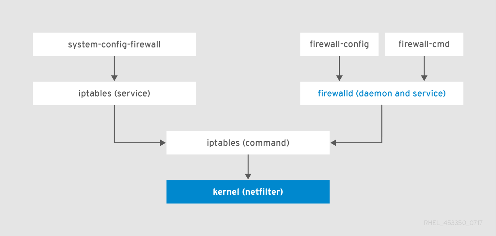
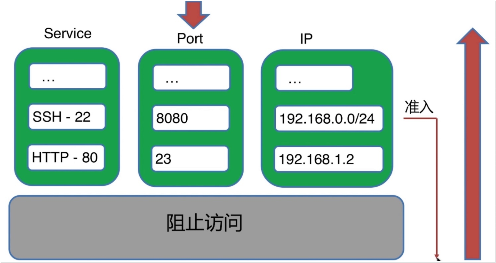
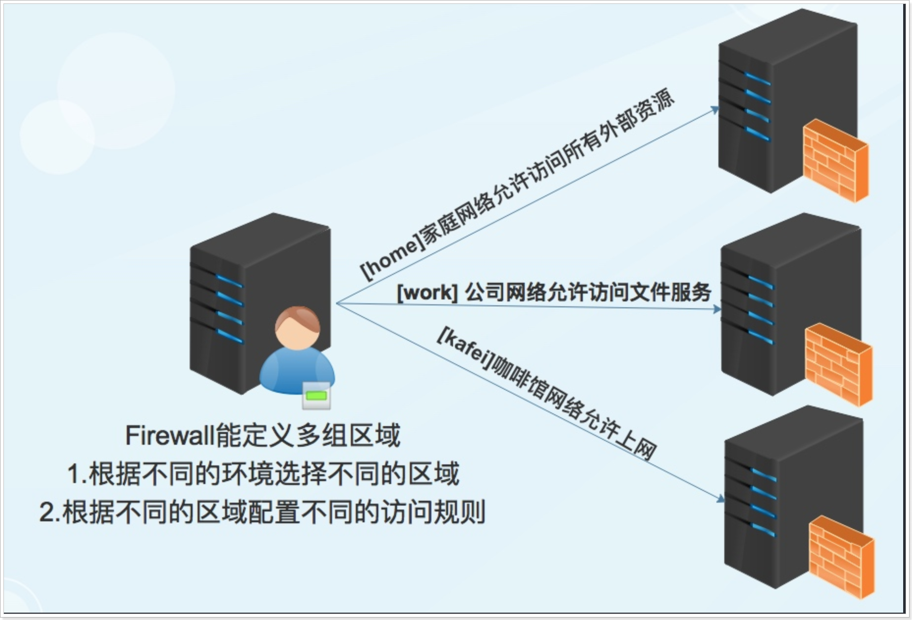
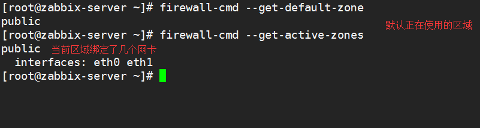
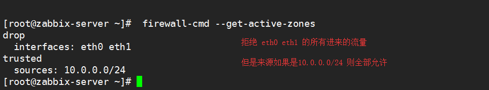
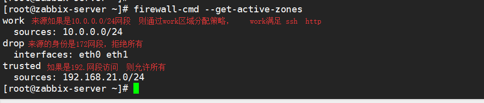
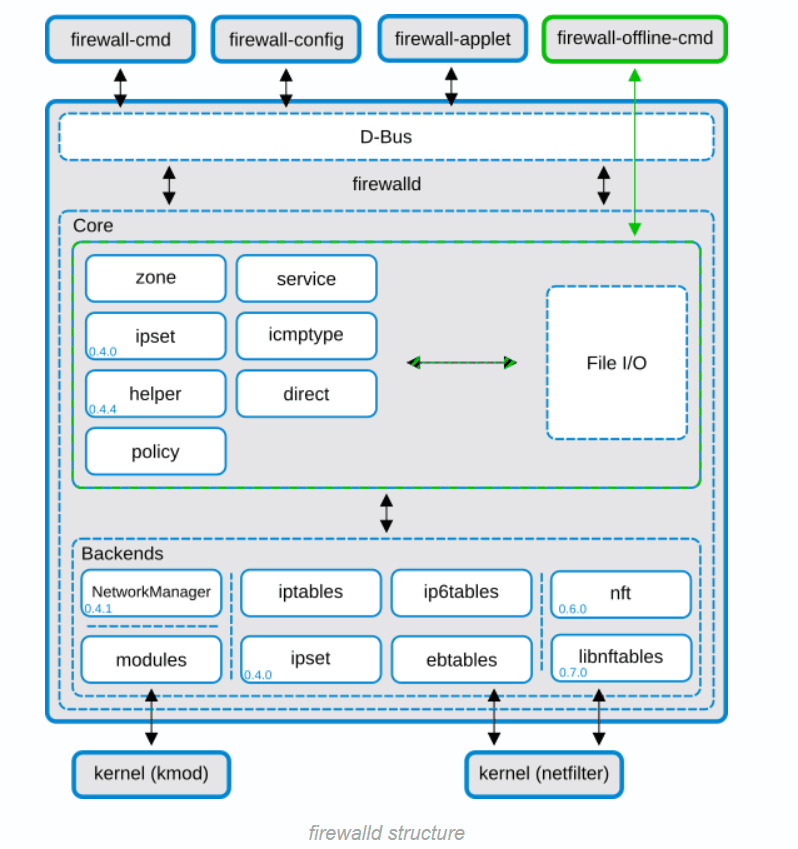

# day65 firewall

翻译

```bash
public (active)                     公共(防火墙)
target: default                     目标: 默认
icmp-block-inversion: no            ICMP块反演：NO
interfaces: eth0 eth1               接口
sources:                            资料来源
services: ssh dhcpv6-client         服务  ssh dhcpv6 客户端
ports:                              端口
protocols:                          协议
masquerade: no                      伪装 ip
forward-ports:                      前向端口
source-ports:                       源端口
icmp-blocks:                        ICMP块
rich rules:                         丰富的规则
default                             默认
trusted                             可信的
drop                                忘掉,停止,丢掉不管
rule                                规则
source                              来源
destination                         目的地
service                             服务
forward-port                        前向端口
audit                               审计
accept                              接受
reject                              拒绝
family                              家庭
invert                              使…前后倒置;使反转
protocol                            协议
forward                             向前;前进地
rich                                富有的
```

## 1.防火墙安全基本概述

`RHEL/CentOS 7`系统中集成了多款防火墙管理工具，其中`firewalld（Dynamic Firewall Manager of Linux systems`, `Linux`系统的动态防火墙管理器）服务是默认的防火墙配置管理工具，它拥有基于CLI（命令行界面）和基于GUI（图形用户界面）的两种管理方式。



`Firewalld`规则配置

> 从外访问服务器内部如果没有添加规则默认是阻止 从服务器内部访问服务器外部默认是允许



那么相较于传统的`Iptables`防火墙，`firewalld`支持动态更新,并加入了区域`zone`的概念。 简单来说，区域就是`firewalld`预先准备了几套防火墙策略集合（策略模板）,用户可以根据生产场景的不同而选择合适的策略集合，从而实现防火墙策略之间的快速切换。



注意:Firewalld中的区域与接口

> 一个zone区域仅能绑定一个网卡, 设定不同的匹配规则 一个zone区域又可以针对不同的源地址设定不同的规则

`Firewalld`相关配置文件

> 默认定义的模板配置文件/usr/lib/firewalld 存储规则配置文件 /etc/firewalld/

## 2.防火墙使用区域管理

划分不同的区域，制定出不同区域之间的访问控制策略来控制不同程序区域间传送的数据流。

| 区域 | 默认规则策略 |
| --- | --- |
| trusted | 允许所有的数据包流入与流出 |
| home | 拒绝流入的流量，除非与流出的流量相关；而如果流量与ssh、mdns、ipp-client、amba-client与dhcpv6-client服务相关，则允许流量 |
| internal | 等同于home区域 |
| work | 拒绝流入的流量，除非与流出的流量数相关；而如果流量与ssh、ipp-client与dhcpv6-client服务相关，则允许流量 |
| public | 拒绝流入的流量，除非与流出的流量相关；而如果流量与ssh、dhcpv6-client服务相关，则允许流量 |
| external | 拒绝流入的流量，除非与流出的流量相关；而如果流量与ssh服务相关，则允许流量 |
| dmz | 拒绝流入的流量，除非与流出的流量相关；而如果流量与ssh服务相关，则允许流量 |
| block | 拒绝流入的流量，除非与流出的流量相关 |
| drop | 拒绝流入的流量，除非与流出的流量相关 |

## 3.防火墙基本指令参数

为了能够使用firwalld服务和相关工具去管理防火墙，必须启动firwalld服务，并且需要禁用以前旧防火墙相关服务, `firewall-config`(图形界面), `firewall-cmd` `firewalld`的规则分两种状态：

> runtime运行时: 修改规则马上生效,但是临时生效 \[不建议] permanent持久配置: 修改后需要reload重载才会生效 \[强烈推荐]

`firewall-cmd`命令分类

| 参数 | 作用 |
| --- | --- |
| **zone区域相关指令** | |
| --get-default-zone | 查询默认的区域名称 |
| --set-default-zone=<区域名称> | 设置默认的区域，使其永久生效 |
| --get-active-zones | 显示当前正在使用的区域与网卡名称 |
| --get-zones | 显示总共可用的区域 |
| --new-zone= | 新增区域 |
| **services服务相关指令** | |
| --get-services | 显示预先定义的服务 |
| --add-service=<服务名> | 设置默认区域允许该服务的流量 |
| --remove-service=<服务名> | 设置默认区域不再允许该服务的流量 |
| **Port端口相关指令** | |
| --add-port=<端口号/协议> | 设置默认区域允许该端口的流量 |
| --remove-port=<端口号/协议> | 设置默认区域不再允许该端口的流量 |
| **Interface网卡相关指令** | |
| --add-interface=<网卡名称> | 将源自该网卡的所有流量都导向某个指定区域 |
| --change-interface=<网卡名称> | 将某个网卡与区域进行关联 |
| **其他相关指令** | |
| --list-all | 显示当前区域的网卡配置参数、资源、端口以及服务等信息 |
| --reload | 让“永久生效”的配置规则立即生效，并覆盖当前的配置规则 |

## 4.防火墙区域配置策略

1.为了能正常使用`firwalld`服务和相关工具去管理防火墙，必须启动`firwalld`服务, 同时关闭以前旧防火墙相关服务

```bash
# 禁用旧版防火墙服务
[root@Firewalld ~]# systemctl mask iptables
[root@Firewalld ~]# systemctl mask ip6tables
# 启动firewalld防火墙, 并加入开机自启动服务
[root@Firewalld ~]# systemctl start firewalld
[root@Firewalld ~]# systemctl enable firewalld
```

2.`zone`区域相关指令

```bash
//查看当前默认区域
[root@Firewalld ~]# firewall-cmd --get-default-zone
public
//查看当前活跃的区域
[root@Firewalld ~]# firewall-cmd --get-active-zone
public
interfaces: eth0 eth1
```

3.使用`firewalld`中各个区域规则结合

> 1.设定默认区域为drop(拒绝所有) 2.设置白名单IP访问，将源`10.0.0.0/24`网段加入`trusted`区域

```bash
//将当前默认区域修改为drop
[root@Firewalld ~]# firewall-cmd --set-default-zone=drop
//将网络接口关联至drop区域
[root@Firewalld ~]# firewall-cmd --permanent  --change-interface=eth0 --zone=drop
//将10.0.0.0/24网段加入trusted白名单
[root@Firewalld ~]# firewall-cmd --permanent --add-source=10.0.0.0/24 --zone=trusted
[root@Firewalld ~]# firewall-cmd --reload
success
//查看当前处于活动的区域
[root@Firewalld ~]# firewall-cmd --get-active-zones
drop    # 默认区域, eth0接口流量都由drop区域过滤
interfaces: eth0
trusted # 数据包的源IP是10.0.0.0网段走trusted区域
sources: 10.0.0.0/24
```

4.使用`firewalld`中各个区域规则结合

> 1.设定来源IP是192.168.20.0/24网段允许访问http 2.设定来源IP是10.0.0.0/24 仅允许访问ssh服务 3.其他网段走默认区域

```bash
#1.允许10.0.0.1IP地址能访问ssh
[root@Firewalld ~]# firewall-cmd --add-source=10.0.0.0/24 --permanent --zone=public
[root@Firewalld ~]# firewall-cmd --reload
#2.将192.168.20.0网段加入白名单
[root@Firewalld ~]# firewall-cmd --add-source=192.168.20.0/24 --permanent --zone=trusted
[root@Firewalld ~]# firewall-cmd --reload
[root@Firewalld ~]# firewall-cmd --get-active-zone
drop
interfaces: eth0 eth1
public
sources: 10.0.0.1/32
trusted
sources: 192.168.20.0/24
```

5.查询`firewald`指定区域的明细

```bash
[root@Firewalld ~]# firewall-cmd  --list-all --zone=drop
drop (active)
target: DROP
icmp-block-inversion: no
interfaces: eth0 eth1
sources:
services:
ports:
protocols:
masquerade: no
forward-ports:
source-ports:
icmp-blocks:
rich rules:
[root@Firewalld ~]# firewall-cmd  --list-all --zone=trusted
trusted (active)
target: ACCEPT
icmp-block-inversion: no
interfaces:
sources: 10.0.0.0/24
services:
ports:
protocols:
masquerade: no
forward-ports:
source-ports:
icmp-blocks:
rich rules:
```

6.查询`public`区域是否允许请求`SSH HTTPS`协议的流量

```bash
[root@Firewalld ~]# firewall-cmd --zone=public --query-service=ssh
yes
[root@Firewalld ~]# firewall-cmd --zone=public --query-service=https
no
```

7.最后将配置恢复至默认规则

```bash
[root@Firewalld ~]# firewall-cmd --set-default-zone=public
[root@Firewalld ~]# firewall-cmd --remove-source=10.0.0.0/24 --zone=public --permanent
[root@Firewalld ~]# firewall-cmd --remove-source=192.168.20.0/24  --zone=trusted --permanent
[root@Firewalld ~]# firewall-cmd --reload
```

## 5.防火墙端口访问策略

1.配置防火墙, 访问`8080/tcp 8080/udp`端口的流量策略设置为永久允许, 并立即生效

```bash
#1.添加运行规则
[root@Firewalld ~]# firewall-cmd --permanent --add-port=8080/udp --add-port=8080/tcp
#2.重载配置生效
[root@Firewalld ~]# firewall-cmd --reload
success
#3.检查开放的端口
[root@Firewalld ~]# firewall-cmd --list-ports
8080/tcp 8080/udp
```

2.配置防火墙, 访问`8080/udp`的端口流量设置为永久拒绝，并立即生效

```bash
[root@Firewalld ~]# firewall-cmd --permanent --remove-port=8080/udp
success
[root@Firewalld ~]# firewall-cmd --reload && firewall-cmd --list-ports
success
8080/tcp
```

## 6.防火墙服务访问策略

1.配置防火墙, 允许请求`http https`协议的流量设置为永久允许，并立即生效

```bash
[root@Firewalld ~]# firewall-cmd --permanent --add-service=http --add-service=https
success
# 重启加载生效
[root@Firewalld ~]# firewall-cmd --reload
success
# 检查相关配置
[root@Firewalld ~]# firewall-cmd --list-services
ssh dhcpv6-client 'http https'
```

2.配置防火墙, 允许请求`php-fpm`服务的流量设置为永久允许，并立即生效

```bash
#1.拷贝相应的xml文件
[root@Firewalld ~]# cd /usr/lib/firewalld/services/
[root@Firewalld services]# cp http.xml php-fpm.xml
#2.修改端口为9000
[root@Firewalld services]# cat php-fpm.xml
<?xml version="1.0" encoding="utf-8"?>
<service>
<short>PHP-FPM</short>
<description> php-fpm </description>
<port protocol="tcp" port="9000"/>
</service>
#3.防火墙增加规则
[root@Firewalld ~]# firewall-cmd --permanent --add-service=php-fpm
[root@Firewalld ~]# firewall-cmd --list-services
ssh dhcpv6-client 'http https php-fpm'
#4.安装php-fpm, 并监听9000端口
[root@Firewalld ~]# yum install php-fpm -y
[root@Firewalld ~]# systemctl start php-fpm
#5.测试验证
~ telnet  10.0.0.61 9000
Trying 10.0.0.61...
Connected to 10.0.0.61.
Escape character is '^]'.
```

3.配置防火墙, 请求`https`协议的流量设置为永久拒绝，并立即生效

```bash
[root@Firewalld ~]# firewall-cmd --permanent --remove-service=https --remove-service=php-fpm --zone=public
success
[root@Firewalld ~]# firewall-cmd --reload
success
//检查当前活动服务
[root@Firewalld ~]# firewall-cmd --list-service
ssh dhcpv6-client http
```

## 7.防火墙端口转发策略

端口转发是指传统的目标地址映射，实现外网访问内网资源

流量转发命令格式为

> firewall-cmd --permanent --zone=<区域> --add-forward-port=port=<源端口号>:proto=<协议>:toport=<目标端口号>:toaddr=<目标IP地址>

1.转发本机`555/tcp`端口的流量至`22/tcp`端口，要求当前和长期有效

```bash
[root@Firewalld ~]# firewall-cmd --permanent --zone=public --add-forward-port=port=555:proto=tcp:toport=22:toaddr=10.0.0.61
success
[root@Firewalld ~]# firewall-cmd --reload
success
```

2.移除本机转发的`555/tcp`端口策略, 要求当前和长期有效

```bash
[root@Firewalld ~]# firewall-cmd --remove-forward-port=port=555:proto=tcp:toport=22:toaddr=10.0.0.61
success
[root@Firewalld ~]# firewall-cmd --reload
success
```

3.如果需要将本地的`10.0.0.61:6666`端口转发至后端`10.0.0.9:22`端口

```bash
#1.开启IP伪装
[root@Firewalld ~]# firewall-cmd --add-masquerade --permanent
#2.配置转发
[root@Firewalld ~]# firewall-cmd --permanent --zone=public --add-forward-port=port=6666:proto=tcp:toport=22:toaddr=10.0.0.9
[root@Firewalld ~]# firewall-cmd --reload
```

## 8.防火墙富规则策略

firewalld中的富规则表示更细致、更详细的防火墙策略配置，它可以针对系统服务、端口号、源地址和目标地址等诸多信息进行更有针对性的策略配置, 优先级在所有的防火墙策略中也是最高的。

1.富规则帮助手册

```bash
man firewall-cmd
man firewalld.richlanguage
rule
[source]
[destination]
service|port|protocol|icmp-block|masquerade|forward-port
[log]
[audit]
[accept|reject|drop]
rule [family="ipv4|ipv6"]
source address="address[/mask]" [invert="True"]
destination address="address[/mask]" invert="True"
service name="service name"
port port="port value" protocol="tcp|udp"
protocol value="protocol value"
forward-port port="port value" protocol="tcp|udp" to-port="port value" to-addr="address"
log [prefix="prefix text"] [level="log level"] [limit value="rate/duration"]
accept | reject [type="reject type"] | drop
//区里的富规则按先后顺序匹配，按先匹配到的规则生效。
--add-rich-rule='<RULE>'    //在指定的区添加一条富规则
--remove-rich-rule='<RULE>' //在指定的区删除一条富规则
--query-rich-rule='<RULE>'  //找到规则返回0 ，找不到返回1
--list-rich-rules       //列出指定区里的所有富规则
--list-all 和 --list-all-zones 也能列出存在的富规则
```

1.允许`10.0.0.0/24`网段中`10.0.0.1`主机访问`http`服务, 其他同网段主机无法访问，当前和永久生效

```bash
#1.加入10.0.0.0/24所有主机至public区域 (可省略,只要public是当前活动active区域就行)
[root@m01 ~]# firewall-cmd --permanent --add-source=10.0.0.0/24 --zone=public
#2.仅允许public中的10.0.0.1主机访问http
[root@m01 ~]# firewall-cmd --permanent --zone=public --add-rich-rule='rule family=ipv4 source address=10.0.0.1/32 port port=80 protocol=tcp accept'
#3.重载firewalld防火墙
[root@m01 ~]# firewall-cmd --reload
```

2.拒绝`10.0.0.0/24`网段中的`10.0.0.9`主机发起的`ssh`请求, 当前和永久生效

```bash
[root@m01 ~]# firewall-cmd --permanent --zone=public --add-rich-rule='rule family=ipv4 source address=10.0.0.9/32 service name=ssh drop'
[root@m01 ~]# firewall-cmd --reload
success
```

3.将远程`10.0.0.1`主机请求`firewalld`的`5551`端口，转发至`firewalld`防火墙的`22`端口

```bash
[root@m01 ~]# firewall-cmd --permanent --zone=public --add-rich-rule='rule family=ipv4 source address=10.0.0.1/32 forward-port port=5551 protocol=tcp to-port=22'
[root@m01 ~]# firewall-cmd --reload
success
```

4.将远程`10.0.0.1`主机请求`firewalld`的`6661`端口，转发至后端主机`10.0.0.9`的`22`端口

```bash
[root@m01 ~]# firewall-cmd --add-masquerade --permanent
[root@m01 ~]# firewall-cmd --permanent --zone=public --add-rich-rule='rule family=ipv4 source address=10.0.0.1/32 forward-port port=6661 protocol=tcp to-port=22 to-addr=10.0.0.9'
success
[root@m01 ~]# firewall-cmd --reload
```

## 9.防火墙开启内部上网

> 在指定的带有公网IP的实例上操作，启动NAT网关的SNAT源地址转换功能。

1.`firewalld`防火墙开启ip伪装, 实现地址转换

```bash
# 网卡默认是在public的zones内，也是默认zones。永久添加源地址转换功能
[root@m01 ~]# firewall-cmd --add-masquerade --permanent
[root@m01 ~]# firewall-cmd --reload
```

2.客户端配置共享上网

```bash
#1.修改网关指向firewalld
[root@web03 ~]# cat /etc/sysconfig/network-scripts/ifcfg-eth1
GATEWAY=172.16.1.61
#2.填写对应的dns服务器
[root@web03 ~]# cat /etc/resolv.conf
nameserver 223.5.5.5
#3.重启网络
[root@web03 ~]# nmcli connection reload
[root@web03 ~]# nmcli connection down eth1 && nmcli connection up eth1
#4.测试网络
[root@web03 ~]# ping baidu.com
PING baidu.com (123.125.115.110) 56(84) bytes of data.
64 bytes from 123.125.115.110 (123.125.115.110): icmp_seq=1 ttl=127 time=9.
```










> 更新: 2024-08-31 20:54:29  
> 原文: <https://www.yuque.com/chengkanghua/oldboy50/siod6r>