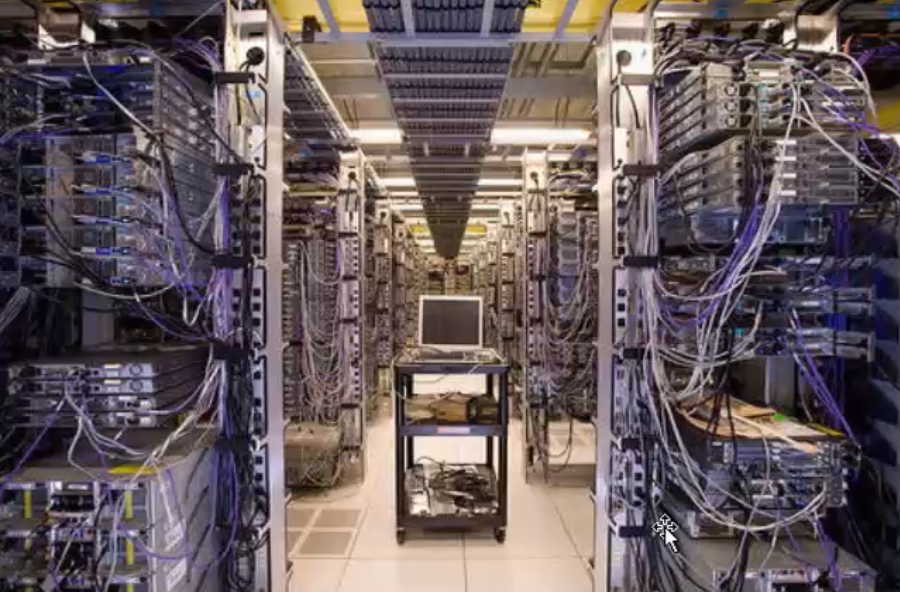

# LINUX 系统介绍与环境搭建准备


<!-- OCR_START -->
> 乌班图
> Oh.uaunh
<!-- OCR_END -->


### 什么是操作系统

操作系统：是一个人与计算机硬件的中介。

没有用的砖头===>可以玩的砖头。


操作系统，英文名称 Operating System，简称 OS，是计算机系统中必不可少的基础系统软件，它是 应用程序运行以及用户操作必备的基础环境支撑，是计算机系统的核心。

操作系统的作用是管理和控制计算机系统中的硬件和软件资源，例如，它负责直接管理计算机系统 的各种硬件资源，如对 CPU、内存、磁盘等的管理，同时对系统资源供需的优先次序进行管理。

操 作系统还可以控制设备的输入、输出以及操作网络与管理文件系统等事务。

同时，它也负责对计算 机系统中各类软件资源的管理。例如各类应用软件的安装、运行环境设置等。下图给出了操作系统 与计算机硬件、软件之间的关系示意图。

<!-- OCR_START -->
- 蛋壳
- 外围应用程序
- 命令解释器
- 蛋清
- shell
- 系统核心kernel
- lib
- 蛋黄
- API
- 计算机硬件
<!-- OCR_END -->

操作系统就是处于用户与计算机硬件之间用于传递信息的系统程序软件。

操作系统在接收到用户输入后，将其传递给计算机系统硬件核心进行处理，然后再讲计算机硬件的处理结果返回给用户。


<!-- OCR_START -->
> 操作系统
> 计算机硬件
<!-- OCR_END -->


目前 PC(Intel x86 系列)计算机上比较常见的操作系统有 Windows、Linux、DOS、Unix 等。

### 什么是Linux

Linux类似Windows，也就是款操作系统软件

Linux是一套开放源代码程序的、可以自由传播的类Unix操作系统软件，且支持多用户、多任务且支持多线程、多CPU的操作系统。

Linux主要用在服务器端、嵌入式开发和个人PC桌面中，服务器端是重中之重。

我们熟知的大型、超大型互联网企业(百度，Sina，淘宝等)都在使用 Linux 系统作为其服务器端的程序运行平台，全球及国内排名前十的网站使用的主流系统几乎都是 Linux 系统。

从上面的内容可以看出，Linux 操作系统之所以如此流行，是因为它具有如下一些特点:

* 是开放源代码的程序软件，可自由修改;
* Unix系统兼容，具备几乎所有Unix的优秀特性;
* 可自由传播，无任何商业化版权制约;
* 适合 Intel 等 x86 CPU 系列架构的计算机，可移植性很高

<!-- OCR_START -->
- Blackmail
- BUTTHEADS
- DeRetofLo
- SCO
<!-- OCR_END -->

### *Unix的历史*

Unix系统在1969年的AT\&T的贝尔实验室诞生，20世纪70年代，它逐步盛行，这期间，又产生 了一个比较重要的分支，就是大约 1977 年诞生的 BSD(Berkeley Software Distribution)系统。

从BSD 系统开始，各大厂商及商业公司开始了根据自身公司的硬件架构，并以 BSD 系统为基础进行Unix 系统的研发，从而产生了各种版本的 Unix 系统

* SUN公司的Solaris
* IBM公司的AIX
* HP公司的HP UNIX

<!-- OCR_START -->
- 下图给出了Unix 系统诞生、发展的时间及版本分支介绍，供读者参考。
- Unix PDP/7.
- Unix 1st Edition PDP/11.
- 1969.
- [1975]Unix 5th/6th Edition - C.
- 1971.
- [1979junix 7th Edition
- [1977] B5D.
- [1982]system Ill.
- Xenix.
- [1984] 850 4.2.
- 1981.
- [1984]system V.2.
- sunos.1
- [1986]system V.3
- [1985] 850 4.3.
- HP-UX9.
- AIX.
- Solaris1.0.
- [1988] SVR4.
- soo Unix.
- 1991.
- AIX 3.1.
- LINUX.
- [1992] 0sF/1
- Unixware 1.
- AIX4.2.
- 2000.
- Solaris 2.6.
- HP-UX10.
- FreeBsD.
- OSF1.1
- Unixware 7.
- AIX4.3.
- HP-UX11.
- Solaris 8.
- Tru64.
- 2002
- 说明：紫色：商业绿色：开源易色：忽略蓝色：起源.
<!-- OCR_END -->

在上图中可以看到，本章的“主人公”Linux 系统，诞生于 1991 年左右，因此，可以说 Linux 是从 Unix 发展而来的。

#### Unix的五大优势

* 技术成熟、可靠性高
* 可伸缩性，Unix 支持的 CPU 处理器体系架构非常多，包括 Intel/AMD 及 HP-PA、MIPS、PowerPC、UltraSPARC、ALPHA 等 RISC 芯片，以及 SMP、MPP 等技术。
* 强大的网络功能，Internet 互联最重要的协议 **TCP/IP** 就是在 Unix 上开发和发展起来的。此外，Unix 还支持非常多的 常用的网络通信协议，如 NFS、DCE、IPX/SPX、SLIP、PPP 等。
* 强大的数据库能力，Oracle、DB2、Sybase、Informix 等大型数据库，都把 Unix 作为其主要的数据库开发和运行平台， 一直到目前为止，依然如此。
* 强大的开发性，促使C语言诞生

### Unix操作系统的革命

* 70 年代中后期，由于各厂商及商业公司开发的 Unix 及内置软件都是针对自己公司特定硬件的，因此在其他公司的硬件上基本上无法直接运行。
* 70年代末，Unix又面临了突如其来的被AT\&T回收版权的重大问题，特别是要求`禁止对学生群体提供Unix系统源码`。
* 在80年代初期，同样是之前Unix系统版权和源代码限制的问题，使得大学授课Unix系统束缚很多，因此，一位名为`Andrew Tanenbaum（谭宁邦）`的大学教授为了教学开发了`Minix`操作系统。
* 1984年，Richard Stallman斯托曼发起了`开发自由软件`的运动，且成立自有软件基金会（Free Software Foundation，FSF）和GNU项目

*GNU项目*

当时发起这个自由软件运动和创建 GNU 项目的目的其实很简单，就是想开发一个类似 Unix 系统、 并且是自由软件的完整操作系统，也就是要解决 70 年代末 Unix 版权问题以及软件源代码面临闭源的问题，

这个系统叫做`GNU 操作系统。`

*老男孩补充:*

这个 GNU 系统后来没有流行起来。现在的 GNU 系统通常是使用 Linux 系统的内核， 以及使用了GNU项目贡献的一些组件加上其它相关程序组成，这样的组合被称为 `GNU/Linux`操作 系统。

<!-- OCR_START -->
- UNIX
- 1969
- Linux
- 1991
- ios
- 2007.01
- Android
- 2007.11
<!-- OCR_END -->

### Linux系统诞生


Linux 系统的诞生开始于芬兰赫尔辛基大学的一位计算机系的学生，名字为 Linus Torvalds。

Linux 的标志和吉祥物为一只名字叫作 Tux 的企鹅——Torvalds’Unix，下图所示。


Linux Torvalds 林纳斯·托瓦兹1988年进入赫尔辛基大学选读计算机科学，他在学校接触到Unix这个操作系统，当时的Unix只提供16个终端，早期的计算机只有运算功能，终端提供输入输出，光是等待Unix的时间就很长，林纳斯这样的大神就决定自己开发一个操作系统！

### Linux系统发展历程

1\)1984 年，Andrew S. Tanenbaum 开发了用于教学的 Unix 系统，命名为 MINIX。

2\)1989 年，Andrew S. Tanenbaum 将 MINIX 系统运行于 x86 的 PC 计算机平台。

3\)1990年，芬兰赫尔辛基大学学生LinusTorvalds首次接触MINIX系统。

4\)1991年，LinusTorvalds开始在MINIX上编写各种驱动程序等操作系统内核组件。

5\)1991 年底，Linus Torvalds 公开了 Linux 内核源码 0.02 版([http://www.kernel.org)，注意，这](http://www.kernel.xn--org%29%2C%2C-sv5pz16gml4f/)

里公开的 Linux 内核源码并不是我们现在使用的 Linux系统的全部，而仅仅是 Linux 内核 kernel

部分的代码。

6. 1993 年，Linux 1.0 版发行，Linux 转向 GPL 版权协议。

7. 1994 年，Linux 的第一个商业发行版 Slackware 问世。

8. 1996 年，美国国家标准技术局的计算机系统实验室确认Linux版本 1.2.13 (由 Open Linux

公司打包)符合 POSIX 标准。

9. 1999 年，Linux 的简体中文发行版问世。

10. 2000 年后，Linux 系统日趋成熟，涌现大量基于 Linux 服务器平台的应用，并广泛应用于基

于 ARM 技术的嵌入式系统中。

### **Linux** 发展历程中相关人物

我们一定要向前辈们致以深深地敬意，没有他们，就没有今天的 Linux 优秀系统存在了(下图所示)。

<!-- OCR_START -->
- unix 诞（蛋）生于
- Andrew S. Tanenbaum
- Richard Stallman（斯托
- Linus Torvalds
- 1969 年的贝尔实验室
- (谭宁邦)
- 曼)
- Linux 之父
- 自由软件（FSF）与
- 内核
- Minix开发者，教学
- linux
- 1984
- GNU项目发起人
- 1991
- GPL (通用公共许可)
- 协议
<!-- OCR_END -->

### **Linux** 核心概念知识

#### `**自由软件**`

自由软件的核心就是没有商业化软件版权制约，源代码开放，可无约束自由传播。

```plain
注意:自由软件强调的是权利问题，而非是否免费的问题。大家一定要理解这个概念，自由软件中
的自由是“言论自由”中的“自由”，而不是“免费啤酒”中的“免费”。
```

自由意味着 freedom，而免费意味着 free，这是完全不同的概念。

例如:Red Hat Linux 自由但不免费，CentOS Linux 是自由且免费的。

**自由软件关乎使用者运行、复制、发布、研究、修改和改进该软件的自由。**

#### `**自由软件基金会FSF**`

FSF(Free Software Foundation)的中文意思是`自由软件基金会`，是 Richard Stallman于 1984年发起和创办的。

FSF 的主要项目是 GNU 项目。

GNU 项目本身产生的主要软件包括:`Emacs 编辑软件`、`gcc 编译软件`、`bash命令解释程序`和`编程语言`，以及 `gawk (GNU’s awk)`等。

<!-- OCR_START -->
- ESF
- FREESOFTWARE
- FOUNDATION
<!-- OCR_END -->

#### GNU知识

GNU，GNU 计划，又称革奴计划，是由Richard Stallman 在 1984 年公开发起的，是 FSF 的主要项目。前面已经提到过，这个项目的目标是

建立一套完全自由的和可移植的类 Unix 操作系统。

但是 GNU 自己的内核 Hurd 仍在开发中，离实用还有一定的距离。

现在的 GNU 系统通常是使用 Linux 系统的内核、加上 GNU 项目贡献的一些组件，以及其他相关程 序组成的，这样的组合被称为 **GNU/Linux** 操作系统。

到 1991 年 Linux 内核发布的时候，GNU 项目已经完成了除系统内核之外的各种必备软件的开发。

在 Linus Torvalds 和其他开发人员的努力下， GNU 项目的部分组件又运行到了 Linux 内核之上，例 如:GNU 项目里的 Emacs、gcc、bash、gawk 等，至今都是 Linux 系统中很重要的基础软件。


#### GPL知识

GPL 全称为`General Public License`，中文名为通用公共许可，是一个最著名的开源许可协议，开源社区最著名的 Linux 内核就是在 GPL 许可下发布的。

GPL 许可是由自由软件基金会(Free Software foundation)创建的。

1984 年，Richard Stallman 发起开发自由软件的运动后不久，在其他人的协作下，他创立了通用公共许可证(GPL)，这对推动自由软件的发展起了至关重要的作用，那么，这个 GPL 到底是什么意思呢?

**GPL 许可的核心**：保证任何人都有**共享**和**修改自由软件**的自由权利——任何人有权**取得**、**修改**和**重新发布**自由软件的源代码，但**必须同时给出具体更改的源代码**。

### 重点回顾

* FSF 自由软件基金会(公司)==> GNU(项目)==> emacs gcc bash(命令解释器) gawk
* FSF(公司)===>GPL(员工守则)==>自由传播 修改源代码 但是必须把修改后也要发布出来。
* Linus Torvalds==>linux 内核

Linux 操作系统=linux 内核+GNU 软件及系统软件+必要的应用程序

**Linux 系统各组成部分的贡献人员**

| **Linux** 内核 | **GNU** 组件(**gcc,bash**) | 其他必要应用程序 |
| --- | --- | --- |
| 开发者 Linus Torvalds | 项目发起人 Richard Stallman(斯托曼) | BSD Unix和X Windows 以及成千上万的程序员 |

<!-- OCR_START -->
- 老男孩教育-linux系统组成
- linux软件GNU项目
- 千万万程序员
- QQ微信浏览器
- 外围应用程序
- 谁给你运行这些软件
- 命令解释器shell
- 斯托曼GNUbash命
- 令解释器
- 系统核心kemel
- 内核
- lib
- 蛋黄
- API
- Torvalds linux内核
- 计算机硬件
- 1991
<!-- OCR_END -->

### Linux特点

Linux 系统之所以受到广大计算机爱好者的喜爱，主要原因有两个:

* Linux 属于自由软件，用户不用支付任何费用就可以获得系统和系统的源代码，并且可以根据自己的需要对源代码进行必要的修改，无偿使用，无约束地自由传播。
* Linux 具有 Unix 的全部优秀特性，任何使用 Unix 操作系统或想要学习 Unix 操作系统的人，都可以通过学习 Linux 来了解 Unix，同样可以获得 Unix 中的几乎所有优秀功能，并且Linux 系统更开放，社区开发和全世界的使用者也更活跃。

### Linux的应用领域

与 Windows 操作系统软件一样，Linux 也是一个操作系统软件。

但与 Windows 不同的是，Linux 是 一套开放源代码程序的，并可以自由传播的类 UNIX 操作系统软件，随着信息技术的更新变化，Linux 应用领域已趋于广泛。

如今的`IT 服务器`领域是 `Linux`、`UNIX`、`Windows`三分天下，Linux 系统可谓是后起之秀，尤其是近 几年，服务器端 Linux 操作系统不断地扩大着市场份额，每年增长势头迅猛，并对 Windows 及UNIX 服务器市场的地位构成严重的威胁。

Linux 作为企业级服务器的应用十分广泛，利用 Linux 系统可以为`企业构架 WWW 服务器`、`数据库 服务器`、`负载均衡服务器`、`邮件服务器`、`DNS 服务器`、`代理服务器(透明网关)`、`路由器`等，不但使 企业降低了运营成本，同时还获得了 Linux 系统带来的`高稳定性`和`高可靠性`。

随着 Linux 在服务器领域的广泛应用，从近几年的发展来看，该系统已经渗透到了`电信、金融、政 府、教育、银行、石油`等各个行业，同时各大硬件厂商也相继支持 Linux 操作系统。

这一切都在表 明，Linux 在服务器市场的前景`是光明的`。

同时，`大型、超大型互联网企业(百度、新浪、淘宝等)`都在使用 Linux 系统作为其服务器端的程序运行平台，全球及国内排名前十的网站使用的几乎都是Linux 系统，Linux 已经逐步渗透到`各个领域的企业`里。

#### 嵌入式 **Linux** 系统应用领域

由于 Linux 系统开放源代码，功能强大、可靠、稳定性强、灵活，而且具有极大的伸缩性，再加上 它广泛支持大量的微处理器体系结构、硬件设备、图形支持和通信协议，因此，在嵌入式应用的领 域里，从因特网设备(路由器、交换机、防火墙、负载均衡器等)到专用的控制系统(自动售货机、手 机、PDA、各种家用电器等)，Linux 操作系统都有很广阔的应用市场。

特别是经过这几年的发展， 它已经成功地跻身于主流嵌入式开发平台。

例如，在`智能手机领域`，`Android Linux` 已经在智能手机 开发平台牢牢地占据了一席之地。


#### 个人桌面 **Linux** 应用领域

所谓个人桌面系统，其实就是我们在办公室使用的个人计算机系统， 例如: `Windows XP、Windows 7、MAC`等。Linux 系统在这方面的支持也已经非常好了，完全可以满足日常的办公及家 用需求，例如:

* 浏览器上网浏览(例如:Firefox 浏览器);
* 办公室软件(OpenOffice，兼容微软 Office 软件)处理数据;
* 收发电子邮件(例如:ThunderBird 软件);
* 实时通信(例如:QQ 等);
* 文字编辑(例如:vi、vim、emac);
* 多媒体应用。

虽然 Linux 个人桌面系统的支持已经很广泛了，但是在当前的桌面市场份额还远远无法与 Windows系统竞争，这其中的障碍可能不在于 Linux 桌面系统产品本身，而在于用户的使用观念、操作习惯 和应用技能，以及曾经在 Windows 上开发的软件的移植问题。

<!-- OCR_START -->
- QType to search..
- Actlity Log..
- AlsleRiot Sol..
- Caffeine
- Caffeine Indi....
- 31
- Calendar
- Checkboo
- cheese
- Contacts
- Deepin Music
- Emoji Keyboard
- Files
- Coogle Chro...
- Google Earth
- aqeMagick
- nkscape
- Input Method
- Internet
- FreqL
- Get Organized!
<!-- OCR_END -->

### **Linux** 的发行版本介绍

Linux 内核(kernel)版本主要有 4 个系列，分别为 `Linux kernel 2.2`、`Linux kernel 2.4`、`Linux kernel 2.6`，`Linux kernel3.x` ，更多更新的内核版本请浏览 [https://www.kernel.org/。](https://www.kernel.org/%E3%80%82)

Linux 的发行商包括 Slackware、Redhat、Debian、Fedora、TurboLinux、Mandrake、SUSE、**CentOS**、Ubuntu、红旗、麒麟......

下面来看看其中几个重要的发行版本。

**Red Hat**：Red Hat Linux 9.0 的内核为 2.4.20。在版本 9.0 后，Red Hat 不再遵循 GPL 协议，成为收费 产品(但仍开源)，发展的新版本依次为 Red Hat 3.x、Red Hat 4.x、Red Hat 5.x、Red Hat 6.x、Red Hat 7.x、Red Hat Enterprise 6.x。


<!-- OCR_START -->
> redhat
<!-- OCR_END -->


**Fedora**:为 Red Hat 的一个分支，仍遵循 GPL 协议，可以认为是 Red Hat 预发布版。(游戏公测)


<!-- OCR_START -->
> f
> fedora
<!-- OCR_END -->


**CentOS (Community Enterprise Operating System)**：与 redhat 做到二进制级别的一模一样。

Red Hat的另一个重要分支，以 Red Hat 所发布的源代码重建符合 GPL 许可协议的 Linux 系统，即将 Red Hat Linux 源代码的商标 LOGO 以及非自由软件部分去除后再编译而成的版本，目前 CentOS 已被Red Hat 公司收购，但仍开源免费。

CentOS Linux 是国内互联网公司使用最多的 Linux 系统版本，后面所有的内容讲解都是基于 CentOS 这个操作系统的，绝大部分内容 几乎无需任何修改同样适合其它操作系统版本。

提示:有关 Linux 操作系统，记住`Redhat、CentOS、Ubuntu、Fedora、SUSE、Debian` 等即可。

**Redhat 与CentOS 的区别和联系，有时会被面试官问到，需要重点了解。**

| Linux发行版选择 | |
| --- | --- |
| 服务器端 linux 系统 | 首选 Redhat(有钱任性)或 CentOS 这两者当中选 |
| Linux桌面系统 | Ubuntu开发人员开放平台 |
| 安全性要求很高 | Debian或FreeBSD |
| 数据库高级服务 | SUSE德国 |
| 新技术，新功能 | Fedora > 稳定测试后 > redhat （去除logo、收费条款，Centos） |
| 中文版 | 红旗Linux、麒麟Linux |
| | |

### 选择 **CentOS Linux** 的版本

本章讲解的 Linux 运维技术主要是基于 CentOS x86_64 Linux 的，绝大部分知识几乎无需任何修改同样也适用于 Red Hat Linux 等同源或类似 Linux 系统版本。

下面是 CentOS 的主流版本在国内互联网企业的使用现状说明:

* `CentOS 5 系列`:占 25%左右，主流版本有 CentOS 5.5、CentOS 5.8、CentOS 5.10、CentOS 5.11，不推荐新手学习了。===>linux 2.4
* `CentOS 6 系列`:占 45%左右，主流版本有 CentOS 6.2、CentOS 6.4、CentOS 6.6、CentOS 6.8， 推荐新手学习。===>linux 2.6
* `CentOS 7 系列`：发布不久，当时极少企业正式使用，不建议一开始就学它。原因是：学会了没地方用，而企业实际在用的 CentOS 5/6 你反而不会，属于舍本逐末。

**建议**：先学 CentOS 6，等企业普遍用上 CentOS 7 后再平滑过渡。**根据企业的主流应用来选择版本**才是明智的，不要盲目追最新版本。

**面试技巧:大家被面试官问及使用的是什么操作系统时，一定要一次性说出来(系统版本、内核版 本、32 位还是 64 位)，例如:我的工作中使用的是 CentOS 6.9 x86_64 位 Linux 系统，内核版本为 2.6.32-573，这才是一个合格的 Linux 运维人员的表现。**

#### 你用的操作系统发行版是？

<!-- OCR_START -->
[root@vM_32_137_centos~]#cat/etc/os-release
NAME="CentOSLinux'
VERSION="7(Core)"
ID="centos"
ID_LIKE="rhel fedora"
VERSION_ID="7"
PRETTY_NAME="CentOSLinux7（Core)"
ANSI_COLOR="0;31"
Linxu发行版信息
CPE_NAME="cpe:/o:centos:centos:7"
HOME_URL="https://www.centos.org/"
BUG_REPORT_URL="https://bugs.centos.org/"
CENTOS_MANTISBT_PROJECT="CentOS-7"
CENTOS_MANTISBT_PROJECT_VERSION="7"
REDHAT_SUPPORT_PRODUCT="centos"
REDHAT_SUPPORT_PRODUCT_VERSION="7"
[root@VM_32_137_centos~]#
[root@VM_32_137_centos~]#uname-r
输出内核版本号
3.10.0-862.el7.x86_64
输出主机硬件架构
x86_64
[root@VM_32_137_centos~]#uname-a输出系统详细信息
x8664.x86.64x86.64
GNU/Linux
<!-- OCR_END -->

### 下载CentOS系统ISO镜像

要安装 CentOS 系统,就必须有 CentOS 系统软件安装程序

可以通过浏览器访问 CentOS 的官方站点[http://www.centos.org](http://www.centos.org/), 然后在导航栏找到 Downloads->Mirrors 链接

点击进入后即可下载，但这是 国外的站点下载速度受限。

* <https://opsx.alibaba.com/mirror> 阿里巴巴开源镜像站
* <http://mirrors.163.com/> 网易开源镜像站
* <https://mirror.tuna.tsinghua.edu.cn/> 清华大学开源镜像站

### 企业生产环境使用64位操作系统

目前绝大多数企业生产环境中，使用的都是 64 位 CentOS 系统，32 位与 64 位系统的定位和区别。

* 系统设计时的定位区别

64 位操作系统的设计定位是:满足`机械设计和分析`、`三维动画`、`视频编辑和创作`，以及`科学计算`和 `高性能计算应用`程序等领域，这些应用领域的共同特点就是需要有`大量的系统内存`和`浮点性能`。

简单地说，**64** 位操作系统是为`高科技人员`使用`本行业特殊软件`的运行平台而设计的。

而32位系统为普通计算机用户而设计，对系统硬件要求不高

* 安装配置不同

64位操作系统只能安装在64位电脑上(CPU 必须是 64 位的)，并且只在针对64位的软件时才能发挥其最佳性能。

32位操作系统既可以安装在32位(32位CPU)电脑上，也可以安装在 64 位 (64位CPU)电脑上。

当然，此时 32位的操作系统是无法发挥64位硬件性能的。

<!-- OCR_START -->
- 64位-CPU
- 64位-OS
- 64位OS必须使用64位CPU，软件可工作
- 32位系统可以装在32/64位CPU上，只能读取32位的性能
- 32位-CPL
- 32位-OS
<!-- OCR_END -->

* 运算速度不同

64 位==>8车道大马路

32 位==>4车道马路

64 位 CPU GPRs(General-Purpose Registers，通用寄存器)的数据宽度为 64 位，64 位指令集可以运 行 64 位数据指令

也就是说处理器一次可提取 64 位数据(只要两个指令，一次提取 8 个字节的数 据)，比 32位提高了一倍(32位需要四个指令，一次只能提取 4 个字节的数据)，性能会相应提升。


<!-- OCR_START -->
> 32
> 64
> bit
> bit
<!-- OCR_END -->


* 寻址能力不同

**支持的最大内存不同。**

32 位系统 4GB 内存 3.5GB ===>PAE 技术支持更大内存

64 位 Windows 7 x64 Edition 支持多达 128 GB 的物理内存。

64 位处理器的优势还体现在操作系统对内存的控制上。

由于地址使用的是特殊整数，因此一个 ALU(算术逻辑运算器)和寄存器可以处理更大的整数，也就是更大的地址。

比如，Windows 7 x64 Edition 支持多达 128 GB 的物理内存和 16 TB 的虚拟内存，而 32 位的 CPU 和操作系统理论上最大只可支持 4GB 的内存，实际上也就是 3.2GB 左右的内存，当然 32 位系统是可以通过扩展来支持大 内存的，扩展所采用的是 PAE 技术。

### Linux历史回顾

* 贝尔实验室研发出 unix,后来停止公开源代码
* 谭宁邦教授为了教学，研发出 Minix 类 unix 系统
* 后 来 Linus Torvalds 接触到 Minix 之后想将这个系统移植到自己的 386 计算机上
* 1991 年将 0.02 内核 版本发到网上，才有了现在的 Linux。

### 本章重点回顾

* 了解什么是操作系统以及操作系统简单原理图。
* 了解Unix 的发展历史。
* 了解市面上的常见 Unix 系统版本。
* 了解Unix 及 Linux 诞生发展的几个关键人物。
* 重点了解 GNU,GPL 的知识。
* 了解Linux 系统的特点。
* 重点Linux 系统的常见发行版本，不同场景选择。
* 重点了解 CentOS 和 Redhat 的区别和联系。
* 了解 CentOS 各个版本的应用场景及企业应用情况。
* 学会搭建学习 Linux 的环境。注意:最好是能口头表达出上述了解的内容。

### 本章考题

* 请详细描述 GNU 的相关知识和历史事件?(记忆-看图说话 蛋(unix)-人(谭宁邦)-人(斯 托曼)-人(Torvalds))
* 请描述什么是 GPL 以及 GPL 的内容细节?
* 企业工作中如何选择各 Linux 发行版?
* Red Hat Linux 和 CentOS Linux 有啥区别和联系?

# vmware安装Linux

<!-- OCR_START -->
文件(E）编辑(E）查看(V)虚拟机(M）选项卡(D帮助(H)
1Centos664位x
mware?
在该系统上全局禁用了虚拟打印功能
虚拟设备”serialo"将开始断开连接。
<!-- OCR_END -->

### 虚拟机介绍

VMWare (Virtual Machine ware)是一个“虚拟PC”软件公司

它的产品可以使你在一台机器上同时运行二个或更多Windows、DOS、LINUX系统。

与“多启动”系统相比，VMWare采用了完全不同的概念。多启动系统在一个时刻只能运行一个系统，在系统切换时需要重新启动机器。

VMWare是真正“同时”运行，多个操作系统在主系统的平台上，就象标准Windows应用程序那样切换。

而且每个操作系统你都可以进行虚拟的分区、配置而不影响真实硬盘的数据，你甚至可以通过网卡将几台虚拟机用网卡连接为一个局域网，极其方便。

安装在VMware操作系统性能上比直接安装在硬盘上的系统低不少，因此，比较适合学习操作系统使用。

### 为什么用虚拟机VMware

通过虚拟机软件学习是初学者学习 Linux 运维的最佳方式。

双系统?

不行!

为何:

利用虚拟机软件搭建 Linux 学习环境简单，容易上手，最重要的是利用虚拟机模拟出来的 **Linux** 和 真实的 **Linux** 几乎没有任何区别。

* 以后工作都是通过 ssh 连接到服务器，而不是直接跑机房，因此，用虚拟机软件来搭建环境是最接近企业工作环境的。
* 搭建 Linux 集群等大规模环境有时需要同时开启几台虚拟机(每台虚拟机仅需 256~512MB 内存、6~8GB 的硬盘空间即可)，虚拟机就可以轻松满足需求内存够大(8G 以上即可)。
* 自己租服务器?很贵成本太大。
* 方便修改配置，不会影响你的电脑，删除虚拟机你的电脑不会受影响，虚拟机只是一个运行在电脑上的程序。

企业真正服务器硬件手把手介绍(14-1) <http://v.qq.com/page/g/x/y/g016789xvxy.html>

### 下载安装VMware

[下载vmware安装包](https://my.vmware.com/en/web/vmware/info/slug/desktop_end_user_computing/vmware_workstation_pro/15_0?wd=\&eqid=daff990c000a086c000000035d8c2966)

根据机器配置，系统32/64位，xp/windows7/8/10 选择低/高版本VMware软件

<!-- OCR_START -->
- VMwareWorkstation
- 文件（日
- 编辑（E）
- 查看（V
- 虚拟机（M）
- 选项卡
- 帮助（H）
- 仓主页
- WORKSTATION12PRO
- 创建新的虚拟机
- 打开虚拟机
- 连接远程服务器
- 连接到VMware
- vCloudAir
- wmware
<!-- OCR_END -->

### 配置VMware

* vmware系统服务必须开启

win键+r 输入services.msc

<!-- OCR_START -->
- VMwareAuthorizationService
- Auth...
- 已启动
- 自动
- 本地系统
- VMwareDHCPService
- DHC...
- VMwareNATService
- Net...
- VMwareUSBArbitrationService
- Arbit...
- VMwareWorkstationServer
- Rem...
<!-- OCR_END -->

* 发现如果缺少虚拟网卡，vmnet1/8，可以选择重新安装vmware或是点击虚拟网卡修复

<!-- OCR_START -->
- 名称
- 类型
- 外部连接
- 主机连接
- DHCP
- 子网地址
- VMneti
- 仅主机·
- 已连接
- 已启用
- 192.168.136.0
- VMnet8
- NAT模式
- 192.168.72.0
- 添加网络（
- 移除网络（0）
- VMnet 信息
- 桥接模式（将虚拟机直接连接到外部网络）（B）
- 桥接到(T）：
- 自动设置..
- ONAT模式（与虚拟机共享主机的IP地址）(N）
- NAT设置（S）..
- 仅主机模式（在专用网络内连接虚拟机）（H）
- 将主机虚拟适配器连接到此网络（M）
- 主机虚拟适配器名称：VMware网络适配器VMnet1
- 使用本地DHCP服务将IP地址分配给虚拟机（D）
- DHCP 设置(P)...
- 子网IP（1）:192.168.136.0
- 子网掩码（M）：255.255.255，0
- 需要具备管理员特权才能修改网络配置。
- 更改设置（C）
- 还原默认设置（R）
- 确定
- 取消
- 应用（A）
- 帮助
<!-- OCR_END -->

安装配置详细博客：<https://www.cnblogs.com/pyyu/articles/9313587.html>

### 安装CentOS 7操作系统

**创建新的虚拟机(购买电脑)**

在 VMware 软件中，单击左上角的“文件”，在下拉菜单中选择“新建虚拟机”。

<!-- OCR_START -->
- VMwareWorkstation
- 文件（F)
- 编辑（E）
- 查看（V)
- 虚拟机（M）
- 选项卡（T）
- 帮助(H)
- 新建虚拟机（N）..
- Ctrl+N
- 新建窗口（W）
- 打开(0)....
- Ctrl+o
- 关闭选项卡（C）
- Ctrl+W
- 连接服务器（S）.
- Ctrl+L
- 连接到VMwarevCloudAir（V...
- 虚拟化物理机（P）..
- 导出为OVF（E）.
- 映射虚拟磁盘（M）.
- 退出(X)
<!-- OCR_END -->

在弹出的“新建虚拟机向导”选项卡里面，选择“自定义(高级)”。

选择完毕后，点击“下一步”。

如下图所示。

<!-- OCR_START -->
- 新建虚拟机向导
- 欢迎使用新建虚拟机向导
- VMWARE
- WORKSTATION
- 您希望使用什么类型的配置？
- PRO
- 典型（推荐）（T）
- 通过几个简单的步骤创建Workstation12.0
- 虚拟机。
- 自定义（高级C）
- 创建带有SCSI控制器类型、虚拟磁盘类型
- 以及与l旧版VMware产品兼容性等高级选项
- 的虚拟机。
- 帮助
- 下一
- 步（N)>
- 取消
<!-- OCR_END -->

**选择虚拟机硬件兼容性**===**购买主机箱**

“硬件兼容性”一项，选择最新的，我用的是 VMware12 版本，所以我能选到的最新的是Workstation12.0。

如果使用的是 VMware14 版本，那此处就选择 Workstation14.0。 选择完毕后，点击“下一步”。

<!-- OCR_START -->
- 新建虚拟机向导
- 安装客户机操作系统
- 虚拟机如同物理机，需要操作系统。您将如何安装客户机操作系统？
- 安装来源：
- O安装程序光盘（D）：
- 无可用驱动器
- 安装程序光盘映像文件（iso）（M）：
- E:\ISo\Centos\CentOS7.5-x86_64.iso
- 浏览（R）...
- 1
- 销后安装操作系统（S）。
- 创建的虚拟机将包含一个空白硬盘。
- 帮助
- <上一步（B）
- 下一步（N）>
- 取消
<!-- OCR_END -->

**安装客户机操作系统**

我们后面要自己定制化安装 CentOS7 系统，所以此处选择“稍后安装操作系统”。

选择完毕后，点击“下一步”。

<!-- OCR_START -->
- 新建虚拟机向导
- 安装客户机操作系统
- 虚拟机如同物理机，需要操作系统。您将如何安装客户机操作系统？
- 安装来源：
- O安装程序光盘（D）：
- 无可用驱动器
- 安装程序光盘映像文件（iso）（M）：
- E:\ISo\Centos\CentOS7.5-x86_64.iso
- 浏览（R）...
- 1
- 销后安装操作系统（S）。
- 创建的虚拟机将包含一个空白硬盘。
- 帮助
- <上一步（B）
- 下一步（N）>
- 取消
<!-- OCR_END -->

**选择客户机操作系统**===**安装什么样的系统**

我们要学习的是 linux 系统，CentOS 也属于 Linux 系统的一种，所以此处当然要选择“Linux”，版 本选择“CentOS 64 位”。

选择完毕后，点击“下一步”。

如下图所示。

<!-- OCR_START -->
- 新建虚拟机向导
- 选择客户机操作系统
- 此虚拟机中将安装哪种操作系统？
- 客户机操作系统
- Microsoft Windows(W)
- OLinux(L)
- 1
- ONovellNetWare(E)
- Osolaris(S)
- OvMwareEsX(x)
- ○其他(0)
- 版本(V)
- Cent0s64位
- 帮助
- <上一步(B)
- 下一步(N)>
- 取消
<!-- OCR_END -->

**命名虚拟机**===**专业规范**

关于虚拟机名称，给一个建议，叫做所见即所得，或者叫见名知意，就是说打开 VMware 软件，不需要一台台的开启虚拟机去检查它是做什么用途的，只要看见每一台虚拟机的名字，就能够知道它是用来做什么的，这样能够增加规范性，也能够减少误操作的概率。

写这篇文档为例的虚拟机是用来作为以后学习时克隆使用的模板机，所以此处我给这台虚拟机起的名字直接就是它的 IP+用途，既“10.0.0.200-CentOS7.5-模板机”。

位置一项，点击“浏览”后选择 事先规划好的位置即可。

选择完毕后，点击“下一步”。如下图所示。

<!-- OCR_START -->
| 新建虎拟机向导 | 排名 | 新建虎拟机向导 |
| --- | --- | --- |
| 虎拟机名称（V）： | 老男孩教育-模板机01-10.0.0.200 | 位置(L): |
| E:vmware\|老男孩教育-模板机01-10.0.0.200 | 2 | 浏览(R)... |
| 在”编辑”>首选项“中可更改默认位置 | 3 | <上一步(B) |
<!-- OCR_END -->

**虚拟机硬件配置**

我们学习的时候都是在自己的笔记本电脑上安装虚拟机，所以处理器(其实就是 CPU 的意思)都给1个就可以。

选择完毕后，点击“下一步”。

<!-- OCR_START -->
- 新建虚拟机向导
- 处理器配置
- 为此虚拟机指定处理器数量。
- 处理器
- 默认即可
- 处理器数量（P）：
- 每个处理器的核心数量（C）：
- 总处理器核心数量：
- 帮助
- 上一步（B）
- 下一步（N）>
- 取消
<!-- OCR_END -->

**内存配置**

内存这一项需要注意，安装系统的时候，最好选择2G 或更多，待安装完系统后，再改成1G 即可。

此处可以在左边的树状条直接用鼠标点击选择内存大小，也可以在右边的框内手动输入数字，需要注意单位是 MB，所以 2G 内存需要输入的数字是 2048，而不是2。

选择完毕后，点击“下一步”。

<!-- OCR_START -->
- 新建虚拟机向导
- 此虚拟机的内存
- 您要为此虚拟机使用多少内存？
- 指定分配给此虚拟机的内存量。内存大小必须为4MB的倍数。
- 64GB
- 此虚拟机的内存(M)：
- 2048
- MB
- 32GB
- 16 GB
- 8GB
- 最大推荐内存：
- 4GB
- 28324MB
- 2GB
- 1GB
- 推荐内存：
- 512MB
- 1024 MB
- 256 MB
- 128MB
- 64MB
- 客户机操作系统最低推荐内存：
- 32MB
- 16 MB
- 8MB
- 4MB
- 帮助
- <上一步(B)
- 下一步(N)>
- 取消
<!-- OCR_END -->

**选择网络类型**

为了方便学习，“网络类型”这项，必须选择“使用网络地址转换(**NAT**)”，想要尝试其余几种网络类型的话，等变成 linux老鸟之后，再自行研究。

选择完毕后，点击“下一步”。

如下图所示。

<!-- OCR_START -->
- 新建虚拟机向导
- 网络类型
- 要添加哪类网络？
- 网络连接
- 使用桥接网络(R)
- 为客户机操作系统提供直接访问外部以太网网络的权限。客户机在外部网络上必须
- 有自己的IP地址。
- 使用网络地址转换（NAT）（E）
- 为客户机操作系统提供使用主机IP地址访问主机拨号连接或外部以太网网络连接的
- 权限。
- 使用仅主机模式网络（H）
- 将客户机操作系统连接到主机上的专用虚拟网络。
- O不使用网络连接（工）
- 帮助
- （上一步（B）
- 下一步(N)
- 取消
<!-- OCR_END -->

* VMware虚拟机常见的网络类型有`bridged(桥接)`、`**NAT**(地址转换`)、`host-only(仅主机)`3种，在分析如何选择之前，先要简单和大家介绍下这三种网络类型。
* 每家每户都有家庭住址号
* 服务器上也需要家庭住址号，叫ip地址。
* vmware 虚拟机里 centos 系统获取 ip 地址有 3 种方式。

***

#### **NAT**(地址转换)

NAT(Network Address Translation)，网络地址转换，NAT模式是比较简单的实现虚拟机上网的方式，简单的理解，NAT模式的虚拟机就是通过宿主机(物理电脑)上网和交换数据的。

在NAT 模式下，`虚拟机的网卡`连接到`宿主机的 VMnet8` 上。

此时系统的 VMWare NAT Service 服务就充当了路由器， 负责将虚拟机发到 VMnet8 的包进行地址转换之后发到实际的网络上，再将实际网络上返回的包进行地址转换后通 过 VMnet8 发送给虚拟机。

VMWare DHCP Service 负责为虚拟机分配 IP 地址。NAT 网络类型的原理逻辑图如图所示。

<!-- OCR_START -->
- NAT方式
- 宿主（物理网卡）
- 192.168.1.1
- 虚拟机
- 宿主（VMnet8）
- 192.168.78.100
- 192.168.78.1
- 路由器
<!-- OCR_END -->

NAT 网络特别适合于家庭里电脑直接连接网线的情况，当然办公室的局域网环境也是适合的，优势就是不会和其他物理主机 IP 冲突，且在没有路由器的环境下也可以通过 SSH NAT 连接虚拟机学习，换了网络环境虚拟机 IP 等不影响，这是推荐的选择。

#### **Bridged**(桥接模式)

桥接模式可以简单理解为通过物理主机网卡架设了一座桥，从而连入到了实际的网络中。

因此，虚拟机可以被分配与物理主机相同网段的独立IP，所有网络功能和网络中的真实机器几乎完全一样。

桥接模式下的虚拟机和网内真实计算机所处的位置是一样的。

在 Bridged 模式下，电脑设备创建的虚拟机就像一台真正的计算机一样，它会直接连接到实际的网络上，逻辑上网与宿主机(电脑设备)没有联系。

Bridged 网络类型的原理逻辑图如图所示。

<!-- OCR_START -->
- Bridged方式
- 虚拟机
- 宿主（物理网卡）
- 192.168.1.100
- 192.168.1.1
- 路由器
<!-- OCR_END -->

Bridged网络类型适合的场景:

* `特别适合于局域网环境`，优势是虚拟机像一台真正的主机一样
* 缺点是可能会和其他物理主机 IP 冲突，并且在和宿主机交换数据时，都会经过实际的路由器，当不考虑 NAT 模式的时候，就选这个桥接模式，桥接模式下换了网络环境后所有虚拟机的 IP 都会受影响。

#### **Host-only**(仅主机)**===自娱自乐**

在 Host-only 模式下，虚拟机的网卡会连接到宿主的 VMnet1上，但宿主系统并不为虚拟机提供任何路由服务，因此虚拟机只能和宿主机进行通信，不能连接到实际网络上，即无法上网。

Host-only 网络类型的原理逻辑图如图所示。

<!-- OCR_START -->
- 宿主（物理网卡）
- Host-only方式
- 192.168.1.1
- 虚拟机
- 宿主（VMnet1）
- 192.168.78.100
- 192.168.78.1
- 路由器
<!-- OCR_END -->

***

**选择 I/O 控制类型**

“I/O 控制器类型”这一项，直接默认默认即可，不需要改动。

选择完毕后，点击“下一步”。

如下图所示。

<!-- OCR_START -->
- 新建虚拟机向导
- 选择1/0控制器类型
- 您要使用何种类型的SCSI控制器？
- I/O控制器类型
- 默认即可
- SCSI控制器：
- OBusLogic(U)
- （不适用于64位客户机）
- OLSI Logic(L)
- （推荐）
- OLSILogicSAS(S)
- 帮助
- （上一步（B）
- 下一步（N)>
- 取消
<!-- OCR_END -->

**选择磁盘类型**

“磁盘类型”这一项，也直接默认即可，不需要改动。

选择完毕后，点击“下一步”。

如下图所示。

<!-- OCR_START -->
- 新建虚拟机向导
- 选择磁盘类型
- 您要创建何种磁盘？
- 虚拟磁盘类型
- 默认即可
- OIDE(I)
- OsCSI(S)
- （推荐）
- OSATA(A)
- 帮助
- <上一步（B）
- 下一步（N）>
- 取消
<!-- OCR_END -->

**选择磁盘**

“磁盘”这一项，选择“创建新虚拟机磁盘”，我们要安装新系统嘛，自然也创建一块空的新磁盘 是最好的。

**注意千万别选“使用物理磁盘”，如果选了此项，那你那块盘里的所有东西就都被格式 化没了，会哭的哦。**

选择完毕后，点击“下一步”。

<!-- OCR_START -->
- 新建虚拟机向导
- 选择磁盘
- 您要使用哪个磁盘？
- 磁盘
- 创建新虚拟磁盘（V）
- 虚拟磁盘由主机文件系统上的一个或多个文件组成，客户机操作系统会将其视为单
- 个硬盘。虚拟磁盘可在一台主机上或多台主机之间轻松复制或移动。
- 使用现有虚拟磁盘（E）
- 选择此选项将重新使用之前配置的磁盘。
- 使用物理磁盘（适用于高级用户）（P）
- 选择此选项将为虚拟机提供直接访问本地硬盘的权限。
- 帮助
- 上一步（B）
- 下一步（N）>
- 取消
<!-- OCR_END -->

**指定磁盘容量**

“磁盘容量”这一项，学习期间不会产生多少数据，所以磁盘大小只要至少给到 10G 就行，当然如果你的硬盘很大很任性要给个 1T 这也是完全没有问题的。

建议将磁盘存储为单个文件，比较方便，但这里不是硬性要求，看个人喜好。

选择完毕后，点击“下一步”。

如下图所示。

<!-- OCR_START -->
- 新建虚拟机向导
- 指定磁盘容量
- 磁盘大小为多少？
- 最大磁盘大小（GB（S）：
- 20.0
- 最少6-7G
- 针对CentOS64位的建议大小：20GB
- 不要打钩
- 立即分配所有磁盘空间（A）
- 分配所有容量可以提高性能，但要求所有物理磁盘空间立即可用。如果不立即分配
- 所有空间，虚拟磁盘的空间最初很小，会随着您向其中添加数据而不断变大。
- 将虚拟磁盘存储为单个文件（0）
- 将虚拟磁盘拆分成多个文件（M）
- 拆分磁盘后，可以更轻松地在计算机之间移动虚拟机，但可能会降低大容量磁盘的
- 性能。
- 帮助
- <上一步(B)
- 下一步(N)>
- 取消
<!-- OCR_END -->

**指定磁盘文件===存放vwware虚拟机系统文件**

“磁盘文件”的名字，保持默认的即可。

选择完毕后，点击“下一步”。

如下图所示。

<!-- OCR_START -->
- 新建虚拟机向导
- 指定磁盘文件
- 您要在何处存储磁盘文件？
- 磁盘文件
- 将为每2GB容量的虚拟磁盘创建一个磁盘文件。除第一个文件之外，每个文件的文件
- 名称将根据此处所提供的文件名称自动生成。
- 10.0.0.200-Cent0S7.5-模板机vmdk
- 浏览（R）.
- 帮助
- 上一步（B）
- 下一步（N）>
- 取消
<!-- OCR_END -->

**挂载 CentOS 镜像====光驱放入了DVD系统光盘**

在“硬件”选项卡里面，还需要配置一下要使用的操作系统 iso 文件。

在左侧选中“新CD/DVD(IDE)”，在右侧选中“使用 ISO 映像文件”，点击“浏览”按钮，在弹出的窗口中找到本地的 CentOS 系统 iso文件。

选择完毕后，点击“关闭”。

如下图所示。

<!-- OCR_START -->
- 硬件
- 设备
- 摘要
- 设备状态
- 内存
- 2GB
- 已连接（C）
- 口处理器
- 启动时连接（0）
- 1
- 新CD/DVD（IDE）
- 自动检测
- 网络适配器2
- LAN区段
- 连接
- 网络适配器
- NAT
- 使用物理驱动器（P）：
- USB控制器
- 存在
- 声卡
- 打印机
- 使用ISO映像文件（M）：
- 显示器
- 浏览（B）
- 高级（V)...
- 添加（A)..
- 移除（R）
- 关闭
- 帮助
<!-- OCR_END -->

**完成创建虚拟机----完成配置准备付款购买**

此时，一台新虚拟机的硬件就全部配置完毕了，检查确认无误后，就可以开机装系统了。确认完毕后，点击“完成”。

如下图所示。

<!-- OCR_START -->
- 新建虚拟机向导
- 已准备好创建虚拟机
- 单击"完成"创建虚拟机。然后可以安装CentOS64位。
- 将使用下列设置创建虚拟机：
- 名称：
- 老男孩教育-模板机01-10.0.0.200
- 位置：
- G:(vmware
- 版本：
- Workstation12.0
- 操作系统：
- Cent0S 64位
- 硬盘:
- 20 GB
- 内存：
- 2048 MB
- 网络适配器：
- NAT
- 其他设备：
- CD/DVD,USB控制器，打印机，声卡
- 自定义硬件（C）.
- <上一步(B)
- 完成
- 取消
<!-- OCR_END -->

### 开机虚拟机

安装系统的第一步，要从开机开始。

开机之前，请再次确认一下两块网卡的类型，一定要确保分别 是NAT。

确认完毕硬件后，点击“开启此虚拟机”。

如下图所示。

<!-- OCR_START -->
- 老男孩教育-模板机01-10.0.0.200
- 开晨此速拟机
- 编辑虐拟机设置
- 设备
- 内存
- 2G8
- 口处理器
- 1
- 硬盘（SCSI)
- 20GB
- CD/DVD(IDE)
- 自动检测
- 网络酒配器
- NAT
- 确保此处是NAT区段
- USB控制器
- 存在
- 声卡
- 打印机
- 显示龄
- 描述
- 在此处键入对该虑拟机的描述。
- 虚拟机详细信息
- 状态：已关机
- 配置文件：G：（vmware\老男孩教育-模板机01-10.0.0.200.vmx
- 硬件兼容性：Workstation12.0虚拟机
<!-- OCR_END -->

### 开始安装CentOS 7.5操作系统

虚拟机开机后，选择“Install CentOS7”这一项。此时鼠标是不好用的，都是使用键盘的上下箭头来进行操作的，选好后按键盘上的回车键即可。

<!-- OCR_START -->
- CentOS 7
- 选这一项
- Install Cent0S 7
- lestthismedia
- CC
- Troubleshooting
- Press Tab for full configuration options on menu
- Iitems.
<!-- OCR_END -->

**修改CentOS7网卡命名规则，仍然以eth0命名**

开机后进入下面界面的时候 按↑键选择“**install CentOS**”，然后按下 **tab** 键，增加下面内容:

```plain
net.ifnames=0 biosdevname=0
```

输入完成后检查，并按下回车继续安装系统

<!-- OCR_START -->
- Cent0S7
- InstallCent0S7
- Testthismedia&installCent0S7
- Troubleshooting
- 老男孩教
- oidiboyedu.co!
- um1inuzinitrd=initrd.imginst.stage2=hd:LABEL=Cent0S>x207>x20x86_64quiet
- net.ifnames=0biosdeuname=0
<!-- OCR_END -->

**选择安装使用的语言**

作为一个 linux 的学习者，要适应英文环境，所以强烈建议此处选择英文，而不选择中文。 选择完毕后，点击“Continue”。

<!-- OCR_START -->
- CENTOS7INSTALLATION
- Help!
- us
- CentOS
- WELCOMETOCENTOS7.
- What language would you like to use during the installation process?
- English
- English(UnitedStates)
- English (United Kingdom)
- Afrikaans
- English (India)
- Amharid
- English (Australia)
- duell
- Arabic
- English (Canada)
- Assamese
- English (Denmark)
- Asturianu
- English (lreland)
- Benapyckaa
- Belarusiar
- English (NewZealand)
- 5bnrapcKИ
- Bulgarian
- English (Nigeria)
- Bengali
- English (Hong Kong SAR China)
- Quit
<!-- OCR_END -->

**设置时区**

配置时区，点击“DATE\&TIME”。

如下图所示。


我们生活在中国嘛，所以时区选择“亚洲-上海”。时间不用管，待装完系统后，同步一下即可。 选择完毕后，点击“Done”。

<!-- OCR_START -->
- DATE&TIME
- CENTOS7INSTALLATION
- Done
- Help!
- ES
- Region:
- Asia
- City:
- Shanghai
- NetworkTime
- OFF
- 24-hour
- PM
- 13
- 2018
- AM/PM
- You need to set up networking first if you want to use NTP
<!-- OCR_END -->

**最小化安装系统**

选择需要安装的软件，点击“SOFTWARE SELECTION”。

如下图所示。

<!-- OCR_START -->
- INSTALLATIONSUMMARY
- CENTOS7INSTALLATION
- us
- Help!
- CentOS
- LOCALIZATION
- DATE&TIME
- KEYBOARD
- Asia/Shanghaitimezone
- English(US)
- LANGUAGESUPPORT
- English(UnitedStates)
- SOFTWARE
- INSTALLATIONSOURCE
- SOFTWARESELECTION
- Localmedia
- MinimalInstall
- SYSTEM
- INSTALLATIONDESTINATION
- KDUMP
- Quit
- Begin Installation
- Wewon'ttouchyourdisksuntilyou click'BeginInstallation
- Pleasecompleteitemsmarkedwith thisiconbeforecontinuing tothenextstep
<!-- OCR_END -->

安装 linux 系统，一般都采用最小化安装的原则，在初始时，只选择必要的几个软件包即可。

学习期 间，请点击跟下图中的红色框里的选择一模一样。

选择完毕后，点击“Done”。

<!-- OCR_START -->
SOFTWARESELECTION
CENTOS7INSTALLATION
Done
us
Help!
BaseEnvironment
Add-OnsforSelectedEnvironment
MinimalInstall
DebuggingTools
Basicfunctionality
Tools for debugging misbehaving applications and
diagnosing performance problems.
ComputeNode
Installation for performing computation and processing.
3
CompatibilityLibraries
InfrastructureServer
Compatibility libraries for applications built on previous
Server for operating network infrastructure services.
versions of CentOS Linux.
FileandPrintServer
DevelopmentTools
File,print, and storage server for enterprises.
A basic development environment.
BasicWebServer
SecurityTools
Server for serving static and dynamicinternet content.
Security toolsforintegrity and trustverification.
VirtualizationHost
SmartCardSupport
Minimalvirtualizationhost.
Support for using smart card authentication.
Server with GUI
5
SystemAdministrationTools
Utilities useful in system administration.
with a GUI.
GNOMEDesktop
GNOMEis a highly intuitive and userfriendly desktop
environment.
KDEPlasmaWorkspaces
<!-- OCR_END -->

**关闭KDUMP**

配置“KDUMP”，这是一个内核崩溃时使用的东西，暂时不需要开启，把它关闭掉。

<!-- OCR_START -->
- INSTALLATIONSUMMARY
- CENTOS7INSTALLATION
- us
- Help!
- CentOS
- LANGUAGESUPPORT
- English(UnitedStates)
- SOFTWARE
- INSTALLATIONSOURCE
- SOFTWARESELECTION
- Localmedia
- MinimalInstall
- SYSTEM
- INSTALLATIONDESTINATION
- KDUMP
- Automaticpartitioningselected
- Kdumpisenabled
- NETWORK&HOSTNAME
- SECURITYPOLICY
- Notconnected
- Noprofileselected
- Quit
- Begin Installation
- Wewon'ttouchyourdisksuntilyouclick'BeginInstallation
- Pleasecompleteitemsmarkedwith thisiconbeforecontinuing tothenextstep.
<!-- OCR_END -->

把“Enable kdump”的勾选去掉即可。

选择完毕后，点击“Done”。

如下图所示。

<!-- OCR_START -->
KDUMP
CENTOS7INSTALLATION
Done
us
Help!
Kdump is a kernel crash dumping mechanism.In the event of a system crash,kdump will capture information from your system that
can be invaluable in determining the cause of the crash. Note that kdump does require reserving a portion of system memory that
will be unavailable for other uses.
Enable kdump
(1)
这里不勾选
KdumpMemoryReservation:
OAutomatic
Manual
MemoryToBeReserved(MB):
128
Total System Memory(MB):
1982
Usable System Memory(MB):1854
<!-- OCR_END -->

#### 磁盘分区

**常规分区方案**

企业生产场景中 Linux 系统的分区方案:

```plain
如果根据Red Hat的建议，他们建议是分配RAM 20%的换空间，也就是RAM是8GB，分配1.6GB交换空间。
CentOS建议
如果RAM小于2GB，就分配和RAM同等大小的Swap交换空间。
如果RAM大于2GB，就分配2GB交换空间
Ubuntu考虑到系统需要休眠，
如果RAM小于1GB，Swap空间至少要和RAM一样大，甚至是要为RAM的两倍大小
如果RAM大于1GB，Swap交换空间应该至少等于RAM大小的平方根，并且最多为RAM大小的两倍
如果要休眠，Swap交换大小应该等于RAM的大小加上RAM大小的平方根
```

* **常见网络集群架构中的节点服务器（多个功能一样的服务器，服务器数据有多份）分区方案：**
  * /boot分区：存放引导程序，centos-6 给200M
  * swap：虚拟内存
    * 物理内存 < 8G ，swap分配 内存\*1.5数量
    * 物理内存 > 8G，swap就给8G
  * / 根目录，存放所有数据，剩余空间都给根目录（/usr，/home，/var等分区共用/目录，如同c盘下的系统文件夹）
* **数据库角色的服务器，有大量数据需要访问（重要数据单独分区，便于备份和管理）**
  * /boot ：存放引导程序，CentOS6分配200M，centOS7分配200M
  * Swap：虚拟内存
    * 物理内存 < 8G ，swap分配 8\*1.5数量
    * 物理内存 > 8G，swap就给8G
  * /：根目录，50-200G，只存放系统相关文件，不存放数据文件
  * /data：剩余硬盘空间全部给/data
* **大型门户网站，大型企业分区思路**
  * /boot:存放引导程序，CentOS6 给 200M，CentOS7 给 200M
  * swap:虚拟内存，1.5 倍内存大小
    * 工作中:物理内存<8G，SWAP 就 1.5
    * 物理内存>8G，SWAP 就 8G
  * / 根目录，50-200G，放系统相关文件
  * 剩余磁盘空间，保留，由业务需求决定分区
* LVM性能差
* 操作系统自带软RAID不用，性能差、没有冗余，生产环境用硬件raid

配置磁盘，`点击“INSTALLATION DESTTINATION”。`

<!-- OCR_START -->
- INSTALLATIONSUMMARY
- CENTOS7INSTALLATION
- Help!
- us
- CentOS
- LANGUAGESUPPORT
- English(UnitedStates)
- SOFTWARE
- INSTALLATIONSOURCE
- SOFTWARESELECTION
- Localmedia
- MinimalInstall
- SYSTEM
- INSTALLATIONDESTINATION
- KDUMP
- Automaticpartitioningselected
- Kdumpisdisabled
- NETWORK&HOSTNAME
- SECURITYPOLICY
- Notconnected
- Noprofileselected
- Quit
- Begin Installation
- Wewon'ttouchyourdisksuntilyouclick'Beginlnstallation'
- Pleasecomplete itemsmarkedwith thisiconbeforecontinuingto thenextstep.
<!-- OCR_END -->

选中磁盘后，选择“I will configure partitioning”。

选择完毕后，点击“Done”。

如下图所示。

<!-- OCR_START -->
INSTALLATIONDESTINATION
CENTOS7INSTALLATION
Done
us
Help!
"BeginInstallation"button.
LocalStandard Disks
20GiB
sda/
992.5KiBfree
Disksleftunselectedherewillnotbetouched
Specialized&NetworkDisks
Adda disk..
OtherStorageOptions
Partitioning
OAutomaticallyconfigurepartitioning
Iwill configurepartitioning.
Iwouldliketomakeadditionalspaceavailable.
Encryption
Encrypt my data.You'll set a passphrase next
Full disksummary andboot loader....
1diskselected;20GiBcapacity:992.5KiBfree Refresh.
<!-- OCR_END -->

**分区方式**

在左侧中间的下拉菜单里面，选择“Standard Partition”。然后点击左下方的“+”号，添加/boot 分 区。

<!-- OCR_START -->
MANUALPARTITIONING
CENTOS7INSTALLATION
Done
uS
Help!
NewCentOs7Installation
YouhaventcreatedanymountpointsforyourCentOS
7installationyet.You can:
Clickheretocreatethemautomatically.
·Createnewmountpointsbyclicking the+'button.
Newmountpointswillusethefollowingpartitioning
scheme:
Standard Partition
WhenyoucreatemountpointsforyourCentOs7installation,
you'll be able toview their detailshere.
AVAILABLESPACE
TOTALSPACE
20GiB
1storaqedeviceselected
ResetAll
<!-- OCR_END -->

在弹出的对话框中，请按照下图中的内容配置。

选择完毕后，点击“Add mount point”。

如下图所示。

<!-- OCR_START -->
MANUALPARTITIONING
CENTOS7INSTALLATION
Done
Help!
us
NewCentos7Installation
You havent created any mount pointsforyour CentOs
7installation yet. You can:
Click here to create them automatically
·Createnewmountpointsbyc
ADDANEWMOUNTPOINT
New mount points will use the fo
scheme:
Morecustomizationoptionsareavailable
after creating the mount point below.
Standard Partition
MountPoint:
/boot
Desired Capacity:
200M
ntsforyour CentOS 7installation,
etailshere.
Cancel
Add mount point
AVAILABLESPACE
TOTAL SPACE
20GiB
1storaqe deviceselected
Reset All
<!-- OCR_END -->

再次点击左下角的“+”号，添加 swap 分区。

如下图所示。

<!-- OCR_START -->
- MANUALPARTITIONING
- CENTOS7INSTALLATION
- Done
- us
- Help!
- NewCentOs7Installation
- sda1
- SYSTEM
- MountPoint:
- Device(s):
- /boot
- 200MiB
- sdal
- (sda)
- Desired Capacity:
- Modify...
- DeviceType:
- Standar...
- Encrypt
- File System:
- xfs
- MReformat
- Label:
- Name:
- AVAILABLESPACE
- TOTAL SPACE
- 19.8GiB
- 20 GiB
- 1storaqedeviceselected
- Reset All
<!-- OCR_END -->

在弹出的对话框中，请按照下图中的内容配置。

选择完毕后，点击“Add mount point”。

如下图所示。

<!-- OCR_START -->
- MANUALPARTITIONING
- CENTOS7INSTALLATION
- Done
- us
- Help!
- NewCentOs7Installation
- sda1
- SYSTEM
- Mount Point:
- Device(s):
- /boot
- 200MiB
- sdal
- (sda)
- ADDANEWMOUNTPOINT
- Modify..
- More customization options are available
- after creating the mount point below.
- swap
- Desired Capacity:
- 800M
- Cancel
- Add mount point
- Label:
- Name:
- AVAILABLESPACE
- TOTAL SPACE
- 19.8GiB
- 20GiB
- 1 storaqe deviceselected
- Reset All
<!-- OCR_END -->

再次点击左下角的“+”号，添加根分区。

如下图所示。

<!-- OCR_START -->
- MANUALPARTITIONING
- CENTOS7INSTALLATION
- Done
- Help!
- NewCentOs7Installation
- sda2
- SYSTEM
- MountPoint:
- Device(s):
- /boot
- 200MiB
- sda1
- VMware,VMware VirtualS
- (sda)
- swap
- 800MiB
- Desired Capacity:
- Modify..
- DeviceType:
- Standar....
- Encrypt
- File System:
- Reformat
- Label:
- Name:
- AVAILABLESPACE
- TOTAL SPACE
- 19.02GiB
- 20GiB
- 1storaqedeviceselected
- Reset All
<!-- OCR_END -->

在弹出的对话框中，请按照下图中的内容配置。

选择完毕后，点击“Add mount point”。

如下图所示。

<!-- OCR_START -->
- MANUALPARTITIONING
- CENTOS7INSTALLATION
- Done
- Help!
- New Centos7 Installation
- sda1
- SYSTEM
- Mount Point:
- Device(s):
- /boot
- 200MiB
- sdal
- VMware,VMware VirtualS
- (sda)
- swap
- sda2
- ADDANEWMOUNTPOINT
- Modify...
- Morecustomizationoptionsareavailable
- aftercreating themountpointbelow.
- ①
- Desired Capacity:
- Cancel
- Add mount point
- Label:
- Name:
- AVAILABLESPACE
- TOTAL SPACE
- 19.02GiB
- 20GiB
- 1storaqe deviceselected
- Reset All
<!-- OCR_END -->

/boot、/、swap 三个分区都添加完毕后，检查确认无误，就可以写入磁盘了。

确认完毕后，点击“Done”。

<!-- OCR_START -->
- MANUALPARTITIONING
- CENTOS7INSTALLATION
- Done
- us
- Help!
- NewCentOs7Installation
- sda3
- SYSTEM
- MountPoint:
- Device(s):
- /boot
- 200MiB
- sda1
- (sda)
- 19.02GiB
- Desired Capacity:
- Modify...
- swap
- 800MiB
- sda2
- DeviceType:
- Standar....
- Encrypt
- FileSystem:
- xfs
- Reformat
- Label:
- Name:
- AVAILABLESPACE
- TOTAL SPACE
- 992.5KiB
- 20GiB
- 1storaqedeviceselected
- Reset All
<!-- OCR_END -->

**最终结果**

再次确认分区无误后，选择同意更改，即可将分区设置写入磁盘了。

选择完毕后，点击“Accept Changes”。

<!-- OCR_START -->
- MANUALPARTITIONING
- CENTOS7INSTALLATION
- Done
- us
- Help!
- NewCentOs7Installation
- sda3
- SUMMARYOFCHANGES
- Your customizations will result in the following changes taking effect after you return to the main menu and begin installation:
- Order
- Action
- Type
- Device Name
- Mountpoint
- 1
- DestroyFormat
- Unknown
- sda
- 2
- CreateFormat
- partition table (MSDOS) sda
- 3
- CreateDevice
- partition
- sda1
- 4
- xfs
- /boot
- 5
- sda2
- 6
- swap
- 7
- 8
- Cancel&ReturntoCustomPartitioning
- Accept Changes
- AVAILABLESPACE
- TOTAL SPACE
- 992.5KiB
- 20GiB
- 1 storaqe device selected
- Reset All
<!-- OCR_END -->

提示 这里采用的是生产环境中集群节点下的节点服务器的分区方式，即系统坏掉后硬盘数据不需要保留。此分区方式也适合大多数生产环境的服务器，如果是数据库以及存储等有重要数据的特殊业务服务，一般会单独分存放数据的分区如 /data。

除了/boot、swap 和/三个分区外，还可以加/usr、/home、/var 等分区，具体要根据服务器的需求来决 定，一般情况下，只配置这三个分区足够了。

这种分区方案最大`优点`就是简单，使用方便，可批量安装部署，而且不会存在有的分区满了，有的 分区还剩余了很多空间又不能被利用的情况(LVM 的情况这里先不阐述)。

该分区方案的`缺点`是如果系统坏了，重新装系统时，因为数据都在/(根)分区，导致数据备份很麻 烦，如果设置了/usr、/home、/var 等分区，即使系统出了故障，也可以直接在/(根)分区装系统， 这样并不会破坏其他分区的数据。

当然，刚才也说了，如果是不存在备份数据的集群节点，那采用 这种分区方案是很明智的，不需要特别担心某个分区暴满的问题。

#### 设置主机名和ip

配置网络，点击“NETWORK$HOSTNAME”。

<!-- OCR_START -->
- INSTALLATIONSUMMARY
- CENTOS7INSTALLATION
- us
- Help! (F1)
- CentOS
- DATE&TIME
- KEYBOARD
- Asia/Shanghaitimezone
- English (US)
- LANGUAGESUPPORT
- English (United States)
- SOFTWARE
- INSTALLATIONSOURCE
- SOFTWARESELECTION
- Localmedia
- Minimal Install
- SYSTEM
- INSTALLATIONDESTINATION
- KDUMP
- Custompartitioningselected
- Kdumpis disabled
- NETWORK&HOSTNAME
- SECURITYPOLICY
- Notconnected
- Noprofileselected
- Quit
- Begin Installation
- Wewon't touchyour disksuntilyou click'Begin lnstallation
<!-- OCR_END -->

**选择完毕后，点击“Begin Installation”。**

**设置root登录密码**

给 root 用户设置密码，点击“ROOT PASSWORD”。

<!-- OCR_START -->
CONFIGURATION
CENTOS7INSTALLATION
Help!
us
Centos
USERSETTINGS
ROOTPASSWORD
USERCREATION
Rootpasswordisnotset
Nouserwillbecreated
OStartingpackageinstallationprocess
entOsCoreSIG
oducestheCentos LinuxDistribution.
ki.centos.org/SpeciallnterestGroup
Please complete items marked with this icon before continuing to the next step.
<!-- OCR_END -->

学习期间为了练习方便，root 用户的密码简单的设置为 123456 即可。

但工作环境中，无论什么用 户，密码一定要设置得复杂些，增加安全性。

配置完毕后，点击“Done”。

<!-- OCR_START -->
- ROOTPASSWORD
- CENTOS7INSTALLATION
- Done
- 3
- us
- Help!
- Therootaccountisusedforadministerinqthesystem.
- Enterapasswordfortherootuser.
- 1
- Weak
- Confirm:
- 为了练习方便，
- 密码设置为123456
- The password you have provided isweak:The password fails the dictionary check-it is too simplistic/systematicYou will have
- topressDonetwicetoconfirmit.
<!-- OCR_END -->

提示:如果是生产环境，root 口令要尽量复杂。比如，设置 8 位以上包含数字字母大小写甚至是特殊字符的口令。在企业运维工作中安全是至关重要的一环，安全要从每一件小事做起。

**安装结束重启**

待软件安装完毕后，点击“Reboot”，系统就安装完毕啦。

### 系统安装后的基本配置

新安装完的 CentOS7.5 系统，登录界面如下图所示。

需要输入用户及其密码后，方可登录进入系统。

其中需要注意的一点是，输入密码时屏幕没有任何反应，这是正常现象，不要怀疑自己，勇敢的敲正确的密码即可，输入完密码之后按回车键。

<!-- OCR_START -->
CentOSLinux7(Core)
Kerne13.10.0-862.e17.x86_640manx86_64
Mode11ogin：root用户，可以是root用户，也可以是其它用户
Password：上面用户的密码，注意密码是没有任何显示的，不要怀疑自己
<!-- OCR_END -->

# Vmware无法开机的问题

<!-- OCR_START -->
- VMware DHCP Service
- Virtual Disk
- 提供
- 手动
- 本地系统
- 停止此服务
- VMware Authorization Se..Auth..正在运行
- 自动
- 重启动此服务
- DHC.正在运行
- VMwareNATService
- Net..
- 正在运行
- 描述：
- VMware USBArbitration...
- Arbit...
- DHCPservicefor
- VMwareWorkstationServer
- Rem.
- 管理.
- WalletService
- 电子..
- 如果vmware提示服务被禁用，解决：
- WebClient
- 使基.
- 手动(触发器启动)
- 本地服务
- Windows Audio
- windows + r
- Windows Audio Endpoint .
- WindowsBiometicService
- Win..
- 自动(触发器启动)
- Windows CameraFrame .
- 允许.
- 输入services.msc进入windows服务配置
- WindowsConnect Now-C...
- wC...
- WindowsConnection Man...
- 根据..
- 找到VMware开头的几个服务，打开
- WindowsDefenderAntiv
- 帮助
- Windows Defender安全中
- WindowsDriverFoundai..
- 创建.
- Windows EncryptionProvi
- Windows Eror Reporting S
- Windows Event Collector
- 此服..
- 网络服务
- Windows Event Log
- Windows Firewall
- WindowsFont CacheServ.
- 通过.
- Windows Image Acquisito.
- 为扫.
- Windows Installer
- 添加...
- Windows Management n.
- Windows Media Player Net..使用...
- 此主机支持IntelVT-x，但IntelVT-x处于禁用状态。
- 如果已在BIOS/固件设置中禁用IntelVT-x，或主机自更改此设置后
- 从未重新启动，则IntelVT-x可能被禁用。
- (1)确认BIOS/固件设置中启用了IntelVT-x并禁用了"可信执行"。
- 1.虚拟机开机出现该问题
- (2)如果这两项BIOS/固件设置有一项已更改，请重新启动主机。
- (3）如果您在安装VMwareWorkstation之后从未重新启动主机，请
- 2.查阅资料，进入当前机器的BIOS
- 重新启动。
- (4)将主机的BIOS/固件更新至最新版本。
- 3.按照下图，打开如下配置参数
- 此主机不支持"IntelEPT"硬件辅助的MMU虚拟化。
- 4.保存退出重启机器
- 模块"CPUIDEarly"启动失败。
- 未能启动虚拟机。
- https
- 确定
- 经过：既然有问题了，以前也没遇到过这样的，那就网上找资料呗，网上的解决方案很多都是关机重启，进入BIOS界
- 面，开启主机支持虚拟化。
- 本机是联想，win10。进入BIOS方式是开机时长按fn+不停的按f2（我这是按笔记本上的键盘操作才灵）。进入BIOS后如
- 下：
- Denix SecureCore
- Information
- Configuration
- Security
- Boot
- Exit
- System Time
- [15:31:25]
- System Date
- [04/16/2018]
- Wireless LAN
- [Enabled]
- Graphic Deu ice
- [Discrete]
- Power Been
- Intel Uirtual Technology
- BI83-Back Piasir
- wisabledl
- Hotkey Mode
- System Performance Mode
- [High Performance Mode]
<!-- OCR_END -->

<!-- OCR_START -->
- Setun
- Main
- Config
- Date/Time
- Security
- Password
- UEFI BIOS Update Option
- Memory Protection
- Uirtua Lization
- I/O Port Access
- Anti-Theft
- ThinkPad Setup
- Intel (R) Uirtualization Technology
- [Enabledl]
- Intel (R) UT-d Feature
- [Disabled]
- Information
- Configuratior
- Security Boot Exit
- InsydeH20 Setup Utility
- System Time
- Ite SecItic He
- [11:27:08]
- System Date
- [03/08/2017]
- en enabled,a Vt softare can utiliz
- the additional hardware copabillties
- Wireless LAN
- [Enabled]
- provided by Virtuat Technnloc
- SATA Controller Hode
- [Intel RSTPreniun]
- [Discrete]
- Graphic Device
- Virtual Technology Is enatled
- Power Beep
- Intel
- Virtual
- Virtual TechnlogyIsdiabled
- [DisabTed]
- BloSBackFlash
<!-- OCR_END -->

# vmware网络管理与基本配置

**虚拟网络编辑器设置**

打开 VMware Workstation，点击“编辑”，在下拉菜单中点击“虚拟网络编辑器”。

<!-- OCR_START -->
- VMwareWorkstation
- 文件(F)
- 编辑(E)
- 查看(V)
- 虚拟机（M）
- 选项卡（T）
- 剪切（T）
- Ctrl+X
- 复制(C）
- Ctrl+C
- 粘贴(P）
- Ctrl+V
- 虚拟网络编辑器（N）.·
- 首选项（R)...
- Ctrl+P
<!-- OCR_END -->

Windows10 系统中，需要先点击右下角的“更改设置”按钮，才可以进行修改配置的操作。

如下图所示。

<!-- OCR_START -->
- 虚拟网络编辑器
- 名称
- 类型
- 外部连接
- 主机连接
- DHCP
- 子网地址
- 仅主机
- VMnet1
- 已连接
- 10.3.0.0
- VMnet8
- NAT模式
- 10.0.0.0
- 添加网络（E)..
- 移除网络（0）
- VMnet信息
- 桥接模式（将虚拟机直接连接到外部网络）B）
- 桥接到（T）：
- 自动设置（)
- ONAT模式（与虚拟机共享主机的IP地址）(N）
- NAT设置（S)...
- 仅主机模式（在专用网络内连接虚拟机）（H）
- 将主机虚拟适配器连接到此网络（V）
- 主机虚拟适配器名称：VMware网络适配器VMnet8
- 使用本地DHCP服务将IP地址分配给虚拟机（D）
- DHCP设置（P)..
- 子网IP(1)：
- 子网掩码(M)：
- 255.255.255.0
- 需要具备管理员特权才能修改网络配置
- 更改设置(C)
- 还原默认设置（R）
- 确定
- 取消
- 应用（A)
- 帮助
<!-- OCR_END -->

在虚拟网络编辑器里面，选中 VMnet8，VMnet 信息里面选择 NAT 模式，不使用 DHCP 服务(也就是不勾选DHCP那一项）

这几项配置完毕后，点击“应用”按钮，之后点击“NAT 设置”按钮，在新弹出的“NAT 设置”配置框内，网关一项应该已经自动变成 10.0.0.2 了，如果不是 10.0.0.2 的话，手动修改后点击“确定” 按钮即可。

最后，以上所有配置都检查确认无误后，点击“虚拟网络编辑器”配置框里面的“确定”按钮，保存所有的配置信息即可。

**具体配置顺序如下图所示。**

<!-- OCR_START -->
- 虚拟网络编辑器
- NAT设置
- 名称
- 类型
- 外部连接
- 主机连接
- DHCP
- 子网地址
- 网络：
- vmnet8
- VMneto
- 桥接模式自动桥接
- 子网IP：
- 10.0.0.0
- VMnet1
- 仅主机
- 已连接
- 10.3.0.0
- 子网掩码：255.255.255.0
- NAT模式NAT模式
- 网关IP(G)：
- 10.0.0.
- 端口转发（E）
- 主机端口类型
- 虚拟机IP地址
- 描述
- 添加网络（EI.…
- 移除网络（0
- 添加（A…..
- 移除（R）
- 属性（P）
- VMnet信息
- 桥接模式（将虚拟机直接连接到外部网络）（B）
- 高级
- 允许活动的FTP(I)
- 桥接到（T）：自动
- 自动设置
- 允许任何组织唯一标识符（）
- ONAT模式（与虚拟机共享主机的IP地址）（N）
- NAT 设置（S..
- UDP超时（以秒为单位）（U）：30
- 仅主机模式（在专用网络内连接虚拟机）（H）
- 5
- 配置端口（c）：
- 将主机虚拟适配器连接到此网络（V）
- 启用IV6(E)
- 虚拟适配器名称：VMware网络适配器vMnet8
- IPv6前缀（6）：fd15:4ba5:5a2b:1008:/64
- 使用本地DHCP服务将IP地址分配给虚拟机（D）
- DHCP设置（P).
- 子网IP（1）：10.0.0.0
- 子网掩码（M）：255.255.255.0
- DNS设置（D).
- NetBIOS设置（N...
- 还原默认设置（R)
- 应用（A）
- 确定
- 取消
- 帮助
- 8
<!-- OCR_END -->

一般来说，网关应该设置为 10.0.0.254，就是把图 1-3 中的第6项改为 10.0.0.254 之后，确

定保存即可。具体配置顺序如下图所示。

<!-- OCR_START -->
- 虚拟网络编辑器
- NAT设置
- DHCP
- 网络：
- vmnet8
- 名称
- 类型
- 外部连接
- 主机连接
- 子网地址
- 子网IP：
- 10.0.0.0
- VMneto
- 桥接模式自动桥接
- 已连接
- 子网掩码：255.255.255.0
- 仅主机
- 10.3.0.0
- 3
- VMnet1
- 网关IP（G）：10.0.0.254
- 网关改成10.0.0.254
- NAT模式NAT模式
- 瑞口转发（）
- 主机端口类型虚拟机IP地址
- 描述
- 添加网络(E).
- 移除网络（0）
- 添加(A).…
- 移除（R)
- 属性（P）
- VMnet信息
- 桥接模式（将虚拟机直接连接到外部网络）(B）
- 高级
- 允许活动的FTP（)
- 桥接到（T）：自动
- 自动设置（u）
- 允许任何组织唯一标识符（0）
- ONAT模式（与虚拟机共享主机的IP地址）(N）
- NAT设置（S)...
- UDP超时（以秒为单位）(U)：30
- 仅主机模式（在专用网络内连接虚拟机）（H）
- 配置端口（）：
- 将主机虚拟适配器连接到此网络（M）
- 启用IPv6(E)
- 主机虚拟适配器名称：VMware网络适配器VMnet8
- IPv6前缀（6）：
- fd15:4ba5:5a2b:1008::/64
- 使用本地DHCP服务将IP地址分配给虚拟机（D）
- DHCP设置(P...
- DNS设置（D)...
- NetBIOS设置（N...
- 子网IP（1）：10.0.0.0
- 子网掩码（M）：255.255.255.0
- ④
- 确定
- 取消
- 帮助
- 还原默认设置（R）
- 应用（A）
<!-- OCR_END -->

### **Windows** 系统服务设置

另外，需要检查确认一下 Windows 系统的服务里面 VMware 相关的服务是否都已开启。

具体操作为:右键点击“此电脑”，选择“管理”，在打开的页面里面，选择“服务和应用程序” 里面的“服务”选项。

在右侧找到 VMware 相关的服务，检查其中的“VMware NAT Service”和 “VMware Workstation Server”两项，要保证这两个服务的状态为“正在运行”，启动类型为“自动”。

<!-- OCR_START -->
- 计算机管理（本地）
- 服务
- 系统工具
- 选择一个项目来查看它的描述。
- 名称
- 描述
- 状态
- 启动类型
- 任务计划程序
- 事件查看器
- UserExerienceVitualizationSeice
- 为应用程序和OS.
- 禁用
- 共享文件夹
- UserManager
- 用户管理器提供多
- 正在运行
- 自动（触发器启动）
- 此电脑
- 本地用户和组
- UserProfileService
- 打开（0）
- 此服务负责加载和.
- 自动
- 性能
- VirtualDisk
- 提供用于磁盘、卷
- 固定到“快速访问”
- 手动
- 设备管理器
- 搜索Everything..
- Authorizationand....
- 存储
- 磁盘管理
- VMwareDHCPService
- DHCPserviceforvi.
- 管理（G)
- 服务和应用程序
- VMwareNATService
- Network addresst...
- 固定到”开始“屏幕（P）
- VMwareUSBArbitrationService
- Arbitration andenu..
- WMI控件
- MwareWorkstationServer
- Remote accessser..
<!-- OCR_END -->

### 虚拟机快照

在 VMware 软件里，选中需要拍快照的虚拟机，然后在已选中的虚拟机上单击鼠标右键，在弹出的 菜单里面选择“快照”，再在弹出的菜单里面选择“拍摄快照”。

<!-- OCR_START -->
- 编辑虚拟机设置
- CentOS7.5-模板机
- 共享的盘该机
- 关闭选项卡（B）
- 设备
- 标记为收藏项（F）
- 内存
- 1GB
- 重命名（A).…
- 口处理器
- 1
- 移除（R)
- 硬盘（SCSI
- 20 GB
- 电源（P）
- CD/DVD (IDE)
- 正在使用文件E:\ISO\C..
- 可移动设备（D）
- q网络适配器
- NAT
- 暂停（U)
- 网络适配器2
- LAN区段
- USB控制器
- 存在
- 发送Ctrl+Alt+Del（E）
- 抓取输入内容（)
- 声卡
- 自动检测
- 快照（N）
- 拍摄快照（T）...
- 捕获屏幕（C）
- 恢复到快照
- 管理（M）
- 快照管理器（M）
- 安装VMwareTools（T..
- 在此处键入对该虚拟机的描述
- 设置（S)…
<!-- OCR_END -->

在弹出的对话框内，给快照起个名字，然后点击“拍摄快照”按钮，即可保存快照。

<!-- OCR_START -->
- CentOS7.5-模板机-拍摄快照
- 通过拍摄快照可以保留虚拟机的状态，以便以后您能返回
- 相同的状态。
- 名称（N):
- 系统优化完毕
- 描述(D):
- 拍摄快照（工）
- 取消
<!-- OCR_END -->

### 安装额外系统开发包

由于在安装系统时选择的是最小化安装，所以在系统最小化安装成功以后，有些非常常用的命令默认未被安装，需要自行手动安装，此时可以安装一下。

命令如下:

**yum install -y bash-completion vim lrzsz wget expect net-tools nc nmap tree dos2unix htop iftop iotop unzip telnet sl psmisc nethogs glances bc**

使用 yum 命令安装软件的固定格式

### 排除系统网络故障

* ip地址配置是否正确

```plain
[root@nfs01 ~]# cat /etc/sysconfig/network-scripts/ifcfg-eth0 TYPE=Ethernet
BOOTPROTO=none
NAME=eth0
DEVICE=eth0
ONBOOT=yes
IPADDR=10.0.0.31
PREFIX=24 
#NETMASK=255.255.255.0 
GATEWAY=10.0.0.254
DNS1=223.5.5.5
```

* 关闭centos7 NetworkManager

```plain
systemctl stop NetworkManager
systemctl disable NetworkManager
```

### 保证vmware网络服务正在运行

win+r 输入 services.msc，调试VMware网络相关服务

* VMware NAT Service
* VMware Authorization Service

<!-- OCR_START -->
- VMwareAuthorization Service
- Auth...
- 正在运行
- 自动
- 本地系统
- VMwareDHCPService
- DHC...
- VMwareNATService
- Net...
- VMware USB Arbitration Service
- Arbit..
- VMwareWorkstationServer
- Rem...
<!-- OCR_END -->

### 关闭无用的wifi热点软件

### 克隆机器后无法上网

克隆之后的虚拟机与原来的虚拟机的 mac 地址相同

随机生成 mac 地址

<!-- OCR_START -->
- -老男孩教育52期-综合架构-backup-10.0.0.41-VM
- AL
- 虚拟机设置
- 编辑(E)
- 查看V
- 虚拟机（M）
- 选项卡(D
- 硬件
- 选项
- 在此处键入内容进行搜索
- 网络适配器高级设置
- 设备
- 摘要
- 亚内存
- 4 GB
- 传入传输
- 我的计算机
- 处理器
- 1
- 日老男孩教育52期-周末班
- 带宽(B):
- 不受限
- 硬盘(SCSI)
- 100 GB
- 02-老男孩教育52期-nfs01-10.0.0.31
- CD/DVD (IDE)
- 正在使用文件 D:(CentOS-7-x8...
- Kbps(K):
- 01-老男孩教育52期-综合架构-backup-10.(
- 网络适配器
- NAT
- 网络适配器 2
- 0.0
- 老男孩教育52期-综合架构模板机-10.0.0.20
- LAN区段
- 数据包丢失(%)(P)
- USB 控制器
- Windows7-show02
- 存在
- 延迟 (毫秒)(T):
- windows-xp01
- 声卡
- 自动检测
- 打印机
- 老男孩教育-c7,4-show01-10.0.0.50
- 显示器
- 传出传输
- 01-老男孩教育47期-c7.5-cobbler-10.0.0.202
- 带宽(A):
- 05-期中架构-db01-10.0.0.51
- 07-期中架构-Ib01-10.0.0.5
- Kbps(S):
- 08-期中架构-Ib02-10.0.0.6
- 数据包丢失(%)(L): 0.0
- 期中架构-模板机-10.0.0.210
- 老男孩教育-c7,4-m01-10.0.0.61
- 延迟 (毫秒)(E):
- 老男孩教育-c7.,4模板机-10.0.0.201
- 卫共享的虚拟机
- MAC 地址(M)
- 00:0C:29:C9:05:70
- 生成(G)
- 确定
- 取消
- 帮助
- 添加(A)...
- 移除(R)
<!-- OCR_END -->

修改克隆之后的虚拟机的 mac 地址随机生成

* 选择虚拟机--->设置 ---> 网络适配器 ---> 高级 ---> 生成
* 关闭虚拟机 关闭 vmware 软件
* 重新打开

### 本章重点回顾

* 下载 CentOS 系统 ISO 镜像说明;
* 单台物理服务器安装系统准备;
* 安装 CentOS 7 操作系统过程;\
  ◼ 选择系统引导方式 ◼ 进入安装下一步界面 ◼ 安装过程语言选择 ◼ 选择键盘布局 ◼ 选择适合的物理设备 ◼ 初始化硬盘提示 ◼ 初始化主机名及配置网络◼ 系统时钟及时区设置 ◼ 设置超级用户 root 口令
* 磁盘分区类型选择与磁盘分区配置过程;
* 系统无法联网的故障排除方法
* 配置 vmware 整个网络;
* 额外安装一些有用的软件包。

# Linux远程连接

在实际的工作场景中，虚拟机界面或者物理服务器本地的终端都是很少接触的，因为服务器装完系统之后，都要拉倒IDC机房托管，如果是购买的云主机，那更碰不到服务器本体了，只能通过远程连接的方式管理自己的Linux系统。

因此在装好Linux系统之后，使用的第一步应该是配置好客户端软件\*\*（ssh软件进行连接）\*\*连接Linux系统。




### 远程连接软件

* Xshell
* SecureCRT

## Xshell工具优化

<!-- OCR_START -->
- 工具--->选项
- 选项
- 常规
- 键盘和鼠标查看
- 安全性更新
- 高级
- 键盘和鼠标查看安全性更新
- 会话
- 实时更新
- 会话文件夹路径(F）：
- 更新检查时间间隔（以天为单位）：
- 7
- E:\datalxshell_log
- 重置（R）
- 启动时打开的会话（0）：
- 添加(A)...
- 删除（）
- 历史记录
- 清除地址栏历史记录，撰写栏历史记录，本地Shel1历史记录和连接记
- 录文件。
- 清除（C)..
- 设置（S）.
- 会话日志
- 記錄檔资料夹路径（L）：
- D：\用户目录我的文档\NetSarangXshell\Lo
- 重置（T）
- 打开日志文件夹(N）.
- 其他
- 地址栏默认协议P）：
- SSH
- SSH认证的用户界面（U）：
- 基于终端的，在多个会话同时打开
- 确定
- 取消
<!-- OCR_END -->

<!-- OCR_START -->
- 选项
- 常规
- 键盘和鼠标查看
- 安全性
- 更新
- 高级
- 终端
- >..
- 按ESC键切换到英语输入
- 禁用铃声
- 请使用智能选择按钮以便便捷复制，文件下载
- 窗口
- 最小化到系统托盘
- 在全屏模式中显示会话选项卡
- 在全屏模式下隐藏滚动条
- 按当前窗口大小排列层叠窗口
- 启动Windows时运行Xshell
- 启动xshell时最小化到系统托盘
- *重新启动Kshell之后生效。
- 还原高级设置（R）
- 文本编辑器
- 定义一个文本编辑器来编辑一个文本文件。
- 设置(S)...
- 确定
- 取消
<!-- OCR_END -->

`显示优化`

<!-- OCR_START -->
- 老男孩教育36期-模板01-10.0.0.200-Xshell5（FreeforHome/School)
- 文件（F)编辑（E）查看（V)工具（T）选项卡（B）窗口(W）帮助（H）
- 右键单击
- 菜单栏（M)
- 空白区域
- QA
- 标准按钮（S）
- 1老男孩教育36期-模板01-1
- 2老男孩教育36期-模板01-10.0...
- 3本地Shell---windows执行命令
- 地址栏（A）
- 4本地Shell
- 链接栏（L）
- [root@oldboyedu36 ~]# ls-l/etc/sysconfig/network-scripts/ifcfg-et
- 锁定工具栏（B）
- rw-
- 3
- root
- root243Apr
- 27
- letc
- sVsC
- ho
- Xshell5(FreetorHome/school)
- 文件（F
- 编辑（E）
- ）查看(V)
- 工具（T）选项卡（B）窗口（W）帮助（H）
- 1
- O··A丨
- ·1本地Shell
- Xshell5(Build0991)
- Copyright （c)2002-2016NetSarang Computer,Inc.All rights reserved.
- Tvne
<!-- OCR_END -->

`基础优化`

文件\*\*--->**属性**--->\*\*终端

<!-- OCR_START -->
- 文件--->属性--->终端
- 默认会话属性
- 文件====>属性
- 类别(C)：
- 连接
- 终端
- 用户身份验证
- 仿真
- 登录提示符
- 登录脚本
- 3
- 终端类型(T):
- linux
- 白·SSH
- 安全性
- 口连接后使用以下终端大小(U）
- 隧道
- 列（0)：
- 80
- SFTP
- TELNET
- 行(R):
- 24
- RLOGIN
- SERIAL
- 滚动缓中区
- 代理
- 保持
- 于动状态
- 缓冲区大小（S)：
- 200000
- 2
- 将清除的屏幕推到滚动缓冲区（P)。
- 键益
- VT模式
- 高级
- 转换
- 外观
- 选择远程主机的编码。已选择默认语言时xshell使用Windows的默认语
- .边距
- 言。
- 跟踪
- 编码(E):
- Unicode(UTF-8)
- 日志记录
- 韩中日语言中的不确定字符处理为宽字符（A）
- ·文件传输
- X/YMODEM
- ZMODEM
- 确定
- 取消
<!-- OCR_END -->

<!-- OCR_START -->
- 默认会话属性
- 类别(C):
- 曰连接
- 终端>高级
- 白用户身份验证
- 选项
- 登录提示符
- 登录脚本
- 用 SHIFT 键限制在终端中使用鼠标(S)
- ·SSH
- 清除屏幕背景颜色(E)
- 安全性
- 口用CR+LF接收LF(R)
- 隧道
- 输入/输出终端时滚动到底部(L)
- SFTP
- TELNET
- 按键滚动到底部(O）
- RLOGIN
- 口启用破坏性BACKSPACE(N）
- SERIAL
- 代理
- 杂项
- 保持活动状态
- 禁用闪烁文本(D)
- 白终端
- 禁用更改终端标题()
- 2
- 键盘
- VT 模式
- 口禁用终端打印功能(A)
- 高级
- 禁用终端替换屏幕(Alternate Screen)切换(B)
- 7
- 白外观
- 忽略终端大小变更申请(Q)
- ..距
- 白高级
- 应答到^E(W):
- Xshell
- 跟踪
- .日志记录
- 字体选项
- 白-文件传输
- 使用内置的字体画线字符(H)
- "X/YMODEM
- 使用内置的字体，以支持Powerline(P)
- ZMODEM
- 确定
- 取消
<!-- OCR_END -->

<!-- OCR_START -->
- 默认会话属性
- 类别(C):
- 连接
- 外观
- 白-用户身份验证
- 预览：
- ！登录提示符
- 登录脚本
- Normal Bold Underline
- Reversed
- ursc
- 白SSH
- red
- green
- yellow blue
- magenta
- 安全性
- black
- greenyellowblue
- 隧道
- ..SFTP
- 字体和颜色
- TELNET
- RLOGIN
- 配色方案（0）：
- XTerm
- 编辑(E)...
- SERIAL
- 字体名(F)：
- 代理
- DejaVu SansMono
- 保持活动状态
- 字体大小（S)：
- 14
- 白终端
- 加粗文本(B)：
- 键盘
- Usebold color and font
- VT模式
- 高级
- 游标
- 游标颜色(R)：
- 使用闪烁的光标(U)
- .边距
- 速度(P):
- 300
- millisec
- 文本颜色(1)：
- 跟踪
- 外观(A)：
- 竖线
- 下划线
- 日志记录
- 白文件传输
- 工作表标签颜色
- .XYMODEM
- 默认
- Purple
- Yellow
- 其他：
- ZMODEM
- 确定
- 取消
<!-- OCR_END -->

<!-- OCR_START -->
- oldboycrm属性
- 类别(C):
- 连接
- 终端>VT模式
- 白用户身份验证
- 初始VT模式
- 登录提示符
- 登录脚本
- AutoWrap Mode(DECAWM)
- 白SSH
- Origin Mode (DECOM)
- 安全性
- 隧道
- Reverse Video Mode (DECSCNM)
- SFTP
- New Line Mode (NLM)
- TELNET
- RLOGIN
- Insert Mode (IRM)
- SERIAL
- Echo Mode (SRM)
- 代理
- 保持活动状态
- 初始光标键模式(DECCKM):
- 终端
- 普通(M)
- 应用程序(P)
- 键盘
- VT模式
- 初始数字键盘模式(DECNKM):
- 高级
- ○普通(L)
- 应用程序(T)
- 设置为普通（S）
- 白外观
- -边距
- 白高级
- 跟踪
- 日志记录
- 白文件传输
- 可以使用键盘的数
- X/YMODEM
- ZMODEM
- 字键盘（小键盘）
- 确定
- 取消
<!-- OCR_END -->

<!-- OCR_START -->
- 默认会话属性
- 类别(C):
- 连接
- 高级>会话日志记录
- 白用户身份验证
- 日志文件
- 登录提示符
- 登录脚本
- 文件路径(F):
- E: (data (xshell_log\%n_%Y-%m-%d_%t.lo!
- 白SSH
- 文件已存在时覆盖（0）
- 安全性
- 隧道
- SFTP
- %n:会话名称,%Y:年,%m:月,%d:日,%t:时间
- TELNET
- RLOGIN
- SERIAL
- 日志选项
- 代理
- 保持活动状态
- 连接时开始日志记录(C)
- 白终端
- 开始记录时，选择一个文件路径(P)
- 键盘
- VT模式
- 口添加时间戳在每一行的开始(A)
- 高级
- 包括终端代码(T)
- 外观
- .边距
- 白高级
- 跟踪
- .日志记录
- 白·文件传输
- . XYMODEM
- ZMODEM
- 确定
- 取消
<!-- OCR_END -->

### Xshell远程连接

在真正的工作环境里，运维人员是几乎接触不到机房的服务器的。

都是使用软件来远程连接控制 比如常用的 CRT 和 xshell

接下来如何使用 xshell 连接进入服务器

打开 xshell 软件，点开弹出的新建窗口

名称 root，协议是选用默认的 SSH 2 加密协议。主机(H)输入你所获取到的 ID 地址 端口默认 22 即可。

<!-- OCR_START -->
- Xshell 5（FreeforHome/School)
- 文件（F编辑（E）查看（V工具（T）
- 选项
- 新建会话（2）属性
- 类别（C)：
- 连接
- 本地Shell
- 用户身份验证
- 常规
- 登录提示符
- Xshell 5(Builc
- 名称(N)：
- 老男孩教育34期-模板机
- 登录脚本
- 白SSH
- 协议（P）：
- SSH
- Copyright (c)
- 安全性
- 主机（H)：
- 隧道
- 192.168.25.128
- SFTP
- ifconfig结果
- 端口号（0）：
- 22
- TELNET
- 虚拟机的位置
- RLOGIN
- 说明（D）：
- Type
- help'to
- SERIAL
- 代理
- [e:\~]$
- 11L000
- 保持活动状态
- 终端
- 重新连接
- 键盘
- 连接异常关闭时自动重新连接（A）
- VT模式
- 高级
- 间隔v）：
- 限制(L)：
- 分钟
- 外观
- 边距
- 白高级
- TCP选项
- 跟踪
- 使用Nagle算法(u)
- 日志记录
- 文件传输
- X/YMODEM
- ZMODEM
- 确定
- 取消
- 仅将文本发送到当前选项卡
<!-- OCR_END -->

<!-- OCR_START -->
- 会话
- 新建
- %目X国属性
- 大图标(G)
- 所有会话
- 老男孩教育33期
- 小图标(M)
- 老男孩教育34期
- 列表(L)
- 老男孩教育34期-模板机
- 其他
- 详细信息(D)
- 2
- 树视图(T)
- 协议
- SSH
- 用户名
- 说明
- 启动时显示此对话框(S)
- 连接(C)
- 关闭
<!-- OCR_END -->

> 更新: 2023-01-10 09:50:29  
> 原文: <https://www.yuque.com/chengkanghua/awf7cm/ddnp1u>