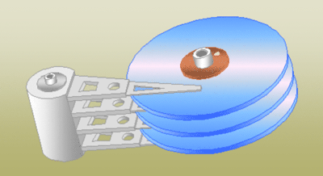
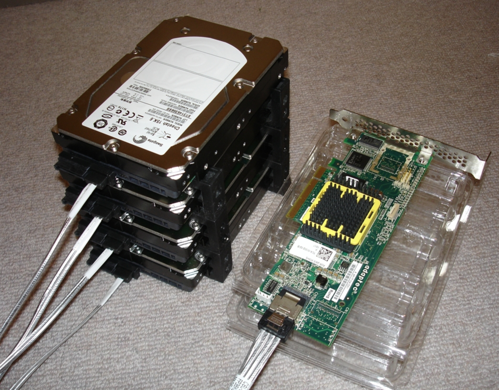

# Linux磁盘管理与文件系统

## 计算机硬件与存储

<!-- OCR_START -->
- ASUS
- 华硕品质·坚若磐石
- eno
- CG
<!-- OCR_END -->

<!-- OCR_START -->
- CPU
- 就好像頭好壮壮！主要負责
- 所有相開事情的到联舆實
- 主記憶體（RAM）
- 理的機制等等。
- 将皮赠、眼睛所接收到的資訊暂
- 時記錄起來的地方！提供CPU思
- 考用
- 硬碟
- 就像是人類的記憶一般
- 記錄著種種經驗。也是
- CPU讀取/寫入之處。
- 顯示卡
- 将各種影像輸出的装置，也是
- 由CPU将影像傅導出来！
- 主機板
- 就好像人體的神經一般，将所有
- 的元件連結在一起！
- 键盤、滑鼠、網路卡等
- 就好像手、一般，操著人體
- 舆外界環境的互動！
<!-- OCR_END -->

<!-- OCR_START -->
- 网卡
- 声卡
- 显示卡
- 主板
- 内存
- CPU
- CPU风扇
<!-- OCR_END -->

<!-- OCR_START -->
- 计算机的组成部分，就以普通家用主机分析，依次有：
- ·输入设备，键盘、鼠标
- ·输出设备：屏幕
- ·主机部分：机箱、机箱内的零件
- 王机
- 显示器
- 鼠标
- 躲在主机外壳下的零件
- 我们主要通过键盘鼠标将数据输入到主机里面，再由主机的处理器进行计算，输出图像或是文本信息输出到
- 屏幕中。
- 电源
- 内存
- 光驱致据线
- 光驱
- CPU
- 软驱
- CPU风扇
- 硬盘
- 计算
- 机主
- 肾果手机组成
- 显卡
<!-- OCR_END -->

### 磁盘知识体系

<!-- OCR_START -->
- 磁盘知识的体系结构
- 老男孩教育
- oldboyedu.com
- df、fsck、tune2fs、dumpe2fs、mkfs、
- 第五层
- 磁盘管理维护知识
- swapon、swapoff、fdisk、parted、
- fstab文件、ipmtools
- 第四层
- 格式化（创建文件系统，初始化inode和block）
- 格式化的知识，文件系统的知识，挂载的知识
- 第一分区
- 第二分区
- 第三块分区
- 分区的知识，主、扩展、逻辑，分区表
- 第三层
- /dev/sdal
- /dev/sda2
- /dev/sda3
- 的知识，分区命令fdisk、parted
- 第二层
- RAID，LVM等（开机时候做RAID，形成一块或多块小虚拟磁盘
- Raid知识，硬软raid，Ivm知识，企业的选择
- 第一块硬盘
- 第二块硬盘
- 第三块硬盘
- 磁盘外部结构.接口.内部结构.工作原
- 第一层
- /dev/sda
- /dev/sdb
- /dev/sdc
- 理.读写原理
<!-- OCR_END -->

### Linux磁盘存储的经典描述

```plain
磁盘要放入计算机且被Linux系统识别，到可以使用磁盘存储数据，过程如下：
1.磁盘要存数据，相当于人盖房子
2.磁盘要分区后才能够存储数据，相当于房子改好了，需要隔断分出卧室，厨房，卫生间等区域
3.磁盘分区完成后，还得格式化后才能使用，且创建文件系统后才可以存储数据，相当于家里得装修后才能开始住人，不同的文件系统相当于不同的装修风格
4.磁盘分区，格式化，创建文件系统后，还得进行挂载到不同的文件夹，才能存放数据，相当于房子还得安装门、窗，才能和外界通信，进出
```

<!-- OCR_START -->
- 磁盘使用过程
- 磁盘分区
- /  /data /opt
- 房子打隔断，卧室、厨房、卫生间
- 房子装修过程
- 磁盘格式化
- 房子装好还得选择装修风格、欧式、中式
- 创建文件系统
- ntfs ext3 ext4
- 房子装修好了，开一个门，窗
- 挂载目录
- 可以进出房子
- 读写数据
<!-- OCR_END -->

## 机械硬盘原理

机械硬盘由坚硬金属材料制成的涂以磁性介质的盘片，盘片两面称为盘面或扇面，都可以记录信息，由磁头对盘面进行操作，一般用磁头号区分。

结构特性决定了机械硬盘如果受到剧烈冲击，磁头与盘面可能产生的哪怕是轻微撞击都有可能报废。

<!-- OCR_START -->
- 磁头臀移动方向
- 读写磁头
- 盘片
- 扇区
- 磁道
- 盘面
- 扇区间款
- 磁道间
- 主轴
<!-- OCR_END -->

磁头不动，硬盘旋转，磁头就会在磁盘表面画出一个圆形轨迹且磁化，数据就保存在磁化区域中，称之为磁道。

每个磁道分段，一个弧就是一个扇区。

一个硬盘表面可以有多个扇面，每个扇面磁道数相同，具有相同周长的磁道形成的圆柱称之为柱面，柱面数与磁道数相等。



<!-- OCR_START -->
- 磁头
- 主粮
- 盘片
- 桂面
- 扇区
- 扇面
- 磁道
- 10
- 磁盘上的磁道、扇区和族
- alominthere
<!-- OCR_END -->

磁盘的每一面被分为很多条磁道，即表面上的一些同心圆，越接近中心，圆就越小。

而每一个磁道又按512个字节（0.5 KB）为单位划分为等分，叫做扇区。

文件数据存储在硬盘上，**硬盘中最小的存储单位是扇区（sector）**

**磁头读取扇区数据是按照**`**连续的多个扇区，称之为块（block）**`

`操作系统`文件存取的**最小单位是块，且单位是4kb，也就是8个扇区。**

## 磁盘常见概念

***

<!-- OCR_START -->
- 计算机单位
- 容量单位
- 对于计算机而言，只认识一个叫做二进制的容量单位，我们称之为bit，但是由于bit单位太小，计算
- 机又用Byte单位来统计
- 1Byte=8Bits.
- 同样的，由于计算机存储越来越大，Byte也太小了，计算机又出现简化的单位KB、MB、GB、TB
- 常用单位的换算关系
- Bit—位
- Byte-字节
- Kilobyte（KB)一千字节
- 1KB=1,024=210bytes.
- Megabyte（MB)一兆字节
- 1MB=1024KB=220byteS.
- Gigabyte（GB)一千兆字节
- 1GB=1024MB=230bytes.
<!-- OCR_END -->

### 磁盘管理的名词解释

```plain
扇区(sector)是磁盘最小的物理存储单元，单位是512字节
操作系统无法对数目众多的扇区进行寻址，因此操作系统将相邻的扇区组合在一起，形成了块（8个扇区，4k大小）
在Linux文件系统中多个连续的扇区称之为block，块，也是在系统中被认为是最小的存储单位  du -h /tmp/*
在windows文件系统中多个连续的扇区称作簇
操作系统规定，一个block只能存放一个文件的内容，因此文件占用空间，只能是block的整数倍 du -h /etc/*
即使文件大小，小于一个block，也就是小于4k，同样占用一个block的大小
```

<!-- OCR_START -->
[root@chaogelinux tmp]# du -h /tmp/*
/tmp/cc.txt
792K
/tmp/chaoge.hello
4.0K
/tmp/chaoge.txt
12K
/tmp/glances.log
/tmp/glances-root.log
/tmp/heh.go
/tmp/test.txt
/tmp/top.txt
/tmp/yum_save_tx.2019-12-12.18-24.v4_WdR.yumtx
/tmp/yum_save_tx.2019-12-13.10-01.R2iUU6.yumtx
<!-- OCR_END -->

硬盘中最小的存储单位是扇区（sector），扇区大小是512B，而硬盘在文件读写操作的时候并非以扇区为单位，是以`簇`为单位，一个`簇`包含了多个扇区。

在Windows下如NTFS等文件系统中叫做簇；

在Linux下如Ext4等文件系统中叫做块（block）

<!-- OCR_START -->
- 硬盘
- 硬盘分区
- 分区1
- 分区2
- 分区3
- 簇1
- 簇2
- 簇3
- 文件系统
- 4k扇区
- 512b
<!-- OCR_END -->

***

## 磁盘分区

硬盘分区是就使用分区编辑器（partition editor）将一个硬盘上划分几个独立的逻辑部分，盘片一旦划分成数个分区，不同类的目录与文件可以存储进不同的分区。

越多分区，也就有更多不同的地方，可以将文件的性质区分得更细，按照更为细分的性质，存储在不同的地方以管理文件；但太多分区就成了麻烦。

硬盘分区就像给一间空荡的房子划分出卧室，厨房，客厅等相互隔离的空间一样。主要是为了方面用户的使用。

另一方面，通过合理的硬盘分区，有效保护系统盘空间，确实能够提高系统运行速度，再者，硬盘分区也可以有效地对数据进行保护。

<!-- OCR_START -->
- 计算机
- 组识
- 系统腿性
- 即载或更改程序
- 映射网络驱动器
- 打开控制面板
- ★收藏
- 盘（4）
- 点击查看源网页
- OS(C:)
- Data (D:)
- 本地磁盘（F）
- 桌面
- 90.4GB可用共115GB
- 73.1GB可用共100GB
- 118GB可用共120GB
- 最近访问的位置
- 本地磁盘（G:）
- 汽库
- 108GB可用共108GB
- 视频
- 有可移动存储的设备（1）
- 图片
- 文档
- DVO
- DVDRW驱动器（E:)
- 迅雷下载
- 音乐
- 家庭组
- 本地盘（F）
<!-- OCR_END -->

你当然可以不分区，只不过，当你面对越来越多的子目录，或者是越来越慢的Windows，不得不费功夫去管理你的文件，或者重装Windows的时候，恐怕会悔不当初。

<!-- OCR_START -->
- 投
- 散
- 分
- 集中投资
<!-- OCR_END -->

*mbr原理*

MBR：Master Boot Record，主分区引导记录。

磁盘的每块扇区都被分配了一个逻辑块地址，`引导扇区`是每个分区的第一扇区，`主引导扇区`是整个硬盘的第一扇区。

MBR就保存在主引导扇区中，且扇区还保存了硬盘分区表DPT（Disk Partition Table），和结束标志字（Magic number）。扇区总计512字节，MBR占446字节（0000H - 01BDH），DPT占据64个字节（01BEH - 01FDH），最后的magic number占2字节（01FEH – 01FFH）。

MBR分区缺点是，硬盘容量最大2T

<!-- OCR_START -->
- boot loader
- DiskPartition Table
- magic number
- code
- 3
- 55AAH
- MBR
<!-- OCR_END -->

*GPT原理*

GPT分区：全称为Globally Unique Identifier Partition Table，也叫做GUID分区表，由于MBR限制在2TB容量，GPT诞生了，优点如下

* GPT分区的硬盘容量几乎无限制
* 分区个数无限制
* 自带磁盘数据保险机制

## 文件系统

### 格式化文件系统

<!-- OCR_START -->
- 格式化本地磁盘（D：）
- 容量(P)：
- 45.9GB
- 文件系统E）
- NTFS
- 分配单元大小（）
- 4096字节
- 卷标（L）
- 格式化选项（0）
- 快速格式化（Q）
- 启用压缩（E）
- 创建一个MS-DOS启动盘M）
- 开始（S）
- 关闭（C）
<!-- OCR_END -->

* FAT16/FAT32，最早期的windows文件系统，缺点单个文件不能超过2G/4G大小，现在一部蓝光电影十几G肯定不行
* NTFS，支持文件加密，采用日志式文件系统，详细记录磁盘读写操作，提高数据和系统安全性，突破了4GB单个文件大小，对于flash闪存设备，过多读写造成磁盘寿命较短
* exFAT，单个文件支持16GB，适合于flash闪存设备使用（ssd，u盘）

### 平均寻道时间

平均寻道时间，它是了解硬盘性能至关重要的参数之一。它是指硬盘在接收到系统指令后，磁头从开始移动到数据所在的磁道所花费时间的平均值，它在一定程度上体现了硬盘读取数据的能力，是影响硬盘内部数据传输率的重要参数。

<!-- OCR_START -->
- Seek
- time
- Original
- Rotational
- latency
- position
- Desired
- data
<!-- OCR_END -->

读写头沿径向移动，移到要读取的扇区所在磁道的上方，这段时间称为寻道时间（seek time）。

通过盘片的旋转，使得要读取的扇区转到读写头的下方，这段时间称为旋转延迟时间（rotational latency time）

### 磁盘转速

<!-- OCR_START -->
- 1200RPM
- 5400RPM
- WDWotorn
- .OTB
- VS
<!-- OCR_END -->

**RPM（revolutions per minute）它是指硬盘内电机主轴的旋转速度，也就是硬盘盘片在一分钟内所能完成的最大转数。**

<!-- OCR_START -->
- 全部结果>
- 电脑组件
- 硬盘
- 品牌：
- 更多十多选
- SEAGATE
- WD
- TOSHIBA
- 美商海盗船
- Lenovo
- HIKVISION
- 戴尔
- QQI<G壹酷
- 海康威视
- ORICO
- IETS
- Getrich
- aigo
- mmLOOnG
- SAMSUNG
- KOTIN京天
- 御龙者
- 名花堂
- 接口：
- SATA接口
- SAS接口
- 容量：
- 1TB
- 2TB
- 3TB
- 4TB
- 5TB
- 6TB
- 8TB
- 10TB
- 12TB及以上
- 320GB
- 500GB
- (600-750)GB
- 十多选
- 缓存：
- 16MB及以下
- 32MB
- 64MB
- 128MB
- 256MB
- 高级选项：
- 规格
- 转速
- 商品精选
- 综合↓
- 销量√评论数新品√价格
- 共7300+件商品1/100
- 配送至北京昌平区
- 京东物流货到付款仅显示有货京东国际可配送全球PLUS专享
- 在结果中搜索
- 确定
- 单件
- 套装2件
- Wiesterm
- Wiestern
- 12.12
- ￥989.00
- 西部数据(WD)企业盘服务
- 器硬盘NAS监控台式机
- 已有7人评价
- 801
- 8-30
- 800
- 2TB+性能优选+2年换新
- 1TB+7200转+2年换新
- 4TB+256MB大缓存+2年换新
- 2TB+2年换新+大容量优选
- 1TB+2年换新+装机优选
- ￥379.00
- ￥289.00
- ￥599.00
- ￥579.00PLUS
- ￥369.00
- ￥359.00PLUS
- ￥299.00
- 方品电脑
- 希捷（Seagate)2TB256MB
- 希捷(Seagate)1TB 64MB 7200RPM台式
- 京品电脑
- 希捷(Seagate)4TB 256MB
- 京东精选西部数据(WesternDigital)蓝盘
- 西部数据（WD)蓝盘1TBSATA6Gb/s7200
- 7200RPM
- 台式机机械硬盘SATA接口希捷
- 机机械硬盘SATA接口希捷酷鱼
- 5400RPM
- 2TBSATA6Gb/s 256MB台式机械硬盘
- 转64MB台式机械硬盘(WD10EZEX)PC存
- 155万+条评价
- 二手有售
- 140万+条评价
- 希捷京东自营旗舰店
- 西部数据京东自营旗...
- 自营闪购
- 自营
- ￥26000.00
- 西部数据红盘/企业级硬
- 对比
- 关注加入购物车
- 加入购物车
- 关注
- 盘+威联通/铁威马NAS网
- 已有3人评价
<!-- OCR_END -->

电脑刚诞生初期，几乎所有硬盘都是3600RPM，这是由于美国的交流电是60Hz

```plain
1分=60s
60Hz * 1转/Hz * 60s/分钟 = 3600转/分钟
```

市场如今主流的5400、7200转速

```plain
3600RPM * 1.5 = 5400 RPM
3600RPM * 2 = 7200RPM
```

**5400和7200转速比较**

*情况一*

<!-- OCR_START -->
- 同样的小区距离密度
- 摩托车比自行车要快几倍
<!-- OCR_END -->

*情况二*

<!-- OCR_START -->
- 摩托车送的小区很散，
- 距离较远，难以配送
- 自行车速度虽慢，日
- 由于小区密度较高，容易配送，效率更高
<!-- OCR_END -->

*总结*

<!-- OCR_START -->
即使摩托车速度再快，小区位置特别稀疏，更难配送
自行车此时完胜摩托车
这个意味着，磁盘存储密度的提高，数据的连续性高
意味着磁盘数据读取的高效性，而非简单的7200转和5400转的区别
单车也能干的过摩托！
<!-- OCR_END -->

## Linux磁盘分区

<!-- OCR_START -->
- 一块没有分区的新硬盘
- 首先将
- 硬盘分
- 成主分
- 主分区
- 扩展分区
- 区和扩
- 展分区
- 两部分
- 然后将
- 扩展分
- 区划分
- （C）
- 为若干
- 个逻辑
- 分区
- 硬盘分区结构
<!-- OCR_END -->

* 主分区，primary partition
* 扩展分区，extended
  * 逻辑分区

**linux一切接文件，磁盘设备在系统中也以文件形式展示**

<!-- OCR_START -->
- 装置
- 装置在Linux内的文件名
- IDE硬盘机
- /dev/hd[a-d]
- SCSI/SATA/USB硬盘机
- /dev/sd[a-p]
- USB快闪碟
- /dev/sd[a-p](与SATA不同)
- 软盘驱动器
- /dev/fd[0-1]
- 打印机
- 25针: /dev/lp[0-2]
- USB: /dev/usb/lp[0-15]
- 鼠标
- PS2: /dev/psaux
- USB: /dev/usb/mouse[0-15]
- 当前CDROM/DVDROM
- /dev/cdrom
- 当前的鼠标
- /dev/mouse
<!-- OCR_END -->

* `/dev/vd[a-d][1-128]`：为虚拟磁盘的磁盘文件名

```plain
/dev/sda–第一个SCSI磁盘或简单的硬盘。。
/dev/sdb–第二个SCSI磁盘。
/dev/sdc–第三个SCSI磁盘。
/dev/hda–IDE主控制器上的主磁盘。
/dev/hdb–IDE主控制器上的从磁盘。
```

**注意：CentOS 6和7统统将硬盘设备文件标识为/dev/sd\[a-z]**

### 分区类型

在系统上的/dev/sda1、/dev/sda2又是何物？答：代表分区（Partition）

```plain
/dev/sda1
/dev/sda2
/dev/sda3
/dev/sda4
/dev/sda5
```

**一个硬盘的结构如下：**

系统默认分区1~4留给了主分区和扩展分区

* 主分区1 \* (星号代表是引导分区，引导分区装在这里)
* 主分区2
* 主分区3
* 主分区4(extended)
  * 逻辑分区n

### fdisk命令

分区管理命令fdisk，命令危险，慎重使用

```plain
fdisk - manipulate disk partition table 用来管理磁盘分区表，修改、查看
fdisk -l [-u] [device...]
fdisk -l /dev/sda
```

<!-- OCR_START -->
- [root@luffycity ~]# fdisk -l
- 查看分区信息
- 磁盘名字容量大小、一共多少个扇区
- 磁盘/dev/sda：21.5GB，21474836480字节，41943040个扇区
- Units=扇区of1*512=512bytes每个扇区512b大小
- 扇区大小（逻辑/物理）：512字节／512字节
- centos7
- I/0大小（最小/最佳）：512字节／512字节
- start从哪个扇区开始
- 到哪个扇区结束
- 磁盘标签类型：dosdos标签表示是MBR格式磁盘
- 扇上有多个块
- 磁盘标识符：0x000b829f 标识符16进制数字
- ld表示分区类型83是16进制的数字
- 星号表示是引导记录，装在这个分区
- System表示Id对应的意义
- 设备Boot
- Start
- End
- Blocks
- Id
- System
- /dev/sda1
- 2048
- 2099199
- 1048576
- 83
- Linux
<!-- OCR_END -->

```plain
[root@luffycity ~]# fdisk /dev/sda
欢迎使用 fdisk (util-linux 2.23.2)。
更改将停留在内存中，直到您决定将更改写入磁盘。
使用写入命令前请三思。
命令(输入 m 获取帮助)：m
命令操作
   a   toggle a bootable flag
   b   edit bsd disklabel
   c   toggle the dos compatibility flag
   d   delete a partition
   g   create a new empty GPT partition table
   G   create an IRIX (SGI) partition table
   l   list known partition types
   m   print this menu
   n   add a new partition
   o   create a new empty DOS partition table
   p   print the partition table
   q   quit without saving changes
   s   create a new empty Sun disklabel
   t   change a partition's system id
   u   change display/entry units
   v   verify the partition table
   w   write table to disk and exit
   x   extra functionality (experts only)
命令(输入 m 获取帮助)：
                n：创建新分区
                d：删除已有分区
                t：修改分区类型
                l：查看所有已经ID
                w：保存并退出
                q：不保存并退出
                m：查看帮助信息
                p：显示现有分区信息
```

### 新加一块硬盘进行磁盘分区

我们添加了/dev/sdb新硬盘

```plain
[root@local-pyyu ~]# fdisk -l |grep sd[a-c]
磁盘 /dev/sda：21.5 GB, 21474836480 字节，41943040 个扇区
/dev/sda1   *        2048     2099199     1048576   83  Linux
/dev/sda2         2099200    41943039    19921920   8e  Linux LVM
磁盘 /dev/sdb：21.5 GB, 21474836480 字节，41943040 个扇区
fdisk磁盘分区命令
-v 打印 fdisk 的版本信息并退出．
-l 列出指定设备的分区表信息并退出。
-u 以扇区数而不是以柱面数的形式显示分区表中各分区的信息．
-s 分区 将分区的 大小 （单位为块）信息输出到标准输出
```

## 分区命令步骤图解

<!-- OCR_START -->
- 2.root@local-pyyu:~(ssh)
- root@local-pyyu:~..
- 1
- [rotelocal-pyu-3#
- 开始分区
- 创建新的
- ntable
- 命令(输入m获取帮助）：p
- 打印现有分区情况
- 磁盘标签类型：dos
- 磁盘标识符：8xb1271efc没有分区，
- 新加的磁盘
- 设备Boot
- Start
- End
- Blocks Id System
- 输入n,
- 添加分区
- 输入p,
- 添加主分区
- 居始扇区（26
- 此时添加了第一个主分区，情况如下
- 526335
- 扇区结束点是526335*512=289MB
- m获取帮助）：n
- 2已设置为 Extended类型，大小设为19.8GiB
- 合(入获取标助):n
- 此时剩余扇区空间全给了扩展分区，19.8GB
- sectefout
- 开始创建逻辑分区，分区号默认从5开始
- 在用默认，值528384
- 分区
- 5已设置为
- 磁盘
- 主分区sdb1，256M
- 扩展分区sdb2一共20G左右
- 磁盘标识符：0xb1271efc
- 逻辑分区sdb5
- 10G左右
- Black14
- 41943039
- 28
- Extended
- 再创建一个逻辑分区
- 剩余扩展分区的空间，都给逻辑分区 sdb6
- 起用
- 用25195-143039认为21501952）：
- ，+扇区
- 6已设置为Linux类型，大小设为9.8GiB
- /dev/sdb:
- 12字
- sdb6逻辑分区，9.6G大小
- 26214
- 10485760
- db5
- 83
- 命令入七
- altered!
- Calling
- partition table.
- /.ev/sdh*
- 此时系统出现磁盘文件
- d : 18 19
- root
- Foot
- 2112月
- 2 15:57
- 2212月
- ro
- ]#
<!-- OCR_END -->

***

### 检查系统识别了新的分区

有时候删除文件，系统仍然提示占用空间，或内核未能读取到新创建的分区，可以用如下命令重读分区

```plain
[root@local-pyyu ~]# cat /proc/partitions
major minor  #blocks  name
   8        0   20971520 sda
   8        1    1048576 sda1
   8        2   19921920 sda2
   8       16   20971520 sdb
   8       17     262144 sdb1
   8       18          1 sdb2
   8       21   10485760 sdb5
   8       22   10220544 sdb6
  11        0    1048575 sr0
 253        0   17821696 dm-0
 253        1    2097152 dm-1
```

### partprobe命令

centos 5系列：

partprobe命令用于重读分区表，当出现删除文件后，出现仍然占用空间。可以partprobe在不重启的情况下重读分区。

有时候使用fdisk命令对磁盘分区后，内核找不到新分区，得重启机器才能识别新分区，使用partprobe可以不重启重读新的分区表。

```plain
[root@localhost ~]# partprobe   /dev/sdb          #重读磁盘分区表
```

### partx

partx命令告用来诉内核当前磁盘的分区情况

```plain
#让内核重读分区表
# partx -a /dev/sdb
```

## 针对超过2TB的磁盘分区

### parted命令

```plain
-l 显示所有分区信息
```

小于2TB的磁盘都可以用fdisk分区，但是大于2TB的磁盘，只能用parted命令分区，且转换磁盘为GPT格式

```plain
#超哥这里删除了/dev/sdb磁盘的所有分区，使用的是20G的硬盘模拟,同学们可以自己添加新硬盘
[root@local-pyyu ~]# fdisk -l
磁盘 /dev/sdb：21.5 GB, 21474836480 字节，41943040 个扇区
Units = 扇区 of 1 * 512 = 512 bytes
扇区大小(逻辑/物理)：512 字节 / 512 字节
I/O 大小(最小/最佳)：512 字节 / 512 字节
磁盘标签类型：dos
磁盘标识符：0xb1271efc
   设备 Boot      Start         End      Blocks   Id  System
```

Parted开始分区，针对/dev/sdb磁盘，`GPT分区表没有extend类型`

```plain
[root@local-pyyu ~]# parted /dev/sdb
GNU Parted 3.1
使用 /dev/sdb
Welcome to GNU Parted! Type 'help' to view a list of commands.
(parted) mklabel gpt
警告: The existing disk label on /dev/sdb will be destroyed and all data on this disk will be lost. Do you want to continue?
是/Yes/否/No? Yes
(parted) mkpart primary 0 500
警告: The resulting partition is not properly aligned for best performance.
忽略/Ignore/放弃/Cancel? Ignore
(parted) p
Model: VMware, VMware Virtual S (scsi)
Disk /dev/sdb: 21.5GB
Sector size (logical/physical): 512B/512B
Partition Table: gpt
Disk Flags:
Number  Start   End    Size   File system  Name     标志
 1      17.4kB  500MB  500MB               primary
(parted) mkpart logical 501 10000
(parted) p
Model: VMware, VMware Virtual S (scsi)
Disk /dev/sdb: 21.5GB
Sector size (logical/physical): 512B/512B
Partition Table: gpt
Disk Flags:
Number  Start   End     Size    File system  Name     标志
 1      17.4kB  500MB   500MB                primary
 2      501MB   10.0GB  9499MB               logical
(parted) q
信息: You may need to update /etc/fstab.
[root@local-pyyu ~]# ls /dev/sdb*
/dev/sdb  /dev/sdb1  /dev/sdb2
[root@local-pyyu ~]#
```

<!-- OCR_START -->
2. root@local-pyyu:~ (ssh)
×root@local-pyyu:~..81
[root@local-pyyu ~]# parted /dev/sdb
GNU Parted 3.1
使用/dev/sdb
Welcome to GNU Parted!Type'help'toviewalistofcommands.
(parted) mklabel gpt
为sdb磁盘创建GPT类型分区表，大于2TB的硬盘必须这么做
警告：Theexistingdisklabelon/dev/sdbwillbedestroyedandalldataonthisdisk willbelost.Doyou wanttocontinue?
是/Yes/否/No？Yes
（parted）mkpartprimary0500
创建主分区，大小500M
警告：Theresultingpartitionisnotproperlyalignedforbestperformance.
忽略/Ignore/放弃/Cancel?，Ignore
（parted）p打印分区表信息
Model:VMware，VMware Virtual S(scsi)
Disk/dev/sdb:21.5GB
Sector size (logical/physical):512B/512B
Partition Table: gpt
Disk Flags:
Number
Start
End
Size
File systemName
标志
1
17.4kB
500MB
primary
只有一块主分区
(parted)mkpartlogical50110000
再来创建逻辑分区，大小10G
(parted)p
File system
Name
sdb1主分区
2
501MB
10.0GB
9499MB
logical
sdb2逻辑分区
(parted)q
信息：Youmayneedtoupdate/etc/fstab.
[root@local-pyyu ~]# ls /dev/sdb*
/dev/sdb
/dev/sdb1
/dev/sdb2
查看分区设备文件
[root@local-pyyu~]#
<!-- OCR_END -->

用fdisk命令检查sdb磁盘情况

```plain
[root@local-pyyu ~]# fdisk -l /dev/sdb
WARNING: fdisk GPT support is currently new, and therefore in an experimental phase. Use at your own discretion.
磁盘 /dev/sdb：21.5 GB, 21474836480 字节，41943040 个扇区
Units = 扇区 of 1 * 512 = 512 bytes
扇区大小(逻辑/物理)：512 字节 / 512 字节
I/O 大小(最小/最佳)：512 字节 / 512 字节
磁盘标签类型：gpt
Disk identifier: 24DA7CEB-EAD9-4540-A5C6-B9F7D566D388
#         Start          End    Size  Type            Name
 1           34       976562  476.8M  Microsoft basic primary
 2       978944     19531775    8.9G  Microsoft basic logical
```

### 更换gpt表为mbr

```plain
fdisk命令是针对MBR分区格式的，虽然能用g命令把磁盘格式化为GPT，但是无法再重新格式化为MBR格式，因为fdisk命令无法操作GPT格式的磁盘。
可以使用parted命令更换磁盘分区格式
[root@chaoge /]# parted /dev/sdb    //选中要转换到的磁盘
GNU Parted 3.1
Using /dev/sdb
Welcome to GNU Parted! Type 'help' to view a list of commands.
(parted) mktable
New disk label type? msdos               
// 按照习惯MBR格式一般在linux下称作dos，如果在New disk label type?后输入dos或者mbr会提示无效命令，这时候要用help mktable查看
//帮助信息，可以看到parted命令中MBR分区被称作msdos，其它分区如下： aix, amiga, bsd, dvh, gpt, mac, msdos, pc98, sun, loop
Warning: The existing disk label on /dev/sdb will be destroyed and all data on this disk will be lost. Do you want to continue?
Yes/No? Yes
```

# Linux软硬链接

# 软硬链接

### ln命令

硬链接与软链接

<!-- OCR_START -->
- 16002
- 5P5519
- heWorld
- 全卫:
- 2014
- 1E120
- Word2013
- 贴内盘乐
- 天正津
- CAD2014
- 1
- (ecel2011
- PKPM2010
- CAD2012
- Baidu经验
- jingyan.baidu.com
<!-- OCR_END -->

ln命令是单词link缩写，功能是创建文件之间的链接（make links between files），链接类型包括

* 硬链接 hard link
* 软链接 symbolic link

| 命令参数 | 解释 |
| --- | --- |
| ln无参数 | 创建硬链接 |
| -s | 创建软链接（符号链接） |

**细说链接知识**

* 硬链接，创建语法`ln 源文件 目标文件`，硬链接生成的是普通文件
* 软链接/符号链接，创建语法是`ln -s 源文件 目标文件`，生成符号链接文件

ln命令实践

```plain
[root@pylinux tmp]# touch alex.txt
[root@pylinux tmp]#
[root@pylinux tmp]#
[root@pylinux tmp]# ln alex.txt alex_hardlink                    #创建硬链接
[root@pylinux tmp]# ln -s alex.txt   alex_softlink        #创建软连接
[root@pylinux tmp]#
[root@pylinux tmp]# ls -lih
总用量 0
2370 -rw-r--r-- 2 root root 0 10月 14 15:25 alex_hardlink
7979 lrwxrwxrwx 1 root root 8 10月 14 15:25 alex_softlink -> alex.txt
2370 -rw-r--r-- 2 root root 0 10月 14 15:25 alex.txt
[root@pylinux tmp]# echo "我是金角大王" > alex.txt
[root@pylinux tmp]#
[root@pylinux tmp]#
[root@pylinux tmp]# cat alex_hardlink
我是金角大王
[root@pylinux tmp]# cat alex_softlink
我是金角大王
[root@pylinux tmp]#
[root@pylinux tmp]#
[root@pylinux tmp]# echo "我是金角大王的一根白头发" >> alex.txt
[root@pylinux tmp]# cat alex_hardlink
我是金角大王
我是金角大王的一根白头发
[root@pylinux tmp]# cat alex_softlink
我是金角大王
我是金角大王的一根白头发
```

### *readlink命令*

查看软链接文件的内容

```plain
使用cat查看软连接文件，只能看到源文件的内容
软链接文件存储的是源文件的路径
[root@pylinux tmp]# echo "我是金角老妖怪" > heihei.txt
[root@pylinux tmp]# ln -s /tmp/heihei.txt /tmp/yg.txt
[root@pylinux tmp]# readlink yg.txt
/tmp/heihei.txt
[root@pylinux tmp]# cat yg.txt
我是金角老妖怪
#硬链接看不到信息
[root@pylinux tmp]# readlink hh2.txt
[root@pylinux tmp]# readlink hh.txt
/tmp/hehe.txt
```

## inode与硬链接

操作系统中专门用于管理和存储文件的信息软件称之为`文件系统`，**文件系统将文件的**`**元信息(文件创建者，日期，大小等,可以通过stat命令查看元信息)**`**存储在一个称之为inode的区域**，中文是**索引节点**

查看文件inode号

```plain
[root@pylinux tmp]# ls -li
总用量 43356
  2370 -rw-r--r-- 1 root root 43523616 7月   7 2018 alex.txt.gz
   434 -rw-r--r-- 1 root root   855682 7月   7 2018 alltmp.zip
 13331 -rw-r--r-- 2 root root       14 11月  5 11:44 hehe.txt
 13331 -rw-r--r-- 2 root root       14 11月  5 11:44 hh2.txt
  7917 lrwxrwxrwx 1 root root       13 11月  5 11:45 hh.txt -> /tmp/hehe.txt
144495 drwxr-xr-x 2 root root     4096 7月   7 2018 各位今天也要好好学习哦.txt
```

通过ls -l查看到的数据，唯独文件名不是Inode存储的数据信息

Inode存储的信息不限于

* 文件大小
* 属主
* 用户组
* 文件权限
* 文件类型
* 修改时间

还包括了文件的文件的实体指针（指向Block的位置，也就是Inode和Block的关系）

### inode大小

硬盘格式化的时候，系统自动分为2个区，一个数据区，存放数据，一个是inode区（inode table）存放inode信息

每个inode节点大小，一般是128字节或是256字节，inode节点的总数在格式化的时候就决定了，

```plain
[root@chaogelinux ~]# dumpe2fs -h /dev/vda1 |grep -i 'inode size'  #ext4 分区使用命令
dumpe2fs 1.42.9 (28-Dec-2013)
Inode size:              256

[root@ckh ~]# xfs_info /dev/sda1  #xfs分区用这个查看
meta-data=/dev/sda1              isize=512    agcount=4, agsize=65536 blks
         =                       sectsz=512   attr=2, projid32bit=1
         =                       crc=1        finobt=0 spinodes=0
data     =                       bsize=4096   blocks=262144, imaxpct=25
         =                       sunit=0      swidth=0 blks
naming   =version 2              bsize=4096   ascii-ci=0 ftype=1
log      =internal               bsize=4096   blocks=2560, version=2
         =                       sectsz=512   sunit=0 blks, lazy-count=1
realtime =none                   extsz=4096   blocks=0, rtextents=0

```

### Block磁盘块

Block是存放实际文件数据的单元，例如图片，视频，文本等数据，单个的文件占用多个block来存储。

操作系统标识文件并非以以文件名，而是以inode号码识别，文件名只是一个绰号而已。

文件系统读取文件

<!-- OCR_START -->
用户通过文件名字，打开文件
[root@pylinux tmp]# cat yuchao
[root@pylinux tmp]# Is -li
文件系统找到文件inode号
total 4
16777295 -rw-r--r--. 1 root root 21 Oct 14 16:13 yucha0
[root@pylinux tmp]# stat yuchao
File: 'yuchao'
Size: 21
Blocks: 8
IO Block: 4096 regular file
获取inode信息，找出文件所在磁盘block，读取
Device: fd00h/64768d Inode: 16777295
Links: 1
③
Access: (0644/-rw-r--r--) Uid:((
0/root）Gid:（
0/
root)
Context: unconfined_u:object_r:user_tmp_t:s0
Access: 2019-10-14 16:13:15.273761498 +0800
Modify: 2019-10-14 16:13:05.401690887 +0800
Change: 2019-10-14 16:13:05.401690887 +0800
Birth: -
超哥带我学linux
<!-- OCR_END -->

打个比方，比如一本书，存储设备或分区就相当于这本书，block 相当于书中的每一页内容，而inode 就相当于这本书前面的目录，一本书有很多内容，一个知识点可能有多页，如果想查找某部分或某知识点的内容，一般先查 书的目录，通过目录能更快的找到想要看的内容。

<!-- OCR_START -->
- 首页的目录索引l就相当于Inode
- 每一页相当一个Block
- 整本书就是
- 老男孩linux培训
- 块磁盘或分区
- QQ:7027111180042789
<!-- OCR_END -->

inode 为每个文件进行信息索引，所以就有了 inode的数值，（书的目录提供简单信息描述，inode也描述了文件的一些元信息）操作系统根据指令，能通过 inode 值最快的找到相应 的文件。

**硬链接**

一般情况，文件名与inode号是一对一的，linux系统允许`多个文件路径`指向`同一个inode号码`（一个超市有多个门）

特性：

* 目录不支持硬链接
* 不得跨文件系统
* 硬链接数会增加Inode引用计数

这意味着：

* 用不同的文件名字可以访问一样的内容
* 修改文件内容，影响所有文件名
* 删除一个文件名，不影响另一个文件名正常操作

<!-- OCR_START -->
前门
文件名，inode号一样
路飞学城超市
侧门
（linux文件，磁盘的block数据）
硬链接1，inode号一样
后门
1.超市可以有多个门，都是进入超市内，多个硬链接指向一个文件inode
硬链接2，inode号一样
2.撤掉任何一个门，不影响其他门，也不影响超市，删除硬链接，文件不影响
3.只有删除源文件以及所有对应所有硬链接，文件数据才删除
4.当文件硬链接数为0，文件才是被删除
<!-- OCR_END -->

<!-- OCR_START -->
- [root@pylinuxtmp]#echo"我是金角老妖">alex.txt
- [root@pylinux tmp]#
- [root@pylinux tmp]# ln alex.txt alex.txt2
- 创建硬链接1
- [root@pylinux tmp]# ln alex.txt alex.txt3
- 创建硬链接2
- 指向同一个block数据，inode号一样
- [root@pylinux tmp]# ls -i
- 16777289
- alex.txt16777289
- alex.txt2
- alex.txt3
- alex文件有三个硬链接
- total12
- 16777289 -rw-r--r-.
- 3 root root 19 0ct 14 16:58
- alex.txt
<!-- OCR_END -->

**软连接**

软连接就类似windows的快捷方式了，是指向一个文件路径的另一个文件路径。

特性：

* 软连接是两个独立的文件，有各自的inode，创建软连接不会增加符号引用计数
* 支持目录软连接，可以跨文件系统
* 软链接有自己的inode号
* 软链接文件类型是l
* 软链接指向源文件，若源文件不存在，软链接失效(白字红底闪烁报错)

```plain
硬链接文件类型是普通文件 - 
软链接文件类型是链接类型 l 
语法：
ln -s 源文件绝对路径 目标文件绝对路径
[root@pylinux tmp]# ls -li
total 12
16777289 -rw-r--r--. 3 root root 19 Oct 14 16:58 alex.txt
16777289 -rw-r--r--. 3 root root 19 Oct 14 16:58 alex.txt2
16777289 -rw-r--r--. 3 root root 19 Oct 14 16:58 alex.txt3
[root@pylinux tmp]#
[root@pylinux tmp]# ln -s /tmp/alex.txt  /opt/alex.txt.softlink
[root@pylinux tmp]#
[root@pylinux tmp]#
[root@pylinux tmp]# ls -li /opt/alex.txt.softlink
461 lrwxrwxrwx. 1 root root 8 Oct 14 17:09 /opt/alex.txt.softlink -> /tmp/alex.txt
```

**软硬链接原理图**

<!-- OCR_START -->
- 软连接
- ln-s源文件软连接文件
- 源文件名
- 硬链接
- inode
- block
<!-- OCR_END -->

**软硬链接总结**

* 删除`软链接`对`源文件`，`硬链接`无影响
* 删除`硬链接`，对`软链接`，`源文件`无影响
* 删除`源文件`，对`硬链接`无影响，`软连接`失效
* 只有删除`源文件`，`硬链接`，`文件硬链接`数为0，文件失效
* 许多硬件的快照功能就是`硬链接`道理
* 源文件和硬链接有相同inode号，理解为`同一个文件`或是`一个文件多个入口`
* `软链接`与源文件inode号不同，是不同的文件，是源文件的快捷方式

**文件夹的链接数**

* 文件夹创建后，默认有.和..两个目录
  * .的inode号就是当前目录的inode号,如同`硬链接`
  * ..的inode号是上级目录的inode号，如同父目录的`硬链接`
  * 因此任意一个目录，硬链接基数都是2（目录名+当前目录名）
* 文件夹系统禁止创建硬链接

<!-- OCR_START -->
- [root@pylinuxopt]# mkdiralex
- [root@pylinux opt]#
- 创建alex文件夹，默认创建了
- 文件夹本身
- [root@pylinux opt]# cd alex/
- 文件夹上一级
- [root@pylinux alex]#
- 两个文件夹
- [root@pylinux alex]# ls -lia
- total 0
- 33575038 drwxr-xr-x. 2 root root  6 0ct 14 18:01
- 当前文件夹inode号33575038
- 83 drwxr-xr-x. 3 root root 18 0ct 14 18:01
- [root@pylinux alex]# ls -lia /opt/
- 83 drwxr-xr-x.3
- 3 root root 18 0ct 14 18:01
- 64 dr-xr-xr-x. 17 root root 224 0ct 13 17:46
- 33575038 drwxr-xr-x.
- 2rootroot60ct1418:01alexalex文件夹inode号33575038
- 因此任意一个文件夹
- 都有2个硬链接
- cd
- 文件夹名字alex
- [root@pylinux opt]# ls
- alex
- [root@pylinuxopt]#lnalexalex2
- Ln：‘alex'：hardlinknotallowedfordirectory文件夹无法创建硬链接
- Lroot@pylinux opt]#
- alexalex2文件夹可以创建软连接
- alexalex2
- [root@pylinux opt]#ls-lia
- 3 root root31 0ct 1418:02
- 2 root root
- 6 0ct 14 18:01 alex
- 461 lrwxrwxrwx.
- 1 root root
- 4 0ct 14 18:02 alex2
<!-- OCR_END -->

### 查看和管理Inode

无论是硬盘、U盘等在linux中被格式化为ext系列的文件系统后，都分为两部分

* Inode，默认128或256字节
* Block，默认1~4k
* 一般磁盘分区都很大，inode和block都会有很多个

查看文件系统Inode总数以及剩余数量

```plain
df -i   如果满了，删除大量小文件，存储了过多的元信息，小于1kb的文件
df -h        如果满了，删除大容量的文件
```

<!-- OCR_START -->
- [root@pylinux tmp]# df -i
- 文件系统
- Inode已用（I）可用（I）已用（I)%挂载点
- inode存储大量小文件的元信息
- /dev/vda1
- 3276800
- 281760 2
- 2995040
- 9% /
- devtmpfs
- 232708
- 319
- 232389
- 1% /dev
- 以inode模式显示磁盘使用量
- tmpfs
- 235361
- 1
- 235360
- 1% /dev/shm
- 389
- 234972
- 1% /run
- 16
- 235345
- 1% /sys/fs/cgroup
- 1% /run/user/0
- [root@pylinux
- < tmp]#
- tmp]# df -h
- 容量
- 已用
- 可用
- 已用%挂载点
- 磁盘数据使用量
- 50G
- 13G
- 35G
- 27% /
- 910M
- 0% /dev
- 920M
- 0% /dev/shm
- 404K
- 919M
- 0% /sys/fs/cgroup
- 184M
- 0% /run/user/0
<!-- OCR_END -->

# Linux文件系统管理

<!-- OCR_START -->
- 磁盘使用过程
- 磁盘分区
- /data /opt
- 房子打隔断，卧室、厨房、卫生间
- 房子装修过程
- 磁盘格式化
- 房子装好还得选择装修风格、欧式、中式
- 创建文件系统
- ntfs ext3 ext4
- 房子装修好了，开一个门，窗
- 挂载目录
- 可以进出房子
- 读写数据
<!-- OCR_END -->

## Linux支持的文件系统

### VFS

我们知道文件系统的种类有很多。

除了Linux标准的文件系统Ext2/Ext3/Ext4外，还有很多种文件系统 。linux通过叫做VFS的中间层对这些文件系统提供了完美的支持。

**Virtualenv File System虚拟文件系统**

虚拟文件系统（VFS）是一个处于用户进程和各类文件系统之间的抽象接口层，VFS提供访问 文件系统对象的通用对象模型（例如，i-node、文件对象、页缓存、）和方法，它对用户进程 隐藏了各种文件系统的差别。

正是因为有VFS，所以用户进程不用关心使用的是那种文件系 统，也更不需要知道各个文件系统应该使用哪个系统调用。

**案例**

```plain
$ cp /floppy/TEST /tmp/test
```

其中/floppy是MS-DOS磁盘的一个安装点

而/tmp是一个标准的第二扩展文件系统（second Extended Filesystom, Ext2）的目录。

如图VFS是用户的应用程序与文件系统实现之间的抽象层。

cp程序并不需要知道/floppy/TEST 和 /tmp/test是什么文件系统类型。

相反，cp程序直接与VFS交互，这是通过Unix程序设计人员都熟悉的普通系统调用来进行的。

<!-- OCR_START -->
```text
cp
inf=open（"/floppy/TEST",ORDONLY,o);
outf=open（"/tmp/test"
O_WRONLY|O_CREAT|O_TRUNC,0600);
VFS
dof.
1=read（inf,buf,4096);
write(outf,buf, i);
}while(i);
close(outf);
close(inf);
MS-DOS
/tmp/test
/floppy/TEST
```
<!-- OCR_END -->

下图显示了VFS的概况。

<!-- OCR_START -->
- UserProcess
- cP
- Systemcall
- open(),read(),write()
- VFS
- translationforeachfilesystem
- ext2
- ext3
- Reiserfs
- XFS
- JFS
- NFS
- AFS
- VFAT
- proc
<!-- OCR_END -->

***

磁盘分区完毕后，还得进行格式化（format）方可使用，好比家里的房子，打好隔断后，还得装修完毕才能使用。

磁盘格式化是因为`不同的操作系统`设置的文件属性、权限各不相同，还得将分区格式化后，称为操作系统能够识别、兼容的文件系统（filesystem）

不同的操作系统、使用的文件系统各不相同，如：

windows 98

* FAT
* FAT16

windows 2000

* NTFS

Linux自带文件系统

* Ext2
* ext3 、centos 5
* ext4、 centos 6
* xfs、 centos 7

*网络文件系统*

* Smb，Server Message Block、服务消息块，文件共享协议
* NFS，Network File System(*NFS*)，网络文件系统，访问网络中其他主机的文件就像是自己计算机一样

*集群文件系统*

* Gfs， google File System，Google公司为了存储海量搜索数据而设计的专用文件系统。
* ocfs，Oracle Cluster File System是由Oracle开发并在GNU通用公共许可证下发布的共享磁盘文件系统。主要是为了适应使用集群计算的Oracle数据库管理系统。

*分布式文件系统*

* Ceph 是一个统一的分布式存储系统，设计初衷是提供较好的性能、可靠性和可扩展性。

*交换文件系统*

* swap

### 日志文件系统

journaling fs就是我们常说的： 日志型文件系统。

比较典型的有： ext3, ext4, xfs等， 而ext2是不支持 日志的文件系统，该文件系统基本上已经不再使用；

**简单介绍其实现原理**： 在磁盘上有一块区域专门用来保存日志，叫做journaling 区域，在更新磁盘上特定的block之前，首先把要做的变更 记录到 journaling 区域，然后才去更新相应的block。

这样在系统崩溃的时候，可以通过journaling区域的信息，进行replay, 从而实现 恢复；

<!-- OCR_START -->
- 日志文件系统
- 日志区域在/不在文件系统上
- 修改数据流程
- 1.数据写入日志区域
- 称作日志记录
- Journalarea
- journallog
- 3.删除日志
- 写数据
- file system
- 2.应用数据到文件系统
<!-- OCR_END -->

如果是非日志文件系统，进行读写操作，内核直接修改文件元数据，如果在写入过程异常崩溃，文件一致性就会出错，且修复过程很漫长，因此必须使用日志类型文件系统。

## 文件系统创建工具

* 创建文件系统

```plain
mkfs命令
mkfs把分区格式化为某种文件系统
```

<!-- OCR_START -->
- mkfs
- mkfs.ext2
- mkfs.ext3
- mkfs.ext4
- mkfs.vfat
- mkfs.xfs
<!-- OCR_END -->

* 修复文件系统

```plain
fsck
检查并修复Linux文件系统
```

<!-- OCR_START -->
- fsck
- fsck.ext2
- fsck.ext3
- fsck.ext4
<!-- OCR_END -->

* 查看文件系统属性

```plain
dumpe2fs命令用于打印文件系统的超级块和块组信息,用于ext2 ext3 ext4文件
然而centos7使用的xfs文件系统，更换xfs_info命令查看分区信息
```

* 调整文件系统特性

```plain
tune2fs 
调整/查看ext2/ext3文件系统的文件系统参数，Windows下面如果出现意外断电死机情况，下次开机一般都会出现系统自检。
Linux系统下面也有文件系统自检，而且是可以通过tune2fs命令，自行定义自检周期及方式。
-c max-mount-counts 设置强制自检的挂载次数  -1表示关闭
# tune2fs -c 30 /dev/hda1           #设置强制检查前文件系统可以挂载的次数
# tune2fs -c -l /dev/hda1           #关闭强制检查挂载次数限制。
```

* 列出所有设备的关系、文件系统

```plain
lsblk  列出所有的块设备，而且还能显示他们之间的依赖关系
[root@local-pyyu ~]# lsblk -f
NAME            FSTYPE      LABEL UUID                                   MOUNTPOINT
sda
├─sda1          xfs               2cf87472-f9c2-43cd-aa0e-1d8827ac307f   /boot
└─sda2          LVM2_member       VWePn4-g5RI-mWqG-6ted-DpQf-JU5Y-2OGJwi
  ├─centos-root xfs               d417666c-9823-47db-b69d-f0c9318304c4   /
  └─centos-swap swap              ce7999ab-4ffc-455a-9849-af8aa3ed2975   [SWAP]
sdb
├─sdb1          xfs               5a912c96-90ec-4769-900c-53900a153ed4
├─sdb2
└─sdb5          ext4              628b3a87-267e-4100-9450-a8a9b4978ec7
sr0
```

### 格式化文件系统

给刚打好隔断的房间，装修------给刚分区号的磁盘格式化文件系统

```plain
#格式化为xfs文件系统
[root@local-pyyu ~]# mkfs.xfs -f /dev/sdb5
meta-data=/dev/sdb5              isize=512    agcount=4, agsize=327680 blks
         =                       sectsz=512   attr=2, projid32bit=1
         =                       crc=1        finobt=0, sparse=0
data     =                       bsize=4096   blocks=1310720, imaxpct=25
         =                       sunit=0      swidth=0 blks
naming   =version 2              bsize=4096   ascii-ci=0 ftype=1
log      =internal log           bsize=4096   blocks=2560, version=2
         =                       sectsz=512   sunit=0 blks, lazy-count=1
realtime =none                   extsz=4096   blocks=0, rtextents=0
[root@local-pyyu ~]# lsblk -f -a
NAME            FSTYPE      LABEL UUID                                   MOUNTPOINT
sda
├─sda1          xfs               2cf87472-f9c2-43cd-aa0e-1d8827ac307f   /boot
└─sda2          LVM2_member       VWePn4-g5RI-mWqG-6ted-DpQf-JU5Y-2OGJwi
  ├─centos-root xfs               d417666c-9823-47db-b69d-f0c9318304c4   /
  └─centos-swap swap              ce7999ab-4ffc-455a-9849-af8aa3ed2975   [SWAP]
sdb
├─sdb1          xfs               5a912c96-90ec-4769-900c-53900a153ed4
├─sdb2
└─sdb5          xfs               5db9857c-4ea6-4819-a265-89b2eb41396d
sr0
```

格式化为ext4

```plain
[root@local-pyyu ~]# mkfs.ext4 /dev/sdb5
mke2fs 1.42.9 (28-Dec-2013)
文件系统标签=
OS type: Linux
块大小=4096 (log=2)
分块大小=4096 (log=2)
Stride=0 blocks, Stripe width=0 blocks
327680 inodes, 1310720 blocks
65536 blocks (5.00%) reserved for the super user
第一个数据块=0
Maximum filesystem blocks=1342177280
40 block groups
32768 blocks per group, 32768 fragments per group
8192 inodes per group
Superblock backups stored on blocks:
    32768, 98304, 163840, 229376, 294912, 819200, 884736
Allocating group tables: 完成
正在写入inode表: 完成
Creating journal (32768 blocks): 完成
Writing superblocks and filesystem accounting information: 完成
```

关闭文件系统自检

```plain
[root@local-pyyu ~]# tune2fs -c -1 /dev/sdb5
tune2fs 1.42.9 (28-Dec-2013)
Setting maximal mount count to -1
```

**如有需要将GPT改为MBR，还得用parted命令，fdisk命令无用**

修改命令如下

```plain
parted /dev/sdb
(parted)mktable   #输入格式化命令
New disk label type? msdos   #这里是更换为MBR格式
Warning: The existing disk label on /dev/vdb will be destroyed and all data on
this disk will be lost. Do you want to continue?
Yes/No?Yes    #确认格式化
```

### fsck

**fsck命令**被用于检查并且试图修复文件系统中的错误。当文件系统发生错误四化，可用fsck指令尝试加以修复。

Linux在开机的时候，系统会自动调用fsck命令进行需要自检的磁盘检查

```plain
fsck命令
-a：自动修复文件系统，不询问任何问题；
-A：依照/etc/fstab配置文件的内容，检查文件内所列的全部文件系统；
-N：不执行指令，仅列出实际执行会进行的动作；
-P：当搭配"-A"参数使用时，则会同时检查所有的文件系统；
-r：采用互动模式，在执行修复时询问问题，让用户得以确认并决定处理方式；
-R：当搭配"-A"参数使用时，则会略过/目录的文件系统不予检查；
-s：依序执行检查作业，而非同时执行；
-t<文件系统类型>：指定要检查的文件系统类型；
-T：执行fsck指令时，不显示标题信息；
-V：显示指令执行过程。
```

系统开机过程会读取/etc/fstab文件，最后一列为1或2，磁盘在开机时候就会调用fsck自检

```plain
cat /etc/fstab
# /etc/fstab
# Created by anaconda on Fri Aug 18 03:51:14 2017
#
# Accessible filesystems, by reference, are maintained under '/dev/disk'
# See man pages fstab(5), findfs(8), mount(8) and/or blkid(8) for more info
#
UUID=59d9c*********933****76b5 /                       ext4    defaults        1 1
最后一列为0表示不对磁盘检查，1是检查
```

```plain
[root@www ~]# fsck -t ext3 /dev/sda1 #检查ext3 类型的分区/dev/sad1
```

# 总结

```plain
xfs文件系统   用xfs_info显示信息
                        用xfs_admin修改信息
ext3 ext4  用dumpe2fs显示信息  
            用tune2fs修改信息
```

# Linux文件系统挂载

<!-- OCR_START -->
- 磁盘使用过程
- 磁盘分区
- /data /opt
- 房子打隔断，卧室、厨房、卫生间
- 房子装修过程
- 磁盘格式化
- 房子装好还得选择装修风格、欧式、中式
- 创建文件系统
- ntfs ext3 ext4
- 房子装修好了，开一个门，窗
- 挂载目录
- 可以进出房子
- 读写数据
<!-- OCR_END -->

## 挂载

Linux 下设备不挂载不能使用，不挂载的设备相当于没门没窗户的监狱(进不去出不来)，挂载相当于给设备创造了一个入口(挂载点，一般为目录)

例如Linux访问U盘数据

<!-- OCR_START -->
- /sdb1
- /bin /home /lib /usr
- /a
- /b
- /c
- a）Linux系统文件目录（一部分）
- b)U盘文件系统目录
<!-- OCR_END -->

<!-- OCR_START -->
- /bin
- 1/home
- /lib /usr  /sdb-u(sdb1)
- /a
- /b
- /c
<!-- OCR_END -->

**挂载**通常是将一个`存储设备`挂接到一个已经存在的`目录`上，访问这个`目录`就是访问该存储设备的内容。

对于Linux系统来说，一切皆文件，所有文件都放在以`根目录`为起点的树形目录结构中，任何硬件设备也都是文件形式

如图所示，是U盘存储设备和Linux系统自己的文件系统结构，此时Linux想要使用U盘的硬件设备，必须将Linux`本身的目录`和硬件设备的文件目录合二为一，此过程就称之为`挂载`。

```plain
挂载操作会隐藏原本Linux目录中的文件，因此选择Linux本身的目录，最好是新建空目录用于挂载
挂载之后，这个目录被称为挂载点
```

### mount命令

mount命令可以`将指定的文件系统`挂载到`指定目录（挂载点）`，在Linux系统下必须先挂载后才能访问设备资料

* 新的硬盘插到机器上，分区、格式化文件系统后，此时可以可以存放数据了
* 此时的硬盘插到linux上，也只是读取出了一个封闭的盒子，无法读写
* 和linux的文件夹进行`关联、挂载`后，即可通过访问`被挂载的文件夹`，访问到硬盘的数据

| 参数 | 解释 |
| --- | --- |
| -l | 显示系统以挂载的设备信息 |
| -a | 加载文件/etc/fstab中设置的所有设备 |
| -t | t<文件系统类型> 指定设备的文件系统类型。如果不设置，mount自行选择挂载的文件类型   minix Linux最早使用的文件系统。   ext2 Linux目前的常用文件系统。   msdos MS-DOS 的 FAT。   vfat Win85/98 的 VFAT。   nfs 网络文件系统。   iso9660 CD-ROM光盘的标准文件系统。   ntfs Windows NT的文件系统。   hpfs OS/2文件系统。Windows NT 3.51之前版本的文件系统。   auto 自动检测文件系统。 |
| -o | 添加挂载选项，是安全、性能优化重要参数 |
| -r | 只读，等于-o ro |
| -w | 读写，等-o rw |

对于mount的-o参数如下

| 参数 | 含义 |
| --- | --- |
| async | 以异步方式处理文件系统I/O操作，数据不会同步写入磁盘，而是写到缓冲区，提高系统性能，但损失数据安全性 |
| sync | 所有I/O操作同步处理，数据同步写入磁盘，性能较弱，数据安全性高 |
| atime/noatime | 文件被访问时是否修改时间戳，不更改时间，可以提高磁盘I/O速度 |
| auto/noauto | 通过-a参数可以自动被挂载/不自动挂载 |
| defaults | 默认值包括rw、suid、dev、exec、auto、nouser、async，/etc/fstab大多默认值 |
| exec/noexec | 是否允许执行二进制程序，取消提供安全性 |
| suid/nosuid | 是否允许suid(特殊权限)生效 |
| user/nouser | 是否允许普通用户挂载 |
| remount | 重新挂载 |
| ro | 只读 |
| rw | 读写 |

案例

**xfs文件系统，mount多出很多新选项**

```plain
#显示已经挂载情况
[root@local-pyyu ~]# mount -l
/dev/sda1 on /boot type xfs (rw,relatime,attr2,inode64,noquota)
#分区dev/sda1挂载在 /boot文件夹  文件系统类型是 xfs，参数是(rw,relatime,attr2,inode64,noquota)
rw 读写
relatime   mount 选项 relatime（relative atime 的意思）。relatime 的意思是访问文件时，仅在 atime 早于文件的更改时间时对 atime 进行更新。
attr2   在磁盘上存储内联扩展属性，提升性能
inode64 允许在文件系统的任意位置创建 inode
noquota 强制关闭所有文件系统限额功能
```

### mount挂载案例

注意，如果分区未格式化，是无法写入数据的!!!

```plain
[root@local-pyyu ~]# mount /dev/sdb5 /mnt
mount: /dev/sdb5 写保护，将以只读方式挂载
mount: 未知的文件系统类型“(null)”
如何解决，格式化文件系统即可
[root@local-pyyu ~]# lsblk -f  #看一下文件系统类型
[root@local-pyyu ~]# mkfs.xfs /dev/sdb5  #格式化分区
[root@local-pyyu ~]# mount /dev/sdb5 /mnt  #此时正常挂载
```

默认挂载结果

```plain
/dev/sdb5 on /mnt type xfs (rw,relatime,attr2,inode64,noquota)  #centos7默认的挂载选项
```

**挂载使用分区，挂载过程图**

<!-- OCR_START -->
/dev/sdb5 on /mnt type xfs (rw,relatime,attr2,inode64,noquota)
[root@local-pyyu ~]#
此时/dev/sdb5磁盘分区挂载到了/mnt
[root@local-pyyu~]# touch /mnt/超哥.txt
向/mnt文件夹写数据
居就是关联的写入到了/dev/sdb5
/mnt
/dev/sdb5
[root@local-pyyu ~]# ls /mnt/
超哥.txt
取消挂载，取消关联，此时数据只留在了磁盘/dev/sdb5上
[root@local-pyyu ~]# umount /mnt
/mnt下为空
[root@local-pyyu ~]# mount /dev/sdb
sdb sdb1  sdb2 sdb5
/media/
新挂载点/media能够查看到数据
[root@local-pyyu ~]# ls /media/
<!-- OCR_END -->

### 只读挂载

```plain
[root@local-pyyu ~]# mount -o ro /dev/sdb5 /mnt
[root@local-pyyu ~]# mount  
[root@local-pyyu ~]# ls /mnt
超哥.txt
[root@local-pyyu ~]# touch /mnt/超哥强啊.txt
touch: 无法创建"/mnt/超哥强啊.txt": 只读文件系统
```

### 禁止可执行文件

```plain
[root@local-pyyu ~]# mount -o noexec /dev/sdb5 /mnt
[root@local-pyyu ~]# cd /mnt
[root@local-pyyu mnt]# echo 'echo 爱的供养' > love.sh
[root@local-pyyu mnt]# chmod 777 love.sh
[root@local-pyyu mnt]# ll
总用量 4
-rwxrwxrwx 1 root root 18 12月  3 16:33 love.sh
-rw-r--r-- 1 root root  0 12月  3 16:02 超哥.txt
[root@local-pyyu mnt]# ./love.sh
-bash: ./love.sh: 权限不够
```

### umount取消挂载

umount可卸除目前挂在Linux目录中的文件系统。

```plain
语法
-f 强制卸载
-l 懒惰的卸载。从文件系统层次分离文件系统,在不繁忙的情况下清理所有对文件系统的引用，常和-f参数共用
```

取消挂载案例

```plain
umount 设备|文件夹
umount /dev/sdb5 
umount /media
```

### 取消挂载出错，设备繁忙

* 注意挂载点被使用中无法卸载，如被进程占用

```plain
[root@local-pyyu mnt]# pwd
/mnt
[root@local-pyyu mnt]# umount /mnt
umount: /mnt：目标忙。
```

解决方案：

* 查看挂载点被哪个进程占用

```plain
lsof /mnt
```

<!-- OCR_START -->
- [root@local-pyyu mnt]# pwd
- [root@local-pyyu~]#lsof/mnt
- /mnt
- 左边待在挂载点目录
- COMMANDPID USERFDTYPE DEVICE SIZE/OFF NODE NAME
- [root@local-pyyu mnt]#
- bash
- 5239rootcwd
- DIR8,21
- 3964/mnt
- 便用Isof检查进程占用
- [root@local-pyyu~]#
<!-- OCR_END -->

```plain
[root@local-pyyu ~]# fuser -v /mnt
                     用户     进程号 权限   命令
/mnt:                root     kernel mount /mnt
                     root       5239 ..c.. bash
```

* 杀死正在使用挂载点的进程

```plain
[root@local-pyyu ~]# fuser -km /mnt
```

### 查看系统以挂载的设备

* mount -l
* cat /etc/mtab
* cat /proc/mounts

## 交换分区

swap分区是一块特殊的硬盘空间，当实际内存不够用的时候，操作系统会从内存中取出一部分暂时不用的数据，放在交换内存中，从而使当前的程序腾出更多的内存量。

使用swap交换分区作用是，通过操作系统的调取，程序可以用到的内存远超过实际物理内存。磁盘价格要比内存便宜的多，因此使用swap交换空间是很实惠的，但是由于频繁的读写硬盘，这种方式会降低系统运行效率。

swap分区大小，根据物理内存大小和硬盘容量计算

```plain
swap交换空间只是用来应急的，容量分配要适量
```

* 内存小于1G，必须用swap提升内存使用量，否则运行不了几个应用
* 内存使用过多的应用，如视频制作等，使用swap防止内存不足，导致的软件崩溃
* 电脑休眠、内存数据断电丢失，因此将内存数据暂时存入swap交换空间，电脑休眠回复后，数据从swap读入内存，继续工作

**centos建议分配swap**

* 内存小于2G，swap分配等同内存大小空间
* 内存大于2G，分配2G交换空间

### 创建swap分区

第一步：先分区

第二步：格式化（swap命令不同，是mkswap）

第三步：使用swap分区

#### 分区

<!-- OCR_START -->
[root@local-pyyu ~]# fdisk /dev/sdb
欢迎使用fdisk（util-linux2.23.2)。
针对/dev/sdb分区
更改将停留在内存中，直到您决定将更改写入磁盘。
使用写入命令前请三思。
命令(输入 m获取帮助):p
Partition type:
primary (0 primary，0 extended,4 free)
extended
Select (default p): p
新建主分区
分区号（1-4，默认1)：
起始扇区（2048-41943039，默认为2048）：
设置扇区大小，起始点500M
将使用默认值2048
Last扇区，+扇区or+size{K,M,G}（2048-41943039，默认为41943039)：+500M
分区1已设置为Linux类型，大小设为500MiB
磁盘/dev/sdb：21.5GB，21474836480字节，41943040个扇区
Units = 扇区 of 1 * 512 = 512 bytes
扇区大小（逻辑/物理）：512字节／512字节
I/0大小（最小/最佳）：512字节／512字节
磁盘标签类型：dos
磁盘标识符：0x0003eac5
查看分区，已分好83类型的/dev/sdb1
设备Boot
Start
End
Blocks
Id System
/dev/sdb1
2048
1026047
512000
83Linux
已选择分区1
输入t修改分区类型，改为82表示swap类型
Hex代码（输入L列出所有代码）：82
已将分区“Linux"的类型更改为“Linux swap／Solaris”
分区类型已修改，输入w保存
82 Linux swap / Solaris
The partition table has been altered!
Calling ioctlO) to re-read partition table.
正在同步磁盘
<!-- OCR_END -->

### 格式化文件系统

mkswap可将磁盘分区或文件设为Linux的交换区。

```plain
[root@local-pyyu ~]# mkswap /dev/sdb1
mkswap: /dev/sdb1: warning: wiping old xfs signature.
正在设置交换空间版本 1，大小 = 511996 KiB
无标签，UUID=64fb54dd-9383-44f9-a77f-c899898a9d68
```

### 开启swap交换分区

```plain
[root@local-pyyu ~]# swapon /dev/sdc1
[root@local-pyyu ~]# free -m
              total        used        free      shared  buff/cache   available
Mem:           3862         290        1729          11        1842        3170
Swap:          2547           0        2547
```

### free命令

free 命令主要是用来查看内存和 swap 分区的使用情况的，其中：

* total：是指总数；
* used：是指已经使用的；
* free：是指空闲的；
* shared：是指共享的；
* buffers：是指缓冲内存数；
* cached：是指缓存内存数，单位是KB；

```plain
[root@local-pyyu ~]# free -m
              total        used        free      shared  buff/cache   available
Mem:           3862         140        3552          11         168        3498
Swap:          2047           0        2047
```

### buff和cache

* buffers，缓冲，buffers是给写入数据加速的
* Cached，缓存，Cached是给读取数据时加速的

**cached是指把读取出来的数据保存在内存中，再次读取，不用读取硬盘而直接从内存中读取，加速数据读取过程。**

<!-- OCR_START -->
- 顺丰快递总站
- 快递驿站
- cache
- 缓存
<!-- OCR_END -->

**buffers是指写入数据时，把分散的写入操作保存到内存，达到一定程度集中写入硬盘，减少磁盘碎片，以及反复的寻道时间，加速数据写入。**


```plain
可以理解为果园运输草莓
1.摘草莓的小姑娘，使用编织篮采摘
2.摘完一筐一筐草莓后，一起倒进运输车
而非，摘一个扔进车里一个
```

好比BT下载资料，电脑需要长时间24h的挂机运转，但是BT下载是碎片化的，如果直接写入磁盘也是零散的数据，由于机械磁盘的特性，写入大量零散的数据，会造成磁盘高负荷的机械运动，增加寻址时间，造成硬盘过早老化而损坏。

因此引入buffer，当数据攒到一定程度，例如512MB的时候，再一次性写入磁盘，这种化零为整的写入方式，大大降低了磁盘的负荷

<!-- OCR_START -->
- 文件
- 编辑B
- 雷区C
- 工具
- 帮助R
- 配置
- 文件大小
- 进度
- 速度
- 热度
- 剩余时间
- 已用时间
- 1.20GB
- 57.8%
- 5.92MB/s
- 52/131
- 00:01:27
- 00:02:07
- 已下载
- 盲垃圾箱
- 我的应用
- +添加
- 已激活通道：1/4立即登录激活账号加速
- 查看详细
- 务信息
<!-- OCR_END -->

### 总结buffer和cache

* 都是基于内存的中间层
* cache解决时间问题、提高读取速度
* buffer解决空间问题、给数据一个暂存空间
* cache利用内存提供的高速读写特性
* buffer利用内存提供的存储容量

### 我的内存被吃了

电脑无故提示内存不足，监控报警，新程序无法运行，都是物理内存不足，可能要释放cache缓存

```plain
释放缓存区的内存
1）清理pagecache（页面缓存）
[root@backup ~]# echo 1 > /proc/sys/vm/drop_caches     或者 # sysctl -w vm.drop_caches=1
2）清理dentries（目录缓存）和inodes
[root@backup ~]# echo 2 > /proc/sys/vm/drop_caches     或者 # sysctl -w vm.drop_caches=2
3）清理pagecache、dentries和inodes
[root@backup ~]# echo 3 > /proc/sys/vm/drop_caches     或者 # sysctl -w vm.drop_caches=3
上面三种方式都是临时释放缓存的方法，要想永久释放缓存，需要在/etc/sysctl.conf文件中配置：vm.drop_caches=1/2/3，然后sysctl -p生效即可！
另外，可以使用sync命令来清理文件系统缓存，还会清理僵尸(zombie)对象和它们占用的内存
sync：将内存缓冲区内的数据写入磁盘。
[root@backup ~]# sync
```

### 启用swap分区

使用swapon命令

```plain
原本的swap大小
[root@local-pyyu ~]# free -m
              total        used        free      shared  buff/cache   available
Mem:           3862         140        3552          11         168        3498
Swap:          2047           0        2047
```

激活swap分区

```plain
[root@local-pyyu ~]# swapon /dev/sdb1
```

查看swap空间

```plain
[root@local-pyyu ~]# free -m
              total        used        free      shared  buff/cache   available
Mem:           3862         141        3552          11         168        3497
Swap:          2547           0        2547
```

关闭swap空间

```plain
[root@local-pyyu ~]# swapoff /dev/sdb1
```

## 开机自动挂载

/etc/fstab是用来存放文件系统的静态信息的文件，当系统启动的时候，系统会自动地从这个文件读取信息，并且会自动将此文件中指定的文件系统挂载到指定的目录。

<!-- OCR_START -->
- [root@chaogelinux ~]# cat /etc/fstab
- 文件系统类型
- 功能选项
- /dev/vda1
- ext4
- noatime,acl,user_xattr 1 1
- 挂载点
- proc
- 远程文件系统
- defaults
- sysfs
- nfs.
- /sys
- noauto
- debugfs设备名
- /sys/kernel/debug
- debugfs
- devpts
- mode=0620,gid=5
- [root@chaogelinux~]#
- dump备份
- fsck检查
<!-- OCR_END -->

```plain
# <fie sysytem><mount point><type><options><dump><pass>
```

* File system

指定设备名称、或是远程的文件系统NFS

```plain
mount 192.168.178.100:/home/nfs   /mnt/nfs  -o nolock   #远程挂载不加锁
也可以挂载设备/dev/sda1  或是光盘  /dev/cdrom  或是u盘等
也可以是硬盘的卷标
也可以是用硬盘UUID
```

* mount point挂载点

```plain
自己创建一个目录，或是已存在的目录，然后挂载文件系统到这个目录，即可访问目录->访问文件系统
注意swap分区没有挂载点，填写none
```

* type类型

```plain
Linux能够支持的文件系统
ext3、 ext2、ext、swap
nfs、hpfs、ncpfs、ntfs、affs
umsdos、proc、reiserfs、squashfs、ufs。
adfs、befs、cifs、iso9660
kafs、minix、msdos、vfat
```

* options

```plain
可以通过man mount查看完整的参数
defaults，它代表包含了选项rw,suid,dev,exec,auto,nouser和 async。
```

* dump

```plain
表示将整个内容备份，一般为0不备份
1，每天备份
2，每隔一天备份
```

* fsck

```plain
一般为0
0 不自检
1，首要自检，一般只有根分区挂载点为1
2，次级自检
```

### 自动挂载在/etc/fstab所有定义的设备

```plain
cat /etc/fstab
/dev/sdb5       /chaoge   xfs  defaults 0 0
mount -a
```

## 报告文件系统磁盘空间的使用情况

df命令命令列出的是文件系统的可用空间

```plain
-i 用inode代替块
-l  只显示本地文件系统
-h 以kb mb gb显示单位
-T 显示每个文件系统的类型
```

```plain
[root@local-pyyu ~]# df -T
文件系统                类型        1K-块    已用     可用 已用% 挂载点
/dev/mapper/centos-root xfs      17811456 2601828 15209628   15% /
devtmpfs                devtmpfs  1965092       0  1965092    0% /dev
tmpfs                   tmpfs     1977356       0  1977356    0% /dev/shm
tmpfs                   tmpfs     1977356   11848  1965508    1% /run
tmpfs                   tmpfs     1977356       0  1977356    0% /sys/fs/cgroup
/dev/sda1               xfs       1038336  132684   905652   13% /boot
tmpfs                   tmpfs      395472       0   395472    0% /run/user/0
[root@local-pyyu ~]# df -T -h
文件系统                类型      容量  已用  可用 已用% 挂载点
/dev/mapper/centos-root xfs        17G  2.5G   15G   15% /
devtmpfs                devtmpfs  1.9G     0  1.9G    0% /dev
tmpfs                   tmpfs     1.9G     0  1.9G    0% /dev/shm
tmpfs                   tmpfs     1.9G   12M  1.9G    1% /run
tmpfs                   tmpfs     1.9G     0  1.9G    0% /sys/fs/cgroup
/dev/sda1               xfs      1014M  130M  885M   13% /boot
tmpfs                   tmpfs     387M     0  387M    0% /run/user/0
[root@local-pyyu ~]# df -i -h
文件系统                Inode 已用(I) 可用(I) 已用(I)% 挂载点
/dev/mapper/centos-root  8.5M     82K    8.5M       1% /
devtmpfs                 480K     404    480K       1% /dev
tmpfs                    483K       1    483K       1% /dev/shm
tmpfs                    483K    1.3K    482K       1% /run
tmpfs                    483K      16    483K       1% /sys/fs/cgroup
/dev/sda1                512K     325    512K       1% /boot
tmpfs                    483K       1    483K       1% /run/user/0
```

## 统计文件、目录磁盘使用情况

**linux**`**操作系统**`**文件存取的**最小单位是块，且单位是4kb，也就是8个扇区。

```plain
du(Disk Usage) - 报告磁盘空间使用情况
-a或-all 显示目录中个别文件的大小。
-b或-bytes 显示目录或文件大小时，以byte为单位。
-c或--total 除了显示个别目录或文件的大小外，同时也显示所有目录或文件的总和。
-k或--kilobytes 以KB(1024bytes)为单位输出。
-m或--megabytes 以MB为单位输出。
-s或--summarize 仅显示总计，只列出最后加总的值。
-h或--human-readable 以K，M，G为单位，提高信息的可读性。
-x或--one-file-xystem 以一开始处理时的文件系统为准，若遇上其它不同的文件系统目录则略过。
-L<符号链接>或--dereference<符号链接> 显示选项中所指定符号链接的源文件大小。
-S或--separate-dirs 显示个别目录的大小时，并不含其子目录的大小。
-X<文件>或--exclude-from=<文件> 在<文件>指定目录或文件。
--exclude=<目录或文件> 略过指定的目录或文件。
-D或--dereference-args 显示指定符号链接的源文件大小。
-H或--si 与-h参数相同，但是K，M，G是以1000为换算单位。
-l或--count-links 重复计算硬件链接的文件。
```

显示当前目录下`所有目录，和文件`大小统计

```plain
[root@chaogelinux testdu]# du -h
4.0K    ./chaoge_nginx/uwsgi_temp
4.0K    ./chaoge_nginx/proxy_temp
4.0K    ./chaoge_nginx/client_body_temp
12K    ./chaoge_nginx/html
64K    ./chaoge_nginx/conf
884K    ./chaoge_nginx/logs
4.0K    ./chaoge_nginx/fastcgi_temp
3.5M    ./chaoge_nginx/sbin
4.0K    ./chaoge_nginx/scgi_temp
4.5M    ./chaoge_nginx
4.6M    .
```

显示所有文件的统计大小

```plain
du -ah
```

单独统计文件大小

```plain
[root@chaogelinux testdu]# du  mysql-5.5.15-1-mdv2011.0.x86_64.rpm  -h
88K    mysql-5.5.15-1-mdv2011.0.x86_64.rpm
```

统计/opt目录下，第一层文件夹所有的文件，文件夹大小

```plain
[root@chaogelinux testdu]# du -ah --max-depth=1 /opt
```

统计/opt下所有文件文件夹大小，且从大到小排序

```plain
[root@chaogelinux testdu]# du -sh /opt/* | sort -rn
```

统计当前目录下所有文件，文件夹大小，除了`*.conf`文件

```plain
du -ah --exclude='*.conf'
```

仅仅统计第一层文件夹的大小

```plain
[root@chaogelinux testdu]# du -h --max-depth=1 /opt
```

# RAID技术

RAID，全称为Redundant Arrays of Independent Drives，即磁盘冗余阵列。

这是由多块独立磁盘（多为硬盘）组合的一个超大容量磁盘组。

计算机一直是在飞速的发展，更新，整体计算机硬件也得到极大的提升，由于磁盘的特性，需要持续、频繁、大量的读写操作，相比较于其他硬件设备，很容易损坏，导致数据丢失。

*Raid历史*

1988年，在美国加州大学伯克利分校提出且定义了RAID技术。RAID技术意为将多个硬盘设备组成一个容量更大、安全性更好的磁盘阵列组，将数据切割为多个区段后分别存放在不同的物理硬盘上，利用分散读写技术提升磁盘阵列组的整体性能，并且数据同步在不同的多个物理硬盘，也起到了数据冗余备份的作用。

*Raid特性*

Raid磁盘阵列组能够提升数据冗余性，当然也增加了硬盘的价格成本，只不过数据本身的价值是超过硬盘购买的价格的，Raid除了能够保障数据丢失造成的严重损失，还能提升硬盘读写效率，被应用在广泛的企业中。

***

<!-- OCR_START -->
- Standalone
- Hotswap
- Cluster
- RAIDO
- RAID1
- RAID5
- RAID0+1
<!-- OCR_END -->

先不谈磁盘，饮水机各位应该都了解

* *standalone*

独立模式，最常见的模式，一台饮水机，一桶水

（一块磁盘读写数据）

* *Hot swap*

热备份模式，一桶水可能会喝完，水桶可能会坏，旁边放一个预备水桶，随时替代

（防止单独一块硬盘突然损坏，故障，另一块硬盘随时等待接替）

* *Cluster*

集群模式，一堆饮水机一起提供服务，提高用户接水效率

（一堆硬盘共同提供工作，提高读写效率）

***

## 不同的Raid级别

由于技术角度因素、成本控制因素等，不同的企业在数据的可靠性以及性能上做了权衡，制定出不同的Raid方案

### Raid 0

将`两个或两个`以上`相同型号`、`容量`的硬盘`组合`，磁盘阵列的总容量便是多个硬盘的总和。

<!-- OCR_START -->
- ant.
- RAIDO
- Hard Drive
- DISK1
- DISK2
<!-- OCR_END -->

数据`依次`写入物理硬盘，理想状态下，硬盘读写性能会翻倍

但是raid 0 任意一块硬盘故障都会导致整个系统数据被破坏，数据分别写入两个硬盘设备，没有数据备份的功能。

**Raid 0 适用于对于数据安全性不太关注，追求性能的场景。**

好比你有一些小秘密，不想放云盘，数据量又比较大，可以快速写入raid 0。

*本来读写都是一块硬盘，数据都得排队，效率肯定低*

*raid 0 把数据打散，好比多了条队同时排，效率一下子就提升了*

### raid 1

由于raid 0的特性，数据依次写入到各个物理硬盘中，数据是分开放的，因此损坏任意一个硬盘，都会对完整的数据破坏，对于企业数据来说，肯定是不允许。

<!-- OCR_START -->
- RAID 1
- Hard Drive
- DISK1
- DISK2
<!-- OCR_END -->

Raid 1技术，是将`两块以上`硬盘绑定，数据写入时，同时写入多个硬盘，因此即使有硬盘故障，也有数据备份。

但是这种方式，无疑极大降低磁盘利用率，假设两块硬盘一共4T，真实数据只有2TB，利用率50%，如果是三块硬盘组成raid 1，利用率只有33%，也是不可取的。

那有没有一种方案，能够控制成本、保证数据安全性、以及读写速度呢？

### raid 3

**计算机的异或：数字相同则为0，数字不同则为1**

计算机的数据只有0和1对于异或处理，如下

<!-- OCR_START -->
- AXORB
- 1
<!-- OCR_END -->

```plain
[root@chaogelinux testdu]# python
Python 2.7.5 (default, Aug  7 2019, 00:51:29)
[GCC 4.8.5 20150623 (Red Hat 4.8.5-39)] on linux2
Type "help", "copyright", "credits" or "license" for more information.
>>>
>>>
>>> 1^0
1
>>> 1^1
0
>>> 0^0
0
>>> 0^1
1
```

**异或：AxorBxorCxorD**

A异或B异或C异或D

**结论：1的个数是奇数，结果为1；1的个数是偶数，结果是0**

```plain
>>> 0^0^1^1
0
>>> 1^0^1^1
1
>>> 1^0^1
0
>>> 1^0^1^1^1
0
```

异或的作用是，只要知道异或的结果，任何一个值都能够反推出来

<!-- OCR_START -->
| 名称 | 排名 | 名称 | 名称 |
| --- | --- | --- | --- |
| raid | 3 | 0101 | 1011 |
| 1110异或结果 | disk1 | disk2 | disk3 |
| 异或结果 | 3 | 0101数据 | 1011数据 |
| 1110 | 挂了 | 5 | 0101 |
| 1110 | 6 | 1110 | 0101 |
<!-- OCR_END -->

因此raid 3 至少需要3块硬盘，只要校验盘没坏，坏了一块数据盘可以反推数据来恢复。

但是你会发现同样也浪费了一块磁盘，但是要比raid 1 节约不少。

如果校验盘坏了呢？（你咋这么多事呢。。）

### raid 5

<!-- OCR_START -->
- juires3ormore
- KS.
- ais'striped
- ossmultipledisks
- ngwithparity.
- RAID5
- PARITY
- Hard Drive
- DISK1
- DISK2
- DISK3
- DISK4
<!-- OCR_END -->

Raid 5规则下，校验码会均匀放在每一块硬盘，磁盘1存放磁盘2、3、4的校验码

<!-- OCR_START -->
- Data2
- Px1&2
- Px3&4
- Data4
- Data5
- Data6
<!-- OCR_END -->

这样任意一块挂了都能够恢复，提升了容错率，但是也仅仅是只能挂掉一块

### Raid 10

Raid 5技术是在读写速度和数据安全性上做了一定的妥协，对于企业来说，最核心的就是数据，成本不是问题。

<!-- OCR_START -->
- RAID
- 10
- RAIDO
- RAID1
- Hard Drive
- DISK1
- DISK2
- DISK3
- DISK4
<!-- OCR_END -->

Raid 10 其实是raid 0 加上raid 1，吸收了raid 0的效率，raid 1的安全性，因此至少需要四块硬盘搭建raid 10。

1.通过raid 1两两镜像复制，保障数据安全性

2.针对两个raid 1部署raid 0，进一步提升磁盘读写速度

3.只要坏的不是同一组中所有硬盘，那么就算坏掉一半硬盘都不会丢失数据

### 硬RAID、软RAID



由CPU去控制硬盘驱动器进行数据转换、计算的过程就是软件RAID

由专门的RAID卡上的主控芯片操控，就是硬件RAID

软件RAID和硬件RAID的差异如下

* 软件RAID额外消耗CPU资源，性能弱
* 硬件RAID更加稳定，软件RAID可能造成磁盘发热过量，造成威胁
* 兼容性问题，软件RAID依赖于操作系统，硬件RAID胜出

## 部署RAID 10

额外添加4块硬盘，用于搭建RAID 10

<!-- OCR_START -->
- 显示全部
- CentOS764位：设置
- 添加设备...
- 系统设置
- 常规
- 共享
- 键盘与鼠标
- 处理器和内存
- 显示器
- 可移除设备
- 网络适配器
- 硬盘 (SCSI)
- 硬盘2(SCSI)
- 硬盘3(SCSI)
- 硬盘4(SCSI)
- 硬盘5 (SCSI)
- CD/DVD (IDE)
- 声卡
- USB 和蓝牙
- 打印机
- 其他
- 启动磁盘
- 加密和限制
- 兼容性
- 隔离
- 高级
<!-- OCR_END -->

检查linux的磁盘

```plain
[root@local-pyyu ~]# fdisk -l |grep '/dev/sd[a-z]'
磁盘 /dev/sda：21.5 GB, 21474836480 字节，41943040 个扇区
/dev/sda1   *        2048     2099199     1048576   83  Linux
/dev/sda2         2099200    41943039    19921920   8e  Linux LVM
磁盘 /dev/sdb：5368 MB, 5368709120 字节，10485760 个扇区
磁盘 /dev/sdc：5368 MB, 5368709120 字节，10485760 个扇区
磁盘 /dev/sde：5368 MB, 5368709120 字节，10485760 个扇区
磁盘 /dev/sdd：5368 MB, 5368709120 字节，10485760 个扇区
```

### mdadm命令

```plain
mdadm 用于建设，管理和监控软件RAID阵列
可能需要单独安装
yum install mdadm -y
```

参数

| 参数 | 解释 |
| --- | --- |
| -C | 用未使用的设备，创建raid |
| -a | yes or no，自动创建阵列设备 |
| -A | 激活磁盘阵列 |
| -n | 指定设备数量 |
| -l | 指定raid级别 |
| -v | 显示过程 |
| -S | 停止RAID阵列 |
| -D | 显示阵列详细信息 |
| -f | 移除设备 |
| -x | 指定阵列中备用盘的数量 |
| -s | 扫描配置文件或/proc/mdstat，得到阵列信息 |

**创建RAID10，且命名为/dev/md0**

已知现有四块新的磁盘

```plain
磁盘 /dev/sdb：5368 MB, 5368709120 字节，10485760 个扇区
磁盘 /dev/sdc：5368 MB, 5368709120 字节，10485760 个扇区
磁盘 /dev/sde：5368 MB, 5368709120 字节，10485760 个扇区
磁盘 /dev/sdd：5368 MB, 5368709120 字节，10485760 个扇区
```

创建raid 10命令

```plain
mdadm -Cv /dev/md0  -a yes -n 4 -l 10 /dev/sdb /dev/sdc /dev/sdd /dev/sde
-C 表示创建RAID阵列卡
-v 显示创建过程
/dev/md0 指定raid阵列的名字
-a  yes  自动创建阵列设备文件
-n 4 参数表示用4块盘部署阵列
-l 10 代表指定创建raid 10级别
最后跟着四块磁盘设备名
```

创建raid10

```plain
[root@local-pyyu ~]# mdadm -Cv /dev/md0  -a yes -n 4 -l 10 /dev/sdb /dev/sdc /dev/sdd /dev/sde
mdadm: layout defaults to n2
mdadm: layout defaults to n2
mdadm: chunk size defaults to 512K
mdadm: size set to 5237760K
mdadm: Fail create md0 when using /sys/module/md_mod/parameters/new_array
mdadm: Defaulting to version 1.2 metadata
mdadm: array /dev/md0 started.
```

检查raid 10分区

```plain
[root@local-pyyu ~]# fdisk -l |grep /dev/md
磁盘 /dev/md0：10.7 GB, 10726932480 字节，20951040 个扇区
```

格式化磁盘阵列文件系统

```plain
[root@local-pyyu ~]# mkfs.xfs /dev/md0
meta-data=/dev/md0               isize=512    agcount=16, agsize=163712 blks
         =                       sectsz=512   attr=2, projid32bit=1
         =                       crc=1        finobt=0, sparse=0
data     =                       bsize=4096   blocks=2618880, imaxpct=25
         =                       sunit=128    swidth=256 blks
naming   =version 2              bsize=4096   ascii-ci=0 ftype=1
log      =internal log           bsize=4096   blocks=2560, version=2
         =                       sectsz=512   sunit=8 blks, lazy-count=1
realtime =none                   extsz=4096   blocks=0, rtextents=0
```

新建文件夹，用于挂载分区

```plain
[root@local-pyyu ~]# mkdir /chaogeRAID10
[root@local-pyyu ~]# mount /dev/md0 /chaogeRAID10/
[root@local-pyyu ~]# mount |grep md0
/dev/md0 on /chaogeRAID10 type xfs (rw,relatime,attr2,inode64,sunit=1024,swidth=2048,noquota)
```

检查挂载分区使用情况

```plain
[root@local-pyyu ~]# df -hT |grep md0
/dev/md0                xfs        10G   33M   10G    1% /chaogeRAID10
```

检查raid 10磁盘阵列的信息

```plain
[root@local-pyyu ~]# mdadm -D /dev/md0
/dev/md0:
           Version : 1.2
     Creation Time : Thu Dec  5 16:44:18 2019
        Raid Level : raid10
        Array Size : 10475520 (9.99 GiB 10.73 GB)
     Used Dev Size : 5237760 (5.00 GiB 5.36 GB)
      Raid Devices : 4
     Total Devices : 4
       Persistence : Superblock is persistent
       Update Time : Thu Dec  5 17:49:29 2019
             State : clean
    Active Devices : 4
   Working Devices : 4
    Failed Devices : 0
     Spare Devices : 0
            Layout : near=2
        Chunk Size : 512K
Consistency Policy : resync
              Name : local-pyyu:0  (local to host local-pyyu)
              UUID : 9eb470b5:4dc5b8c9:8c0568c3:6bfdebf6
            Events : 17
    Number   Major   Minor   RaidDevice State
       0       8       16        0      active sync set-A   /dev/sdb
       1       8       32        1      active sync set-B   /dev/sdc
       2       8       48        2      active sync set-A   /dev/sdd
       3       8       64        3      active sync set-B   /dev/sde
```

此时可以向磁盘中写入数据，检查分区使用情况

```plain
[root@local-pyyu chaogeRAID10]# df -h|grep md0
/dev/md0                  10G  190M  9.8G    2% /chaogeRAID10
[root@local-pyyu chaogeRAID10]# pwd
/chaogeRAID10
[root@local-pyyu chaogeRAID10]# ll -h
总用量 158M
-rw-r--r-- 1 root root 158M 12月  6 11:08 ceshi.txt
```

raid10加入开机挂载配置文件，让其永久生效

```plain
vim /etc/fstab  #添加如下配置
/dev/md0 /chaogeRAID10 xfs defaults 0 0
```

### 故障一块硬盘怎么办

模拟一块硬盘故障，剔除一块磁盘

```plain
磁盘 /dev/sdb：5368 MB, 5368709120 字节，10485760 个扇区
磁盘 /dev/sdc：5368 MB, 5368709120 字节，10485760 个扇区
磁盘 /dev/sde：5368 MB, 5368709120 字节，10485760 个扇区
磁盘 /dev/sdd：5368 MB, 5368709120 字节，10485760 个扇区
```

移除一块硬盘设备

```plain
[root@local-pyyu chaogeRAID10]# mdadm /dev/md0 -f /dev/sdd
mdadm: set /dev/sdd faulty in /dev/md0
```

检查RAID10状态

```plain
[root@local-pyyu chaogeRAID10]# mdadm -D /dev/md0
/dev/md0:
           Version : 1.2
     Creation Time : Thu Dec  5 16:44:18 2019
        Raid Level : raid10
        Array Size : 10475520 (9.99 GiB 10.73 GB)
     Used Dev Size : 5237760 (5.00 GiB 5.36 GB)
      Raid Devices : 4
     Total Devices : 4
       Persistence : Superblock is persistent
       Update Time : Fri Dec  6 13:45:10 2019
             State : clean, degraded
    Active Devices : 3
   Working Devices : 3
    Failed Devices : 1
     Spare Devices : 0
            Layout : near=2
        Chunk Size : 512K
Consistency Policy : resync
              Name : local-pyyu:0  (local to host local-pyyu)
              UUID : 9eb470b5:4dc5b8c9:8c0568c3:6bfdebf6
            Events : 19
    Number   Major   Minor   RaidDevice State
       0       8       16        0      active sync set-A   /dev/sdb
       1       8       32        1      active sync set-B   /dev/sdc
       -       0        0        2      removed
       3       8       64        3      active sync set-B   /dev/sde
       2       8       48        -      faulty   /dev/sdd
```

RAID10磁盘阵列，挂掉一块硬盘并不影响使用，只需要购买新的设备，替换损坏的磁盘即可

```plain
先取消RAID10阵列的挂载，注意必须没有人在使用挂载的设备
[root@local-pyyu /]# umount /chaogeRAID10/
重启操作系统
reboot
添加新设备
[root@local-pyyu ~]# mdadm /dev/md0 -a /dev/sdd
mdadm: added /dev/sdd
会有一个修复中的过程
[root@local-pyyu ~]# mdadm -D /dev/md0
/dev/md0:
           Version : 1.2
     Creation Time : Thu Dec  5 16:44:18 2019
        Raid Level : raid10
        Array Size : 10475520 (9.99 GiB 10.73 GB)
     Used Dev Size : 5237760 (5.00 GiB 5.36 GB)
      Raid Devices : 4
     Total Devices : 4
       Persistence : Superblock is persistent
       Update Time : Fri Dec  6 13:58:06 2019
             State : clean, degraded, recovering
    Active Devices : 3
   Working Devices : 4
    Failed Devices : 0
     Spare Devices : 1
            Layout : near=2
        Chunk Size : 512K
Consistency Policy : resync
    Rebuild Status : 27% complete
              Name : local-pyyu:0  (local to host local-pyyu)
              UUID : 9eb470b5:4dc5b8c9:8c0568c3:6bfdebf6
            Events : 41
    Number   Major   Minor   RaidDevice State
       0       8       16        0      active sync set-A   /dev/sdb
       1       8       32        1      active sync set-B   /dev/sdc
       4       8       48        2      spare rebuilding   /dev/sdd
       3       8       64        3      active sync set-B   /dev/sde
等待RAID 10 修复完毕
[root@local-pyyu ~]# mdadm -D /dev/md0
/dev/md0:
           Version : 1.2
     Creation Time : Thu Dec  5 16:44:18 2019
        Raid Level : raid10
        Array Size : 10475520 (9.99 GiB 10.73 GB)
     Used Dev Size : 5237760 (5.00 GiB 5.36 GB)
      Raid Devices : 4
     Total Devices : 4
       Persistence : Superblock is persistent
       Update Time : Fri Dec  6 13:58:25 2019
             State : clean
    Active Devices : 4
   Working Devices : 4
    Failed Devices : 0
     Spare Devices : 0
            Layout : near=2
        Chunk Size : 512K
Consistency Policy : resync
              Name : local-pyyu:0  (local to host local-pyyu)
              UUID : 9eb470b5:4dc5b8c9:8c0568c3:6bfdebf6
            Events : 54
    Number   Major   Minor   RaidDevice State
       0       8       16        0      active sync set-A   /dev/sdb
       1       8       32        1      active sync set-B   /dev/sdc
       4       8       48        2      active sync set-A   /dev/sdd
       3       8       64        3      active sync set-B   /dev/sde
```

## 重启软RAID

**注意要配置软RAID的配置文件，否则如果停止软RAID后就无法激活了，严格按照笔记来**

```plain
#手动创建配置文件
[root@local-pyyu ~]# echo DEVICE /dev/sd[b-e] > /etc/mdadm.conf
#扫描磁盘阵列信息，追加到/etc/mdadm.conf配置文件中
[root@local-pyyu /]# mdadm -Ds >> /etc/mdadm.conf
[root@local-pyyu /]# cat /etc/mdadm.conf
DEVICE /dev/sdb /dev/sdc /dev/sdd /dev/sde
ARRAY /dev/md/0 metadata=1.2 name=local-pyyu:0 UUID=9eb470b5:4dc5b8c9:8c0568c3:6bfdebf6
```

1.取消软RAID的挂载

```plain
umount /chaogeRAID10/
```

2.停止软RAID

```plain
[root@local-pyyu ~]# mdadm -S /dev/md0
mdadm: stopped /dev/md0
[root@local-pyyu /]# mdadm -D /dev/md0   #看不到结果了
mdadm: cannot open /dev/md0: No such file or directory
```

3.在有配置文件情况下，可以正常启停RAID

```plain
[root@local-pyyu /]# mdadm -A /dev/md0        #重新激活RAID
mdadm: Fail create md0 when using /sys/module/md_mod/parameters/new_array
mdadm: /dev/md0 has been started with 4 drives.
[root@local-pyyu /]# mdadm -D /dev/md0   #此时可以看到RAID 10 正常了
```

## 删除软件RAID

1.先卸载磁盘

```plain
[root@local-pyyu /]# umount /dev/md0
```

2.停止raid服务

```plain
mdadm -S /dev/md0
```

3.卸载raid中所有硬盘

```plain
mdadm --misc --zero-superblock /dev/sdb
mdadm --misc --zero-superblock /dev/sdc
mdadm --misc --zero-superblock /dev/sdd
mdadm --misc --zero-superblock /dev/sde
```

4.删除raid配置文件

```plain
rm -f /etc/mdadm.conf
```

5.删除开机自动挂载配置文件中相关的内容

```plain
vim /etc/fstab 
/dev/md0 /chaogeRAID10 xfs defaults 0 0  #删除
```

## 软RAID与备份盘

1.此处我们还用刚才的4块盘做演示，三块盘做raid，一块盘做备份盘，防止磁盘故障

```plain
我们以raid 5 来配置三块磁盘 加上一块备份盘
[root@local-pyyu tmp]# mdadm -Cv /dev/md0 -n 3 -l 5 -x 1 /dev/sdb /dev/sdc /dev/sdd /dev/sde
mdadm: layout defaults to left-symmetric
mdadm: layout defaults to left-symmetric
mdadm: chunk size defaults to 512K
mdadm: size set to 5237760K
mdadm: Fail create md0 when using /sys/module/md_mod/parameters/new_array
mdadm: Defaulting to version 1.2 metadata
mdadm: array /dev/md0 started.
```

2.检查raid状态

```plain
[root@local-pyyu tmp]# mdadm -D /dev/md0
/dev/md0:
           Version : 1.2
     Creation Time : Fri Dec  6 15:47:46 2019
        Raid Level : raid5
        Array Size : 10475520 (9.99 GiB 10.73 GB)
     Used Dev Size : 5237760 (5.00 GiB 5.36 GB)
      Raid Devices : 3
     Total Devices : 4
       Persistence : Superblock is persistent
       Update Time : Fri Dec  6 15:48:12 2019
             State : clean
    Active Devices : 3
   Working Devices : 4
    Failed Devices : 0
     Spare Devices : 1
            Layout : left-symmetric
        Chunk Size : 512K
Consistency Policy : resync
              Name : local-pyyu:0  (local to host local-pyyu)
              UUID : 76645a7d:74bc7aca:6b5c214d:f72ecb0f
            Events : 18
    Number   Major   Minor   RaidDevice State
       0       8       16        0      active sync   /dev/sdb
       1       8       32        1      active sync   /dev/sdc
       4       8       48        2      active sync   /dev/sdd
       3       8       64        -      spare   /dev/sde
```

格式化磁盘文件系统

```plain
[root@local-pyyu tmp]# mkfs.xfs -f /dev/md0
meta-data=/dev/md0               isize=512    agcount=16, agsize=163712 blks
         =                       sectsz=512   attr=2, projid32bit=1
         =                       crc=1        finobt=0, sparse=0
data     =                       bsize=4096   blocks=2618880, imaxpct=25
         =                       sunit=128    swidth=256 blks
naming   =version 2              bsize=4096   ascii-ci=0 ftype=1
log      =internal log           bsize=4096   blocks=2560, version=2
         =                       sectsz=512   sunit=8 blks, lazy-count=1
realtime =none                   extsz=4096   blocks=0, rtextents=0
```

挂载文件系统，开始使用分区

```plain
[root@local-pyyu tmp]# mount /dev/md0 /chaogeRAID5/
```

检查挂载情况

```plain
[root@local-pyyu tmp]# mount |grep md0
/dev/md0 on /chaogeRAID5 type xfs (rw,relatime,attr2,inode64,sunit=1024,swidth=2048,noquota)
[root@local-pyyu chaogeRAID5]# df -h|grep md0
/dev/md0                  10G   33M   10G    1% /chaogeRAID5
```

写入数据

```plain
[root@local-pyyu chaogeRAID5]# echo {1..10000000} > ceshi.txt
[root@local-pyyu chaogeRAID5]# df -h
```

### 见证备份磁盘的作用

1.此时raid中的磁盘情况

```plain
[root@local-pyyu chaogeRAID5]# mdadm -D /dev/md0 |grep sd
       0       8       16        0      active sync   /dev/sdb
       1       8       32        1      active sync   /dev/sdc
       4       8       48        2      active sync   /dev/sdd
       3       8       64        -      spare   /dev/sde
```

2.剔除一块磁盘

```plain
[root@local-pyyu chaogeRAID5]# mdadm /dev/md0 -f /dev/sdb
mdadm: set /dev/sdb faulty in /dev/md0
```

3.惊喜的发现，备份磁盘上来了

```plain
[root@local-pyyu chaogeRAID5]# mdadm -D /dev/md0 |grep sd
       3       8       64        0      spare rebuilding   /dev/sde
       1       8       32        1      active sync   /dev/sdc
       4       8       48        2      active sync   /dev/sdd
       0       8       16        -      faulty   /dev/sdb
```

4.磁盘已然可以用

# LVM逻辑卷

服务器上的磁盘管理，我们可以用RAID技术提高硬盘读写速度，以及保证数据安全性

```plain
[root@local-pyyu chaogeRAID5]# df -h |grep md
/dev/md0                  10G  108M  9.9G    2% /chaogeRAID5
```

但是磁盘分区或是配置好raid后，磁盘容量就已经确定了，如果存储数据业务较多，磁盘容量不够了，再想调整磁盘空开就比较麻烦了。

* 不同的分区相对独立，没有关系，可能空间利用率很低
* 某一个分区满了的时候，无法扩充，只能重新分区、设置容量、 新建文件系统，很是麻烦
* 如果要合并分区使用，还得考虑再分区，且要进行数据备份

## 使用lvm

**LVM（Logical Volume Manager，逻辑卷管理）**：把一个或多个硬盘的分区在逻辑上集合起来，当作**一个大硬盘**使用。当空间不足时，可以继续把其他硬盘的分区加入其中，从而**实现磁盘空间的动态管理**。

相比普通磁盘分区，LVM 灵活性高得多——普通分区一旦空间不够，处理起来会非常麻烦。

基于分区创建lvm

* 硬盘的多个分区由lvm统一为`卷组`，可以弹性的调整卷组的大小，充分利用硬盘容量
* 文件系统创建在逻辑卷上，逻辑卷可以根据需求改变大小（卷组总容量范围内）

基于硬盘创建lvm

* 多块硬盘做成逻辑卷，将整个逻辑卷同意管理，可以动态对分区进行扩缩空间容量

## 图解lvm

<!-- OCR_START -->
- 磁盘1
- 磁盘2
- 磁盘n
- 磁盘容量汇聚到成
- 卷组
- volumegroup卷
- 剩余空间
- 分区1
- 分区2
- 空间不足的时候，从剩余磁盘空间划分出一些，加给某一个分区，动态调整容量
<!-- OCR_END -->

## lvm名词

* PP（Physical Parttion）：物理分区，LVM建立在物理分区之上
* PV（Physical Volume）：物理卷，处于LVM最底层，一般一个PV对应一个PP
* PE（physical Extends）：物理区域，PV中可以用于分配的最小存储单元，同一个VG中所有的PV的PE大小相同，如1M、2M
* VG（Volume Group）：卷组，建立在PV之上，可以划分多个PV
* LE（Logical Extends）：逻辑扩展单元，组成LV的基本单元，一个LE对应一个PE
* LV（Logical Volume）：逻辑卷，建立在VG之上，是一个可以动态改变大小的分区

<!-- OCR_START -->
- 文件系统
- EXT3
- EXT4
- XFS
- LV
- LELEIEIE
- LVM
- Volume Group
- PEPE
- PE
- PE PE PE
- PV
- 物理分区
- pp
<!-- OCR_END -->

### LVM原理

LVM是通过`交换PE`的方式，达到弹性变更文件系统大小的

* 剔除原本LV中的PE，就可以减少LV的容量
* 把其他PE添加到LV，就可以扩容LV容量
* 一般默认PE大小是4M，LVM最多有65534个PE，所以LVM最大的VG是256G单位
* PE是LVM最小的存存储单位，类似文件系统的block单位，因此PE大小影响VG容量
* LV如同/dev/sd\[a-z]的分区概念

### LVM优点

* 文件系统可以跨多个磁盘，大小不会受到磁盘限制
* 可在系统运行的情况下，动态扩展文件系统大小
* 可以增加新的磁盘到LVM的存储池中

### LVM配置流程

1. 物理分区阶段：将物理磁盘`fdisk`格式化修改System ID为LVM标记（8e）
2. PV阶段：通过`pvcreate`、`pvdisplay`将Linux分区处理为物理卷PV
3. VG阶段：接下来通过`vgcreate`、`vgdisplay`将创建好的物理卷PV处理为卷组VG
4. LV阶段：通过`lvcreate`将卷组分成若干个逻辑卷LV
5. 开始使用：通过`mkfs`对LV格式化，最后挂载LV使用

<!-- OCR_START -->
- 物理分区
- /dev/sdb
- /dev/sdc
- fdisk命令
- 创建PV
- PV /dev/sdb
- PV /dev/sdc
- pvcreate
- 2
- pvdisplay
- 创建VG
- VG中有多少个PE
- 3
- vgcreate
- vgdisplay
- 创建LV
- LV可以用来格式化
- lvcreate
- 5
- 开始使用
- 格式化文件系统
- fdisk mount
<!-- OCR_END -->

### 物理卷管理命令

| 命令 | 功能 |
| :---: | :---: |
| pvcreate | 创建物理卷 |
| pvscan | 查看物理卷信息 |
| pvdisplay | 查看各个物理卷的详细参数 |
| pvremove | 删除物理卷 |

**pvcreate**

```plain
# 将普通的分区加上PV属性
# 例如：将分区/dev/sda6创建为物理卷
pvcreate /dev/sda6
```

**pvremove**

```plain
# 删除分区的PV属性
# 例如：删除分区/dev/sda6的物理卷属性
pvremove /dev/sda6
```

**pvscan、pvdisplay**

* 都是用来查看PV的信息
* `pvdisplay`更为详细

```plain
[root@local-pyyu ~]# pvscan  |grep sd[b-c]
  PV /dev/sdb    VG storage         lvm2 [<5.00 GiB / <5.00 GiB free]
  PV /dev/sdc    VG storage         lvm2 [<5.00 GiB / <5.00 GiB free]
```

### 卷组（VG）管理相关命令

| 命令 | 功能 |
| :---: | :---: |
| vgcreate | 创建卷组 |
| vgscan | 查看卷组信息 |
| vgdisplay | 查看卷组的详细参数 |
| vgreduce | 缩小卷组，把物理卷从卷组中删除 |
| vgextend | 扩展卷组，把某个物理卷添加到卷组中 |
| vgremove | 删除卷组 |

### 逻辑卷（LV）管理相关命令

```plain
lvcreate 
-L 指定逻辑卷的大小，单位为“kKmMgGtT”字节
-l 指定逻辑卷的大小（LE个数）
-n 后面跟逻辑卷名 
-s 创建快照
```

| 命令 | 功能 |
| --- | --- |
| lvcreate | 创建逻辑卷 |
| lvscan | 查看逻辑卷信息 |
| lvdisplay | 查看逻辑卷的具体参数 |
| lvextend | 增大逻辑卷大小 |
| lvreduce | 减小逻辑卷大小 |
| lvremove | 删除逻辑卷 |

## 创建LVM案例

*1.选择两块硬盘，创建pv*

```plain
[root@local-pyyu ~]# pvcreate /dev/sdb /dev/sdc
  Physical volume "/dev/sdb" successfully created.
  Physical volume "/dev/sdc" successfully created.
```

*2.创建卷组*

```plain
[root@local-pyyu ~]# vgcreate storage /dev/sdb /dev/sdc
  Volume group "storage" successfully created
```

*3.查看卷组信息*

```plain
[root@local-pyyu ~]# vgdisplay
  --- Volume group ---
  VG Name               storage
  System ID
  Format                lvm2
  Metadata Areas        2
  Metadata Sequence No  1
  VG Access             read/write
  VG Status             resizable
  MAX LV                0
  Cur LV                0
  Open LV               0
  Max PV                0
  Cur PV                2
  Act PV                2
  VG Size               9.99 GiB
  PE Size               4.00 MiB
  Total PE              2558
  Alloc PE / Size       0 / 0
  Free  PE / Size       2558 / 9.99 GiB
  VG UUID               0P4fJW-YtM0-eWn4-PsPy-ftoI-8qJz-AF0ogi
```

*4.扩展、缩减卷组VG*

```plain
1.添加新的PV到卷组
[root@local-pyyu ~]# pvcreate /dev/sdd
  Physical volume "/dev/sdd" successfully created.
2.扩展卷组容量
[root@local-pyyu ~]# vgextend storage /dev/sdd
  Volume group "storage" successfully extended
3.检查卷组容量，此时扩展到15G
[root@local-pyyu ~]# vgdisplay
  --- Volume group ---
  VG Name               storage
  System ID
  Format                lvm2
  Metadata Areas        3
  Metadata Sequence No  2
  VG Access             read/write
  VG Status             resizable
  MAX LV                0
  Cur LV                0
  Open LV               0
  Max PV                0
  Cur PV                3
  Act PV                3
  VG Size               <14.99 GiB
  PE Size               4.00 MiB
  Total PE              3837
  Alloc PE / Size       0 / 0
  Free  PE / Size       3837 / <14.99 GiB
  VG UUID               0P4fJW-YtM0-eWn4-PsPy-ftoI-8qJz-AF0ogi
4.移除卷组，把新物理卷从卷组中删除
[root@local-pyyu ~]# vgreduce storage /dev/sdd
  Removed "/dev/sdd" from volume group "storage"
5.把pv从vg中删除
[root@local-pyyu ~]# pvremove /dev/sdd
  Labels on physical volume "/dev/sdd" successfully wiped.
```

*5.创建逻辑卷*

```plain
[root@local-pyyu ~]# lvcreate -n lv1 -L 200M storage
  Logical volume "lv1" created.
```

*6.检查逻辑卷信息*

```plain
[root@local-pyyu ~]# lvdisplay
  --- Logical volume ---
  LV Path                /dev/storage/lv1
  LV Name                lv1
  VG Name                storage
  LV UUID                BoaU79-cd8Z-ZWVQ-EBWT-KTjd-AOrK-Xh3J61
  LV Write Access        read/write
  LV Creation host, time local-pyyu, 2019-12-08 17:20:14 +0800
  LV Status              available
  # open                 0
  LV Size                200.00 MiB
  Current LE             50
  Segments               1
  Allocation             inherit
  Read ahead sectors     auto
  - currently set to     8192
  Block device           253:2
```

*7.对新生成的逻辑卷格式化，然后挂载使用*

```plain
#格式化文件系统
[root@local-pyyu ~]# mkfs.xfs /dev/storage/lv1
meta-data=/dev/storage/lv1       isize=512    agcount=4, agsize=12800 blks
         =                       sectsz=512   attr=2, projid32bit=1
         =                       crc=1        finobt=0, sparse=0
data     =                       bsize=4096   blocks=51200, imaxpct=25
         =                       sunit=0      swidth=0 blks
naming   =version 2              bsize=4096   ascii-ci=0 ftype=1
log      =internal log           bsize=4096   blocks=855, version=2
         =                       sectsz=512   sunit=0 blks, lazy-count=1
realtime =none                   extsz=4096   blocks=0, rtextents=0
#挂载使用
[root@local-pyyu ~]# mkdir /chaoge_lvm
[root@local-pyyu ~]# mount /dev/storage/lv1 /chaoge_lvm/
#检查此时的分区使用量
[root@local-pyyu ~]# df -h -T |grep chaoge
文件系统                类型      容量  已用  可用 已用% 挂载点
/dev/mapper/storage-lv1 xfs       197M   11M  187M    6% /chaoge_lvm
```

*8.向lvm中写入数据*

```plain
[root@local-pyyu chaoge_lvm]# pwd
/chaoge_lvm
[root@local-pyyu chaoge_lvm]# echo {1..10000000} > 超哥带你学lvm.txt
[root@local-pyyu chaoge_lvm]# df -h -T |grep chaoge
/dev/mapper/storage-lv1 xfs       197M   86M  112M   44% /chaoge_lvm
```

## LVM逻辑卷扩容

实验中，我们使用两块硬盘，创建物理卷，然后创建出10G的卷组，且创建了200M的逻辑卷，此时感觉逻辑卷空间不够，可以进行动态扩容，只要卷组中的资源足够，就可以一直扩容。

```plain
[root@local-pyyu chaoge_lvm]# pvs
  PV         VG      Fmt  Attr PSize   PFree
  /dev/sda2  centos  lvm2 a--  <19.00g     0
  /dev/sdb   storage lvm2 a--   <5.00g  4.80g
  /dev/sdc   storage lvm2 a--   <5.00g <5.00g
[root@local-pyyu chaoge_lvm]# vgs
  VG      #PV #LV #SN Attr   VSize   VFree
  centos    1   2   0 wz--n- <19.00g     0
  storage   2   1   0 wz--n-   9.99g <9.80g
[root@local-pyyu chaoge_lvm]# lvs
  LV   VG      Attr       LSize   Pool Origin Data%  Meta%  Move Log Cpy%Sync Convert
  root centos  -wi-ao---- <17.00g
  swap centos  -wi-ao----   2.00g
  lv1  storage -wi-ao---- 200.00m
```

*1.第一步要卸载挂载的设备*

**提示：此处也可以不用卸载，LVM支持无需停机的情况下，方便调整各个分区大小**

```plain
[root@local-pyyu /]# umount /chaoge_lvm/
```

*2.把逻辑卷扩容大小*

```plain
[root@local-pyyu /]# lvextend -L 1G /dev/storage/lv1
  Size of logical volume storage/lv1 changed from 200.00 MiB (50 extents) to 1.00 GiB (256 extents).
  Logical volume storage/lv1 successfully resized.
```

*3.调整xfs文件系统的容量大小，xfs只支持增大*

```plain
[root@local-pyyu ~]# xfs_growfs /dev/storage/lv1
meta-data=/dev/mapper/storage-lv1 isize=512    agcount=4, agsize=12800 blks
         =                       sectsz=512   attr=2, projid32bit=1
         =                       crc=1        finobt=0 spinodes=0
data     =                       bsize=4096   blocks=51200, imaxpct=25
         =                       sunit=0      swidth=0 blks
naming   =version 2              bsize=4096   ascii-ci=0 ftype=1
log      =internal               bsize=4096   blocks=855, version=2
         =                       sectsz=512   sunit=0 blks, lazy-count=1
realtime =none                   extsz=4096   blocks=0, rtextents=0
data blocks changed from 51200 to 262144
xfs文件系统只支持增大分区空间的情况，不支持减小的情况（切记！！！！！）。
硬要减小的话，只能在减小后将逻辑分区重新通过mkfs.xfs命令重新格式化才能挂载上，这样的话这个逻辑分区上原来的数据就丢失了。
```

*4.重新挂载分区，检查分区大小*

```plain
[root@local-pyyu ~]# mount /dev/storage/lv1 /chaoge_lvm/
[root@local-pyyu ~]# df -h -T |grep chaoge
文件系统                类型      容量  已用  可用 已用% 挂载点
/dev/mapper/storage-lv1 xfs      1021M  108M  913M   11% /chaoge_lvm
```

## 删除逻辑卷

删除逻辑卷，需要提前备份好重要的数据，然后依次删除逻辑卷、卷组、物理卷。

1.取消挂载，删除自动挂载的配置

```plain
[root@local-pyyu ~]# umount /chaoge_lvm/
```

2.删除逻辑卷

```plain
[root@local-pyyu ~]# lvremove /dev/storage/lv1
Do you really want to remove active logical volume storage/lv1? [y/n]: y
  Logical volume "lv1" successfully removed
```

3.删除卷组

```plain
[root@local-pyyu ~]# vgremove storage
  Volume group "storage" successfully removed
```

4.删除物理卷设备

```plain
[root@local-pyyu ~]# pvs
  PV         VG     Fmt  Attr PSize   PFree
  /dev/sda2  centos lvm2 a--  <19.00g    0
  /dev/sdb          lvm2 ---    5.00g 5.00g
  /dev/sdc          lvm2 ---    5.00g 5.00g
  [root@local-pyyu ~]# pvremove /dev/sdb /dev/sdc
  Labels on physical volume "/dev/sdb" successfully wiped.
  Labels on physical volume "/dev/sdc" successfully wiped.
```

5.此时可以检查下lvm相关信息

```plain
lvs
pvs
vgs
```

> 更新: 2023-01-11 21:07:54  
> 原文: <https://www.yuque.com/chengkanghua/awf7cm/owsyd9>