# linux基础

# Linux云计算运维工程师

本章节内容

* 互联网发展历程
* Linux运维行业前途
* 我适合学Linux运维吗
* 如何学习Linux
* 如何成为高级Linux云计算运维工程师

## Linux玩家

“Linux？听说是一个操作系统，好用吗？”

“我也不知道呀，和windows有什么区别？我能在Linux上玩LOL吗”

“别提了，我用过Linux，就是黑乎乎一个屏幕，鼠标也不能用，不停地的敲键盘，手指头都给我磨破了！”

或许大家都有这么想过..

IT互联网发展至今，人们几乎很少会问`“Linux是什么了”。`

<!-- OCR_START -->
- OOO te(MInel
- Kevn@gertoo:$
<!-- OCR_END -->


Linux就是一个`操作系统`，如同各位所了解的Windows XP、7、10和Mac OS，至于操作系统是什么，这个时代还有人没听过吗？

## 互联网发展

1991年，林纳斯 托瓦兹（Linus Torvalds）带着他的Linux闪亮登场了，那一年还没有满街的`微信支付`、`支付宝支付`、你的女朋友还不知道`淘宝网`、同学朋友之间还没有`QQ`、`微信`的联系方式。那个时候`互联网`只出现在美国、而中国的互联网诞生于：

* 1994年4月20日，中国通过一条64K的国际专线才接入国际互联网，中国互联网诞生了。
* 1997年6月，丁磊创立网易
* 1998年2月，张朝阳成立搜狐网
* 1998年12月，王志东创立新浪
* 1998年11月，马化腾、张志东等五位创始人创立腾讯

中国互联网从无到有、从小到大、从大到强，从跟随他国脚步到世界领先，如今的中国，一分钟时间内，互联网会发生什么？国外有家大数据公司用数据有趣的诠释了这个问题：

* 一分钟内，滴滴打车有1388辆出租车、2777辆私家车被被叫车服务
* 微信有395833人登录，19444人进行视频或语音聊天
* 优酷土豆上有625000部视频被观看
* 微博上有64814条信息发出，50925条里含有照片，1891条里含有视频，498条里含有音乐
* 百度上有4166667个搜索请求；在淘宝和天猫上，774个人下单完成了购买
* ……

<!-- OCR_START -->
- OIY
- 音悦Tai
- www.YinYueTai.com
- 头条
- Fm
- 搜狐娱乐
- 網易娱乐
- sina新浪娱乐
<!-- OCR_END -->

**互联网如何改变了生活**

从追星、阅读、社交，到恋爱、购物、订票，互联网把这一切都搬到了线上：1994 年要跑报刊亭、电话亭、火车站售票窗口；如今一个 App 就能搞定。

一句话概括——互联网给生活做了"减法"：

* 微信：少了话费
* 支付宝：出门不带钱包
* 身份证联网：一部手机走遍天下
* 网约车：不再苦等出租车

<!-- OCR_START -->
- 干，海苔豆，盐津葡萄干，榴莲
- 条冻干，藕片，黑加仑，蔓越莓
- 曲奇饼干，黄金肉松条，印尼威
- 化饼干，椰丝米糕，椰蓉球，椰
- 子酥，椰子片，蓝莓奶酪片，奶
- 酪玉米棒，秘制豆腐干，甜甜
- 圈，冰淇淋饼干，奶酪起司蛋
- 糕，可比克，妙脆角，雪丽糍
- 芝士条，艾比利，好丽友，好多
- 鱼，徐福记，鲜虾片，粟米条
- 晚上吃啥
- 不知道
- 你点开
- 这啥
- 你点开就知道了
<!-- OCR_END -->

**互联网购物与订票**

1994 年买衣服要去百货大楼，订票要彻夜蹲售票窗口；如今躺在家点点手指就能浏览千万商品，12306、携程、飞猪随时随地订票，一张身份证走遍天下。

## Linux与互联网

我们享受着互联网的便利，却鲜有人知道`Linux是什么`，`运维是什么`。

你是否知道这样的事情：

### 微博背后的Linux运维

<!-- OCR_START -->
- 赤明
- 十关注
- 8-2122:01来自iPhone6Plus
- 各位明星性骚扰前能不能行行好，和我们运维
- 的小伙伴打个招呼？
- 我们这师哥随便你骚
- 扰，只要不骚扰服务器就行
<!-- OCR_END -->

<!-- OCR_START -->
- 丁振凯
- +Follow
- 10-816:04FromiPhone6s
- 服务稳定了，岳父喊我喝酒去了，
- 都是鹿
- 晗干的好事
<!-- OCR_END -->

新浪微博的`运维工程师`结婚当天由于明星爆出热点新闻，网友疯狂转发评论，导致`服务器宕机`，新浪微博的运维工程师们不得不立即停下手中的事，`维护服务器`，工作在程序员眼中是第一位的！甚至连婚礼都得缓一缓~~

### 淘宝背后的Linux运维

如今的时代，双十一大促已然是热爱网购用户的大日子，在这一天，很多东西都会搞优惠，用户量暴增，对于淘宝公司背后的程序员来说，他们可得累坏了。

<!-- OCR_START -->
- 18:55:36
- 1000亿
- 100 Blllion
<!-- OCR_END -->

双十一注定是一场硬战，必须得保证淘宝网的正常运转，用户正常的网购消费。


<!-- OCR_START -->
> EUPER
<!-- OCR_END -->


### Linux运维人员的核心职责

* 网站数据不能丢
* 网站7\*24小时运转
* 提升用户体验，访问速度要快

### Linux行业情况

Linux和众所周知的windows一样就是一个操作系统而已，只不过Windows更多的出现在日常生活，为大家所了解，属于个人办公、影音娱乐所用。

而Linux主要应用在企业端，由专业`Linux运维工程师`使用，我们所使用很便捷的各种互联网应用、娱乐、支付、聊天的背后，看似简单。越是简单的应用，背后有着极其复杂的数据请求和响应。


<!-- OCR_START -->
> 乌班图
> Oh.uaunh
<!-- OCR_END -->


在腾讯、新浪、百度、苹果互联网公司的服务器机房里，至少千万台Linux服务器，去处理众多用户的请求。

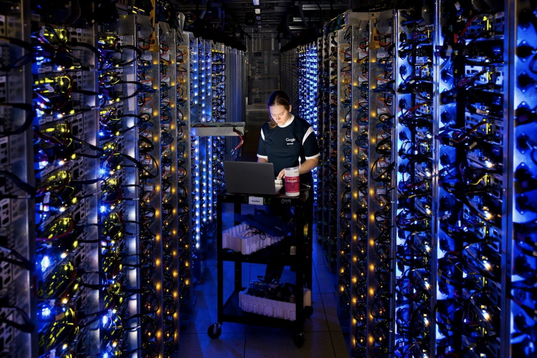

**只有打开了Linux操作系统的大门，才是合格的软件工程师**

对于整个互联网行业，根据W3Techs( 互联网数据资讯中心)数据统计，几乎所有服务端的系统，Linux占据了70%

移动互联网的发展，手机系统基本也就是Android和IOS，而Android基于Linux内核开发。

那些大数据、云计算、容器、人工智能几乎都是基于Linux实现的技术。

`使用Linux服务器的公司`

<!-- OCR_START -->
- 瓜子
- 360
- MI
- 滴滴出行
- 时速云
- l字节跳动
- 二手车直卖网
- WWW
- BITMAIN
- QINIU
- 滴滴一下美好出行
- tenxcloud.com
- 探探
<!-- OCR_END -->

### Linux与Windows的区别

`免费与收费`

* 最新正版Windows10官方售价￥888
* Linux几乎免费（更多人愿意钻研开源软件，而收费的产品出现更多的盗版）

<!-- OCR_START -->
- otu
- ubuntuaubuntu:-S expressvpe connect "unfted States
- Connecttng to USALos Angeles...
- 100.0%
- Conniected.
- ubuntugubuntu:-S
- Windows10家庭版
- Windows
- 电子下载版
- 售价：￥888
- Windows10
- 请选择配置
- 家庭版
- 电子下载版￥888
<!-- OCR_END -->

`软件与支持`

* Windows平台：数量和质量的优势，不过大部分为收费软件；由微软提供技术支持和服务
* Linux平台：大多为开源软件，用户可以修改定制与发布，由于免费没有资金支持，部分软件质量可能欠缺

<!-- OCR_START -->
- 28
- 2015
- binfmt
- 2014
- bluetooth
- Aug
- 18
- bootlogs
- ,sh
- Apr
- bootmisc.
- checkfs.sh
- root
- checkroot-boot
- 1072
- 9290
- 2011
- 379
- Dec
- cron
- Oct
- 25
- 0OT
- 3049
- AD
- 2815
- Sryptdisks
<!-- OCR_END -->

`安全稳定性`

* Windows平台：三天两头修复补丁，仍然会中毒（即便装了360，瑞星，金山毒霸。。。。）
* Linux平台：安全问题很少，无需安装xx杀毒，xx卫士


<!-- OCR_START -->
prevent damage to your computer.
Aproblem has been detected and windows has been shut down to
IRQL_NOT_LESS_OR_EQUAL
restartyour
these steps:
rsoftware
nanufacturer
If
problems continue,disable or remove anynewly 1nstalled hardware
software.
Technica11nformat1on:
**STOP:Ox0000000A（0×00000000,0xD0000002,0x00000001,0x8082C582)
<!-- OCR_END -->

`使用习惯`

* Windows：普通用户基本依靠图形界面操作，鼠标和键盘完成一切需求，上手简单容易
* Linux：兼具图形界面（需要带有桌面环境的发行版Linux）和完全命令行操作，无法使用鼠标，新手入门困难，需要学习后方可使用，熟练后效率极高！


`应用领域`

* Linux：人们日常在Windows上访问的百度、谷歌、淘宝、qq、迅雷（xxxx大片），支撑这些软件运行的，后台是成千上万的Linux服务器，它们时时刻刻进行着忙碌的数据处理和运算
* Windows：可以运行英雄联盟、绝地求生、仙剑三、地下城与勇士、我的世界。。。等等游戏，而Linux开发的游戏几乎很少


### Linux学习难吗

Windows的使用由于美观，便捷，早已深入人心，但是也仅限在PC端耀武扬威，由于Linux的开源、稳定、安全性、开发灵活性，同时因为WIndows系统的自身缺陷，也奠定了Linux操作系统在服务端的位置。

<!-- OCR_START -->
- Microsoft
- Linux
<!-- OCR_END -->

虽说如此，普通用户想要转变Windows的使用，转变使用Linux还是比较费劲的，因为你曾经的点点点...全部变成了`命令行`形式。必须系统的、全面的学习Linux基础知识，方可使用。

<!-- OCR_START -->
find fing
mkdin
100個
umiq uuep uudeeode
UNIX
hgrp chmod chow
df diff dircmp
labelit
最常用的指合
quotaoff rep
tee telnet
uuglist uulog uuname uupick uustat uuto uux vacation vai volcopy wait
we who write ar at batch cal cancel cat cc cd chgrp chmod chown cmp
compress cp cpio crontab crypt csplit cu cut date df diff diremp dispadmin du
echo file find finger fsck ftp grep id join kill labelit In logname lp lpatat
mail mesg mkdir mkfs more mv news nice nohup od paek pcat unpcak
passwd pr priocntl ps pwd quota quotaon quotaoff rep rlogin rm rmdir rsh
rwho shl sleep sort spell split su tail talk tar te
elnet touch tr tty umask
uname uniq uucp uudecode
uname uupick uustat
uuto uux vacat
at batch cal cancel
cat
ontab crypt
espl
fsck fup
grep it
T0Te
mv news
wd pr priocntl
ota
quotaon qu
rm rmdir rsh rwho shl sleep sor
su
tail talk tar tee telnet touch tr tty umask uname uniq uue
ecode
uuencode uuglist uulog uuname uupick uustat uuto uux vacation vai volcopy
wait wall wc who write ar at batch cal cancel cat cc cd chgrp chmod chown
cmp comm compress cp cpio crontab crypt csplit cu cut date df diff dircmp
dispadmin du echo file find finger fsck ftp grep id join kill labelit ln logname
nohup od pack pcat
unpcak passwd pr prio
uotaoff rep rlogin rm
rmdir rsh rwho shl sleep sort spell split su tail talk tar tee telnet toueh tr tty
umask uname uniq uucp uudecode uuencode uuglist uulog uuname uupic
<!-- OCR_END -->

Linux是一个全面、丰富多彩的生态圈，主流的IT技术都是各路大牛基于linux环境开发

* 数据库 MySQL、PostgreSQL
* Web Server Nginx
* 大数据 Hadoop、Spark
* 消息队列 kafka
* 虚拟化技术 kvm
* 容器 Docker、Kubernetes

这些软件你都能够很轻松的找到Linux环境下的使用手册，其他系统平台则不然。

### Linux运维待遇

运维工程师的职责`保障服务器运行稳定，网站7*24小时正常运转，负责Linux服务器部署、不断学习互联网相关运维技术、通过有效手段不断解决运维问题，是集网络、数据库、Web开发、运维、安全等诸多技能的工程师`

<!-- OCR_START -->
linux运维工程师/20k-40k
1．2年以上Linux系统运维工作经验，大型电商网站服务器运维工作优先；
2．对Linux系统管理和应用服务有深入了解，如：Iptables、nagix、LVS等，能够快速实施部署、配置及排
错；
3.熟悉并深入了解Java应用的配置和排错，了解dubbo和springcloud;
4.熟悉并深入了解memcached、redis等缓存应用；
5．熟悉并了解各类数据，如：Mysql、Mongodb、RockeMQ等;
6．熟悉并熟练使用脚本语言，包括：Shell和Python等；
7．具备良好的团队合作精神，有较强的沟通、协调能力和学习能力；
8.做事沉稳细致、具有良好文档编写和文字表达能力；
9.能无障碍阅读英语官方文档。
工作地址
上海－杨浦区－黄兴路221号互联宝地C2栋5楼
查看地图
职位发布者：
聊天意愿?
简历处理?
活跃时段?
樊梦佳
一般
全天
招聘
回复率20%用时--
处理率71%用时1天
早10点最活跃
<!-- OCR_END -->

运维领域不同于其他岗位，涉及专业领域较宽、技能知识可以深度挖掘：

* 系统运维
* 网络运维
* 安全运维
* 数据库运维
* 大数据运维
* 运维开发

运维工程师平均待遇，在猎聘网有数据展示：

<!-- OCR_START -->
- new
- 猎聘
- 首页
- 职位
- 社区
- 海外
- 校园
- 求职助力
- 当前位置：招聘网>Linux就业前景>Linux薪资待遇
- Linux薪资待遇
- 招聘信息
- 薪资待遇
- 岗位职责
- 简历模板
- 月均薪资
- ￥11615
- 10K-12K
- ●取自11542份样本
- 15K-20K
- ●可信度：较高
- 12K-15K
- 8K-10K
- 该数据通过统计企业招聘薪
- 6K-8K
- 资所得，与行业实际标准略
- 其他
- 有偏差，仅供参考。
- Linux月薪分布图
- Linux薪资待遇数据详情
- ●该职位招聘在10K-12K薪资范围占23.0%
- ●该职位招聘在15K-20K薪资范围占19.0%
- 展开√
- 按工作年限统计
- 按学历统计
- 20k
- 15k
- 10k
- 5k
- 1年以下
- 1-3年
- 3-5年
- 5年以上
- 平均
- 大专
- 本科
- 硕士
- ●该职位工作时间1年以下月薪9983元
- ●该职位大专学历月薪8731元
- ·该职位工作时间1-3年月薪12174元
- ●该职位本科学历月薪12543元
<!-- OCR_END -->

### 我适合学Linux吗

* 纯小白
* 计算机爱好者
* IT从事人员/不愿秃头

运维工程师不需要开发人员烧脑的逻辑思维，需要细心严谨的工作态度和运维相关知识技能的学习。

Linux运维行业属于实践性学科，需要大量的动手练习，切身感受Linux黑屏下代码的舞动。

### 如何快速学习Linux

<!-- OCR_START -->
- 一个单位、一个地区面貌的改变，
- 并非一朝一夕之功，而需要沿着正
- 确的目标久久为功、持之以恒。
<!-- OCR_END -->

成功本没有捷径，如果真要说`捷径`，那就是走一条正确的道路，少走弯路，自我驱动努力学习。

<!-- OCR_START -->
- 1.Linux运维基础
- 2.高级核心基础知识
- 3.50台集群项目实战
- 4.千台服务器集群实战
- 1.中级
- 5.shell编程
- 6.数据库MySQL与NOSQL
- 路飞学城Linux云计算
- 7.阿里云计算与容器云
- python自动化开发
- ELK
- 2.高级
- hadoop
- mongoDB集群
- 企业运维实战
- cmdb开发
- 堡垒机开发
<!-- OCR_END -->

### Linux运维的未来

在大数据、人工只能、容器云技术的到来，运维工程师已然是任何一家技术公司必须依赖和大力投入的核心技术部门。

* 容器化加速，快速交付、持续创新、高效运维
* 云计算/IAAS 加速，不再需要维护机房，服务器托管的费劲的活
* devops解决传统运维痛点，促进Dev和ops之间的沟通，提升运维效率，软件能够更快速、频繁、可靠的交付

# 计算机基础

Linux就是一个`操作系统`，如同各位所了解的Windows XP、7、10和Mac OS，至于操作系统是什么，这个时代还有人没听过吗？

## 电脑：辅助人脑的工具

现在的人们几乎无时不刻都在使用`电脑`，不管是`桌面型台式机`、`轻薄笔记本`、`平板电脑`、`智能手机`、这些东西都算是电脑。

虽然咱们接触电脑很多，可你知道电脑内部都有什么吗？不同的电脑应用在哪些地方，let's talk about it。

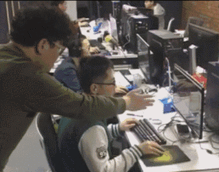

所谓电脑就是一种计算机、也就是`接受使用者输入指令与资料，经由中央处理器的数学与逻辑单元运算处理后，以产生或储存成有用的信息。`因此只要有输入设备、`无论是键盘还是触屏`以及输出设备`电脑屏幕或者打印机列出`，能够产生相关信息，这就是一部计算机。

根据这个定义，以下产品都是计算机

* 小卖部老板娘的计算器
* 隔壁老王不离手的iphone x
* ALex特斯拉车载GPS
* 提款机（ATM）
* 正在学习的你、手中的笔记本
* 新买的Apple Watch

<!-- OCR_START -->
- 输入资料
- 计算机
- 有用信息
<!-- OCR_END -->

`没有什么岁月静好，只是有人替你负罪前行。`

计算机就在背后默默的执行你告知它的任务...

## 计算机与人

<!-- OCR_START -->
- CPU
- 就好像頭好壮壮！主要負责
- 所有相事情的到断與實際
- 主記憶體（RAM）
- 處理的機制等等。
- 将皮膚、眼睛所接收到的資訊暂
- 時記錄起來的地方！提供CPU思
- 考用
- 硬碟
- 就像是人類的記憶一般
- 記錄著種種經驗。也是
- CPU讀取/寫入之處。
- 示卡
- 将各種影像输出的装置·也是
- 由CPU将影像傅導出來！
- 主機板
- 就好像人體的神經一般，将所有
- 键盤、滑鼠、網路卡等
- 的元件連結在一起！
- 就好像手、一般，操著人體
- 舆外界環境的互動！
<!-- OCR_END -->

如果计算机是一个人体，那么计算机也是有胳膊腿的

* `CPU=脑袋瓜子`：每个人会作的事情都不一样（微指令集的差异），但主要都是通过脑袋瓜子来进行判断与控制身体各部分的活动；
* 内存=脑袋中放置正在被思考的数据的区块\`：在实际活动过程中，我们的脑袋瓜子需要有外界刺激的数据 （例如光线、环境、语言等） 来分析，那这些互动数据暂时存放的地方就是内存，主要是用来提供给脑袋瓜子判断用的信息。
* `硬盘=脑袋中放置回忆的记忆区块`：跟刚刚的内存不同，内存是提供脑袋目前要思考与处理的信息，但是有些生活琐事或其他没有要立刻处理的事情， 就当成回忆先放置到脑袋的记忆深处吧！那就是硬盘！主要目的是将重要的数据记录起来，以便未来将这些重要的经验再次的使用；
* `主板=神经系统`：好像人类的神经一样，将所有重要的元件连接起来，包括手脚的活动都是脑袋瓜子发布命令后， 通过神经（主板）传导给手脚来进行活动啊！
* `各项周边设备=人体与外界沟通的手、脚、皮肤、眼睛等`：就好像手脚一般，是人体与外界互动的重要关键！
* `显卡=脑袋中的影像`：将来自眼睛的刺激转成影像后在脑袋中呈现，所以显卡所产生的数据来源也是CPU控制的。
* `电源供应器 （Power）=心脏`：所有的元件要能运行得要有足够的电力供给才行！这电力供给就好像心脏一样，如果心脏不够力， 那么全身也就无法动弹的！心脏不稳定呢？那你的身体当然可能断断续续的～不稳定！


人体在活动的时候，最重要的就是脑袋瓜子，而大脑活动最重要的就是和记忆的交互。

任何外界的接触都必须由记忆记录下来，然后大脑中的CPU再进行判断，再告诉周边的设备，胳膊腿给与响应，如果想要找到以往的经验，那就得去更老的记忆中寻找。

* 人最重要的是脑瓜子
* 计算机最重要的是CPU和内存，CPU的数据来源与内存
* 过往的记忆如同计算机的磁盘，想起来了，就读取

## 计算机硬件

还记得刚毕业时候的你，兴冲冲的去电脑城买电脑...

<!-- OCR_START -->
- ASUS
- 华硕品质·坚若磐石
- eno
- CG
<!-- OCR_END -->

玲琅满目的商品，你反正就认准了一个道理，`只买贵的，不买对的！`

话说这电脑贵，贵在哪里呢？

答案是：`计算机的配置`

* 更强悍的cpu
* 更大的内存
* 固态硬盘
* 游戏鼠标
* 电竞带鱼屏
* 2080TI显卡
* ...

搞起，LOL、绝地求生...

<!-- OCR_START -->
- 网卡
- 声卡
- 显示卡
- 主板
- 内存
- CPU
- CPU风扇
<!-- OCR_END -->

刚才咱们所说的其实就是图上的元件

计算机的组成部分，就以普通家用主机分析，依次有：

* 输入设备，键盘、鼠标
* 输出设备：屏幕
* 主机部分：机箱、机箱内的零件

<!-- OCR_START -->
- 显示器
- 鼠标
<!-- OCR_END -->

躲在主机外壳下的零件

我们主要通过键盘鼠标将数据输入到主机里面，再由主机的处理器进行计算，输出图像或是文本信息输出到屏幕中。

<!-- OCR_START -->
- 电源
- 内存
- 光取致据线
- 光驱
- CPU
- 软驱
- CPU风扇
- 硬盘
- 计算
- 机组
- 肾果手机组成
- 显卡
<!-- OCR_END -->

是不是大学里没修过电脑，没追过学妹，看不懂这些计算机硬件？个人笔记本有如上的配置，服务器亦是一样，只不过性能更强悍而已！

<!-- OCR_START -->
- CPU
- 主机
- 内存
- 硬盘
- 磁盘
- 主板
- 软盘
- 光盘
- 存储
- 键盘
- 硬件
- 闪存
- 鼠标
- 输入设备
- 扫描仪
- 外设
- 显示卡
- 摄像头
- 显示器
- 数码相机
- 输出设备
- 音箱
- 打印机
- 计算机硬件分类
<!-- OCR_END -->

### 其他系统硬件

<!-- OCR_START -->
- 10芯片
- 声卡芯片
- 北桥芯片
- 网卡芯片
- CPU插槽
- PC1-e显卡接口
- CPU12V
- PCI扩展插槽
- 供电
- 时钟芯片
- cmos供电
- 电池
- 电源管理
- 芯片
- bios芯片
- CPU风扇
- 插口
- 开关重启针
- 内存插槽
- IDE硬盘光驱
- SATA硬盘
- 南桥芯片
- 软驱接口
- ATX电源接菌页88网
- 接口
- 光驱接口
- www.huamgye88.com
<!-- OCR_END -->

主板上有很多接口，包括网卡、显卡、磁盘阵列等，以及与游戏玩家最看重的显卡，它控制着游戏画面、色彩、分辨率。

以及存储相关，包括内存条、硬盘、软盘、光驱等。

输入设备指的就是触摸屏、键盘鼠标、VR体感游戏设备


输出设备指的就是如电脑屏幕、打印机、音响、投影仪等等

### 计算机用途

`超级计算机`

超级计算机是运行速度最快的电脑，但是他的维护、操作费用也最高！主要是用于需要有高速计算的计划中。 例如：国防军事、气象预测、太空科技，用在仿真的领域较多。

<!-- OCR_START -->
- 天河二号
- TH-2HighPerfon
<!-- OCR_END -->

`大型计算机`

大型计算机通常也具有数个高速的CPU，功能上虽不及超级计算机，但也可用来处理大量数据与复杂的运算。 例如大型企业的主机、全国性的证券交易所等每天需要处理数百万笔数据的企业机构， 或者是大型企业的数据库服务器等等。


<!-- OCR_START -->
> NYSE
> NYSE
> OYPRESS
<!-- OCR_END -->


`工作站`

工作站的价格又比迷你电脑便宜许多，是针对特殊用途而设计的电脑。在个人电脑的性能还没有提升到目前的状况之前， 工作站电脑的性能/价格比是所有电脑当中较佳的，因此在学术研究与工程分析方面相当常见。

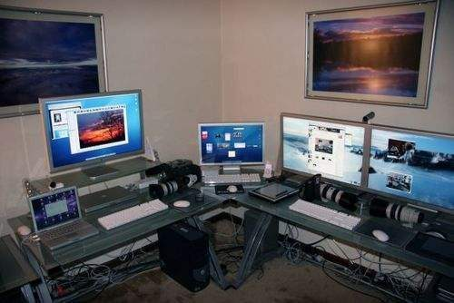

`微型电脑`

属于个人笔记本、台式机等

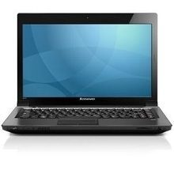

### 计算机单位

`容量单位`

对于计算机而言，只认识一个叫做`二进制`的容量单位，我们称之为`bit`，但是由于`bit`单位太小，计算机又用`Byte`单位来统计

```plain
1 Byte = 8 bit
```

同样的，由于计算机存储越来越大，Byte也太小了，计算机又出现简化的单位KB、MB、GB、TB

<!-- OCR_START -->
- 常用单位的换算关系
- Bit-位
- Byte-字节
- 1Byte=8Bits.
- Kilobyte（KB）一千字节
- 1KB=1,024=210bytes.
- Megabyte（MB)一兆字节
- 1MB=1024KB=220bytes.
- Gigabyte（GB)一千兆字节
- 1GB=1024MB=230bytes.
<!-- OCR_END -->

`速度单位`

CPU的运算单位通常用MHz或者GHz这样的单位，Hz意味`秒分之一`

网络传输数据中以bit为单位，因此网络单位通常是 `**Mbps（Mbits per second） 每秒多少Mbit**`

<!-- OCR_START -->
- 示意图
- 5G网络
- maxis
- 真的要到了！
- 2861.09
- Mbps
- Beeiky
- 5G66%15:50
- Maxis正式开始测试5G网络！最高网速3000Mbps！
<!-- OCR_END -->

如图3000Mbps传输速度理论上是除以8，5G速度也就是375MByte每秒下载速度。

#### 商家坑了你的硬盘吗？

<!-- OCR_START -->
- 磁盘盘片
- 主轴
- 传动轴
- 下方是轴承和马达
- 永磁铁
- 空气过滤片
- 磁头停泊区
- 磁头
<!-- OCR_END -->

或许某位同学遇见过这样的问题：

你买了一块1TB的硬盘，但是格式化后发现只有930GB左右。这是因为计算机单位是1024GB=1TB

而厂家磁盘计算是1000GB=1TB，因此容量在转换的时候，产生了缩水。

### 常见计算机

<!-- OCR_START -->
- 由Xrp数图
- DEL
- 帧帧入戏大有可玩
- 灵越3670高性能台式机
- 以上图片及参数仅供参考，调以实际收货为准
- 关键参数》
- Inspiron3670
- 第九代英特尔酷睿i5-9400处理器
- 256GB固态硬盘+1TB7200RPM机械硬盘
- 8GBDDR4内存
- NVIDIAGeForceGT7102GBDR3独立显卡
- 23.6英寸显示屏
- 无光驱
- 3年整机上门维修服务
- Windows10家庭版
- 内置正版McAfee杀毒软件15个月
- 《九代酷睿强势来袭
- 可搭载第九代英特尔酷睿178核芯8线程处理器*，主频
- 可达3.0GHz，睿频最高可达4.7GHz，高性能带来更畅快使
- 用体验，强悍的任务加载与处理能力，迅如闪电。
- 数据来源于英特尔官方数据，可能因使用环境，软硬件等因素有不同
- 固态硬盘
- 32GB内存
- 可支持512GBM.2PCleSSD固态硬盘，速度比M.2SATA
- SSD快3倍：战斗快人一步，自能掌握先机。
- 内存可升级至32GB，可实现快速加载数据：进入游戏和刚
- 刚落地时再无卡顿，一秒入戏，才能一刻都不误战机。
<!-- OCR_END -->

<!-- OCR_START -->
- 由Xnip截图
- DELL
- GAMING
- G3
- 游戏本
- 外星人智控中心游戏优化
- G模式一键性能提升
- 9th
- Gen
- 外星人控制中心
- G模式
- 9代i7
- 处理器
- NVIDIAGeForce
- 双风扇双铜管
- GTX1650显卡
- 散热
- 外星人智控中心
- 实时游戏优
<!-- OCR_END -->

# cpu

服务器的 CPU 相当于人体的大脑，负责计算机的运算和控制，是服务器性能效率的最核心部件。 常见品牌:Intel，AMD

一般企业里的服务器，CPU 个(颗)数为 2-4 颗，单个(颗)CPU 是四核，内存总量一般是 16G-256G(32G， 64G)

做虚拟化的宿主机(eg:安装 vmware(虚拟化软件)的服务器)，CPU 颗数 4-8 颗，内存总量一般是 48G-128G，6- 10 个虚拟机。

<!-- OCR_START -->
- intel)
- AMD
- Smarter Choi
<!-- OCR_END -->

<!-- OCR_START -->
- 5.0GH
- 8核心|16线程
- 为游戏而生
- 全新特色技术
- 全新首款第九代智能英特尔酷睿”台式机处理器。
- 全新8个内核。
- 全新兼容英特尔Z390芯片组。
- 全新焊接散热材料（STIM）。
- 全新集成式USB3.1Gen2和集成式英特尔Wireless-AC。
- intel
- 16PCl
- DMI3.0
- le3.0
- IntegratedIntel'Wireless-AC
- JSB2.0
- USE
- PCle3.0
- SATA3.0
- IntelLANPH
- 游戏
- 11%（与
- 可将每秒帧数提升多达
- 41%
- （与使用3年的旧电
- 40
- 要时提供至佳性能。
- 创作
- 热门工具进行创作、编辑和共享。
- 代产品相比性能
- 上的视频编辑性能一与前一
- 代产品相
- 性能提升34%
- 超频
- 游戏处理器
- 为游戏玩家带来更快，更沉浸式体验
- 驾驭游戏所向披摩
<!-- OCR_END -->

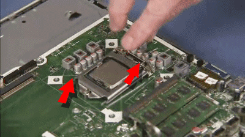

无论是手机还是电脑，整个机器的最核心部件就是`中央处理器(Central Processing Unit, CPU)`

CPU作为特有的功能芯片，芯片内部有微指令集。

CPU工作主要在于调度与运算，在CPU内部主要分为两个单元：`算数逻辑单元`、`控制单元`

* `算术逻辑单元(arithmetic and logic unit)`是能实现多组算术运算和逻辑运算的组合逻辑电路，简称ALU。

<!-- OCR_START -->
- 算术逻辑单元
- 运算器
- 执行指令控制
- ALU
- 时钟
- 操作控制器
- 状态
- 时序产生器
- 反馈
- 存储器
- 累加器
- 指令
- 状态条件寄存器
- 译码器
- 输人输出
- 级冲寄存器
- 指令寄存器
- 数据总线DBUS
- 程序计数器
- 地址总线ABUS
- 地址寄存器
- CPU!
- Ba百科
- 图1-1
- CPU基本组成结构示意图
- 控制器
<!-- OCR_END -->

* `控制单元（Control Unit）`负责程序的流程管理。正如工厂的物流分配部门，控制单元是整个CPU的指挥控制中心，由指令寄存器IR(Instruction Register)、指令译码器ID(Instruction Decoder)和操作控制器OC(Operation Controller)三个部件组成，对协调整个电脑有序工作极为重要。

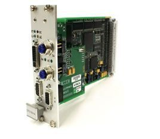

CPU读取的数据都是从内存而来，内存中的数据从键盘等输入单元而来。

CPU处理完毕的数据也必须写回内存中，最后到输出设备

<!-- OCR_START -->
- 操作系统
- CPU
- 控制单元
- 算数逻辑单元
- 键盘鼠标
- 显示器
- 内存
- 输入单元
- 输出设备
- 外置存储
- 硬盘
<!-- OCR_END -->

如图的流向，所有的数据都是经过内存再转出去，这个出/入是CPU发出的控制命令

CPU要处理的数据完全来自于内存，无论是应用程序还是文件读取，都是加载到内存中。

这就是为什么买计算机内存一定要足够大，机器运转就很流畅

<!-- OCR_START -->
- Reno2
- 设计
- 影像
- 视频
- 性能
- Coloros
- 参数
- 8GB+128GB
- 大容量高速度。
- Reno2支持8GB+128GB的高速内存组合，大，才
- 无拘束。
- 搭配LPDDR4X+UFS2.1旗舰规格，在安装应用、拷
- 贝文件、游戏启动时速度再进一步。
- 不仅大，更要快，让你忘记后台和容量，畅快使用。
- 最高
- 最大
- LPDDR4X
- 8GB
- 128GB
- UFS 2.1
- 高速内存
- 超大存储
- 规格
<!-- OCR_END -->

### CPU架构

所有的软件都需要被读取到内存中通过CPU内部的`微指令`调度。

世界现主流的CPU架构是：**精简指令集**`**RISC**`和**复杂指令集**`**CISC**`**两种**

**精简指令集 （Reduced Instruction Set Computer, RISC）**

此类CPU设计中，`微指令`比较精简，每个指令执行时间很短，完成的动作也很单纯，指令的执行性能较差。

常见的`RISC`微指令集CPU有甲骨文`Oracle`公司的SPARC系列、IDM公司的Power Architecture 系列、安某公司的ARM CPU系列。


<!-- OCR_START -->
> ARM
> Cortex"-A15
<!-- OCR_END -->


日常生活离不开CPU，华为的麒麟芯片基于ARM的架构之上，进行了自主研发的芯片，世界上95%的电子产品都是使用的ARM的架构，包括手机与平板，诸如`苹果、高通、三星、华为`、这些企业的产品都是在ARM上发展起来的。


**复杂指令集（Complex Instruction Set Computer, CISC）**

CISC微指令集每个小指令都可以执行一些底层的硬件操作，指令数量多且复杂。

常见的CISC微指令集CPU是大家所熟悉的`AMD、Intel`等`X86`架构的CP。

x86架构的CPU大量使用在`PC个人电脑`上面。

<!-- OCR_START -->
- intel
- x86
<!-- OCR_END -->

想必大家用电脑这么久了，也听过32位、64位这样的词，这是2003年以前Intel开发的x86架构的CPU由8位升级到16、32位、后来最新的64位，个人笔记本CPU也被称作是x86_64的架构。

*这里的位指的是CPU一次能够读取数据的最大量，64位CPU表示一次可以读写64bit的数据，而32位则是32bit的数据，因此从内存中读取数据是有限制的，32位的CPU最多只能搭配4G的内存*


<!-- OCR_START -->
> 32-bit
> 64-bit
<!-- OCR_END -->


不同的x86架构的CPU差异在于微指令集的不同，先进的微指令集可以加速多媒体程序的解析，如4k视频加速，也能加强虚拟化技术(Intel-VT)的性能，再如节省电量损耗，省点电费也是不错的。

<!-- OCR_START -->
- App
- Operating
- Service
- System
- VMwareVirtualizationLayer
- x86Architecture
- CPU
- Memory
- NIC
- Visk
<!-- OCR_END -->

### Intel主板架构

主板是连接各个元件的一个重要主体，在主板上沟通各个元件的芯片组设计尤为重要，很大程度影响计算机性能。

早期的芯片组通常分为两个桥接器来控制各个元件的沟通

<!-- OCR_START -->
- 靠近CPU的是北桥
- CPU插槽
- 三南
- Socket 775 FSB1600
- DDRII
<!-- OCR_END -->

* 北桥：负责链接速度较快的CPU、内存条、显卡等
* 南桥：负责连接速度较慢的硬盘、USB、网卡等

<!-- OCR_START -->
- CPU散热风扇
- AMD
- 北桥
<!-- OCR_END -->

由于CPU需要大量运算，因此发热量很高，必须安装一颗风扇主动进行散热。

不同的CPU型号有着不同的脚位，搭配的主板芯片也不同，因此如果你要升级电脑性能，购买CPU的时候一定要看好插槽是否支持。

目前主流的CPU是以稳定性著称的Intel和速度快的AMD，因此办公类使用Intel较多，游戏玩家机器多是AMD。

### CPU主流封装类型

**封装的类型主要为三种：** **LGA，PGA，BGA**。

`PGA`

PGA的全称叫做“pin grid array”，或者叫“插针网格阵列封装”。

PGA的特点就是针脚在CPU上，而主板上是一片小洞洞（针孔）

<!-- OCR_START -->
- 北海亭
- ng.com
- LORCOO
- B0CKETAMN
<!-- OCR_END -->

`LGA`

LGA的全称叫做“land grid array”，或者叫“平面网格阵列封装”。

LGA去掉了钎料和铜柱针脚，只留触点，针脚是在主板上的。

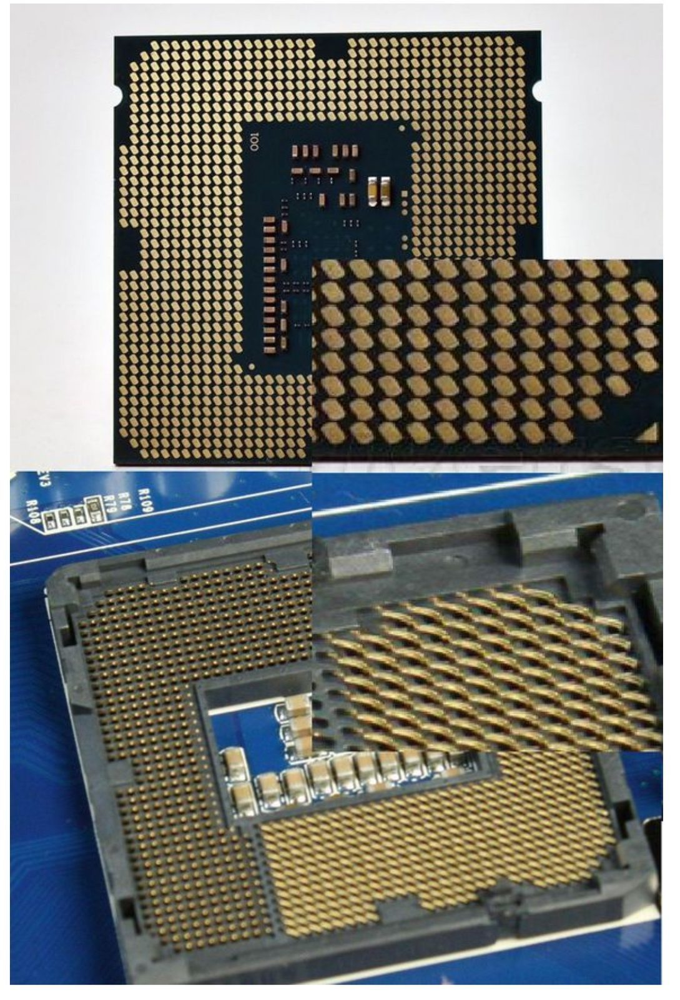

`BGA`

BGA的全称叫做“ball grid array”，或者叫“球柵网格阵列封装”。

BGA封装也就是焊接的。 焊接方法就是通过植球板将焊锡球先用热风枪吹在CPU触点上，然后对准主板PCB加热即可。

<!-- OCR_START -->
- U12
- Bai贴吧|cpu吧
<!-- OCR_END -->

# 内存

<!-- OCR_START -->
- FURY
- DDR4
- DDR4雷电系列骇客神条
- HYPER
- PnP
- 16GB
- 高性价比
- 无需设置
- 大容量
- 的DDR4内存
- 即可实现理想频率
- 单条容量可达16GB
<!-- OCR_END -->

内存是计算机中最重要的部件，它是计算机中的一个中间件。

解决了CPU和硬盘之间速度严重不对等的问题，是CPU和硬盘数据交互的桥梁。

默认情况下，CPU从内存读写数据，内存从硬盘读写数据。

为了提升效率，一般在开机或者软件在运行的时候，会将常用数据直接从硬盘直接读入内存，以待后续CPU使用，提高计算机运行效率。

<!-- OCR_START -->
- CPU数据处理
- CPU
- 内存
- 硬盘
<!-- OCR_END -->

* 内存是电脑的一个临时存储器，它只负责电脑数据的中转而不能永久保存。
* 作用:内存是 CPU 能够直接访问的存储器，CPU 从内存中读取操作指令和数据，又把运算或处\
  理结果送回内存。

### 特点

```
- 内存的容量和处理速度直接决定了电脑数据传输的快慢。
- 一般程序运行的时候会被调度到内存中执行，服务器关闭或程序关闭之后，数据自动从内存中  
```

释放掉。
\- 内存和 CPU、硬盘一起并称为电脑的三大件。

### 内存种类

CPU使用的所有数据都来自于内存(main memory)，无论是软件或是数据，都必须读入到内存CPU方可调用。

我们平时使用的主要叫做`动态随机存取内存`，`（Dynamic Random Access Memory, DRAM）`

此内存特点是必须通电时才可以使用，断电后数据丢失

内存的发展主要是

* DDR
* DDR2
* DDR3
* DDR4

<!-- OCR_START -->
- 主板DDR3内存插槽
- 主板DDR4内存插槽
<!-- OCR_END -->

**品牌**

内存条分为：笔记本、台式机两种

`台式机`

<!-- OCR_START -->
Baidu
经验
jingyan.baidu.com
<!-- OCR_END -->

`笔记本`

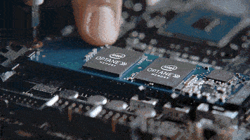

### 多通道设计

电脑卡？加内存就行！

由于所有的数据都放在内存才行，所以内存量是越大电脑越快

但是你得注意两只内存最好相同品牌，相同频率，型号最好都一样，这是因为芯片组厂商将两个内存汇聚到一起，好比一只是64位，两只就是128位，这是`双通道`的概念。

双通道下内存下，数据是`同步读/写`到一对内存中，能够提升整体性能

<!-- OCR_START -->
- 第一条内存插入
- 这个黄色内存插
- 槽里。
- 第二条内存插
- 入这个黄色内
- 存插槽里。
<!-- OCR_END -->

### 程序、进程、守护进程


程序：python / golang语言编写的代码文件，存放在磁盘中的静态数据

进程：已经执行的程序，进程数据已经加载到内存中

守护进程：daemon，伴随着主任务的结束就随之结束的程序

* 程序-----电脑里的片
* 进程-----双击打开了片
* 守护进程---片持续不断的在播放
* 关闭正在看的片，内存中的数据被释放

### 内存数据提升用户体验

`明星爆出热门新闻，微博点赞评论疯长`

`门户(大网站 )极端案例:`

大并发写入案例(抢红包、微博) 高并发、大数据量“写”数据:会把数据先写到内存，积累一定的量后，然后再定时或者定量的写到磁盘

(减轻磁盘的压力，减少磁盘 IO Input/Output 磁盘的输入/输出 磁盘读写)，最终还是会把 数据加载到内存中再对外提供访问。

特点: 优点:写数据到内存，性能高速度快(微博，微信，SNS，秒杀)。

缺点:可能会丢失一部分在内存中还没有来得及存入磁盘的数据。 解决数据不丢的方法:

* 服务器主板上安装蓄电池，在断电瞬间把内存数据回写到磁盘。
* UPS(一组蓄电池)不间断供电(持续供电 10 分钟，IDC 数据中心机房-UPS 1 小时)。 UPS\
  (Uninterruptible Power System/Uninterruptible Power Supply)，即不间断电源，是将蓄电池(多 为铅酸免维护蓄电池)与主机相连接，通过主机逆变器等模块电路将直流电转换成市电的系统 设备。
* 选双路电的机房，使用双电源、分别接不同路的电，服务器要放到不同的机柜、地区。

<!-- OCR_START -->
- 高并发写入
- 写入内存
- 写入硬盘
- WEB服务器
- 内存
- 硬盘
<!-- OCR_END -->

`中小企业案例`

对于并发不是很大、数据也不是特别大的网站，读多写少的业务，会先把数据写入到磁盘，然后再通过程序把写到磁盘的数据读入到内存里，再对外通过读内存提供访问服务。

<!-- OCR_START -->
- 二、中小企业读取写入过程
- WEB服务器
- 硬盘
- 内存
<!-- OCR_END -->

核心思想就是，由于内存特性，将数据放入内存读写，比磁盘要快的多。

# 显卡

<!-- OCR_START -->
- 16:游戏加速新动力
- 在新一代游戏中甚至还能更快
- TURING着色器
- Turing着色器支持浮点和整数运算井发执行
- 采用自话应着色技术和新的统一内存架构
- 可以在如今的游戏中实现惊人的性能提升，得益于Tuing架构
- 在需求更高的游戏中可获得更出色的性能表现
- 性能表现
- 让您在新款游戏中尽享出色游戏体验
- 专业的直播效果
- 斗鱼上直播时，获得令人惊
- 针对OpenE
- （OBS）进行了优化
- GEFORCEEXPERIENCETM
- 基称GeF
- orce显卡的理想搭档
- NVIDIAANSEL
- 专业级艺术作品
- ROGSTRIX
- GTX1660TI
- R6G-GAMING
- 脱颖而出
- 大的散热能力造就不要协
<!-- OCR_END -->

* 是计算机中最重要的图像输出设备
* 是将计算机系统所需要的显示信息进行转换驱动显示器，并向显示器提供逐行或隔行扫描信号，控制显示器的正确显示
* 是连接显示器和个人计算机主板的重要组件
* 是“人机对话”的重要设备之一

显卡对于图像的显示至关重要，因为图像的显示会占用内存，因此显卡一般都会有一个内存的容量，这个显存容量的大小影响到屏幕分辨率与色彩的深度。

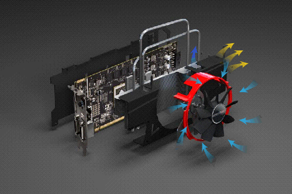

早期一些3D运算工作还是交给CPU完成，但是CPU的任务太多，无力再去处理大量的图形计算，显卡厂家在显卡中嵌入了GPU加速的芯片。

对于一些大型3D游戏，要求显卡的运算能力也很高，数据传输也是越快越好。


### 挖矿与显卡

简单来说，挖矿就是**利用芯片进行一个与随机数相关的计算**，得出答案后以此换取一个虚拟币。

虚拟币则可以**通过某种途经换取各个国家的货币**。

运算能力越强的芯片就能越快找到这个随机答案，理论上单位时间内能产出越多的虚拟币。

由于关系到随机数，只有恰巧找到答案才能获取奖励。

有可能一块芯片下一秒就找到答案，也有可能十块芯片一个星期都没找到答案。

越多芯片同时计算就越容易找到答案，内置多芯片的矿机就出现了。

而多台矿机组成一个“矿场”同时挖矿更是提高效率。

而矿池则是由多个“个体户”加入一个组织一起挖矿，无论谁找到答案挖出虚拟币，所有人同时按贡献的计算能力获得相应的报酬，这种方式能使“个体户”收入更稳定。

<!-- OCR_START -->
- Conlir
- 平洋电脑网
<!-- OCR_END -->

举一个通俗的例子：

* 我在一张纸上随便写一串数字，给出部分提示，谁猜对就给他奖金（挖矿）
* 聪明的人根据提示能作出更多猜测（计算能力）
* 有人出钱请许多人回来一起猜测（矿场）
* 有人召集大家一起猜测，无论谁猜到，按照每个人猜测次数比例分配奖金（矿池）

由这个例子可以看出，越聪明的人能够计算的越快，机会也越大，收益也更多。

因此比特币挖矿所需的计算芯片也需要更强大，芯片也从CPU 升级到GPU，计算能力更强，相应的越容易挖出虚拟币。

### 显卡参数

如果你不是为了挖矿或是游戏使用，仅仅作为网络服务器，入门级的简单显卡也就足够，因为很少会进行图像处理，且linux服务器大多都是无图形化的。

显卡与主机连接的接口如下：

<!-- OCR_START -->
- S-Video
- 金手指
- DVI
- ZOL.COm.cn
- VGA
- 美村在线
<!-- OCR_END -->

<!-- OCR_START -->
- DVI接口
- 柯在线
- VGA
- DP
- com.cn
- HDMI
<!-- OCR_END -->

* VGA，模拟信号传输，主要为15针的连接，较老
* DVI，常与液晶屏幕的连接
* HDMI， 主流连接方式可以同时传输图像与声音，广泛应用在电视屏幕与台式机
* Display port，未来传输方式主流，可以同时传输图像与声音

# 磁盘

我们的生活已经离不开电脑，日常工作，娱乐，影音都离不开计算机，它能够帮我存储大量的资料

* 学籍档案
* 工业数据
* 股票资产
* 英语资料

这些数据都是需要被记录与读取，能够存储很久的，存储介质有

* 机械硬盘
* 固态硬盘
* 软盘
* DVD
* U盘
* ...

<!-- OCR_START -->
- 产品参数
- 产品名称
- WDRed红盘
- 产品型号
- WD80EFAX
- WesternDigital.
- www.wdc.com
- 产品容量*
- 8TB
- SATA6GOSNXHA500
- 尺寸规格
- 3.5英寸
- NASware”3.0
- 产品接口
- SATA6Gb/s
- 高速缓存*
- 256MB
- 9MOEINTRAILAND
- 性能级别
- 5400RPM等级
- ntywilbevoidil
- -318)
- WDRed"
- NASHandDeve
- ONOTOIER
- 尺寸（mm）
- 147*101.6*26.1
- 重量（kg）
- 0.65
- *用于表示存储容量时，1百万兆字节（TB）=1万亿字节。
- 根据操作环境，可访问的总容量将有所不同。
- 用于表示传输速率时，1兆字节/秒（MB/S）=1百万字节每秒
- *重量会因规格、容量、以及内部部件的不同而有所改变。
<!-- OCR_END -->

**由于计算机在工作时，CPU、输入输出设备与存储器之间要大量地交换数据，因此存储器的 存取速度和容量也是影响计算机运行速度的主要因素之一。**

**特别是在服务器优化场景，硬盘的性能 是决定网站性能的重要因素。**

磁盘就是永久存放数据的存储器，磁盘上也是有缓存的(芯片)。

常用的磁盘(硬盘)都是 3.5 英寸的(sas,sata)，常规的机械硬盘，读取(性能不高)性能比内存 差很多，所以，在企业工作中，我们才会把大量的数据缓存到内存，写入到缓冲区，这是当今互联 网网站必备的解决网站访问速度慢的方案。

目前常用的硬盘分为`机械硬盘`和`固态硬盘`两种，相比来说，`固态硬盘速度快但是容量较小，价格高`；

机械硬盘`速度慢但是容量大，价格便宜。`

### 磁盘接口

磁盘的接口：IDE，SCSI，SAS，SATA，IDE(SCSI 退出历史舞台)

磁盘的类型：`机械磁盘`和 `ssd 固态硬盘`

性能与价格：SSD(固态)>SAS> SATA

### 机械硬盘

<!-- OCR_START -->
- 空气过滤片
- 磁盘
- 主轴（马达
- 电机与轴承
- 在其下方）
- 磁头
- 音图马达
- 磁头臂
- 永磁铁
<!-- OCR_END -->

常见的硬盘内部构造如图，由圆形盘片、磁头臂、磁头、主轴马达组成。

我们电脑的数据都是写入在磁性的磁盘片上，`对磁盘进行读写的操作其实是这样`

* 主轴马达让磁盘转动
* 机械手臂可以伸展让磁头在磁盘上进行读写的动作


### 盘片数据

<!-- OCR_START -->
- 磁區
- (sector)
- 開始磁軌
- (track)
- 第0磁區
- 结束磁軌
- Sectoro
<!-- OCR_END -->

磁盘数据有三个核心概念，分别是

* 扇区`sector，512bytes`
* 磁道`track`
* 柱面`Cylinder`

盘片在设计时就是在`盘片的同心圆上，切出一个个的小区块，这些小区块整合成一个圆形，让机器手臂上的磁头去存取。`

这个小区块，称之为`扇区 sector`

在同一个同心圆里的扇区组合而成的圆称之为`磁道 track`

磁盘里面可能会有多个盘片，因此所有盘片上的同一个磁道组成所谓的`柱面cylinder`

**数据写入方式**

由于同心圆的外圈比较大，因此更大程度利用磁盘空间，外围的圆拥有更多的扇区，因此数据读写通常由外圈到内圈的形式。

### 磁盘分区

<!-- OCR_START -->
- MBR+DPT
- ④号扩展分区
- 引导
- 数据
- 假设这是0头0道1扇区
- 扩展
- 分区
- 的分
- 55AA
- 磁盘分区表放大
- (data)
- 信息
- 区表
- 主分区
- 逻辑分区①
- 放大的0头0道
- 扇区
- (logical)
- (primary)
- /dev/sdal
- /dev/sda2
- /dev/sda3
- /dev/sda5
- /dev/sda6
- 扩展分区（extended）
- 446bytes
- 64bytes
- 2bytes
- 主引导记录
- 分区结束
- MBR所在地
- 标识55AA
- 磁盘分区表
- (MBR)
- (DPT)
- 硬盘主引导记录
- 0磁头0磁道1扇区
- (512bytes)
<!-- OCR_END -->

### 磁盘接口

磁盘也是主板上的一部分，通过接口连接，为了不断的提升传输速度，接口也分为了SATA、SAS、IDE与SCSI等。

外接式磁盘也包括USB、eSATA等接口，目前IDE已经被SATA取代，而SCSI被SAS取代。

那么主流的磁盘接口如下，SATA、USB、SAS

**SATA接口**

SATA是Serial ATA的缩写，即串行ATA。它是一种电脑总线，主要功能是用作主板和大量存储设备(如硬盘及光盘驱动器)之间的数据传输之用。


<!-- OCR_START -->
> SATA数据接口
> SATA电源接口
<!-- OCR_END -->


SATA是市场目前主流的接口，在机械硬盘上使用广泛，且主要分三代：

| 版本 | 速度(MBytes) |
| --- | --- |
| SATA 1.0 | 150 |
| SATA 2.0 | 300 |
| SATA 3.0 | 600 |

由于机械磁盘的物理特性，实际速度一般极限在150~200Mbytes/s

#### **SAS接口**

<!-- OCR_START -->
- SAS主瑞口
- SAS背板接口
- 供电接脚
- SAS元余端口
- Serial attached SCSl
- 供电触脚
- SAS/SATA主端口
- SATA端口
- Serial ATA
<!-- OCR_END -->

SAS(Serial Attached SCSI)即串行连接SCSI，是新一代的SCSI技术，和现在流行的Serial ATA(SATA)硬盘相同，都是采用串行技术以获得更高的传输速度，并通过缩短连结线改善内部空间等。

SAS是`并行SCSI接口之后`开发出的全新接口。

此接口的设计是为了`改善存储系统的效能、可用性和扩充性`，并且提供与SATA硬盘的兼容性。

能为带宽要求更高的主流服务器和企业级存储提供所需的`高性能、高扩展性`和`可靠性`。

SAS满足了诸如网上购物和银行交易等事务性数据应用环境中对`高频率和即时`、`随机数据存取`的需求。

**SAS和SATA磁盘在价格上差别很大，SATA磁盘价格低廉，SAS有着更高的存储附加属性，很多企业在数据中心还是使用的SAS磁盘，并且企业级磁盘阵列卡的连接插槽也是由SAS接口开发的**

#### **USB接口**

USB即通用串行总线是连接计算机系统与外部设备的一种串口总线标准，也是一种输入输出接口的技术规范，被广泛地应用于个人电脑和移动设备等信息通讯产品，并扩展至摄影器材、数字电视(机顶盒)、游戏机等其它相关领域。

最新一代是USB 3.1，传输速度为10Gbit/s，三段式电压5V/12V/20V，最大供电100W ，新型Type C插型不再分正反。

如果磁盘是外接式的接口，那么与主板连接的就是USB接口了，

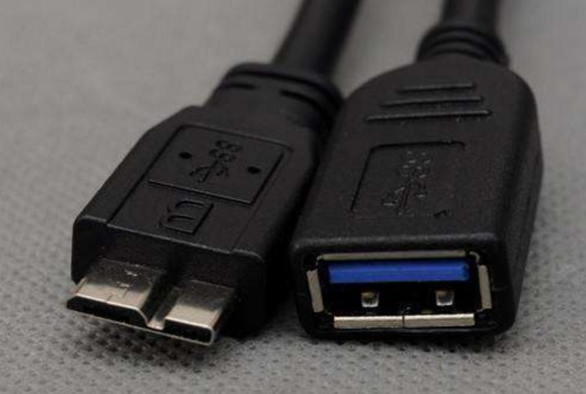

传统USB2.0速度较慢，新一代USB3.0则快很多了

| 版本 | 速度MB/s |
| --- | --- |
| USB 1.0 | 1.5 |
| USB 2.0 | 60 |
| USB 3.0 | 500 |
| USB 3.1 | 1000 |

以上只是一个理论数值，USB 3.0真实读写速度差不多在100Mbytes而已了

#### 固态磁盘

<!-- OCR_START -->
- 由Xnip截图
- 至少快3倍
- 可扩展固态硬盘
- 512GBPCleNVMeSSD，采用更先进的PCle×4接口，将单个
- 传输通道扩展为4个，较SATASSD读写速度至少快3倍。
- 可扩展卡
- 15.6全高清大屏
- 超窄边大视野
- 4月6日，星期二
- 全贴合技术
- 6.52mm窄边框
- 康宁第三代大猩猩玻璃
- 81.5%屏占比
- FHD全高清屏
- 170°广视角
- 140°屏幕开合
- 72%NTSC色域
<!-- OCR_END -->

传统机械磁盘由于在启动的时候，需要驱动马达转动磁盘片，然后再确定数据再哪个扇区，再让磁头正确的读取数据，整个读取速度延迟是很高的！并且机械磁盘由于马达转动，工作时候会有震动伴随着些噪音。

因此厂商就用闪存制作成大容量的设备，依旧使用SATA或是SAS的接口，此类设备没有磁头与盘片，都是内存，和传统机械磁盘不同（Hard Disk Drive ，HDD），称之为固态硬盘（Solid State Disk 或 Solid State Driver, SSD）。

**HDD在运行时需要转动，所以抗震能力和性能比较弱，而且待机转动时功耗也更高一些（停转除外），读写时会有明显“吱”的声响。**

**SSD没有机械结构转动，所以抗震能力很强，性能也更好，同时功耗也低很多，工作时没有声音。**

SSD通过内存直接读写，数据几乎没有延迟且很快速

SSD的缺陷是有写入次数限制，通常SSD寿命为两年，可以用RAID机制保护SSD。

### 设备文件

Linux在设计时是一切接文件

#### 零散文件整理

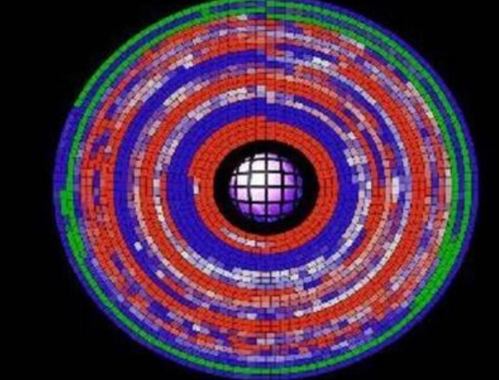

<!-- OCR_START -->
- 磁盘碎片整理程
- 口X
- 磁盘碎片整理程序
- 文件（）操作（A）
- 已完成碎片整理WIXP（C：）
- 无法对这个卷上的某些文件进行碎片整理。
- 可用空间
- 请检查这些文件的碎片整理报告。
- YINXPC:）
- 3.10GB
- 33%
- 应用程序①：）
- 9.13GB
- 97%
- WORKALIFE(E:)
- 9.31GB
- 99%
- OE（F:)
- 查看报告
- 关闭（）
- 9.25GB
- 新加卷（G：）
- 233GB
- 进行碎片整理前预计磁盘使用量
- 分析
- 碎片整理
- 暂停
- 停止
- 零碎的文件
- 连续的文件
- 无法移动的文件可用空间
<!-- OCR_END -->

想必同学们曾经使用过这个碎片整理功能，那会你可知道为什么要碎片整理吗？

磁盘在使用一段时间之后，由于反复写入与删除文件，磁盘的空闲扇区会分散到不同的物理位置上，从而使得文件不是在连续的扇区中，这样的话，大部分情况下是读写一堆零散文件，磁头到底要转多久才能找到数据呢？导致降低了磁盘的访问速度。因此偶尔进行碎片整理，减少文件碎片，能够提升体统速度。

**因此在测试磁盘性能时候，用每秒读写操作次数 （Input/Output Operations Per Second, IOPS）表示磁盘性能，数值越大，性能越高**

### Raid卡

磁盘阵列（Redundant Arrays of Independent Drives，RAID），有“独立磁盘构成的具有冗余能力的阵列”之意。

磁盘阵列是由很多块独立的磁盘，组合成一个容量巨大的磁盘组，利用个别磁盘提供数据所产生加成效果提升整个磁盘系统效能。

利用这项技术，将数据切割成许多区段，分别存放在各个硬盘上。

磁盘阵列还能利用同位检查（Parity Check）的观念，在数组中任意一个硬盘故障时，仍可读出数据，在数据重构时，将数据经计算后重新置入新硬盘中。

<!-- OCR_START -->
- 产品结构分析
- RAID是一种把多块独立的物理硬盘按不同方式组合起来形成一个逻辑
- 硬盘，从而提供比单个硬盘有着更高的性能和提供数据余的技术。
- 散热片
- 强劲芯片
- （在下面）
- 针脚
- C1
- C2
- C3
- MiniSAS接口
- 挡片
- 镀金金手指插槽
<!-- OCR_END -->

**你有很多土地，单独管理不方便，且效率很低，整合到一块，统一管理，发挥最大性能。**

RAID有多种整合方式

* 0
* 1
* 5
* 10
* ...

### Raid级别

互联网公司一般都会购买Raid卡

冗余从好到坏：raid1、raid10、raid5、raid0

性能从好到坏：raid0、raid10、raid5、raid1

成本从低到高：raid0、raid5、raid1、raid10

* 单台服务器，很重要，盘不多，系统盘 raid1。
* 数据库/存储服务器，主库 raid10，从库 raid5\ raid0(为了维护成本，raid10)
* web 服务器，如果没有太多数据的话，raid5,raid0(单盘)
* 有多台，监控\应用服务器，raid0,raid5。

<!-- OCR_START -->
- 最少需要几块硬盘
- 安全冗余
- 可用容量
- 性能
- 使用场景
- 举例
- 所有硬盘容量
- 不要求安全
- 数据库从库
- 条带
- Raid 0
- 1
- 最低
- 读写最快
- 的和
- 只要求速度
- 存储从库
- 一半（两块硬
- 写入速度慢
- 只追求安全性
- 镜像
- Raid 1
- 只能有2块
- 100%
- 系统盘监控服务器
- 盘容量之和)
- 读取OK
- 对于速度没
- 对于速度安全
- 损失一块盘的
- 写入性能不好
- Raid 5
- 最多损坏一块
- 对于速度要求
- 普遍数据库，存储
- 容量
- 读取速度OK
- 不高
- 损失所有硬盘
- 读写很快
- 对于安全和性
- Raid 10
- 可以损坏一半
- 高并发或高访问量
- 一半的容量
- 能都要
- 数据库主库存储
<!-- OCR_END -->

# 主板

主板是计算机中最重要的平台部件，也是电脑中最大的集成电路板，它直接或间接的将所有的设备连接在一起。主板的好坏直接决定了计算机速度的快慢和运行稳定。

同时主板也提供了大量的设备接口，为计算机扩展功能提供了可能。

主板一般为矩形电路板，上面安装了组成计算机的主要电路系统，一般有BIOS芯片、I/O控制芯片、键和面板控制开关接口、指示灯插接件、扩充插槽、主板及插卡的直流电源供电接插件等元件。

现在主板一般情况下都集成了三卡(显卡、网卡、声卡)，也有的只集成了声卡和网卡。

<!-- OCR_START -->
- S/PDIF数字音频输出
- 千兆网卡
- 结构说明
- （光纤/同轴）
- RTL8111DL
- inteD
- (inteb
- intel
- 7.1声道高保真音频
- Chipset
- CORE
- (VIAVT1708S)
- Veta
- Pentium"
- Celeron"
- PCIE2.0x16
- 显卡插槽
- HDMI SPDIF插针
- 用于连接HDMISPDIF
- 音频输出
- 兼容前端总线
- 1600/1333/1066/80
- OMHz处理器
- 打印口插针
- 可搭配打印口排线扩展
- 打印口
- nSReck
- FSB1600
- P43ME
- DDR21200
- 支持双通道DDR2
- 1200/1066/800/667
- 6组SATA接口
- 1组1DE接口
- 24针电源接口
<!-- OCR_END -->

<!-- OCR_START -->
- I/O面板
- 10芯片
- 音效芯片
- 网络芯片
- CPU供电
- 电路
- PCIeX1插槽
- PCIeX4插槽
- 电源插座
- PCIeX16插槽
- PCI 插槽
- 时钟发生器
- CPU插座
- 软驱插座
- 北桥芯片
- PCB基板
- BIOS芯片
- TP35D2-A7
- 南桥芯片
- SATA插座
- IDE插座
- 内存插槽
- 图3-3
- ATX主板的组成结构
<!-- OCR_END -->

### BIOS

很多游戏玩家都喜欢玩“超频”，将CPU的倍频或者外频通过主板的BIOS功能调整为更高的频率，从而提升性能。

但是由于频率非正常速度，可能会造成死机蓝屏。

<!-- OCR_START -->
- BIOS SETUP UTILITY
- Haln
- Snart
- Aduamced
- u Homiton
- Boot
- Securitn
- Smart Settings
- Duerclocking
- danage to yoe
- Save Changes and Exit
- notherboard
- It should be
- Load IoS Defaults
- your oun ris
- Load Performance Setup Default (IpE/SATA)
- experee
- Load Performance Setup fHCI
- Options
- Load Performance Setup RAID
- Press Enter
- Load Pouer Saulng Setup Def
- 3.60GHz
- 3.70Gz
- E2 Ouerclocking
- 3.80GHz
- 3.90Glz
- Load DptIelzed CPu OC Sett
- 4.00GHz
- Select
- Chanvje
- General
- Load De
<!-- OCR_END -->

这样的修改动作是被记录到主板上的一个CMOS的芯片上，这个芯片需要额外的供电才可以达到记录功能，这就是为什么主板上有一块电池的原因！


<!-- OCR_START -->
> 就是这个东西
<!-- OCR_END -->


这个BIOS是在你开机的时候，按下【DEL、F12、F11】等按键进入的一个系统画面

BIOS（Basic Input Output System）是一套程序，这套程序是写死到主板上面的一个内存芯片中， 这个内存芯片在没有通电时也能够将数据记录下来，那就是`只读存储器（Read Only Memory, ROM`）。

BIOS 对电脑系统来讲是非常重要的，因为他掌握了系统硬件的详细信息与开机设备的选择等等。

Tip：

在学习虚拟化技术的时候，如果不支持VT，也是在BIOS这里修改CPU的设置的！

# 电源

机箱用来装载计算机硬件，对硬件起到防尘，保护的作用，也有相应的防静电等作用

1）抗静电

2）机箱质量

3）机箱散热

4）机箱质量不易变形

5）机箱空间能满足扩展需求

<!-- OCR_START -->
- 由Xnip截图
- 航嘉S400
- 产品
- 参数
- VIDEORECORDERWITHDVRINDUSTRYSERVERCHASSISINDUSTRIAL
- CHASSISCANBEAPPLIEDTOPCTYPEHARDDISKRECORDERINDUSTRIAL
- CONTROLSYSTEM.CTISYSTEM
- 0产品参数
- PARAMETERS
- 产品品牌：航嘉S400
- 产品结构：4U标准19上架式，重钢型结构，前面板带锁
- 产品尺寸：宽425MM×高177MM×深450MM
- 产品颜色：黑色皱纹烤漆
- 产品重量：净重8.5KG、毛重10.5KG
- 适用主板：普通PC主板、各种工控板
- 驱动器：可支持8个3.5硬盘，2个光驱位
- 面板
- ：2个前置USB2.0接口，1个电源开关，
- 1个复位开关，各开关都配有指示灯，
- 1个门锁
- 扩展空间：7个PCI扩展槽
- 风冷系统：前面有1带过滤网的120vm风扇用于进风，
- 电源上的2个60m风扇用于出风（需另配）：
- （S532增加一只80m风扇）
- 报警系统：8Q扬声器
- 电源支持：300W、350W、400W、500WAT、
- ATX电源及服务器电源
- 工作温度：0℃一70℃
- 防震
- ：光驱架和硬盘架均配有防震装置，确
- 保设备在恶劣环境下稳定工作，防震压条可防止插
- 入板卡振动
- 相对湿度：5%一95%无凝露
<!-- OCR_END -->

### 电源供应器（Power）

在机箱内，有一个大大的特盒子，包含着很多电源线，这个就是电源供应器了。

计算机硬件中的CPU、内存、主板、硬盘等等都必须得供电方可使用，随着硬件性能逐步提升，性能较差的电源很可能造成供电不足，导致内存数据丢失等等问题。

* 服务器电源就是指使用在服务器上的电源(POWER)，它和 PC(个人电脑)电源一样，都是 一种开关电源。
* 服务器电源按照标准可以分为 ATX 电源和 SSI 电源两种。ATX 标准使用较为普遍，主要用于台 式机、工作站和低端服务器;而 SSI 标准是随着服务器技术的发展而产生的，适用于各种档次的服务器。
* 服务器电源相当于人体的心脏，保障电源供应，要选择质量好的电源。
* 生产中一般单个服务器核心业务最好使用双电源 **AB** 线路。
* 如果集群(一堆机器做一件事)的情况可以不用双电源。

<!-- OCR_START -->
- 750W
- DD
- 50W
- 服务器电源
<!-- OCR_END -->

### UPS不间断电源

UPS（Uninterruptible Power System/Uninterruptible Power Supply），即不间断电源，是将蓄电池（多为铅酸免维护蓄电池）与主机相连接，通过主机逆变器等模块电路将直流电转换成市电的系统设备。

主要用于给单台计算机、计算机网络系统或其它电力电子设备如电磁阀、压力变送器等提供稳定、不间断的电力供应。

当市电输入正常时，UPS 将市电稳压后供应给负载使用，此时的UPS就是一台交流式电稳压器，同时它还向机内电池充电；

当市电中断（事故停电）时， UPS 立即将电池的直流电能，通过逆变器切换转换的方法向负载继续供应220V交流电，使负载维持正常工作并保护负载软、硬件不受损坏。

UPS 设备通常对电压过高或电压过低都能提供保护。

<!-- OCR_START -->
- 由Xnip 截图
- UPS连接示意图
- 市电插座
- 路由器
- UPS
- 稳如泰山
- ADIS
- 交换机
- 如遇输出插孔不够时，
- 可如下图接上排插
- 坚如磐石
- 排插
<!-- OCR_END -->

<!-- OCR_START -->
- 婴然断电带来的图扰！
- 有了无间断电源，断电？有什么好怕！
- 游戏来不及保存
- 数据文件来不及保存
- 没灯了设计稿不能完成
<!-- OCR_END -->

<!-- OCR_START -->
- 产品参数
- ON-LINE
- —3K-
- 最大功率
- 3000VA2400W
- 输入电压
- 135VAC-280VAC
- 输出电压
- 220VAC+2%
- 转换时间
- 0秒
- 输出波形
- 纯正弦波
- 12V7AH，六只
- SANEHN
- 湿度
- 0-90%且0-40°℃
- 28千克
- 小于40分贝
- 规格尺寸
- 430*190*320
- 充电时间
- 六小时充到90%
<!-- OCR_END -->

# 网卡

### 有线网卡

网卡，又称网络适配器或网络接口卡（NIC），英文名为Network Interface Card。

在网络中，如果有一台计算机没有网卡，那么这台计算机将不能和其他计算机通信，它将得不到服务器所提供的任何服务了。

当然如果服务器没有网卡，就称不上服务器了，所以说网卡是服务器必备的设备，就像普通PC（个人电脑）要配处理器一样。

平时我们所见到的PC机上的网卡主要是将PC机和LAN（局域网）相连接，而服务器网卡，一般是用于服务器与交换机等网络设备之间的连接。

<!-- OCR_START -->
- 由Xnip截图
- 宝贝详情
- 产品信息
- 产品型号：LREC9212PT
- 产品名称：千兆双电口服务器网卡
- 插口类型：PCIEX1
- 接口类型：RJ45/网口
- 产品芯片：Inte182576EB
- 传输速率：10/100/1000Mbps
- 传输方式：铜缆
- 适用网络类型：千兆以太网
- LREC9212PT
- 千兆双电口服务器网卡特性：
- 1、每一端口可发送和接收16条队列，16条队列接收端调节（RSS）在多个处理器系统可尽量减
- 少CPU的使用
- 2、支持每一端口的8个虚拟机设备队列（VMDq）
- 3、支持直接高速缓存访问（DCA）
- 4、硬件加速可以从主处理机分载任务，该控制器可以用来分载TCP/UDP/IP校验和TCP分段任务
- 5、支持英特尔I/0AT2.0
- 散热片
- 散热片性能好，可降低网卡温度，
- 提高工作稳定性，工作时间长
- SS"
- 线路设计
- 插槽金手指
- 采用成对、平行、等长的差
- 金手指5麦沉金，接触可靠，
- 分线，减少丢包率，信号
- 损耗小，可有效降低丢包和数
- 线和地之间回路面积小，减
- 据延时。
- 少信号之间串扰的可能性
<!-- OCR_END -->

### 无线网卡

无线网卡和普通电脑网卡作用一样，用来连接局域网。

它只是一个信号收发的设备，必须在已有无线网络环境下才能够使用，和有线网卡的区别只是不通过有线连接，采用无线信号连接的网卡设备。

无线网卡区分：

* USB无线上网卡\
  

<!-- OCR_START -->
- MERCURY
- Baldu百科
<!-- OCR_END -->

* 台式机的PCI无线接口网卡\
  

* 笔记本电脑内置的 MINI-PCI 无线网卡。\
  

### 常见网卡故障

现在大多数笔记本都自带了无线网卡设备，在没有有线环境下，无线网卡能够更灵活的接入wifi上网，在网络出现故障的时候，该如何解决呢

1.网卡是否插好

确保不同接口类型的网卡，比如插入到位，确保网卡与计算机插槽之间紧密接触，否则计算机无法识别。

2.USB驱动是否正常

在使用USB无线网卡时，确保USB端口打开，驱动正常工作，计算机能够识别USB硬件，方可使用

3.无线客户端无法上网

* 确保无线网卡在无线网络范围内，举例合适，否则信号很弱
* 确保无线网络正常供电，否则无线客户端也无法连接
* 确保正确的IP网络配置

# 服务器基本知识

## 什么是服务器

服务器也就是台计算机而已，同样的由CPU、主板、内存、磁盘、网卡等硬件组成。

不同的是，服务器的定义是`高性能计算机`，作为网络中的节点，处理网络通信中的数据、信息，是网络时代的根本灵魂。

服务器通常指`一个管理资源且未用户提供服务的计算机`，通常服务器分为`文件服务器`、`数据库服务器`、`应用程序服务器`。

服务器对比普通PC、`稳定性`、`安全性`、`性能`、`可扩展性`、`可管理性`等方面要求更高。

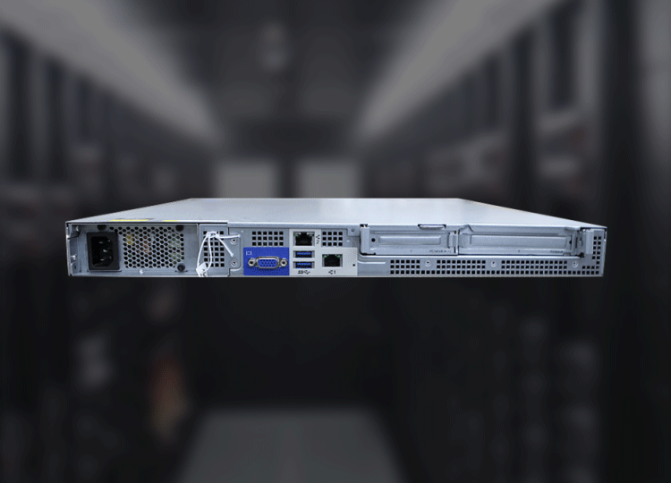

我们能够7\*24小时的访问淘宝网，这是因为服务器强大的稳定性，它甚至可以十年不关机，因为你无法保证某一个时段没有用户在购买商品，并且能够承受大量用户并发的访问网站压力。

因此服务器的硬件配置更加强悍，需要大量的进行计算、处理，服务器可以安装多个处理器、更多的内存、更多的磁盘，因此主板、机箱都较大。

<!-- OCR_START -->
- 开关
- 用来连接显示器
- DELn
- PowerEdgeR720
- IOI
- DD
- DVD光驱
- USB
<!-- OCR_END -->

<!-- OCR_START -->
- 由Xnip截图
- 详细参数
- 基本资料
- 产品型号
- PowerEdgeR720(XeonE5-2630/4x8GB/8x300GB)
- 产品类型
- 机架式
- 产品结构
- 2U
- 处理器
- CPU系列
- 至强处理器E5系列，Intel
- CPU核心
- 四核
- 总线规格
- QPI7.2GT/s
- CPU型号
- XeonE5-2630
- CPU主频
- 2.3GHz
- 三级缓存
- 15M
- 标配CPU数目
- 1个
- 最大CPU数目
- 2个
- 主板
- 主板芯片组
- IntelC600
- 内存
- 标配内存
- 4x8G
- 内存插槽数
- 24
- 最大内存容量
- 768G
- 存储
- 硬盘接口类型
- SAS
- 标配硬盘
- 2.5英寸8×300G
- 最大硬盘容量
- 24TB
- 硬盘转速
- 10000转
- 存储控制器
- PERCH710卡
- 硬盘热插拔
- 支持
- 其它
- 网卡
- 4个千兆网卡
- 机箱托架
- 最大支持8块3.5英寸硬盘/16块2.5英寸硬盘
- 电源
- 兄余电源/导轨
- WindowsServer2008R2SP1，x64（含Hyper-Vv2)
- WindowsSmallBusinessServer2011
- 操作系统
- SUSELinuxEnterpriseServer
- Red HatEnterpriseLinux
<!-- OCR_END -->

服务器对于屏幕显示的要求很低，基本上都是无显示器，通过`远程管理`的方式即可，因此服务器基本都是集成显卡，而无需单独装显卡。

我们很难见识到真实的物理服务器，因为服务器一般都防止在`机房`托管，闲人免进，比如appe.com苹果公司网站的数据就放在了 `云上贵州`的服务器机房。

<!-- OCR_START -->
云上贵州
贵州
创新突破期（2018-2020年号
<!-- OCR_END -->


### 服务器分类

**主机种类**

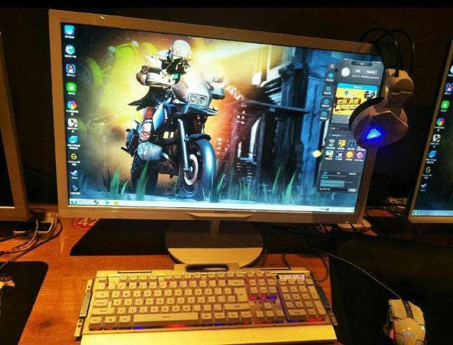


<!-- OCR_START -->
> PIXELS
<!-- OCR_END -->


`按规模分：`

* 大型服务器，计算中心、企业级
* 中级服务器，公司部分级
* 小型服务器，入门级服务器，个人云服务器

`按用途分：`

* web服务器
* 数据库服务器
* 文件服务器
* 邮件服务器
* 视频点播服务器

#### 服务器以外形分类

<!-- OCR_START -->
- 塔式
- 机架式
- 4U
- 2U
- 1U
- · 1U=1.75英寸= 4.445cm
<!-- OCR_END -->

`**机架式服务器**`

* 机架式服务器的外形看来不像计算机，而像“抽屉”，有 1U、2U、4U 等规格。
* 机架式服务器安装在标准的 19 英寸机柜里面。这种结构的多为功能型服务器。

机架式服务器如下图所示。

<!-- OCR_START -->
- 图
- 机架式服务器
<!-- OCR_END -->

`**刀片式服务器**`

* 刀片式服务器是指在标准高度的机架式机箱内可插装多个卡式的服务器单元，实现高可用和高密度。
* 打个形象的比喻，刀片式服务器就像是箱子里摆放整齐的书。

每一块"刀片"实际上就是一块系统主板。

它们可以通过"板载"硬盘启动自己的操作系统，如`Windows NT/2000、Linux·`等，类似于一个个独立的服务器，在这种模式下，每一块母板独立运 行自己的系统，服务于指定的不同用户群，相互之间没有关联，因此相较于机架式服务器和机 柜式服务器，单片母板的性能较低。

不过，管理员可以使用系统软件将这些母板集合成一个服 务器集群。在集群模式下，所有的母板可以连接起来提供高速的网络环境，并同时共享资源， 为相同的用户群服务。在集群中插入新的"刀片"，就可以提高整体性能。而由于每块"刀片"都是热插拔的，所以，系统可以轻松地进行替换，并且将维护时间减少到最小。

<!-- OCR_START -->
- 图
- 刀片式服务器
<!-- OCR_END -->

`**塔式服务器-更强壮的服务器**`

* 塔式服务器(Tower Server)应该是最容易理解的一种服务器结构类型。
* 因为它的外形以及结构都跟立式 PC 差不多，当然，由于服务器的主板扩展性较强、插槽也多出一堆，所以个头比普通主板大一些，因此塔式服务器的主机机箱也比标准的 ATX 机箱要大，一般都会预留足够的内部空间以便日后进行硬盘和电源的冗余扩展。
* 但这种类型服务器也有不少局限性，在需要采用多台服务器同时工作以满足较高的服务器应用需求时，由于其个体比较大，占用空间多，也不方便管理，便显得很不适合。

<!-- OCR_START -->
- 图
- 塔式服务器
<!-- OCR_END -->

### 服务器尺寸

* 服务器以高度分类
* 高度指的是以Unit做统计单位，1U=1.75英寸=4.445 cm

### 互联网常见服务器品牌

* DELL（大多数公司在用）
* HP
* IBM（百度，银行，政府）（贵）
* 浪潮
* 联想

<!-- OCR_START -->
- DELL
- Lenovo
- inspur浪潮
- 戴尔激发无限
<!-- OCR_END -->

### 服务器品牌与型号

<!-- OCR_START -->
- 时间
- 1U
- 2U
- 2010年以前
- 18501950
- 28502950
- 2010-2013年
- R410R610
- R710
- 2014-2016年
- R420/430R620/630
- R720/R730
<!-- OCR_END -->

*Dell服务器品牌*

```plain
https://www.dell.com/zh-cn/work/shop/category/servers
```

`Dell R720`

<!-- OCR_START -->
- DELL
- PowerEdge R720
- DVD
<!-- OCR_END -->

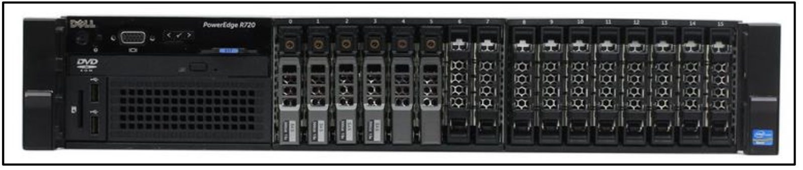

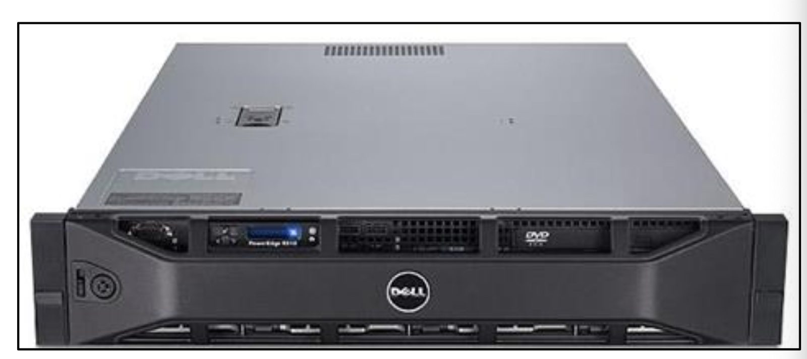

`Dell R620`

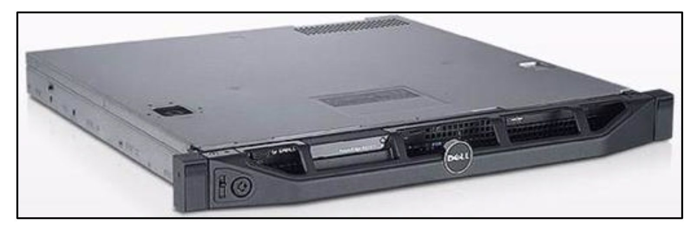

*IBM品牌*

* 1U服务器 ：3550/m3 3550/m5
* 2U服务器：3650
* 3U服务器：3850
* 8U服务器：3950

互联网公司在去IOE活动下，已不常用IBM品牌

```plain
IOE =  IBM Oracle Emc  （甲骨文 数据库  Emc存储设备）
```

*HP品牌*

DL380G7

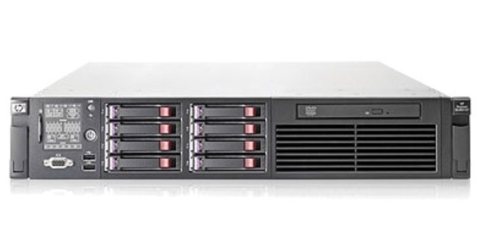

### 机房托管

首先，为什么说要将服务器放入机房而不是直接放在办公室或企业小机房，有以下几个原因：

1、企业的机房无法保证365天7\*24小时都供电充足；

2、企业的机房无硬件防护，病毒容易入侵；

3、企业的机房接入的宽带或光纤是经过分流的民用带宽，速度慢；

4、企业必须以较高成本雇佣较高技术能力的工程师进行长期维护；

5、企业无法为服务器提供一个真正的机房运营环境，服务器使用寿命会缩短，并且容易出现故障，造成数据流失或损毁。

那么，真正的数据机房正是为了服务器更好、更稳、更快、更安全运行而建设的，IDC数据中心服务器托管业务它能提供更适合服务器运行的环境，能提供更强有力的安全保障，能提供更高效的带宽资源。

其次，在当下机房林立的IDC环境中，选择哪些机房做服务器托管会更安全，性价比更高呢？

1、专业的电信或联通或双线机房更能保证稳定；

2、位于国家CHINA NET骨干网上的机房更能保证速度；

3、技术和业务口碑都比较好的机房更能提供好的技术服务和安全防护

<!-- OCR_START -->
- 由Xnip截图
- 灵活
- 广泛交换
- 世纪互联
- Switch
- ChinaNet九大骨干节点
- Hybrid IT
- 高能数据中心
- 智能
- 依托世纪互联数据中心大底盘
- 全连接，全面提升数据中心服务能力
- 与众不同的机柜，实现数据价值的再升级
- 自建自营
- 全连接
- 立即预约>
- 敏捷
- 创新
- 定制机房
- 技术解决方案
- 行业解决方案
- 客户案例
- CUSTOM-BUILTDC
- TECH-SOLUTIONS
- INDUSTRYSOLUTIONS
- CUSTOMERCASES
- 汇聚行业优质资源和国内一流数据中心建设
- 以世纪互联数据中心资源为基础，为用户提
- 针对不同行业提供定制方案，为用户提供高
- 世纪互联为近5000家知名企业客户提供业
- 定制化团队，以行业先驱..
- 供完善的技术产品及服务
- 可用、高稳定性、可弹性.
- 界优质的数据中心相关产品...
- READMORE>
- 客户&合作伙伴
- TBM
- Microsoft
- WARBURGPINCUS
- BAO ZUN
- HUAWEI
- COD
- ppLive
- CCTV.
- 中国中央电视台
- TOYOTA
- 一视频
- ww.pplive.com
- 斗鱼
- 淘宝网
- 美团网
- 芒果tv
- 酒仙网
- DOUYU.COM
- Taobao.com
- meituan.com
<!-- OCR_END -->

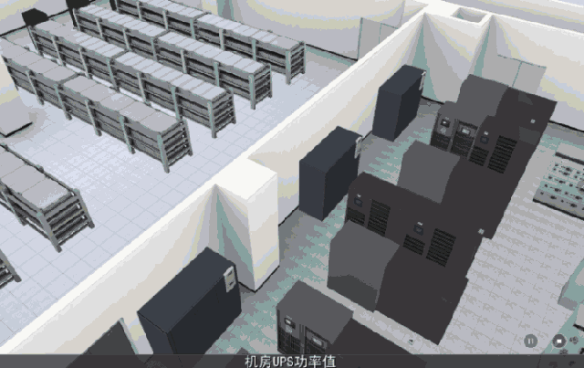

### 云服务器

**1、云服务器操作及升级更方便**

传统服务器中的资源都是有限的，如果想要获得更好的技能，只能升级云服务器，所谓“云”，就是网络、互联网的意思，云服务器就是一种简单高效、安全可靠、处理能力可弹性伸缩的计算服务。其操作起来更加简便，如果原来使用的配置过低，完全可以在不重装系统的情况下升级CPU、硬盘、内存等，不会影响之前的使用。

**2、云服务器的访问速度更快**

云服务器又叫云主机。其使用的带宽通常是多线互通，网络能够自动检测出那种网络速度更快，并自动切换至相对应的网络上进行数据传输。

**3、云服务器的存储更便捷**

云服务器上能够进行数据备份，因此即使是硬件出现问题，其数据也不会丢失。并且，使用云服务器只需要服务商后期正常维护就可以了，为企业解决了很多后顾之忧。

**4、云服务器安全稳定**

云服务器是一种集群式的服务器，可以虚拟出多个类似独立服务器的部分，具有很高的安全稳定性。而且云服务器是支持异节点快速重建的，即使计算节点异常中断或损坏，也可以在极短时间内通过其他不同节点重建虚拟机，且不影响数据完整。

**5、云服务器有更高的性价比**

云服务器是按需付费的，与传统服务器相比，具有更高的性价比，而且并不会造成资源浪费。

当然，除开这些显著特点以外，更重要的是要选择一个知名的服务商，这样云服务器才能更加简便高效，不会给企业带来不必要的损失。

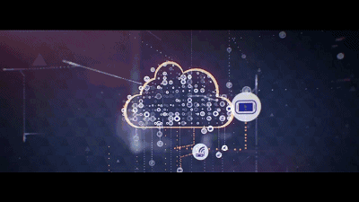

<!-- OCR_START -->
所有服务器的CPU
所有服务器的硬盘
所有服务器的内存
A用户提出：我想要8个CPU还有10个硬盘200G内存的服务器
B用户提出：我想要2个CPU还有5个硬盘20G内存的服务器
<!-- OCR_END -->

### 服务器与远程管理卡

远程管理卡是安装在服务器上的硬件设备，提供一个以太网接口，使它可以连接到局域网内，提供远程访问。

<!-- OCR_START -->
- PCMCIA
- 插槽
- 闪烁
- LED（绿色）
- 紧急启动跳线
- 错误ED（黄色）
- 调试跳线
- 外部电源
- VT100连接器
- 输入控制器
- RJ-45连接器
- 连接器
- PCI挡板
- 卡式连接器
- 电池连接器
- IPMB连接器
- ICMB连接器
<!-- OCR_END -->

远程管理卡有服务器自带的，也有独立的。

服务器自带的远程管理卡，可以关机、开机，但是看不到开关的显示过程。

所以，选择独立的远程管理卡，稍微 200 块钱。

有了管理卡就可以快速恢复服务。

大客户有 KVM 远程管理，特大客户会有自己的人员驻扎机房。

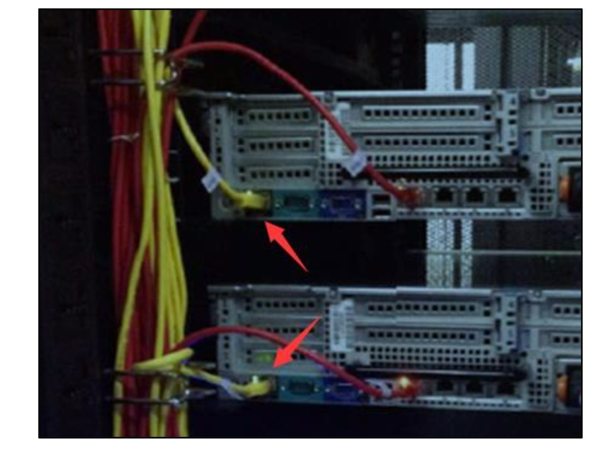

### 机房服务器布线

<!-- OCR_START -->
- 35
- 电车
<!-- OCR_END -->

`专业和非专业`


<!-- OCR_START -->
> X
> 由Xnip截图
<!-- OCR_END -->


<!-- OCR_START -->
由Xnip截图
终于知道为什么网速不稳定还老掉线了～~~
<!-- OCR_END -->

# 软件基本知识

### 计算机数据记录单位

由于计算机是通过电位记录信息的，因此仅能识别 0 和 1 这两个数字，故而在计算机内部，数据都 是以二进制的形式存储和运算的，下面列出来计算机数据的常用计量单位。

二进制，是计算技术中广泛采用的一种数制，由德国数理哲学大师莱布尼茨于1679年发明。

二进制数据是用0和1两个数码来表示的数。它的基数为2，进位规则是“逢二进一”，借位规则是“借一当二”。

当前的计算机系统使用的基本上是二进制系统，数据在计算机中主要是以补码的形式存储的。

计算机中的二进制则是一个非常微小的开关，用“开”来表示1，“关”来表示0。

`1.位(bit)` 计算机存储数据的最小单位为位(bit)，中文称为`比特`，一个二进制位表示 0 或 1 两种状态，要表 示更多的信息，就要把多个位组合成一个整体，一般以 8 位二进制数组成一个基本单位。

`2.字节(Byte)` 字节是计算机数据处理的基本单位。字节(Byte)简记为 B，规定一个字节为 8 位，即 1B=8b 每个 字节都是由 8 个二进制位组成。

3.数据换算关系

```plain
1Bite=8bit，1KB=1024B，1MB=1024KB，1GB=1024MB
1TB=1024GB，1PB=1024TB，1EB=1024PB，1ZB=1024EB
```


早期的电脑利用真空管是否通电的特性，如果通电就是1，没通电就是0，言传至今，只有0/1的环境称之为二进制（binary）。

在线进制转换：<https://tool.lu/hexconvert/>

十进制是`逢十进一，在个位数归零，十位数加一`

二进制是`逢二进一位`

*十进制数的含义*

```plain
3456 = 3*10**3 + 4*10**2 + 5*10**1 + 6*10**0
```

*二进制数与十进制*

```plain
100100  = 1*2**5 + 0*2**4 + 0*2**3 + 1*2**2 + 0*2**1 + 0*2**0 = 36
```

*十进制转二进制*


<!-- OCR_START -->
> 2&8
> 244
> S
<!-- OCR_END -->


```plain
十进制数88转换二进制位 1011000
```

### 字符编码

请看<https://www.cnblogs.com/alex3714/articles/5465198.html>

### 软件编译运行

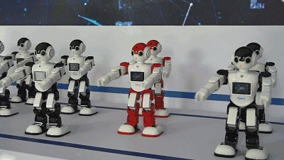

计算机插上电之后，只是一堆机器而已，想要赋予灵魂，还得安装软件、操作系统。

对于计算机而言只认识0或1 ，计算机进行运算靠的是CPU，CPU是有自己的`微指令`的，想要计算机帮你干活，就得发送微指令集，CPU才能听懂去执行。

* 撰写机器语言
* 了解所有硬件参数，操控硬件指令
* 不可移植性，每个CPU的微指令集都是独特的，更换机器无法运行
* 专一性，如果程序员针对浏览器开发，换成视频播放器，又得重新编写

由于直接撰写机器语言太过于恐怖，电脑科学家设计出人类看得懂的程序语言，通过`编译器`将人类可以理解的语言再翻译为机器看得懂的语言，如此一来，学习撰写程序就容易多了。

*从字面上看，“编译”和“解释”的确都有“翻译”的意思，它们的区别则在于翻译的时机安排不大一样。*

*打个比方：假如你打算阅读一本外文书，而你不知道这门外语，那么你可以找一名翻译，给他足够的时间让他从头到尾把整本书翻译好，然后把书的母语版交给你阅读；*

*或者，你也立刻让这名翻译辅助你阅读，让他一句一句给你翻译，如果你想往回看某个章节，他也得重新给你翻译。*

<!-- OCR_START -->
- 老男孩教育|只与精英同行
- PYTHON是什么样的语言？
- 人能读懂的代码
- print("hello world!")
- 编译型
- 解释型
- 字节码
- 执行前一次性
- 编译=翻译
- 翻译
- 虚拟机
- 机器能读懂的代码
- 01010101010111001111100011...
- 边执行边翻译
- cpu运行
<!-- OCR_END -->

### 操作系统

<!-- OCR_START -->
活动
终端
星期日20：27
inuxidc@linuxidc
文件（F）缩辑（E）查看（V）搜索（5）终端（T）帮助（H）
llnuxldcglinuxtdc:-S cat linuxidc.com.txt|cowsay
你好，Linux公社www.linuxidc.com
(00)1
11----W1
Llnuxtdcgllnuxtdc:-Scatlinuxidc.com.txt|xcowsay
<!-- OCR_END -->

操作系统（Operating System, OS）其实也是一组程序， 这组程序的重点在于管理电脑的所有活动以及驱动系统中的所有硬件。

操作系统的核心功能就是让CPU可以开始判断逻辑与运算数值、 让内存可以开始载入/读出数据与程序码、让硬盘可以开始被存取、让网卡可以开始传输数据、 让所有周边可以开始运行等等。

总之，硬件的所有动作都必须要通过这个操作系统来达成就是了。

### 系统调用

操作系统通常会提供好一组开发接口给程序员，程序员只需要遵循该接口就可以轻易的调用系统功能，例如python语言调用相关函数，操作系统核心就会主动将python语言转换成系统可以理解的语言。


<!-- OCR_START -->
> 用户程序
> 系统调用
> API
> 内核
<!-- OCR_END -->


* 操作系统核心是参考硬件的调用，所以同一个操作系统不能在不同的硬件架构下运行，好比Windows操作系统无法直接给手机使用
* 操作系统只是在管理硬件资源，如CPU、内存、文件系统等，只是让计算机处于准备工作的状态，想要达到如游戏、视频、浏览器等需求，还得额外开发软件
* 应用程序的开发是针对操作系统提供的接口，因此市面上有多种操作系统，也存在不同的开发人员、如Mac OS、IOS、windows等

> 更新: 2023-01-10 09:31:30  
> 原文: <https://www.yuque.com/chengkanghua/awf7cm/rtvhbk>